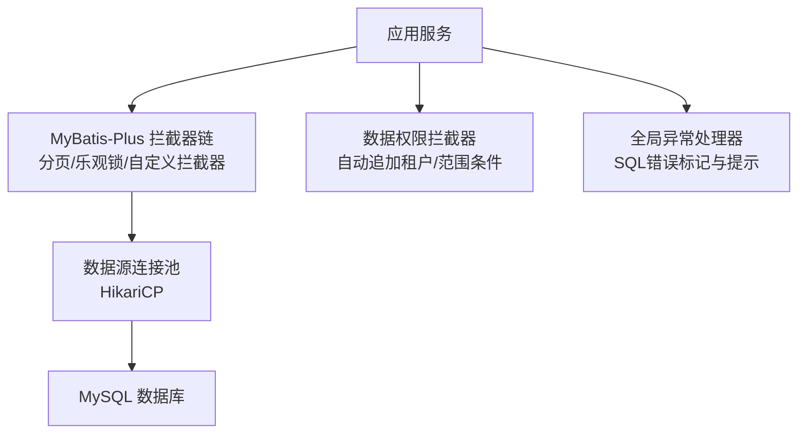
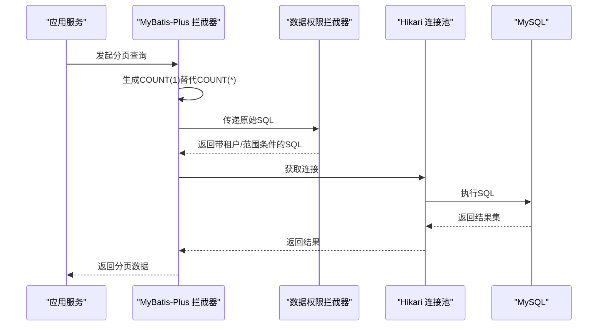
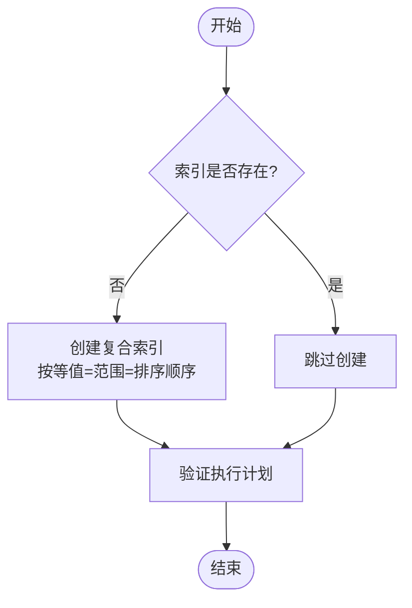
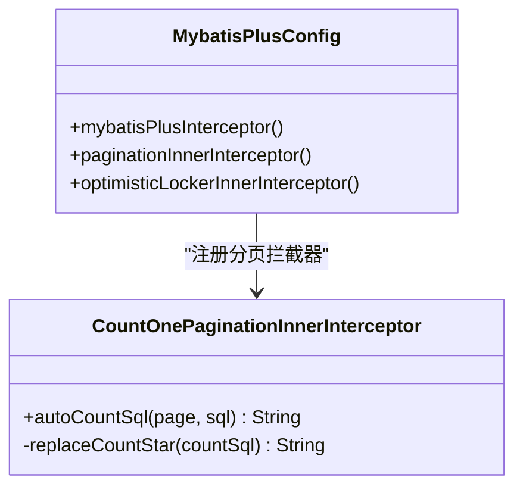
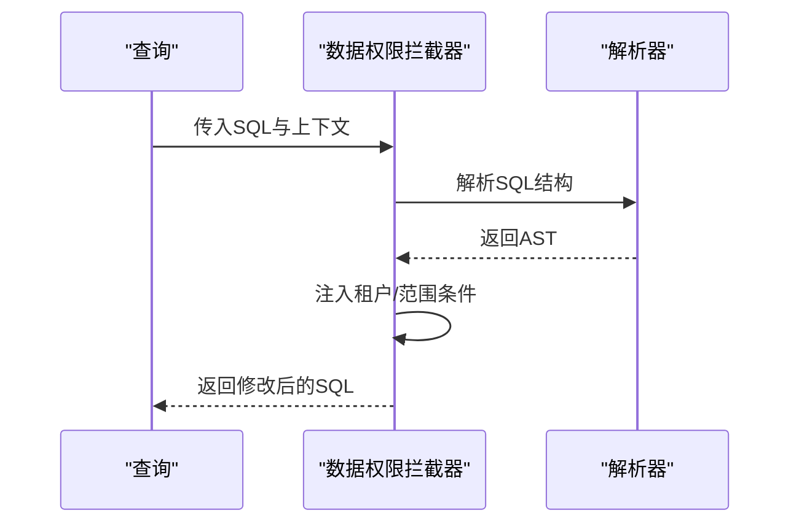
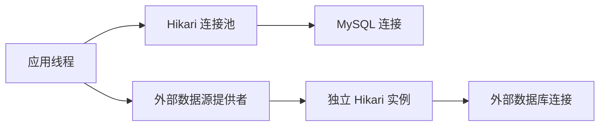
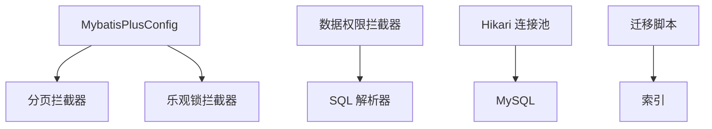

# SQL优化与索引

<cite>
**本文引用的文件**
- [application-datasource.yml](file://docker-forge-admin/application-datasource.yml)
- [V1.0.135__optimize_flow_task_list_queries.sql](file://forge-server/db/migration/V1.0.135__optimize_flow_task_list_queries.sql)
- [V1.0.139__index_user_list_and_flow_candidate_queries.sql](file://forge-server/db/migration/V1.0.139__index_user_list_and_flow_candidate_queries.sql)
- [MybatisPlusConfig.java](file://forge-server/forge-framework/forge-starter-parent/forge-starter-orm/src/main/java/com/mdframe/forge/starter/orm/config/MybatisPlusConfig.java)
- [CountOnePaginationInnerInterceptor.java](file://forge-server/forge-framework/forge-starter-parent/forge-starter-orm/src/main/java/com/mdframe/forge/starter/orm/interceptor/CountOnePaginationInnerInterceptor.java)
- [DataScopeInterceptorTest.java](file://forge-server/forge-framework/forge-starter-parent/forge-starter-datascope/src/test/java/com/mdframe/forge/starter/datascope/handler/DataScopeInterceptorTest.java)
- [JdbcDataSourceProvider.java](file://forge-server/forge-framework/forge-plugin-parent/forge-plugin-data/src/main/java/com/mdframe/forge/plugin/data/support/JdbcDataSourceProvider.java)
- [GlobalExceptionHandler.java](file://forge-server/forge-framework/forge-starter-parent/forge-starter-core/src/main/java/com/mdframe/forge/starter/core/exception/GlobalExceptionHandler.java)
- [SysRegionMapper.xml](file://forge-server/forge-framework/forge-plugin-parent/forge-plugin-system/src/main/resources/mapper/SysRegionMapper.xml)
- [execution-log.md（全表检索查询收敛）](file://code-copilot/changes/query-full-scan-hardening/execution-log.md)
</cite>

## 目录
1. [简介](#简介)
2. [项目结构](#项目结构)
3. [核心组件](#核心组件)
4. [架构总览](#架构总览)
5. [详细组件分析](#详细组件分析)
6. [依赖关系分析](#依赖关系分析)
7. [性能考量](#性能考量)
8. [故障排查指南](#故障排查指南)
9. [结论](#结论)
10. [附录](#附录)

## 简介
本技术文档围绕 Forge Admin 的 SQL 优化与索引实践，系统阐述索引设计原则、慢查询分析方法、查询语句优化技巧、大数据量查询优化方案、数据库性能监控工具使用以及常见 SQL 问题的诊断与解决方案。内容基于仓库中的迁移脚本、ORM 配置、数据权限拦截器、连接池配置与异常处理等实际实现进行归纳总结，帮助读者在真实工程背景下落地高性能 SQL 实践。

## 项目结构
本项目在数据库层通过 Flyway 风格的迁移脚本管理索引变更；在 ORM 层通过 MyBatis-Plus 拦截器实现分页与计数兼容；在运行时通过 Hikari 连接池提供连接能力；在业务层通过数据权限拦截器自动注入租户与范围条件；在异常层统一识别并提示数据库相关错误。

图表来源
- [MybatisPlusConfig.java:38-59](file://forge-server/forge-framework/forge-starter-parent/forge-starter-orm/src/main/java/com/mdframe/forge/starter/orm/config/MybatisPlusConfig.java#L38-L59)
- [CountOnePaginationInnerInterceptor.java:14-31](file://forge-server/forge-framework/forge-starter-parent/forge-starter-orm/src/main/java/com/mdframe/forge/starter/orm/interceptor/CountOnePaginationInnerInterceptor.java#L14-L31)
- [application-datasource.yml:1-21](file://docker-forge-admin/application-datasource.yml#L1-L21)
- [DataScopeInterceptorTest.java:21-83](file://forge-server/forge-framework/forge-starter-parent/forge-starter-datascope/src/test/java/com/mdframe/forge/starter/datascope/handler/DataScopeInterceptorTest.java#L21-L83)
- [GlobalExceptionHandler.java:66-90](file://forge-server/forge-framework/forge-starter-parent/forge-starter-core/src/main/java/com/mdframe/forge/starter/core/exception/GlobalExceptionHandler.java#L66-L90)

章节来源
- [application-datasource.yml:1-21](file://docker-forge-admin/application-datasource.yml#L1-L21)
- [MybatisPlusConfig.java:38-59](file://forge-server/forge-framework/forge-starter-parent/forge-starter-orm/src/main/java/com/mdframe/forge/starter/orm/config/MybatisPlusConfig.java#L38-L59)
- [CountOnePaginationInnerInterceptor.java:14-31](file://forge-server/forge-framework/forge-starter-parent/forge-starter-orm/src/main/java/com/mdframe/forge/starter/orm/interceptor/CountOnePaginationInnerInterceptor.java#L14-L31)
- [DataScopeInterceptorTest.java:21-83](file://forge-server/forge-framework/forge-starter-parent/forge-starter-datascope/src/test/java/com/mdframe/forge/starter/datascope/handler/DataScopeInterceptorTest.java#L21-L83)
- [GlobalExceptionHandler.java:66-90](file://forge-server/forge-framework/forge-starter-parent/forge-starter-core/src/main/java/com/mdframe/forge/starter/core/exception/GlobalExceptionHandler.java#L66-L90)

## 核心组件
- 连接池与数据源：通过 Hikari 配置主库连接池参数，控制最大连接数、空闲超时、连接生命周期等，保障高并发下的稳定访问。
- 分页与计数优化：自定义分页拦截器将 COUNT(*) 替换为 COUNT(1)，提升复杂嵌套查询下解析稳定性，避免解析失败导致的分页异常。
- 数据权限与租户隔离：数据权限拦截器在查询中自动注入租户与范围条件，确保多租户场景下的数据隔离与正确性。
- 索引迁移：通过迁移脚本对高频查询路径添加复合索引，覆盖典型过滤与排序字段，减少回表与扫描成本。
- 异常处理：全局异常处理器识别 SQL 语法、完整性约束、锁等待、死锁等错误，便于快速定位问题。

章节来源
- [application-datasource.yml:1-21](file://docker-forge-admin/application-datasource.yml#L1-L21)
- [CountOnePaginationInnerInterceptor.java:14-31](file://forge-server/forge-framework/forge-starter-parent/forge-starter-orm/src/main/java/com/mdframe/forge/starter/orm/interceptor/CountOnePaginationInnerInterceptor.java#L14-L31)
- [DataScopeInterceptorTest.java:21-83](file://forge-server/forge-framework/forge-starter-parent/forge-starter-datascope/src/test/java/com/mdframe/forge/starter/datascope/handler/DataScopeInterceptorTest.java#L21-L83)
- [V1.0.135__optimize_flow_task_list_queries.sql:1-51](file://forge-server/db/migration/V1.0.135__optimize_flow_task_list_queries.sql#L1-L51)
- [V1.0.139__index_user_list_and_flow_candidate_queries.sql:1-50](file://forge-server/db/migration/V1.0.139__index_user_list_and_flow_candidate_queries.sql#L1-L50)
- [GlobalExceptionHandler.java:66-90](file://forge-server/forge-framework/forge-starter-parent/forge-starter-core/src/main/java/com/mdframe/forge/starter/core/exception/GlobalExceptionHandler.java#L66-L90)

## 架构总览
下图展示了从应用到数据库的关键链路：MyBatis-Plus 拦截器链负责分页与计数改写，数据权限拦截器注入过滤条件，Hikari 连接池管理连接，最终执行 SQL 并返回结果。

图表来源
- [MybatisPlusConfig.java:38-59](file://forge-server/forge-framework/forge-starter-parent/forge-starter-orm/src/main/java/com/mdframe/forge/starter/orm/config/MybatisPlusConfig.java#L38-L59)
- [CountOnePaginationInnerInterceptor.java:14-31](file://forge-server/forge-framework/forge-starter-parent/forge-starter-orm/src/main/java/com/mdframe/forge/starter/orm/interceptor/CountOnePaginationInnerInterceptor.java#L14-L31)
- [DataScopeInterceptorTest.java:21-83](file://forge-server/forge-framework/forge-starter-parent/forge-starter-datascope/src/test/java/com/mdframe/forge/starter/datascope/handler/DataScopeInterceptorTest.java#L21-L83)
- [application-datasource.yml:1-21](file://docker-forge-admin/application-datasource.yml#L1-L21)

## 详细组件分析

### 索引设计与迁移
- 单列索引：适用于单一高频过滤字段，如 user_id、tenant_id 等。
- 复合索引：针对多条件组合查询，按等值优先、范围次之、排序最后的原则组织列顺序，例如 (tenant_id, assignee, status, create_time)。
- 覆盖索引：当查询所需字段均可由索引直接提供时，可避免回表，显著提升性能。

仓库中的迁移脚本体现了上述策略：
- 流程任务列表查询添加了多个复合索引，覆盖租户、处理人、状态与时间维度，支持待办/已办列表的高效筛选与排序。
- 用户列表与候选任务查询增加了 (user_id, tenant_id) 等复合索引，加速回表与分页。

图表来源
- [V1.0.135__optimize_flow_task_list_queries.sql:1-51](file://forge-server/db/migration/V1.0.135__optimize_flow_task_list_queries.sql#L1-L51)
- [V1.0.139__index_user_list_and_flow_candidate_queries.sql:1-50](file://forge-server/db/migration/V1.0.139__index_user_list_and_flow_candidate_queries.sql#L1-L50)

章节来源
- [V1.0.135__optimize_flow_task_list_queries.sql:1-51](file://forge-server/db/migration/V1.0.135__optimize_flow_task_list_queries.sql#L1-L51)
- [V1.0.139__index_user_list_and_flow_candidate_queries.sql:1-50](file://forge-server/db/migration/V1.0.139__index_user_list_and_flow_candidate_queries.sql#L1-L50)

### 分页与计数优化
- 默认分页插件生成 COUNT(*)，但在复杂嵌套查询中可能因解析器限制导致失败。
- 自定义拦截器将 COUNT(*) 替换为 COUNT(1)，保持语义一致的同时提升解析稳定性。
- 该策略在多租户与数据权限拦截器叠加的场景尤为有效，避免外层包裹查询时的解析错误。

图表来源
- [MybatisPlusConfig.java:38-69](file://forge-server/forge-framework/forge-starter-parent/forge-starter-orm/src/main/java/com/mdframe/forge/starter/orm/config/MybatisPlusConfig.java#L38-L69)
- [CountOnePaginationInnerInterceptor.java:14-31](file://forge-server/forge-framework/forge-starter-parent/forge-starter-orm/src/main/java/com/mdframe/forge/starter/orm/interceptor/CountOnePaginationInnerInterceptor.java#L14-L31)

章节来源
- [MybatisPlusConfig.java:38-69](file://forge-server/forge-framework/forge-starter-parent/forge-starter-orm/src/main/java/com/mdframe/forge/starter/orm/config/MybatisPlusConfig.java#L38-L69)
- [CountOnePaginationInnerInterceptor.java:14-31](file://forge-server/forge-framework/forge-starter-parent/forge-starter-orm/src/main/java/com/mdframe/forge/starter/orm/interceptor/CountOnePaginationInnerInterceptor.java#L14-L31)

### 数据权限与租户隔离
- 数据权限拦截器会在查询中自动注入租户与范围条件，保证多租户数据隔离。
- 对于嵌套查询（如 COUNT 外层包裹），拦截器会正确处理内层 WHERE 条件，避免误加外层别名条件。
- 测试用例验证了在不同场景下 SQL 的正确性与安全性。

图表来源
- [DataScopeInterceptorTest.java:21-83](file://forge-server/forge-framework/forge-starter-parent/forge-starter-datascope/src/test/java/com/mdframe/forge/starter/datascope/handler/DataScopeInterceptorTest.java#L21-L83)

章节来源
- [DataScopeInterceptorTest.java:21-83](file://forge-server/forge-framework/forge-starter-parent/forge-starter-datascope/src/test/java/com/mdframe/forge/starter/datascope/handler/DataScopeInterceptorTest.java#L21-L83)

### 连接池与资源管理
- Hikari 连接池配置包括最大连接数、最小空闲、连接超时、最大生命周期等关键参数，影响吞吐与稳定性。
- 动态数据源提供者也为外部数据连接创建独立的 Hikari 实例，便于隔离与资源控制。

图表来源
- [application-datasource.yml:1-21](file://docker-forge-admin/application-datasource.yml#L1-L21)
- [JdbcDataSourceProvider.java:36-69](file://forge-server/forge-framework/forge-plugin-parent/forge-plugin-data/src/main/java/com/mdframe/forge/plugin/data/support/JdbcDataSourceProvider.java#L36-L69)

章节来源
- [application-datasource.yml:1-21](file://docker-forge-admin/application-datasource.yml#L1-L21)
- [JdbcDataSourceProvider.java:36-69](file://forge-server/forge-framework/forge-plugin-parent/forge-plugin-data/src/main/java/com/mdframe/forge/plugin/data/support/JdbcDataSourceProvider.java#L36-L69)

### 查询语句优化技巧
- JOIN 优化：尽量使用等值连接，避免在 ON 或 WHERE 中对被驱动表列使用函数；必要时为关联键建立索引。
- 子查询改写：将 EXISTS 或 IN 子查询改写为 JOIN 或临时表，减少重复计算与回表。
- 函数使用注意事项：避免在索引列上使用函数或隐式类型转换，防止索引失效；如必须使用，考虑生成列或函数索引。
- 示例参考：行政区划列表查询中使用 LIKE 与层级判断，需结合索引策略与查询模式评估性能。

章节来源
- [SysRegionMapper.xml:15-36](file://forge-server/forge-framework/forge-plugin-parent/forge-plugin-system/src/main/resources/mapper/SysRegionMapper.xml#L15-L36)

### 大数据量查询优化方案
- 分页优化：使用合适的 LIMIT 与 OFFSET，或基于游标/键分页；配合 COUNT(1) 提升解析稳定性。
- 批量操作：利用重写批量语句与事务合并减少往返次数；合理设置批次大小。
- 缓存策略：对热点查询结果进行短期缓存，降低数据库压力；注意缓存一致性与失效策略。

章节来源
- [CountOnePaginationInnerInterceptor.java:14-31](file://forge-server/forge-framework/forge-starter-parent/forge-starter-orm/src/main/java/com/mdframe/forge/starter/orm/interceptor/CountOnePaginationInnerInterceptor.java#L14-L31)
- [application-datasource.yml:1-21](file://docker-forge-admin/application-datasource.yml#L1-L21)

### 数据库性能监控与慢查询分析
- 慢查询日志：开启并定期分析慢查询日志，定位耗时 SQL 与热点表。
- EXPLAIN 执行计划：关注 type、key、rows、Extra 等关键字段，识别全表扫描、临时表、文件排序等问题。
- 指标监控：关注连接池使用率、活跃连接数、等待事件、锁等待与死锁频率。

章节来源
- [execution-log.md（全表检索查询收敛）:1-20](file://code-copilot/changes/query-full-scan-hardening/execution-log.md#L1-L20)

## 依赖关系分析
- MyBatis-Plus 拦截器依赖分页与乐观锁插件，并通过配置类集中注册。
- 数据权限拦截器依赖 SQL 解析器，用于安全地注入条件。
- 连接池依赖 Hikari 配置，影响整体吞吐与稳定性。
- 迁移脚本依赖数据库元信息检查，确保幂等创建索引。

图表来源
- [MybatisPlusConfig.java:38-69](file://forge-server/forge-framework/forge-starter-parent/forge-starter-orm/src/main/java/com/mdframe/forge/starter/orm/config/MybatisPlusConfig.java#L38-L69)
- [DataScopeInterceptorTest.java:21-83](file://forge-server/forge-framework/forge-starter-parent/forge-starter-datascope/src/test/java/com/mdframe/forge/starter/datascope/handler/DataScopeInterceptorTest.java#L21-L83)
- [application-datasource.yml:1-21](file://docker-forge-admin/application-datasource.yml#L1-L21)
- [V1.0.135__optimize_flow_task_list_queries.sql:1-51](file://forge-server/db/migration/V1.0.135__optimize_flow_task_list_queries.sql#L1-L51)

章节来源
- [MybatisPlusConfig.java:38-69](file://forge-server/forge-framework/forge-starter-parent/forge-starter-orm/src/main/java/com/mdframe/forge/starter/orm/config/MybatisPlusConfig.java#L38-L69)
- [DataScopeInterceptorTest.java:21-83](file://forge-server/forge-framework/forge-starter-parent/forge-starter-datascope/src/test/java/com/mdframe/forge/starter/datascope/handler/DataScopeInterceptorTest.java#L21-L83)
- [application-datasource.yml:1-21](file://docker-forge-admin/application-datasource.yml#L1-L21)
- [V1.0.135__optimize_flow_task_list_queries.sql:1-51](file://forge-server/db/migration/V1.0.135__optimize_flow_task_list_queries.sql#L1-L51)

## 性能考量
- 索引选择：优先为高频等值条件建立单列或复合索引；范围条件与排序字段放在复合索引后部。
- 覆盖索引：尽可能让查询仅命中索引，减少回表开销。
- 分页与计数：使用 COUNT(1) 提升解析稳定性；避免深层嵌套导致解析失败。
- 连接池调优：根据并发与延迟目标调整最大连接数、空闲超时与生命周期。
- 监控与回归：持续跟踪慢查询与执行计划变化，确保优化效果持久。

[本节为通用指导，不直接分析具体文件]

## 故障排查指南
- 锁等待与死锁：全局异常处理器包含“lock wait timeout”“deadlock found”等标记，便于快速识别。
- SQL 语法与完整性错误：通过错误消息标记与正则匹配，提取关键信息辅助定位。
- 连接问题：检查连接池配置与网络连通性，确认超时与重试策略。
- 分页解析失败：确认是否使用了 COUNT(1) 替代 COUNT(*)，并检查数据权限拦截器是否正确注入条件。

章节来源
- [GlobalExceptionHandler.java:66-90](file://forge-server/forge-framework/forge-starter-parent/forge-starter-core/src/main/java/com/mdframe/forge/starter/core/exception/GlobalExceptionHandler.java#L66-L90)
- [CountOnePaginationInnerInterceptor.java:14-31](file://forge-server/forge-framework/forge-starter-parent/forge-starter-orm/src/main/java/com/mdframe/forge/starter/orm/interceptor/CountOnePaginationInnerInterceptor.java#L14-L31)
- [application-datasource.yml:1-21](file://docker-forge-admin/application-datasource.yml#L1-L21)

## 结论
通过对索引迁移、分页计数优化、数据权限注入、连接池管理与异常处理的综合实践，Forge Admin 在高并发与多租户场景下实现了更稳定的 SQL 执行与更好的性能表现。建议持续结合慢查询日志与 EXPLAIN 分析，迭代优化索引与查询语句，确保系统在数据增长与复杂度提升时仍保持高效与可靠。

[本节为总结性内容，不直接分析具体文件]

## 附录
- 常用索引设计原则速查：
  - 等值优先，范围次之，排序最后。
  - 选择性高的列优先放入索引前部。
  - 避免对索引列使用函数或隐式转换。
- 慢查询分析步骤：
  - 开启慢查询日志，收集样本。
  - 使用 EXPLAIN 分析执行计划。
  - 识别全表扫描、临时表、文件排序等瓶颈。
  - 调整索引或改写 SQL，回归验证。

[本节为通用指导，不直接分析具体文件]