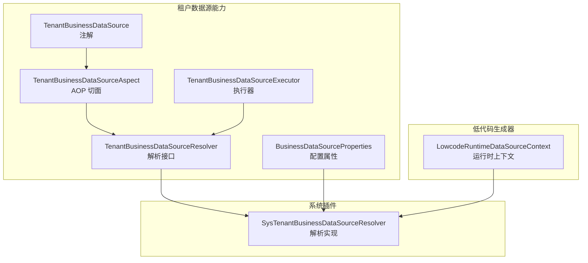
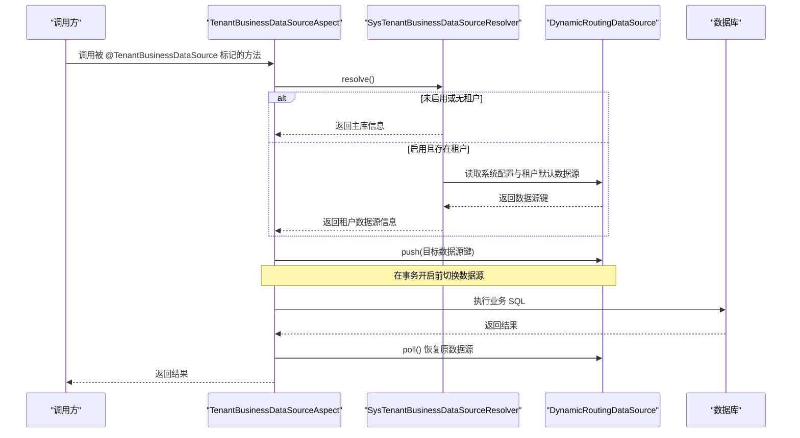
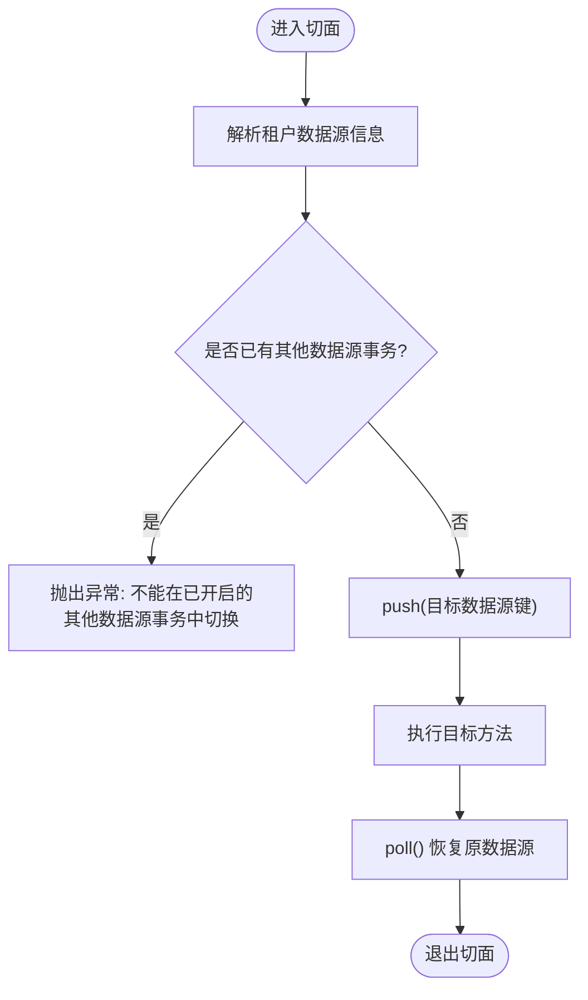
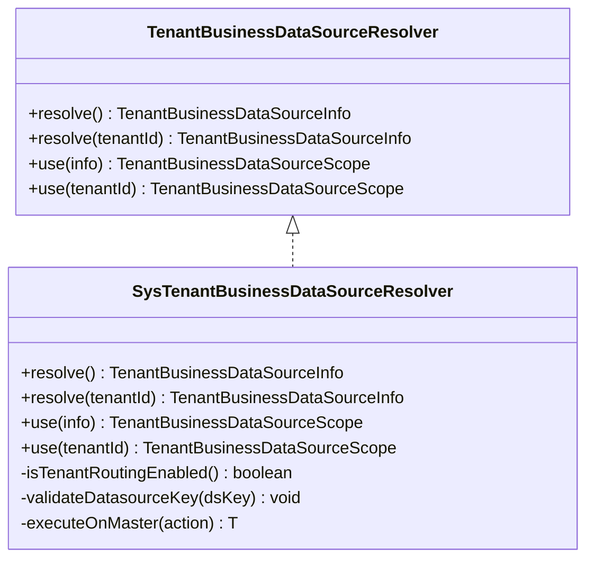
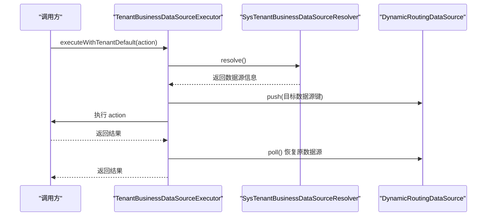
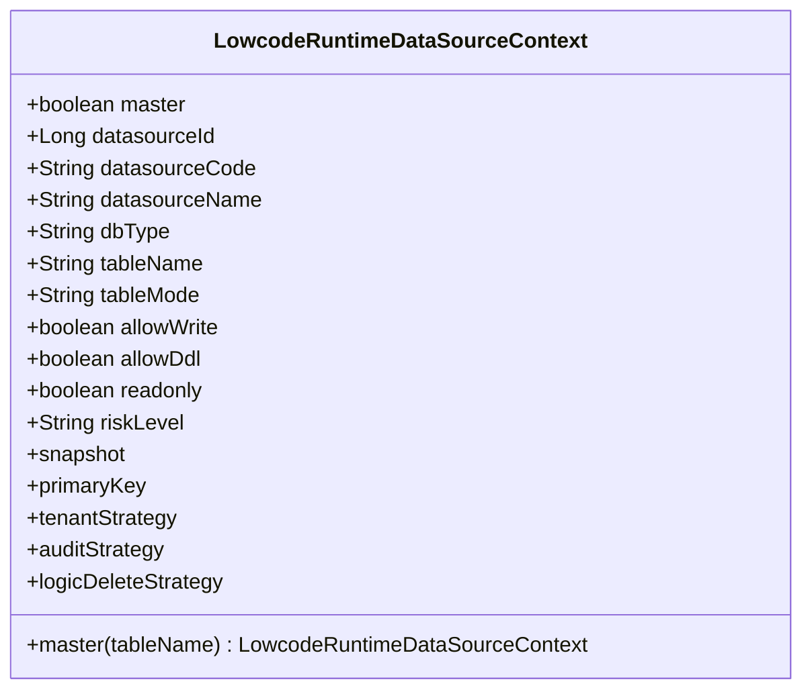
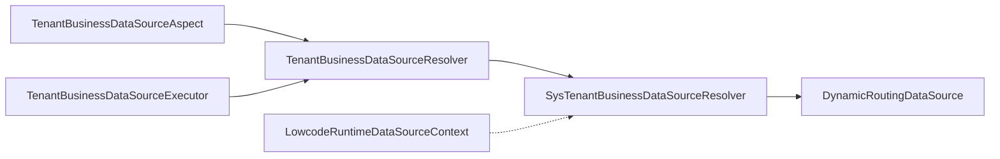

# 多数据源管理

<cite>
**本文引用的文件**
- [TenantBusinessDataSource.java](file://forge-server/forge-framework/forge-starter-parent/forge-starter-tenant/src/main/java/com/mdframe/forge/starter/tenant/datasource/TenantBusinessDataSource.java)
- [TenantBusinessDataSourceAspect.java](file://forge-server/forge-framework/forge-starter-parent/forge-starter-tenant/src/main/java/com/mdframe/forge/starter/tenant/datasource/TenantBusinessDataSourceAspect.java)
- [TenantBusinessDataSourceExecutor.java](file://forge-server/forge-framework/forge-starter-parent/forge-starter-tenant/src/main/java/com/mdframe/forge/starter/tenant/datasource/TenantBusinessDataSourceExecutor.java)
- [TenantBusinessDataSourceResolver.java](file://forge-server/forge-framework/forge-starter-parent/forge-starter-tenant/src/main/java/com/mdframe/forge/starter/tenant/datasource/TenantBusinessDataSourceResolver.java)
- [BusinessDataSourceProperties.java](file://forge-server/forge-framework/forge-starter-parent/forge-starter-tenant/src/main/java/com/mdframe/forge/starter/tenant/datasource/BusinessDataSourceProperties.java)
- [SysTenantBusinessDataSourceResolver.java](file://forge-server/forge-framework/forge-plugin-parent/forge-plugin-system/src/main/java/com/mdframe/forge/plugin/system/datasource/SysTenantBusinessDataSourceResolver.java)
- [LowcodeRuntimeDataSourceContext.java](file://forge-server/forge-framework/forge-plugin-parent/forge-plugin-generator/src/main/java/com/mdframe/forge/plugin/generator/service/lowcode/runtime/LowcodeRuntimeDataSourceContext.java)
</cite>

## 目录
1. [简介](#简介)
2. [项目结构](#项目结构)
3. [核心组件](#核心组件)
4. [架构总览](#架构总览)
5. [详细组件分析](#详细组件分析)
6. [依赖关系分析](#依赖关系分析)
7. [性能与连接池优化](#性能与连接池优化)
8. [健康检查与故障转移](#健康检查与故障转移)
9. [多租户隔离策略](#多租户隔离策略)
10. [监控与调优指南](#监控与调优指南)
11. [故障排查](#故障排查)
12. [结论](#结论)

## 简介
本技术文档围绕 Forge Admin 的多数据源管理能力，重点阐述动态数据源切换机制、主从读写分离与同步策略、连接池配置与优化、健康检查与故障转移、以及多租户环境下的数据源隔离方案。文档基于代码库中的租户业务数据源解析器、AOP 切面、执行器、低代码运行时数据源上下文等核心实现进行系统化说明，帮助读者理解并正确使用该能力。

## 项目结构
与多数据源相关的核心模块分布在以下位置：
- 租户数据源能力（starter）：提供注解、AOP、执行器、解析接口与配置属性
- 系统插件（plugin-system）：提供基于系统配置的租户数据源解析实现
- 低代码生成器（plugin-generator）：提供低代码运行时的数据源上下文模型

图表来源
- [TenantBusinessDataSource.java:1-15](file://forge-server/forge-framework/forge-starter-parent/forge-starter-tenant/src/main/java/com/mdframe/forge/starter/tenant/datasource/TenantBusinessDataSource.java#L1-L15)
- [TenantBusinessDataSourceAspect.java:1-47](file://forge-server/forge-framework/forge-starter-parent/forge-starter-tenant/src/main/java/com/mdframe/forge/starter/tenant/datasource/TenantBusinessDataSourceAspect.java#L1-L47)
- [TenantBusinessDataSourceExecutor.java:1-50](file://forge-server/forge-framework/forge-starter-parent/forge-starter-tenant/src/main/java/com/mdframe/forge/starter/tenant/datasource/TenantBusinessDataSourceExecutor.java#L1-L50)
- [TenantBusinessDataSourceResolver.java:1-16](file://forge-server/forge-framework/forge-starter-parent/forge-starter-tenant/src/main/java/com/mdframe/forge/starter/tenant/datasource/TenantBusinessDataSourceResolver.java#L1-L16)
- [BusinessDataSourceProperties.java:1-26](file://forge-server/forge-framework/forge-starter-parent/forge-starter-tenant/src/main/java/com/mdframe/forge/starter/tenant/datasource/BusinessDataSourceProperties.java#L1-L26)
- [SysTenantBusinessDataSourceResolver.java:1-125](file://forge-server/forge-framework/forge-plugin-parent/forge-plugin-system/src/main/java/com/mdframe/forge/plugin/system/datasource/SysTenantBusinessDataSourceResolver.java#L1-L125)
- [LowcodeRuntimeDataSourceContext.java:1-59](file://forge-server/forge-framework/forge-plugin-parent/forge-plugin-generator/src/main/java/com/mdframe/forge/plugin/generator/service/lowcode/runtime/LowcodeRuntimeDataSourceContext.java#L1-L59)

章节来源
- [TenantBusinessDataSource.java:1-15](file://forge-server/forge-framework/forge-starter-parent/forge-starter-tenant/src/main/java/com/mdframe/forge/starter/tenant/datasource/TenantBusinessDataSource.java#L1-L15)
- [TenantBusinessDataSourceAspect.java:1-47](file://forge-server/forge-framework/forge-starter-parent/forge-starter-tenant/src/main/java/com/mdframe/forge/starter/tenant/datasource/TenantBusinessDataSourceAspect.java#L1-L47)
- [TenantBusinessDataSourceExecutor.java:1-50](file://forge-server/forge-framework/forge-starter-parent/forge-starter-tenant/src/main/java/com/mdframe/forge/starter/tenant/datasource/TenantBusinessDataSourceExecutor.java#L1-L50)
- [TenantBusinessDataSourceResolver.java:1-16](file://forge-server/forge-framework/forge-starter-parent/forge-starter-tenant/src/main/java/com/mdframe/forge/starter/tenant/datasource/TenantBusinessDataSourceResolver.java#L1-L16)
- [BusinessDataSourceProperties.java:1-26](file://forge-server/forge-framework/forge-starter-parent/forge-starter-tenant/src/main/java/com/mdframe/forge/starter/tenant/datasource/BusinessDataSourceProperties.java#L1-L26)
- [SysTenantBusinessDataSourceResolver.java:1-125](file://forge-server/forge-framework/forge-plugin-parent/forge-plugin-system/src/main/java/com/mdframe/forge/plugin/system/datasource/SysTenantBusinessDataSourceResolver.java#L1-L125)
- [LowcodeRuntimeDataSourceContext.java:1-59](file://forge-server/forge-framework/forge-plugin-parent/forge-plugin-generator/src/main/java/com/mdframe/forge/plugin/generator/service/lowcode/runtime/LowcodeRuntimeDataSourceContext.java#L1-L59)

## 核心组件
- 注解与切面：通过自定义注解标记方法或类，在事务边界前自动切换到当前租户默认业务数据源，避免跨数据源事务问题
- 解析器接口与实现：定义租户数据源解析扩展点，并提供基于系统配置的实现，支持开关控制、租户查询与数据源键校验
- 执行器：提供编程式 API，用于在指定租户上下文中执行操作，并自动完成数据源切换与作用域释放
- 配置属性：集中管理是否启用租户路由、默认路由策略等开关
- 低代码运行时上下文：描述低代码场景下数据源的读写权限、DDL 权限、只读模式、主从标识等元信息

章节来源
- [TenantBusinessDataSource.java:1-15](file://forge-server/forge-framework/forge-starter-parent/forge-starter-tenant/src/main/java/com/mdframe/forge/starter/tenant/datasource/TenantBusinessDataSource.java#L1-L15)
- [TenantBusinessDataSourceAspect.java:1-47](file://forge-server/forge-framework/forge-starter-parent/forge-starter-tenant/src/main/java/com/mdframe/forge/starter/tenant/datasource/TenantBusinessDataSourceAspect.java#L1-L47)
- [TenantBusinessDataSourceExecutor.java:1-50](file://forge-server/forge-framework/forge-starter-parent/forge-starter-tenant/src/main/java/com/mdframe/forge/starter/tenant/datasource/TenantBusinessDataSourceExecutor.java#L1-L50)
- [TenantBusinessDataSourceResolver.java:1-16](file://forge-server/forge-framework/forge-starter-parent/forge-starter-tenant/src/main/java/com/mdframe/forge/starter/tenant/datasource/TenantBusinessDataSourceResolver.java#L1-L16)
- [BusinessDataSourceProperties.java:1-26](file://forge-server/forge-framework/forge-starter-parent/forge-starter-tenant/src/main/java/com/mdframe/forge/starter/tenant/datasource/BusinessDataSourceProperties.java#L1-L26)
- [SysTenantBusinessDataSourceResolver.java:1-125](file://forge-server/forge-framework/forge-plugin-parent/forge-plugin-system/src/main/java/com/mdframe/forge/plugin/system/datasource/SysTenantBusinessDataSourceResolver.java#L1-L125)
- [LowcodeRuntimeDataSourceContext.java:1-59](file://forge-server/forge-framework/forge-plugin-parent/forge-plugin-generator/src/main/java/com/mdframe/forge/plugin/generator/service/lowcode/runtime/LowcodeRuntimeDataSourceContext.java#L1-L59)

## 架构总览
下图展示了请求进入后，如何通过注解与 AOP 触发数据源切换，并在事务边界内安全执行；同时展示了解析器如何结合系统配置与租户信息选择目标数据源。

图表来源
- [TenantBusinessDataSourceAspect.java:1-47](file://forge-server/forge-framework/forge-starter-parent/forge-starter-tenant/src/main/java/com/mdframe/forge/starter/tenant/datasource/TenantBusinessDataSourceAspect.java#L1-L47)
- [SysTenantBusinessDataSourceResolver.java:1-125](file://forge-server/forge-framework/forge-plugin-parent/forge-plugin-system/src/main/java/com/mdframe/forge/plugin/system/datasource/SysTenantBusinessDataSourceResolver.java#L1-L125)

## 详细组件分析

### 注解与 AOP 切面
- 作用：在事务开启前将当前线程的数据源上下文切换到租户默认业务数据源，确保同一事务内的所有访问都落在同一数据源
- 关键行为：
  - 解析当前租户数据源信息
  - 校验是否在已开启的其他数据源事务中切换，防止跨数据源事务
  - 使用 try-with-resources 保证数据源上下文正确恢复

图表来源
- [TenantBusinessDataSourceAspect.java:1-47](file://forge-server/forge-framework/forge-starter-parent/forge-starter-tenant/src/main/java/com/mdframe/forge/starter/tenant/datasource/TenantBusinessDataSourceAspect.java#L1-L47)

章节来源
- [TenantBusinessDataSourceAspect.java:1-47](file://forge-server/forge-framework/forge-starter-parent/forge-starter-tenant/src/main/java/com/mdframe/forge/starter/tenant/datasource/TenantBusinessDataSourceAspect.java#L1-L47)

### 解析器接口与系统实现
- 接口职责：定义 resolve/use 的解析与切换能力，支持按当前租户或指定租户 ID 解析
- 系统实现要点：
  - 支持全局开关与系统配置开关，未启用时回退到主库
  - 从租户表读取默认业务数据源编码，并进行有效性校验
  - 在 master 数据源上执行配置与租户信息查询，避免脏读
  - 通过 DynamicDataSourceContextHolder 完成数据源切换与作用域释放

图表来源
- [TenantBusinessDataSourceResolver.java:1-16](file://forge-server/forge-framework/forge-starter-parent/forge-starter-tenant/src/main/java/com/mdframe/forge/starter/tenant/datasource/TenantBusinessDataSourceResolver.java#L1-L16)
- [SysTenantBusinessDataSourceResolver.java:1-125](file://forge-server/forge-framework/forge-plugin-parent/forge-plugin-system/src/main/java/com/mdframe/forge/plugin/system/datasource/SysTenantBusinessDataSourceResolver.java#L1-L125)

章节来源
- [TenantBusinessDataSourceResolver.java:1-16](file://forge-server/forge-framework/forge-starter-parent/forge-starter-tenant/src/main/java/com/mdframe/forge/starter/tenant/datasource/TenantBusinessDataSourceResolver.java#L1-L16)
- [SysTenantBusinessDataSourceResolver.java:1-125](file://forge-server/forge-framework/forge-plugin-parent/forge-plugin-system/src/main/java/com/mdframe/forge/plugin/system/datasource/SysTenantBusinessDataSourceResolver.java#L1-L125)

### 执行器（编程式切换）
- 作用：为需要在特定租户上下文中执行操作的场景提供便捷 API
- 能力：
  - 在当前租户默认数据源中执行
  - 在指定租户 ID 的上下文中执行，内部会设置租户上下文并完成数据源切换

图表来源
- [TenantBusinessDataSourceExecutor.java:1-50](file://forge-server/forge-framework/forge-starter-parent/forge-starter-tenant/src/main/java/com/mdframe/forge/starter/tenant/datasource/TenantBusinessDataSourceExecutor.java#L1-L50)
- [SysTenantBusinessDataSourceResolver.java:1-125](file://forge-server/forge-framework/forge-plugin-parent/forge-plugin-system/src/main/java/com/mdframe/forge/plugin/system/datasource/SysTenantBusinessDataSourceResolver.java#L1-L125)

章节来源
- [TenantBusinessDataSourceExecutor.java:1-50](file://forge-server/forge-framework/forge-starter-parent/forge-starter-tenant/src/main/java/com/mdframe/forge/starter/tenant/datasource/TenantBusinessDataSourceExecutor.java#L1-L50)

### 低代码运行时数据源上下文
- 作用：描述低代码运行期对数据源的访问策略，包括主从标识、读写权限、DDL 权限、只读模式、风险等级等
- 典型用法：在低代码引擎中根据上下文决定走主库还是从库、是否允许写操作或 DDL 变更

图表来源
- [LowcodeRuntimeDataSourceContext.java:1-59](file://forge-server/forge-framework/forge-plugin-parent/forge-plugin-generator/src/main/java/com/mdframe/forge/plugin/generator/service/lowcode/runtime/LowcodeRuntimeDataSourceContext.java#L1-L59)

章节来源
- [LowcodeRuntimeDataSourceContext.java:1-59](file://forge-server/forge-framework/forge-plugin-parent/forge-plugin-generator/src/main/java/com/mdframe/forge/plugin/generator/service/lowcode/runtime/LowcodeRuntimeDataSourceContext.java#L1-L59)

## 依赖关系分析
- 外部依赖：
  - dynamic-datasource：提供数据源路由与上下文切换能力（push/poll）
  - Spring AOP：用于切面拦截与方法级注解处理
  - MyBatis/ORM：通过数据源上下文驱动具体 SQL 执行
- 内部耦合：
  - 切面强依赖解析器接口，便于替换不同解析策略
  - 解析器依赖系统配置与租户表，属于“系统层”能力
  - 低代码上下文作为“运行时元数据”，与解析器解耦但可协同工作

图表来源
- [TenantBusinessDataSourceAspect.java:1-47](file://forge-server/forge-framework/forge-starter-parent/forge-starter-tenant/src/main/java/com/mdframe/forge/starter/tenant/datasource/TenantBusinessDataSourceAspect.java#L1-L47)
- [TenantBusinessDataSourceExecutor.java:1-50](file://forge-server/forge-framework/forge-starter-parent/forge-starter-tenant/src/main/java/com/mdframe/forge/starter/tenant/datasource/TenantBusinessDataSourceExecutor.java#L1-L50)
- [SysTenantBusinessDataSourceResolver.java:1-125](file://forge-server/forge-framework/forge-plugin-parent/forge-plugin-system/src/main/java/com/mdframe/forge/plugin/system/datasource/SysTenantBusinessDataSourceResolver.java#L1-L125)

章节来源
- [TenantBusinessDataSourceAspect.java:1-47](file://forge-server/forge-framework/forge-starter-parent/forge-starter-tenant/src/main/java/com/mdframe/forge/starter/tenant/datasource/TenantBusinessDataSourceAspect.java#L1-L47)
- [TenantBusinessDataSourceExecutor.java:1-50](file://forge-server/forge-framework/forge-starter-parent/forge-starter-tenant/src/main/java/com/mdframe/forge/starter/tenant/datasource/TenantBusinessDataSourceExecutor.java#L1-L50)
- [SysTenantBusinessDataSourceResolver.java:1-125](file://forge-server/forge-framework/forge-plugin-parent/forge-plugin-system/src/main/java/com/mdframe/forge/plugin/system/datasource/SysTenantBusinessDataSourceResolver.java#L1-L125)

## 性能与连接池优化
- 连接数设置
  - 建议根据并发峰值与平均响应时间估算最大连接数，避免过大导致数据库压力与过小导致排队等待
  - 主库与从库的连接池应分别配置，主库写入压力大时可适当提高主库连接上限
- 超时配置
  - 连接获取超时、SQL 执行超时、事务超时需合理设置，防止长事务占用连接资源
  - 建议在网关或应用层增加超时熔断，保护后端数据库
- 监控指标
  - 关注连接池活跃连接数、空闲连接数、获取连接耗时、SQL 执行耗时、慢查询比例
  - 结合 dynamic-datasource 暴露的指标进行告警与容量规划
- 调优建议
  - 热点读路径优先命中从库，减少主库压力
  - 批量操作拆分提交，降低单条事务持有连接的时间
  - 避免在循环中频繁切换数据源，尽量合并同数据源的操作

[本节为通用指导，不直接分析具体文件]

## 健康检查与故障转移
- 健康检查
  - 定期探测主从库连通性与延迟，记录健康状态
  - 对连接池进行周期性空闲连接测试，提前发现失效连接
- 故障转移
  - 当主库不可用时，可将写请求降级为只读或拒绝写入，避免数据不一致
  - 从库故障时，流量回落到主库或其他可用从库
- 重试与熔断
  - 对瞬时网络抖动进行有限次重试，避免雪崩
  - 结合熔断器快速失败，保护下游服务

[本节为通用指导，不直接分析具体文件]

## 多租户隔离策略
- Schema 隔离
  - 每个租户独立 Schema，通过数据源路由将租户请求映射到对应 Schema
  - 适合强隔离、高安全要求的场景
- 数据库隔离
  - 每个租户独立数据库实例，物理隔离最彻底，运维复杂度较高
- 行级隔离
  - 共享数据库与 Schema，通过 tenant_id 字段区分数据
  - 成本低但需严格保障查询条件注入与权限控制
- 本仓库实现
  - 通过租户默认数据源编码进行路由，可在系统配置中统一开关
  - 解析器在 master 数据源上读取租户配置，确保一致性

章节来源
- [SysTenantBusinessDataSourceResolver.java:1-125](file://forge-server/forge-framework/forge-plugin-parent/forge-plugin-system/src/main/java/com/mdframe/forge/plugin/system/datasource/SysTenantBusinessDataSourceResolver.java#L1-L125)
- [BusinessDataSourceProperties.java:1-26](file://forge-server/forge-framework/forge-starter-parent/forge-starter-tenant/src/main/java/com/mdframe/forge/starter/tenant/datasource/BusinessDataSourceProperties.java#L1-L26)

## 监控与调优指南
- 慢查询分析
  - 开启数据库慢查询日志，结合应用侧 SQL 埋点定位瓶颈
  - 对高频慢查询进行索引优化与语句改写
- 连接池优化
  - 根据 QPS 与 RT 调整连接池大小与超时参数
  - 监控连接泄漏与长时间未释放的事务
- 缓存与分片
  - 热点数据引入缓存，减轻数据库压力
  - 大表考虑水平分片，降低单库负载
- 观测性
  - 采集关键指标：连接池使用率、SQL 耗时分布、错误率、租户路由命中率
  - 建立告警规则，及时发现问题

[本节为通用指导，不直接分析具体文件]

## 故障排查
- 常见问题
  - 未在 dynamic-datasource 中配置租户数据源键：解析器会抛出异常提示未配置
  - 在已开启的其他数据源事务中切换：切面会阻止并抛出异常，避免跨数据源事务
  - 租户路由未启用：解析器会回退到主库，可通过系统配置或全局开关启用
- 排查步骤
  - 确认全局开关与系统配置是否正确
  - 检查租户表中默认业务数据源编码是否存在且有效
  - 查看 dynamic-datasource 是否已注册对应数据源键
  - 观察事务边界与数据源切换日志，确认是否在事务前切换

章节来源
- [TenantBusinessDataSourceAspect.java:1-47](file://forge-server/forge-framework/forge-starter-parent/forge-starter-tenant/src/main/java/com/mdframe/forge/starter/tenant/datasource/TenantBusinessDataSourceAspect.java#L1-L47)
- [SysTenantBusinessDataSourceResolver.java:1-125](file://forge-server/forge-framework/forge-plugin-parent/forge-plugin-system/src/main/java/com/mdframe/forge/plugin/system/datasource/SysTenantBusinessDataSourceResolver.java#L1-L125)

## 结论
Forge Admin 的多数据源管理以“注解+AOP+解析器”为核心，实现了在事务边界前安全切换租户默认业务数据源的能力。配合系统配置与租户表，既能灵活控制路由策略，又能保证一致性与安全性。对于生产环境，建议结合连接池优化、健康检查、故障转移与完善的监控体系，确保高可用与高性能。在多租户场景下，可根据业务需求选择 Schema 隔离或数据库隔离，并通过统一的解析器实现无缝切换。