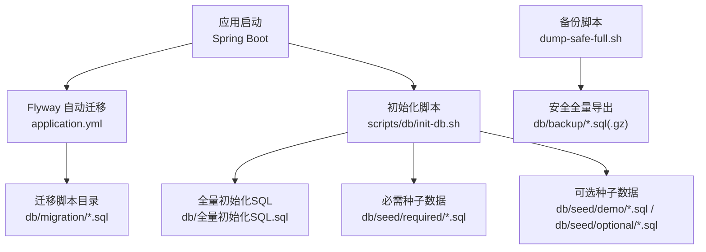
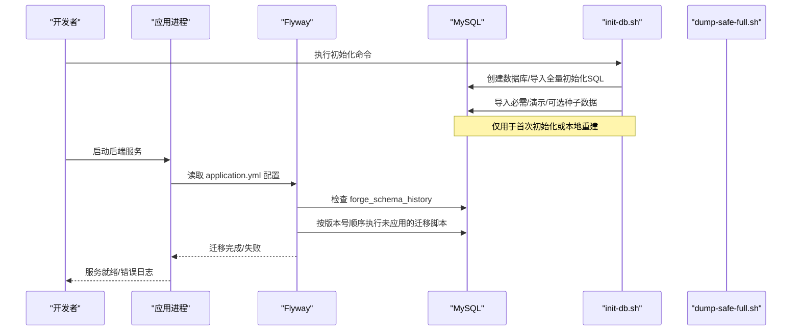
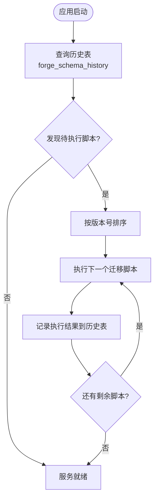
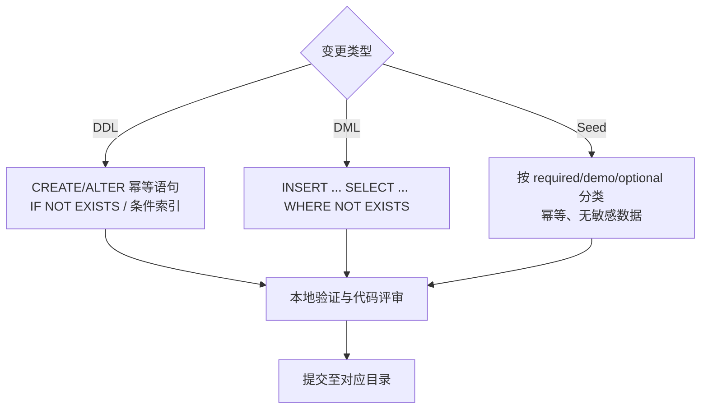
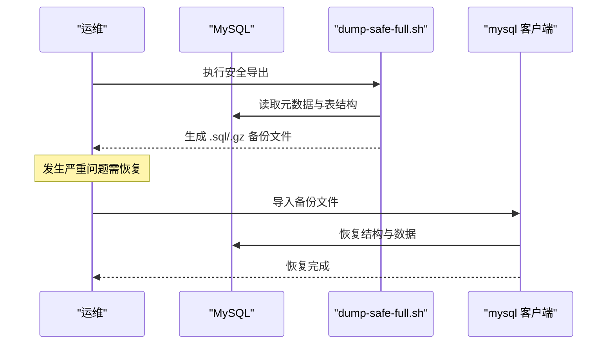
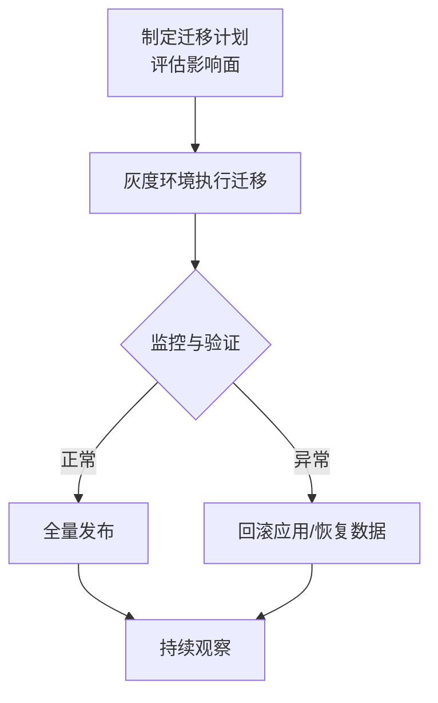
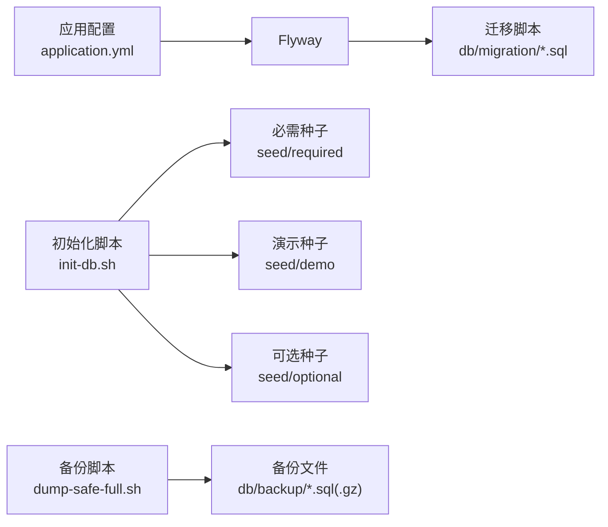

# 数据库迁移

<cite>
**本文引用的文件**
- [forge-server/db/README.md](file://forge-server/db/README.md)
- [forge-server/forge-admin-server/src/main/resources/application.yml](file://forge-server/forge-admin-server/src/main/resources/application.yml)
- [forge-server/scripts/db/init-db.sh](file://forge-server/scripts/db/init-db.sh)
- [forge-server/scripts/db/dump-safe-full.sh](file://forge-server/scripts/db/dump-safe-full.sh)
- [forge-server/db/migration/V1.0.0__baseline.sql](file://forge-server/db/migration/V1.0.0__baseline.sql)
- [forge-server/db/migration/V1.0.1__add_org_scoped_role_permission.sql](file://forge-server/db/migration/V1.0.1__add_org_scoped_role_permission.sql)
- [forge-server/db/seed/required/R__sys_resource.sql](file://forge-server/db/seed/required/R__sys_resource.sql)
- [docs/blogs/flyway-ai-coding.md](file://docs/blogs/flyway-ai-coding.md)
- [.agents/skills/forge-codegen-crud/references/sql-seeds.md](file://.agents/skills/forge-codegen-crud/references/sql-seeds.md)
</cite>

## 目录
1. [简介](#简介)
2. [项目结构](#项目结构)
3. [核心组件](#核心组件)
4. [架构总览](#架构总览)
5. [详细组件分析](#详细组件分析)
6. [依赖关系分析](#依赖关系分析)
7. [性能考量](#性能考量)
8. [故障排查指南](#故障排查指南)
9. [结论](#结论)
10. [附录](#附录)

## 简介
本技术文档围绕 Forge Admin 的数据库迁移体系，系统性阐述基于 Flyway 的版本控制机制、脚本命名与执行顺序、增量迁移编写规范（DDL/DML/种子数据）、回滚策略与灾难恢复方案、生产部署流程（含灰度发布与回滚），以及迁移脚本的测试与验证方法。目标是帮助研发、运维与质量保障团队在本地、测试与生产环境中安全、可控地演进数据库结构与数据。

## 项目结构
Forge Admin 将数据库版本化变更集中在统一目录，并通过应用配置与脚本工具协同完成初始化、迁移与备份：
- 迁移脚本目录：forge-server/db/migration
- 种子数据目录：forge-server/db/seed/{required,demo,optional}
- 初始化与导出脚本：forge-server/scripts/db/*
- 应用 Flyway 配置：forge-server/forge-admin-server/src/main/resources/application.yml
- 迁移基线：forge-server/db/migration/V1.0.0__baseline.sql

**图表来源**
- [forge-server/forge-admin-server/src/main/resources/application.yml:65-72](file://forge-server/forge-admin-server/src/main/resources/application.yml#L65-L72)
- [forge-server/scripts/db/init-db.sh:93-131](file://forge-server/scripts/db/init-db.sh#L93-L131)
- [forge-server/scripts/db/dump-safe-full.sh:219-449](file://forge-server/scripts/db/dump-safe-full.sh#L219-L449)

**章节来源**
- [forge-server/db/README.md:129-165](file://forge-server/db/README.md#L129-L165)
- [forge-server/forge-admin-server/src/main/resources/application.yml:65-72](file://forge-server/forge-admin-server/src/main/resources/application.yml#L65-L72)
- [forge-server/scripts/db/init-db.sh:93-131](file://forge-server/scripts/db/init-db.sh#L93-L131)

## 核心组件
- Flyway 自动迁移：通过 application.yml 启用并配置迁移位置、历史表、基线版本等参数，支持多路径扫描。
- 基线脚本：V1.0.0__baseline.sql 作为历史结构的锚点，后续所有变更以版本号递增的增量脚本管理。
- 初始化脚本：init-db.sh 负责创建数据库、执行全量初始化 SQL、导入必需/演示/可选种子数据。
- 备份脚本：dump-safe-full.sh 提供安全的全量导出，排除运行期/日志/敏感数据，生成可恢复的 SQL。
- 种子数据：按 required/demo/optional 分类，遵循幂等与白名单规则，避免引入敏感或环境相关数据。

**章节来源**
- [forge-server/db/README.md:129-165](file://forge-server/db/README.md#L129-L165)
- [forge-server/db/migration/V1.0.0__baseline.sql:1-4](file://forge-server/db/migration/V1.0.0__baseline.sql#L1-L4)
- [forge-server/scripts/db/init-db.sh:93-131](file://forge-server/scripts/db/init-db.sh#L93-L131)
- [forge-server/scripts/db/dump-safe-full.sh:219-449](file://forge-server/scripts/db/dump-safe-full.sh#L219-L449)
- [forge-server/db/seed/required/R__sys_resource.sql:1-3](file://forge-server/db/seed/required/R__sys_resource.sql#L1-L3)

## 架构总览
下图展示从应用启动到数据库迁移执行的端到端流程，包括 Flyway 自动迁移与初始化脚本的协作关系。

**图表来源**
- [forge-server/forge-admin-server/src/main/resources/application.yml:65-72](file://forge-server/forge-admin-server/src/main/resources/application.yml#L65-L72)
- [forge-server/scripts/db/init-db.sh:93-131](file://forge-server/scripts/db/init-db.sh#L93-L131)

**章节来源**
- [forge-server/db/README.md:129-165](file://forge-server/db/README.md#L129-L165)
- [forge-server/forge-admin-server/src/main/resources/application.yml:65-72](file://forge-server/forge-admin-server/src/main/resources/application.yml#L65-L72)

## 详细组件分析

### Flyway 版本控制与执行顺序
- 版本命名规范：采用 V<主版本>.<次版本>.<补丁版本>__<描述>.sql，例如 V1.0.1__add_org_scoped_role_permission.sql。
- 执行顺序：Flyway 依据版本号升序执行，确保变更有序落地。
- 基线与历史表：baseline-on-migrate=true、baseline-version=1.0.0，历史表为 forge_schema_history，记录已执行脚本的校验和与状态。
- 多位置扫描：locations 支持多个 filesystem 路径，便于模块化迁移脚本组织。

**图表来源**
- [forge-server/forge-admin-server/src/main/resources/application.yml:65-72](file://forge-server/forge-admin-server/src/main/resources/application.yml#L65-L72)
- [forge-server/db/migration/V1.0.0__baseline.sql:1-4](file://forge-server/db/migration/V1.0.0__baseline.sql#L1-L4)

**章节来源**
- [forge-server/db/README.md:129-165](file://forge-server/db/README.md#L129-L165)
- [forge-server/forge-admin-server/src/main/resources/application.yml:65-72](file://forge-server/forge-admin-server/src/main/resources/application.yml#L65-L72)

### 增量迁移脚本编写规范（DDL/DML/种子数据）
- DDL 变更：
  - 使用 CREATE TABLE IF NOT EXISTS、ALTER TABLE 等幂等语句。
  - 新增字段/索引需考虑兼容性与回滚风险；必要时分阶段实施。
  - 示例参考：组织范围角色权限改造脚本中新增表与唯一索引。
- DML 数据：
  - 使用 INSERT ... SELECT ... WHERE NOT EXISTS 保证幂等插入。
  - 示例参考：迁移脚本中对 sys_role_org、sys_user_org_role 的幂等填充。
- 种子数据：
  - 必需数据放入 seed/required，演示数据放入 seed/demo，可选模块数据放入 seed/optional。
  - 种子脚本应幂等且不含敏感信息，默认不随 init-db.sh 全部导入，需显式开关。

**图表来源**
- [forge-server/db/migration/V1.0.1__add_org_scoped_role_permission.sql:1-94](file://forge-server/db/migration/V1.0.1__add_org_scoped_role_permission.sql#L1-L94)
- [forge-server/db/seed/required/R__sys_resource.sql:1-3](file://forge-server/db/seed/required/R__sys_resource.sql#L1-L3)
- [.agents/skills/forge-codegen-crud/references/sql-seeds.md:1-11](file://.agents/skills/forge-codegen-crud/references/sql-seeds.md#L1-L11)

**章节来源**
- [forge-server/db/migration/V1.0.1__add_org_scoped_role_permission.sql:1-94](file://forge-server/db/migration/V1.0.1__add_org_scoped_role_permission.sql#L1-L94)
- [forge-server/db/seed/required/R__sys_resource.sql:1-3](file://forge-server/db/seed/required/R__sys_resource.sql#L1-L3)
- [.agents/skills/forge-codegen-crud/references/sql-seeds.md:1-11](file://.agents/skills/forge-codegen-crud/references/sql-seeds.md#L1-L11)

### 回滚策略与灾难恢复
- 回滚策略：
  - 禁止修改已落库的迁移脚本内容，修正必须新增更高版本号脚本。
  - 业务侧回滚不应执行反向 DDL，而是通过数据修复与配置切换实现。
- 灾难恢复：
  - 使用 dump-safe-full.sh 进行安全全量导出，排除运行期/日志/敏感数据，支持 gzip 压缩输出。
  - 恢复时通过 mysql 客户端导入生成的 SQL，注意外键与唯一性检查开关。

**图表来源**
- [forge-server/scripts/db/dump-safe-full.sh:219-449](file://forge-server/scripts/db/dump-safe-full.sh#L219-L449)

**章节来源**
- [docs/blogs/flyway-ai-coding.md:37-66](file://docs/blogs/flyway-ai-coding.md#L37-L66)
- [forge-server/scripts/db/dump-safe-full.sh:219-449](file://forge-server/scripts/db/dump-safe-full.sh#L219-L449)

### 生产环境迁移部署流程（含灰度与回滚）
- 灰度发布：
  - 先在预发/灰度环境执行迁移，观察日志与指标，确认无误后再推广至全量。
  - 利用 Flyway 历史表与迁移日志定位执行进度与异常。
- 回滚策略：
  - 若迁移导致严重问题，优先回退应用版本与配置，同时通过备份恢复数据。
  - 对不可逆的 DDL 变更，提前评估影响面并制定分阶段实施方案。

[本节为概念性流程说明，不直接映射具体源码文件]

### 迁移脚本的测试与验证方法
- 本地验证：
  - 使用 init-db.sh 重新初始化数据库，验证迁移与种子数据的正确性。
  - 结合 dry-run 模式检查导出脚本与敏感数据过滤是否符合预期。
- 自动化检查：
  - 使用社区导出脚本的 dry-run 检查迁移与种子脚本命名规范、白名单/黑名单配置与敏感字段规则。
- 一致性校验：
  - 通过 mysqldump 的安全导出对比前后差异，确保结构与数据一致。
  - 关注 flyway_schema_history 中的执行状态与校验和，避免 checksum mismatch。

**章节来源**
- [forge-server/scripts/db/init-db.sh:93-131](file://forge-server/scripts/db/init-db.sh#L93-L131)
- [forge-server/scripts/db/dump-safe-full.sh:219-449](file://forge-server/scripts/db/dump-safe-full.sh#L219-L449)
- [forge-server/db/README.md:260-293](file://forge-server/db/README.md#L260-L293)

## 依赖关系分析
- 应用与 Flyway：application.yml 中 flyway.enabled、locations、table、baseline-* 等配置驱动迁移行为。
- 初始化脚本与种子数据：init-db.sh 串联全量初始化 SQL 与三类种子数据，形成可重复的初始化流程。
- 备份与恢复：dump-safe-full.sh 依赖 MySQL 客户端与 mysqldump，输出结构化 SQL，便于恢复与审计。

**图表来源**
- [forge-server/forge-admin-server/src/main/resources/application.yml:65-72](file://forge-server/forge-admin-server/src/main/resources/application.yml#L65-L72)
- [forge-server/scripts/db/init-db.sh:93-131](file://forge-server/scripts/db/init-db.sh#L93-L131)
- [forge-server/scripts/db/dump-safe-full.sh:219-449](file://forge-server/scripts/db/dump-safe-full.sh#L219-L449)

**章节来源**
- [forge-server/forge-admin-server/src/main/resources/application.yml:65-72](file://forge-server/forge-admin-server/src/main/resources/application.yml#L65-L72)
- [forge-server/scripts/db/init-db.sh:93-131](file://forge-server/scripts/db/init-db.sh#L93-L131)
- [forge-server/scripts/db/dump-safe-full.sh:219-449](file://forge-server/scripts/db/dump-safe-full.sh#L219-L449)

## 性能考量
- 迁移脚本应尽量幂等，减少重复执行带来的锁竞争与开销。
- 大表 DDL 变更建议分阶段实施，避免长时间阻塞线上事务。
- 使用 mysqldump 的安全导出选项（如 --single-transaction、--skip-lock-tables）降低备份对在线服务的影响。
- 合理设置 Flyway 历史表与日志级别，便于追踪执行耗时与异常。

[本节提供通用指导，不直接分析具体文件]

## 故障排查指南
- 常见错误：
  - checksum mismatch：已落库脚本被修改导致校验失败，需新增更高版本脚本修正。
  - 迁移失败：检查脚本语法、依赖对象是否存在、权限是否足够。
  - 种子数据冲突：确保 INSERT 使用幂等逻辑，避免重复插入。
- 排查步骤：
  - 查看 flyway_schema_history 记录，定位失败脚本与错误信息。
  - 使用 init-db.sh 在本地重现问题，逐步缩小范围。
  - 使用 dump-safe-full.sh 导出当前结构，对比差异定位变更点。

**章节来源**
- [docs/blogs/flyway-ai-coding.md:37-66](file://docs/blogs/flyway-ai-coding.md#L37-L66)
- [forge-server/scripts/db/init-db.sh:93-131](file://forge-server/scripts/db/init-db.sh#L93-L131)
- [forge-server/scripts/db/dump-safe-full.sh:219-449](file://forge-server/scripts/db/dump-safe-full.sh#L219-L449)

## 结论
Forge Admin 通过 Flyway 实现了严格的数据库版本控制与增量迁移管理，配合初始化与备份脚本，形成了从开发到生产的完整数据演进闭环。遵循幂等设计、事务处理与错误处理的最佳实践，能够在保证数据一致性的前提下，安全高效地进行数据库变更。生产环境建议采用灰度发布与完善的回滚策略，确保变更风险可控。

[本节总结整体方案，不直接分析具体文件]

## 附录
- 常用命令：
  - 初始化数据库：bash forge/scripts/db/init-db.sh --host ... --port ... --database ... --user ... --password ...
  - 导入演示数据：添加 --with-demo
  - 导入可选模块数据：添加 --with-optional
  - 安全导出：bash forge/scripts/db/dump-safe-full.sh --host ... --port ... --database ... --user ... --password ...
- 最佳实践清单：
  - 脚本命名规范：V<版本>__<描述>.sql
  - 幂等设计：IF NOT EXISTS、WHERE NOT EXISTS
  - 禁止修改已落库脚本，修正用新版本号
  - 种子数据分类管理，避免敏感信息
  - 备份与恢复演练，定期验证

[本节为补充信息，不直接分析具体文件]