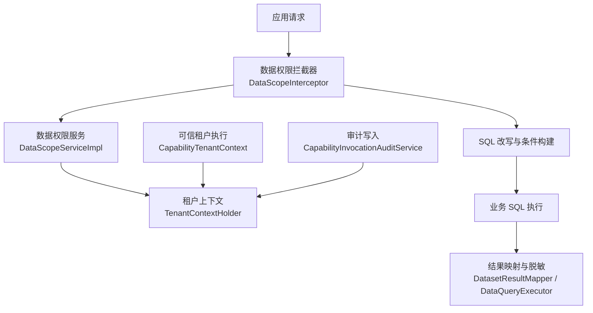
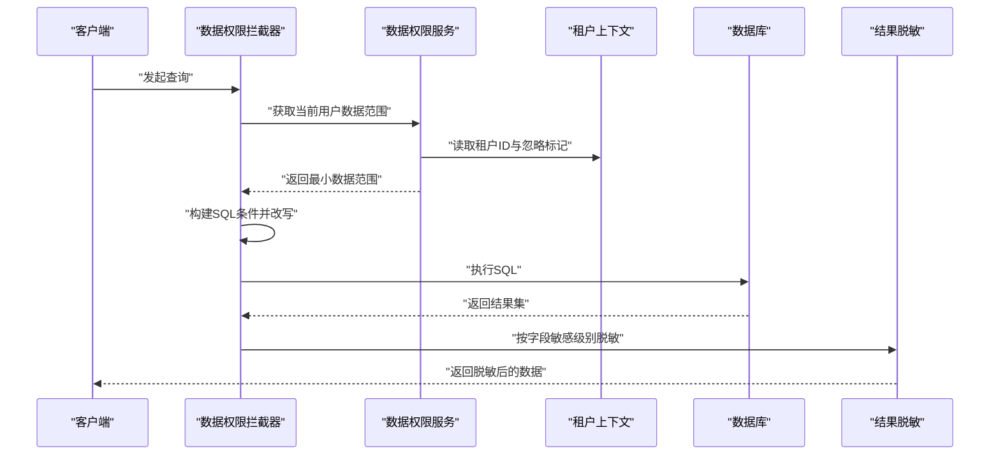
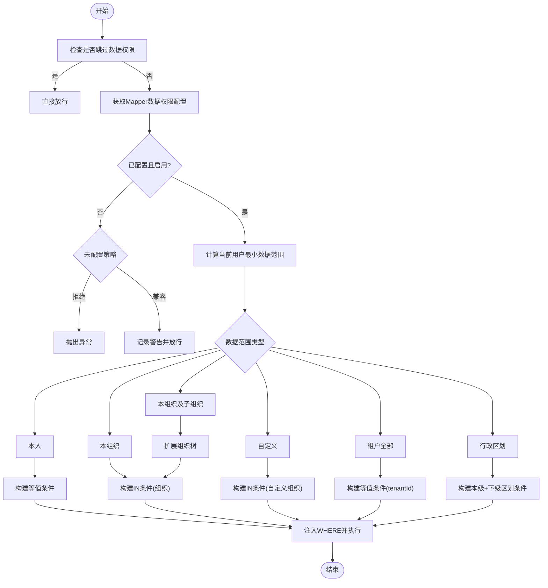
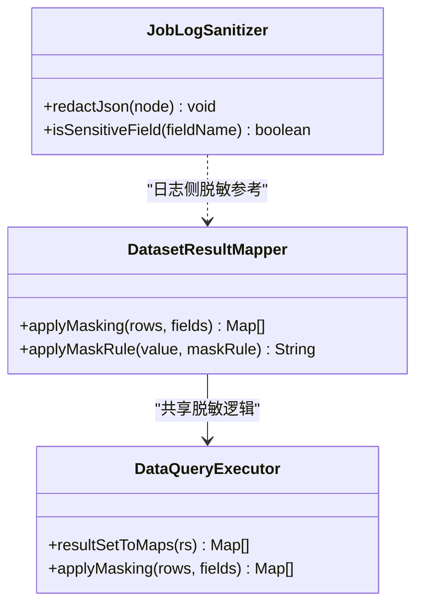
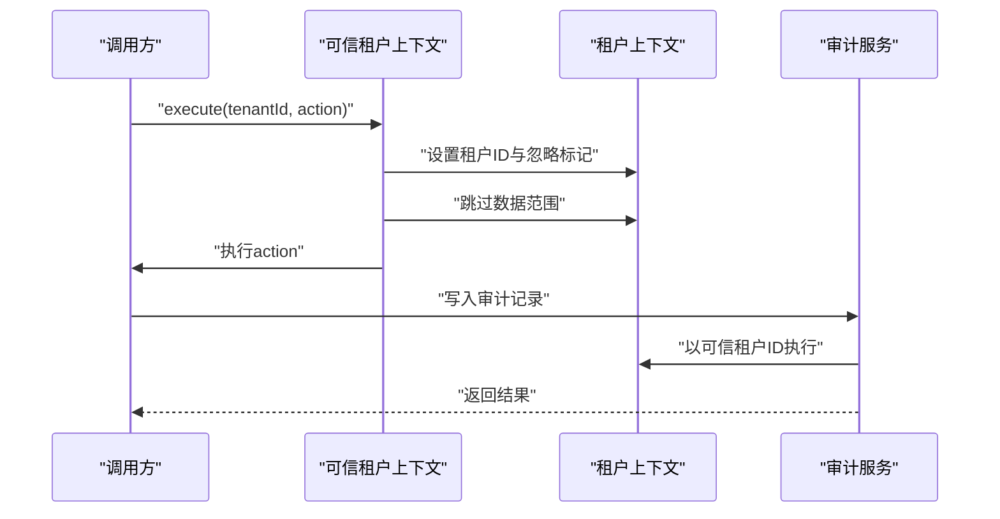
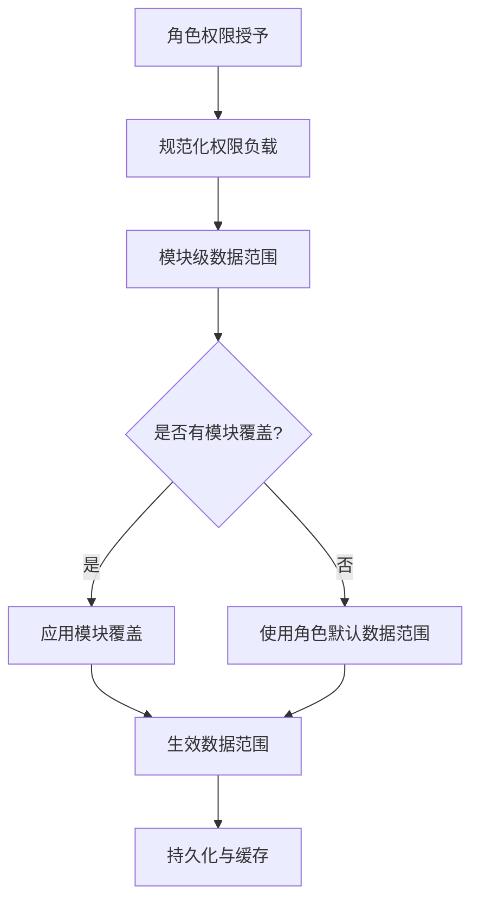
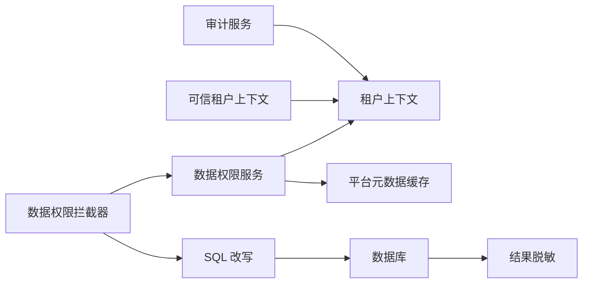

# 数据权限控制

<cite>
**本文引用的文件**
- [DataScopeInterceptor.java](file://forge-server/forge-framework/forge-starter-parent/forge-starter-datascope/src/main/java/com/mdframe/forge/starter/datascope/handler/DataScopeInterceptor.java)
- [DataScopeServiceImpl.java](file://forge-server/forge-framework/forge-starter-parent/forge-starter-datascope/src/main/java/com/mdframe/forge/starter/datascope/service/impl/DataScopeServiceImpl.java)
- [DataScopeType.java](file://forge-server/forge-framework/forge-starter-parent/forge-starter-datascope/src/main/java/com/mdframe/forge/starter/datascope/enums/DataScopeType.java)
- [TenantContextHolder.java](file://forge-server/forge-framework/forge-starter-parent/forge-starter-tenant/src/main/java/com/mdframe/forge/starter/tenant/context/TenantContextHolder.java)
- [CapabilityTenantContext.java](file://forge-server/forge-framework/forge-plugin-parent/forge-plugin-capability-parent/forge-plugin-capability-platform/src/main/java/com/mdframe/forge/plugin/capability/identity/security/CapabilityTenantContext.java)
- [CapabilityInvocationAuditService.java](file://forge-server/forge-framework/forge-plugin-parent/forge-plugin-capability-parent/forge-plugin-capability-platform/src/main/java/com/mdframe/forge/plugin/capability/controlplane/service/CapabilityInvocationAuditService.java)
- [DataQueryExecutor.java](file://forge-server/forge-framework/forge-plugin-parent/forge-plugin-data/src/main/java/com/mdframe/forge/plugin/data/service/DataQueryExecutor.java)
- [DatasetResultMapper.java](file://forge-server/forge-framework/forge-plugin-parent/forge-plugin-data/src/main/java/com/mdframe/forge/plugin/data/support/DatasetResultMapper.java)
- [JobLogSanitizer.java](file://forge-server/forge-framework/forge-plugin-parent/forge-plugin-job/src/main/java/com/mdframe/forge/plugin/job/support/JobLogSanitizer.java)
- [model-schema.js](file://forge-admin-ui/src/components/lowcode-builder/model/model-schema.js)
- [application-permission-utils.js](file://forge-admin-ui/src/views/app-center/application-permission-utils.js)
- [V1.0.99__add_role_module_data_scopes.sql](file://forge-server/db/migration/V1.0.99__add_role_module_data_scopes.sql)
</cite>

## 目录
1. [简介](#简介)
2. [项目结构](#项目结构)
3. [核心组件](#核心组件)
4. [架构总览](#架构总览)
5. [详细组件分析](#详细组件分析)
6. [依赖关系分析](#依赖关系分析)
7. [性能考量](#性能考量)
8. [故障排查指南](#故障排查指南)
9. [结论](#结论)
10. [附录](#附录)

## 简介
本技术文档围绕 Forge Admin 的数据权限控制能力，系统性阐述行级数据权限、字段级权限与多租户隔离的实现机制与配置方式。重点包括：
- 行级数据权限：基于 MyBatis Plus 拦截器的 SQL 改写策略、数据范围类型与条件构建。
- 字段级权限：敏感字段脱敏、动态字段过滤与权限校验逻辑。
- 多租户隔离：租户上下文注入、跨租户访问控制与可信执行环境。
- 配置管理：角色权限分配、用户数据范围与模块级数据范围继承。
- 审计与监控：权限变更记录、访问日志与异常告警。
- 最佳实践与常见问题解决方案。

## 项目结构
数据权限相关代码主要分布在以下模块：
- 数据权限基础能力：starter-datascope（拦截器、服务实现、枚举）
- 多租户上下文：starter-tenant（租户上下文持有者）
- 平台能力集成：capability-platform（可信租户上下文、审计服务）
- 数据集查询与脱敏：plugin-data（查询执行与结果映射中的脱敏）
- 作业日志脱敏：plugin-job（日志敏感信息清理）
- 前端权限与数据范围配置：forge-admin-ui（模型定义与权限工具）
- 数据库迁移：db/migration（角色模块数据范围资源迁移）

图表来源
- [DataScopeInterceptor.java:70-155](file://forge-server/forge-framework/forge-starter-parent/forge-starter-datascope/src/main/java/com/mdframe/forge/starter/datascope/handler/DataScopeInterceptor.java#L70-L155)
- [DataScopeServiceImpl.java:84-157](file://forge-server/forge-framework/forge-starter-parent/forge-starter-datascope/src/main/java/com/mdframe/forge/starter/datascope/service/impl/DataScopeServiceImpl.java#L84-L157)
- [TenantContextHolder.java:22-70](file://forge-server/forge-framework/forge-starter-parent/forge-starter-tenant/src/main/java/com/mdframe/forge/starter/tenant/context/TenantContextHolder.java#L22-L70)
- [CapabilityTenantContext.java:17-33](file://forge-server/forge-framework/forge-plugin-parent/forge-plugin-capability-parent/forge-plugin-capability-platform/src/main/java/com/mdframe/forge/plugin/capability/identity/security/CapabilityTenantContext.java#L17-L33)
- [CapabilityInvocationAuditService.java:231-262](file://forge-server/forge-framework/forge-plugin-parent/forge-plugin-capability-parent/forge-plugin-capability-platform/src/main/java/com/mdframe/forge/plugin/capability/controlplane/service/CapabilityInvocationAuditService.java#L231-L262)
- [DatasetResultMapper.java:62-89](file://forge-server/forge-framework/forge-plugin-parent/forge-plugin-data/src/main/java/com/mdframe/forge/plugin/data/support/DatasetResultMapper.java#L62-L89)
- [DataQueryExecutor.java:348-364](file://forge-server/forge-framework/forge-plugin-parent/forge-plugin-data/src/main/java/com/mdframe/forge/plugin/data/service/DataQueryExecutor.java#L348-L364)

章节来源
- [DataScopeInterceptor.java:70-155](file://forge-server/forge-framework/forge-starter-parent/forge-starter-datascope/src/main/java/com/mdframe/forge/starter/datascope/handler/DataScopeInterceptor.java#L70-L155)
- [DataScopeServiceImpl.java:84-157](file://forge-server/forge-framework/forge-starter-parent/forge-starter-datascope/src/main/java/com/mdframe/forge/starter/datascope/service/impl/DataScopeServiceImpl.java#L84-L157)
- [TenantContextHolder.java:22-70](file://forge-server/forge-framework/forge-starter-parent/forge-starter-tenant/src/main/java/com/mdframe/forge/starter/tenant/context/TenantContextHolder.java#L22-L70)
- [CapabilityTenantContext.java:17-33](file://forge-server/forge-framework/forge-plugin-parent/forge-plugin-capability-parent/forge-plugin-capability-platform/src/main/java/com/mdframe/forge/plugin/capability/identity/security/CapabilityTenantContext.java#L17-L33)
- [CapabilityInvocationAuditService.java:231-262](file://forge-server/forge-framework/forge-plugin-parent/forge-plugin-capability-parent/forge-plugin-capability-platform/src/main/java/com/mdframe/forge/plugin/capability/controlplane/service/CapabilityInvocationAuditService.java#L231-L262)
- [DatasetResultMapper.java:62-89](file://forge-server/forge-framework/forge-plugin-parent/forge-plugin-data/src/main/java/com/mdframe/forge/plugin/data/support/DatasetResultMapper.java#L62-L89)
- [DataQueryExecutor.java:348-364](file://forge-server/forge-framework/forge-plugin-parent/forge-plugin-data/src/main/java/com/mdframe/forge/plugin/data/service/DataQueryExecutor.java#L348-L364)

## 核心组件
- 数据权限拦截器：在 MyBatis Plus 查询前解析并改写 SQL，按角色与模块数据范围追加 WHERE 条件。
- 数据权限服务：加载并缓存平台元数据（配置、角色、组织、行政区划），计算当前用户最小数据范围。
- 租户上下文：提供线程安全的租户 ID 与忽略标记，支持嵌套恢复与可信执行。
- 可信租户上下文：在 Capability 协议完成后以可信租户身份执行，避免业务数据范围干扰。
- 审计服务：以调用方传入的 tenantId 为唯一租户来源进行审计写入，保持租户拦截开启但跳过用户数据范围。
- 结果脱敏：在数据集查询与结果映射阶段对敏感字段按规则脱敏。
- 前端权限工具：规范化角色权限与模块数据范围，生成配置负载。

章节来源
- [DataScopeInterceptor.java:70-155](file://forge-server/forge-framework/forge-starter-parent/forge-starter-datascope/src/main/java/com/mdframe/forge/starter/datascope/handler/DataScopeInterceptor.java#L70-L155)
- [DataScopeServiceImpl.java:84-157](file://forge-server/forge-framework/forge-starter-parent/forge-starter-datascope/src/main/java/com/mdframe/forge/starter/datascope/service/impl/DataScopeServiceImpl.java#L84-L157)
- [TenantContextHolder.java:22-70](file://forge-server/forge-framework/forge-starter-parent/forge-starter-tenant/src/main/java/com/mdframe/forge/starter/tenant/context/TenantContextHolder.java#L22-L70)
- [CapabilityTenantContext.java:17-33](file://forge-server/forge-framework/forge-plugin-parent/forge-plugin-capability-parent/forge-plugin-capability-platform/src/main/java/com/mdframe/forge/plugin/capability/identity/security/CapabilityTenantContext.java#L17-L33)
- [CapabilityInvocationAuditService.java:231-262](file://forge-server/forge-framework/forge-plugin-parent/forge-plugin-capability-parent/forge-plugin-capability-platform/src/main/java/com/mdframe/forge/plugin/capability/controlplane/service/CapabilityInvocationAuditService.java#L231-L262)
- [DatasetResultMapper.java:62-89](file://forge-server/forge-framework/forge-plugin-parent/forge-plugin-data/src/main/java/com/mdframe/forge/plugin/data/support/DatasetResultMapper.java#L62-L89)
- [DataQueryExecutor.java:348-364](file://forge-server/forge-framework/forge-plugin-parent/forge-plugin-data/src/main/java/com/mdframe/forge/plugin/data/service/DataQueryExecutor.java#L348-L364)
- [application-permission-utils.js:16-48](file://forge-admin-ui/src/views/app-center/application-permission-utils.js#L16-L48)

## 架构总览
数据权限的整体流程如下：
- 请求进入后，数据权限拦截器检查是否跳过或无需处理。
- 根据 Mapper 方法获取数据权限配置，若未配置则按策略放行或拒绝。
- 通过数据权限服务计算当前用户的最小数据范围（考虑管理员、租户管理员、角色与模块覆盖）。
- 根据数据范围类型构建 SQL 条件（本人、组织、组织及子组织、自定义、租户全部、行政区划）。
- 将条件注入到原始 SQL 的 WHERE 中，执行查询。
- 结果返回前进行字段级脱敏。
- 在可信执行路径（如 Capability）中，使用可信租户上下文确保跨租户访问安全。
- 审计服务以可信租户 ID 写入审计记录，不依赖业务登录态。

图表来源
- [DataScopeInterceptor.java:70-155](file://forge-server/forge-framework/forge-starter-parent/forge-starter-datascope/src/main/java/com/mdframe/forge/starter/datascope/handler/DataScopeInterceptor.java#L70-L155)
- [DataScopeServiceImpl.java:84-157](file://forge-server/forge-framework/forge-starter-parent/forge-starter-datascope/src/main/java/com/mdframe/forge/starter/datascope/service/impl/DataScopeServiceImpl.java#L84-L157)
- [TenantContextHolder.java:22-70](file://forge-server/forge-framework/forge-starter-parent/forge-starter-tenant/src/main/java/com/mdframe/forge/starter/tenant/context/TenantContextHolder.java#L22-L70)
- [DatasetResultMapper.java:62-89](file://forge-server/forge-framework/forge-plugin-parent/forge-plugin-data/src/main/java/com/mdframe/forge/plugin/data/support/DatasetResultMapper.java#L62-L89)
- [DataQueryExecutor.java:348-364](file://forge-server/forge-framework/forge-plugin-parent/forge-plugin-data/src/main/java/com/mdframe/forge/plugin/data/service/DataQueryExecutor.java#L348-L364)

## 详细组件分析

### 行级数据权限：数据范围拦截器的工作原理与配置
- 拦截时机：MyBatis Plus 查询前（beforeQuery），支持分页 count 查询的特殊处理。
- 配置来源：按 Mapper 方法名查找数据权限配置；支持租户级与默认配置。
- 上下文计算：从当前用户身份与角色、模块覆盖计算最小数据范围。
- SQL 改写：解析 SELECT 语句，定位目标 PlainSelect，构建并追加数据权限条件。
- 范围类型：
  - 本人：等值匹配 userId。
  - 本组织：IN 匹配 orgIds。
  - 本组织及子组织：扩展组织树后 IN 匹配。
  - 自定义：按角色配置的自定义组织集合 IN 匹配。
  - 租户全部：等值匹配 tenantId。
  - 行政区划：精确匹配 + 下级区划 IN，支持用户表 area_code 联合 OR。
- 失败策略：可配置严格拒绝或兼容放行；未配置 Mapper 时按策略处理。

图表来源
- [DataScopeInterceptor.java:70-155](file://forge-server/forge-framework/forge-starter-parent/forge-starter-datascope/src/main/java/com/mdframe/forge/starter/datascope/handler/DataScopeInterceptor.java#L70-L155)
- [DataScopeInterceptor.java:176-207](file://forge-server/forge-framework/forge-starter-parent/forge-starter-datascope/src/main/java/com/mdframe/forge/starter/datascope/handler/DataScopeInterceptor.java#L176-L207)
- [DataScopeInterceptor.java:232-287](file://forge-server/forge-framework/forge-starter-parent/forge-starter-datascope/src/main/java/com/mdframe/forge/starter/datascope/handler/DataScopeInterceptor.java#L232-L287)
- [DataScopeInterceptor.java:462-531](file://forge-server/forge-framework/forge-starter-parent/forge-starter-datascope/src/main/java/com/mdframe/forge/starter/datascope/handler/DataScopeInterceptor.java#L462-L531)
- [DataScopeType.java:70-89](file://forge-server/forge-framework/forge-starter-parent/forge-starter-datascope/src/main/java/com/mdframe/forge/starter/datascope/enums/DataScopeType.java#L70-L89)

章节来源
- [DataScopeInterceptor.java:70-155](file://forge-server/forge-framework/forge-starter-parent/forge-starter-datascope/src/main/java/com/mdframe/forge/starter/datascope/handler/DataScopeInterceptor.java#L70-L155)
- [DataScopeInterceptor.java:176-207](file://forge-server/forge-framework/forge-starter-parent/forge-starter-datascope/src/main/java/com/mdframe/forge/starter/datascope/handler/DataScopeInterceptor.java#L176-L207)
- [DataScopeInterceptor.java:232-287](file://forge-server/forge-framework/forge-starter-parent/forge-starter-datascope/handler/DataScopeInterceptor.java#L232-L287)
- [DataScopeInterceptor.java:462-531](file://forge-server/forge-framework/forge-starter-parent/forge-starter-datascope/handler/DataScopeInterceptor.java#L462-L531)
- [DataScopeType.java:70-89](file://forge-server/forge-framework/forge-starter-parent/forge-starter-datascope/src/main/java/com/mdframe/forge/starter/datascope/enums/DataScopeType.java#L70-L89)

### 字段级权限控制：敏感字段脱敏、动态字段过滤与权限校验
- 敏感字段脱敏：
  - 在数据集查询执行与结果映射阶段，按字段敏感级别（如 MASK）与脱敏规则进行值替换。
  - 支持正则或固定规则替换，缺失规则时采用默认掩码。
- 动态字段过滤：
  - 前端模型定义中提供数据范围归一化与策略字段解析，用于决定哪些字段参与权限策略。
- 权限校验逻辑：
  - 后端在查询前完成行级权限拦截；字段级脱敏在结果层统一处理，确保输出安全。
  - 作业日志等敏感内容在持久化前进行清洗，避免泄露。

图表来源
- [DatasetResultMapper.java:62-89](file://forge-server/forge-framework/forge-plugin-parent/forge-plugin-data/src/main/java/com/mdframe/forge/plugin/data/support/DatasetResultMapper.java#L62-L89)
- [DataQueryExecutor.java:348-364](file://forge-server/forge-framework/forge-plugin-parent/forge-plugin-data/src/main/java/com/mdframe/forge/plugin/data/service/DataQueryExecutor.java#L348-L364)
- [JobLogSanitizer.java:87-116](file://forge-server/forge-framework/forge-plugin-parent/forge-plugin-job/src/main/java/com/mdframe/forge/plugin/job/support/JobLogSanitizer.java#L87-L116)

章节来源
- [DatasetResultMapper.java:62-89](file://forge-server/forge-framework/forge-plugin-parent/forge-plugin-data/src/main/java/com/mdframe/forge/plugin/data/support/DatasetResultMapper.java#L62-L89)
- [DataQueryExecutor.java:348-364](file://forge-server/forge-framework/forge-plugin-parent/forge-plugin-data/src/main/java/com/mdframe/forge/plugin/data/service/DataQueryExecutor.java#L348-L364)
- [JobLogSanitizer.java:87-116](file://forge-server/forge-framework/forge-plugin-parent/forge-plugin-job/src/main/java/com/mdframe/forge/plugin/job/support/JobLogSanitizer.java#L87-L116)
- [model-schema.js:281-317](file://forge-admin-ui/src/components/lowcode-builder/model/model-schema.js#L281-L317)

### 多租户数据隔离策略：租户ID注入、数据范围限定与跨租户访问控制
- 租户上下文注入：
  - 使用 TransmittableThreadLocal 存储租户 ID 与忽略标记，支持异步线程传递与嵌套恢复。
- 数据范围限定：
  - 数据权限服务在查询平台元数据时使用“忽略租户”模式，避免切库后访问平台表被拦截。
- 跨租户访问控制：
  - 在 Capability 协议完成后，以可信租户身份执行，临时设置租户 ID、关闭忽略标记并跳过数据范围，确保审计与平台表访问安全。
  - 审计服务以调用方传入的 tenantId 为唯一租户来源，显式携带租户和完整身份条件，跳过面向业务数据的用户数据范围但保持租户拦截开启。

图表来源
- [CapabilityTenantContext.java:17-33](file://forge-server/forge-framework/forge-plugin-parent/forge-plugin-capability-parent/forge-plugin-capability-platform/src/main/java/com/mdframe/forge/plugin/capability/identity/security/CapabilityTenantContext.java#L17-L33)
- [TenantContextHolder.java:120-159](file://forge-server/forge-framework/forge-starter-parent/forge-starter-tenant/src/main/java/com/mdframe/forge/starter/tenant/context/TenantContextHolder.java#L120-L159)
- [CapabilityInvocationAuditService.java:231-262](file://forge-server/forge-framework/forge-plugin-parent/forge-plugin-capability-parent/forge-plugin-capability-platform/src/main/java/com/mdframe/forge/plugin/capability/controlplane/service/CapabilityInvocationAuditService.java#L231-L262)

章节来源
- [TenantContextHolder.java:22-70](file://forge-server/forge-framework/forge-starter-parent/forge-starter-tenant/src/main/java/com/mdframe/forge/starter/tenant/context/TenantContextHolder.java#L22-L70)
- [TenantContextHolder.java:120-159](file://forge-server/forge-framework/forge-starter-parent/forge-starter-tenant/src/main/java/com/mdframe/forge/starter/tenant/context/TenantContextHolder.java#L120-L159)
- [CapabilityTenantContext.java:17-33](file://forge-server/forge-framework/forge-plugin-parent/forge-plugin-capability-parent/forge-plugin-capability-platform/src/main/java/com/mdframe/forge/plugin/capability/identity/security/CapabilityTenantContext.java#L17-L33)
- [CapabilityInvocationAuditService.java:231-262](file://forge-server/forge-framework/forge-plugin-parent/forge-plugin-capability-parent/forge-plugin-capability-platform/src/main/java/com/mdframe/forge/plugin/capability/controlplane/service/CapabilityInvocationAuditService.java#L231-L262)

### 数据权限的配置管理：角色权限分配、用户数据范围与权限继承
- 角色与模块数据范围：
  - 前端工具函数规范化角色权限，支持模块级数据范围覆盖与默认值继承。
  - 数据库迁移脚本将旧资源权限映射到新数据范围资源，保证向后兼容。
- 用户数据范围：
  - 数据权限服务根据用户角色与模块覆盖计算最小数据范围，支持管理员与租户管理员快速通道。
- 权限继承：
  - 模块级数据范围优先于角色默认数据范围；未配置时回退到角色默认。

图表来源
- [application-permission-utils.js:16-48](file://forge-admin-ui/src/views/app-center/application-permission-utils.js#L16-L48)
- [application-permission-utils.js:142-166](file://forge-admin-ui/src/views/app-center/application-permission-utils.js#L142-L166)
- [V1.0.99__add_role_module_data_scopes.sql:60-88](file://forge-server/db/migration/V1.0.99__add_role_module_data_scopes.sql#L60-L88)

章节来源
- [application-permission-utils.js:16-48](file://forge-admin-ui/src/views/app-center/application-permission-utils.js#L16-L48)
- [application-permission-utils.js:142-166](file://forge-admin-ui/src/views/app-center/application-permission-utils.js#L142-L166)
- [V1.0.99__add_role_module_data_scopes.sql:60-88](file://forge-server/db/migration/V1.0.99__add_role_module_data_scopes.sql#L60-L88)

### 数据权限的审计与监控：权限变更记录、访问日志与异常告警
- 权限变更记录：
  - 通过资源权限迁移与模块数据范围配置，记录角色与模块的权限变更。
- 访问日志：
  - 作业日志在持久化前进行敏感字段清洗，避免泄露。
- 异常告警：
  - 数据权限拦截器在失败时可配置严格拒绝或兼容放行，并记录警告日志；审计服务在可信租户上下文中写入审计记录，便于追踪。

章节来源
- [JobLogSanitizer.java:87-116](file://forge-server/forge-framework/forge-plugin-parent/forge-plugin-job/src/main/java/com/mdframe/forge/plugin/job/support/JobLogSanitizer.java#L87-L116)
- [DataScopeInterceptor.java:157-171](file://forge-server/forge-framework/forge-starter-parent/forge-starter-datascope/src/main/java/com/mdframe/forge/starter/datascope/handler/DataScopeInterceptor.java#L157-L171)
- [CapabilityInvocationAuditService.java:231-262](file://forge-server/forge-framework/forge-plugin-parent/forge-plugin-capability-parent/forge-plugin-capability-platform/src/main/java/com/mdframe/forge/plugin/capability/controlplane/service/CapabilityInvocationAuditService.java#L231-L262)

## 依赖关系分析
- 数据权限拦截器依赖数据权限服务与租户上下文。
- 数据权限服务依赖平台元数据（配置、角色、组织、行政区划）并缓存至内存。
- 可信租户上下文与审计服务依赖租户上下文，确保跨租户访问安全。
- 结果脱敏依赖数据集字段配置与脱敏规则。
- 前端权限工具依赖模型定义与权限资源，生成配置负载。

图表来源
- [DataScopeInterceptor.java:70-155](file://forge-server/forge-framework/forge-starter-parent/forge-starter-datascope/src/main/java/com/mdframe/forge/starter/datascope/handler/DataScopeInterceptor.java#L70-L155)
- [DataScopeServiceImpl.java:84-157](file://forge-server/forge-framework/forge-starter-parent/forge-starter-datascope/src/main/java/com/mdframe/forge/starter/datascope/service/impl/DataScopeServiceImpl.java#L84-L157)
- [TenantContextHolder.java:22-70](file://forge-server/forge-framework/forge-starter-parent/forge-starter-tenant/src/main/java/com/mdframe/forge/starter/tenant/context/TenantContextHolder.java#L22-L70)
- [CapabilityTenantContext.java:17-33](file://forge-server/forge-framework/forge-plugin-parent/forge-plugin-capability-parent/forge-plugin-capability-platform/src/main/java/com/mdframe/forge/plugin/capability/identity/security/CapabilityTenantContext.java#L17-L33)
- [CapabilityInvocationAuditService.java:231-262](file://forge-server/forge-framework/forge-plugin-parent/forge-plugin-capability-parent/forge-plugin-capability-platform/src/main/java/com/mdframe/forge/plugin/capability/controlplane/service/CapabilityInvocationAuditService.java#L231-L262)

章节来源
- [DataScopeInterceptor.java:70-155](file://forge-server/forge-framework/forge-starter-parent/forge-starter-datascope/src/main/java/com/mdframe/forge/starter/datascope/handler/DataScopeInterceptor.java#L70-L155)
- [DataScopeServiceImpl.java:84-157](file://forge-server/forge-framework/forge-starter-parent/forge-starter-datascope/src/main/java/com/mdframe/forge/starter/datascope/service/impl/DataScopeServiceImpl.java#L84-L157)
- [TenantContextHolder.java:22-70](file://forge-server/forge-framework/forge-starter-parent/forge-starter-tenant/src/main/java/com/mdframe/forge/starter/tenant/context/TenantContextHolder.java#L22-L70)
- [CapabilityTenantContext.java:17-33](file://forge-server/forge-framework/forge-plugin-parent/forge-plugin-capability-parent/forge-plugin-capability-platform/src/main/java/com/mdframe/forge/plugin/capability/identity/security/CapabilityTenantContext.java#L17-L33)
- [CapabilityInvocationAuditService.java:231-262](file://forge-server/forge-framework/forge-plugin-parent/forge-plugin-capability-parent/forge-plugin-capability-platform/src/main/java/com/mdframe/forge/plugin/capability/controlplane/service/CapabilityInvocationAuditService.java#L231-L262)

## 性能考量
- 元数据缓存：数据权限服务启动时预热平台元数据，查询期间仅读内存快照，避免频繁切库与锁竞争。
- SQL 改写优化：仅对 SELECT 语句进行解析与改写，分页 count 查询特殊处理减少重复计算。
- 组织与区划扩展：提前构建组织与区划父子关系缓存，降低运行时开销。
- 脱敏成本：结果脱敏仅在敏感字段命中时执行，避免全量处理。

[本节为通用性能建议，不直接分析具体文件]

## 故障排查指南
- 未配置数据权限的 Mapper：
  - 严格策略下会拒绝执行；兼容策略下记录警告并放行。
  - 建议为关键 Mapper 显式配置数据权限。
- 数据范围计算为空：
  - 检查用户角色与模块覆盖是否正确；确认组织与区划信息是否完整。
- 跨租户访问异常：
  - 确认可信租户上下文是否正确设置；审计服务是否以可信租户 ID 写入。
- 敏感信息泄露：
  - 检查结果脱敏规则与日志清洗逻辑；确保敏感字段配置正确。

章节来源
- [DataScopeInterceptor.java:157-171](file://forge-server/forge-framework/forge-starter-parent/forge-starter-datascope/src/main/java/com/mdframe/forge/starter/datascope/handler/DataScopeInterceptor.java#L157-L171)
- [DataScopeServiceImpl.java:84-157](file://forge-server/forge-framework/forge-starter-parent/forge-starter-datascope/src/main/java/com/mdframe/forge/starter/datascope/service/impl/DataScopeServiceImpl.java#L84-L157)
- [CapabilityTenantContext.java:17-33](file://forge-server/forge-framework/forge-plugin-parent/forge-plugin-capability-parent/forge-plugin-capability-platform/src/main/java/com/mdframe/forge/plugin/capability/identity/security/CapabilityTenantContext.java#L17-L33)
- [JobLogSanitizer.java:87-116](file://forge-server/forge-framework/forge-plugin-parent/forge-plugin-job/src/main/java/com/mdframe/forge/plugin/job/support/JobLogSanitizer.java#L87-L116)

## 结论
Forge Admin 的数据权限控制通过拦截器与服务协同，实现了灵活且安全的行级与字段级权限控制。结合多租户隔离与可信执行环境，确保了跨租户访问的安全性与可审计性。前端与后端的配置管理提供了直观的权限分配与继承机制。建议在生产环境中启用严格策略，完善 Mapper 数据权限配置，并持续监控审计日志与异常告警。

[本节为总结性内容，不直接分析具体文件]

## 附录
- 数据范围类型说明：
  - 全部、本人、本组织、本组织及子组织、自定义、租户全部、行政区划。
- 配置项建议：
  - 为关键 Mapper 显式配置数据权限；合理设置未配置策略。
  - 在前端模型中明确数据范围字段与策略字段。
- 最佳实践：
  - 使用可信租户上下文进行跨租户操作；审计服务以可信租户 ID 写入。
  - 对敏感字段配置脱敏规则；定期审查日志与权限配置。

[本节为补充信息，不直接分析具体文件]