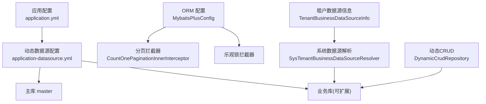
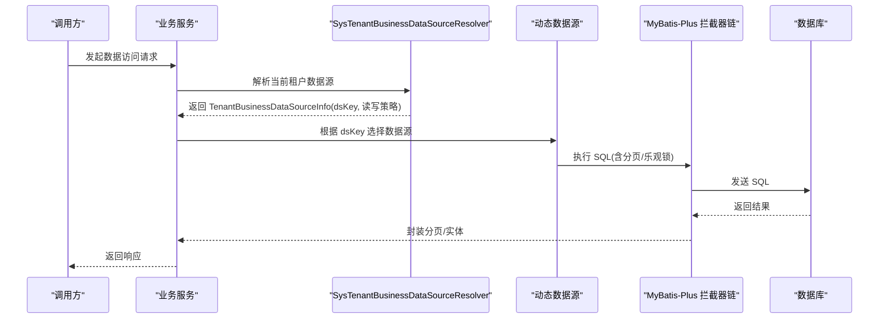
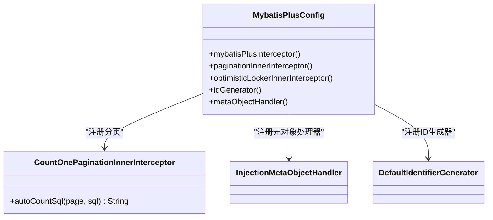
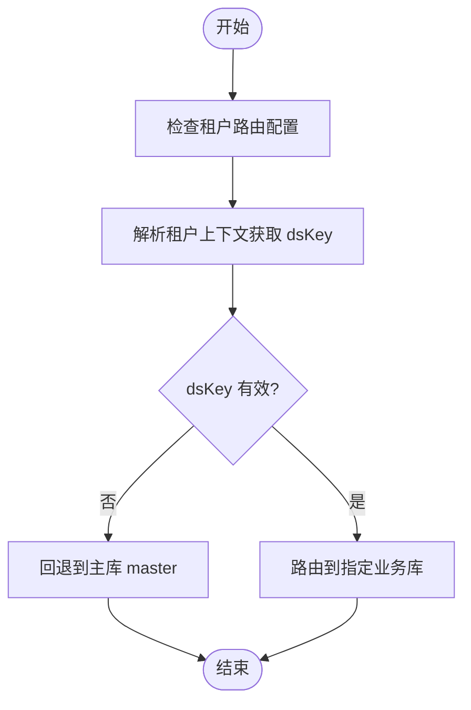
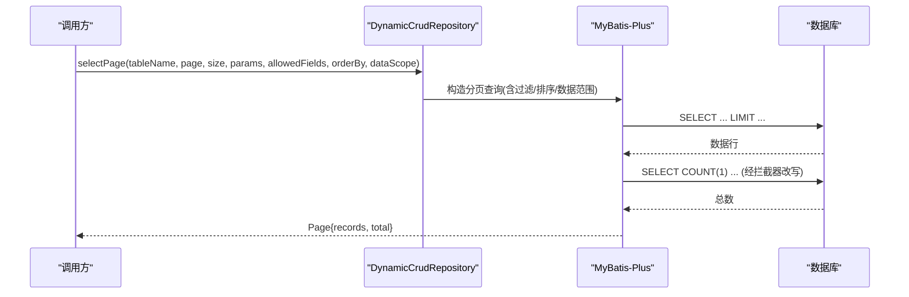
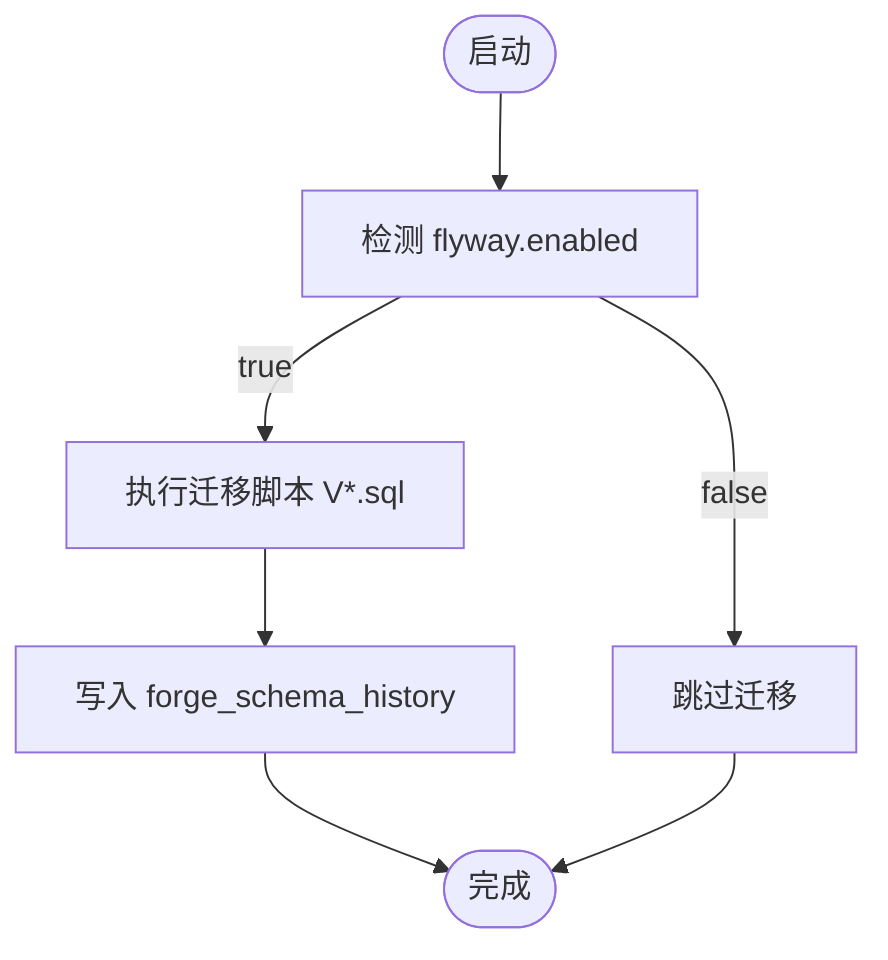
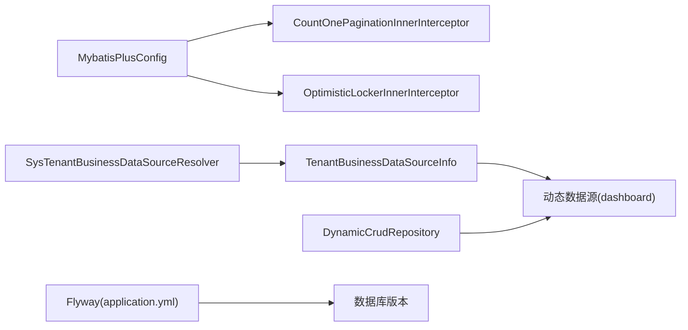

# 数据访问层

<cite>
**本文引用的文件**
- [MybatisPlusConfig.java](file://forge-server/forge-framework/forge-starter-parent/forge-starter-orm/src/main/java/com/mdframe/forge/starter/orm/config/MybatisPlusConfig.java)
- [CountOnePaginationInnerInterceptor.java](file://forge-server/forge-framework/forge-starter-parent/forge-starter-orm/src/main/java/com/mdframe/forge/starter/orm/interceptor/CountOnePaginationInnerInterceptor.java)
- [application.yml](file://forge-server/forge-admin-server/src/main/resources/application.yml)
- [application-datasource.yml](file://docker-forge-admin/application-datasource.yml)
- [TenantBusinessDataSourceInfo.java](file://forge-server/forge-framework/forge-starter-parent/forge-starter-tenant/src/main/java/com/mdframe/forge/starter/tenant/datasource/TenantBusinessDataSourceInfo.java)
- [SysTenantBusinessDataSourceResolver.java](file://forge-server/forge-framework/forge-plugin-parent/forge-plugin-system/src/main/java/com/mdframe/forge/plugin/system/datasource/SysTenantBusinessDataSourceResolver.java)
- [JdbcDataSourceProvider.java](file://forge-server/forge-framework/forge-plugin-parent/forge-plugin-data/src/main/java/com/mdframe/forge/plugin/data/support/JdbcDataSourceProvider.java)
- [DynamicCrudRepository.java](file://forge-server/forge-framework/forge-plugin-parent/forge-plugin-generator/src/main/java/com/mdframe/forge/plugin/generator/service/DynamicCrudRepository.java)
- [flyway-ai-coding.md](file://docs/blogs/flyway-ai-coding.md)
- [db-flyway.md](file://code-copilot/memory/pitfalls/db-flyway.md)
</cite>

## 目录
1. [简介](#简介)
2. [项目结构](#项目结构)
3. [核心组件](#核心组件)
4. [架构总览](#架构总览)
5. [详细组件分析](#详细组件分析)
6. [依赖关系分析](#依赖关系分析)
7. [性能与优化](#性能与优化)
8. [故障排查指南](#故障排查指南)
9. [结论](#结论)
10. [附录](#附录)

## 简介
本技术文档聚焦 Forge Admin 的数据访问层，围绕 MyBatis-Plus 集成、多数据源与租户路由、数据库迁移（Flyway）、SQL 优化、数据权限控制、连接池配置、事务管理与监控进行系统化说明。目标是帮助开发者快速理解并正确使用该层能力，同时提供可操作的优化与排错建议。

## 项目结构
数据访问相关的关键位置与职责：
- ORM 基础能力：MyBatis-Plus 拦截器、分页、乐观锁、元对象处理器、ID 生成等集中在 starter-orm 模块。
- 多数据源与租户路由：starter-tenant 提供租户维度的业务数据源解析模型；plugin-system 提供系统级数据源解析实现。
- 动态数据源配置：应用通过 dynamic-datasource 启动主库 master，并支持扩展其他业务库。
- 动态 CRUD：generator 插件提供基于表名的通用分页查询能力，便于低代码场景。
- 迁移管理：应用启用 Flyway，统一版本化脚本与校验策略。
- 外部数据源：data 插件提供运行时 Jdbc 数据源创建与管理，用于对接外部数据库。

图表来源
- [application.yml:65-72](file://forge-server/forge-admin-server/src/main/resources/application.yml#L65-L72)
- [application-datasource.yml:1-22](file://docker-forge-admin/application-datasource.yml#L1-L22)
- [MybatisPlusConfig.java:38-76](file://forge-server/forge-framework/forge-starter-parent/forge-starter-orm/src/main/java/com/mdframe/forge/starter/orm/config/MybatisPlusConfig.java#L38-L76)
- [TenantBusinessDataSourceInfo.java:8-55](file://forge-server/forge-framework/forge-starter-parent/forge-starter-tenant/src/main/java/com/mdframe/forge/starter/tenant/datasource/TenantBusinessDataSourceInfo.java#L8-L55)
- [SysTenantBusinessDataSourceResolver.java:31-41](file://forge-server/forge-framework/forge-plugin-parent/forge-plugin-system/src/main/java/com/mdframe/forge/plugin/system/datasource/SysTenantBusinessDataSourceResolver.java#L31-L41)

章节来源
- [application.yml:65-118](file://forge-server/forge-admin-server/src/main/resources/application.yml#L65-L118)
- [application-datasource.yml:1-22](file://docker-forge-admin/application-datasource.yml#L1-L22)

## 核心组件
- MyBatis-Plus 初始化与拦截器链：统一注册自定义拦截器、分页、乐观锁，并注入元对象处理器与雪花 ID 生成器。
- 分页优化：自定义分页拦截器将 COUNT(*) 替换为 COUNT(1)，提升复杂 SQL 的 count 解析稳定性。
- 多数据源与租户路由：以 TenantBusinessDataSourceInfo 表达当前租户的目标数据源及读写策略，由 SysTenantBusinessDataSourceResolver 解析 dsKey 并路由到具体数据源。
- 动态 CRUD：DynamicCrudRepository 提供按表名分页查询能力，支持搜索字段白名单、排序与数据范围条件注入。
- 外部数据源：JdbcDataSourceProvider 基于 Hikari 构建运行时数据源，支持连接参数与连接测试。
- 迁移管理：Flyway 启用并配置基线、历史表与迁移路径，遵循“不可变历史”原则。

章节来源
- [MybatisPlusConfig.java:27-90](file://forge-server/forge-framework/forge-starter-parent/forge-starter-orm/src/main/java/com/mdframe/forge/starter/orm/config/MybatisPlusConfig.java#L27-L90)
- [CountOnePaginationInnerInterceptor.java:14-31](file://forge-server/forge-framework/forge-starter-parent/forge-starter-orm/src/main/java/com/mdframe/forge/starter/orm/interceptor/CountOnePaginationInnerInterceptor.java#L14-L31)
- [TenantBusinessDataSourceInfo.java:8-95](file://forge-server/forge-framework/forge-starter-parent/forge-starter-tenant/src/main/java/com/mdframe/forge/starter/tenant/datasource/TenantBusinessDataSourceInfo.java#L8-L95)
- [SysTenantBusinessDataSourceResolver.java:31-41](file://forge-server/forge-framework/forge-plugin-parent/forge-plugin-system/src/main/java/com/mdframe/forge/plugin/system/datasource/SysTenantBusinessDataSourceResolver.java#L31-L41)
- [DynamicCrudRepository.java:83-105](file://forge-server/forge-framework/forge-plugin-parent/forge-plugin-generator/src/main/java/com/mdframe/forge/plugin/generator/service/DynamicCrudRepository.java#L83-L105)
- [JdbcDataSourceProvider.java:36-69](file://forge-server/forge-framework/forge-plugin-parent/forge-plugin-data/src/main/java/com/mdframe/forge/plugin/data/support/JdbcDataSourceProvider.java#L36-L69)
- [application.yml:65-72](file://forge-server/forge-admin-server/src/main/resources/application.yml#L65-L72)

## 架构总览
下图展示从请求进入、数据源路由、ORM 处理到返回的整体流程。

图表来源
- [SysTenantBusinessDataSourceResolver.java:31-41](file://forge-server/forge-framework/forge-plugin-parent/forge-plugin-system/src/main/java/com/mdframe/forge/plugin/system/datasource/SysTenantBusinessDataSourceResolver.java#L31-L41)
- [MybatisPlusConfig.java:38-76](file://forge-server/forge-framework/forge-starter-parent/forge-starter-orm/src/main/java/com/mdframe/forge/starter/orm/config/MybatisPlusConfig.java#L38-L76)
- [application-datasource.yml:1-22](file://docker-forge-admin/application-datasource.yml#L1-L22)

## 详细组件分析

### MyBatis-Plus 集成与使用模式
- 拦截器链：优先注册外部模块提供的 InnerInterceptor，再添加分页与乐观锁拦截器，确保扩展点开放且顺序可控。
- 分页优化：通过 CountOnePaginationInnerInterceptor 将 COUNT(*) 改写为 COUNT(1)，避免复杂嵌套条件下 count SQL 解析失败。
- 元对象处理器：InjectionMetaObjectHandler 负责自动填充审计字段（如创建时间、更新时间）。
- ID 生成：DefaultIdentifierGenerator 绑定网卡信息，降低集群环境下雪花 ID 冲突概率。
- 扫描与映射：mapperPackage、mapperLocations、typeAliasesPackage 在 application.yml 中集中配置，支持多包扫描与驼峰映射。

图表来源
- [MybatisPlusConfig.java:38-90](file://forge-server/forge-framework/forge-starter-parent/forge-starter-orm/src/main/java/com/mdframe/forge/starter/orm/config/MybatisPlusConfig.java#L38-L90)
- [CountOnePaginationInnerInterceptor.java:14-31](file://forge-server/forge-framework/forge-starter-parent/forge-starter-orm/src/main/java/com/mdframe/forge/starter/orm/interceptor/CountOnePaginationInnerInterceptor.java#L14-L31)

章节来源
- [MybatisPlusConfig.java:27-90](file://forge-server/forge-framework/forge-starter-parent/forge-starter-orm/src/main/java/com/mdframe/forge/starter/orm/config/MybatisPlusConfig.java#L27-L90)
- [CountOnePaginationInnerInterceptor.java:14-31](file://forge-server/forge-framework/forge-starter-parent/forge-starter-orm/src/main/java/com/mdframe/forge/starter/orm/interceptor/CountOnePaginationInnerInterceptor.java#L14-L31)
- [application.yml:97-118](file://forge-server/forge-admin-server/src/main/resources/application.yml#L97-L118)

### 多数据源配置与租户路由
- 动态数据源：application-datasource.yml 定义 primary=master，并通过 dynamic.datasource 扩展多个业务库。Hikari 连接池参数集中配置。
- 租户数据源信息：TenantBusinessDataSourceInfo 封装是否主库、dsKey、租户ID、数据源标识、只读/写权限、风险等级等。
- 解析器：SysTenantBusinessDataSourceResolver 读取配置开关与租户上下文，解析出目标 dsKey，供上层路由。
- 路由机制：结合 dynamic-datasource 的 Key 选择逻辑，将 SQL 路由至对应数据源。

图表来源
- [application-datasource.yml:1-22](file://docker-forge-admin/application-datasource.yml#L1-L22)
- [TenantBusinessDataSourceInfo.java:8-55](file://forge-server/forge-framework/forge-starter-parent/forge-starter-tenant/src/main/java/com/mdframe/forge/starter/tenant/datasource/TenantBusinessDataSourceInfo.java#L8-L55)
- [SysTenantBusinessDataSourceResolver.java:31-41](file://forge-server/forge-framework/forge-plugin-parent/forge-plugin-system/src/main/java/com/mdframe/forge/plugin/system/datasource/SysTenantBusinessDataSourceResolver.java#L31-L41)

章节来源
- [application-datasource.yml:1-22](file://docker-forge-admin/application-datasource.yml#L1-L22)
- [TenantBusinessDataSourceInfo.java:8-95](file://forge-server/forge-framework/forge-starter-parent/forge-starter-tenant/src/main/java/com/mdframe/forge/starter/tenant/datasource/TenantBusinessDataSourceInfo.java#L8-L95)
- [SysTenantBusinessDataSourceResolver.java:31-41](file://forge-server/forge-framework/forge-plugin-parent/forge-plugin-system/src/main/java/com/mdframe/forge/plugin/system/datasource/SysTenantBusinessDataSourceResolver.java#L31-L41)

### 动态 CRUD 与分页查询优化
- DynamicCrudRepository 提供 selectPage 方法族，支持表名、页码、页大小、搜索参数、允许搜索字段集合、字段映射、排序与数据范围条件注入。
- 配合 MyBatis-Plus 分页拦截器，自动完成 count 与 limit 拼接，并通过自定义拦截器保证 count SQL 的可解析性。
- 建议在业务侧限制搜索字段白名单，避免任意字段查询导致的全表扫描。

图表来源
- [DynamicCrudRepository.java:83-105](file://forge-server/forge-framework/forge-plugin-parent/forge-plugin-generator/src/main/java/com/mdframe/forge/plugin/generator/service/DynamicCrudRepository.java#L83-L105)
- [CountOnePaginationInnerInterceptor.java:14-31](file://forge-server/forge-framework/forge-starter-parent/forge-starter-orm/src/main/java/com/mdframe/forge/starter/orm/interceptor/CountOnePaginationInnerInterceptor.java#L14-L31)

章节来源
- [DynamicCrudRepository.java:83-105](file://forge-server/forge-framework/forge-plugin-parent/forge-plugin-generator/src/main/java/com/mdframe/forge/plugin/generator/service/DynamicCrudRepository.java#L83-L105)
- [CountOnePaginationInnerInterceptor.java:14-31](file://forge-server/forge-framework/forge-starter-parent/forge-starter-orm/src/main/java/com/mdframe/forge/starter/orm/interceptor/CountOnePaginationInnerInterceptor.java#L14-L31)

### 数据库迁移管理（Flyway）
- 启用与配置：application.yml 中开启 Flyway，设置迁移脚本路径、历史表名、基线版本与占位符替换策略。
- 版本控制：严格遵循“已落库脚本不可变”，修正需新增更高版本号；同一版本仅一个脚本。
- 回滚策略：生产环境谨慎回滚；开发环境可通过清理尾部连续历史后重跑或修复脚本后新增版本。
- 常见问题：checksum mismatch、唯一键冲突、批量更新失败等，需按规范处理。

图表来源
- [application.yml:65-72](file://forge-server/forge-admin-server/src/main/resources/application.yml#L65-L72)
- [flyway-ai-coding.md:37-76](file://docs/blogs/flyway-ai-coding.md#L37-L76)
- [db-flyway.md:66-92](file://code-copilot/memory/pitfalls/db-flyway.md#L66-L92)

章节来源
- [application.yml:65-72](file://forge-server/forge-admin-server/src/main/resources/application.yml#L65-L72)
- [flyway-ai-coding.md:37-76](file://docs/blogs/flyway-ai-coding.md#L37-L76)
- [db-flyway.md:66-92](file://code-copilot/memory/pitfalls/db-flyway.md#L66-L92)

### SQL 优化指南
- 索引设计
  - 为高频查询条件列建立复合索引，注意前导列选择性。
  - 对排序列与分组列评估覆盖索引，减少临时表与文件排序。
- 查询优化
  - 避免 SELECT *，仅选取必要字段。
  - 使用分页时确保 ORDER BY 字段有索引支撑。
  - 尽量利用白名单字段搜索，防止全表扫描。
- 慢查询分析
  - 开启慢查询日志，定位耗时 SQL。
  - 使用 EXPLAIN 分析执行计划，关注类型、key、rows、Extra。
  - 针对 COUNT(*) 解析问题，采用 COUNT(1) 替代（本项目已内置）。

[本节为通用指导，不直接分析具体文件]

### 数据权限控制
- 行级隔离：通过数据范围条件（dataScopeCondition）注入 WHERE 子句，实现租户/组织/角色维度数据隔离。
- 字段级控制：结合元对象处理器与序列化策略，对敏感字段进行脱敏或隐藏。
- 最佳实践：在动态查询中强制附加数据范围条件，避免绕过；对导出/报表类接口单独做权限校验。

[本节为概念性说明，不直接分析具体文件]

### 连接池配置与事务管理
- 连接池：HikariCP 作为默认连接池，配置最大连接数、空闲超时、连接生命周期与保活时间，保障高并发下的稳定性。
- 事务：启用 Spring 事务管理，结合 MyBatis-Plus 乐观锁拦截器，避免并发更新冲突。
- 监控：暴露健康检查端点，结合日志与慢查询统计进行观测。

章节来源
- [application-datasource.yml:14-22](file://docker-forge-admin/application-datasource.yml#L14-L22)
- [MybatisPlusConfig.java:27-29](file://forge-server/forge-framework/forge-starter-parent/forge-starter-orm/src/main/java/com/mdframe/forge/starter/orm/config/MybatisPlusConfig.java#L27-L29)
- [application.yml:220-228](file://forge-server/forge-admin-server/src/main/resources/application.yml#L220-L228)

### 外部数据源（运行时）
- JdbcDataSourceProvider 基于 Hikari 动态创建数据源，支持解密密码、连接测试与资源释放。
- 适用于低代码数据集、外部系统对接等场景，需严格控制连接生命周期与权限。

章节来源
- [JdbcDataSourceProvider.java:36-69](file://forge-server/forge-framework/forge-plugin-parent/forge-plugin-data/src/main/java/com/mdframe/forge/plugin/data/support/JdbcDataSourceProvider.java#L36-L69)

## 依赖关系分析
- ORM 层依赖动态数据源：MyBatis-Plus 拦截器链在 SQL 执行阶段与数据源选择解耦，通过拦截器增强功能。
- 租户路由依赖系统配置：SysTenantBusinessDataSourceResolver 读取配置与上下文，输出 TenantBusinessDataSourceInfo 供上层路由。
- 迁移与运行解耦：Flyway 在启动期执行，不影响运行时数据访问逻辑。

图表来源
- [MybatisPlusConfig.java:38-76](file://forge-server/forge-framework/forge-starter-parent/forge-starter-orm/src/main/java/com/mdframe/forge/starter/orm/config/MybatisPlusConfig.java#L38-L76)
- [SysTenantBusinessDataSourceResolver.java:31-41](file://forge-server/forge-framework/forge-plugin-parent/forge-plugin-system/src/main/java/com/mdframe/forge/plugin/system/datasource/SysTenantBusinessDataSourceResolver.java#L31-L41)
- [application.yml:65-72](file://forge-server/forge-admin-server/src/main/resources/application.yml#L65-L72)

章节来源
- [MybatisPlusConfig.java:38-76](file://forge-server/forge-framework/forge-starter-parent/forge-starter-orm/src/main/java/com/mdframe/forge/starter/orm/config/MybatisPlusConfig.java#L38-L76)
- [SysTenantBusinessDataSourceResolver.java:31-41](file://forge-server/forge-framework/forge-plugin-parent/forge-plugin-system/src/main/java/com/mdframe/forge/plugin/system/datasource/SysTenantBusinessDataSourceResolver.java#L31-L41)
- [application.yml:65-72](file://forge-server/forge-admin-server/src/main/resources/application.yml#L65-L72)

## 性能与优化
- 分页优化：使用 COUNT(1) 提升复杂 SQL 的 count 解析稳定性；合理设置 pageSize，避免过大页导致内存压力。
- 索引优化：为高频查询、排序、分组字段建立合适索引；避免过度索引影响写入性能。
- 查询优化：限定返回字段、使用白名单搜索、避免 N+1 查询；必要时引入缓存。
- 连接池调优：根据并发与延迟调整 maxPoolSize、idleTimeout、maxLifetime；监控连接泄漏。
- 事务边界：缩小事务范围，避免长事务；合理使用传播行为与隔离级别。
- 监控与诊断：开启慢查询日志、SQL 日志；结合 APM 工具观察热点 SQL。

[本节为通用指导，不直接分析具体文件]

## 故障排查指南
- Flyway 校验失败（checksum mismatch）
  - 现象：启动时报迁移校验失败。
  - 原因：已落库脚本被修改或重复使用版本号。
  - 解决：禁止修改已落库脚本，新增修正版本；必要时清理尾部历史后重跑。
- 唯一键冲突
  - 现象：迁移过程中出现 Duplicate entry。
  - 原因：数据归一化或种子数据插入时未考虑唯一约束。
  - 解决：先处理冲突数据或使用 INSERT ... SELECT ... WHERE NOT EXISTS。
- 分页 count 解析异常
  - 现象：复杂 SQL 下 count 解析失败。
  - 原因：JSqlParser 无法解析 COUNT(*)。
  - 解决：使用 COUNT(1)（本项目已内置拦截器）。
- 数据源路由错误
  - 现象：请求打到错误库或回退主库。
  - 原因：dsKey 无效或未正确解析。
  - 解决：检查租户上下文与配置，确认 dsKey 存在且有效。

章节来源
- [flyway-ai-coding.md:37-76](file://docs/blogs/flyway-ai-coding.md#L37-L76)
- [db-flyway.md:66-92](file://code-copilot/memory/pitfalls/db-flyway.md#L66-L92)
- [CountOnePaginationInnerInterceptor.java:14-31](file://forge-server/forge-framework/forge-starter-parent/forge-starter-orm/src/main/java/com/mdframe/forge/starter/orm/interceptor/CountOnePaginationInnerInterceptor.java#L14-L31)
- [SysTenantBusinessDataSourceResolver.java:31-41](file://forge-server/forge-framework/forge-plugin-parent/forge-plugin-system/src/main/java/com/mdframe/forge/plugin/system/datasource/SysTenantBusinessDataSourceResolver.java#L31-L41)

## 结论
Forge Admin 的数据访问层以 MyBatis-Plus 为核心，结合动态数据源与租户路由、Flyway 版本化管理、分页与乐观锁拦截器，形成稳定高效的数据访问体系。通过合理的索引与查询优化、严格的迁移规范与完善的监控手段，可在多租户与复杂业务场景下保持高性能与高可靠性。

## 附录
- 关键配置项参考
  - Flyway：enabled、locations、table、baseline-on-migrate、baseline-version
  - MyBatis-Plus：mapperPackage、mapperLocations、typeAliasesPackage、全局配置
  - 动态数据源：primary、strict、hikari 连接池参数
  - 租户路由：business.datasource.tenant-routing-enabled 等开关

[本节为配置概览，不直接分析具体文件]