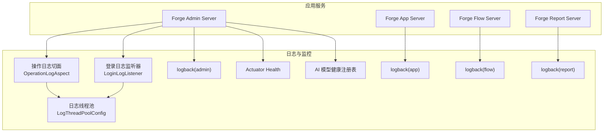
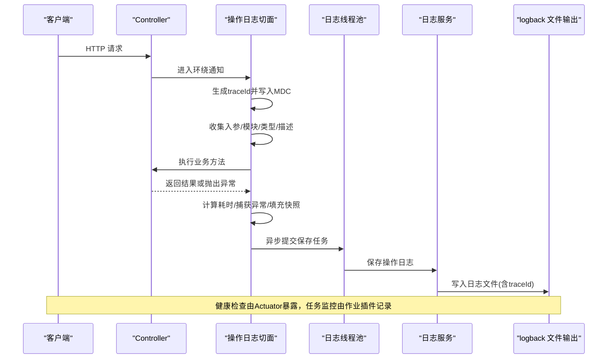
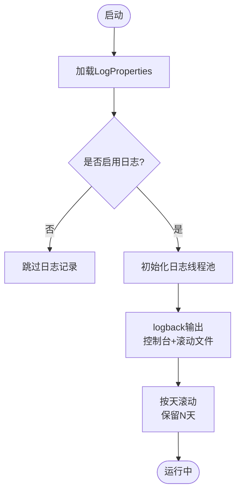
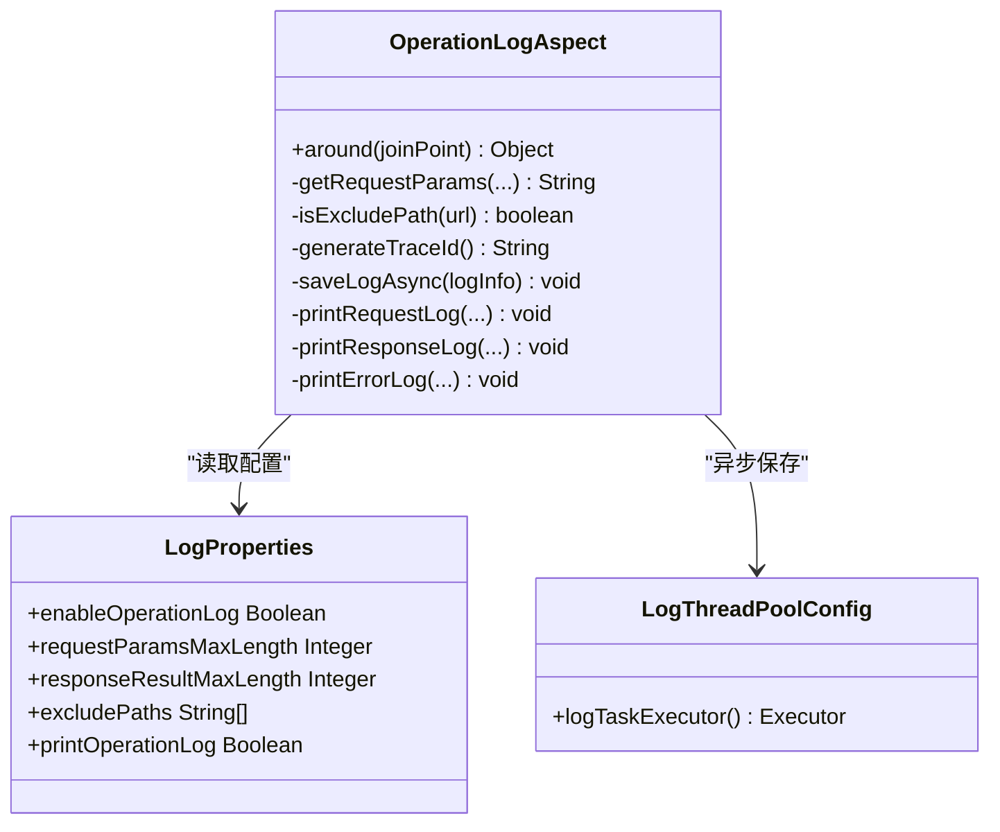
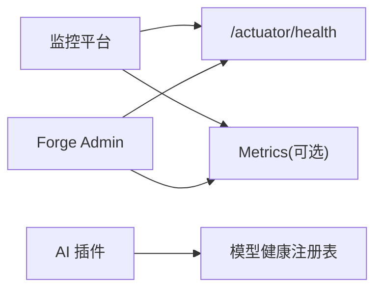
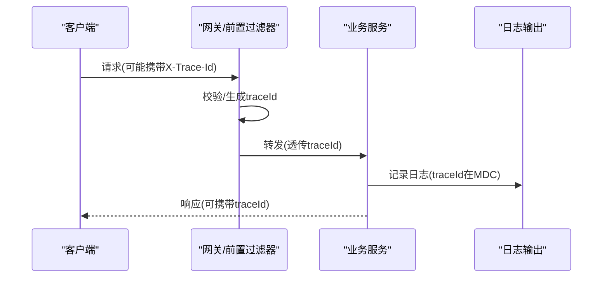
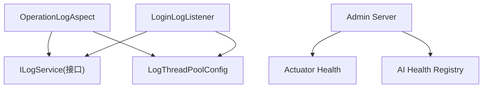

# 日志与监控

<cite>
**本文引用的文件**
- [LogProperties.java](file://forge-server/forge-framework/forge-starter-parent/forge-starter-core/src/main/java/com/mdframe/forge/starter/core/context/LogProperties.java)
- [OperationLogAspect.java](file://forge-server/forge-framework/forge-starter-parent/forge-starter-log/src/main/java/com/mdframe/forge/starter/log/aspect/OperationLogAspect.java)
- [LoginLogListener.java](file://forge-server/forge-framework/forge-starter-parent/forge-starter-log/src/main/java/com/mdframe/forge/starter/log/listener/LoginLogListener.java)
- [LogThreadPoolConfig.java](file://forge-server/forge-framework/forge-starter-parent/forge-starter-log/src/main/java/com/mdframe/forge/starter/log/config/LogThreadPoolConfig.java)
- [logback.xml（admin）](file://forge-server/forge-admin-server/src/main/resources/logback.xml)
- [logback.xml（app）](file://forge-server/forge-app-server/src/main/resources/logback.xml)
- [logback.xml（flow）](file://forge-server/forge-flow/forge-flow-server/src/main/resources/logback.xml)
- [logback.xml（report）](file://forge-server/forge-report-server/src/main/resources/logback.xml)
- [application.yml（admin）](file://forge-server/forge-admin-server/src/main/resources/application.yml)
- [ActuatorAnonymousSurfaceContractTest.java](file://forge-server/forge-framework/forge-starter-parent/forge-starter-auth/src/test/java/com/mdframe/forge/starter/auth/config/ActuatorAnonymousSurfaceContractTest.java)
- [AiModelHealthRegistry.java](file://forge-server/forge-framework/forge-plugin-parent/forge-plugin-ai/src/main/java/com/mdframe/forge/plugin/ai/health/AiModelHealthRegistry.java)
- [InMemoryAiModelHealthRegistry.java](file://forge-server/forge-framework/forge-plugin-parent/forge-plugin-ai/src/main/java/com/mdframe/forge/plugin/ai/health/InMemoryAiModelHealthRegistry.java)
- [JobMonitorTest.java](file://forge-server/forge-framework/forge-plugin-parent/forge-plugin-job/src/test/java/com/mdframe/forge/plugin/job/monitor/JobMonitorTest.java)
- [统一错误诊断规范 spec.md](file://code-copilot/changes/unified-error-diagnostics/spec.md)
</cite>

## 目录
1. [简介](#简介)
2. [项目结构](#项目结构)
3. [核心组件](#核心组件)
4. [架构总览](#架构总览)
5. [详细组件分析](#详细组件分析)
6. [依赖关系分析](#依赖关系分析)
7. [性能考量](#性能考量)
8. [故障排查指南](#故障排查指南)
9. [结论](#结论)
10. [附录](#附录)

## 简介
本技术文档围绕 Forge Admin 的日志与监控系统，系统阐述以下能力：
- 统一日志框架集成：日志级别、结构化输出、TraceId 贯穿、日志轮转与存储策略。
- AOP 切面编程：方法执行时间统计、参数与响应结果记录、异常捕获与脱敏。
- 监控系统集成：健康检查端点、性能指标采集、告警规则建议。
- 日志分析工具：ELK 栈集成思路、检索与趋势分析方法。
- 分布式追踪：链路 ID 传递、跨服务调用追踪、瓶颈定位。
- 合规与安全：敏感信息脱敏、日志保留周期、审计可追溯性。

## 项目结构
本项目在多个子模块中提供统一的日志与监控能力：
- 配置中心：通过 LogProperties 集中管理日志开关、长度限制、排除路径、线程池等。
- 日志切面：OperationLogAspect 对 Controller 层进行统一拦截，实现入参/出参/耗时/异常的结构化记录。
- 登录审计：LoginLogListener 监听 Sa-Token 事件，记录登录/登出/踢下线等安全审计日志。
- 异步落盘：LogThreadPoolConfig 提供独立线程池，避免阻塞业务线程。
- 日志输出：各服务 logback.xml 定义控制台与滚动文件输出，统一包含 traceId。
- 监控与健康：Spring Boot Actuator 暴露 health 端点；AI 插件提供模型健康快照能力。
- 任务监控：作业调度插件具备日志脱敏与持久化能力。

**图表来源**
- [OperationLogAspect.java:89-242](file://forge-server/forge-framework/forge-starter-parent/forge-starter-log/src/main/java/com/mdframe/forge/starter/log/aspect/OperationLogAspect.java#L89-L242)
- [LoginLogListener.java:48-133](file://forge-server/forge-framework/forge-starter-parent/forge-starter-log/src/main/java/com/mdframe/forge/starter/log/listener/LoginLogListener.java#L48-L133)
- [LogThreadPoolConfig.java:27-56](file://forge-server/forge-framework/forge-starter-parent/forge-starter-log/src/main/java/com/mdframe/forge/starter/log/config/LogThreadPoolConfig.java#L27-L56)
- [logback.xml（admin）:1-48](file://forge-server/forge-admin-server/src/main/resources/logback.xml#L1-L48)
- [logback.xml（app）:1-48](file://forge-server/forge-app-server/src/main/resources/logback.xml#L1-L48)
- [logback.xml（flow）:1-48](file://forge-server/forge-flow/forge-flow-server/src/main/resources/logback.xml#L1-L48)
- [logback.xml（report）:1-48](file://forge-server/forge-report-server/src/main/resources/logback.xml#L1-L48)
- [application.yml（admin）:220-228](file://forge-server/forge-admin-server/src/main/resources/application.yml#L220-L228)
- [AiModelHealthRegistry.java:1-9](file://forge-server/forge-framework/forge-plugin-parent/forge-plugin-ai/src/main/java/com/mdframe/forge/plugin/ai/health/AiModelHealthRegistry.java#L1-L9)

**章节来源**
- [LogProperties.java:1-81](file://forge-server/forge-framework/forge-starter-parent/forge-starter-core/src/main/java/com/mdframe/forge/starter/core/context/LogProperties.java#L1-L81)
- [OperationLogAspect.java:1-677](file://forge-server/forge-framework/forge-starter-parent/forge-starter-log/src/main/java/com/mdframe/forge/starter/log/aspect/OperationLogAspect.java#L1-L677)
- [LoginLogListener.java:1-354](file://forge-server/forge-framework/forge-starter-parent/forge-starter-log/src/main/java/com/mdframe/forge/starter/log/listener/LoginLogListener.java#L1-L354)
- [LogThreadPoolConfig.java:1-57](file://forge-server/forge-framework/forge-starter-parent/forge-starter-log/src/main/java/com/mdframe/forge/starter/log/config/LogThreadPoolConfig.java#L1-L57)
- [logback.xml（admin）:1-48](file://forge-server/forge-admin-server/src/main/resources/logback.xml#L1-L48)
- [logback.xml（app）:1-48](file://forge-server/forge-app-server/src/main/resources/logback.xml#L1-L48)
- [logback.xml（flow）:1-48](file://forge-server/forge-flow/forge-flow-server/src/main/resources/logback.xml#L1-L48)
- [logback.xml（report）:1-48](file://forge-server/forge-report-server/src/main/resources/logback.xml#L1-L48)
- [application.yml（admin）:220-228](file://forge-server/forge-admin-server/src/main/resources/application.yml#L220-L228)
- [AiModelHealthRegistry.java:1-9](file://forge-server/forge-framework/forge-plugin-parent/forge-plugin-ai/src/main/java/com/mdframe/forge/plugin/ai/health/AiModelHealthRegistry.java#L1-L9)

## 核心组件
- 日志配置属性：统一开关、长度限制、排除路径、打印控制、线程池参数。
- 操作日志切面：自动捕获请求/响应、计算耗时、异常处理、MDC 注入 traceId、异步保存。
- 登录日志监听器：监听认证生命周期事件，记录登录/登出/踢下线等审计日志。
- 日志线程池：隔离日志 I/O，避免影响主业务线程。
- 日志输出：按服务拆分日志文件，基于时间滚动，统一格式含 traceId。
- 健康检查：暴露 /actuator/health，最小权限访问。
- 任务监控：作业日志脱敏与持久化，便于审计与排障。

**章节来源**
- [LogProperties.java:1-81](file://forge-server/forge-framework/forge-starter-parent/forge-starter-core/src/main/java/com/mdframe/forge/starter/core/context/LogProperties.java#L1-L81)
- [OperationLogAspect.java:89-242](file://forge-server/forge-framework/forge-starter-parent/forge-starter-log/src/main/java/com/mdframe/forge/starter/log/aspect/OperationLogAspect.java#L89-L242)
- [LoginLogListener.java:48-133](file://forge-server/forge-framework/forge-starter-parent/forge-starter-log/src/main/java/com/mdframe/forge/starter/log/listener/LoginLogListener.java#L48-L133)
- [LogThreadPoolConfig.java:27-56](file://forge-server/forge-framework/forge-starter-parent/forge-starter-log/src/main/java/com/mdframe/forge/starter/log/config/LogThreadPoolConfig.java#L27-L56)
- [logback.xml（admin）:1-48](file://forge-server/forge-admin-server/src/main/resources/logback.xml#L1-L48)
- [application.yml（admin）:220-228](file://forge-server/forge-admin-server/src/main/resources/application.yml#L220-L228)

## 架构总览
下图展示从请求进入、AOP 切面记录、异步落盘到日志输出的整体流程，以及健康检查与任务监控的集成点。

**图表来源**
- [OperationLogAspect.java:89-242](file://forge-server/forge-framework/forge-starter-parent/forge-starter-log/src/main/java/com/mdframe/forge/starter/log/aspect/OperationLogAspect.java#L89-L242)
- [LogThreadPoolConfig.java:27-56](file://forge-server/forge-framework/forge-starter-parent/forge-starter-log/src/main/java/com/mdframe/forge/starter/log/config/LogThreadPoolConfig.java#L27-L56)
- [logback.xml（admin）:1-48](file://forge-server/forge-admin-server/src/main/resources/logback.xml#L1-L48)
- [application.yml（admin）:220-228](file://forge-server/forge-admin-server/src/main/resources/application.yml#L220-L228)

## 详细组件分析

### 统一日志框架集成
- 日志级别与输出：
  - 各服务 logback.xml 定义控制台与滚动文件输出，统一包含 traceId 字段，便于关联查询。
  - 日志文件按天滚动，保留历史天数可控。
- 结构化日志：
  - 操作日志包含模块、类型、描述、URL、方法、IP、UA、页面信息等。
  - 登录日志包含用户、IP、浏览器、操作系统、事件类型与状态。
- TraceId 贯穿：
  - 切面与监听器均将 traceId 放入 MDC，确保日志可被聚合平台关联。
- 日志轮转与存储：
  - TimeBasedRollingPolicy 按日滚动，maxHistory 控制保留期，避免磁盘膨胀。
- 配置项：
  - 通过 LogProperties 控制是否启用操作/登录日志、参数与响应最大长度、排除路径、控制台打印开关、线程池大小等。

**图表来源**
- [LogProperties.java:1-81](file://forge-server/forge-framework/forge-starter-parent/forge-starter-core/src/main/java/com/mdframe/forge/starter/core/context/LogProperties.java#L1-L81)
- [LogThreadPoolConfig.java:27-56](file://forge-server/forge-framework/forge-starter-parent/forge-starter-log/src/main/java/com/mdframe/forge/starter/log/config/LogThreadPoolConfig.java#L27-L56)
- [logback.xml（admin）:1-48](file://forge-server/forge-admin-server/src/main/resources/logback.xml#L1-L48)

**章节来源**
- [LogProperties.java:1-81](file://forge-server/forge-framework/forge-starter-parent/forge-starter-core/src/main/java/com/mdframe/forge/starter/core/context/LogProperties.java#L1-L81)
- [logback.xml（admin）:1-48](file://forge-server/forge-admin-server/src/main/resources/logback.xml#L1-L48)
- [logback.xml（app）:1-48](file://forge-server/forge-app-server/src/main/resources/logback.xml#L1-L48)
- [logback.xml（flow）:1-48](file://forge-server/forge-flow/forge-flow-server/src/main/resources/logback.xml#L1-L48)
- [logback.xml（report）:1-48](file://forge-server/forge-report-server/src/main/resources/logback.xml#L1-L48)

### AOP 切面编程应用
- 方法执行时间统计：
  - 切面记录开始时间，执行完成后计算耗时并写入日志。
- 参数日志记录：
  - 自动收集方法参数与 URL 参数，支持截断与敏感字段过滤。
  - 对带 @RequestBody 的请求体在解密场景下可选择省略以避免泄露。
- 异常捕获处理：
  - 捕获异常并记录错误消息、耗时，同时保持异常向上抛出。
- 审计快照：
  - 结合上下文快照记录变更前后的数据差异，增强审计能力。
- 排除路径与只读方法：
  - 根据配置与 URL 模式判断是否记录操作日志，减少噪音。

**图表来源**
- [OperationLogAspect.java:89-242](file://forge-server/forge-framework/forge-starter-parent/forge-starter-log/src/main/java/com/mdframe/forge/starter/log/aspect/OperationLogAspect.java#L89-L242)
- [LogProperties.java:1-81](file://forge-server/forge-framework/forge-starter-parent/forge-starter-core/src/main/java/com/mdframe/forge/starter/core/context/LogProperties.java#L1-L81)
- [LogThreadPoolConfig.java:27-56](file://forge-server/forge-framework/forge-starter-parent/forge-starter-log/src/main/java/com/mdframe/forge/starter/log/config/LogThreadPoolConfig.java#L27-L56)

**章节来源**
- [OperationLogAspect.java:89-242](file://forge-server/forge-framework/forge-starter-parent/forge-starter-log/src/main/java/com/mdframe/forge/starter/log/aspect/OperationLogAspect.java#L89-L242)
- [OperationLogAspect.java:449-502](file://forge-server/forge-framework/forge-starter-parent/forge-starter-log/src/main/java/com/mdframe/forge/starter/log/aspect/OperationLogAspect.java#L449-L502)
- [OperationLogAspect.java:558-595](file://forge-server/forge-framework/forge-starter-parent/forge-starter-log/src/main/java/com/mdframe/forge/starter/log/aspect/OperationLogAspect.java#L558-L595)

### 监控系统集成
- 健康检查：
  - Spring Boot Actuator 暴露 /actuator/health，测试用例确保仅该端点匿名访问。
- 性能指标：
  - 可通过 Actuator metrics 扩展采集 JVM、HTTP、数据库等指标（按需引入）。
- 告警规则建议：
  - 基于健康检查失败率、接口超时比例、错误日志增长率设置阈值告警。
- AI 模型健康：
  - 提供健康快照与租约机制，用于探测外部模型可用性。

**图表来源**
- [application.yml（admin）:220-228](file://forge-server/forge-admin-server/src/main/resources/application.yml#L220-L228)
- [ActuatorAnonymousSurfaceContractTest.java:14-25](file://forge-server/forge-framework/forge-starter-parent/forge-starter-auth/src/test/java/com/mdframe/forge/starter/auth/config/ActuatorAnonymousSurfaceContractTest.java#L14-L25)
- [AiModelHealthRegistry.java:1-9](file://forge-server/forge-framework/forge-plugin-parent/forge-plugin-ai/src/main/java/com/mdframe/forge/plugin/ai/health/AiModelHealthRegistry.java#L1-L9)

**章节来源**
- [application.yml（admin）:220-228](file://forge-server/forge-admin-server/src/main/resources/application.yml#L220-L228)
- [ActuatorAnonymousSurfaceContractTest.java:14-25](file://forge-server/forge-framework/forge-starter-parent/forge-starter-auth/src/test/java/com/mdframe/forge/starter/auth/config/ActuatorAnonymousSurfaceContractTest.java#L14-L25)
- [AiModelHealthRegistry.java:1-9](file://forge-server/forge-framework/forge-plugin-parent/forge-plugin-ai/src/main/java/com/mdframe/forge/plugin/ai/health/AiModelHealthRegistry.java#L1-L9)
- [InMemoryAiModelHealthRegistry.java:1-25](file://forge-server/forge-framework/forge-plugin-parent/forge-plugin-ai/src/main/java/com/mdframe/forge/plugin/ai/health/InMemoryAiModelHealthRegistry.java#L1-L25)

### 分布式追踪实现
- 链路 ID 传递：
  - 切面与监听器生成 traceId 并写入 MDC，日志输出包含 traceId。
- 跨服务调用追踪：
  - 建议在网关/过滤器中解析上游 X-Trace-Id，若缺失则生成新 ID，并在响应头回传。
- 性能瓶颈定位：
  - 结合接口耗时、错误日志、下游依赖耗时，使用 traceId 串联全链路日志。

**图表来源**
- [OperationLogAspect.java:149-152](file://forge-server/forge-framework/forge-starter-parent/forge-starter-log/src/main/java/com/mdframe/forge/starter/log/aspect/OperationLogAspect.java#L149-L152)
- [LoginLogListener.java:55-67](file://forge-server/forge-framework/forge-starter-parent/forge-starter-log/src/main/java/com/mdframe/forge/starter/log/listener/LoginLogListener.java#L55-L67)
- [统一错误诊断规范 spec.md:521-549](file://code-copilot/changes/unified-error-diagnostics/spec.md#L521-L549)

**章节来源**
- [统一错误诊断规范 spec.md:521-549](file://code-copilot/changes/unified-error-diagnostics/spec.md#L521-L549)
- [OperationLogAspect.java:149-152](file://forge-server/forge-framework/forge-starter-parent/forge-starter-log/src/main/java/com/mdframe/forge/starter/log/aspect/OperationLogAspect.java#L149-L152)
- [LoginLogListener.java:55-67](file://forge-server/forge-framework/forge-starter-parent/forge-starter-log/src/main/java/com/mdframe/forge/starter/log/listener/LoginLogListener.java#L55-L67)

### 日志分析工具使用指南（ELK 栈）
- 集成方式：
  - 在各服务 logback.xml 中输出 JSON 或结构化文本，便于 Logstash/Filebeat 采集。
  - 索引命名建议按服务与环境区分，如 forge-admin-info-%{yyyy-MM-dd}。
- 检索技巧：
  - 使用 traceId 作为主键进行跨服务关联检索。
  - 结合模块、类型、URI、状态码进行多维筛选。
- 趋势分析：
  - 基于耗时、错误率、QPS 构建仪表盘，识别峰值与异常波动。
  - 对高频错误建立告警规则，及时通知运维。

[本节为通用实践说明，不直接分析具体代码文件]

### 日志轮转策略、存储空间管理与合规性要求
- 轮转策略：
  - 基于时间的滚动策略，按天归档，保留 N 天历史。
- 存储空间管理：
  - 合理设置 maxHistory，定期清理过期日志。
  - 对大体积响应/请求进行截断，避免单条日志过大。
- 合规性：
  - 敏感字段脱敏（如密码、令牌），避免明文记录。
  - 审计日志不可篡改，保留周期满足合规要求。
  - 遵循最小化原则，仅记录必要字段。

**章节来源**
- [logback.xml（admin）:15-27](file://forge-server/forge-admin-server/src/main/resources/logback.xml#L15-L27)
- [LogProperties.java:27-54](file://forge-server/forge-framework/forge-starter-parent/forge-starter-core/src/main/java/com/mdframe/forge/starter/core/context/LogProperties.java#L27-L54)
- [OperationLogAspect.java:449-502](file://forge-server/forge-framework/forge-starter-parent/forge-starter-log/src/main/java/com/mdframe/forge/starter/log/aspect/OperationLogAspect.java#L449-L502)

## 依赖关系分析
- 松耦合设计：
  - 切面依赖 ILogService 接口，便于替换实现。
  - 日志线程池独立配置，不影响业务线程。
- 外部依赖：
  - Sa-Token 事件驱动登录日志。
  - Spring Boot Actuator 提供健康检查。
  - AI 插件提供模型健康能力。
- 潜在循环依赖：
  - 切面与日志服务之间无循环引用，通过接口解耦。

**图表来源**
- [OperationLogAspect.java:46-57](file://forge-server/forge-framework/forge-starter-parent/forge-starter-log/src/main/java/com/mdframe/forge/starter/log/aspect/OperationLogAspect.java#L46-L57)
- [LoginLogListener.java:31-40](file://forge-server/forge-framework/forge-starter-parent/forge-starter-log/src/main/java/com/mdframe/forge/starter/log/listener/LoginLogListener.java#L31-L40)
- [LogThreadPoolConfig.java:27-56](file://forge-server/forge-framework/forge-starter-parent/forge-starter-log/src/main/java/com/mdframe/forge/starter/log/config/LogThreadPoolConfig.java#L27-L56)
- [application.yml（admin）:220-228](file://forge-server/forge-admin-server/src/main/resources/application.yml#L220-L228)
- [AiModelHealthRegistry.java:1-9](file://forge-server/forge-framework/forge-plugin-parent/forge-plugin-ai/src/main/java/com/mdframe/forge/plugin/ai/health/AiModelHealthRegistry.java#L1-L9)

**章节来源**
- [OperationLogAspect.java:46-57](file://forge-server/forge-framework/forge-starter-parent/forge-starter-log/src/main/java/com/mdframe/forge/starter/log/aspect/OperationLogAspect.java#L46-L57)
- [LoginLogListener.java:31-40](file://forge-server/forge-framework/forge-starter-parent/forge-starter-log/src/main/java/com/mdframe/forge/starter/log/listener/LoginLogListener.java#L31-L40)
- [LogThreadPoolConfig.java:27-56](file://forge-server/forge-framework/forge-starter-parent/forge-starter-log/src/main/java/com/mdframe/forge/starter/log/config/LogThreadPoolConfig.java#L27-L56)
- [application.yml（admin）:220-228](file://forge-server/forge-admin-server/src/main/resources/application.yml#L220-L228)
- [AiModelHealthRegistry.java:1-9](file://forge-server/forge-framework/forge-plugin-parent/forge-plugin-ai/src/main/java/com/mdframe/forge/plugin/ai/health/AiModelHealthRegistry.java#L1-L9)

## 性能考量
- 异步落盘：
  - 使用独立线程池异步保存日志，降低对业务线程的影响。
- 参数与响应截断：
  - 通过配置限制最大长度，避免大对象序列化开销。
- 排除路径：
  - 对高频且非关键接口（如验证码、健康检查）排除日志记录。
- 只读方法优化：
  - 对 GET/HEAD/OPTIONS 等方法默认不记录操作日志，减少噪音。
- 线程池调优：
  - 根据负载调整核心线程数、最大线程数与队列容量。

**章节来源**
- [LogThreadPoolConfig.java:27-56](file://forge-server/forge-framework/forge-starter-parent/forge-starter-log/src/main/java/com/mdframe/forge/starter/log/config/LogThreadPoolConfig.java#L27-L56)
- [LogProperties.java:27-79](file://forge-server/forge-framework/forge-starter-parent/forge-starter-core/src/main/java/com/mdframe/forge/starter/core/context/LogProperties.java#L27-L79)
- [OperationLogAspect.java:300-330](file://forge-server/forge-framework/forge-starter-parent/forge-starter-log/src/main/java/com/mdframe/forge/starter/log/aspect/OperationLogAspect.java#L300-L330)

## 故障排查指南
- 常见问题：
  - 日志未输出：检查是否启用操作/登录日志、是否命中排除路径。
  - 日志丢失：检查线程池是否饱和、拒绝策略是否为 CallerRunsPolicy。
  - 敏感信息泄露：确认请求体与响应体是否开启脱敏或省略。
- 定位步骤：
  - 使用 traceId 在全链路日志中检索。
  - 查看健康检查端点与错误日志，确认服务状态。
  - 对作业日志进行脱敏校验，确保敏感字段已清洗。

**章节来源**
- [OperationLogAspect.java:558-595](file://forge-server/forge-framework/forge-starter-parent/forge-starter-log/src/main/java/com/mdframe/forge/starter/log/aspect/OperationLogAspect.java#L558-L595)
- [LoginLogListener.java:299-312](file://forge-server/forge-framework/forge-starter-parent/forge-starter-log/src/main/java/com/mdframe/forge/starter/log/listener/LoginLogListener.java#L299-L312)
- [JobMonitorTest.java:20-41](file://forge-server/forge-framework/forge-plugin-parent/forge-plugin-job/src/test/java/com/mdframe/forge/plugin/job/monitor/JobMonitorTest.java#L20-L41)

## 结论
Forge Admin 的日志与监控系统通过统一配置、AOP 切面、异步落盘与滚动输出，实现了高内聚、低耦合的可观测性能力。结合健康检查、任务监控与分布式追踪，能够有效支撑生产环境的稳定性保障与问题定位。建议在生产环境中完善 ELK 集成、指标采集与告警规则，持续优化日志质量与性能。

[本节为总结性内容，不直接分析具体代码文件]

## 附录
- 配置示例：
  - 在 application.yml 中启用/禁用日志功能、调整线程池参数。
  - 在 logback.xml 中配置滚动策略与保留天数。
- 最佳实践：
  - 统一 traceId 规范，前后端一致。
  - 敏感信息脱敏，最小化日志字段。
  - 定期评估日志量与存储成本，优化记录策略。

[本节为补充说明，不直接分析具体代码文件]