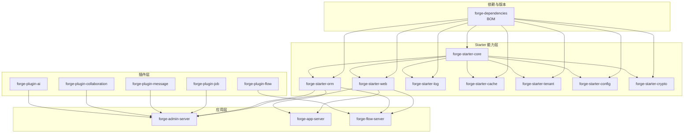
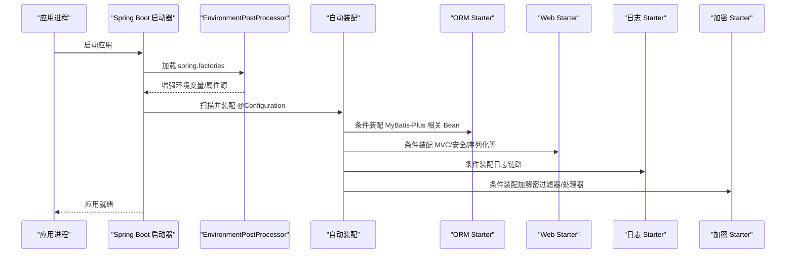
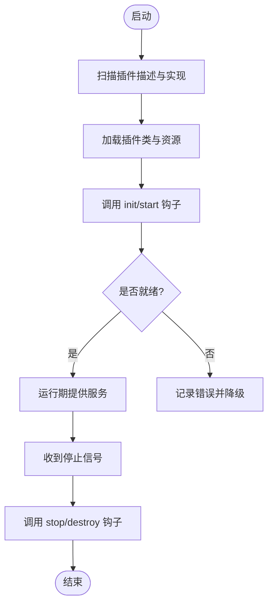
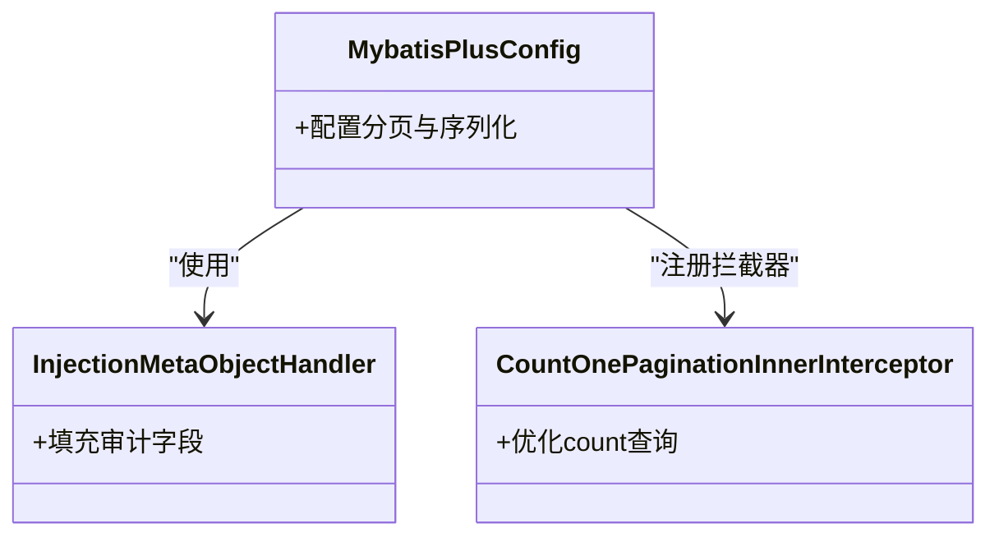
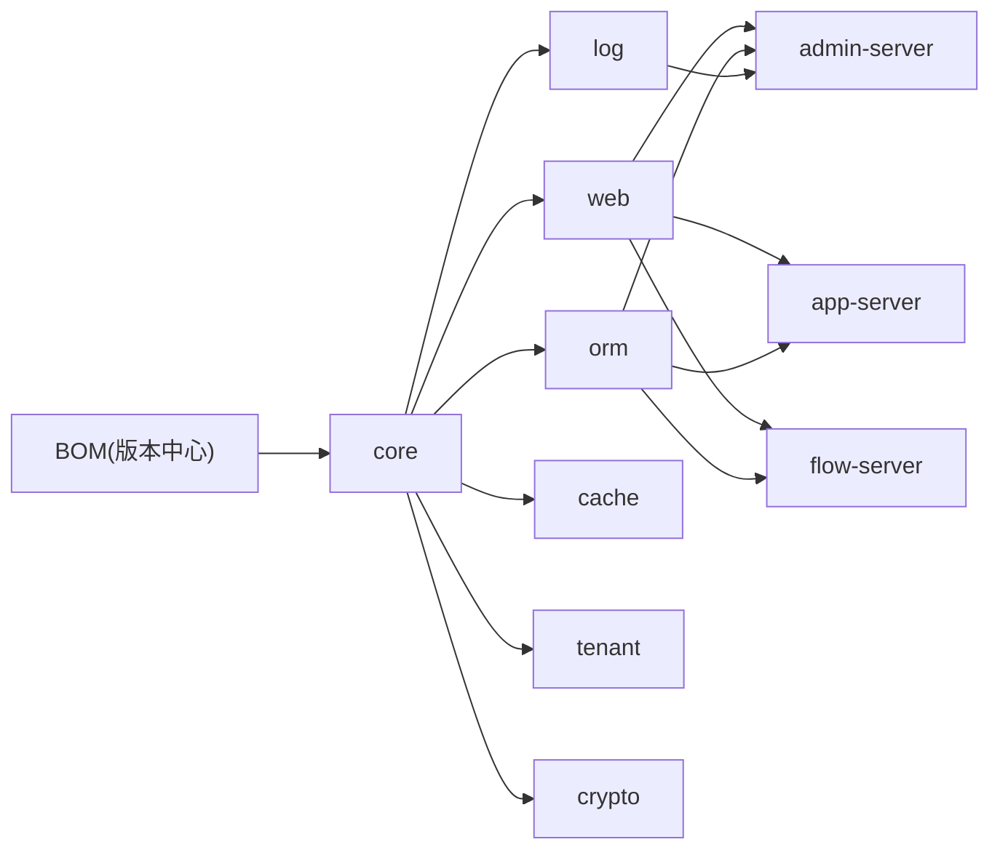

# 框架层设计

<cite>
**本文引用的文件**
- [forge-dependencies/pom.xml](file://forge-server/forge-framework/forge-dependencies/pom.xml)
- [forge-starter-config/spring.factories](file://forge-server/forge-framework/forge-starter-parent/forge-starter-config/src/main/resources/META-INF/spring.factories)
- [forge-starter-crypto/spring.factories](file://forge-server/forge-framework/forge-starter-parent/forge-starter-crypto/src/main/resources/META-INF/spring.factories)
- [forge-starter-core/pom.xml](file://forge-server/forge-framework/forge-starter-parent/forge-starter-core/pom.xml)
- [forge-starter-config/pom.xml](file://forge-server/forge-framework/forge-starter-parent/forge-starter-config/pom.xml)
- [forge-starter-orm/MybatisPlusConfig.java](file://forge-server/forge-framework/forge-starter-parent/forge-starter-orm/src/main/java/com/mdframe/forge/starter/orm/config/MybatisPlusConfig.java)
- [forge-starter-orm/InjectionMetaObjectHandler.java](file://forge-server/forge-framework/forge-starter-parent/forge-starter-orm/src/main/java/com/mdframe/forge/starter/orm/handler/InjectionMetaObjectHandler.java)
- [forge-starter-orm/CountOnePaginationInnerInterceptor.java](file://forge-server/forge-framework/forge-starter-parent/forge-starter-orm/src/main/java/com/mdframe/forge/starter/orm/interceptor/CountOnePaginationInnerInterceptor.java)
- [application.yml（管理端）](file://forge-server/forge-admin-server/src/main/resources/application.yml)
- [application.yml（应用端）](file://forge-server/forge-app-server/src/main/resources/application.yml)
- [application.yml（流程端）](file://forge-server/forge-flow/forge-flow-server/src/main/resources/application.yml)
</cite>

## 目录
1. [简介](#简介)
2. [项目结构](#项目结构)
3. [核心组件](#核心组件)
4. [架构总览](#架构总览)
5. [详细组件分析](#详细组件分析)
6. [依赖关系分析](#依赖关系分析)
7. [性能考量](#性能考量)
8. [故障排查指南](#故障排查指南)
9. [结论](#结论)
10. [附录](#附录)

## 简介
本技术文档聚焦 Forge Admin 的框架层设计，围绕 Spring Boot Starter 组件化与自动装配、插件化架构（SPI 机制、动态加载与生命周期）、依赖版本统一管理（BOM）、Starter 开发指南（配置绑定、自动装配注解、最佳实践），以及横切关注点（日志、异常统一化、监控指标）进行系统化阐述。内容基于仓库中 forge-framework 下的 starter 与 plugin 工程、forge-dependencies BOM 及多服务 application.yml 配置进行分析与归纳。

## 项目结构
Forge Admin 采用多模块分层组织：
- 依赖与版本中心：forge-dependencies（BOM）集中声明第三方库与内部 starter/plugin 版本。
- 能力 Starter：forge-starter-parent 下按能力拆分（core/web/orm/log/cache/tenant/...），每个 Starter 提供独立自动装配与可插拔能力。
- 业务插件：forge-plugin-parent 下以插件形式封装领域能力（flow/job/message/collaboration/ai/...）。
- 应用入口：forge-admin-server、forge-app-server、forge-flow-server 等通过引入对应 Starter 组合能力。

图表来源
- [forge-dependencies/pom.xml:75-527](file://forge-server/forge-framework/forge-dependencies/pom.xml#L75-L527)
- [forge-starter-core/pom.xml:14-121](file://forge-server/forge-framework/forge-starter-parent/forge-starter-core/pom.xml#L14-L121)
- [forge-starter-config/pom.xml:14-30](file://forge-server/forge-framework/forge-starter-parent/forge-starter-config/pom.xml#L14-L30)

章节来源
- [forge-dependencies/pom.xml:75-527](file://forge-server/forge-framework/forge-dependencies/pom.xml#L75-L527)
- [forge-starter-core/pom.xml:14-121](file://forge-server/forge-framework/forge-starter-parent/forge-starter-core/pom.xml#L14-L121)
- [forge-starter-config/pom.xml:14-30](file://forge-server/forge-framework/forge-starter-parent/forge-starter-config/pom.xml#L14-L30)

## 核心组件
- 依赖与版本管理（BOM）：在 BOM 中集中声明 Spring Boot、MyBatis-Plus、Sa-Token、Redisson、Flowable、Hutool、Undertow 等关键依赖及其版本，并通过 dependencyManagement 与 import 方式统一收敛版本，避免冲突。
- Starter 自动装配：通过 spring.factories 注册 EnvironmentPostProcessor，实现启动早期环境增强；结合 @EnableAutoConfiguration 与条件装配完成按需启用。
- ORM 能力：基于 MyBatis-Plus 的自动装配、元数据处理器与分页拦截器，提供统一的审计字段注入与高效分页策略。
- 配置与环境：通过配置类与示例配置文件暴露可配置项，支持多环境切换与扩展。

章节来源
- [forge-dependencies/pom.xml:75-527](file://forge-server/forge-framework/forge-dependencies/pom.xml#L75-L527)
- [forge-starter-config/spring.factories:1-3](file://forge-server/forge-framework/forge-starter-parent/forge-starter-config/src/main/resources/META-INF/spring.factories#L1-L3)
- [forge-starter-crypto/spring.factories:1-3](file://forge-server/forge-framework/forge-starter-parent/forge-starter-crypto/src/main/resources/META-INF/spring.factories#L1-L3)
- [forge-starter-orm/MybatisPlusConfig.java](file://forge-server/forge-framework/forge-starter-parent/forge-starter-orm/src/main/java/com/mdframe/forge/starter/orm/config/MybatisPlusConfig.java)
- [forge-starter-orm/InjectionMetaObjectHandler.java](file://forge-server/forge-framework/forge-starter-parent/forge-starter-orm/src/main/java/com/mdframe/forge/starter/orm/handler/InjectionMetaObjectHandler.java)
- [forge-starter-orm/CountOnePaginationInnerInterceptor.java](file://forge-server/forge-framework/forge-starter-parent/forge-starter-orm/src/main/java/com/mdframe/forge/starter/orm/interceptor/CountOnePaginationInnerInterceptor.java)

## 架构总览
下图展示了从应用启动到能力装配的关键路径：Spring Boot 启动时加载 spring.factories，执行 EnvironmentPostProcessor 对环境变量进行增强；随后触发自动装配，ORM/Web/Log/Crypto 等 Starter 根据条件装配相应 Bean；应用通过引入 Starter 获得开箱即用的能力。

图表来源
- [forge-starter-config/spring.factories:1-3](file://forge-server/forge-framework/forge-starter-parent/forge-starter-config/src/main/resources/META-INF/spring.factories#L1-L3)
- [forge-starter-crypto/spring.factories:1-3](file://forge-server/forge-framework/forge-starter-parent/forge-starter-crypto/src/main/resources/META-INF/spring.factories#L1-L3)
- [forge-starter-orm/MybatisPlusConfig.java](file://forge-server/forge-framework/forge-starter-parent/forge-starter-orm/src/main/java/com/mdframe/forge/starter/orm/config/MybatisPlusConfig.java)

## 详细组件分析

### 自动配置与条件装配（Starter 模式）
- 启动期环境增强：通过 spring.factories 注册 EnvironmentPostProcessor，在容器初始化前对环境变量与属性源进行预处理，便于后续配置绑定与条件判断。
- 自动装配：各 Starter 提供 @Configuration 类，使用条件注解（如存在某依赖或某配置开启）控制 Bean 的创建，确保“按需启用、最小侵入”。
- 配置绑定：使用 @ConfigurationProperties 将 application.yml 中的键值映射为类型安全的配置对象，配合 spring-boot-configuration-processor 生成元数据，提升 IDE 提示与校验体验。

章节来源
- [forge-starter-config/spring.factories:1-3](file://forge-server/forge-framework/forge-starter-parent/forge-starter-config/src/main/resources/META-INF/spring.factories#L1-L3)
- [forge-starter-crypto/spring.factories:1-3](file://forge-server/forge-framework/forge-starter-parent/forge-starter-crypto/src/main/resources/META-INF/spring.factories#L1-L3)
- [forge-starter-core/pom.xml:70-80](file://forge-server/forge-framework/forge-starter-parent/forge-starter-core/pom.xml#L70-L80)

### 插件化架构（SPI、动态加载与生命周期）
- SPI 机制：通过标准 Java SPI 或自定义接口+工厂模式定义扩展点，由插件实现具体能力，运行时由框架发现并实例化。
- 动态加载：结合 ClassLoader 与资源扫描，在启动或热更新阶段加载插件 JAR，解析其元数据并注册到框架上下文。
- 生命周期管理：为插件定义 start/init/ready/stop/destroy 等阶段钩子，保证有序初始化与优雅停机。

说明：该部分为概念性设计说明，用于指导插件化能力的落地，不直接对应具体源码文件。

[无图表来源，因为该图为概念性流程图]

### 依赖版本统一管理（BOM）
- 版本收敛：在 BOM 中集中声明所有第三方库与内部模块的版本，子模块仅声明 groupId/artifactId，不写 version，避免重复与冲突。
- BOM 导入：通过 <dependencyManagement> + <scope>import</scope> 引入 Spring Boot BOM 与生态 BOM（如 Flowable、Hutool），确保传递依赖版本一致。
- 冲突解决：当出现版本冲突时，优先在 BOM 中调整至兼容版本；必要时在引入方使用 <exclusions> 或强制版本覆盖。

章节来源
- [forge-dependencies/pom.xml:75-527](file://forge-server/forge-framework/forge-dependencies/pom.xml#L75-L527)

### Starter 开发指南
- 配置文件绑定
  - 使用 @ConfigurationProperties 定义配置类，并在 application.yml 中以统一前缀组织键名。
  - 借助 spring-boot-configuration-processor 生成 JSON Schema，提升编辑器提示与校验。
- 自动装配注解使用
  - 通过 @EnableAutoConfiguration 与条件注解（如 @ConditionalOnClass/@ConditionalOnProperty）控制装配。
  - 在 META-INF/spring.factories 或新版自动装配清单中注册自动配置类。
- 最佳实践
  - 保持 Starter 职责单一、边界清晰，避免跨域耦合。
  - 提供默认配置与开关，允许用户覆盖。
  - 对外暴露稳定 API，内部实现可演进。

章节来源
- [forge-starter-core/pom.xml:70-80](file://forge-server/forge-framework/forge-starter-parent/forge-starter-core/pom.xml#L70-L80)
- [forge-starter-config/spring.factories:1-3](file://forge-server/forge-framework/forge-starter-parent/forge-starter-config/src/main/resources/META-INF/spring.factories#L1-L3)
- [forge-starter-crypto/spring.factories:1-3](file://forge-server/forge-framework/forge-starter-parent/forge-starter-crypto/src/main/resources/META-INF/spring.factories#L1-L3)

### ORM 能力（MyBatis-Plus 集成）
- 自动装配：通过 MybatisPlusConfig 装配分页、序列化、JSON 等基础能力。
- 元数据注入：InjectionMetaObjectHandler 统一处理审计字段（如创建时间、更新时间、逻辑删除等）。
- 分页优化：CountOnePaginationInnerInterceptor 提供高效的 count 查询策略，减少全表扫描。

图表来源
- [forge-starter-orm/MybatisPlusConfig.java](file://forge-server/forge-framework/forge-starter-parent/forge-starter-orm/src/main/java/com/mdframe/forge/starter/orm/config/MybatisPlusConfig.java)
- [forge-starter-orm/InjectionMetaObjectHandler.java](file://forge-server/forge-framework/forge-starter-parent/forge-starter-orm/src/main/java/com/mdframe/forge/starter/orm/handler/InjectionMetaObjectHandler.java)
- [forge-starter-orm/CountOnePaginationInnerInterceptor.java](file://forge-server/forge-framework/forge-starter-parent/forge-starter-orm/src/main/java/com/mdframe/forge/starter/orm/interceptor/CountOnePaginationInnerInterceptor.java)

章节来源
- [forge-starter-orm/MybatisPlusConfig.java](file://forge-server/forge-framework/forge-starter-parent/forge-starter-orm/src/main/java/com/mdframe/forge/starter/orm/config/MybatisPlusConfig.java)
- [forge-starter-orm/InjectionMetaObjectHandler.java](file://forge-server/forge-framework/forge-starter-parent/forge-starter-orm/src/main/java/com/mdframe/forge/starter/orm/handler/InjectionMetaObjectHandler.java)
- [forge-starter-orm/CountOnePaginationInnerInterceptor.java](file://forge-server/forge-framework/forge-starter-parent/forge-starter-orm/src/main/java/com/mdframe/forge/starter/orm/interceptor/CountOnePaginationInnerInterceptor.java)

### 多服务配置与启动
- 管理端、应用端、流程端各自维护 application.yml，用于数据库、缓存、消息、任务等运行时参数。
- 建议通过 profiles 区分 dev/test/prod，并将敏感信息外置到环境变量或配置中心。

章节来源
- [application.yml（管理端）](file://forge-server/forge-admin-server/src/main/resources/application.yml)
- [application.yml（应用端）](file://forge-server/forge-app-server/src/main/resources/application.yml)
- [application.yml（流程端）](file://forge-server/forge-flow/forge-flow-server/src/main/resources/application.yml)

## 依赖关系分析
- BOM 作为唯一版本源，所有 Starter 与 Plugin 均继承其版本管理，降低升级成本与冲突概率。
- Starter 之间形成清晰的依赖链：core 为基础，web/orm/log/cache/tenant/crypto 等在其之上叠加能力。
- 插件通过依赖 Starter 暴露能力，应用层按需引入 Starter 与插件，实现解耦与可插拔。

图表来源
- [forge-dependencies/pom.xml:75-527](file://forge-server/forge-framework/forge-dependencies/pom.xml#L75-L527)
- [forge-starter-core/pom.xml:14-121](file://forge-server/forge-framework/forge-starter-parent/forge-starter-core/pom.xml#L14-L121)

章节来源
- [forge-dependencies/pom.xml:75-527](file://forge-server/forge-framework/forge-dependencies/pom.xml#L75-L527)
- [forge-starter-core/pom.xml:14-121](file://forge-server/forge-framework/forge-starter-parent/forge-starter-core/pom.xml#L14-L121)

## 性能考量
- 分页优化：通过专用分页拦截器减少不必要的 count 查询开销，提升列表性能。
- 序列化与 JSON：统一 Jackson/Fastjson2 配置，避免重复初始化与序列化开销。
- 连接池与缓存：合理设置 Redisson/连接池参数，避免连接耗尽与内存抖动。
- 启动优化：延迟加载非关键能力，减少冷启动耗时。

[本节为通用性能建议，不直接分析具体文件]

## 故障排查指南
- 自动装配未生效
  - 检查 spring.factories 是否正确注册 EnvironmentPostProcessor 或自动配置类。
  - 确认条件注解（如 @ConditionalOnProperty）与实际配置一致。
- 配置绑定失败
  - 核对 application.yml 前缀与 @ConfigurationProperties 的 prefix 是否匹配。
  - 查看 IDE 生成的配置元数据，确认键名与类型正确。
- ORM 问题
  - 审计字段未注入：检查 MetaObjectHandler 是否被正确装配。
  - 分页异常：确认分页拦截器已注册且数据库方言正确。
- 多环境配置
  - 确认 profiles 激活与优先级，避免被覆盖。

章节来源
- [forge-starter-config/spring.factories:1-3](file://forge-server/forge-framework/forge-starter-parent/forge-starter-config/src/main/resources/META-INF/spring.factories#L1-L3)
- [forge-starter-crypto/spring.factories:1-3](file://forge-server/forge-framework/forge-starter-parent/forge-starter-crypto/src/main/resources/META-INF/spring.factories#L1-L3)
- [forge-starter-orm/InjectionMetaObjectHandler.java](file://forge-server/forge-framework/forge-starter-parent/forge-starter-orm/src/main/java/com/mdframe/forge/starter/orm/handler/InjectionMetaObjectHandler.java)
- [forge-starter-orm/CountOnePaginationInnerInterceptor.java](file://forge-server/forge-framework/forge-starter-parent/forge-starter-orm/src/main/java/com/mdframe/forge/starter/orm/interceptor/CountOnePaginationInnerInterceptor.java)

## 结论
Forge Admin 框架层通过 BOM 统一依赖版本、Starter 实现能力解耦与自动装配、插件化提供可扩展的业务能力，形成了高内聚、低耦合、易扩展的技术底座。配合完善的配置绑定、ORM 优化与多环境管理，能够支撑复杂企业级应用的快速交付与持续演进。

[本节为总结性内容，不直接分析具体文件]

## 附录
- 推荐实践
  - 新增 Starter：遵循单一职责，提供默认配置与开关，完善条件装配与文档。
  - 新增插件：明确 SPI 接口与生命周期，提供示例与测试用例。
  - 版本升级：先在 BOM 中调整，再逐步验证下游影响。
- 参考配置
  - 多服务 application.yml 可作为基线，按需裁剪与扩展。

[本节为补充说明，不直接分析具体文件]