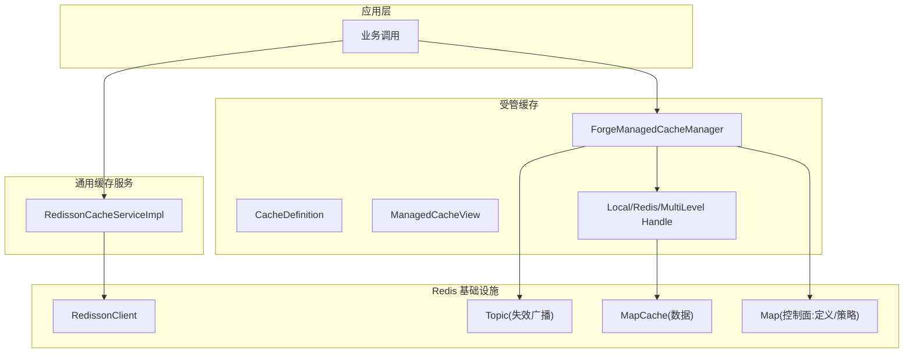
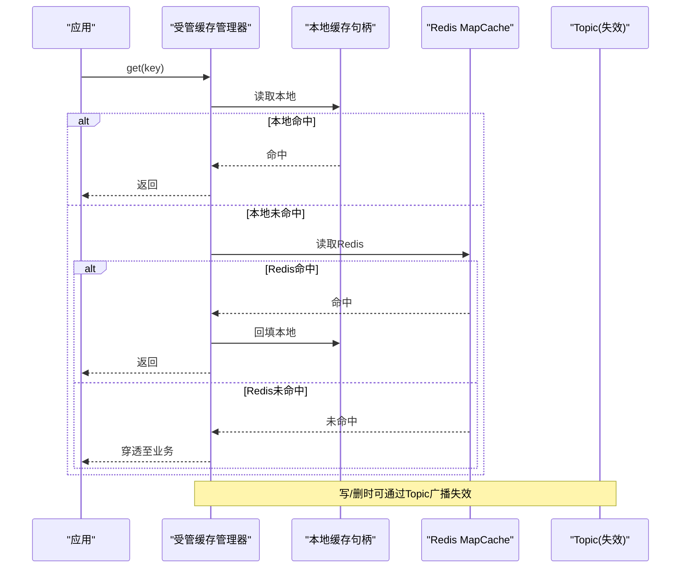
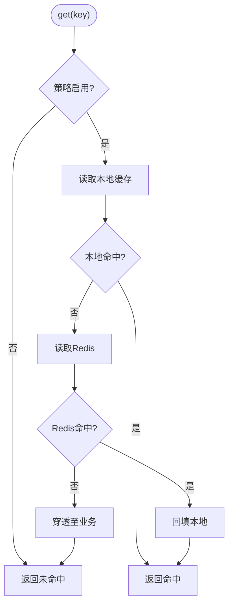
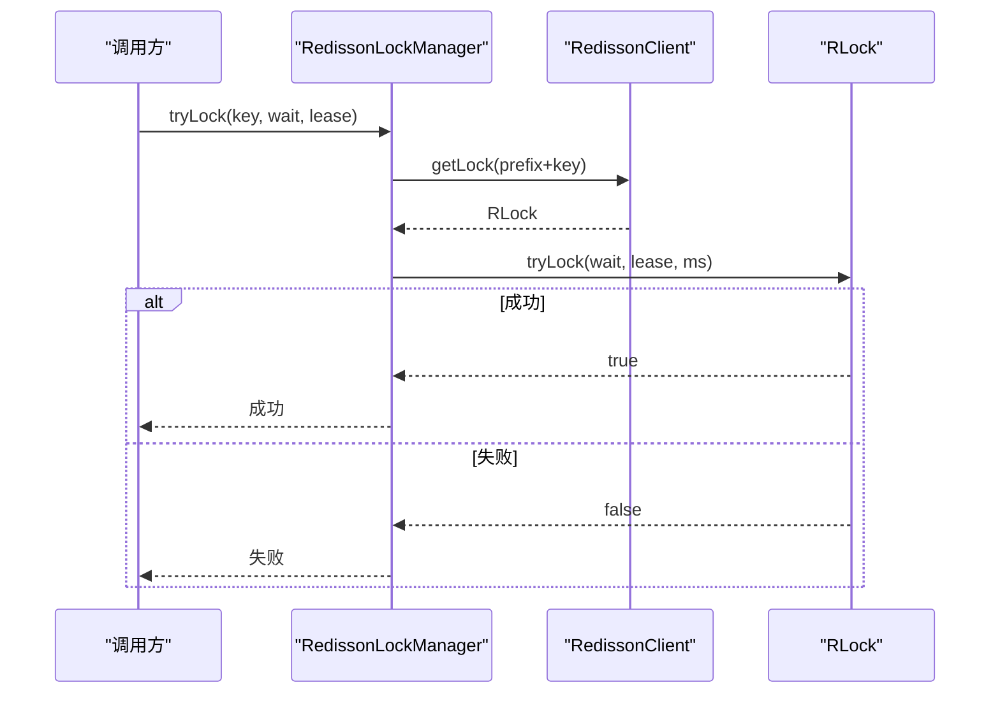
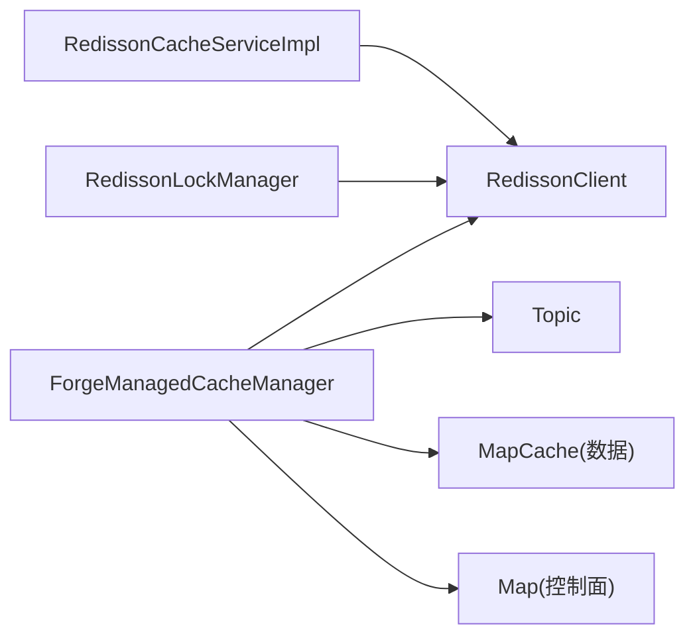

# Redis缓存系统

<cite>
**本文引用的文件**
- [RedissonConfig.java](file://forge-server/forge-framework/forge-starter-parent/forge-starter-cache/src/main/java/com/mdframe/forge/starter/cache/config/RedissonConfig.java)
- [RedissonCacheServiceImpl.java](file://forge-server/forge-framework/forge-starter-parent/forge-starter-cache/src/main/java/com/mdframe/forge/starter/cache/service/impl/RedissonCacheServiceImpl.java)
- [ForgeManagedCacheManager.java](file://forge-server/forge-framework/forge-starter-parent/forge-starter-cache/src/main/java/com/mdframe/forge/starter/cache/managed/ForgeManagedCacheManager.java)
- [CacheDefinition.java](file://forge-server/forge-framework/forge-starter-parent/forge-starter-cache/src/main/java/com/mdframe/forge/starter/cache/managed/model/CacheDefinition.java)
- [ManagedCacheView.java](file://forge-server/forge-framework/forge-starter-parent/forge-starter-cache/src/main/java/com/mdframe/forge/starter/cache/managed/model/ManagedCacheView.java)
- [SysManagedCachePolicyServiceImpl.java](file://forge-server/forge-framework/forge-plugin-parent/forge-plugin-system/src/main/java/com/mdframe/forge/plugin/system/service/impl/SysManagedCachePolicyServiceImpl.java)
- [RedissonLockManager.java](file://forge-server/forge-framework/forge-starter-parent/forge-starter-idempotent/src/main/java/com/mdframe/forge/starter/idempotent/lock/RedissonLockManager.java)
- [JobExecutionLockManager.java](file://forge-server/forge-framework/forge-plugin-parent/forge-plugin-job/src/main/java/com/mdframe/forge/plugin/job/manager/JobExecutionLockManager.java)
- [OpenApiIdempotencyManager.java](file://forge-server/forge-framework/forge-starter-parent/forge-starter-openapi-security/src/main/java/com/mdframe/forge/starter/openapi/security/idempotency/OpenApiIdempotencyManager.java)
</cite>

## 目录
1. [简介](#简介)
2. [项目结构](#项目结构)
3. [核心组件](#核心组件)
4. [架构总览](#架构总览)
5. [详细组件分析](#详细组件分析)
6. [依赖关系分析](#依赖关系分析)
7. [性能考量](#性能考量)
8. [故障排查指南](#故障排查指南)
9. [结论](#结论)
10. [附录](#附录)

## 简介
本技术文档围绕 Forge Admin 的 Redis 缓存系统，系统性阐述其架构设计与实现要点，覆盖单机与集群模式、连接池与序列化配置、双层缓存策略、数据一致性、分布式锁、监控统计、预热与批量操作等。内容基于仓库中实际代码进行提炼与归纳，帮助读者快速理解并正确使用该缓存体系。

## 项目结构
本项目将 Redis 能力抽象为“受管缓存”和“通用缓存服务”两层：
- 受管缓存（Managed Cache）：提供声明式缓存定义、运行时策略控制、本地+Redis双层缓存、跨节点失效广播、统一计数与视图暴露。
- 通用缓存服务（RedissonCacheService）：面向业务的基础 KV/Hash/Set/List/AtomicLong 等操作封装，并提供服务器信息、内存与命中率统计。

图表来源
- [ForgeManagedCacheManager.java:41-80](file://forge-server/forge-framework/forge-starter-parent/forge-starter-cache/src/main/java/com/mdframe/forge/starter/cache/managed/ForgeManagedCacheManager.java#L41-L80)
- [RedissonCacheServiceImpl.java:23-31](file://forge-server/forge-framework/forge-starter-parent/forge-starter-cache/src/main/java/com/mdframe/forge/starter/cache/service/impl/RedissonCacheServiceImpl.java#L23-L31)

章节来源
- [ForgeManagedCacheManager.java:41-80](file://forge-server/forge-framework/forge-starter-parent/forge-starter-cache/src/main/java/com/mdframe/forge/starter/cache/managed/ForgeManagedCacheManager.java#L41-L80)
- [RedissonCacheServiceImpl.java:23-31](file://forge-server/forge-framework/forge-starter-parent/forge-starter-cache/src/main/java/com/mdframe/forge/starter/cache/service/impl/RedissonCacheServiceImpl.java#L23-L31)

## 核心组件
- 受管缓存管理器：负责缓存定义注册、策略生效、读写路径选择、失效广播、运行期统计与视图导出。
- 缓存定义模型：描述应用编码、缓存名、默认/允许模式、TTL、本地容量、是否缓存空值等。
- 通用缓存服务：对 Redisson 的封装，提供常用数据结构操作与运维查询接口。
- 分布式锁管理：基于 Redisson 的锁获取/释放/状态查询，支撑幂等与任务执行保护。

章节来源
- [ForgeManagedCacheManager.java:94-146](file://forge-server/forge-framework/forge-starter-parent/forge-starter-cache/src/main/java/com/mdframe/forge/starter/cache/managed/ForgeManagedCacheManager.java#L94-L146)
- [CacheDefinition.java:9-31](file://forge-server/forge-framework/forge-starter-parent/forge-starter-cache/src/main/java/com/mdframe/forge/starter/cache/managed/model/CacheDefinition.java#L9-L31)
- [RedissonCacheServiceImpl.java:33-223](file://forge-server/forge-framework/forge-starter-parent/forge-starter-cache/src/main/java/com/mdframe/forge/starter/cache/service/impl/RedissonCacheServiceImpl.java#L33-L223)
- [RedissonLockManager.java:18-65](file://forge-server/forge-framework/forge-starter-parent/forge-starter-idempotent/src/main/java/com/mdframe/forge/starter/idempotent/lock/RedissonLockManager.java#L18-L65)

## 架构总览
受管缓存通过“本地缓存 + Redis 缓存”的双层结构提升热点访问性能；通过 Topic 实现跨实例的失效通知；通过 Map 存储定义与策略，支持运行期动态调整；通过内部计数器与视图对外暴露命中/未命中/写入/淘汰/失败等指标。

图表来源
- [ForgeManagedCacheManager.java:268-289](file://forge-server/forge-framework/forge-starter-parent/forge-starter-cache/src/main/java/com/mdframe/forge/starter/cache/managed/ForgeManagedCacheManager.java#L268-L289)
- [ForgeManagedCacheManager.java:383-417](file://forge-server/forge-framework/forge-starter-parent/forge-starter-cache/src/main/java/com/mdframe/forge/starter/cache/managed/ForgeManagedCacheManager.java#L383-L417)

## 详细组件分析

### 受管缓存管理器（双缓存与策略）
- 读路径：优先本地缓存，未命中则回源 Redis，再回填本地；异常时降级为未命中，避免放大后端压力。
- 写路径：根据策略决定写入本地或 Redis，并对空值按配置设置短 TTL。
- 失效与清理：支持单键删除、全量清空，并通过 Topic 向其他实例广播，确保多实例一致性。
- 策略控制：从 Redis 拉取策略快照，支持运行期覆盖；校验策略合法性，非法时回退到默认策略并关闭旧句柄。
- 统计与视图：维护命中/未命中/写入/淘汰/失败计数，导出运行时视图供管理端展示。

图表来源
- [ForgeManagedCacheManager.java:94-146](file://forge-server/forge-framework/forge-starter-parent/forge-starter-cache/src/main/java/com/mdframe/forge/starter/cache/managed/ForgeManagedCacheManager.java#L94-L146)
- [ForgeManagedCacheManager.java:268-289](file://forge-server/forge-framework/forge-starter-parent/forge-starter-cache/src/main/java/com/mdframe/forge/starter/cache/managed/ForgeManagedCacheManager.java#L268-L289)

章节来源
- [ForgeManagedCacheManager.java:94-146](file://forge-server/forge-framework/forge-starter-parent/forge-starter-cache/src/main/java/com/mdframe/forge/starter/cache/managed/ForgeManagedCacheManager.java#L94-L146)
- [ForgeManagedCacheManager.java:240-266](file://forge-server/forge-framework/forge-starter-parent/forge-starter-cache/src/main/java/com/mdframe/forge/starter/cache/managed/ForgeManagedCacheManager.java#L240-L266)
- [ForgeManagedCacheManager.java:291-345](file://forge-server/forge-framework/forge-starter-parent/forge-starter-cache/src/main/java/com/mdframe/forge/starter/cache/managed/ForgeManagedCacheManager.java#L291-L345)
- [ForgeManagedCacheManager.java:383-417](file://forge-server/forge-framework/forge-starter-parent/forge-starter-cache/src/main/java/com/mdframe/forge/starter/cache/managed/ForgeManagedCacheManager.java#L383-L417)

### 缓存定义与视图
- 缓存定义：包含应用编码、缓存名、默认/允许模式、作用域、本地/Redis TTL、本地最大容量、是否缓存空值、空值 TTL 等。
- 运行时视图：聚合定义、有效策略、是否被覆盖以及命中/未命中/写入/淘汰/失败计数，便于管理端观测。

章节来源
- [CacheDefinition.java:9-31](file://forge-server/forge-framework/forge-starter-parent/forge-starter-cache/src/main/java/com/mdframe/forge/starter/cache/managed/model/CacheDefinition.java#L9-L31)
- [ManagedCacheView.java:3-13](file://forge-server/forge-framework/forge-starter-parent/forge-starter-cache/src/main/java/com/mdframe/forge/starter/cache/managed/model/ManagedCacheView.java#L3-L13)
- [SysManagedCachePolicyServiceImpl.java:153-180](file://forge-server/forge-framework/forge-plugin-parent/forge-plugin-system/src/main/java/com/mdframe/forge/plugin/system/service/impl/SysManagedCachePolicyServiceImpl.java#L153-L180)

### 通用缓存服务（Redisson 封装）
- 基础操作：String/Hash/Set/List/AtomicLong 的增删改查、过期时间管理、模式匹配扫描。
- 运维查询：获取服务器信息、内存使用、统计信息与命中率计算；支持反序列化失败时的字符串回退读取。
- 适用场景：适合非受管缓存场景或需要直接操作 Redis 的场景。

章节来源
- [RedissonCacheServiceImpl.java:33-223](file://forge-server/forge-framework/forge-starter-parent/forge-starter-cache/src/main/java/com/mdframe/forge/starter/cache/service/impl/RedissonCacheServiceImpl.java#L33-L223)
- [RedissonCacheServiceImpl.java:226-389](file://forge-server/forge-framework/forge-starter-parent/forge-starter-cache/src/main/java/com/mdframe/forge/starter/cache/service/impl/RedissonCacheServiceImpl.java#L226-L389)

### 分布式锁（Redisson 集成）
- 锁管理器：提供 tryLock/unlock/isLocked 能力，统一 Key 前缀，记录日志与中断处理。
- 任务执行锁：以资源维度加锁，支持不可用/竞争/已获取三种状态，失败时跳过受保护任务。
- 开放 API 幂等：在请求级加锁，防止重复提交；捕获基础设施异常并转换为可用性问题。

图表来源
- [RedissonLockManager.java:18-65](file://forge-server/forge-framework/forge-starter-parent/forge-starter-idempotent/src/main/java/com/mdframe/forge/starter/idempotent/lock/RedissonLockManager.java#L18-L65)

章节来源
- [RedissonLockManager.java:18-65](file://forge-server/forge-framework/forge-starter-parent/forge-starter-idempotent/src/main/java/com/mdframe/forge/starter/idempotent/lock/RedissonLockManager.java#L18-L65)
- [JobExecutionLockManager.java:51-91](file://forge-server/forge-framework/forge-plugin-parent/forge-plugin-job/src/main/java/com/mdframe/forge/plugin/job/manager/JobExecutionLockManager.java#L51-L91)
- [OpenApiIdempotencyManager.java:70-99](file://forge-server/forge-framework/forge-starter-parent/forge-starter-openapi-security/src/main/java/com/mdframe/forge/starter/openapi/security/idempotency/OpenApiIdempotencyManager.java#L70-L99)

## 依赖关系分析
- 受管缓存管理器依赖 RedissonClient 提供的 MapCache、Topic、Map 等能力，用于数据存储、失效广播与控制面同步。
- 通用缓存服务直接依赖 RedissonClient 完成各类数据结构操作与 INFO 命令解析。
- 分布式锁模块依赖 RedissonClient 的 RLock 能力，提供细粒度锁语义。

图表来源
- [ForgeManagedCacheManager.java:41-80](file://forge-server/forge-framework/forge-starter-parent/forge-starter-cache/src/main/java/com/mdframe/forge/starter/cache/managed/ForgeManagedCacheManager.java#L41-L80)
- [RedissonCacheServiceImpl.java:23-31](file://forge-server/forge-framework/forge-starter-parent/forge-starter-cache/src/main/java/com/mdframe/forge/starter/cache/service/impl/RedissonCacheServiceImpl.java#L23-L31)
- [RedissonLockManager.java:18-65](file://forge-server/forge-framework/forge-starter-parent/forge-starter-idempotent/src/main/java/com/mdframe/forge/starter/idempotent/lock/RedissonLockManager.java#L18-L65)

章节来源
- [ForgeManagedCacheManager.java:41-80](file://forge-server/forge-framework/forge-starter-parent/forge-starter-cache/src/main/java/com/mdframe/forge/starter/cache/managed/ForgeManagedCacheManager.java#L41-L80)
- [RedissonCacheServiceImpl.java:23-31](file://forge-server/forge-framework/forge-starter-parent/forge-starter-cache/src/main/java/com/mdframe/forge/starter/cache/service/impl/RedissonCacheServiceImpl.java#L23-L31)
- [RedissonLockManager.java:18-65](file://forge-server/forge-framework/forge-starter-parent/forge-starter-idempotent/src/main/java/com/mdframe/forge/starter/idempotent/lock/RedissonLockManager.java#L18-L65)

## 性能考量
- 双层缓存：本地缓存降低热点读延迟，配合合理本地 TTL 与容量，显著减少 Redis 压力。
- 策略校验：运行时校验 TTL、容量与模式组合，避免不合法配置导致抖动。
- 失效广播：通过 Topic 实现跨实例一致失效，避免脏读。
- 统计与可观测性：内置命中/未命中/写入/淘汰/失败计数，结合 Redis INFO 命中率，便于定位瓶颈。
- 序列化：使用 Jackson 序列化器并注册 Java 8 时间模块，减少类型转换开销与兼容问题。

章节来源
- [ForgeManagedCacheManager.java:291-345](file://forge-server/forge-framework/forge-starter-parent/forge-starter-cache/src/main/java/com/mdframe/forge/starter/cache/managed/ForgeManagedCacheManager.java#L291-L345)
- [RedissonCacheServiceImpl.java:318-389](file://forge-server/forge-framework/forge-starter-parent/forge-starter-cache/src/main/java/com/mdframe/forge/starter/cache/service/impl/RedissonCacheServiceImpl.java#L318-L389)
- [RedissonConfig.java:23-33](file://forge-server/forge-framework/forge-starter-parent/forge-starter-cache/src/main/java/com/mdframe/forge/starter/cache/config/RedissonConfig.java#L23-L33)

## 故障排查指南
- 读取失败降级：受管缓存读取异常会记录失败计数并返回未命中，避免雪崩；检查日志中的失败原因。
- 策略应用失败：若策略校验不通过，将回退到默认策略并关闭旧句柄；核对策略范围与 TTL 约束。
- 控制面不可用：初始化或刷新策略失败不影响本地定义与调用；关注控制面通信异常。
- 锁获取失败：分布式锁获取失败可能因等待超时或并发冲突；检查锁 Key 与等待/租约时间。
- 反序列化异常：通用缓存服务在反序列化失败时会尝试字符串读取；确认对象版本兼容性。

章节来源
- [ForgeManagedCacheManager.java:94-146](file://forge-server/forge-framework/forge-starter-parent/forge-starter-cache/src/main/java/com/mdframe/forge/starter/cache/managed/ForgeManagedCacheManager.java#L94-L146)
- [ForgeManagedCacheManager.java:291-345](file://forge-server/forge-framework/forge-starter-parent/forge-starter-cache/src/main/java/com/mdframe/forge/starter/cache/managed/ForgeManagedCacheManager.java#L291-L345)
- [ForgeManagedCacheManager.java:383-417](file://forge-server/forge-framework/forge-starter-parent/forge-starter-cache/src/main/java/com/mdframe/forge/starter/cache/managed/ForgeManagedCacheManager.java#L383-L417)
- [RedissonLockManager.java:18-65](file://forge-server/forge-framework/forge-starter-parent/forge-starter-idempotent/src/main/java/com/mdframe/forge/starter/idempotent/lock/RedissonLockManager.java#L18-L65)
- [RedissonCacheServiceImpl.java:226-284](file://forge-server/forge-framework/forge-starter-parent/forge-starter-cache/src/main/java/com/mdframe/forge/starter/cache/service/impl/RedissonCacheServiceImpl.java#L226-L284)

## 结论
该 Redis 缓存系统通过“受管缓存 + 通用服务 + 分布式锁”的分层设计，提供了高可用、可观测、可扩展的缓存能力。双层缓存与失效广播保障热点性能与一致性；策略控制与统计视图便于运行期治理；分布式锁满足幂等与任务保护需求。建议在生产环境结合业务特征调优 TTL、本地容量与策略覆盖，并持续观察命中率与内存使用情况。

## 附录

### 单机与集群模式配置
- 通过 Redisson 自动配置注入 RedissonClient，并在自定义化过程中设置 Jackson 序列化器，支持 Java 8 时间类型。
- 具体连接参数由外部 Redisson 配置驱动；当前实现聚焦于序列化与客户端装配。

章节来源
- [RedissonConfig.java:23-33](file://forge-server/forge-framework/forge-starter-parent/forge-starter-cache/src/main/java/com/mdframe/forge/starter/cache/config/RedissonConfig.java#L23-L33)

### 连接池管理与性能优化
- 连接池相关参数由 Redisson 自动配置管理；当前仓库未显式定制连接池大小与超时。
- 建议结合压测结果调整连接数、读写超时与重试策略，以降低网络抖动影响。

[本节为通用指导，不直接分析具体文件]

### 缓存策略实现要点
- 缓存穿透防护：受管缓存读取异常时返回未命中，避免放大后端；如需更强防护，可在业务层引入布隆过滤器前置判断。
- 缓存雪崩避免：通过不同缓存项的随机过期时间分散过期峰值；当前实现依据策略 TTL，建议在业务侧叠加随机抖动。
- 热点数据缓存：采用本地+Redis双层缓存，本地 TTL 应小于等于 Redis TTL，避免不一致窗口过长。

章节来源
- [ForgeManagedCacheManager.java:94-146](file://forge-server/forge-framework/forge-starter-parent/forge-starter-cache/src/main/java/com/mdframe/forge/starter/cache/managed/ForgeManagedCacheManager.java#L94-L146)
- [ForgeManagedCacheManager.java:291-345](file://forge-server/forge-framework/forge-starter-parent/forge-starter-cache/src/main/java/com/mdframe/forge/starter/cache/managed/ForgeManagedCacheManager.java#L291-L345)

### 数据一致性策略
- 读写分离：读优先走本地与 Redis，写根据策略落盘；失效通过 Topic 广播，保证多实例一致性。
- 更新机制：建议先更新数据库再删除缓存；当前实现提供 evict/clear 能力，便于业务侧遵循该顺序。
- 失效处理：异常时记录失败计数并降级；控制面不可用时仍可使用本地默认策略继续运行。

章节来源
- [ForgeManagedCacheManager.java:138-164](file://forge-server/forge-framework/forge-starter-parent/forge-starter-cache/src/main/java/com/mdframe/forge/starter/cache/managed/ForgeManagedCacheManager.java#L138-L164)
- [ForgeManagedCacheManager.java:383-417](file://forge-server/forge-framework/forge-starter-parent/forge-starter-cache/src/main/java/com/mdframe/forge/starter/cache/managed/ForgeManagedCacheManager.java#L383-L417)

### 分布式锁使用场景
- 可重入锁：Redisson 的 RLock 支持线程可重入；当前实现基于 tryLock/unlock 包装，适用于幂等与任务保护。
- 公平锁：如需严格 FIFO 公平性，可在 Redisson 配置中启用公平锁；当前仓库未显式配置。
- 锁粒度：建议以业务资源为单位（如订单ID、任务ID）作为锁 Key，避免过粗或过细导致的争用或开销。

章节来源
- [RedissonLockManager.java:18-65](file://forge-server/forge-framework/forge-starter-parent/forge-starter-idempotent/src/main/java/com/mdframe/forge/starter/idempotent/lock/RedissonLockManager.java#L18-L65)
- [JobExecutionLockManager.java:51-91](file://forge-server/forge-framework/forge-plugin-parent/forge-plugin-job/src/main/java/com/mdframe/forge/plugin/job/manager/JobExecutionLockManager.java#L51-L91)
- [OpenApiIdempotencyManager.java:70-99](file://forge-server/forge-framework/forge-starter-parent/forge-starter-openapi-security/src/main/java/com/mdframe/forge/starter/openapi/security/idempotency/OpenApiIdempotencyManager.java#L70-L99)

### 监控与统计
- 命中率监控：通过 Redis INFO 的 hits/misses 计算命中率；受管缓存内部也维护命中/未命中计数。
- 内存使用分析：通过 INFO memory 获取内存占用、碎片率等指标，辅助容量规划。
- 慢查询日志：当前未实现专用慢查询日志；建议结合 Redis slowlog 与应用链路追踪进行排查。

章节来源
- [RedissonCacheServiceImpl.java:318-389](file://forge-server/forge-framework/forge-starter-parent/forge-starter-cache/src/main/java/com/mdframe/forge/starter/cache/service/impl/RedissonCacheServiceImpl.java#L318-L389)
- [ForgeManagedCacheManager.java:240-266](file://forge-server/forge-framework/forge-starter-parent/forge-starter-cache/src/main/java/com/mdframe/forge/starter/cache/managed/ForgeManagedCacheManager.java#L240-L266)

### 最佳实践
- 缓存预热：启动后对热点键进行预加载，降低冷启动冲击。
- 批量操作：使用批量删除/扫描接口减少网络往返；注意大集合遍历的性能影响。
- 序列化配置：保持对象版本兼容，必要时使用字符串回退读取以避免反序列化错误。

章节来源
- [RedissonCacheServiceImpl.java:226-284](file://forge-server/forge-framework/forge-starter-parent/forge-starter-cache/src/main/java/com/mdframe/forge/starter/cache/service/impl/RedissonCacheServiceImpl.java#L226-L284)
- [RedissonConfig.java:23-33](file://forge-server/forge-framework/forge-starter-parent/forge-starter-cache/src/main/java/com/mdframe/forge/starter/cache/config/RedissonConfig.java#L23-L33)