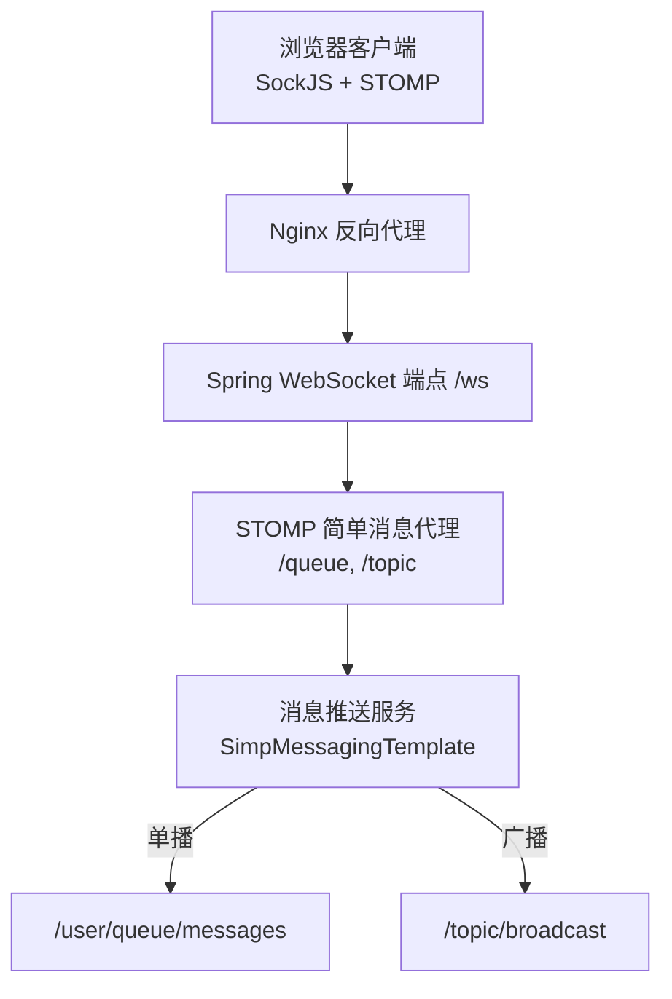
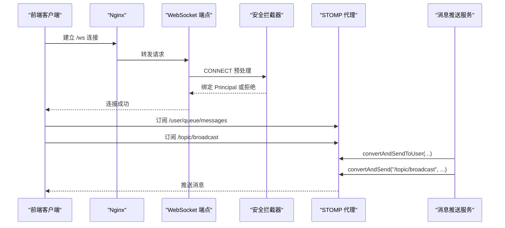
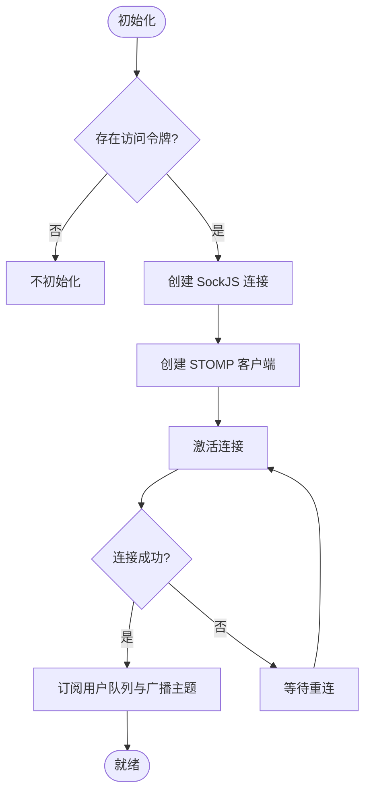
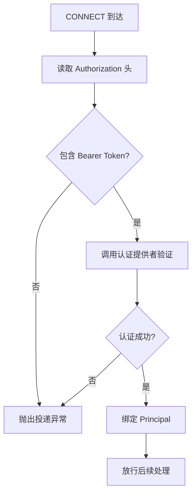
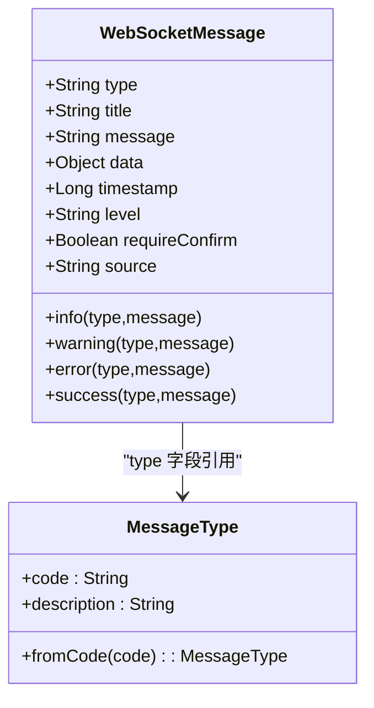
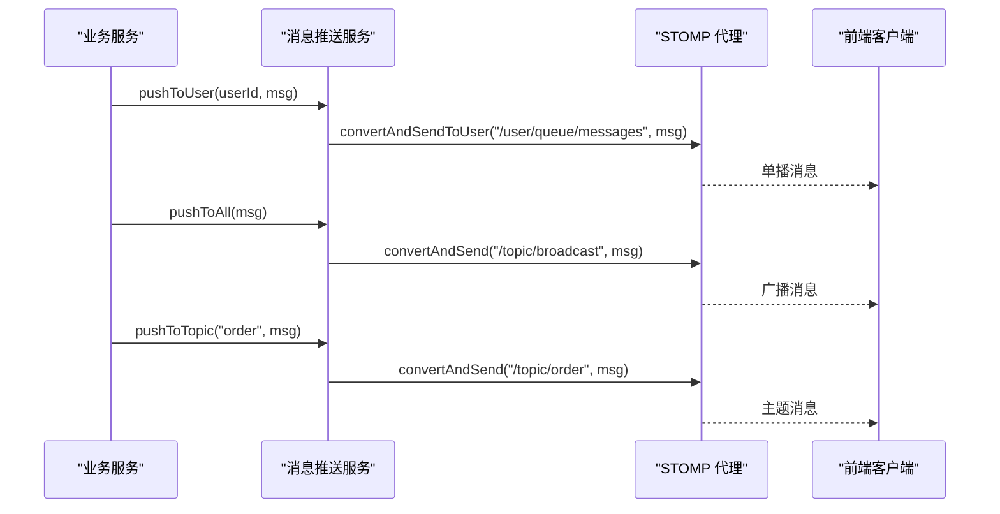
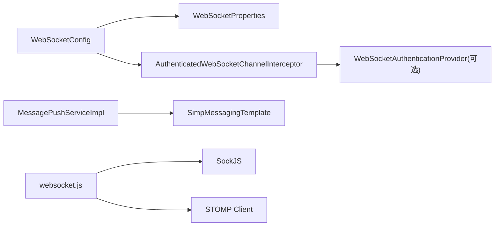

# WebSocket实时通信

<cite>
**本文引用的文件**
- [WebSocketConfig.java](file://forge-server/forge-framework/forge-starter-parent/forge-starter-websocket/src/main/java/com/mdframe/forge/starter/websocket/config/WebSocketConfig.java)
- [AuthenticatedWebSocketChannelInterceptor.java](file://forge-server/forge-framework/forge-starter-parent/forge-starter-websocket/src/main/java/com/mdframe/forge/starter/websocket/security/AuthenticatedWebSocketChannelInterceptor.java)
- [WebSocketProperties.java](file://forge-server/forge-framework/forge-starter-parent/forge-starter-websocket/src/main/java/com/mdframe/forge/starter/websocket/security/WebSocketProperties.java)
- [IMessagePushService.java](file://forge-server/forge-framework/forge-starter-parent/forge-starter-websocket/src/main/java/com/mdframe/forge/starter/websocket/service/IMessagePushService.java)
- [MessagePushServiceImpl.java](file://forge-server/forge-framework/forge-starter-parent/forge-starter-websocket/src/main/java/com/mdframe/forge/starter/websocket/service/impl/MessagePushServiceImpl.java)
- [WebSocketMessage.java](file://forge-server/forge-framework/forge-starter-parent/forge-starter-websocket/src/main/java/com/mdframe/forge/starter/websocket/domain/WebSocketMessage.java)
- [MessageType.java](file://forge-server/forge-framework/forge-starter-parent/forge-starter-websocket/src/main/java/com/mdframe/forge/starter/websocket/enums/MessageType.java)
- [websocket.js](file://forge-admin-ui/src/utils/websocket.js)
- [nginx.conf（前端）](file://docker/nginx.conf)
- [nginx.conf（后端代理）](file://docker-forge-admin/nginx.conf)
</cite>

## 目录
1. [简介](#简介)
2. [项目结构](#项目结构)
3. [核心组件](#核心组件)
4. [架构总览](#架构总览)
5. [详细组件分析](#详细组件分析)
6. [依赖关系分析](#依赖关系分析)
7. [性能考虑](#性能考虑)
8. [故障排查指南](#故障排查指南)
9. [结论](#结论)
10. [附录](#附录)

## 简介
本技术文档围绕 Forge Admin 的 WebSocket 实时通信能力，系统化阐述连接管理、消息协议、在线状态与房间广播、消息推送机制、安全认证、监控调试以及性能优化策略。该方案基于 Spring WebSocket + STOMP/SockJS 构建，提供统一的消息模型、可配置的安全拦截器、面向业务的消息推送服务，以及前端基于 SockJS+STOMP 的稳定连接与重连机制。

## 项目结构
后端通过自动装配启用 WebSocket 消息代理，注册 /ws 端点并启用 SockJS 兼容；前端使用 SockJS 建立连接并通过 STOMP 订阅用户队列与广播主题。Nginx 作为反向代理将 /forge-api 等路径转发到后端服务，便于部署与跨域处理。

图表来源
- [WebSocketConfig.java:33-62](file://forge-server/forge-framework/forge-starter-parent/forge-starter-websocket/src/main/java/com/mdframe/forge/starter/websocket/config/WebSocketConfig.java#L33-L62)
- [MessagePushServiceImpl.java:23-97](file://forge-server/forge-framework/forge-starter-parent/forge-starter-websocket/src/main/java/com/mdframe/forge/starter/websocket/service/impl/MessagePushServiceImpl.java#L23-L97)
- [nginx.conf（前端）:23-32](file://docker/nginx.conf#L23-L32)
- [nginx.conf（后端代理）:23-32](file://docker-forge-admin/nginx.conf#L23-L32)

章节来源
- [WebSocketConfig.java:17-62](file://forge-server/forge-framework/forge-starter-parent/forge-starter-websocket/src/main/java/com/mdframe/forge/starter/websocket/config/WebSocketConfig.java#L17-L62)
- [websocket.js:13-88](file://forge-admin-ui/src/utils/websocket.js#L13-L88)
- [nginx.conf（前端）:23-32](file://docker/nginx.conf#L23-L32)
- [nginx.conf（后端代理）:23-32](file://docker-forge-admin/nginx.conf#L23-L32)

## 核心组件
- WebSocket 配置与端点：定义消息代理前缀、用户目标前缀、STOMP 端点与跨域策略。
- 安全拦截器：在 CONNECT 阶段校验 Bearer Token，绑定已认证用户 Principal，限制客户端只能发往应用目的地，限制订阅目标白名单。
- 消息推送服务：封装单播、组播、广播与主题推送，统一时间戳与异常日志。
- 统一消息模型：type/title/message/data/timestamp/level/source 等字段，配合消息类型枚举。
- 前端客户端：基于 SockJS 与 STOMP 的连接初始化、心跳、重连、订阅与错误处理。

章节来源
- [WebSocketConfig.java:33-62](file://forge-server/forge-framework/forge-starter-parent/forge-starter-websocket/src/main/java/com/mdframe/forge/starter/websocket/config/WebSocketConfig.java#L33-L62)
- [AuthenticatedWebSocketChannelInterceptor.java:53-85](file://forge-server/forge-framework/forge-starter-parent/forge-starter-websocket/src/main/java/com/mdframe/forge/starter/websocket/security/AuthenticatedWebSocketChannelInterceptor.java#L53-L85)
- [IMessagePushService.java:12-66](file://forge-server/forge-framework/forge-starter-parent/forge-starter-websocket/src/main/java/com/mdframe/forge/starter/websocket/service/IMessagePushService.java#L12-L66)
- [MessagePushServiceImpl.java:23-109](file://forge-server/forge-framework/forge-starter-parent/forge-starter-websocket/src/main/java/com/mdframe/forge/starter/websocket/service/impl/MessagePushServiceImpl.java#L23-L109)
- [WebSocketMessage.java:17-99](file://forge-server/forge-framework/forge-starter-parent/forge-starter-websocket/src/main/java/com/mdframe/forge/starter/websocket/domain/WebSocketMessage.java#L17-L99)
- [MessageType.java:11-109](file://forge-server/forge-framework/forge-starter-parent/forge-starter-websocket/src/main/java/com/mdframe/forge/starter/websocket/enums/MessageType.java#L11-L109)
- [websocket.js:13-105](file://forge-admin-ui/src/utils/websocket.js#L13-L105)

## 架构总览
系统采用“前端 SockJS 连接 + STOMP 协议 + 后端简单消息代理”的分层架构。连接建立时由安全拦截器完成鉴权，后续消息路由遵循“应用目的地 -> 处理器 -> 消息代理 -> 订阅者”的路径。推送服务通过 SimpMessagingTemplate 向 /user/queue/messages 与 /topic/broadcast 发送消息，前端分别订阅对应路径接收单播与广播。

图表来源
- [WebSocketConfig.java:47-62](file://forge-server/forge-framework/forge-starter-parent/forge-starter-websocket/src/main/java/com/mdframe/forge/starter/websocket/config/WebSocketConfig.java#L47-L62)
- [AuthenticatedWebSocketChannelInterceptor.java:53-85](file://forge-server/forge-framework/forge-starter-parent/forge-starter-websocket/src/main/java/com/mdframe/forge/starter/websocket/security/AuthenticatedWebSocketChannelInterceptor.java#L53-L85)
- [MessagePushServiceImpl.java:27-97](file://forge-server/forge-framework/forge-starter-parent/forge-starter-websocket/src/main/java/com/mdframe/forge/starter/websocket/service/impl/MessagePushServiceImpl.java#L27-L97)
- [websocket.js:60-76](file://forge-admin-ui/src/utils/websocket.js#L60-L76)

## 详细组件分析

### 连接管理与心跳
- 连接建立：前端通过 SockJS 连接 /ws，后端注册 STOMP 端点并启用 SockJS 兼容。
- 心跳与重连：STOMP 客户端配置 incoming/outgoing 心跳间隔与重连延迟，断线后自动恢复。
- 跨域与代理：开发环境可通过环境变量解析直连后端地址；生产环境经 Nginx 反向代理转发。

图表来源
- [websocket.js:13-88](file://forge-admin-ui/src/utils/websocket.js#L13-L88)
- [WebSocketConfig.java:56-62](file://forge-server/forge-framework/forge-starter-parent/forge-starter-websocket/src/main/java/com/mdframe/forge/starter/websocket/config/WebSocketConfig.java#L56-L62)

章节来源
- [websocket.js:13-105](file://forge-admin-ui/src/utils/websocket.js#L13-L105)
- [WebSocketConfig.java:56-62](file://forge-server/forge-framework/forge-starter-parent/forge-starter-websocket/src/main/java/com/mdframe/forge/starter/websocket/config/WebSocketConfig.java#L56-L62)

### 安全认证与权限控制
- CONNECT 阶段强制要求 Authorization 头携带 Bearer Token，未携带或无效直接拒绝。
- 认证成功后将登录 ID 绑定为 Principal，用于后续用户隔离与权限判断。
- 限制客户端只能向以 /app 开头的目的地发送消息，禁止直发 broker。
- 订阅目标白名单仅允许 /user/** 与 /topic/broadcast，防止越权订阅。

图表来源
- [AuthenticatedWebSocketChannelInterceptor.java:53-85](file://forge-server/forge-framework/forge-starter-parent/forge-starter-websocket/src/main/java/com/mdframe/forge/starter/websocket/security/AuthenticatedWebSocketChannelInterceptor.java#L53-L85)
- [WebSocketProperties.java:24-35](file://forge-server/forge-framework/forge-starter-parent/forge-starter-websocket/src/main/java/com/mdframe/forge/starter/websocket/security/WebSocketProperties.java#L24-L35)

章节来源
- [AuthenticatedWebSocketChannelInterceptor.java:53-85](file://forge-server/forge-framework/forge-starter-parent/forge-starter-websocket/src/main/java/com/mdframe/forge/starter/websocket/security/AuthenticatedWebSocketChannelInterceptor.java#L53-L85)
- [WebSocketProperties.java:12-35](file://forge-server/forge-framework/forge-starter-parent/forge-starter-websocket/src/main/java/com/mdframe/forge/starter/websocket/security/WebSocketProperties.java#L12-L35)

### 消息协议与编解码
- 统一消息体：WebSocketMessage 包含 type、title、message、data、timestamp、level、source 等字段，并提供便捷构造方法。
- 消息类型枚举：MessageType 定义认证、系统通知、任务、业务通知等标准类型，支持按 code 反查。
- 编解码：后端通过 SimpMessagingTemplate 进行 JSON 编解码；前端通过 STOMP 框架解析 frame.body 为 JSON。

图表来源
- [WebSocketMessage.java:17-99](file://forge-server/forge-framework/forge-starter-parent/forge-starter-websocket/src/main/java/com/mdframe/forge/starter/websocket/domain/WebSocketMessage.java#L17-L99)
- [MessageType.java:11-109](file://forge-server/forge-framework/forge-starter-parent/forge-starter-websocket/src/main/java/com/mdframe/forge/starter/websocket/enums/MessageType.java#L11-L109)

章节来源
- [WebSocketMessage.java:17-99](file://forge-server/forge-framework/forge-starter-parent/forge-starter-websocket/src/main/java/com/mdframe/forge/starter/websocket/domain/WebSocketMessage.java#L17-L99)
- [MessageType.java:11-109](file://forge-server/forge-framework/forge-starter-parent/forge-starter-websocket/src/main/java/com/mdframe/forge/starter/websocket/enums/MessageType.java#L11-L109)

### 消息路由与推送机制
- 单播：通过 pushToUser/pushToUsers 调用 convertAndSendToUser 发送至 /user/queue/messages，前端订阅该队列接收。
- 组播：pushToTopic 将消息发送到 /topic/{topic}，供订阅特定主题的客户端接收。
- 全量广播：pushToAll 将消息发送到 /topic/broadcast，所有订阅该主题的客户端均可收到。
- 异步推送：提供 pushToUserAsync/pushToUsersAsync 非阻塞发送。

图表来源
- [MessagePushServiceImpl.java:27-97](file://forge-server/forge-framework/forge-starter-parent/forge-starter-websocket/src/main/java/com/mdframe/forge/starter/websocket/service/impl/MessagePushServiceImpl.java#L27-L97)
- [websocket.js:60-76](file://forge-admin-ui/src/utils/websocket.js#L60-L76)

章节来源
- [MessagePushServiceImpl.java:27-109](file://forge-server/forge-framework/forge-starter-parent/forge-starter-websocket/src/main/java/com/mdframe/forge/starter/websocket/service/impl/MessagePushServiceImpl.java#L27-L109)
- [websocket.js:60-76](file://forge-admin-ui/src/utils/websocket.js#L60-L76)

### 在线状态维护与房间管理
- 用户隔离：通过 /user/** 前缀实现用户级隔离，每个用户拥有独立队列。
- 房间概念：以主题 /topic/{room} 模拟房间，订阅该主题的客户端即视为房间成员。
- 广播通知：/topic/broadcast 用于全站公告或全局事件。
- 踢出与封禁：结合认证拦截器的 Principal 与业务侧踢出逻辑，可向目标用户推送强制下线或封禁通知。

章节来源
- [WebSocketConfig.java:33-45](file://forge-server/forge-framework/forge-starter-parent/forge-starter-websocket/src/main/java/com/mdframe/forge/starter/websocket/config/WebSocketConfig.java#L33-L45)
- [MessageType.java:13-48](file://forge-server/forge-framework/forge-starter-parent/forge-starter-websocket/src/main/java/com/mdframe/forge/starter/websocket/enums/MessageType.java#L13-L48)

### 安全认证与防重放
- JWT/Bearer Token：CONNECT 阶段从 Authorization 头提取 Bearer Token，交由认证提供者校验。
- 权限控制：仅允许订阅白名单中的目标，禁止直接向 broker 发送消息。
- 防重放建议：在业务层对关键操作引入一次性 nonce、时间戳与签名校验；当前拦截器确保会话身份可信，具体防重放策略可在上层业务扩展。

章节来源
- [AuthenticatedWebSocketChannelInterceptor.java:53-85](file://forge-server/forge-framework/forge-starter-parent/forge-starter-websocket/src/main/java/com/mdframe/forge/starter/websocket/security/AuthenticatedWebSocketChannelInterceptor.java#L53-L85)
- [WebSocketProperties.java:24-35](file://forge-server/forge-framework/forge-starter-parent/forge-starter-websocket/src/main/java/com/mdframe/forge/starter/websocket/security/WebSocketProperties.java#L24-L35)

### 连接监控与调试
- 前端调试：STOMP 客户端保留 debug 回调（可开启），onStompError 记录错误帧信息。
- 后端日志：推送服务在成功与失败路径输出结构化日志，便于追踪消息流向。
- 指标采集：可结合 Redis INFO 命令获取连接与命令统计，辅助评估负载与健康度。

章节来源
- [websocket.js:78-85](file://forge-admin-ui/src/utils/websocket.js#L78-L85)
- [MessagePushServiceImpl.java:45-49](file://forge-server/forge-framework/forge-starter-parent/forge-starter-websocket/src/main/java/com/mdframe/forge/starter/websocket/service/impl/MessagePushServiceImpl.java#L45-L49)
- [MessagePushServiceImpl.java:74-78](file://forge-server/forge-framework/forge-starter-parent/forge-starter-websocket/src/main/java/com/mdframe/forge/starter/websocket/service/impl/MessagePushServiceImpl.java#L74-L78)

## 依赖关系分析
- WebSocketConfig 依赖 WebSocketProperties 与可选的 WebSocketAuthenticationProvider，注入安全拦截器。
- MessagePushServiceImpl 依赖 SimpMessagingTemplate，负责将消息路由至不同目的地。
- 前端 websocket.js 依赖 SockJS 与 STOMP 客户端库，负责连接生命周期与消息订阅。

图表来源
- [WebSocketConfig.java:27-51](file://forge-server/forge-framework/forge-starter-parent/forge-starter-websocket/src/main/java/com/mdframe/forge/starter/websocket/config/WebSocketConfig.java#L27-L51)
- [MessagePushServiceImpl.java:21-25](file://forge-server/forge-framework/forge-starter-parent/forge-starter-websocket/src/main/java/com/mdframe/forge/starter/websocket/service/impl/MessagePushServiceImpl.java#L21-L25)
- [websocket.js:1-56](file://forge-admin-ui/src/utils/websocket.js#L1-L56)

章节来源
- [WebSocketConfig.java:27-51](file://forge-server/forge-framework/forge-starter-parent/forge-starter-websocket/src/main/java/com/mdframe/forge/starter/websocket/config/WebSocketConfig.java#L27-L51)
- [MessagePushServiceImpl.java:21-25](file://forge-server/forge-framework/forge-starter-parent/forge-starter-websocket/src/main/java/com/mdframe/forge/starter/websocket/service/impl/MessagePushServiceImpl.java#L21-L25)
- [websocket.js:1-56](file://forge-admin-ui/src/utils/websocket.js#L1-L56)

## 性能考虑
- 连接复用：前端保持单一 STOMP 客户端实例，避免重复连接；后端使用简单消息代理，减少中间件开销。
- 心跳与超时：合理设置心跳间隔与重连延迟，降低假死连接占用。
- 消息压缩：Nginx 已启用 Gzip 压缩静态资源；WebSocket 文本消息可通过业务层压缩（如 gzip 或 snappy）后再序列化，权衡 CPU 与带宽。
- 负载均衡：多实例部署时，广播需借助外部消息总线（如 Redis Pub/Sub 或 MQ）保证跨节点广播一致性；单播仍可按用户会话路由。
- 批量发送：组播场景尽量合并消息，减少多次网络往返。

[本节为通用指导，不直接分析具体文件]

## 故障排查指南
- 连接失败：检查 Authorization 头是否携带有效 Bearer Token；确认 Nginx 是否正确转发 /ws；查看 onStompError 与后端日志。
- 订阅被拒：确认订阅目标在白名单内（/user/** 与 /topic/broadcast）。
- 消息未送达：核对用户 ID 与 Principal 绑定是否一致；检查推送服务异常日志。
- 跨域问题：调整 allowedOriginPatterns，确保前端域名在允许列表中。

章节来源
- [AuthenticatedWebSocketChannelInterceptor.java:53-85](file://forge-server/forge-framework/forge-starter-parent/forge-starter-websocket/src/main/java/com/mdframe/forge/starter/websocket/security/AuthenticatedWebSocketChannelInterceptor.java#L53-L85)
- [WebSocketProperties.java:16-35](file://forge-server/forge-framework/forge-starter-parent/forge-starter-websocket/src/main/java/com/mdframe/forge/starter/websocket/security/WebSocketProperties.java#L16-L35)
- [MessagePushServiceImpl.java:45-49](file://forge-server/forge-framework/forge-starter-parent/forge-starter-websocket/src/main/java/com/mdframe/forge/starter/websocket/service/impl/MessagePushServiceImpl.java#L45-L49)
- [websocket.js:78-85](file://forge-admin-ui/src/utils/websocket.js#L78-L85)

## 结论
本方案以最小化配置实现了稳定可靠的 WebSocket 实时通信：前端具备健壮的连接与重连能力，后端提供统一的消息模型与安全拦截，推送服务简化了单播、组播与广播的实现。通过合理的跨域、代理与心跳配置，系统在开发与生产环境中均能良好运行。后续可根据业务规模引入分布式广播与更细粒度的权限控制。

[本节为总结性内容，不直接分析具体文件]

## 附录
- 常用目的地
  - 单播：/user/queue/messages
  - 广播：/topic/broadcast
  - 主题：/topic/{topic}
- 消息类型参考：见 MessageType 枚举
- 前端连接入口：见 websocket.js 初始化函数

章节来源
- [MessagePushServiceImpl.java:23-97](file://forge-server/forge-framework/forge-starter-parent/forge-starter-websocket/src/main/java/com/mdframe/forge/starter/websocket/service/impl/MessagePushServiceImpl.java#L23-L97)
- [MessageType.java:13-86](file://forge-server/forge-framework/forge-starter-parent/forge-starter-websocket/src/main/java/com/mdframe/forge/starter/websocket/enums/MessageType.java#L13-L86)
- [websocket.js:13-88](file://forge-admin-ui/src/utils/websocket.js#L13-L88)