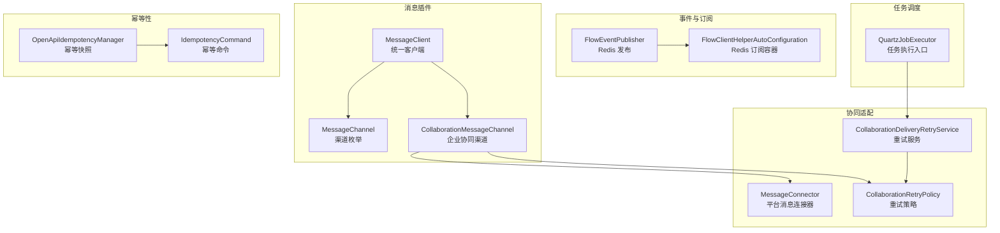
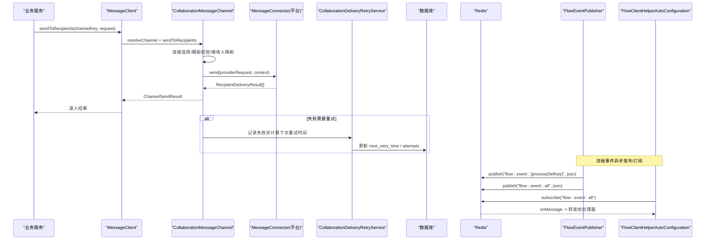
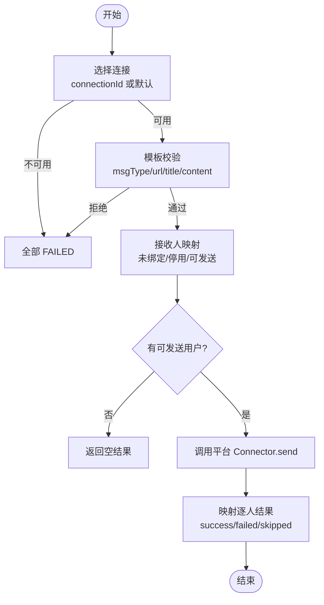
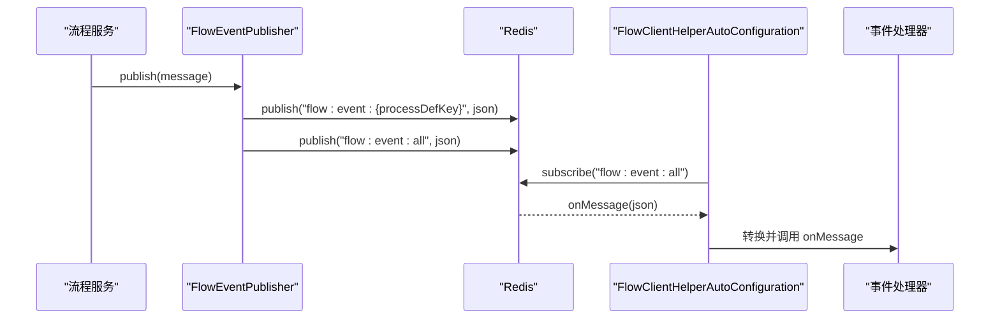
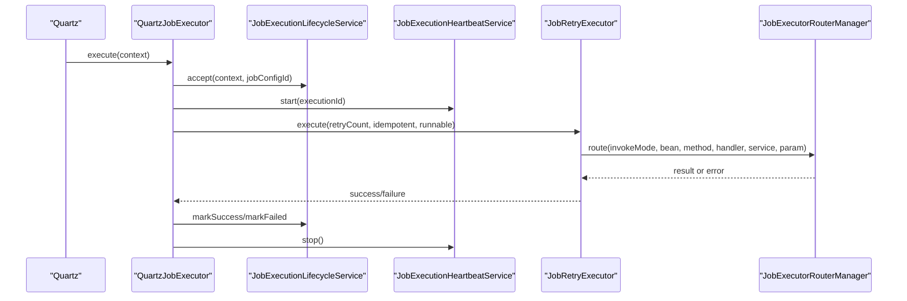
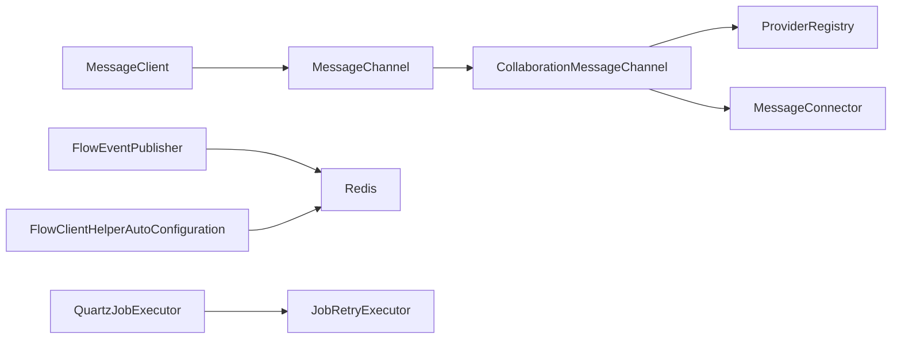

# 消息队列系统

<cite>
**本文引用的文件**
- [MessageChannel.java](file://forge-server/forge-framework/forge-plugin-parent/forge-plugin-message/src/main/java/com/mdframe/forge/plugin/message/domain/MessageChannel.java)
- [CollaborationMessageChannel.java](file://forge-server/forge-framework/forge-plugin-parent/forge-plugin-collaboration/src/main/java/com/mdframe/forge/plugin/collaboration/message/CollaborationMessageChannel.java)
- [MessageClient.java](file://forge-server/forge-framework/forge-starter-parent/forge-starter-message/src/main/java/com/mdframe/forge/starter/message/sdk/MessageClient.java)
- [MessageConnector.java](file://forge-server/forge-framework/forge-starter-parent/forge-starter-collaboration/src/main/java/com/mdframe/forge/starter/collaboration/connector/MessageConnector.java)
- [FlowEventPublisher.java](file://forge-server/forge-framework/forge-plugin-parent/forge-plugin-flow/src/main/java/com/mdframe/forge/starter/flow/event/FlowEventPublisher.java)
- [FlowClientHelperAutoConfiguration.java](file://forge-server/forge-flow/forge-flow-client/src/main/java/com/mdframe/forge/flow/client/helper/FlowClientHelperAutoConfiguration.java)
- [SysMessageReceiverMapper.xml](file://forge-server/forge-framework/forge-plugin-parent/forge-plugin-message/src/main/resources/mapper/SysMessageReceiverMapper.xml)
- [CollaborationDeliveryRetryService.java](file://forge-server/forge-framework/forge-plugin-parent/forge-plugin-collaboration/src/main/java/com/mdframe/forge/plugin/collaboration/service/CollaborationDeliveryRetryService.java)
- [CollaborationRetryPolicy.java](file://forge-server/forge-framework/forge-plugin-parent/forge-plugin-collaboration/src/main/java/com/mdframe/forge/plugin/collaboration/service/CollaborationRetryPolicy.java)
- [QuartzJobExecutor.java](file://forge-server/forge-framework/forge-plugin-parent/forge-plugin-job/src/main/java/com/mdframe/forge/plugin/job/scheduler/QuartzJobExecutor.java)
- [OpenApiIdempotencyManager.java](file://forge-server/forge-framework/forge-starter-parent/forge-starter-openapi-security/src/main/java/com/mdframe/forge/starter/openapi/security/idempotency/OpenApiIdempotencyManager.java)
- [IdempotencyCommand.java](file://forge-server/forge-framework/forge-starter-parent/forge-starter-openapi-security/src/main/java/com/mdframe/forge/starter/openapi/security/idempotency/IdempotencyCommand.java)
</cite>

## 目录
1. [简介](#简介)
2. [项目结构](#项目结构)
3. [核心组件](#核心组件)
4. [架构总览](#架构总览)
5. [详细组件分析](#详细组件分析)
6. [依赖关系分析](#依赖关系分析)
7. [性能考虑](#性能考虑)
8. [故障排查指南](#故障排查指南)
9. [结论](#结论)
10. [附录](#附录)

## 简介
本技术文档围绕 Forge Admin 的消息与异步任务能力，系统性阐述其“消息队列式”的异步处理、事件驱动与微服务间通信机制。重点覆盖：
- 异步任务处理：基于 Quartz 的任务调度与执行生命周期管理。
- 事件驱动架构：基于 Redis 发布/订阅的流程事件通道。
- 微服务间通信：通过协同消息渠道（企业 IM）进行跨平台投递。
- 可靠性保证：消息持久化、逐人确认、指数退避重试与失败补偿。
- 消息类型：站内信/短信/邮件/推送与企业协同；支持点对点、发布订阅与延迟重试。
- 路由与过滤：按租户/连接/模板校验的接收人解析与内容路由。
- 监控与管理：积压扫描、消费状态跟踪、回溯与手工重试。
- 幂等性与事务：接口幂等快照与业务侧幂等键；结合任务重试与最终一致性。
- 性能优化：批量创建接收人、退避抖动、线程池隔离与限流策略。

## 项目结构
仓库采用多模块分层组织，消息相关能力分布在以下模块：
- 消息插件层：定义消息渠道枚举、发送请求/结果模型、接收人映射与模板策略。
- 协同消息适配层：将 Forge 消息抽象为平台无关的 ProviderMessageRequest，交由各平台 Connector 实现。
- 启动器 SDK：提供 MessageClient，统一模板渲染、渠道选择与逐人投递入口。
- 流程事件：基于 Redis 的异步事件发布与订阅容器。
- 任务调度：Quartz 任务执行入口、心跳与恢复、重试执行器。
- 幂等性：OpenAPI 幂等快照与冲突处理。

图表来源
- [MessageChannel.java:1-39](file://forge-server/forge-framework/forge-plugin-parent/forge-plugin-message/src/main/java/com/mdframe/forge/plugin/message/domain/MessageChannel.java#L1-L39)
- [CollaborationMessageChannel.java:1-221](file://forge-server/forge-framework/forge-plugin-parent/forge-plugin-collaboration/src/main/java/com/mdframe/forge/plugin/collaboration/message/CollaborationMessageChannel.java#L1-L221)
- [MessageClient.java:1-74](file://forge-server/forge-framework/forge-starter-parent/forge-starter-message/src/main/java/com/mdframe/forge/starter/message/sdk/MessageClient.java#L1-L74)
- [MessageConnector.java:1-28](file://forge-server/forge-framework/forge-starter-parent/forge-starter-collaboration/src/main/java/com/mdframe/forge/starter/collaboration/connector/MessageConnector.java#L1-L28)
- [FlowEventPublisher.java:75-102](file://forge-server/forge-framework/forge-plugin-parent/forge-plugin-flow/src/main/java/com/mdframe/forge/starter/flow/event/FlowEventPublisher.java#L75-L102)
- [FlowClientHelperAutoConfiguration.java:66-78](file://forge-server/forge-flow/forge-flow-client/src/main/java/com/mdframe/forge/flow/client/helper/FlowClientHelperAutoConfiguration.java#L66-L78)
- [QuartzJobExecutor.java:22-208](file://forge-server/forge-framework/forge-plugin-parent/forge-plugin-job/src/main/java/com/mdframe/forge/plugin/job/scheduler/QuartzJobExecutor.java#L22-L208)
- [OpenApiIdempotencyManager.java:101-134](file://forge-server/forge-framework/forge-starter-parent/forge-starter-openapi-security/src/main/java/com/mdframe/forge/starter/openapi/security/idempotency/OpenApiIdempotencyManager.java#L101-L134)
- [IdempotencyCommand.java:1-21](file://forge-server/forge-framework/forge-starter-parent/forge-starter-openapi-security/src/main/java/com/mdframe/forge/starter/openapi/security/idempotency/IdempotencyCommand.java#L1-L21)

章节来源
- [MessageChannel.java:1-39](file://forge-server/forge-framework/forge-plugin-parent/forge-plugin-message/src/main/java/com/mdframe/forge/plugin/message/domain/MessageChannel.java#L1-L39)
- [CollaborationMessageChannel.java:1-221](file://forge-server/forge-framework/forge-plugin-parent/forge-plugin-collaboration/src/main/java/com/mdframe/forge/plugin/collaboration/message/CollaborationMessageChannel.java#L1-L221)
- [MessageClient.java:1-74](file://forge-server/forge-framework/forge-starter-parent/forge-starter-message/src/main/java/com/mdframe/forge/starter/message/sdk/MessageClient.java#L1-L74)
- [FlowEventPublisher.java:75-102](file://forge-server/forge-framework/forge-plugin-parent/forge-plugin-flow/src/main/java/com/mdframe/forge/starter/flow/event/FlowEventPublisher.java#L75-L102)
- [FlowClientHelperAutoConfiguration.java:66-78](file://forge-server/forge-flow/forge-flow-client/src/main/java/com/mdframe/forge/flow/client/helper/FlowClientHelperAutoConfiguration.java#L66-L78)
- [QuartzJobExecutor.java:22-208](file://forge-server/forge-framework/forge-plugin-parent/forge-plugin-job/src/main/java/com/mdframe/forge/plugin/job/scheduler/QuartzJobExecutor.java#L22-L208)
- [OpenApiIdempotencyManager.java:101-134](file://forge-server/forge-framework/forge-starter-parent/forge-starter-openapi-security/src/main/java/com/mdframe/forge/starter/openapi/security/idempotency/OpenApiIdempotencyManager.java#L101-L134)
- [IdempotencyCommand.java:1-21](file://forge-server/forge-framework/forge-starter-parent/forge-starter-openapi-security/src/main/java/com/mdframe/forge/starter/openapi/security/idempotency/IdempotencyCommand.java#L1-L21)

## 核心组件
- 消息渠道抽象与实现
  - 渠道枚举：站内信、短信、邮件、推送。
  - 企业协同渠道：仅支持逐人投递，负责连接选择、模板校验、接收人映射与平台调用。
- 统一客户端
  - 模板渲染、默认渠道选择、逐人投递入口，对不可用渠道返回稳定失败结果。
- 平台连接器
  - 平台无关的消息发送接口，要求逐接收人结果，禁止整批抛错掩盖部分成功。
- 事件发布与订阅
  - 流程事件异步发布到 Redis 频道（按流程 Key 与全量汇聚），客户端以容器订阅并转发至处理器。
- 任务调度与执行
  - Quartz 任务入口封装执行生命周期、并发控制、重试执行、一次性任务完成态维护。
- 幂等性保障
  - OpenAPI 幂等快照写入与冲突回查，避免重复提交导致副作用。

章节来源
- [MessageChannel.java:1-39](file://forge-server/forge-framework/forge-plugin-parent/forge-plugin-message/src/main/java/com/mdframe/forge/plugin/message/domain/MessageChannel.java#L1-L39)
- [CollaborationMessageChannel.java:1-221](file://forge-server/forge-framework/forge-plugin-parent/forge-plugin-collaboration/src/main/java/com/mdframe/forge/plugin/collaboration/message/CollaborationMessageChannel.java#L1-L221)
- [MessageClient.java:1-74](file://forge-server/forge-framework/forge-starter-parent/forge-starter-message/src/main/java/com/mdframe/forge/starter/message/sdk/MessageClient.java#L1-L74)
- [MessageConnector.java:1-28](file://forge-server/forge-framework/forge-starter-parent/forge-starter-collaboration/src/main/java/com/mdframe/forge/starter/collaboration/connector/MessageConnector.java#L1-L28)
- [FlowEventPublisher.java:75-102](file://forge-server/forge-framework/forge-plugin-parent/forge-plugin-flow/src/main/java/com/mdframe/forge/starter/flow/event/FlowEventPublisher.java#L75-L102)
- [FlowClientHelperAutoConfiguration.java:66-78](file://forge-server/forge-flow/forge-flow-client/src/main/java/com/mdframe/forge/flow/client/helper/FlowClientHelperAutoConfiguration.java#L66-L78)
- [QuartzJobExecutor.java:22-208](file://forge-server/forge-framework/forge-plugin-parent/forge-plugin-job/src/main/java/com/mdframe/forge/plugin/job/scheduler/QuartzJobExecutor.java#L22-L208)
- [OpenApiIdempotencyManager.java:101-134](file://forge-server/forge-framework/forge-starter-parent/forge-starter-openapi-security/src/main/java/com/mdframe/forge/starter/openapi/security/idempotency/OpenApiIdempotencyManager.java#L101-L134)

## 架构总览
整体数据流如下：
- 生产者通过 MessageClient 发起消息发送，内部根据渠道键选择具体 Channel。
- 企业协同渠道进行连接选择、模板校验、接收人映射后，调用平台 MessageConnector 完成实际投递。
- 投递结果逐人记录，失败项进入重试服务，依据策略计算下次重试时间并落库。
- 流程事件通过 FlowEventPublisher 异步发布到 Redis，FlowClient 订阅容器统一分发。
- 定时任务由 QuartzJobExecutor 触发，可编排业务流程或调用外部服务，具备重试与心跳。

图表来源
- [MessageClient.java:33-63](file://forge-server/forge-framework/forge-starter-parent/forge-starter-message/src/main/java/com/mdframe/forge/starter/message/sdk/MessageClient.java#L33-L63)
- [CollaborationMessageChannel.java:70-172](file://forge-server/forge-framework/forge-plugin-parent/forge-plugin-collaboration/src/main/java/com/mdframe/forge/plugin/collaboration/message/CollaborationMessageChannel.java#L70-L172)
- [MessageConnector.java:20-28](file://forge-server/forge-framework/forge-starter-parent/forge-starter-collaboration/src/main/java/com/mdframe/forge/starter/collaboration/connector/MessageConnector.java#L20-L28)
- [CollaborationDeliveryRetryService.java:36-127](file://forge-server/forge-framework/forge-plugin-parent/forge-plugin-collaboration/src/main/java/com/mdframe/forge/plugin/collaboration/service/CollaborationDeliveryRetryService.java#L36-L127)
- [FlowEventPublisher.java:75-102](file://forge-server/forge-framework/forge-plugin-parent/forge-plugin-flow/src/main/java/com/mdframe/forge/starter/flow/event/FlowEventPublisher.java#L75-L102)
- [FlowClientHelperAutoConfiguration.java:66-78](file://forge-server/forge-flow/forge-flow-client/src/main/java/com/mdframe/forge/flow/client/helper/FlowClientHelperAutoConfiguration.java#L66-L78)

## 详细组件分析

### 企业协同消息渠道（CollaborationMessageChannel）
- 职责
  - 仅支持逐人投递，确保每个接收人的成功/失败/跳过状态明确。
  - 自动解析租户默认消息连接，或按 connectionId 精确选择。
  - 模板校验：拒绝非法/超长模板，整批失败不抛异常。
  - 接收人映射：未绑定/停用用户标记为 SKIPPED，可发送用户交给平台 Connector。
  - 平台调用异常：捕获并转为逐人 FAILED，保留错误码与消息。
- 关键路径
  - 连接选择 -> 模板校验 -> 接收人映射 -> 平台发送 -> 结果映射。

图表来源
- [CollaborationMessageChannel.java:70-172](file://forge-server/forge-framework/forge-plugin-parent/forge-plugin-collaboration/src/main/java/com/mdframe/forge/plugin/collaboration/message/CollaborationMessageChannel.java#L70-L172)

章节来源
- [CollaborationMessageChannel.java:1-221](file://forge-server/forge-framework/forge-plugin-parent/forge-plugin-collaboration/src/main/java/com/mdframe/forge/plugin/collaboration/message/CollaborationMessageChannel.java#L1-L221)

### 统一消息客户端（MessageClient）
- 功能
  - 模板渲染：若提供模板内容与参数则先渲染。
  - 渠道解析：按 channelKey 或默认渠道选择具体 Channel。
  - 逐人投递：不支持逐人的渠道返回全员 FAILED，便于上层落库与重试。
- 设计要点
  - 对不可用渠道保持稳定性，不抛出运行时异常。
  - 解耦模板引擎与渠道实现，便于扩展新渠道。

章节来源
- [MessageClient.java:1-74](file://forge-server/forge-framework/forge-starter-parent/forge-starter-message/src/main/java/com/mdframe/forge/starter/message/sdk/MessageClient.java#L1-L74)

### 平台消息连接器（MessageConnector）
- 契约
  - 发送方法需返回逐接收人投递结果，不允许整批抛错掩盖部分成功。
  - 接收人已解析为平台侧用户 ID，上下文包含租户、连接与应用信息。
- 集成点
  - 由协同渠道在模板校验与接收人映射后调用，承载实际平台 API 调用。

章节来源
- [MessageConnector.java:1-28](file://forge-server/forge-framework/forge-starter-parent/forge-starter-collaboration/src/main/java/com/mdframe/forge/starter/collaboration/connector/MessageConnector.java#L1-L28)

### 流程事件发布与订阅（Redis 发布/订阅）
- 发布
  - 异步发布到两个频道：按流程 Key 的精准频道与全量汇聚频道。
  - 未配置 Redis 时跳过发布并记录警告。
- 订阅
  - 客户端容器订阅全量频道，使用 String 序列化适配器，避免字节头导致 JSON 解析失败。
- 用途
  - 流程事件驱动下游通知、审计、统计等。

图表来源
- [FlowEventPublisher.java:75-102](file://forge-server/forge-framework/forge-plugin-parent/forge-plugin-flow/src/main/java/com/mdframe/forge/starter/flow/event/FlowEventPublisher.java#L75-L102)
- [FlowClientHelperAutoConfiguration.java:66-78](file://forge-server/forge-flow/forge-flow-client/src/main/java/com/mdframe/forge/flow/client/helper/FlowClientHelperAutoConfiguration.java#L66-L78)

章节来源
- [FlowEventPublisher.java:75-102](file://forge-server/forge-framework/forge-plugin-parent/forge-plugin-flow/src/main/java/com/mdframe/forge/starter/flow/event/FlowEventPublisher.java#L75-L102)
- [FlowClientHelperAutoConfiguration.java:66-78](file://forge-server/forge-flow/forge-flow-client/src/main/java/com/mdframe/forge/flow/client/helper/FlowClientHelperAutoConfiguration.java#L66-L78)

### 任务调度与执行（QuartzJobExecutor）
- 执行流程
  - 接受任务上下文，创建执行记录，开启心跳。
  - 根据并发策略尝试获取锁，必要时跳过执行。
  - 委托重试执行器执行，支持单次/流程模式。
  - 记录成功/失败，维护一次性任务完成态。
- 价值
  - 统一的执行治理：日志、心跳、重试、一次性任务、并发控制。

图表来源
- [QuartzJobExecutor.java:22-208](file://forge-server/forge-framework/forge-plugin-parent/forge-plugin-job/src/main/java/com/mdframe/forge/plugin/job/scheduler/QuartzJobExecutor.java#L22-L208)

章节来源
- [QuartzJobExecutor.java:22-208](file://forge-server/forge-framework/forge-plugin-parent/forge-plugin-job/src/main/java/com/mdframe/forge/plugin/job/scheduler/QuartzJobExecutor.java#L22-L208)

### 幂等性保障（OpenAPI Idempotency）
- 机制
  - 幂等命令封装作用域、原始 Idempotency-Key 与快照读写回调。
  - 首次执行写入快照，后续相同 key 命中直接返回缓存结果。
  - 写入冲突时加载既有快照，避免重复副作用。
- 适用场景
  - 接口幂等、消息重放防护、分布式事务中的去重。

章节来源
- [OpenApiIdempotencyManager.java:101-134](file://forge-server/forge-framework/forge-starter-parent/forge-starter-openapi-security/src/main/java/com/mdframe/forge/starter/openapi/security/idempotency/OpenApiIdempotencyManager.java#L101-L134)
- [IdempotencyCommand.java:1-21](file://forge-server/forge-framework/forge-starter-parent/forge-starter-openapi-security/src/main/java/com/mdframe/forge/starter/openapi/security/idempotency/IdempotencyCommand.java#L1-L21)

## 依赖关系分析
- 耦合与内聚
  - MessageClient 与 MessageChannel 松耦合，新增渠道无需修改客户端。
  - CollaborationMessageChannel 依赖平台注册表与连接器，屏蔽平台差异。
  - 事件发布与订阅通过 Redis 解耦，生产/消费独立演进。
- 外部依赖
  - Redis：事件通道与可能的幂等快照存储。
  - 数据库：消息与接收人记录、重试计划、任务执行日志。
  - 平台 API：企业 IM 等第三方消息服务。
- 潜在循环依赖
  - 当前未发现循环引用；各组件职责清晰，依赖方向单向。

图表来源
- [MessageClient.java:1-74](file://forge-server/forge-framework/forge-starter-parent/forge-starter-message/src/main/java/com/mdframe/forge/starter/message/sdk/MessageClient.java#L1-L74)
- [CollaborationMessageChannel.java:1-221](file://forge-server/forge-framework/forge-plugin-parent/forge-plugin-collaboration/src/main/java/com/mdframe/forge/plugin/collaboration/message/CollaborationMessageChannel.java#L1-L221)
- [FlowEventPublisher.java:75-102](file://forge-server/forge-framework/forge-plugin-parent/forge-plugin-flow/src/main/java/com/mdframe/forge/starter/flow/event/FlowEventPublisher.java#L75-L102)
- [FlowClientHelperAutoConfiguration.java:66-78](file://forge-server/forge-flow/forge-flow-client/src/main/java/com/mdframe/forge/flow/client/helper/FlowClientHelperAutoConfiguration.java#L66-L78)
- [QuartzJobExecutor.java:22-208](file://forge-server/forge-framework/forge-plugin-parent/forge-plugin-job/src/main/java/com/mdframe/forge/plugin/job/scheduler/QuartzJobExecutor.java#L22-L208)

章节来源
- [MessageClient.java:1-74](file://forge-server/forge-framework/forge-starter-parent/forge-starter-message/src/main/java/com/mdframe/forge/starter/message/sdk/MessageClient.java#L1-L74)
- [CollaborationMessageChannel.java:1-221](file://forge-server/forge-framework/forge-plugin-parent/forge-plugin-collaboration/src/main/java/com/mdframe/forge/plugin/collaboration/message/CollaborationMessageChannel.java#L1-L221)
- [FlowEventPublisher.java:75-102](file://forge-server/forge-framework/forge-plugin-parent/forge-plugin-flow/src/main/java/com/mdframe/forge/starter/flow/event/FlowEventPublisher.java#L75-L102)
- [FlowClientHelperAutoConfiguration.java:66-78](file://forge-server/forge-flow/forge-flow-client/src/main/java/com/mdframe/forge/flow/client/helper/FlowClientHelperAutoConfiguration.java#L66-L78)
- [QuartzJobExecutor.java:22-208](file://forge-server/forge-framework/forge-plugin-parent/forge-plugin-job/src/main/java/com/mdframe/forge/plugin/job/scheduler/QuartzJobExecutor.java#L22-L208)

## 性能考虑
- 批量处理
  - 批量创建接收人记录，分批插入降低内存压力与数据库往返。
- 重试策略
  - 指数退避加随机抖动，避免重试风暴；限制最大尝试次数。
- 线程池隔离
  - 流程事件与 Webhook 通知使用专用线程池，避免阻塞主流程。
- 负载均衡
  - 多连接情况下优先显式指定 connectionId，避免默认选择的歧义与告警。
- 传输优化
  - 模板预渲染减少重复计算；JSON 序列化与字符串序列化适配避免额外开销。

[本节为通用指导，不直接分析具体文件]

## 故障排查指南
- 常见问题定位
  - 渠道不可用：检查 channelKey 是否存在且支持逐人投递。
  - 连接不可用：确认租户下存在启用且支持 MESSAGE 能力的连接。
  - 模板校验失败：检查 msgType/url/title/content 是否符合策略。
  - 平台调用异常：查看错误码与消息，定位第三方平台问题。
- 重试与补偿
  - 失败记录会更新 next_retry_time 与 attempts；补偿任务按到期时间扫描并重试。
  - 支持手工重试单条失败投递，需满足失败状态与租户校验。
- 事件丢失
  - 若 Redis 未配置，事件发布将被跳过并记录警告；检查订阅容器是否启动。
- 任务执行问题
  - 检查并发策略与锁获取情况；查看心跳与执行日志，确认是否被跳过或失败。

章节来源
- [CollaborationMessageChannel.java:70-172](file://forge-server/forge-framework/forge-plugin-parent/forge-plugin-collaboration/src/main/java/com/mdframe/forge/plugin/collaboration/message/CollaborationMessageChannel.java#L70-L172)
- [CollaborationDeliveryRetryService.java:36-127](file://forge-server/forge-framework/forge-plugin-parent/forge-plugin-collaboration/src/main/java/com/mdframe/forge/plugin/collaboration/service/CollaborationDeliveryRetryService.java#L36-L127)
- [SysMessageReceiverMapper.xml:88-120](file://forge-server/forge-framework/forge-plugin-parent/forge-plugin-message/src/main/resources/mapper/SysMessageReceiverMapper.xml#L88-L120)
- [FlowEventPublisher.java:75-102](file://forge-server/forge-framework/forge-plugin-parent/forge-plugin-flow/src/main/java/com/mdframe/forge/starter/flow/event/FlowEventPublisher.java#L75-L102)
- [QuartzJobExecutor.java:22-208](file://forge-server/forge-framework/forge-plugin-parent/forge-plugin-job/src/main/java/com/mdframe/forge/plugin/job/scheduler/QuartzJobExecutor.java#L22-L208)

## 结论
Forge Admin 的消息与异步任务体系以“渠道抽象 + 平台适配 + 事件驱动 + 任务调度”为核心，实现了高可靠、可扩展的异步处理能力。通过逐人投递、幂等快照、指数退避重试与补偿任务，系统在微服务与多平台环境下提供了稳定的消息与事件基础设施。建议在生产环境中：
- 显式配置 connectionId 与渠道策略，避免默认选择的歧义。
- 合理设置重试次数与退避策略，平衡时效与资源消耗。
- 监控 Redis 与数据库状态，及时处理积压与失败记录。
- 利用幂等键与任务重试，构建最终一致性的业务流程。

[本节为总结性内容，不直接分析具体文件]

## 附录
- 消息类型与模式
  - 点对点：企业协同逐人投递。
  - 发布订阅：流程事件通过 Redis 频道广播。
  - 延迟消息：通过 next_retry_time 与补偿任务实现延迟重试。
- 路由与过滤
  - 基于租户/连接/模板校验的内容路由。
  - 优先级队列：按 next_retry_time 排序扫描，优先处理到期失败。
  - 消息分组：按 processDefKey 细分频道，便于定向订阅。
- 监控与管理
  - 积压监控：扫描失败记录与 next_retry_time。
  - 消费状态跟踪：delivery_status、attempts、external_id、error_code。
  - 消息回溯：支持手工重试与批量补偿。

[本节为概念性说明，不直接分析具体文件]