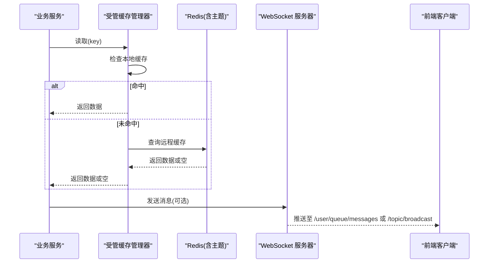
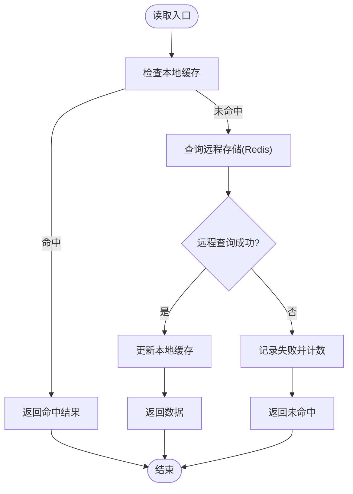
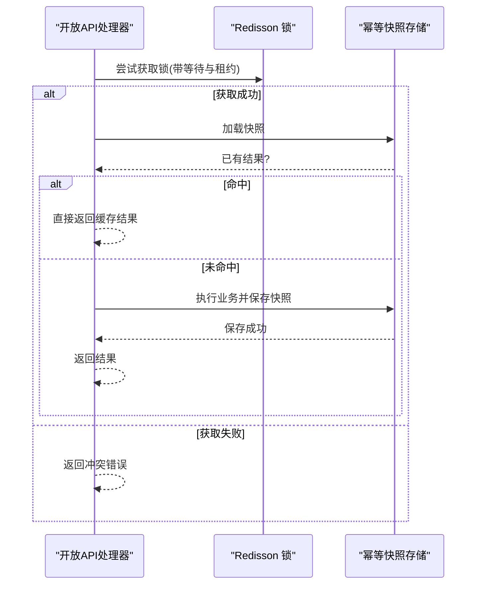
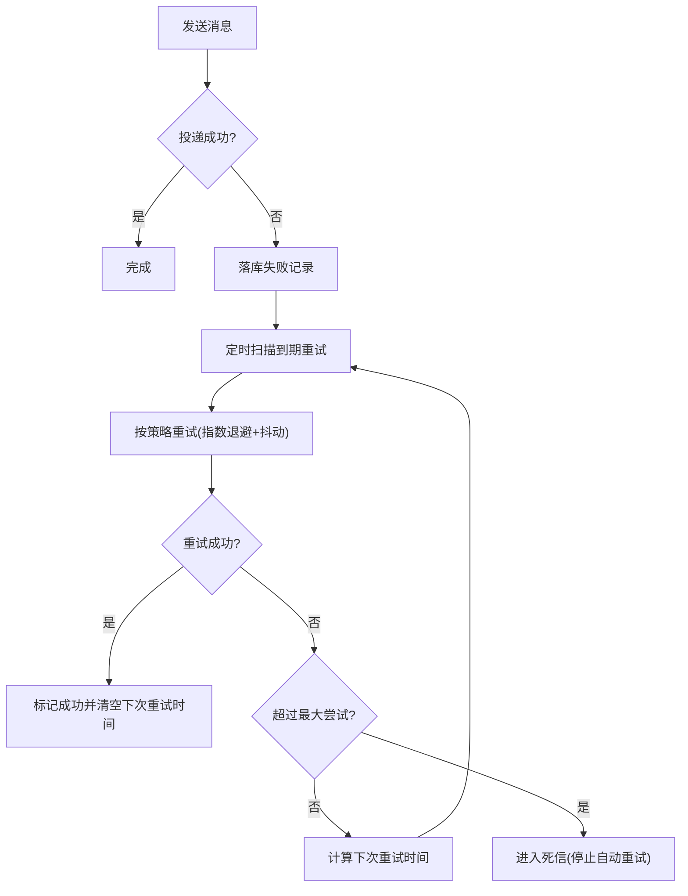
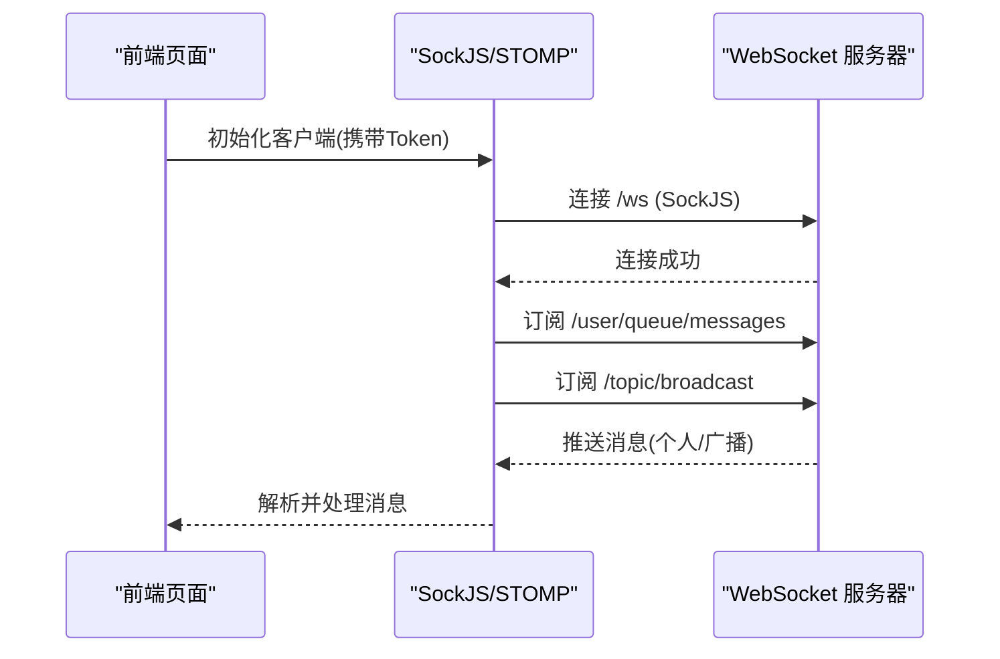
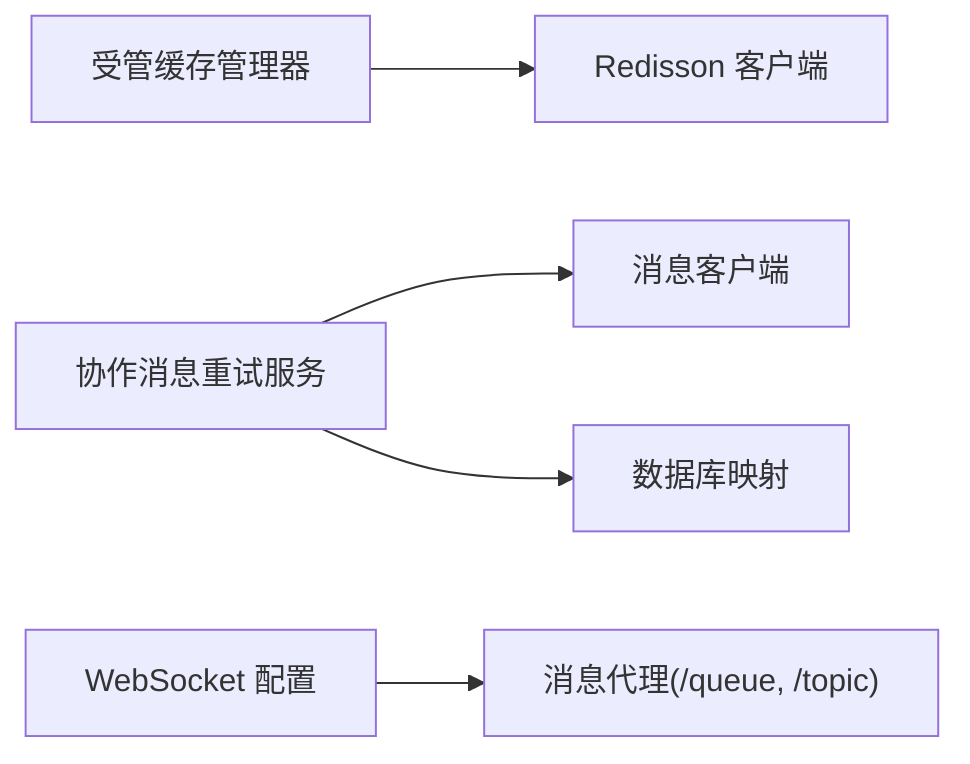

# 缓存与消息

<cite>
**本文引用的文件**
- [RedissonConfig.java](file://forge-server/forge-framework/forge-starter-parent/forge-starter-cache/src/main/java/com/mdframe/forge/starter/cache/config/RedissonConfig.java)
- [ForgeManagedCacheManager.java](file://forge-server/forge-framework/forge-starter-parent/forge-starter-cache/src/main/java/com/mdframe/forge/starter/cache/managed/ForgeManagedCacheManager.java)
- [CacheDefinition.java](file://forge-server/forge-framework/forge-starter-parent/forge-starter-cache/src/main/java/com/mdframe/forge/starter/cache/managed/model/CacheDefinition.java)
- [MultiLevelCacheHandleTest.java](file://forge-server/forge-framework/forge-starter-parent/forge-starter-cache/src/test/java/com/mdframe/forge/starter/cache/managed/store/MultiLevelCacheHandleTest.java)
- [WebSocketConfig.java](file://forge-server/forge-framework/forge-starter-parent/forge-starter-websocket/src/main/java/com/mdframe/forge/starter/websocket/config/WebSocketConfig.java)
- [WebSocketMessage.java](file://forge-server/forge-framework/forge-starter-parent/forge-starter-websocket/src/main/java/com/mdframe/forge/starter/websocket/domain/WebSocketMessage.java)
- [websocket.js](file://forge-admin-ui/src/utils/websocket.js)
- [OpenApiIdempotencyManager.java](file://forge-server/forge-framework/forge-starter-parent/forge-starter-openapi-security/src/main/java/com/mdframe/forge/starter/openapi/security/idempotency/OpenApiIdempotencyManager.java)
- [JobExecutionLockManagerTest.java](file://forge-server/forge-framework/forge-plugin-parent/forge-plugin-job/src/test/java/com/mdframe/forge/plugin/job/manager/JobExecutionLockManagerTest.java)
- [CollaborationDeliveryRetryService.java](file://forge-server/forge-framework/forge-plugin-parent/forge-plugin-collaboration/src/main/java/com/mdframe/forge/plugin/collaboration/service/CollaborationDeliveryRetryService.java)
- [CollaborationRetryPolicy.java](file://forge-server/forge-framework/forge-plugin-parent/forge-plugin-collaboration/src/main/java/com/mdframe/forge/plugin/collaboration/service/CollaborationRetryPolicy.java)
- [CollaborationDeliveryMapper.xml](file://forge-server/forge-framework/forge-plugin-parent/forge-plugin-collaboration/src/main/resources/mapper/collaboration/CollaborationDeliveryMapper.xml)
</cite>

## 目录
1. [简介](#简介)
2. [项目结构](#项目结构)
3. [核心组件](#核心组件)
4. [架构总览](#架构总览)
5. [详细组件分析](#详细组件分析)
6. [依赖关系分析](#依赖关系分析)
7. [性能考量](#性能考量)
8. [故障排查指南](#故障排查指南)
9. [结论](#结论)
10. [附录](#附录)

## 简介
本技术文档聚焦 Forge Admin 的缓存与消息系统，围绕以下目标展开：
- Redis 缓存策略设计：缓存穿透防护、缓存雪崩避免、热点数据缓存。
- 分布式锁实现：基于 Redisson 的锁粒度控制与死锁预防。
- 消息队列集成：异步任务处理、事件驱动架构、消息可靠性保证（持久化、重试、死信）。
- WebSocket 实时通信：连接管理、消息广播与在线状态维护。
- 缓存一致性：读写分离、缓存更新与失效机制。

## 项目结构
本项目在框架层提供可复用的缓存与消息能力，并通过插件扩展业务场景：
- 缓存能力：通过受管缓存管理器统一配置、统计与多级别缓存；Redisson 作为底层客户端与序列化支持。
- 消息能力：协作消息投递、重试策略、数据库持久化与补偿扫描。
- 实时通信：WebSocket + STOMP/SockJS 的前后端通道，服务端配置端点与认证拦截。

```mermaid
graph TB
subgraph "应用服务"
A["业务服务"]
end
subgraph "缓存层"
B["受管缓存管理器"]
C["Redisson 客户端"]
end
subgraph "消息层"
D["协作消息投递服务"]
E["重试策略"]
F["数据库持久化"]
end
subgraph "实时通信"
G["WebSocket 配置"]
H["前端 STOMP/SockJS"]
end
A --> B
B --> C
A --> D
D --> E
D --> F
A --> G
G < --> H
```

图表来源
- [RedissonConfig.java:1-35](file://forge-server/forge-framework/forge-starter-parent/forge-starter-cache/src/main/java/com/mdframe/forge/starter/cache/config/RedissonConfig.java#L1-L35)
- [ForgeManagedCacheManager.java:94-220](file://forge-server/forge-framework/forge-starter-parent/forge-starter-cache/src/main/java/com/mdframe/forge/starter/cache/managed/ForgeManagedCacheManager.java#L94-L220)
- [WebSocketConfig.java:1-64](file://forge-server/forge-framework/forge-starter-parent/forge-starter-websocket/src/main/java/com/mdframe/forge/starter/websocket/config/WebSocketConfig.java#L1-L64)
- [CollaborationDeliveryRetryService.java:1-127](file://forge-server/forge-framework/forge-plugin-parent/forge-plugin-collaboration/src/main/java/com/mdframe/forge/plugin/collaboration/service/CollaborationDeliveryRetryService.java#L1-L127)

章节来源
- [RedissonConfig.java:1-35](file://forge-server/forge-framework/forge-starter-parent/forge-starter-cache/src/main/java/com/mdframe/forge/starter/cache/config/RedissonConfig.java#L1-L35)
- [WebSocketConfig.java:1-64](file://forge-server/forge-framework/forge-starter-parent/forge-starter-websocket/src/main/java/com/mdframe/forge/starter/websocket/config/WebSocketConfig.java#L1-L64)

## 核心组件
- 受管缓存管理器：统一注册缓存定义、计算有效策略、执行多级缓存读取、统计命中/未命中/失败等指标，并支持运行时覆盖与发布控制消息。
- Redisson 配置：自定义 Jackson 序列化器，支持 Java 8 时间类型，确保跨模块序列化一致。
- 协作消息重试服务：对失败的协同消息进行补偿扫描与指数退避重试，结合数据库记录与重试策略决定下次尝试时间或终止。
- WebSocket 配置：启用简单消息代理，配置用户目的地前缀与 STOMP 端点，接入认证拦截器保障安全。

章节来源
- [ForgeManagedCacheManager.java:94-220](file://forge-server/forge-framework/forge-starter-parent/forge-starter-cache/src/main/java/com/mdframe/forge/starter/cache/managed/ForgeManagedCacheManager.java#L94-L220)
- [RedissonConfig.java:1-35](file://forge-server/forge-framework/forge-starter-parent/forge-starter-cache/src/main/java/com/mdframe/forge/starter/cache/config/RedissonConfig.java#L1-L35)
- [CollaborationDeliveryRetryService.java:1-127](file://forge-server/forge-framework/forge-plugin-parent/forge-plugin-collaboration/src/main/java/com/mdframe/forge/plugin/collaboration/service/CollaborationDeliveryRetryService.java#L1-L127)
- [WebSocketConfig.java:1-64](file://forge-server/forge-framework/forge-starter-parent/forge-starter-websocket/src/main/java/com/mdframe/forge/starter/websocket/config/WebSocketConfig.java#L1-L64)

## 架构总览
下图展示了缓存、消息与实时通信的整体交互：
- 读路径：业务调用受管缓存管理器，命中本地缓存则直接返回；否则访问远程存储（Redis），并通过主题订阅同步失效。
- 写路径：业务写入后更新缓存并可能发布控制消息以通知其他实例失效本地缓存。
- 消息路径：业务发送消息，若失败则落库并进入重试队列，由补偿任务按策略重发。
- 实时通信：前端通过 SockJS+STOMP 连接 /ws，订阅个人队列与广播主题接收推送。



图表来源
- [ForgeManagedCacheManager.java:94-220](file://forge-server/forge-framework/forge-starter-parent/forge-starter-cache/src/main/java/com/mdframe/forge/starter/cache/managed/ForgeManagedCacheManager.java#L94-L220)
- [WebSocketConfig.java:33-61](file://forge-server/forge-framework/forge-starter-parent/forge-starter-websocket/src/main/java/com/mdframe/forge/starter/websocket/config/WebSocketConfig.java#L33-L61)
- [websocket.js:60-76](file://forge-admin-ui/src/utils/websocket.js#L60-L76)

## 详细组件分析

### 缓存组件：受管缓存管理器与多级缓存
- 缓存定义：以 applicationCode 与 cacheName 为唯一标识，包含默认模式、允许模式、作用域、本地与 Redis TTL、本地最大容量、是否缓存空值及空值 TTL 等。
- 读取流程：优先本地缓存，未命中时访问远程存储；异常情况下记录失败并降级为空命中，避免级联故障。
- 统计与监控：使用计数器记录命中、未命中、写入、淘汰与失败次数，便于观测与告警。
- 运行时覆盖：支持校验与移除覆盖策略，并发布控制消息以重置实例缓存。
- 多级缓存一致性：测试表明当主题重新订阅后，本地缓存会刷新为最新值，确保跨实例一致性。



图表来源
- [ForgeManagedCacheManager.java:94-113](file://forge-server/forge-framework/forge-starter-parent/forge-starter-cache/src/main/java/com/mdframe/forge/starter/cache/managed/ForgeManagedCacheManager.java#L94-L113)
- [MultiLevelCacheHandleTest.java:73-87](file://forge-server/forge-framework/forge-starter-parent/forge-starter-cache/src/test/java/com/mdframe/forge/starter/cache/managed/store/MultiLevelCacheHandleTest.java#L73-L87)

章节来源
- [CacheDefinition.java:1-31](file://forge-server/forge-framework/forge-starter-parent/forge-starter-cache/src/main/java/com/mdframe/forge/starter/cache/managed/model/CacheDefinition.java#L1-L31)
- [ForgeManagedCacheManager.java:94-220](file://forge-server/forge-framework/forge-starter-parent/forge-starter-cache/src/main/java/com/mdframe/forge/starter/cache/managed/ForgeManagedCacheManager.java#L94-L220)
- [MultiLevelCacheHandleTest.java:73-102](file://forge-server/forge-framework/forge-starter-parent/forge-starter-cache/src/test/java/com/mdframe/forge/starter/cache/managed/store/MultiLevelCacheHandleTest.java#L73-L102)

### 分布式锁：Redisson 集成与锁粒度控制
- 幂等性锁：在开放 API 幂等性管理中，获取锁失败返回冲突错误，捕获中断与运行时异常并转换为基础设施不可用错误。
- 任务执行锁：测试验证同一资源仅允许一个管理器持有共享锁，释放后可再次获取；当 Redis 不可用时返回不可用状态并给出原因。
- 锁粒度：以业务维度键（如任务 ID）作为锁键，确保细粒度并发控制。
- 死锁预防：通过 tryLock 超时与租约时间避免长期占用；异常路径及时释放与降级。



图表来源
- [OpenApiIdempotencyManager.java:70-99](file://forge-server/forge-framework/forge-starter-parent/forge-starter-openapi-security/src/main/java/com/mdframe/forge/starter/openapi/security/idempotency/OpenApiIdempotencyManager.java#L70-L99)
- [JobExecutionLockManagerTest.java:38-100](file://forge-server/forge-framework/forge-plugin-parent/forge-plugin-job/src/test/java/com/mdframe/forge/plugin/job/manager/JobExecutionLockManagerTest.java#L38-L100)

章节来源
- [OpenApiIdempotencyManager.java:70-99](file://forge-server/forge-framework/forge-starter-parent/forge-starter-openapi-security/src/main/java/com/mdframe/forge/starter/openapi/security/idempotency/OpenApiIdempotencyManager.java#L70-L99)
- [JobExecutionLockManagerTest.java:38-100](file://forge-server/forge-framework/forge-plugin-parent/forge-plugin-job/src/test/java/com/mdframe/forge/plugin/job/manager/JobExecutionLockManagerTest.java#L38-L100)

### 消息队列：异步任务、事件驱动与可靠性保证
- 异步与事件驱动：业务侧通过消息客户端发送消息，渠道实现负责具体投递；失败时落库并由补偿任务扫描重试。
- 重试策略：采用指数退避与抖动，限制最大尝试次数；根据错误类型与时间窗口决策是否继续重试。
- 持久化与死信：投递记录包含租户、消息、用户、状态、尝试次数与下次重试时间；达到上限后停止自动重试，形成“死信”态供人工干预。
- 批量更新：已读标记优化为单条批量更新，减少数据库压力。



图表来源
- [CollaborationDeliveryRetryService.java:76-117](file://forge-server/forge-framework/forge-plugin-parent/forge-plugin-collaboration/src/main/java/com/mdframe/forge/plugin/collaboration/service/CollaborationDeliveryRetryService.java#L76-L117)
- [CollaborationRetryPolicy.java:25-54](file://forge-server/forge-framework/forge-plugin-parent/forge-plugin-collaboration/src/main/java/com/mdframe/forge/plugin/collaboration/service/CollaborationRetryPolicy.java#L25-L54)
- [CollaborationDeliveryMapper.xml:62-95](file://forge-server/forge-framework/forge-plugin-parent/forge-plugin-collaboration/src/main/resources/mapper/collaboration/CollaborationDeliveryMapper.xml#L62-L95)

章节来源
- [CollaborationDeliveryRetryService.java:1-127](file://forge-server/forge-framework/forge-plugin-parent/forge-plugin-collaboration/src/main/java/com/mdframe/forge/plugin/collaboration/service/CollaborationDeliveryRetryService.java#L1-L127)
- [CollaborationRetryPolicy.java:25-54](file://forge-server/forge-framework/forge-plugin-parent/forge-plugin-collaboration/src/main/java/com/mdframe/forge/plugin/collaboration/service/CollaborationRetryPolicy.java#L25-L54)
- [CollaborationDeliveryMapper.xml:62-95](file://forge-server/forge-framework/forge-plugin-parent/forge-plugin-collaboration/src/main/resources/mapper/collaboration/CollaborationDeliveryMapper.xml#L62-L95)

### WebSocket 实时通信：连接管理、消息广播与在线状态
- 服务端配置：启用简单消息代理，设置用户目的地前缀与 STOMP 端点 /ws，支持 SockJS 兼容；通过认证拦截器保障连接安全。
- 客户端连接：前端使用 SockJS 建立连接，携带 Authorization 头；连接成功后订阅个人队列与广播主题。
- 心跳与重连：配置心跳间隔与重连延迟，提升弱网环境稳定性。
- 消息模型：服务端提供便捷的消息构建方法，用于不同类型与级别的推送。



图表来源
- [WebSocketConfig.java:33-61](file://forge-server/forge-framework/forge-starter-parent/forge-starter-websocket/src/main/java/com/mdframe/forge/starter/websocket/config/WebSocketConfig.java#L33-L61)
- [websocket.js:13-88](file://forge-admin-ui/src/utils/websocket.js#L13-L88)
- [WebSocketMessage.java:72-98](file://forge-server/forge-framework/forge-starter-parent/forge-starter-websocket/src/main/java/com/mdframe/forge/starter/websocket/domain/WebSocketMessage.java#L72-L98)

章节来源
- [WebSocketConfig.java:1-64](file://forge-server/forge-framework/forge-starter-parent/forge-starter-websocket/src/main/java/com/mdframe/forge/starter/websocket/config/WebSocketConfig.java#L1-L64)
- [websocket.js:1-105](file://forge-admin-ui/src/utils/websocket.js#L1-L105)
- [WebSocketMessage.java:72-98](file://forge-server/forge-framework/forge-starter-parent/forge-starter-websocket/src/main/java/com/mdframe/forge/starter/websocket/domain/WebSocketMessage.java#L72-L98)

## 依赖关系分析
- 缓存与消息的耦合点：
  - 受管缓存管理器依赖 Redisson 客户端进行远程存取与主题发布。
  - 协作消息重试服务依赖消息客户端与数据库映射，结合重试策略进行补偿。
- 实时通信与消息：
  - WebSocket 配置提供广播与点对点通道，可与消息系统联动将重要通知推送到前端。
- 外部依赖：
  - Redisson：分布式锁、原子操作、集合与 Map 等数据结构。
  - 数据库：消息投递记录与重试状态持久化。



图表来源
- [RedissonConfig.java:1-35](file://forge-server/forge-framework/forge-starter-parent/forge-starter-cache/src/main/java/com/mdframe/forge/starter/cache/config/RedissonConfig.java#L1-L35)
- [CollaborationDeliveryRetryService.java:1-127](file://forge-server/forge-framework/forge-plugin-parent/forge-plugin-collaboration/src/main/java/com/mdframe/forge/plugin/collaboration/service/CollaborationDeliveryRetryService.java#L1-L127)
- [WebSocketConfig.java:33-61](file://forge-server/forge-framework/forge-starter-parent/forge-starter-websocket/src/main/java/com/mdframe/forge/starter/websocket/config/WebSocketConfig.java#L33-L61)

章节来源
- [RedissonConfig.java:1-35](file://forge-server/forge-framework/forge-starter-parent/forge-starter-cache/src/main/java/com/mdframe/forge/starter/cache/config/RedissonConfig.java#L1-L35)
- [CollaborationDeliveryRetryService.java:1-127](file://forge-server/forge-framework/forge-plugin-parent/forge-plugin-collaboration/src/main/java/com/mdframe/forge/plugin/collaboration/service/CollaborationDeliveryRetryService.java#L1-L127)
- [WebSocketConfig.java:33-61](file://forge-server/forge-framework/forge-starter-parent/forge-starter-websocket/src/main/java/com/mdframe/forge/starter/websocket/config/WebSocketConfig.java#L33-L61)

## 性能考量
- 缓存穿透防护：
  - 读取异常时记录失败并返回未命中，避免对下游造成压力；结合空值缓存与短 TTL 降低热点 key 缺失时的冲击。
- 缓存雪崩避免：
  - 通过本地与远程两级缓存、随机 TTL 与主题失效同步，减少集中过期导致的峰值流量。
- 热点数据缓存：
  - 本地缓存快速响应高频读取；远程缓存承担跨实例一致性；统计命中与失败指标辅助调优。
- 分布式锁性能：
  - 使用 tryLock 超时与租约时间，避免长时间阻塞；细粒度锁键减少竞争。
- 消息重试性能：
  - 指数退避与抖动降低重试风暴；批量已读更新减少数据库压力。

[本节为通用指导，不直接分析具体文件]

## 故障排查指南
- 缓存读取失败：
  - 观察失败计数与日志，定位是否为 Redis 不可用或序列化问题；确认本地与远程缓存策略是否兼容。
- 分布式锁冲突：
  - 检查锁键命名与租约时间；确认是否存在长事务或异常未释放锁的情况。
- 消息投递失败：
  - 查看重试记录与下次重试时间；根据错误码分类判断临时错误或永久错误；必要时人工介入死信记录。
- WebSocket 连接问题：
  - 检查 /ws 端点与跨域配置；确认前端 Token 传递与心跳配置；查看 STOMP 错误日志。

章节来源
- [ForgeManagedCacheManager.java:505-521](file://forge-server/forge-framework/forge-starter-parent/forge-starter-cache/src/main/java/com/mdframe/forge/starter/cache/managed/ForgeManagedCacheManager.java#L505-L521)
- [OpenApiIdempotencyManager.java:70-99](file://forge-server/forge-framework/forge-starter-parent/forge-starter-openapi-security/src/main/java/com/mdframe/forge/starter/openapi/security/idempotency/OpenApiIdempotencyManager.java#L70-L99)
- [CollaborationDeliveryRetryService.java:76-117](file://forge-server/forge-framework/forge-plugin-parent/forge-plugin-collaboration/src/main/java/com/mdframe/forge/plugin/collaboration/service/CollaborationDeliveryRetryService.java#L76-L117)
- [websocket.js:78-88](file://forge-admin-ui/src/utils/websocket.js#L78-L88)

## 结论
Forge Admin 的缓存与消息系统在框架层提供了高可用、可扩展的基础能力：
- 受管缓存管理器统一了缓存策略与统计，结合多级缓存与主题失效保障一致性。
- Redisson 分布式锁实现了细粒度并发控制与幂等性保护，具备完善的异常处理与降级策略。
- 协作消息重试服务通过数据库持久化与指数退避策略，确保消息最终可达并提供死信处理能力。
- WebSocket 实时通信通过标准协议与安全拦截，满足即时推送与在线状态维护需求。

[本节为总结性内容，不直接分析具体文件]

## 附录
- 关键配置建议：
  - Redisson：确保 Jackson 序列化支持时间类型，避免跨模块不一致。
  - WebSocket：合理设置心跳与重连参数，适配不同网络环境。
  - 消息重试：根据业务容忍度调整最大尝试次数与退避基数。
- 监控与告警：
  - 关注缓存命中率、失败率与锁冲突次数；监控消息重试成功率与死信数量；跟踪 WebSocket 连接数与错误率。

[本节为补充信息，不直接分析具体文件]