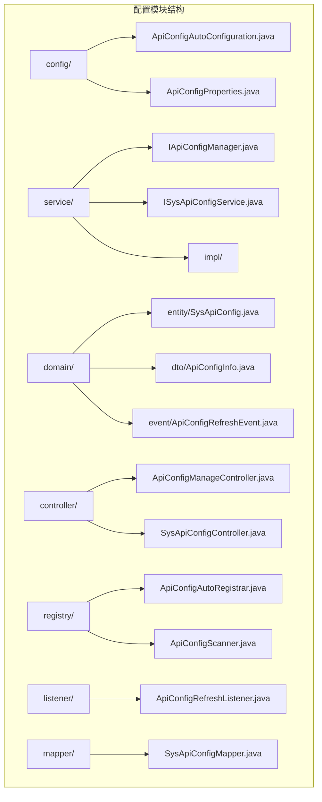
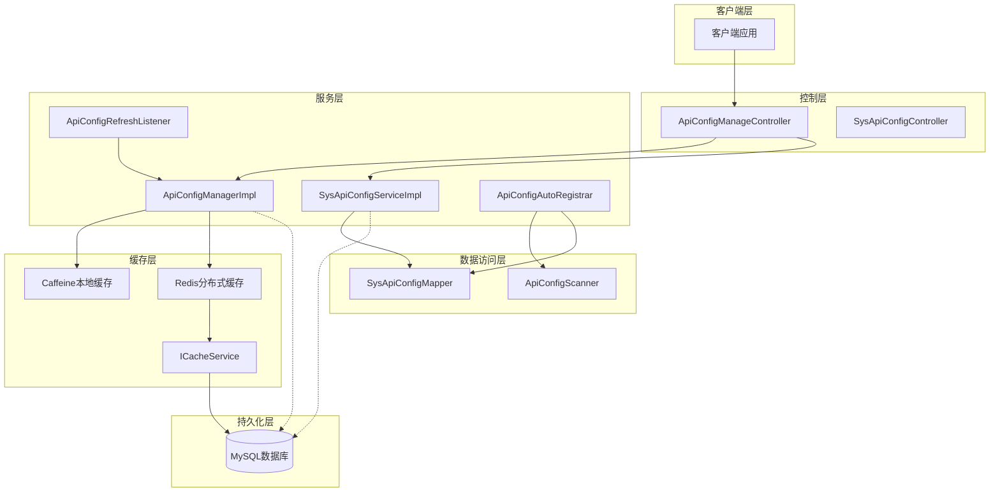
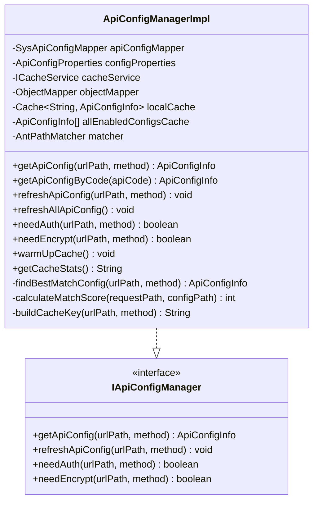
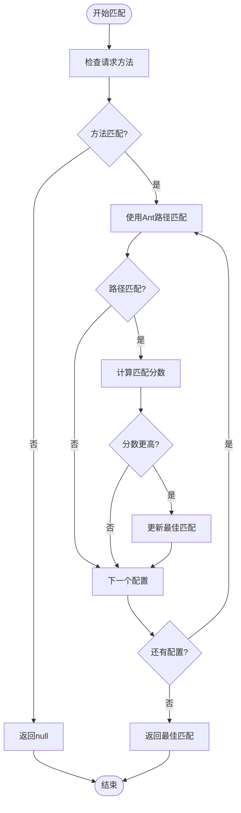
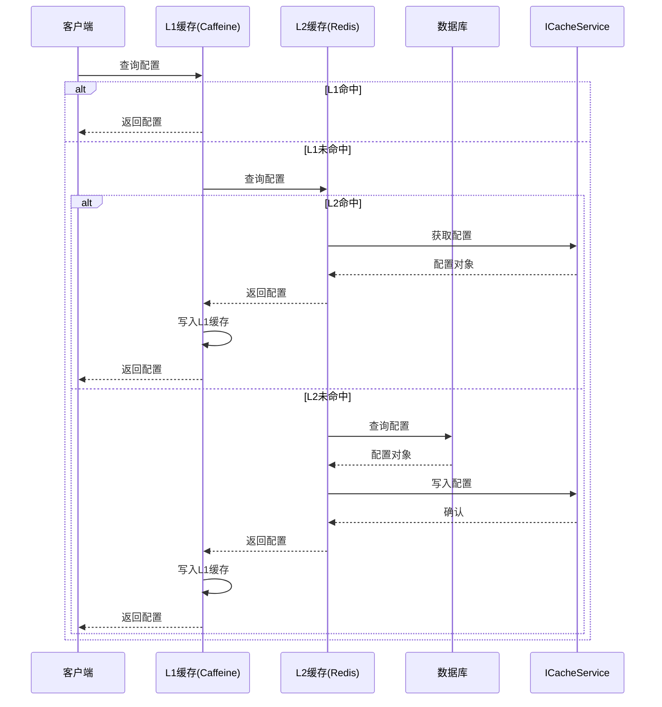
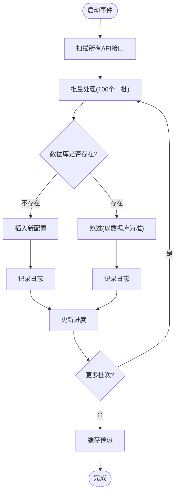
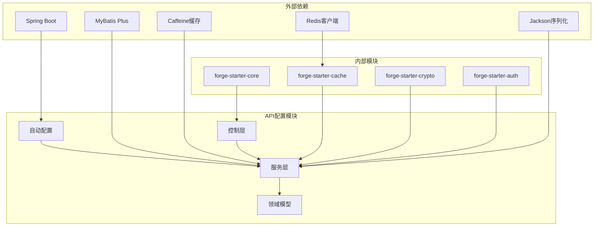

# API配置模块

<cite>
**本文档引用的文件**
- [ApiConfigAutoConfiguration.java](file://forge/forge-framework/forge-starter-parent/forge-starter-api-config/src/main/java/com/mdframe/forge/starter/apiconfig/config/ApiConfigAutoConfiguration.java)
- [ApiConfigProperties.java](file://forge/forge-framework/forge-starter-parent/forge-starter-api-config/src/main/java/com/mdframe/forge/starter/apiconfig/config/ApiConfigProperties.java)
- [ApiConfigManagerImpl.java](file://forge/forge-framework/forge-starter-parent/forge-starter-api-config/src/main/java/com/mdframe/forge/starter/apiconfig/service/impl/ApiConfigManagerImpl.java)
- [SysApiConfigServiceImpl.java](file://forge/forge-framework/forge-starter-parent/forge-starter-api-config/src/main/java/com/mdframe/forge/starter/apiconfig/service/impl/SysApiConfigServiceImpl.java)
- [SysApiConfig.java](file://forge/forge-framework/forge-starter-parent/forge-starter-api-config/src/main/java/com/mdframe/forge/starter/apiconfig/domain/entity/SysApiConfig.java)
- [ApiConfigInfo.java](file://forge/forge-framework/forge-starter-parent/forge-starter-api-config/src/main/java/com/mdframe/forge/starter/apiconfig/domain/dto/ApiConfigInfo.java)
- [ApiConfigAutoRegistrar.java](file://forge/forge-framework/forge-starter-parent/forge-starter-api-config/src/main/java/com/mdframe/forge/starter/apiconfig/registry/ApiConfigAutoRegistrar.java)
- [ApiConfigRefreshListener.java](file://forge/forge-framework/forge-starter-parent/forge-starter-api-config/src/main/java/com/mdframe/forge/starter/apiconfig/listener/ApiConfigRefreshListener.java)
- [ApiConfigManageController.java](file://forge/forge-framework/forge-starter-parent/forge-starter-api-config/src/main/java/com/mdframe/forge/starter/apiconfig/controller/ApiConfigManageController.java)
- [ApiConfigRefreshEvent.java](file://forge/forge-framework/forge-starter-parent/forge-starter-api-config/src/main/java/com/mdframe/forge/starter/apiconfig/domain/event/ApiConfigRefreshEvent.java)
- [ApiConfigScanner.java](file://forge/forge-framework/forge-starter-parent/forge-starter-api-config/src/main/java/com/mdframe/forge/starter/apiconfig/registry/ApiConfigScanner.java)
- [SysApiConfigMapper.java](file://forge/forge-framework/forge-starter-parent/forge-starter-api-config/src/main/java/com/mdframe/forge/starter/apiconfig/mapper/SysApiConfigMapper.java)
- [ICacheService.java](file://forge/forge-framework/forge-starter-parent/forge-starter-cache/src/main/java/com/mdframe/forge/starter/cache/service/ICacheService.java)
- [application.yml](file://forge/forge-admin/src/main/resources/application.yml)
- [API权限控制使用说明.md](file://forge/forge-admin/src/main/resources/sql/API权限控制使用说明.md)
</cite>

## 目录
1. [简介](#简介)
2. [项目结构](#项目结构)
3. [核心组件](#核心组件)
4. [架构概览](#架构概览)
5. [详细组件分析](#详细组件分析)
6. [依赖关系分析](#依赖关系分析)
7. [性能考虑](#性能考虑)
8. [故障排查指南](#故障排查指南)
9. [结论](#结论)
10. [附录](#附录)

## 简介
Forge API配置模块是一个基于Spring Boot的企业级API配置管理解决方案，提供了动态配置管理、两级缓存架构、自动注册、热更新和权限控制等功能。该模块通过统一的配置中心实现对REST接口的集中管理，支持实时权限控制、参数校验、加解密和租户隔离等高级特性。

## 项目结构
API配置模块位于`forge/forge-framework/forge-starter-parent/forge-starter-api-config`目录下，采用标准的MVC分层架构：



**图表来源**
- [ApiConfigAutoConfiguration.java](file://forge/forge-framework/forge-starter-parent/forge-starter-api-config/src/main/java/com/mdframe/forge/starter/apiconfig/config/ApiConfigAutoConfiguration.java#L1-L57)
- [ApiConfigProperties.java](file://forge/forge-framework/forge-starter-parent/forge-starter-api-config/src/main/java/com/mdframe/forge/starter/apiconfig/config/ApiConfigProperties.java#L1-L87)

**章节来源**
- [ApiConfigAutoConfiguration.java](file://forge/forge-framework/forge-starter-parent/forge-starter-api-config/src/main/java/com/mdframe/forge/starter/apiconfig/config/ApiConfigAutoConfiguration.java#L1-L57)
- [ApiConfigProperties.java](file://forge/forge-framework/forge-starter-parent/forge-starter-api-config/src/main/java/com/mdframe/forge/starter/apiconfig/config/ApiConfigProperties.java#L1-L87)

## 核心组件
API配置模块包含以下核心组件：

### 配置管理器
`ApiConfigManagerImpl`是模块的核心决策引擎，负责：
- 两级缓存管理（L1本地缓存 + L2分布式缓存）
- API配置的动态加载和热更新
- 权限控制决策
- 路径匹配算法

### 服务层
- `SysApiConfigServiceImpl`：提供API配置的增删改查功能
- `ApiConfigManagerImpl`：实现具体的配置管理逻辑

### 实体模型
- `SysApiConfig`：数据库实体，存储API配置信息
- `ApiConfigInfo`：缓存DTO，用于高性能读取

**章节来源**
- [ApiConfigManagerImpl.java](file://forge/forge-framework/forge-starter-parent/forge-starter-api-config/src/main/java/com/mdframe/forge/starter/apiconfig/service/impl/ApiConfigManagerImpl.java#L1-L368)
- [SysApiConfigServiceImpl.java](file://forge/forge-framework/forge-starter-parent/forge-starter-api-config/src/main/java/com/mdframe/forge/starter/apiconfig/service/impl/SysApiConfigServiceImpl.java#L1-L178)
- [SysApiConfig.java](file://forge/forge-framework/forge-starter-parent/forge-starter-api-config/src/main/java/com/mdframe/forge/starter/apiconfig/domain/entity/SysApiConfig.java#L1-L150)
- [ApiConfigInfo.java](file://forge/forge-framework/forge-starter-parent/forge-starter-api-config/src/main/java/com/mdframe/forge/starter/apiconfig/domain/dto/ApiConfigInfo.java#L1-L129)

## 架构概览
API配置模块采用分层架构设计，实现了高内聚低耦合的系统结构：



**图表来源**
- [ApiConfigManageController.java](file://forge/forge-framework/forge-starter-parent/forge-starter-api-config/src/main/java/com/mdframe/forge/starter/apiconfig/controller/ApiConfigManageController.java#L1-L91)
- [ApiConfigManagerImpl.java](file://forge/forge-framework/forge-starter-parent/forge-starter-api-config/src/main/java/com/mdframe/forge/starter/apiconfig/service/impl/ApiConfigManagerImpl.java#L1-L368)
- [ApiConfigAutoRegistrar.java](file://forge/forge-framework/forge-starter-parent/forge-starter-api-config/src/main/java/com/mdframe/forge/starter/apiconfig/registry/ApiConfigAutoRegistrar.java#L1-L156)

## 详细组件分析

### 配置管理器实现
`ApiConfigManagerImpl`是整个模块的核心，实现了复杂的两级缓存架构：



**图表来源**
- [ApiConfigManagerImpl.java](file://forge/forge-framework/forge-starter-parent/forge-starter-api-config/src/main/java/com/mdframe/forge/starter/apiconfig/service/impl/ApiConfigManagerImpl.java#L30-L85)
- [ApiConfigManagerImpl.java](file://forge/forge-framework/forge-starter-parent/forge-starter-api-config/src/main/java/com/mdframe/forge/starter/apiconfig/service/impl/ApiConfigManagerImpl.java#L174-L252)

#### 路径匹配算法
模块实现了智能的Ant路径匹配算法，支持精确匹配、通配符匹配和前缀匹配：



**图表来源**
- [ApiConfigManagerImpl.java](file://forge/forge-framework/forge-starter-parent/forge-starter-api-config/src/main/java/com/mdframe/forge/starter/apiconfig/service/impl/ApiConfigManagerImpl.java#L111-L133)

**章节来源**
- [ApiConfigManagerImpl.java](file://forge/forge-framework/forge-starter-parent/forge-starter-api-config/src/main/java/com/mdframe/forge/starter/apiconfig/service/impl/ApiConfigManagerImpl.java#L30-L368)

### 缓存架构设计
模块采用两级缓存架构，确保高性能和高可用性：



**图表来源**
- [ApiConfigManagerImpl.java](file://forge/forge-framework/forge-starter-parent/forge-starter-api-config/src/main/java/com/mdframe/forge/starter/apiconfig/service/impl/ApiConfigManagerImpl.java#L316-L366)

#### 缓存配置参数
- **L1本地缓存**：最大1000条，10分钟过期
- **L2分布式缓存**：Redis，30分钟过期，key前缀"api:config:"
- **预热策略**：启动时预加载所有启用的配置

**章节来源**
- [ApiConfigProperties.java](file://forge/forge-framework/forge-starter-parent/forge-starter-api-config/src/main/java/com/mdframe/forge/starter/apiconfig/config/ApiConfigProperties.java#L44-L84)

### 自动注册机制
`ApiConfigAutoRegistrar`实现了智能的API自动注册功能：



**图表来源**
- [ApiConfigAutoRegistrar.java](file://forge/forge-framework/forge-starter-parent/forge-starter-api-config/src/main/java/com/mdframe/forge/starter/apiconfig/registry/ApiConfigAutoRegistrar.java#L93-L154)

**章节来源**
- [ApiConfigAutoRegistrar.java](file://forge/forge-framework/forge-starter-parent/forge-starter-api-config/src/main/java/com/mdframe/forge/starter/apiconfig/registry/ApiConfigAutoRegistrar.java#L22-L156)

### 权限控制系统
模块提供了全面的权限控制机制：

| 权限类型 | 配置字段 | 作用域 | 控制点 |
|---------|----------|--------|--------|
| 认证鉴权 | authFlag | 全局 | 登录状态验证 |
| 报文加密 | encryptFlag | 敏感数据 | 请求/响应加解密 |
| 租户隔离 | tenantFlag | 多租户 | 数据隔离 |
| 限流控制 | limitFlag | 性能保护 | QPS限制 |

**章节来源**
- [SysApiConfig.java](file://forge/forge-framework/forge-starter-parent/forge-starter-api-config/src/main/java/com/mdframe/forge/starter/apiconfig/domain/entity/SysApiConfig.java#L68-L89)
- [ApiConfigInfo.java](file://forge/forge-framework/forge-starter-parent/forge-starter-api-config/src/main/java/com/mdframe/forge/starter/apiconfig/domain/dto/ApiConfigInfo.java#L56-L74)

## 依赖关系分析



**图表来源**
- [ApiConfigAutoConfiguration.java](file://forge/forge-framework/forge-starter-parent/forge-starter-api-config/src/main/java/com/mdframe/forge/starter/apiconfig/config/ApiConfigAutoConfiguration.java#L1-L57)
- [ApiConfigManagerImpl.java](file://forge/forge-framework/forge-starter-parent/forge-starter-api-config/src/main/java/com/mdframe/forge/starter/apiconfig/service/impl/ApiConfigManagerImpl.java#L1-L30)

**章节来源**
- [ApiConfigAutoConfiguration.java](file://forge/forge-framework/forge-starter-parent/forge-starter-api-config/src/main/java/com/mdframe/forge/starter/apiconfig/config/ApiConfigAutoConfiguration.java#L1-L57)

## 性能考虑
API配置模块在设计时充分考虑了性能优化：

### 缓存策略
- **多级缓存**：L1本地缓存提供毫秒级响应，L2分布式缓存支持集群共享
- **预热机制**：启动时预加载所有配置，避免首次访问延迟
- **智能淘汰**：基于LRU算法的缓存淘汰策略

### 并发处理
- **异步注册**：使用线程池异步处理API注册，避免阻塞主流程
- **批量处理**：100个接口一批进行注册，提高处理效率
- **事件驱动**：基于Spring事件的异步刷新机制

### 数据库优化
- **索引设计**：为常用查询字段建立索引
- **连接池**：使用高效的数据库连接池
- **批量操作**：支持批量插入和更新操作

## 故障排查指南

### 常见问题及解决方案

#### 缓存相关问题
**问题**：配置更新后缓存未生效
**解决方案**：
1. 检查Redis连接是否正常
2. 验证缓存Key前缀配置
3. 确认事件发布机制是否正常工作

#### 权限控制问题
**问题**：接口权限判断错误
**解决方案**：
1. 检查API配置表中的权限标志位
2. 验证路径匹配规则
3. 确认权限控制拦截器配置

#### 自动注册问题
**问题**：API未自动注册到数据库
**解决方案**：
1. 检查扫描包路径配置
2. 验证Controller注解是否正确
3. 确认数据库连接和权限

**章节来源**
- [ApiConfigRefreshListener.java](file://forge/forge-framework/forge-starter-parent/forge-starter-api-config/src/main/java/com/mdframe/forge/starter/apiconfig/listener/ApiConfigRefreshListener.java#L1-L59)
- [ApiConfigManageController.java](file://forge/forge-framework/forge-starter-parent/forge-starter-api-config/src/main/java/com/mdframe/forge/starter/apiconfig/controller/ApiConfigManageController.java#L1-L91)

## 结论
Forge API配置模块通过精心设计的架构和完善的机制，为企业级API管理提供了强大的技术支持。其核心优势包括：

1. **高性能**：两级缓存架构确保了毫秒级的响应速度
2. **高可用**：分布式缓存和事件驱动机制保证了系统的稳定性
3. **易扩展**：模块化设计支持功能的灵活扩展
4. **易维护**：清晰的代码结构和完善的文档便于维护

该模块特别适合需要复杂API管理和严格权限控制的企业应用场景。

## 附录

### 配置项说明

#### 核心配置参数
| 参数名 | 类型 | 默认值 | 描述 |
|--------|------|--------|------|
| forge.api-config.enabled | boolean | true | 是否启用API配置管理 |
| forge.api-config.auto-register | boolean | true | 是否启用自动注册 |
| forge.api-config.cache-warm-up | boolean | true | 是否启用缓存预热 |

#### 缓存配置参数
| 参数名 | 类型 | 默认值 | 描述 |
|--------|------|--------|------|
| forge.api-config.cache.local.max-size | long | 1000 | L1缓存最大容量 |
| forge.api-config.cache.local.expire-minutes | long | 10 | L1缓存过期时间(分钟) |
| forge.api-config.cache.redis.enabled | boolean | true | 是否启用Redis缓存 |
| forge.api-config.cache.redis.expire-seconds | long | 1800 | Redis缓存过期时间(秒) |
| forge.api-config.cache.redis.key-prefix | string | api:config: | Redis Key前缀 |

### 使用示例

#### 基础配置
```yaml
forge:
  api-config:
    enabled: true
    auto-register: true
    cache-warm-up: true
    cache:
      local:
        max-size: 1000
        expire-minutes: 10
      redis:
        enabled: true
        expire-seconds: 1800
        key-prefix: "api:config:"
```

#### 权限控制配置
```java
@RestController
@RequestMapping("/api")
public class UserController {
    
    @GetMapping("/user/{id}")
    @ApiPermissionRequired(auth = true, encrypt = true)
    public User getUser(@PathVariable Long id) {
        return userService.getUser(id);
    }
}
```

**章节来源**
- [application.yml](file://forge/forge-admin/src/main/resources/application.yml)
- [API权限控制使用说明.md](file://forge/forge-admin/src/main/resources/sql/API权限控制使用说明.md)