# Excel处理模块

<cite>
**本文档引用的文件**
- [ExcelColumn.java](file://forge/forge-framework/forge-starter-parent/forge-starter-excel/src/main/java/com/mdframe/forge/starter/excel/annotation/ExcelColumn.java)
- [ExcelExport.java](file://forge/forge-framework/forge-starter-parent/forge-starter-excel/src/main/java/com/mdframe/forge/starter/excel/annotation/ExcelExport.java)
- [DynamicExportEngine.java](file://forge/forge-framework/forge-starter-parent/forge-starter-excel/src/main/java/com/mdframe/forge/starter/excel/core/DynamicExportEngine.java)
- [ExcelExporter.java](file://forge/forge-framework/forge-starter-parent/forge-starter-excel/src/main/java/com/mdframe/forge/starter/excel/core/ExcelExporter.java)
- [ExcelTemplateExporter.java](file://forge/forge-framework/forge-starter-parent/forge-starter-excel/src/main/java/com/mdframe/forge/starter/excel/core/ExcelTemplateExporter.java)
- [ExcelExportConfig.java](file://forge/forge-framework/forge-starter-parent/forge-starter-excel/src/main/java/com/mdframe/forge/starter/excel/model/ExcelExportConfig.java)
- [ExcelColumnConfig.java](file://forge/forge-framework/forge-starter-parent/forge-starter-excel/src/main/java/com/mdframe/forge/starter/excel/model/ExcelColumnConfig.java)
- [ExcelExportMetadata.java](file://forge/forge-framework/forge-starter-parent/forge-starter-excel/src/main/java/com/mdframe/forge/starter/excel/model/ExcelExportMetadata.java)
- [ExcelConfigProvider.java](file://forge/forge-framework/forge-starter-parent/forge-starter-excel/src/main/java/com/mdframe/forge/starter/excel/spi/ExcelConfigProvider.java)
- [ExcelMetadataProvider.java](file://forge/forge-framework/forge-starter-parent/forge-starter-excel/src/main/java/com/mdframe/forge/starter/excel/spi/ExcelMetadataProvider.java)
- [GenericExportController.java](file://forge/forge-framework/forge-starter-parent/forge-starter-excel/src/main/java/com/mdframe/forge/starter/excel/controller/GenericExportController.java)
- [ExcelUtils.java](file://forge/forge-framework/forge-starter-parent/forge-starter-excel/src/main/java/com/mdframe/forge/starter/excel/util/ExcelUtils.java)
- [README.md](file://forge/forge-framework/forge-starter-parent/forge-starter-excel/README.md)
- [org.springframework.boot.autoconfigure.AutoConfiguration.imports](file://forge/forge-framework/forge-starter-parent/forge-starter-excel/src/main/resources/META-INF/spring/org.springframework.boot.autoconfigure.AutoConfiguration.imports)
- [pom.xml](file://forge/forge-framework/forge-starter-parent/forge-starter-excel/pom.xml)
</cite>

## 目录
1. [简介](#简介)
2. [项目结构](#项目结构)
3. [核心组件](#核心组件)
4. [架构总览](#架构总览)
5. [详细组件分析](#详细组件分析)
6. [依赖关系分析](#依赖关系分析)
7. [性能考虑](#性能考虑)
8. [故障排除指南](#故障排除指南)
9. [结论](#结论)
10. [附录](#附录)

## 简介
本模块提供完整的Excel导入导出解决方案，包含注解驱动的静态导出、模板导出以及基于数据库配置的动态导出引擎。通过注解@ExcelColumn和@ExcelExport声明式配置导出行为，结合ExcelExportConfig灵活定制导出参数；动态导出引擎支持模板导出和通用导出两种模式，满足不同业务场景需求。模块内置大数据量导出的性能优化策略、内存管理方案和完善的错误处理机制。

## 项目结构
Excel处理模块采用分层架构设计，主要包含以下层次：
- 注解层：定义导出行为的注解规范
- 模型层：导出配置和元数据的数据模型
- SPI接口层：配置提供者的扩展接口
- 核心服务层：导出引擎和工具类
- 控制器层：通用导出接口
- 配置层：自动装配配置

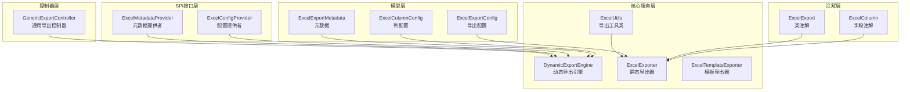

**图表来源**
- [ExcelColumn.java](file://forge/forge-framework/forge-starter-parent/forge-starter-excel/src/main/java/com/mdframe/forge/starter/excel/annotation/ExcelColumn.java#L1-L54)
- [ExcelExport.java](file://forge/forge-framework/forge-starter-parent/forge-starter-excel/src/main/java/com/mdframe/forge/starter/excel/annotation/ExcelExport.java#L1-L29)
- [ExcelExporter.java](file://forge/forge-framework/forge-starter-parent/forge-starter-excel/src/main/java/com/mdframe/forge/starter/excel/core/ExcelExporter.java#L1-L230)
- [DynamicExportEngine.java](file://forge/forge-framework/forge-starter-parent/forge-starter-excel/src/main/java/com/mdframe/forge/starter/excel/core/DynamicExportEngine.java#L1-L509)
- [ExcelTemplateExporter.java](file://forge/forge-framework/forge-starter-parent/forge-starter-excel/src/main/java/com/mdframe/forge/starter/excel/core/ExcelTemplateExporter.java#L1-L103)
- [ExcelUtils.java](file://forge/forge-framework/forge-starter-parent/forge-starter-excel/src/main/java/com/mdframe/forge/starter/excel/util/ExcelUtils.java#L1-L75)

**章节来源**
- [pom.xml](file://forge/forge-framework/forge-starter-parent/forge-starter-excel/pom.xml#L1-L42)
- [org.springframework.boot.autoconfigure.AutoConfiguration.imports](file://forge/forge-framework/forge-starter-parent/forge-starter-excel/src/main/resources/META-INF/spring/org.springframework.boot.autoconfigure.AutoConfiguration.imports#L1-L2)

## 核心组件
本模块包含以下核心组件：

### 注解组件
- **@ExcelColumn**：用于实体字段的导出配置注解，支持列名、宽度、排序、导出开关、日期格式化、数字格式化、字典类型等配置
- **@ExcelExport**：用于类级别的导出配置注解，支持Sheet名称、自动翻译、空值过滤等配置

### 导出引擎
- **ExcelExporter**：静态导出核心类，支持注解驱动的导出配置
- **DynamicExportEngine**：动态导出引擎，通过数据库配置驱动的零代码导出
- **ExcelTemplateExporter**：模板导出器，支持模板填充数据的导出

### 配置模型
- **ExcelExportConfig**：导出配置对象，支持Sheet名称、文件名、自动翻译、空值过滤、数据库配置等
- **ExcelColumnConfig**：列配置对象，支持字段名、列名、宽度、排序、导出开关、格式化等
- **ExcelExportMetadata**：导出元数据对象，支持数据源、查询方法、字典翻译、分页等

**章节来源**
- [ExcelColumn.java](file://forge/forge-framework/forge-starter-parent/forge-starter-excel/src/main/java/com/mdframe/forge/starter/excel/annotation/ExcelColumn.java#L1-L54)
- [ExcelExport.java](file://forge/forge-framework/forge-starter-parent/forge-starter-excel/src/main/java/com/mdframe/forge/starter/excel/annotation/ExcelExport.java#L1-L29)
- [ExcelExporter.java](file://forge/forge-framework/forge-starter-parent/forge-starter-excel/src/main/java/com/mdframe/forge/starter/excel/core/ExcelExporter.java#L1-L230)
- [DynamicExportEngine.java](file://forge/forge-framework/forge-starter-parent/forge-starter-excel/src/main/java/com/mdframe/forge/starter/excel/core/DynamicExportEngine.java#L1-L509)
- [ExcelTemplateExporter.java](file://forge/forge-framework/forge-starter-parent/forge-starter-excel/src/main/java/com/mdframe/forge/starter/excel/core/ExcelTemplateExporter.java#L1-L103)
- [ExcelExportConfig.java](file://forge/forge-framework/forge-starter-parent/forge-starter-excel/src/main/java/com/mdframe/forge/starter/excel/model/ExcelExportConfig.java#L1-L46)
- [ExcelColumnConfig.java](file://forge/forge-framework/forge-starter-parent/forge-starter-excel/src/main/java/com/mdframe/forge/starter/excel/model/ExcelColumnConfig.java#L1-L56)
- [ExcelExportMetadata.java](file://forge/forge-framework/forge-starter-parent/forge-starter-excel/src/main/java/com/mdframe/forge/starter/excel/model/ExcelExportMetadata.java#L1-L72)

## 架构总览
模块采用分层架构，通过SPI接口实现配置的可插拔性，支持多种导出模式：

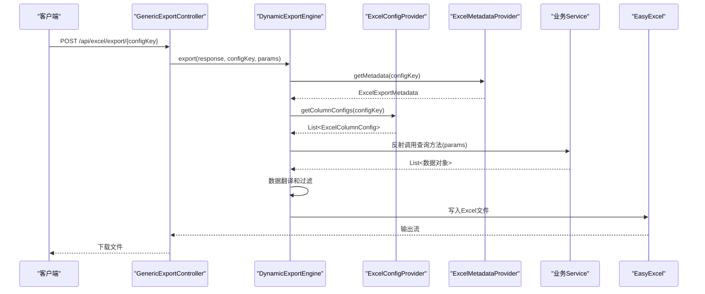

**图表来源**
- [GenericExportController.java](file://forge/forge-framework/forge-starter-parent/forge-starter-excel/src/main/java/com/mdframe/forge/starter/excel/controller/GenericExportController.java#L1-L51)
- [DynamicExportEngine.java](file://forge/forge-framework/forge-starter-parent/forge-starter-excel/src/main/java/com/mdframe/forge/starter/excel/core/DynamicExportEngine.java#L48-L93)
- [ExcelConfigProvider.java](file://forge/forge-framework/forge-starter-parent/forge-starter-excel/src/main/java/com/mdframe/forge/starter/excel/spi/ExcelConfigProvider.java#L1-L21)
- [ExcelMetadataProvider.java](file://forge/forge-framework/forge-starter-parent/forge-starter-excel/src/main/java/com/mdframe/forge/starter/excel/spi/ExcelMetadataProvider.java#L1-L19)

## 详细组件分析

### 注解系统分析

#### @ExcelColumn 注解详解
@ExcelColumn注解提供了丰富的字段级导出配置能力：

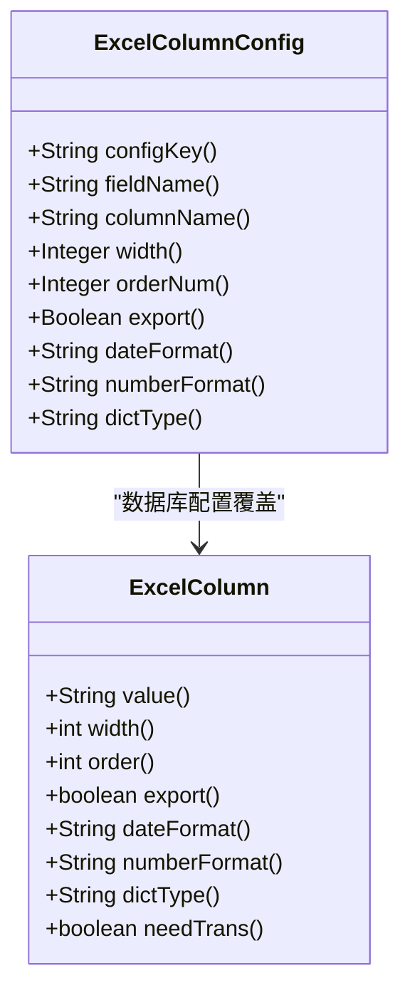

**图表来源**
- [ExcelColumn.java](file://forge/forge-framework/forge-starter-parent/forge-starter-excel/src/main/java/com/mdframe/forge/starter/excel/annotation/ExcelColumn.java#L12-L53)
- [ExcelColumnConfig.java](file://forge/forge-framework/forge-starter-parent/forge-starter-excel/src/main/java/com/mdframe/forge/starter/excel/model/ExcelColumnConfig.java#L9-L55)

#### @ExcelExport 注解详解
@ExcelExport注解提供类级别的导出配置：

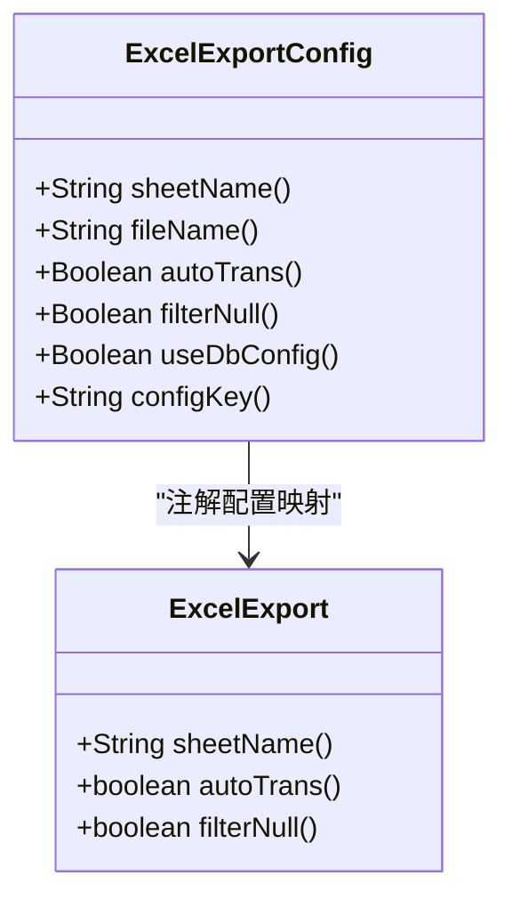

**图表来源**
- [ExcelExport.java](file://forge/forge-framework/forge-starter-parent/forge-starter-excel/src/main/java/com/mdframe/forge/starter/excel/annotation/ExcelExport.java#L12-L28)
- [ExcelExportConfig.java](file://forge/forge-framework/forge-starter-parent/forge-starter-excel/src/main/java/com/mdframe/forge/starter/excel/model/ExcelExportConfig.java#L11-L45)

**章节来源**
- [ExcelColumn.java](file://forge/forge-framework/forge-starter-parent/forge-starter-excel/src/main/java/com/mdframe/forge/starter/excel/annotation/ExcelColumn.java#L1-L54)
- [ExcelExport.java](file://forge/forge-framework/forge-starter-parent/forge-starter-excel/src/main/java/com/mdframe/forge/starter/excel/annotation/ExcelExport.java#L1-L29)

### 动态导出引擎分析

#### 核心流程分析
DynamicExportEngine实现了完整的动态导出流程：

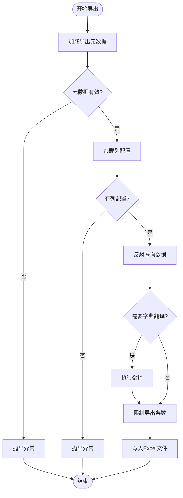

**图表来源**
- [DynamicExportEngine.java](file://forge/forge-framework/forge-starter-parent/forge-starter-excel/src/main/java/com/mdframe/forge/starter/excel/core/DynamicExportEngine.java#L54-L93)

#### 参数构建算法
DynamicExportEngine支持多种参数构建模式：

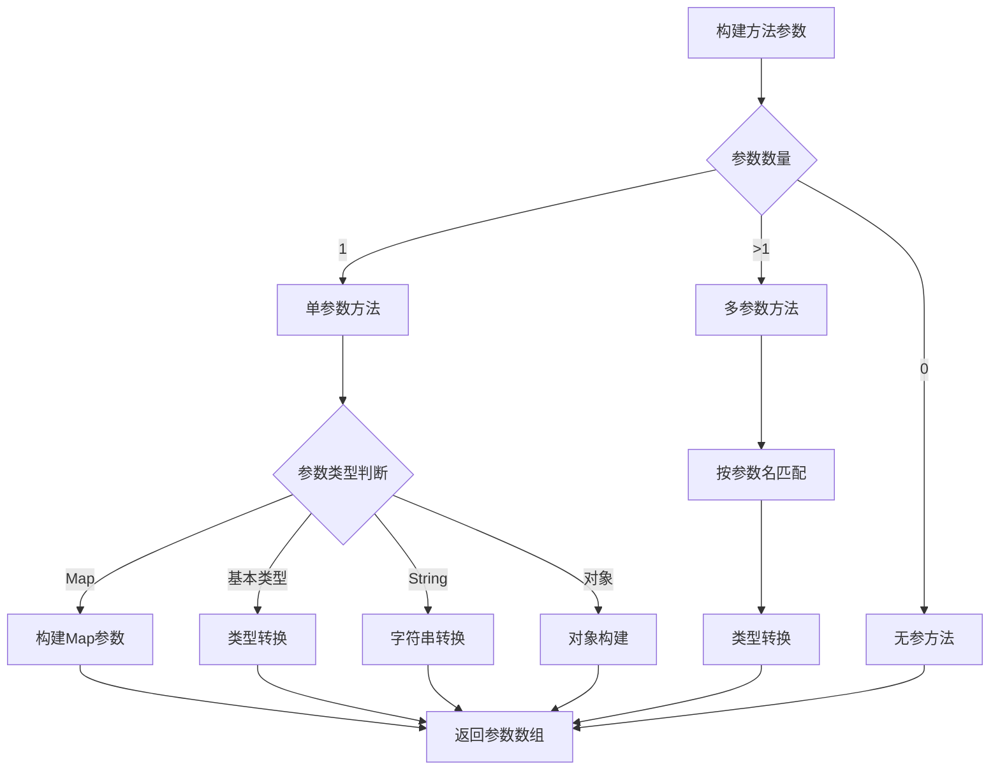

**图表来源**
- [DynamicExportEngine.java](file://forge/forge-framework/forge-starter-parent/forge-starter-excel/src/main/java/com/mdframe/forge/starter/excel/core/DynamicExportEngine.java#L174-L251)

**章节来源**
- [DynamicExportEngine.java](file://forge/forge-framework/forge-starter-parent/forge-starter-excel/src/main/java/com/mdframe/forge/starter/excel/core/DynamicExportEngine.java#L1-L509)

### 静态导出器分析

#### 列元数据管理
ExcelExporter通过ColumnMeta类管理列配置：

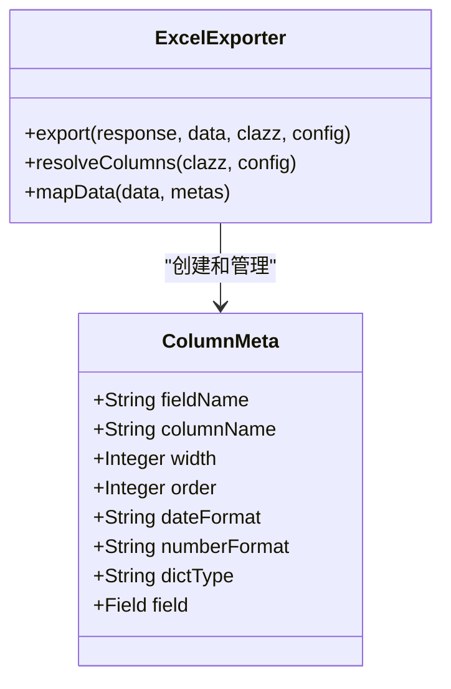

**图表来源**
- [ExcelExporter.java](file://forge/forge-framework/forge-starter-parent/forge-starter-excel/src/main/java/com/mdframe/forge/starter/excel/core/ExcelExporter.java#L202-L228)

**章节来源**
- [ExcelExporter.java](file://forge/forge-framework/forge-starter-parent/forge-starter-excel/src/main/java/com/mdframe/forge/starter/excel/core/ExcelExporter.java#L1-L230)

### 模板导出器分析

#### 模板导出流程
ExcelTemplateExporter支持多种模板导出场景：

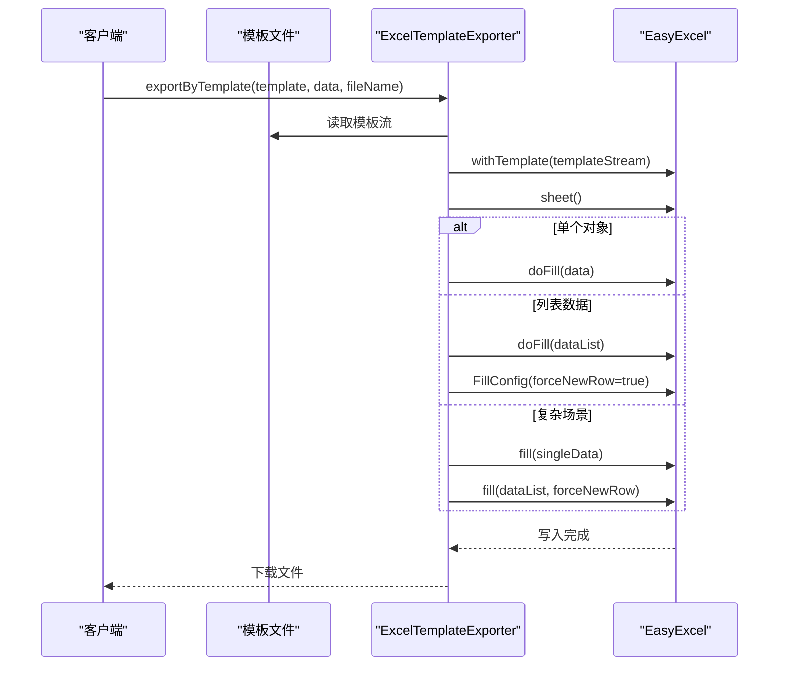

**图表来源**
- [ExcelTemplateExporter.java](file://forge/forge-framework/forge-starter-parent/forge-starter-excel/src/main/java/com/mdframe/forge/starter/excel/core/ExcelTemplateExporter.java#L30-L91)

**章节来源**
- [ExcelTemplateExporter.java](file://forge/forge-framework/forge-starter-parent/forge-starter-excel/src/main/java/com/mdframe/forge/starter/excel/core/ExcelTemplateExporter.java#L1-L103)

### 通用导出控制器分析

#### 接口设计
GenericExportController提供统一的导出接口：

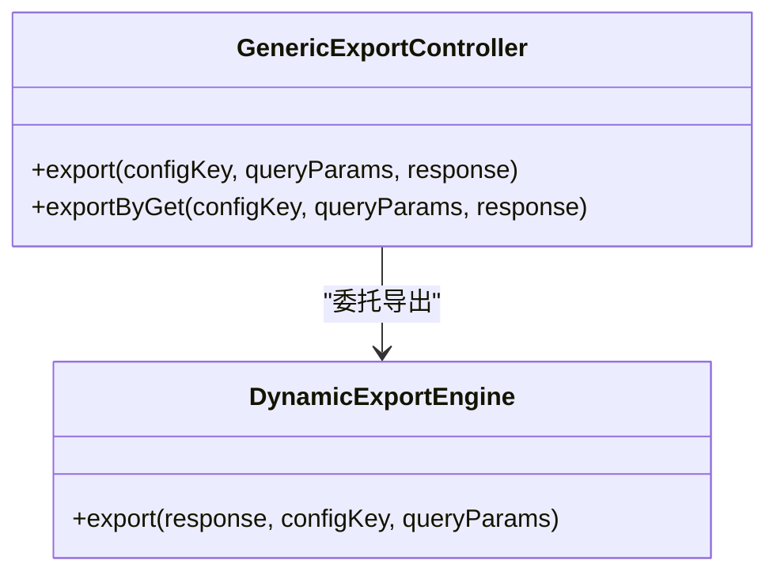

**图表来源**
- [GenericExportController.java](file://forge/forge-framework/forge-starter-parent/forge-starter-excel/src/main/java/com/mdframe/forge/starter/excel/controller/GenericExportController.java#L23-L49)

**章节来源**
- [GenericExportController.java](file://forge/forge-framework/forge-starter-parent/forge-starter-excel/src/main/java/com/mdframe/forge/starter/excel/controller/GenericExportController.java#L1-L51)

## 依赖关系分析

### 外部依赖关系
模块对外部组件的依赖关系如下：

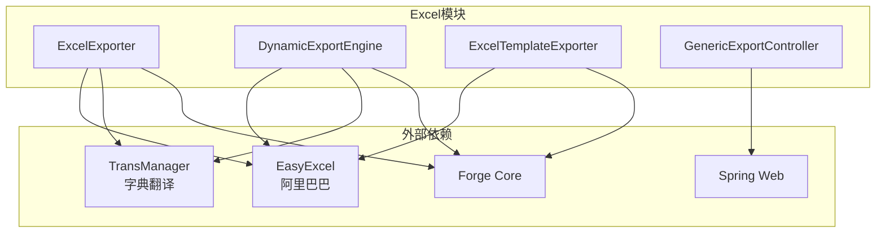

**图表来源**
- [pom.xml](file://forge/forge-framework/forge-starter-parent/forge-starter-excel/pom.xml#L15-L39)

### 内部组件依赖
模块内部组件之间的依赖关系：

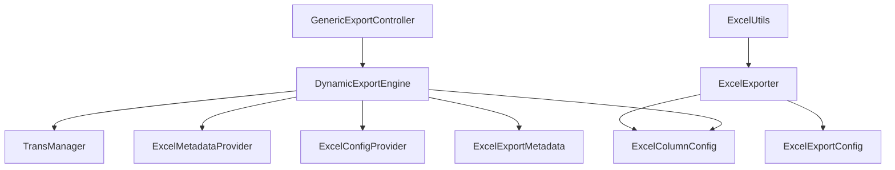

**图表来源**
- [GenericExportController.java](file://forge/forge-framework/forge-starter-parent/forge-starter-excel/src/main/java/com/mdframe/forge/starter/excel/controller/GenericExportController.java#L1-L51)
- [ExcelExporter.java](file://forge/forge-framework/forge-starter-parent/forge-starter-excel/src/main/java/com/mdframe/forge/starter/excel/core/ExcelExporter.java#L1-L230)
- [DynamicExportEngine.java](file://forge/forge-framework/forge-starter-parent/forge-starter-excel/src/main/java/com/mdframe/forge/starter/excel/core/DynamicExportEngine.java#L1-L509)

**章节来源**
- [pom.xml](file://forge/forge-framework/forge-starter-parent/forge-starter-excel/pom.xml#L1-L42)

## 性能考虑

### 大数据量导出优化策略
模块提供了多层次的性能优化机制：

#### 内存管理优化
- **分页查询支持**：通过ExcelExportMetadata.pageable参数支持分页查询，避免一次性加载大量数据
- **数据截断机制**：通过maxRows参数限制最大导出条数，默认防止内存溢出
- **流式写入**：使用EasyExcel的流式写入机制，减少内存占用

#### 导出策略优化
- **延迟加载**：动态导出引擎按需加载配置和数据
- **缓存机制**：建议业务层实现配置提供者的缓存逻辑
- **批量处理**：模板导出支持批量数据填充

#### 错误处理机制
- **异常捕获**：所有导出操作都包含完整的异常捕获和日志记录
- **降级策略**：当字典翻译失败时，系统会降级处理不影响导出
- **超时控制**：建议在业务层添加查询超时控制

### 性能监控建议
- 监控导出耗时和内存使用情况
- 分析大数据量导出的瓶颈点
- 根据实际业务调整maxRows参数

## 故障排除指南

### 常见问题及解决方案

#### 导出配置问题
- **问题**：导出配置不存在或已禁用
- **原因**：ExcelExportMetadata.status=0或配置键错误
- **解决**：检查配置表状态和configKey是否正确

#### 数据查询问题
- **问题**：查询方法找不到或参数不匹配
- **原因**：Service Bean名称或方法名配置错误
- **解决**：确认Service Bean存在且方法签名匹配

#### 字段映射问题
- **问题**：字段值无法获取或类型转换失败
- **原因**：字段名不匹配或类型不兼容
- **解决**：检查实体类字段名和类型定义

#### 模板导出问题
- **问题**：模板填充失败或格式异常
- **原因**：模板变量名与数据不匹配
- **解决**：验证模板中的变量名和数据结构

**章节来源**
- [DynamicExportEngine.java](file://forge/forge-framework/forge-starter-parent/forge-starter-excel/src/main/java/com/mdframe/forge/starter/excel/core/DynamicExportEngine.java#L89-L92)
- [ExcelTemplateExporter.java](file://forge/forge-framework/forge-starter-parent/forge-starter-excel/src/main/java/com/mdframe/forge/starter/excel/core/ExcelTemplateExporter.java#L38-L41)

## 结论
Forge Excel处理模块提供了完整的Excel导入导出解决方案，具有以下特点：

### 核心优势
- **零代码开发**：通过数据库配置即可实现导出功能
- **极致灵活**：支持动态配置列名、顺序、宽度等参数
- **统一接口**：提供标准化的导出接口和配置规范
- **自动翻译**：集成字典翻译功能，支持多语言导出

### 技术特色
- **多模式支持**：静态导出、模板导出、动态导出三种模式
- **高性能设计**：流式写入、内存优化、分页查询
- **完善错误处理**：全面的异常捕获和降级机制
- **可扩展架构**：通过SPI接口支持自定义扩展

### 应用场景
该模块适用于各种需要Excel导出的业务场景，特别是需要快速实现导出功能且希望保持业务逻辑简洁的项目。通过合理的配置和优化，可以满足大多数企业级应用的导出需求。

## 附录

### 使用示例

#### 静态导出使用示例
```java
// 基础静态导出
ExcelUtils.export(response, dataList, UserVO.class, "用户列表.xlsx");

// 自定义配置导出
ExcelExportConfig config = ExcelExportConfig.builder()
    .sheetName("用户数据")
    .autoTrans(true)
    .filterNull(false)
    .build();
ExcelUtils.export(response, dataList, UserVO.class, config);
```

#### 动态导出使用示例
```java
// 通用导出接口调用
@PostMapping("/api/excel/export/{configKey}")
public void export(@PathVariable String configKey,
                  @RequestBody Map<String, Object> queryParams,
                  HttpServletResponse response) {
    dynamicExportEngine.export(response, configKey, queryParams);
}
```

#### 模板导出使用示例
```java
// 单对象模板导出
excelTemplateExporter.exportByTemplate(response, template, data, "报告.xlsx");

// 列表模板导出
excelTemplateExporter.exportByTemplate(response, template, dataList, "列表.xlsx");
```

### 最佳实践
- 合理设置maxRows参数，避免大数据量导出导致内存问题
- 使用ExcelExportConfig.useDbConfig=true启用数据库配置
- 在Service层实现查询方法时注意性能优化
- 建议实现ExcelConfigProvider和ExcelMetadataProvider的缓存机制
- 对于复杂查询场景，建议使用GET方式传递简单参数，POST方式传递复杂参数