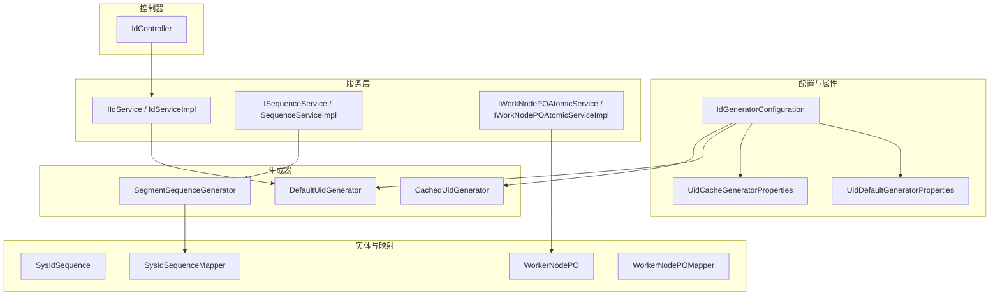
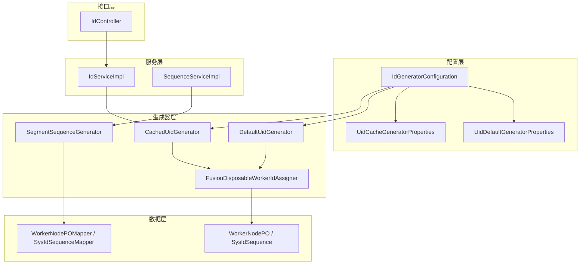
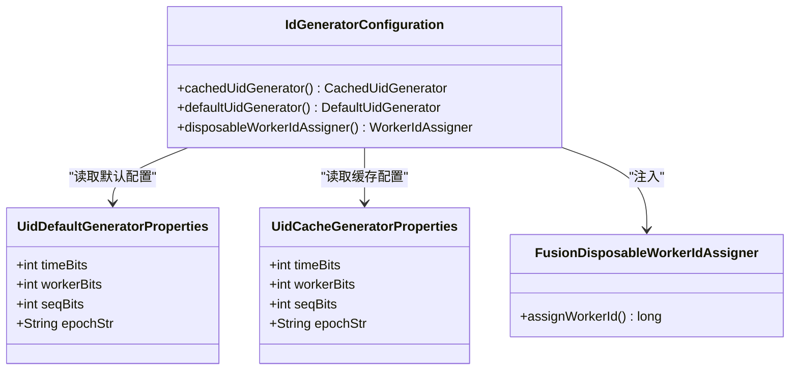
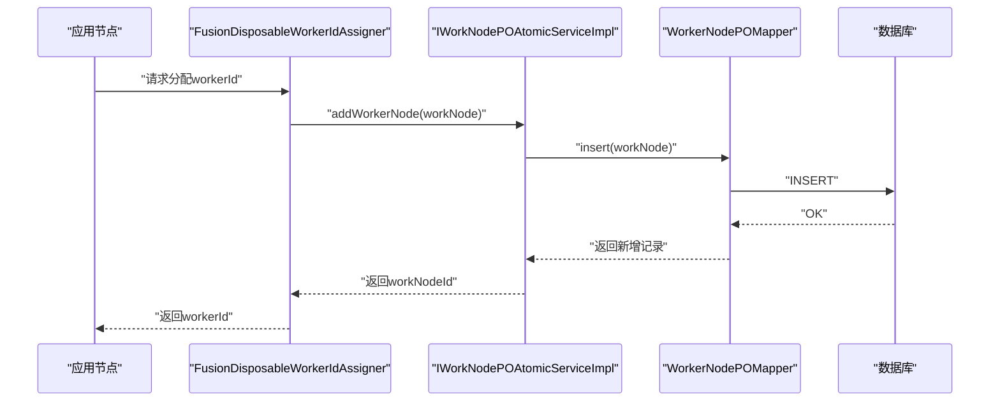
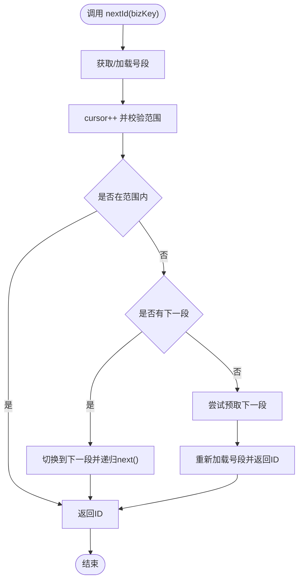
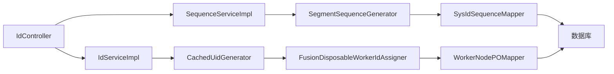

# ID生成模块

<cite>
**本文引用的文件**
- [IdGeneratorConfiguration.java](file://forge/forge-framework/forge-starter-parent/forge-starter-id/src/main/java/com/mdframe/forge/starter/id/config/IdGeneratorConfiguration.java)
- [UidDefaultGeneratorProperties.java](file://forge/forge-framework/forge-starter-parent/forge-starter-id/src/main/java/com/mdframe/forge/starter/id/properties/UidDefaultGeneratorProperties.java)
- [UidCacheGeneratorProperties.java](file://forge/forge-framework/forge-starter-parent/forge-starter-id/src/main/java/com/mdframe/forge/starter/id/properties/UidCacheGeneratorProperties.java)
- [FusionDisposableWorkerIdAssigner.java](file://forge/forge-framework/forge-starter-parent/forge-starter-id/src/main/java/com/mdframe/forge/starter/id/generator/FusionDisposableWorkerIdAssigner.java)
- [IdServiceImpl.java](file://forge/forge-framework/forge-starter-parent/forge-starter-id/src/main/java/com/mdframe/forge/starter/id/service/impl/IdServiceImpl.java)
- [IIdService.java](file://forge/forge-framework/forge-starter-parent/forge-starter-id/src/main/java/com/mdframe/forge/starter/id/service/IIdService.java)
- [SequenceServiceImpl.java](file://forge/forge-framework/forge-starter-parent/forge-starter-id/src/main/java/com/mdframe/forge/starter/id/service/impl/SequenceServiceImpl.java)
- [ISequenceService.java](file://forge/forge-framework/forge-starter-parent/forge-starter-id/src/main/java/com/mdframe/forge/starter/id/service/ISequenceService.java)
- [SegmentSequenceGenerator.java](file://forge/forge-framework/forge-starter-parent/forge-starter-id/src/main/java/com/mdframe/forge/starter/id/generator/SegmentSequenceGenerator.java)
- [SysIdSequence.java](file://forge/forge-framework/forge-starter-parent/forge-starter-id/src/main/java/com/mdframe/forge/starter/id/entity/SysIdSequence.java)
- [SysIdSequenceMapper.java](file://forge/forge-framework/forge-starter-parent/forge-starter-id/src/main/java/com/mdframe/forge/starter/id/mapper/SysIdSequenceMapper.java)
- [WorkerNodePO.java](file://forge/forge-framework/forge-starter-parent/forge-starter-id/src/main/java/com/mdframe/forge/starter/id/entity/WorkerNodePO.java)
- [WorkerNodePOMapper.java](file://forge/forge-framework/forge-starter-parent/forge-starter-id/src/main/java/com/mdframe/forge/starter/id/mapper/WorkerNodePOMapper.java)
- [IWorkNodePOAtomicService.java](file://forge/forge-framework/forge-starter-parent/forge-starter-id/src/main/java/com/mdframe/forge/starter/id/service/IWorkNodePOAtomicService.java)
- [IWorkNodePOAtomicServiceImpl.java](file://forge/forge-framework/forge-starter-parent/forge-starter-id/src/main/java/com/mdframe/forge/starter/id/service/impl/IWorkNodePOAtomicServiceImpl.java)
- [IdController.java](file://forge/forge-framework/forge-starter-parent/forge-starter-id/src/main/java/com/mdframe/forge/starter/id/controller/IdController.java)
- [spring-configuration-metadata.json](file://forge/forge-framework/forge-starter-parent/forge-starter-id/target/classes/META-INF/spring-configuration-metadata.json)
</cite>

## 目录
1. [简介](#简介)
2. [项目结构](#项目结构)
3. [核心组件](#核心组件)
4. [架构总览](#架构总览)
5. [详细组件分析](#详细组件分析)
6. [依赖关系分析](#依赖关系分析)
7. [性能考量](#性能考量)
8. [故障排查指南](#故障排查指南)
9. [结论](#结论)
10. [附录](#附录)

## 简介
本文件为Forge ID生成模块的技术文档，聚焦以下目标：
- 解析雪花算法在本模块中的实现与应用，包括时间戳、工作节点、序列号位宽与分片策略。
- 说明分布式工作节点分配机制与持久化落库策略，以及序列号生成算法与号段缓存模型。
- 给出ID生成器的配置参数、性能特性与扩展性设计。
- 提供ID服务的API接口文档、使用示例与性能优化建议。
- 总结分布式环境下ID冲突避免策略与故障恢复机制。

## 项目结构
ID模块位于forge-starter-id子工程内，采用按功能域划分的包结构，主要包含：
- 配置与属性：生成器配置、参数属性类
- 生成器：默认与缓存型雪花生成器、号段生成器
- 实体与映射：系统序列配置、工作节点信息
- 服务层：ID服务、序列服务、工作节点原子服务
- 控制器：对外暴露的ID服务REST接口
- 自动装配：基于Spring的条件装配与Bean注册

图表来源
- [IdGeneratorConfiguration.java](file://forge/forge-framework/forge-starter-parent/forge-starter-id/src/main/java/com/mdframe/forge/starter/id/config/IdGeneratorConfiguration.java#L1-L71)
- [UidDefaultGeneratorProperties.java](file://forge/forge-framework/forge-starter-parent/forge-starter-id/src/main/java/com/mdframe/forge/starter/id/properties/UidDefaultGeneratorProperties.java#L1-L29)
- [UidCacheGeneratorProperties.java](file://forge/forge-framework/forge-starter-parent/forge-starter-id/src/main/java/com/mdframe/forge/starter/id/properties/UidCacheGeneratorProperties.java#L1-L29)
- [IdServiceImpl.java](file://forge/forge-framework/forge-starter-parent/forge-starter-id/src/main/java/com/mdframe/forge/starter/id/service/impl/IdServiceImpl.java#L1-L27)
- [SequenceServiceImpl.java](file://forge/forge-framework/forge-starter-parent/forge-starter-id/src/main/java/com/mdframe/forge/starter/id/service/impl/SequenceServiceImpl.java#L1-L112)
- [SegmentSequenceGenerator.java](file://forge/forge-framework/forge-starter-parent/forge-starter-id/src/main/java/com/mdframe/forge/starter/id/generator/SegmentSequenceGenerator.java#L1-L199)
- [SysIdSequence.java](file://forge/forge-framework/forge-starter-parent/forge-starter-id/src/main/java/com/mdframe/forge/starter/id/entity/SysIdSequence.java#L1-L44)
- [SysIdSequenceMapper.java](file://forge/forge-framework/forge-starter-parent/forge-starter-id/src/main/java/com/mdframe/forge/starter/id/mapper/SysIdSequenceMapper.java)
- [WorkerNodePO.java](file://forge/forge-framework/forge-starter-parent/forge-starter-id/src/main/java/com/mdframe/forge/starter/id/entity/WorkerNodePO.java)
- [WorkerNodePOMapper.java](file://forge/forge-framework/forge-starter-parent/forge-starter-id/src/main/java/com/mdframe/forge/starter/id/mapper/WorkerNodePOMapper.java)
- [IWorkNodePOAtomicService.java](file://forge/forge-framework/forge-starter-parent/forge-starter-id/src/main/java/com/mdframe/forge/starter/id/service/IWorkNodePOAtomicService.java)
- [IWorkNodePOAtomicServiceImpl.java](file://forge/forge-framework/forge-starter-parent/forge-starter-id/src/main/java/com/mdframe/forge/starter/id/service/impl/IWorkNodePOAtomicServiceImpl.java)
- [IdController.java](file://forge/forge-framework/forge-starter-parent/forge-starter-id/src/main/java/com/mdframe/forge/starter/id/controller/IdController.java#L1-L25)

章节来源
- [IdGeneratorConfiguration.java](file://forge/forge-framework/forge-starter-parent/forge-starter-id/src/main/java/com/mdframe/forge/starter/id/config/IdGeneratorConfiguration.java#L1-L71)
- [UidDefaultGeneratorProperties.java](file://forge/forge-framework/forge-starter-parent/forge-starter-id/src/main/java/com/mdframe/forge/starter/id/properties/UidDefaultGeneratorProperties.java#L1-L29)
- [UidCacheGeneratorProperties.java](file://forge/forge-framework/forge-starter-parent/forge-starter-id/src/main/java/com/mdframe/forge/starter/id/properties/UidCacheGeneratorProperties.java#L1-L29)

## 核心组件
- 生成器配置与Bean注册：提供默认与缓存型两种雪花生成器，注入工作节点分配器与位宽参数。
- 工作节点分配器：基于数据库持久化的工作节点分配，确保分布式唯一性。
- 雪花生成器：默认与缓存型，分别面向低延迟与高吞吐场景。
- 号段生成器：基于数据库号段分配，内存中高速生成ID，支持批量与格式化输出。
- 服务层：统一对外提供nextId与格式化序列号能力。
- 控制器：提供REST接口返回单个ID。

章节来源
- [IdGeneratorConfiguration.java](file://forge/forge-framework/forge-starter-parent/forge-starter-id/src/main/java/com/mdframe/forge/starter/id/config/IdGeneratorConfiguration.java#L15-L71)
- [FusionDisposableWorkerIdAssigner.java](file://forge/forge-framework/forge-starter-parent/forge-starter-id/src/main/java/com/mdframe/forge/starter/id/generator/FusionDisposableWorkerIdAssigner.java#L1-L44)
- [IdServiceImpl.java](file://forge/forge-framework/forge-starter-parent/forge-starter-id/src/main/java/com/mdframe/forge/starter/id/service/impl/IdServiceImpl.java#L1-L27)
- [SequenceServiceImpl.java](file://forge/forge-framework/forge-starter-parent/forge-starter-id/src/main/java/com/mdframe/forge/starter/id/service/impl/SequenceServiceImpl.java#L1-L112)
- [SegmentSequenceGenerator.java](file://forge/forge-framework/forge-starter-parent/forge-starter-id/src/main/java/com/mdframe/forge/starter/id/generator/SegmentSequenceGenerator.java#L1-L199)
- [IdController.java](file://forge/forge-framework/forge-starter-parent/forge-starter-id/src/main/java/com/mdframe/forge/starter/id/controller/IdController.java#L1-L25)

## 架构总览
ID模块整体由“配置装配—生成器—服务—控制器”四层构成，结合数据库持久化的工作节点与号段分配，形成高可用、可扩展的分布式ID生成体系。

图表来源
- [IdGeneratorConfiguration.java](file://forge/forge-framework/forge-starter-parent/forge-starter-id/src/main/java/com/mdframe/forge/starter/id/config/IdGeneratorConfiguration.java#L1-L71)
- [FusionDisposableWorkerIdAssigner.java](file://forge/forge-framework/forge-starter-parent/forge-starter-id/src/main/java/com/mdframe/forge/starter/id/generator/FusionDisposableWorkerIdAssigner.java#L1-L44)
- [IdServiceImpl.java](file://forge/forge-framework/forge-starter-parent/forge-starter-id/src/main/java/com/mdframe/forge/starter/id/service/impl/IdServiceImpl.java#L1-L27)
- [SequenceServiceImpl.java](file://forge/forge-framework/forge-starter-parent/forge-starter-id/src/main/java/com/mdframe/forge/starter/id/service/impl/SequenceServiceImpl.java#L1-L112)
- [SegmentSequenceGenerator.java](file://forge/forge-framework/forge-starter-parent/forge-starter-id/src/main/java/com/mdframe/forge/starter/id/generator/SegmentSequenceGenerator.java#L1-L199)
- [WorkerNodePO.java](file://forge/forge-framework/forge-starter-parent/forge-starter-id/src/main/java/com/mdframe/forge/starter/id/entity/WorkerNodePO.java)
- [SysIdSequence.java](file://forge/forge-framework/forge-starter-parent/forge-starter-id/src/main/java/com/mdframe/forge/starter/id/entity/SysIdSequence.java#L1-L44)
- [IdController.java](file://forge/forge-framework/forge-starter-parent/forge-starter-id/src/main/java/com/mdframe/forge/starter/id/controller/IdController.java#L1-L25)

## 详细组件分析

### 雪花算法与分布式ID生成
- 时间戳位宽：默认与缓存型分别配置不同的timeBits，决定可承载的时间跨度与精度。
- 工作节点位宽：通过WorkerIdAssigner分配并持久化至数据库，确保全局唯一。
- 序列号位宽：默认9位，缓存型6位；序列号在同一毫秒内自增，溢出则等待下一毫秒。
- 缓存型生成器：内置环形缓冲区与预热策略，提升高并发下的吞吐与延迟表现。

图表来源
- [IdGeneratorConfiguration.java](file://forge/forge-framework/forge-starter-parent/forge-starter-id/src/main/java/com/mdframe/forge/starter/id/config/IdGeneratorConfiguration.java#L1-L71)
- [UidDefaultGeneratorProperties.java](file://forge/forge-framework/forge-starter-parent/forge-starter-id/src/main/java/com/mdframe/forge/starter/id/properties/UidDefaultGeneratorProperties.java#L1-L29)
- [UidCacheGeneratorProperties.java](file://forge/forge-framework/forge-starter-parent/forge-starter-id/src/main/java/com/mdframe/forge/starter/id/properties/UidCacheGeneratorProperties.java#L1-L29)
- [FusionDisposableWorkerIdAssigner.java](file://forge/forge-framework/forge-starter-parent/forge-starter-id/src/main/java/com/mdframe/forge/starter/id/generator/FusionDisposableWorkerIdAssigner.java#L1-L44)

章节来源
- [IdGeneratorConfiguration.java](file://forge/forge-framework/forge-starter-parent/forge-starter-id/src/main/java/com/mdframe/forge/starter/id/config/IdGeneratorConfiguration.java#L35-L67)
- [UidDefaultGeneratorProperties.java](file://forge/forge-framework/forge-starter-parent/forge-starter-id/src/main/java/com/mdframe/forge/starter/id/properties/UidDefaultGeneratorProperties.java#L1-L29)
- [UidCacheGeneratorProperties.java](file://forge/forge-framework/forge-starter-parent/forge-starter-id/src/main/java/com/mdframe/forge/starter/id/properties/UidCacheGeneratorProperties.java#L1-L29)

### 工作节点分配策略
- 分配流程：节点启动时构建WorkerNodePO并写入数据库，返回workNodeId作为workerId。
- 容器识别：优先根据主机名与端口判断容器运行环境，便于在容器化部署中区分实例。
- 生命周期：分配后即刻投入使用，节点退出后可通过数据库清理或复用策略管理。

图表来源
- [FusionDisposableWorkerIdAssigner.java](file://forge/forge-framework/forge-starter-parent/forge-starter-id/src/main/java/com/mdframe/forge/starter/id/generator/FusionDisposableWorkerIdAssigner.java#L38-L44)
- [IWorkNodePOAtomicServiceImpl.java](file://forge/forge-framework/forge-starter-parent/forge-starter-id/src/main/java/com/mdframe/forge/starter/id/service/impl/IWorkNodePOAtomicServiceImpl.java)
- [WorkerNodePOMapper.java](file://forge/forge-framework/forge-starter-parent/forge-starter-id/src/main/java/com/mdframe/forge/starter/id/mapper/WorkerNodePOMapper.java)
- [WorkerNodePO.java](file://forge/forge-framework/forge-starter-parent/forge-starter-id/src/main/java/com/mdframe/forge/starter/id/entity/WorkerNodePO.java)

章节来源
- [FusionDisposableWorkerIdAssigner.java](file://forge/forge-framework/forge-starter-parent/forge-starter-id/src/main/java/com/mdframe/forge/starter/id/generator/FusionDisposableWorkerIdAssigner.java#L17-L44)
- [IWorkNodePOAtomicServiceImpl.java](file://forge/forge-framework/forge-starter-parent/forge-starter-id/src/main/java/com/mdframe/forge/starter/id/service/impl/IWorkNodePOAtomicServiceImpl.java)
- [WorkerNodePO.java](file://forge/forge-framework/forge-starter-parent/forge-starter-id/src/main/java/com/mdframe/forge/starter/id/entity/WorkerNodePO.java)

### 序列号生成算法与号段缓存
- 号段模型：每个bizKey维护一个Segment，包含起止范围与游标指针，支持下一段无缝切换。
- 预取机制：当剩余量低于阈值时异步预取下一段，降低数据库访问频率。
- 乐观锁分配：使用版本字段防止多节点同时分配导致的冲突。
- 批量与格式化：支持批量ID生成与带前缀、日期、补零等格式化输出。

图表来源
- [SegmentSequenceGenerator.java](file://forge/forge-framework/forge-starter-parent/forge-starter-id/src/main/java/com/mdframe/forge/starter/id/generator/SegmentSequenceGenerator.java#L44-L124)
- [SequenceServiceImpl.java](file://forge/forge-framework/forge-starter-parent/forge-starter-id/src/main/java/com/mdframe/forge/starter/id/service/impl/SequenceServiceImpl.java#L27-L64)

章节来源
- [SegmentSequenceGenerator.java](file://forge/forge-framework/forge-starter-parent/forge-starter-id/src/main/java/com/mdframe/forge/starter/id/generator/SegmentSequenceGenerator.java#L1-L199)
- [SequenceServiceImpl.java](file://forge/forge-framework/forge-starter-parent/forge-starter-id/src/main/java/com/mdframe/forge/starter/id/service/impl/SequenceServiceImpl.java#L1-L112)
- [SysIdSequence.java](file://forge/forge-framework/forge-starter-parent/forge-starter-id/src/main/java/com/mdframe/forge/starter/id/entity/SysIdSequence.java#L1-L44)

### API接口文档
- 接口路径：GET /id/next
- 功能：返回下一个全局唯一ID
- 返回：封装在统一响应体中的数值
- 条件启用：受配置项forge.id.enable-api控制，默认开启

章节来源
- [IdController.java](file://forge/forge-framework/forge-starter-parent/forge-starter-id/src/main/java/com/mdframe/forge/starter/id/controller/IdController.java#L1-L25)

### 使用示例
- 服务调用：通过IIdService注入并调用nextId()获取ID
- 序列号：通过ISequenceService的nextId或nextFormatted获取业务序列号
- 批量序列：使用nextBatch或nextFormattedBatch批量获取

章节来源
- [IIdService.java](file://forge/forge-framework/forge-starter-parent/forge-starter-id/src/main/java/com/mdframe/forge/starter/id/service/IIdService.java#L1-L7)
- [IdServiceImpl.java](file://forge/forge-framework/forge-starter-parent/forge-starter-id/src/main/java/com/mdframe/forge/starter/id/service/impl/IdServiceImpl.java#L1-L27)
- [ISequenceService.java](file://forge/forge-framework/forge-starter-parent/forge-starter-id/src/main/java/com/mdframe/forge/starter/id/service/ISequenceService.java)
- [SequenceServiceImpl.java](file://forge/forge-framework/forge-starter-parent/forge-starter-id/src/main/java/com/mdframe/forge/starter/id/service/impl/SequenceServiceImpl.java#L1-L112)

## 依赖关系分析
- 组件耦合：生成器依赖工作节点分配器；服务层依赖具体生成器；控制器依赖服务层。
- 数据依赖：号段生成器依赖SysIdSequence表与乐观锁；工作节点分配器依赖WorkerNode表。
- 外部依赖：基于xfvape的UID库实现雪花算法，Spring Boot自动装配与MyBatis Plus数据访问。

图表来源
- [IdController.java](file://forge/forge-framework/forge-starter-parent/forge-starter-id/src/main/java/com/mdframe/forge/starter/id/controller/IdController.java#L1-L25)
- [IdServiceImpl.java](file://forge/forge-framework/forge-starter-parent/forge-starter-id/src/main/java/com/mdframe/forge/starter/id/service/impl/IdServiceImpl.java#L1-L27)
- [SequenceServiceImpl.java](file://forge/forge-framework/forge-starter-parent/forge-starter-id/src/main/java/com/mdframe/forge/starter/id/service/impl/SequenceServiceImpl.java#L1-L112)
- [SegmentSequenceGenerator.java](file://forge/forge-framework/forge-starter-parent/forge-starter-id/src/main/java/com/mdframe/forge/starter/id/generator/SegmentSequenceGenerator.java#L1-L199)
- [FusionDisposableWorkerIdAssigner.java](file://forge/forge-framework/forge-starter-parent/forge-starter-id/src/main/java/com/mdframe/forge/starter/id/generator/FusionDisposableWorkerIdAssigner.java#L1-L44)

## 性能考量
- 位宽配置：timeBits与workerBits决定容量与并发度；seqBits影响单毫秒内并发上限。
- 缓存型生成器：boostPower与paddingFactor、scheduleInterval用于平衡延迟与吞吐。
- 号段策略：合理设置步长与预取阈值，减少数据库热点与锁竞争。
- 批量接口：通过批量获取降低网络与序列号服务调用开销。
- 容器化部署：利用容器识别与工作节点持久化，避免重启后workerId冲突。

章节来源
- [IdGeneratorConfiguration.java](file://forge/forge-framework/forge-starter-parent/forge-starter-id/src/main/java/com/mdframe/forge/starter/id/config/IdGeneratorConfiguration.java#L35-L67)
- [UidDefaultGeneratorProperties.java](file://forge/forge-framework/forge-starter-parent/forge-starter-id/src/main/java/com/mdframe/forge/starter/id/properties/UidDefaultGeneratorProperties.java#L1-L29)
- [UidCacheGeneratorProperties.java](file://forge/forge-framework/forge-starter-parent/forge-starter-id/src/main/java/com/mdframe/forge/starter/id/properties/UidCacheGeneratorProperties.java#L1-L29)
- [SegmentSequenceGenerator.java](file://forge/forge-framework/forge-starter-parent/forge-starter-id/src/main/java/com/mdframe/forge/starter/id/generator/SegmentSequenceGenerator.java#L34-L40)

## 故障排查指南
- 工作节点冲突：检查WorkerNode表是否存在重复或异常记录，确认容器环境变量是否正确。
- 号段分配失败：关注乐观锁版本冲突日志，必要时重试或调整步长与并发。
- ID耗尽：检查Segment剩余量与预取阈值，适当增大步长或提高预取策略。
- 接口不可用：确认forge.id.enable-api开关状态与控制器条件注解生效。

章节来源
- [FusionDisposableWorkerIdAssigner.java](file://forge/forge-framework/forge-starter-parent/forge-starter-id/src/main/java/com/mdframe/forge/starter/id/generator/FusionDisposableWorkerIdAssigner.java#L38-L44)
- [SegmentSequenceGenerator.java](file://forge/forge-framework/forge-starter-parent/forge-starter-id/src/main/java/com/mdframe/forge/starter/id/generator/SegmentSequenceGenerator.java#L104-L114)
- [IdController.java](file://forge/forge-framework/forge-starter-parent/forge-starter-id/src/main/java/com/mdframe/forge/starter/id/controller/IdController.java#L12-L13)

## 结论
本模块以xfvape UID库为基础，结合数据库持久化的工作节点与号段分配，提供了高可用、高性能的分布式ID生成方案。默认与缓存型雪花生成器满足不同性能需求，号段模型与格式化序列服务覆盖常见业务场景。通过合理的位宽配置与预取策略，可在保证唯一性的前提下获得优异的吞吐与延迟表现。

## 附录

### 配置参数与默认值
- uid.default.*：默认雪花生成器的位宽与纪元
- uid.cache.*：缓存型雪花生成器的位宽与纪元
- spring-configuration-metadata.json中定义了上述键名与默认值

章节来源
- [UidDefaultGeneratorProperties.java](file://forge/forge-framework/forge-starter-parent/forge-starter-id/src/main/java/com/mdframe/forge/starter/id/properties/UidDefaultGeneratorProperties.java#L1-L29)
- [UidCacheGeneratorProperties.java](file://forge/forge-framework/forge-starter-parent/forge-starter-id/src/main/java/com/mdframe/forge/starter/id/properties/UidCacheGeneratorProperties.java#L1-L29)
- [spring-configuration-metadata.json](file://forge/forge-framework/forge-starter-parent/forge-starter-id/target/classes/META-INF/spring-configuration-metadata.json#L1-L65)