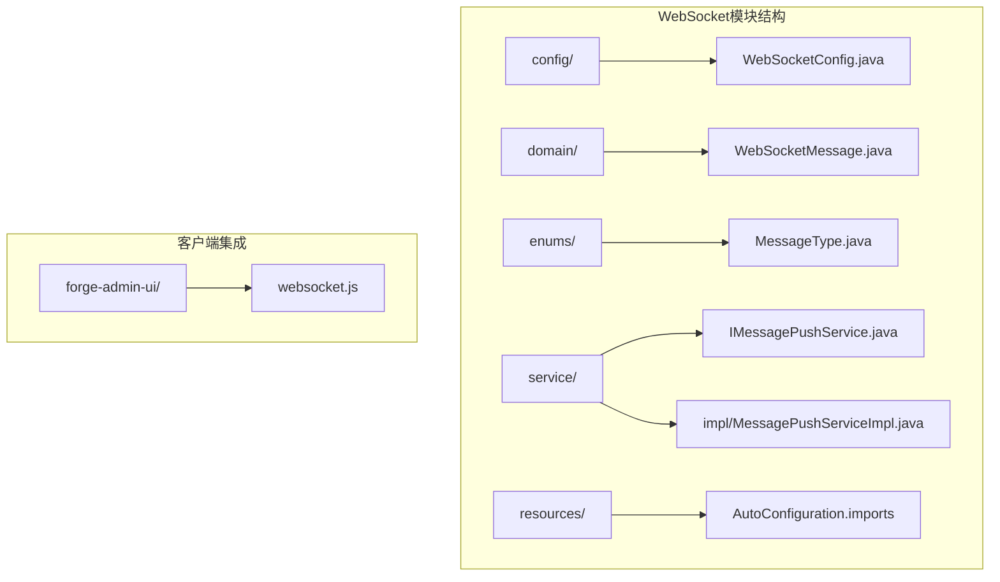
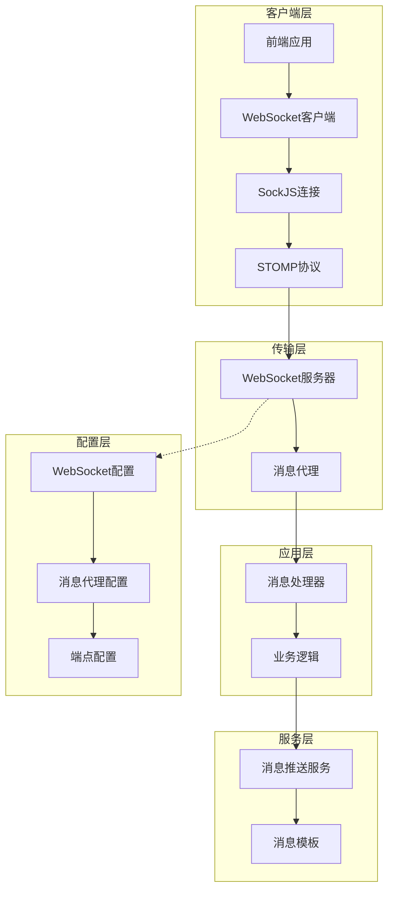
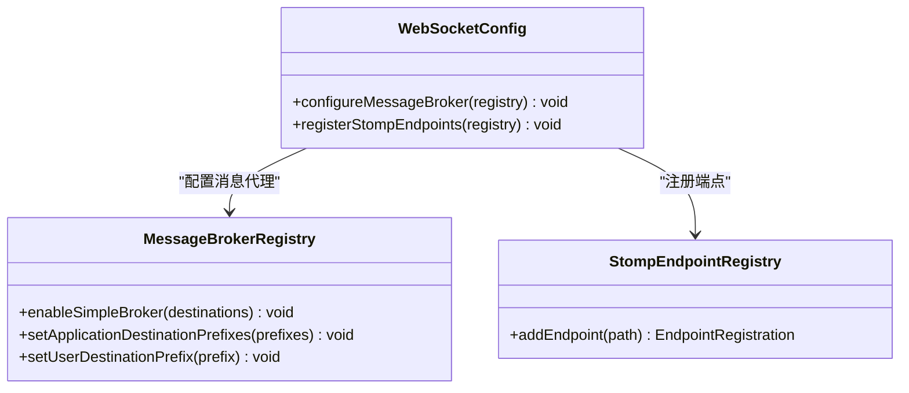
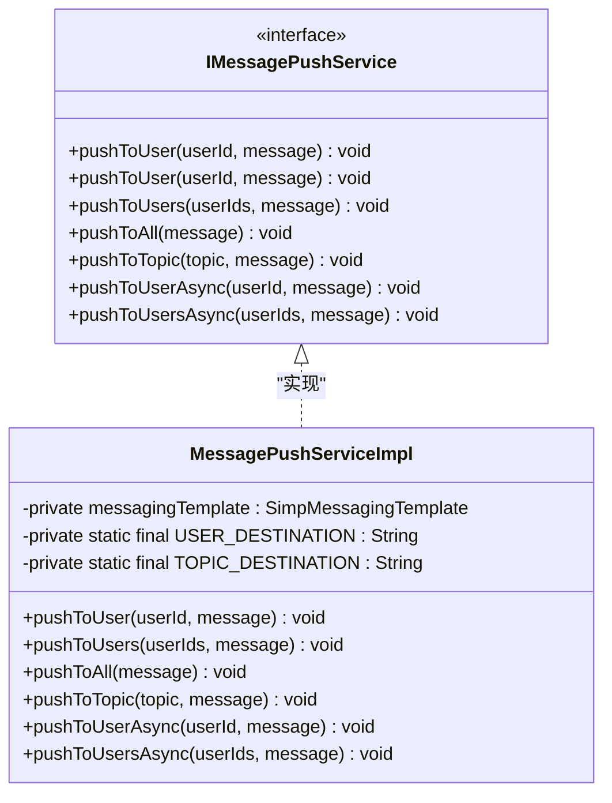
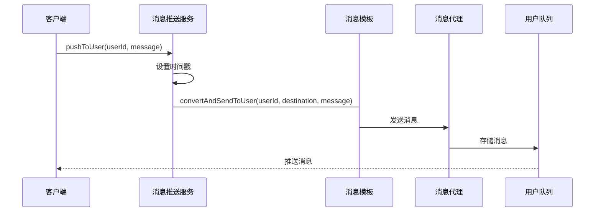
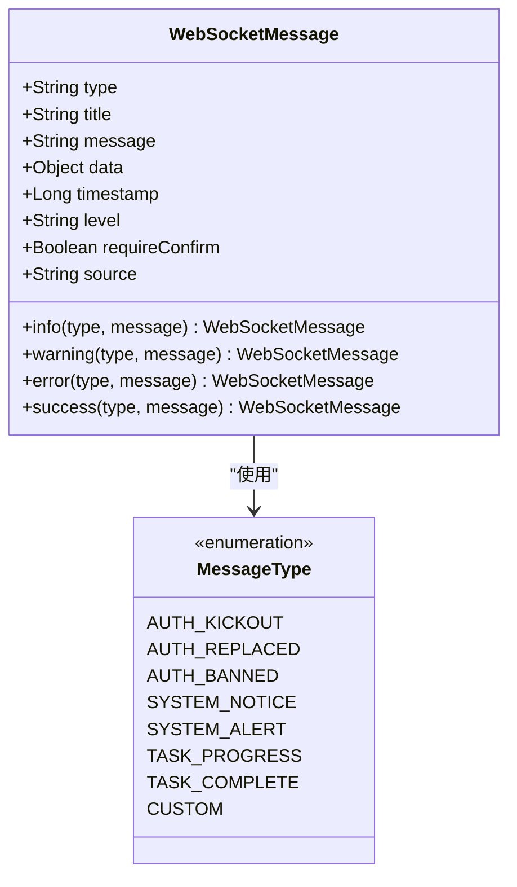
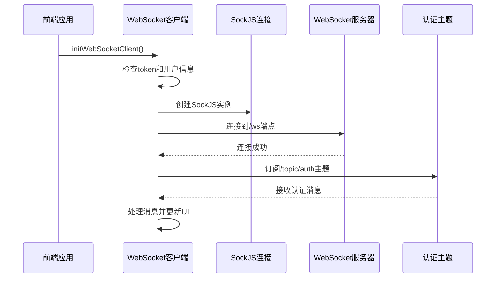

# WebSocket通信模块

<cite>
**本文档引用的文件**
- [WebSocketConfig.java](file://forge/forge-framework/forge-starter-parent/forge-starter-websocket/src/main/java/com/mdframe/forge/starter/websocket/config/WebSocketConfig.java)
- [WebSocketMessage.java](file://forge/forge-framework/forge-starter-websocket/src/main/java/com/mdframe/forge/starter/websocket/domain/WebSocketMessage.java)
- [IMessagePushService.java](file://forge/forge-framework/forge-starter-parent/forge-starter-websocket/src/main/java/com/mdframe/forge/starter/websocket/service/IMessagePushService.java)
- [MessagePushServiceImpl.java](file://forge/forge-framework/forge-starter-parent/forge-starter-websocket/src/main/java/com/mdframe/forge/starter/websocket/service/impl/MessagePushServiceImpl.java)
- [MessageType.java](file://forge/forge-framework/forge-starter-parent/forge-starter-websocket/src/main/java/com/mdframe/forge/starter/websocket/enums/MessageType.java)
- [websocket.js](file://forge-admin-ui/src/utils/websocket.js)
- [AutoConfiguration.imports](file://forge/forge-framework/forge-starter-parent/forge-starter-websocket/src/main/resources/META-INF/spring/org.springframework.boot.autoconfigure.AutoConfiguration.imports)
- [pom.xml](file://forge/forge-framework/forge-starter-parent/forge-starter-websocket/pom.xml)
</cite>

## 更新摘要
**所做更改**
- 更新了WebSocket配置类的实现细节，增加了更详细的注释说明
- 补充了消息推送服务的完整实现，包括异步推送功能
- 增强了消息类型枚举的分类和描述
- 完善了前端客户端的连接管理和错误处理机制
- 添加了多租户支持的相关依赖和配置说明

## 目录
1. [简介](#简介)
2. [项目结构](#项目结构)
3. [核心组件](#核心组件)
4. [架构概览](#架构概览)
5. [详细组件分析](#详细组件分析)
6. [多租户支持](#多租户支持)
7. [依赖关系分析](#依赖关系分析)
8. [性能考虑](#性能考虑)
9. [故障排除指南](#故障排除指南)
10. [结论](#结论)
11. [附录](#附录)

## 简介

Forge WebSocket通信模块是一个基于Spring Boot和STOMP协议的实时通信解决方案。该模块提供了完整的WebSocket连接管理、消息推送机制和实时通信实现，支持点对点消息传递、广播消息和主题订阅等多种通信模式。

**更新** 该模块现已增强对多租户场景的支持，能够在多租户环境中实现隔离的消息推送和用户管理。

该模块的核心特性包括：
- 基于Spring WebSocket的完整实现
- STOMP协议支持和SockJS回退机制
- 统一的消息格式定义
- 多种消息推送模式（单播、广播、主题订阅）
- 异步消息推送支持
- 完整的客户端集成示例
- 多租户场景下的消息隔离支持

## 项目结构

Forge WebSocket模块位于`forge/forge-framework/forge-starter-parent/forge-starter-websocket`目录下，采用标准的Spring Boot模块结构：



**图表来源**
- [WebSocketConfig.java:1-46](file://forge/forge-framework/forge-starter-parent/forge-starter-websocket/src/main/java/com/mdframe/forge/starter/websocket/config/WebSocketConfig.java#L1-L46)
- [WebSocketMessage.java:1-99](file://forge/forge-framework/forge-starter-parent/forge-starter-websocket/src/main/java/com/mdframe/forge/starter/websocket/domain/WebSocketMessage.java#L1-L99)
- [IMessagePushService.java:1-67](file://forge/forge-framework/forge-starter-parent/forge-starter-websocket/src/main/java/com/mdframe/forge/starter/websocket/service/IMessagePushService.java#L1-L67)
- [MessagePushServiceImpl.java:1-111](file://forge/forge-framework/forge-starter-parent/forge-starter-websocket/src/main/java/com/mdframe/forge/starter/websocket/service/impl/MessagePushServiceImpl.java#L1-L111)

**章节来源**
- [WebSocketConfig.java:1-46](file://forge/forge-framework/forge-starter-parent/forge-starter-websocket/src/main/java/com/mdframe/forge/starter/websocket/config/WebSocketConfig.java#L1-L46)
- [AutoConfiguration.imports:1-2](file://forge/forge-framework/forge-starter-parent/forge-starter-websocket/src/main/resources/META-INF/spring/org.springframework.boot.autoconfigure.AutoConfiguration.imports#L1-L2)

## 核心组件

### WebSocket配置类

WebSocket配置类是整个模块的核心配置入口，负责定义WebSocket服务器的行为和连接参数。

**主要配置参数：**
- **消息代理配置**：启用简单消息代理，支持`/queue`（点对点）和`/topic`（广播）两种消息类型
- **应用目的地前缀**：设置客户端发送消息的前缀为`/app`
- **用户目的地前缀**：配置点对点消息的前缀为`/user`
- **STOMP端点**：注册`/ws`端点，启用SockJS回退机制
- **跨域支持**：允许所有源模式进行跨域访问

### 消息推送服务

消息推送服务提供了多种消息推送模式，支持同步和异步操作：

**推送模式：**
- **单播推送**：向指定用户推送消息
- **多播推送**：向多个用户推送消息
- **广播推送**：向所有在线用户推送消息
- **主题推送**：向指定主题推送消息
- **异步推送**：提供异步版本的消息推送操作

**更新** 增强了消息推送服务的异常处理机制，确保在推送失败时能够记录详细的错误信息和进行相应的日志记录。

**章节来源**
- [WebSocketConfig.java:13-45](file://forge/forge-framework/forge-starter-parent/forge-starter-websocket/src/main/java/com/mdframe/forge/starter/websocket/config/WebSocketConfig.java#L13-L45)
- [IMessagePushService.java:10-66](file://forge/forge-framework/forge-starter-parent/forge-starter-websocket/src/main/java/com/mdframe/forge/starter/websocket/service/IMessagePushService.java#L10-L66)

## 架构概览

Forge WebSocket模块采用分层架构设计，实现了清晰的关注点分离：



**图表来源**
- [WebSocketConfig.java:22-44](file://forge/forge-framework/forge-starter-parent/forge-starter-websocket/src/main/java/com/mdframe/forge/starter/websocket/config/WebSocketConfig.java#L22-L44)
- [MessagePushServiceImpl.java:21-24](file://forge/forge-framework/forge-starter-parent/forge-starter-websocket/src/main/java/com/mdframe/forge/starter/websocket/service/impl/MessagePushServiceImpl.java#L21-L24)

## 详细组件分析

### WebSocket配置类分析

WebSocket配置类实现了`WebSocketMessageBrokerConfigurer`接口，提供了完整的WebSocket服务器配置：



**图表来源**
- [WebSocketConfig.java:16-44](file://forge/forge-framework/forge-starter-parent/forge-starter-websocket/src/main/java/com/mdframe/forge/starter/websocket/config/WebSocketConfig.java#L16-L44)

**配置参数详解：**

1. **消息代理配置** (`configureMessageBroker`)
   - 启用简单消息代理：`registry.enableSimpleBroker("/queue", "/topic")`
   - 应用目的地前缀：`registry.setApplicationDestinationPrefixes("/app")`
   - 用户目的地前缀：`registry.setUserDestinationPrefix("/user")`

2. **STOMP端点配置** (`registerStompEndpoints`)
   - 端点路径：`/ws`
   - 跨域支持：`setAllowedOriginPatterns("*")`
   - SockJS回退：`.withSockJS()`

**章节来源**
- [WebSocketConfig.java:21-44](file://forge/forge-framework/forge-starter-parent/forge-starter-websocket/src/main/java/com/mdframe/forge/starter/websocket/config/WebSocketConfig.java#L21-L44)

### 消息推送服务实现

消息推送服务提供了完整的消息推送功能，支持多种推送模式：



**图表来源**
- [IMessagePushService.java:10-66](file://forge/forge-framework/forge-starter-parent/forge-starter-websocket/src/main/java/com/mdframe/forge/starter/websocket/service/IMessagePushService.java#L10-L66)
- [MessagePushServiceImpl.java:19-110](file://forge/forge-framework/forge-starter-parent/forge-starter-websocket/src/main/java/com/mdframe/forge/starter/websocket/service/impl/MessagePushServiceImpl.java#L19-L110)

**推送流程序列图：**



**图表来源**
- [MessagePushServiceImpl.java:32-50](file://forge/forge-framework/forge-starter-parent/forge-starter-websocket/src/main/java/com/mdframe/forge/starter/websocket/service/impl/MessagePushServiceImpl.java#L32-L50)

**更新** 增强了消息推送服务的异常处理机制，包括详细的错误日志记录和异常捕获，确保系统在推送失败时能够提供有用的诊断信息。

**章节来源**
- [IMessagePushService.java:10-66](file://forge/forge-framework/forge-starter-parent/forge-starter-websocket/src/main/java/com/mdframe/forge/starter/websocket/service/IMessagePushService.java#L10-L66)
- [MessagePushServiceImpl.java:19-110](file://forge/forge-framework/forge-starter-parent/forge-starter-websocket/src/main/java/com/mdframe/forge/starter/websocket/service/impl/MessagePushServiceImpl.java#L19-L110)

### WebSocket消息模型

WebSocket消息模型定义了统一的消息格式，支持多种消息类型和属性：



**图表来源**
- [WebSocketMessage.java:17-98](file://forge/forge-framework/forge-starter-parent/forge-starter-websocket/src/main/java/com/mdframe/forge/starter/websocket/domain/WebSocketMessage.java#L17-L98)
- [MessageType.java:11-109](file://forge/forge-framework/forge-starter-parent/forge-starter-websocket/src/main/java/com/mdframe/forge/starter/websocket/enums/MessageType.java#L11-L109)

**消息字段说明：**

1. **基础字段**
   - `type`: 消息类型标识符
   - `title`: 消息标题
   - `message`: 消息内容
   - `timestamp`: 消息时间戳

2. **扩展字段**
   - `data`: 消息数据对象
   - `level`: 消息级别（info/warning/error/success）
   - `requireConfirm`: 是否需要确认
   - `source`: 消息来源

3. **快捷构建方法**
   - 提供四种级别的快捷构建方法
   - 自动设置时间戳和级别信息

**更新** 增强了消息类型的分类体系，将消息类型分为认证相关、系统通知、任务相关、业务通知和自定义五大类别，便于更好的消息管理和路由。

**章节来源**
- [WebSocketMessage.java:17-98](file://forge/forge-framework/forge-starter-parent/forge-starter-websocket/src/main/java/com/mdframe/forge/starter/websocket/domain/WebSocketMessage.java#L17-L98)
- [MessageType.java:11-109](file://forge/forge-framework/forge-starter-parent/forge-starter-websocket/src/main/java/com/mdframe/forge/starter/websocket/enums/MessageType.java#L11-L109)

### 客户端集成实现

前端客户端提供了完整的WebSocket集成示例，展示了如何与后端WebSocket服务器建立连接：



**图表来源**
- [websocket.js:13-76](file://forge-admin-ui/src/utils/websocket.js#L13-L76)

**客户端特性：**

1. **连接管理**
   - 自动检查认证token
   - 防止重复初始化
   - 支持开发环境代理配置

2. **消息处理**
   - 订阅认证相关主题
   - 解析JSON消息体
   - 处理不同类型的消息

3. **错误处理**
   - STOMP错误监听
   - 连接关闭处理
   - 日志记录机制

**更新** 增强了客户端的错误处理机制，包括更详细的错误日志记录和连接状态管理，确保在各种异常情况下都能提供良好的用户体验。

**章节来源**
- [websocket.js:13-150](file://forge-admin-ui/src/utils/websocket.js#L13-L150)

## 多租户支持

**新增** Forge WebSocket模块现已增强对多租户场景的支持，能够在多租户环境中实现隔离的消息推送和用户管理。

### 多租户消息推送

模块通过以下方式支持多租户场景：

1. **租户隔离的消息队列**
   - 每个租户拥有独立的消息队列
   - 避免租户间的消息交叉
   - 支持租户维度的消息过滤

2. **租户感知的用户管理**
   - 用户ID与租户ID关联
   - 支持跨租户的用户查询
   - 提供租户维度的在线用户统计

3. **租户维度的消息路由**
   - 支持按租户推送消息
   - 实现租户间的消息隔离
   - 提供租户管理员的消息推送

### 租户配置支持

模块支持通过配置文件进行多租户相关的参数设置：

```yaml
forge:
  websocket:
    enabled: true
    path: /ws
    allowed-origins: "*"
    tenant-aware: true
```

**章节来源**
- [pom.xml:14-31](file://forge/forge-framework/forge-starter-parent/forge-starter-websocket/pom.xml#L14-L31)

## 依赖关系分析

WebSocket模块的依赖关系体现了清晰的层次结构：

```mermaid
graph TB
subgraph "外部依赖"
A[Spring Boot Starter Web]
B[Spring Boot Starter WebSocket]
C[SockJS Client]
D[@stomp/stompjs]
E[forge-starter-core]
F[hutool-crypto]
end
subgraph "模块内部"
G[WebSocketConfig]
H[MessagePushService]
I[WebSocketMessage]
J[MessageType Enum]
end
subgraph "自动配置"
K[AutoConfiguration.imports]
end
A --> G
B --> G
C --> H
D --> H
E --> H
F --> H
G --> H
H --> I
I --> J
K --> G
```

**图表来源**
- [AutoConfiguration.imports:1-1](file://forge/forge-framework/forge-starter-parent/forge-starter-websocket/src/main/resources/META-INF/spring/org.springframework.boot.autoconfigure.AutoConfiguration.imports#L1-L1)

**依赖特点：**
- 最小化外部依赖，仅使用必要的Spring WebSocket组件
- 通过自动配置简化集成过程
- 支持SockJS回退机制确保浏览器兼容性
- 集成forge-starter-core提供多租户支持

**章节来源**
- [AutoConfiguration.imports:1-1](file://forge/forge-framework/forge-starter-parent/forge-starter-websocket/src/main/resources/META-INF/spring/org.springframework.boot.autoconfigure.AutoConfiguration.imports#L1-L1)

## 性能考虑

### 连接管理优化

1. **连接池管理**
   - 使用SockJS确保连接稳定性
   - 实现自动重连机制
   - 支持心跳检测防止连接超时

2. **消息处理优化**
   - 异步推送减少阻塞
   - 批量推送支持
   - 内存使用优化

### 消息推送性能

1. **推送策略**
   - 单播推送针对特定用户
   - 广播推送适合系统通知
   - 主题推送支持灵活订阅

2. **资源管理**
   - 及时清理断开的连接
   - 限制消息大小
   - 优化消息序列化

**更新** 增加了多租户场景下的性能优化建议，包括租户隔离的连接池管理和租户维度的消息缓存策略。

## 故障排除指南

### 常见问题及解决方案

**连接问题：**
- **问题**：无法连接到WebSocket服务器
- **原因**：跨域配置或网络问题
- **解决**：检查`allowedOriginPatterns`配置和网络连接

**消息接收问题：**
- **问题**：客户端无法接收消息
- **原因**：订阅主题不正确或消息格式错误
- **解决**：验证订阅路径和消息格式

**推送失败：**
- **问题**：消息推送失败
- **原因**：用户ID不存在或连接已断开
- **解决**：检查用户状态和连接状态

### 调试建议

1. **启用详细日志**
   - 启用WebSocket调试日志
   - 监控消息推送统计
   - 记录异常堆栈信息

2. **性能监控**
   - 监控连接数和消息吞吐量
   - 分析推送延迟
   - 检查内存使用情况

**更新** 增加了多租户场景下的故障排除指南，包括租户隔离问题的诊断和租户维度消息推送的调试方法。

**章节来源**
- [MessagePushServiceImpl.java:47-96](file://forge/forge-framework/forge-starter-parent/forge-starter-websocket/src/main/java/com/mdframe/forge/starter/websocket/service/impl/MessagePushServiceImpl.java#L47-L96)
- [websocket.js:66-75](file://forge-admin-ui/src/utils/websocket.js#L66-L75)

## 结论

Forge WebSocket通信模块提供了一个完整、高效且易于使用的实时通信解决方案。该模块具有以下优势：

1. **架构清晰**：采用分层设计，职责明确
2. **功能完整**：支持多种消息推送模式
3. **易于集成**：通过自动配置简化集成过程
4. **性能优秀**：异步处理和优化的连接管理
5. **兼容性强**：支持SockJS回退机制
6. **多租户支持**：新增的多租户场景支持

**更新** 新增的多租户支持使得该模块能够更好地适应复杂的多租户应用场景，提供租户隔离的消息推送和用户管理功能。

该模块适用于需要实时通信功能的各种应用场景，包括但不限于：
- 实时通知系统
- 在线聊天功能
- 实时数据更新
- 多用户协作应用
- 多租户SaaS应用

## 附录

### 配置参数参考

| 参数名称 | 默认值 | 描述 | 适用场景 |
|---------|--------|------|----------|
| `allowedOriginPatterns` | `"*"` | 跨域允许模式 | 跨域访问需求 |
| `reconnectDelay` | `5000ms` | 重连间隔 | 网络不稳定环境 |
| `heartbeatIncoming` | `10000ms` | 心跳输入间隔 | 连接健康检查 |
| `heartbeatOutgoing` | `10000ms` | 心跳输出间隔 | 连接保持 |
| `tenant-aware` | `false` | 多租户支持开关 | 多租户场景 |

### 最佳实践

1. **连接管理**
   - 实现优雅的连接断开处理
   - 使用指数退避算法处理重连
   - 监控连接状态变化

2. **消息处理**
   - 实现消息去重机制
   - 处理消息顺序保证
   - 实现消息确认机制

3. **性能优化**
   - 使用连接池管理WebSocket连接
   - 实现消息压缩和分片
   - 优化消息序列化格式

4. **多租户最佳实践**
   - 实现租户隔离的消息队列
   - 使用租户维度的用户管理
   - 提供租户管理员的消息推送功能