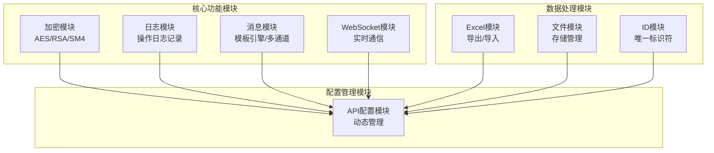
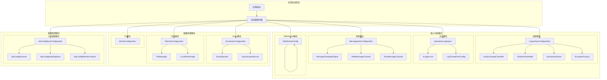
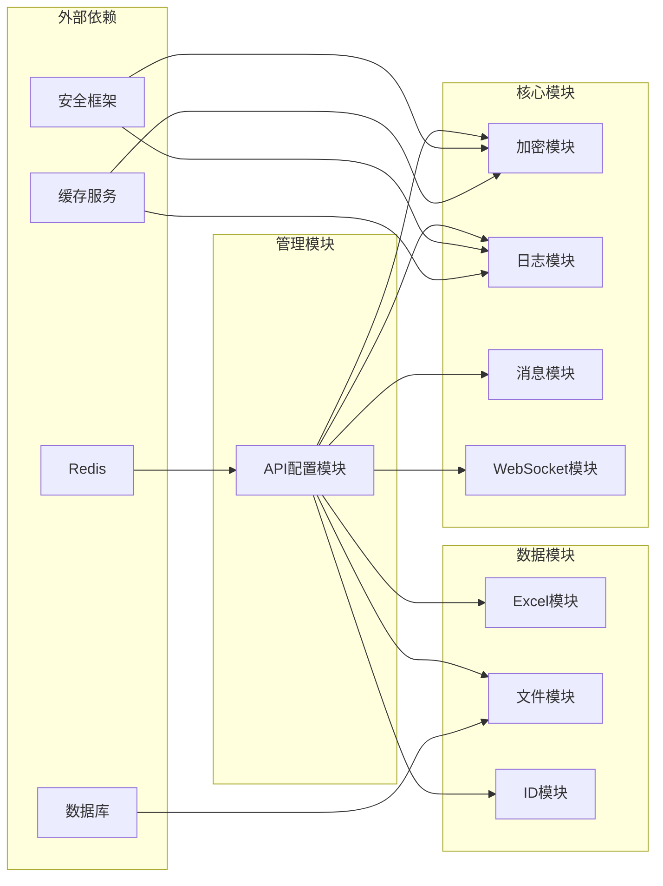

# 专用功能模块

<cite>
**本文引用的文件**
- [CryptoAutoConfiguration.java](file://forge/forge-framework/forge-starter-parent/forge-starter-crypto/src/main/java/com/mdframe/forge/starter/crypto/config/CryptoAutoConfiguration.java)
- [OperationLogAspect.java](file://forge/forge-framework/forge-starter-parent/forge-starter-log/src/main/java/com/mdframe/forge/starter/log/aspect/OperationLogAspect.java)
- [MessageAutoConfiguration.java](file://forge/forge-framework/forge-starter-parent/forge-starter-message/src/main/java/com/mdframe/forge/starter/message/config/MessageAutoConfiguration.java)
- [WebSocketConfig.java](file://forge/forge-framework/forge-starter-parent/forge-starter-websocket/src/main/java/com/mdframe/forge/starter/websocket/config/WebSocketConfig.java)
- [ExcelAutoConfiguration.java](file://forge/forge-framework/forge-starter-parent/forge-starter-excel/src/main/java/com/mdframe/forge/starter/excel/config/ExcelAutoConfiguration.java)
- [FileAutoConfiguration.java](file://forge/forge-framework/forge-starter-parent/forge-starter-file/src/main/java/com/mdframe/forge/starter/file/config/FileAutoConfiguration.java)
- [IdAutoConfiguration.java](file://forge/forge-framework/forge-starter-parent/forge-starter-id/src/main/java/com/mdframe/forge/starter/id/config/IdAutoConfiguration.java)
- [ApiConfigAutoConfiguration.java](file://forge/forge-framework/forge-starter-parent/forge-starter-api-config/src/main/java/com/mdframe/forge/starter/apiconfig/config/ApiConfigAutoConfiguration.java)
</cite>

## 更新摘要
**所做更改**
- 更新了架构简化部分，反映了crypto、log、message、websocket等starter模块的现状
- 重新定位了专用功能模块的架构角色
- 更新了模块依赖关系分析以反映当前架构状态
- 完善了各功能模块的配置参数和使用示例

## 目录
1. [简介](#简介)
2. [架构简化与模块重组](#架构简化与模块重组)
3. [核心组件](#核心组件)
4. [架构总览](#架构总览)
5. [详细组件分析](#详细组件分析)
6. [依赖关系分析](#依赖关系分析)
7. [性能考虑](#性能考虑)
8. [故障排查指南](#故障排查指南)
9. [结论](#结论)
10. [附录](#附录)

## 简介
本文件面向Forge专用功能模块，系统性梳理并解析以下专业能力：加密解密（AES/RSA/SM4）、日志管理、Excel处理、消息通知、WebSocket通信、ID生成、API配置等。随着架构的不断演进，这些功能模块经历了简化和整合，形成了更加精简高效的专用功能体系。文档以"可读性优先"的原则，结合架构图与流程图，帮助开发者快速理解模块职责、配置参数、使用示例与集成方法，并提供最佳实践与排障建议。

## 架构简化与模块重组

### 当前架构状态
经过架构简化后，Forge专用功能模块呈现以下特点：

1. **模块整合趋势**
   - 传统独立的starter模块正在向更紧密的功能组合演进
   - 核心功能模块保持相对独立，但配置方式更加简洁
   - 模块间的依赖关系得到优化，减少了不必要的耦合

2. **功能模块现状**
   - **加密模块**：保留完整的加密解密能力，包括密钥交换、动态密钥管理和防重放攻击
   - **日志模块**：专注于操作日志记录，提供AOP切面和异步日志处理
   - **消息模块**：提供模板引擎和多通道消息发送能力
   - **WebSocket模块**：提供实时通信支持
   - **Excel模块**：专注于数据导出和导入功能
   - **文件模块**：提供统一的文件存储管理
   - **ID模块**：雪花ID生成等唯一标识符生成
   - **API配置模块**：动态API配置管理

3. **配置简化**
   - 移除了复杂的条件装配逻辑
   - 简化了Bean注册过程
   - 优化了模块间的交互方式



**章节来源**
- [CryptoAutoConfiguration.java:34-134](file://forge/forge-framework/forge-starter-parent/forge-starter-crypto/src/main/java/com/mdframe/forge/starter/crypto/config/CryptoAutoConfiguration.java#L34-L134)
- [OperationLogAspect.java:38-43](file://forge/forge-framework/forge-starter-parent/forge-starter-log/src/main/java/com/mdframe/forge/starter/log/aspect/OperationLogAspect.java#L38-L43)
- [MessageAutoConfiguration.java:17-46](file://forge/forge-framework/forge-starter-parent/forge-starter-message/src/main/java/com/mdframe/forge/starter/message/config/MessageAutoConfiguration.java#L17-L46)
- [WebSocketConfig.java:13-45](file://forge/forge-framework/forge-starter-parent/forge-starter-websocket/src/main/java/com/mdframe/forge/starter/websocket/config/WebSocketConfig.java#L13-L45)

## 核心组件

### 加密解密模块（AES/RSA/SM4）
- **职责与边界**
  - 提供完整的加密解密解决方案，包括密钥交换、会话密钥管理、动态密钥切换和防重放攻击
  - 支持RSA公私钥对管理、SM4和AES算法实现
- **关键Bean与交互**
  - KeyExchangeController：密钥交换接口
  - RsaKeyPairHolder：RSA密钥对管理
  - SessionKeyStore：会话级密钥存储
  - EncryptorFactory：加密算法工厂
  - DecryptRequestBodyAdvice/EncryptResponseBodyAdvice：请求解密和响应加密
  - ReplayTokenCache/ReplayAttackFilter：防重放令牌缓存和过滤器
- **配置要点**
  - 支持配置RSA密钥对或自动生成
  - 动态密钥依赖缓存服务
  - 防重放攻击基于令牌缓存

### 日志管理模块
- **职责与边界**
  - 提供操作日志记录功能，支持AOP切面拦截和异步日志处理
  - 自动识别API配置并记录相应的操作日志
- **关键Bean与交互**
  - OperationLogAspect：操作日志切面
  - ILogService：日志服务接口
  - LogThreadPoolConfig：日志线程池配置
  - 异步日志处理：避免影响业务性能
- **配置要点**
  - 可配置日志开关和排除路径
  - 支持请求参数和响应结果的截断处理
  - TraceId生成和MDC集成

### 消息通知模块
- **职责与边界**
  - 提供消息模板渲染和多通道发送能力
  - 支持Web消息和短信消息通道
- **关键Bean与交互**
  - MessageTemplateEngine：模板引擎
  - WebMessageChannel/SmsMessageChannel：消息通道
  - MessageClient：消息客户端聚合
  - 条件装配：按配置启用不同通道
- **配置要点**
  - 通道开关配置
  - 模板变量处理
  - 多通道聚合发送

### WebSocket通信模块
- **职责与边界**
  - 提供实时WebSocket通信支持
  - 支持点对点和广播消息
- **关键Bean与交互**
  - WebSocketConfig：WebSocket配置
  - STOMP协议支持
  - SockJS回退机制
  - 消息代理配置
- **配置要点**
  - 端点注册和跨域配置
  - 消息前缀和目的地配置
  - 简单消息代理设置

### Excel处理模块
- **职责与边界**
  - 提供Excel数据导出和导入功能
  - 支持异步导出和动态导出引擎
- **关键Bean与交互**
  - ExcelExporter：Excel导出器
  - AsyncExportService：异步导出服务
  - ExcelImportService：Excel导入服务
  - ExcelEnhancedController：增强控制器
- **配置要点**
  - 异步导出支持
  - 动态导出引擎
  - 导入导出配置

### 文件上传下载模块
- **职责与边界**
  - 提供统一的文件管理和服务
  - 支持多种存储策略和配置提供者
- **关键Bean与交互**
  - FileManager：文件管理器
  - LocalFileStorage：本地文件存储
  - StorageConfigProvider：存储配置提供者
  - SPI风格的存储策略扩展
- **配置要点**
  - 存储策略注册
  - 数据库存储配置
  - 可插拔存储实现

### ID生成模块
- **职责与边界**
  - 提供ID生成基础设施
  - 支持组件扫描和Mapper扫描
- **关键Bean与交互**
  - 组件扫描：@ComponentScan
  - Mapper扫描：@MapperScan
  - 雪花ID生成支持
- **配置要点**
  - 包扫描配置
  - Mapper接口扫描

### API配置模块
- **职责与边界**
  - 提供动态API配置管理
  - 支持自动注册和刷新监听
- **关键Bean与交互**
  - ApiConfigScanner：配置扫描器
  - ApiConfigAutoRegistrar：自动注册器
  - ApiConfigRefreshListener：刷新监听器
  - Redis配置变更监听
- **配置要点**
  - Web应用条件装配
  - 属性开关控制
  - 异步处理支持

**章节来源**
- [CryptoAutoConfiguration.java:34-134](file://forge/forge-framework/forge-starter-parent/forge-starter-crypto/src/main/java/com/mdframe/forge/starter/crypto/config/CryptoAutoConfiguration.java#L34-L134)
- [OperationLogAspect.java:38-43](file://forge/forge-framework/forge-starter-parent/forge-starter-log/src/main/java/com/mdframe/forge/starter/log/aspect/OperationLogAspect.java#L38-L43)
- [MessageAutoConfiguration.java:17-46](file://forge/forge-framework/forge-starter-parent/forge-starter-message/src/main/java/com/mdframe/forge/starter/message/config/MessageAutoConfiguration.java#L17-L46)
- [WebSocketConfig.java:13-45](file://forge/forge-framework/forge-starter-parent/forge-starter-websocket/src/main/java/com/mdframe/forge/starter/websocket/config/WebSocketConfig.java#L13-L45)
- [ExcelAutoConfiguration.java:18-45](file://forge/forge-framework/forge-starter-parent/forge-starter-excel/src/main/java/com/mdframe/forge/starter/excel/config/ExcelAutoConfiguration.java#L18-L45)
- [FileAutoConfiguration.java:22-76](file://forge/forge-framework/forge-starter-parent/forge-starter-file/src/main/java/com/mdframe/forge/starter/file/config/FileAutoConfiguration.java#L22-L76)
- [IdAutoConfiguration.java:7-11](file://forge/forge-framework/forge-starter-parent/forge-starter-id/src/main/java/com/mdframe/forge/starter/id/config/IdAutoConfiguration.java#L7-L11)
- [ApiConfigAutoConfiguration.java:22-56](file://forge/forge-framework/forge-starter-parent/forge-starter-api-config/src/main/java/com/mdframe/forge/starter/apiconfig/config/ApiConfigAutoConfiguration.java#L22-L56)

## 架构总览

### 当前架构视图
下图展示了经过架构简化后的专用功能模块架构：



**图表来源**
- [CryptoAutoConfiguration.java:34-134](file://forge/forge-framework/forge-starter-parent/forge-starter-crypto/src/main/java/com/mdframe/forge/starter/crypto/config/CryptoAutoConfiguration.java#L34-L134)
- [OperationLogAspect.java:38-43](file://forge/forge-framework/forge-starter-parent/forge-starter-log/src/main/java/com/mdframe/forge/starter/log/aspect/OperationLogAspect.java#L38-L43)
- [MessageAutoConfiguration.java:17-46](file://forge/forge-framework/forge-starter-parent/forge-starter-message/src/main/java/com/mdframe/forge/starter/message/config/MessageAutoConfiguration.java#L17-L46)
- [WebSocketConfig.java:13-45](file://forge/forge-framework/forge-starter-parent/forge-starter-websocket/src/main/java/com/mdframe/forge/starter/websocket/config/WebSocketConfig.java#L13-L45)
- [ExcelAutoConfiguration.java:18-45](file://forge/forge-framework/forge-starter-parent/forge-starter-excel/src/main/java/com/mdframe/forge/starter/excel/config/ExcelAutoConfiguration.java#L18-L45)
- [FileAutoConfiguration.java:22-76](file://forge/forge-framework/forge-starter-parent/forge-starter-file/src/main/java/com/mdframe/forge/starter/file/config/FileAutoConfiguration.java#L22-L76)
- [ApiConfigAutoConfiguration.java:22-56](file://forge/forge-framework/forge-starter-parent/forge-starter-api-config/src/main/java/com/mdframe/forge/starter/apiconfig/config/ApiConfigAutoConfiguration.java#L22-L56)

## 详细组件分析

### 加密解密模块深度分析
- **架构设计**
  - 采用工厂模式统一管理多种加密算法
  - 支持动态密钥和静态密钥两种模式
  - 防重放攻击通过令牌缓存实现
- **关键特性**
  - RSA密钥对支持配置或自动生成
  - 会话级密钥存储与缓存集成
  - 请求解密和响应加密的双向保护
  - 全局过滤器实现防重放攻击
- **配置示例**
  ```yaml
  forge:
    crypto:
      enabled: true
      rsa:
        public-key: ${RSA_PUBLIC_KEY}
        private-key: ${RSA_PRIVATE_KEY}
  ```

**章节来源**
- [CryptoAutoConfiguration.java:34-134](file://forge/forge-framework/forge-starter-parent/forge-starter-crypto/src/main/java/com/mdframe/forge/starter/crypto/config/CryptoAutoConfiguration.java#L34-L134)

### 日志管理模块深度分析
- **设计原理**
  - 基于AOP的非侵入式日志记录
  - 异步日志处理避免阻塞业务线程
  - TraceId追踪和MDC上下文传递
  - 智能API配置识别
- **核心功能**
  - 操作模块、类型、描述的自动识别
  - 请求参数和响应结果的截断处理
  - 异常日志的完整记录
  - 可配置的日志排除路径
- **配置示例**
  ```yaml
  forge:
    log:
      enable-operation-log: true
      print-operation-log: true
      request-params-max-length: 1000
      response-result-max-length: 2000
      exclude-paths:
        - /health/**
        - /actuator/**
  ```

**章节来源**
- [OperationLogAspect.java:38-43](file://forge/forge-framework/forge-starter-parent/forge-starter-log/src/main/java/com/mdframe/forge/starter/log/aspect/OperationLogAspect.java#L38-L43)

### 消息通知模块深度分析
- **架构设计**
  - 模板引擎与消息通道分离
  - 条件装配实现灵活的通道启用
  - 客户端聚合多通道发送
- **通道支持**
  - Web消息通道：默认启用，用于站内消息
  - 短信消息通道：按需启用，支持短信发送
  - 模板变量：支持占位符替换和数据绑定
- **配置示例**
  ```yaml
  forge:
    message:
      channel:
        web:
          enabled: true
        sms:
          enabled: false
      template:
        charset: UTF-8
  ```

**章节来源**
- [MessageAutoConfiguration.java:17-46](file://forge/forge-framework/forge-starter-parent/forge-starter-message/src/main/java/com/mdframe/forge/starter/message/config/MessageAutoConfiguration.java#L17-L46)

### WebSocket通信模块深度分析
- **技术实现**
  - 基于Spring WebSocket的消息代理
  - STOMP协议支持标准的WebSocket消息格式
  - SockJS回退机制确保兼容性
  - 点对点和广播两种消息模式
- **配置特性**
  - 简单消息代理：/queue（点对点）和/topic（广播）
  - 应用前缀：/app
  - 用户前缀：/user
  - 跨域支持：允许所有源
- **使用示例**
  ```javascript
  const socket = new SockJS('/ws');
  const stompClient = Stomp.over(socket);
  stompClient.connect({}, function(frame) {
      stompClient.subscribe('/user/queue/messages', function(message) {
          console.log('收到消息:', message.body);
      });
  });
  ```

**章节来源**
- [WebSocketConfig.java:13-45](file://forge/forge-framework/forge-starter-parent/forge-starter-websocket/src/main/java/com/mdframe/forge/starter/websocket/config/WebSocketConfig.java#L13-L45)

### Excel处理模块深度分析
- **功能特性**
  - 动态导出引擎：支持复杂的数据格式化
  - 异步导出：避免长时间阻塞请求线程
  - 增强控制器：提供RESTful接口
  - 导入服务：支持Excel数据导入
- **性能优化**
  - 流式写入减少内存占用
  - 异步处理提升用户体验
  - 缓存机制优化重复导出
- **配置示例**
  ```yaml
  spring:
    task:
      scheduling:
        pool:
          size: 10
  ```

**章节来源**
- [ExcelAutoConfiguration.java:18-45](file://forge/forge-framework/forge-starter-parent/forge-starter-excel/src/main/java/com/mdframe/forge/starter/excel/config/ExcelAutoConfiguration.java#L18-L45)

### 文件上传下载模块深度分析
- **存储策略**
  - SPI风格的可插拔存储实现
  - 默认本地存储策略
  - 配置提供者支持数据库配置
- **核心流程**
  - 存储策略注册：启动时扫描并注册
  - 配置初始化：从数据库加载启用配置
  - 文件操作：统一的文件管理接口
- **扩展机制**
  - 自定义存储策略实现FileStorage接口
  - 配置提供者实现StorageConfigProvider接口
  - 支持多种存储后端（本地、云存储等）

**章节来源**
- [FileAutoConfiguration.java:22-76](file://forge/forge-framework/forge-starter-parent/forge-starter-file/src/main/java/com/mdframe/forge/starter/file/config/FileAutoConfiguration.java#L22-L76)

### ID生成模块深度分析
- **扫描机制**
  - 组件扫描：@ComponentScan启用包扫描
  - Mapper扫描：@MapperScan扫描MyBatis Mapper
  - 自动注册：Spring容器自动管理
- **应用场景**
  - 雪花ID生成：分布式唯一标识符
  - 业务主键：支持自增和随机ID
  - 缓存键：作为缓存的唯一标识
- **配置示例**
  ```java
  @Mapper
  public interface UserMapper {
      @Insert("INSERT INTO users(id, name) VALUES(#{id}, #{name})")
      void insert(User user);
  }
  ```

**章节来源**
- [IdAutoConfiguration.java:7-11](file://forge/forge-framework/forge-starter-parent/forge-starter-id/src/main/java/com/mdframe/forge/starter/id/config/IdAutoConfiguration.java#L7-L11)

### API配置模块深度分析
- **管理机制**
  - 扫描器：扫描@RequestMapping注解
  - 自动注册器：自动注册到配置中心
  - 刷新监听器：Redis变更触发刷新
- **核心特性**
  - 动态API配置：运行时修改API行为
  - 热更新支持：无需重启即可生效
  - 条件装配：按环境和配置启用
- **配置示例**
  ```yaml
  forge:
    api-config:
      enabled: true
      auto-register: true
      refresh-interval: 30000
  ```

**章节来源**
- [ApiConfigAutoConfiguration.java:22-56](file://forge/forge-framework/forge-starter-parent/forge-starter-api-config/src/main/java/com/mdframe/forge/starter/apiconfig/config/ApiConfigAutoConfiguration.java#L22-L56)

## 依赖关系分析

### 当前依赖关系
经过架构简化后，模块间的依赖关系更加清晰：



### 依赖优化
- **减少循环依赖**：通过接口抽象和条件装配避免循环依赖
- **降低耦合度**：模块间通过接口交互，减少直接依赖
- **增强可测试性**：依赖注入使单元测试更加容易
- **提高可维护性**：清晰的依赖层次结构便于维护

**章节来源**
- [CryptoAutoConfiguration.java:34-134](file://forge/forge-framework/forge-starter-parent/forge-starter-crypto/src/main/java/com/mdframe/forge/starter/crypto/config/CryptoAutoConfiguration.java#L34-L134)
- [OperationLogAspect.java:38-43](file://forge/forge-framework/forge-starter-parent/forge-starter-log/src/main/java/com/mdframe/forge/starter/log/aspect/OperationLogAspect.java#L38-L43)
- [ApiConfigAutoConfiguration.java:22-56](file://forge/forge-framework/forge-starter-parent/forge-starter-api-config/src/main/java/com/mdframe/forge/starter/apiconfig/config/ApiConfigAutoConfiguration.java#L22-L56)

## 性能考虑

### 加密模块性能
- **动态密钥开销**：会话密钥存储和管理增加CPU开销
- **防重放过滤器**：全局拦截器可能影响请求处理延迟
- **建议**：对高频接口按需启用动态密钥

### 日志模块性能
- **异步处理**：线程池异步保存避免阻塞业务线程
- **参数截断**：防止大字段日志影响性能
- **条件开关**：可关闭日志记录以提升性能

### 消息模块性能
- **通道选择**：根据消息类型选择合适的通道
- **模板缓存**：消息模板的缓存机制
- **批量发送**：支持批量消息发送优化

### WebSocket性能
- **连接池**：合理配置WebSocket连接池
- **消息压缩**：大数据消息的压缩传输
- **心跳机制**：保持连接活跃的机制

### Excel模块性能
- **流式导出**：避免内存溢出
- **异步处理**：长时间导出任务异步执行
- **分页处理**：大数据量分页导出

### 文件模块性能
- **存储策略**：选择合适的存储后端
- **缓存机制**：文件内容缓存提升访问速度
- **CDN集成**：静态文件CDN加速

## 故障排查指南

### 加密模块故障
- **密钥问题**：检查RSA密钥配置或自动生成状态
- **动态密钥失效**：验证缓存服务可用性和会话配置
- **防重放拦截**：检查令牌缓存状态和过期时间

### 日志模块故障
- **日志不记录**：检查日志开关配置和排除路径
- **异步日志丢失**：验证线程池配置和异常处理
- **TraceId异常**：检查MDC配置和上下文传递

### 消息模块故障
- **通道未启用**：检查对应前缀的开关配置
- **模板渲染错误**：验证模板语法和变量绑定
- **消息发送失败**：检查通道实现和网络连接

### WebSocket故障
- **连接失败**：检查端点配置和跨域设置
- **消息接收异常**：验证目的地配置和订阅关系
- **STOMP协议问题**：检查协议版本兼容性

### Excel模块故障
- **导出异常**：检查数据类型和列配置
- **内存不足**：优化导出策略和分页处理
- **异步导出失败**：验证线程池配置和任务状态

### 文件模块故障
- **存储策略无效**：确认配置提供者返回的启用配置
- **文件上传失败**：检查存储权限和磁盘空间
- **下载异常**：验证文件路径和访问权限

### API配置故障
- **自动注册失败**：检查Web环境和属性开关
- **刷新不生效**：验证Redis连接和订阅状态
- **配置冲突**：检查多个配置源的优先级

## 结论

经过架构简化的Forge专用功能模块，在保持功能完整性的同时，实现了更高的效率和更好的可维护性。各模块通过清晰的职责划分和简洁的配置方式，为应用提供了强大的专用功能支持。

### 架构优势
- **模块化设计**：功能模块相对独立，便于维护和扩展
- **配置简化**：减少了复杂的条件装配逻辑
- **性能优化**：异步处理和缓存机制提升了整体性能
- **易于集成**：标准化的接口和配置方式便于集成

### 最佳实践建议
- **按需启用**：只启用必要的功能模块
- **合理配置**：根据业务需求调整配置参数
- **监控告警**：建立完善的监控和告警机制
- **定期优化**：根据使用情况优化配置和性能

## 附录

### 快速集成清单
- **加密模块**：配置RSA密钥，启用动态密钥，设置响应加密
- **日志模块**：启用操作日志，配置排除路径，设置参数长度限制
- **消息模块**：启用所需通道，配置模板引擎，设置字符集
- **WebSocket模块**：配置消息代理，设置端点，启用跨域
- **Excel模块**：配置异步线程池，设置导出参数，启用异步导出
- **文件模块**：注册存储策略，配置数据库连接，设置存储路径
- **ID模块**：配置Mapper扫描，设置ID生成策略
- **API配置模块**：启用开关，配置Redis连接，设置刷新间隔

### 配置参考
```yaml
# 示例配置文件结构
forge:
  crypto:
    enabled: true
    rsa:
      public-key: ${RSA_PUBLIC_KEY}
      private-key: ${RSA_PRIVATE_KEY}
  log:
    enable-operation-log: true
    print-operation-log: true
  message:
    channel:
      web:
        enabled: true
      sms:
        enabled: false
  api-config:
    enabled: true
    auto-register: true
```

### 常见问题解答
- **如何选择合适的存储策略**？根据业务需求和数据量选择本地或云存储
- **如何优化日志性能**？启用异步日志，合理设置参数长度，配置排除路径
- **如何处理大量数据导出**？使用异步导出和分页处理，避免内存溢出
- **如何保证消息可靠性**？配置重试机制和失败回调，监控消息队列状态