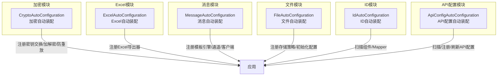
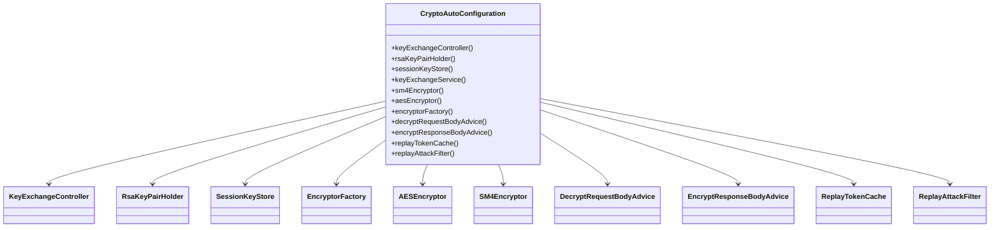
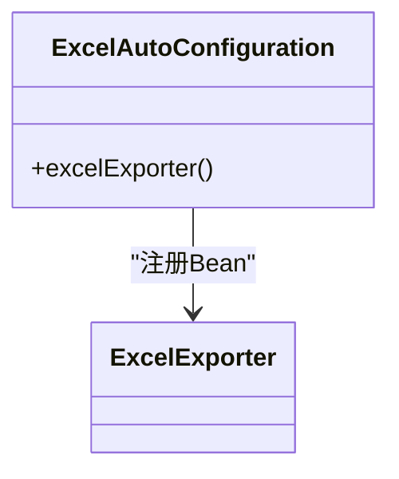
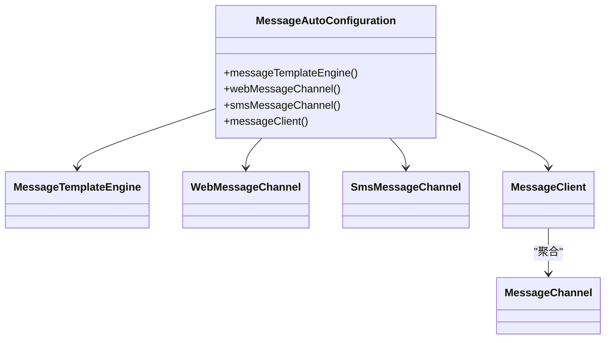
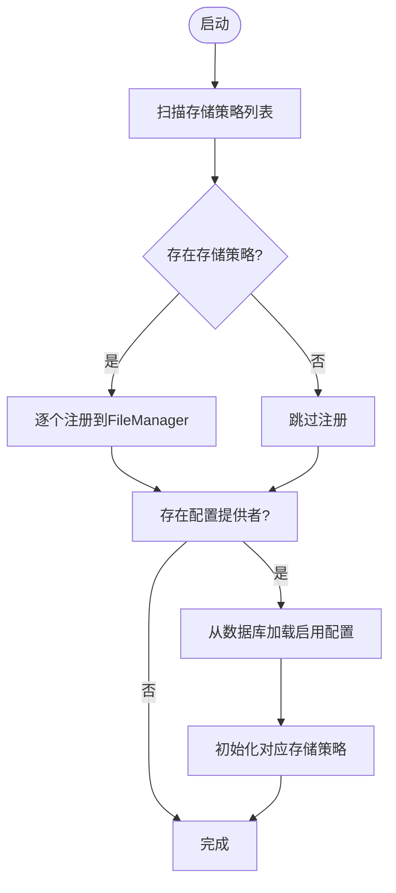
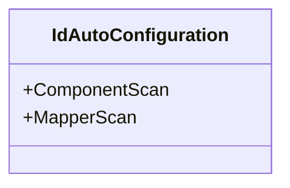
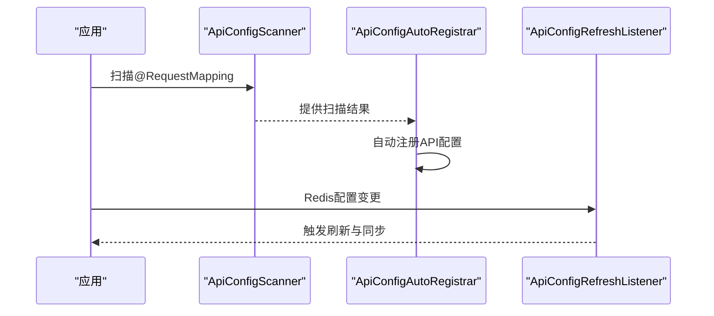
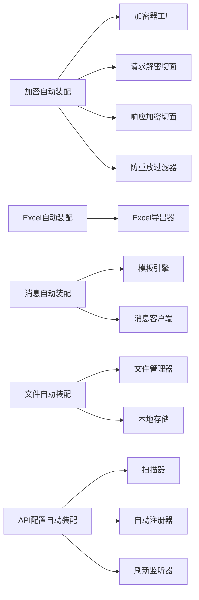

# 专用功能模块

<cite>
**本文引用的文件**
- [CryptoAutoConfiguration.java](file://forge/forge-framework/forge-starter-parent/forge-starter-crypto/src/main/java/com/mdframe/forge/starter/crypto/config/CryptoAutoConfiguration.java)
- [ExcelAutoConfiguration.java](file://forge/forge-framework/forge-starter-parent/forge-starter-excel/src/main/java/com/mdframe/forge/starter/excel/config/ExcelAutoConfiguration.java)
- [MessageAutoConfiguration.java](file://forge/forge-framework/forge-starter-parent/forge-starter-message/src/main/java/com/mdframe/forge/starter/message/config/MessageAutoConfiguration.java)
- [FileAutoConfiguration.java](file://forge/forge-framework/forge-starter-parent/forge-starter-file/src/main/java/com/mdframe/forge/starter/file/config/FileAutoConfiguration.java)
- [IdAutoConfiguration.java](file://forge/forge-framework/forge-starter-parent/forge-starter-id/src/main/java/com/mdframe/forge/starter/id/config/IdAutoConfiguration.java)
- [ApiConfigAutoConfiguration.java](file://forge/forge-framework/forge-starter-parent/forge-starter-api-config/src/main/java/com/mdframe/forge/starter/apiconfig/config/ApiConfigAutoConfiguration.java)
</cite>

## 目录
1. [简介](#简介)
2. [项目结构](#项目结构)
3. [核心组件](#核心组件)
4. [架构总览](#架构总览)
5. [详细组件分析](#详细组件分析)
6. [依赖关系分析](#依赖关系分析)
7. [性能考虑](#性能考虑)
8. [故障排查指南](#故障排查指南)
9. [结论](#结论)
10. [附录](#附录)

## 简介
本文件面向Forge专用功能模块，系统性梳理并解析以下专业能力：加密解密（AES/RSA/SM4）、日志管理、Excel处理、消息通知、WebSocket通信、ID生成、API配置等。文档以“可读性优先”的原则，结合架构图与流程图，帮助开发者快速理解模块职责、配置参数、使用示例与集成方法，并提供最佳实践与排障建议。

## 项目结构
本仓库采用多模块分层组织，专用功能模块主要分布在forge-starter-*系列子模块中，每个模块通过Spring Boot自动装配机制按需加载。下图展示与本专题相关的模块与装配入口：

图表来源
- [CryptoAutoConfiguration.java](file://forge/forge-framework/forge-starter-parent/forge-starter-crypto/src/main/java/com/mdframe/forge/starter/crypto/config/CryptoAutoConfiguration.java#L34-L134)
- [ExcelAutoConfiguration.java](file://forge/forge-framework/forge-starter-parent/forge-starter-excel/src/main/java/com/mdframe/forge/starter/excel/config/ExcelAutoConfiguration.java#L12-L19)
- [MessageAutoConfiguration.java](file://forge/forge-framework/forge-starter-parent/forge-starter-message/src/main/java/com/mdframe/forge/starter/message/config/MessageAutoConfiguration.java#L19-L46)
- [FileAutoConfiguration.java](file://forge/forge-framework/forge-starter-parent/forge-starter-file/src/main/java/com/mdframe/forge/starter/file/config/FileAutoConfiguration.java#L26-L76)
- [IdAutoConfiguration.java](file://forge/forge-framework/forge-starter-parent/forge-starter-id/src/main/java/com/mdframe/forge/starter/id/config/IdAutoConfiguration.java#L7-L11)
- [ApiConfigAutoConfiguration.java](file://forge/forge-framework/forge-starter-parent/forge-starter-api-config/src/main/java/com/mdframe/forge/starter/apiconfig/config/ApiConfigAutoConfiguration.java#L22-L56)

章节来源
- [CryptoAutoConfiguration.java](file://forge/forge-framework/forge-starter-parent/forge-starter-crypto/src/main/java/com/mdframe/forge/starter/crypto/config/CryptoAutoConfiguration.java#L34-L134)
- [ExcelAutoConfiguration.java](file://forge/forge-framework/forge-starter-parent/forge-starter-excel/src/main/java/com/mdframe/forge/starter/excel/config/ExcelAutoConfiguration.java#L12-L19)
- [MessageAutoConfiguration.java](file://forge/forge-framework/forge-starter-parent/forge-starter-message/src/main/java/com/mdframe/forge/starter/message/config/MessageAutoConfiguration.java#L19-L46)
- [FileAutoConfiguration.java](file://forge/forge-framework/forge-starter-parent/forge-starter-file/src/main/java/com/mdframe/forge/starter/file/config/FileAutoConfiguration.java#L26-L76)
- [IdAutoConfiguration.java](file://forge/forge-framework/forge-starter-parent/forge-starter-id/src/main/java/com/mdframe/forge/starter/id/config/IdAutoConfiguration.java#L7-L11)
- [ApiConfigAutoConfiguration.java](file://forge/forge-framework/forge-starter-parent/forge-starter-api-config/src/main/java/com/mdframe/forge/starter/apiconfig/config/ApiConfigAutoConfiguration.java#L22-L56)

## 核心组件
- 加密解密（AES/RSA/SM4）
  - 自动装配负责注册密钥交换控制器、RSA密钥对持有者、会话密钥存储、加密器工厂（含SM4/AES）、请求解密与响应加密切面、防重放令牌缓存与过滤器。
  - 关键Bean：KeyExchangeController、RsaKeyPairHolder、SessionKeyStore、SM4Encryptor、AESEncryptor、EncryptorFactory、DecryptRequestBodyAdvice、EncryptResponseBodyAdvice、ReplayTokenCache、ReplayAttackFilter。
- Excel处理
  - 自动装配注册Excel导出器，默认在缺失时创建实例，便于业务侧直接注入使用。
- 消息通知
  - 自动装配注册消息模板引擎、Web消息通道、短信消息通道（按开关启用），以及消息客户端，支持多通道聚合发送。
- 文件上传下载
  - 自动装配注册文件管理器与本地存储策略；支持从配置提供者加载数据库中的存储配置并初始化对应存储策略。
- ID生成
  - 自动装配启用组件扫描与Mapper扫描，为雪花ID等ID生成提供基础。
- API配置
  - 自动装配启用Web条件、属性开关，注册API配置扫描器、自动注册器与刷新监听器，支持动态注册与热更新。

章节来源
- [CryptoAutoConfiguration.java](file://forge/forge-framework/forge-starter-parent/forge-starter-crypto/src/main/java/com/mdframe/forge/starter/crypto/config/CryptoAutoConfiguration.java#L34-L134)
- [ExcelAutoConfiguration.java](file://forge/forge-framework/forge-starter-parent/forge-starter-excel/src/main/java/com/mdframe/forge/starter/excel/config/ExcelAutoConfiguration.java#L12-L19)
- [MessageAutoConfiguration.java](file://forge/forge-framework/forge-starter-parent/forge-starter-message/src/main/java/com/mdframe/forge/starter/message/config/MessageAutoConfiguration.java#L19-L46)
- [FileAutoConfiguration.java](file://forge/forge-framework/forge-starter-parent/forge-starter-file/src/main/java/com/mdframe/forge/starter/file/config/FileAutoConfiguration.java#L26-L76)
- [IdAutoConfiguration.java](file://forge/forge-framework/forge-starter-parent/forge-starter-id/src/main/java/com/mdframe/forge/starter/id/config/IdAutoConfiguration.java#L7-L11)
- [ApiConfigAutoConfiguration.java](file://forge/forge-framework/forge-starter-parent/forge-starter-api-config/src/main/java/com/mdframe/forge/starter/apiconfig/config/ApiConfigAutoConfiguration.java#L22-L56)

## 架构总览
下图展示各模块在应用启动时的装配关系与交互边界：

```mermaid
graph TB
subgraph "应用上下文"
AC["应用启动"]
end
subgraph "加密模块装配"
CAC["CryptoAutoConfiguration"]
KE["KeyExchangeController"]
RSA["RsaKeyPairHolder"]
SK["SessionKeyStore"]
ENC["EncryptorFactory"]
AES["AESEncryptor"]
SM4["SM4Encryptor"]
DEC["DecryptRequestBodyAdvice"]
ENC_RES["EncryptResponseBodyAdvice"]
RTC["ReplayTokenCache"]
RAF["ReplayAttackFilter"]
end
subgraph "Excel模块装配"
EAC["ExcelAutoConfiguration"]
EX["ExcelExporter"]
end
subgraph "消息模块装配"
MAC["MessageAutoConfiguration"]
MTE["MessageTemplateEngine"]
WMC["WebMessageChannel"]
SMC["SmsMessageChannel"]
MC["MessageClient"]
end
subgraph "文件模块装配"
FAC["FileAutoConfiguration"]
FM["FileManager"]
LFS["LocalFileStorage"]
end
subgraph "ID模块装配"
IAC["IdAutoConfiguration"]
end
subgraph "API配置模块装配"
AAC["ApiConfigAutoConfiguration"]
ACS["ApiConfigScanner"]
ACR["ApiConfigAutoRegistrar"]
ACRF["ApiConfigRefreshListener"]
end
AC --> CAC --> KE
CAC --> RSA --> SK
CAC --> ENC --> AES
CAC --> ENC --> SM4
CAC --> DEC
CAC --> ENC_RES
CAC --> RTC --> RAF
AC --> EAC --> EX
AC --> MAC --> MTE
MAC --> WMC
MAC --> SMC
MAC --> MC
AC --> FAC --> FM
FAC --> LFS
AC --> IAC
AC --> AAC --> ACS
AAC --> ACR
AAC --> ACRF
```

图表来源
- [CryptoAutoConfiguration.java](file://forge/forge-framework/forge-starter-parent/forge-starter-crypto/src/main/java/com/mdframe/forge/starter/crypto/config/CryptoAutoConfiguration.java#L34-L134)
- [ExcelAutoConfiguration.java](file://forge/forge-framework/forge-starter-parent/forge-starter-excel/src/main/java/com/mdframe/forge/starter/excel/config/ExcelAutoConfiguration.java#L12-L19)
- [MessageAutoConfiguration.java](file://forge/forge-framework/forge-starter-parent/forge-starter-message/src/main/java/com/mdframe/forge/starter/message/config/MessageAutoConfiguration.java#L19-L46)
- [FileAutoConfiguration.java](file://forge/forge-framework/forge-starter-parent/forge-starter-file/src/main/java/com/mdframe/forge/starter/file/config/FileAutoConfiguration.java#L26-L76)
- [IdAutoConfiguration.java](file://forge/forge-framework/forge-starter-parent/forge-starter-id/src/main/java/com/mdframe/forge/starter/id/config/IdAutoConfiguration.java#L7-L11)
- [ApiConfigAutoConfiguration.java](file://forge/forge-framework/forge-starter-parent/forge-starter-api-config/src/main/java/com/mdframe/forge/starter/apiconfig/config/ApiConfigAutoConfiguration.java#L22-L56)

## 详细组件分析

### 加密解密模块（AES/RSA/SM4）分析
- 职责与边界
  - 提供密钥交换（RSA）、会话密钥存储、动态密钥响应加密/请求解密、静态与动态密钥切换、防重放攻击（令牌缓存+过滤器）。
- 关键Bean与交互
  - KeyExchangeController：对外暴露密钥交换接口。
  - RsaKeyPairHolder：管理RSA公私钥（支持配置注入或自动生成）。
  - SessionKeyStore：基于缓存的会话级对称密钥存储（与会话超时联动）。
  - EncryptorFactory：统一注册与选择SM4/AES等实现。
  - DecryptRequestBodyAdvice / EncryptResponseBodyAdvice：基于API配置与会话密钥进行请求解密与响应加密。
  - ReplayTokenCache / ReplayAttackFilter：基于缓存的令牌去重与全局拦截。
- 配置要点
  - 开启条件：基于属性开关与缓存存在性条件装配。
  - 密钥来源：支持外部配置RSA密钥对；否则自动生成。
  - 动态密钥：当存在缓存服务时启用会话级动态密钥。
- 使用示例（步骤化）
  - 启用加密模块后，客户端先调用密钥交换接口获取会话密钥。
  - 请求头携带必要标识，请求体按会话密钥加密；响应体由服务端按会话密钥加密返回。
  - 全局过滤器对重复令牌进行拦截。
- 最佳实践
  - 生产环境务必配置RSA密钥对，避免自动生成导致密钥泄露风险。
  - 对敏感接口开启动态密钥与响应加密。
  - 结合API配置模块，按接口粒度控制是否需要加密/解密。

图表来源
- [CryptoAutoConfiguration.java](file://forge/forge-framework/forge-starter-parent/forge-starter-crypto/src/main/java/com/mdframe/forge/starter/crypto/config/CryptoAutoConfiguration.java#L34-L134)

章节来源
- [CryptoAutoConfiguration.java](file://forge/forge-framework/forge-starter-parent/forge-starter-crypto/src/main/java/com/mdframe/forge/starter/crypto/config/CryptoAutoConfiguration.java#L34-L134)

### Excel处理模块分析
- 职责与边界
  - 提供Excel导出能力的默认实现，业务侧可直接注入导出器进行数据导出。
- 关键Bean与交互
  - ExcelAutoConfiguration：注册ExcelExporter单例。
- 使用示例（步骤化）
  - 在业务类中注入ExcelExporter，传入数据集与列配置，触发导出并返回文件流或保存到指定位置。
- 最佳实践
  - 大数据量导出建议分页/异步执行，避免阻塞主线程。
  - 列配置与样式可通过扩展点定制，保持与前端展示一致。

图表来源
- [ExcelAutoConfiguration.java](file://forge/forge-framework/forge-starter-parent/forge-starter-excel/src/main/java/com/mdframe/forge/starter/excel/config/ExcelAutoConfiguration.java#L12-L19)

章节来源
- [ExcelAutoConfiguration.java](file://forge/forge-framework/forge-starter-parent/forge-starter-excel/src/main/java/com/mdframe/forge/starter/excel/config/ExcelAutoConfiguration.java#L12-L19)

### 消息通知模块分析
- 职责与边界
  - 提供消息模板渲染引擎与多通道发送能力（Web消息通道默认启用，短信通道按开关启用），并通过消息客户端聚合调度。
- 关键Bean与交互
  - MessageTemplateEngine：模板渲染引擎。
  - WebMessageChannel / SmsMessageChannel：通道实现（按开关启用）。
  - MessageClient：聚合模板引擎与通道集合，按目标通道发送消息。
- 配置要点
  - 通道开关：通过前缀属性控制启用状态。
  - 通道注册：自动装配收集所有MessageChannel Bean并注入客户端。
- 使用示例（步骤化）
  - 准备消息模板与变量数据，调用模板引擎渲染得到最终文本。
  - 通过消息客户端选择通道（如web/sms）发送。
- 最佳实践
  - 模板变量应做严格校验与脱敏。
  - 不同通道的限流与重试策略需独立配置。

图表来源
- [MessageAutoConfiguration.java](file://forge/forge-framework/forge-starter-parent/forge-starter-message/src/main/java/com/mdframe/forge/starter/message/config/MessageAutoConfiguration.java#L19-L46)

章节来源
- [MessageAutoConfiguration.java](file://forge/forge-framework/forge-starter-parent/forge-starter-message/src/main/java/com/mdframe/forge/starter/message/config/MessageAutoConfiguration.java#L19-L46)

### 文件上传下载模块分析
- 职责与边界
  - 提供统一文件管理器与多种存储策略（默认本地存储），支持从配置提供者加载数据库配置并初始化对应存储。
- 关键Bean与交互
  - FileAutoConfiguration：注册FileManager与LocalFileStorage；扫描构造函数注入的存储策略列表并逐一注册；若存在配置提供者则从数据库加载启用配置并初始化对应存储。
- 使用示例（步骤化）
  - 通过FileManager注册/获取存储策略，调用对应存储接口完成上传/下载/删除等操作。
- 最佳实践
  - 存储策略应可插拔扩展，生产环境建议使用对象存储或云存储。
  - 文件名与路径需做安全校验，防止目录穿越。

图表来源
- [FileAutoConfiguration.java](file://forge/forge-framework/forge-starter-parent/forge-starter-file/src/main/java/com/mdframe/forge/starter/file/config/FileAutoConfiguration.java#L26-L76)

章节来源
- [FileAutoConfiguration.java](file://forge/forge-framework/forge-starter-parent/forge-starter-file/src/main/java/com/mdframe/forge/starter/file/config/FileAutoConfiguration.java#L26-L76)

### ID生成模块分析
- 职责与边界
  - 通过组件扫描与Mapper扫描，为ID生成（如雪花ID）提供基础设施。
- 关键Bean与交互
  - IdAutoConfiguration：启用组件扫描与Mapper扫描。
- 使用示例（步骤化）
  - 在业务中注入ID生成器或Mapper，按需生成唯一ID。
- 最佳实践
  - ID生成策略需满足业务一致性与可扩展性要求。

图表来源
- [IdAutoConfiguration.java](file://forge/forge-framework/forge-starter-parent/forge-starter-id/src/main/java/com/mdframe/forge/starter/id/config/IdAutoConfiguration.java#L7-L11)

章节来源
- [IdAutoConfiguration.java](file://forge/forge-framework/forge-starter-parent/forge-starter-id/src/main/java/com/mdframe/forge/starter/id/config/IdAutoConfiguration.java#L7-L11)

### API配置模块分析
- 职责与边界
  - 提供API配置的扫描、自动注册与刷新监听，支持动态注册与热更新。
- 关键Bean与交互
  - ApiConfigAutoConfiguration：注册ApiConfigScanner、ApiConfigAutoRegistrar、ApiConfigRefreshListener。
- 使用示例（步骤化）
  - 启用后，扫描控制器上的API注解，自动注册到配置中心；Redis变更触发刷新监听器同步配置。
- 最佳实践
  - 建议配合缓存/配置中心使用，确保高可用与一致性。

图表来源
- [ApiConfigAutoConfiguration.java](file://forge/forge-framework/forge-starter-parent/forge-starter-api-config/src/main/java/com/mdframe/forge/starter/apiconfig/config/ApiConfigAutoConfiguration.java#L22-L56)

章节来源
- [ApiConfigAutoConfiguration.java](file://forge/forge-framework/forge-starter-parent/forge-starter-api-config/src/main/java/com/mdframe/forge/starter/apiconfig/config/ApiConfigAutoConfiguration.java#L22-L56)

## 依赖关系分析
- 组件内聚与耦合
  - 各模块均通过自动装配集中注册核心Bean，降低业务侧耦合。
  - 加密模块内部通过工厂模式统一管理多种加密算法，便于扩展。
  - 文件模块通过SPI风格的存储策略与配置提供者实现可插拔扩展。
- 外部依赖与集成点
  - 加密模块依赖缓存服务与会话配置，用于动态密钥与防重放。
  - API配置模块依赖Web环境与Redis，用于注册与刷新。
- 循环依赖
  - 当前装配逻辑未见明显循环依赖迹象，各模块边界清晰。

图表来源
- [CryptoAutoConfiguration.java](file://forge/forge-framework/forge-starter-parent/forge-starter-crypto/src/main/java/com/mdframe/forge/starter/crypto/config/CryptoAutoConfiguration.java#L34-L134)
- [ExcelAutoConfiguration.java](file://forge/forge-framework/forge-starter-parent/forge-starter-excel/src/main/java/com/mdframe/forge/starter/excel/config/ExcelAutoConfiguration.java#L12-L19)
- [MessageAutoConfiguration.java](file://forge/forge-framework/forge-starter-parent/forge-starter-message/src/main/java/com/mdframe/forge/starter/message/config/MessageAutoConfiguration.java#L19-L46)
- [FileAutoConfiguration.java](file://forge/forge-framework/forge-starter-parent/forge-starter-file/src/main/java/com/mdframe/forge/starter/file/config/FileAutoConfiguration.java#L26-L76)
- [ApiConfigAutoConfiguration.java](file://forge/forge-framework/forge-starter-parent/forge-starter-api-config/src/main/java/com/mdframe/forge/starter/apiconfig/config/ApiConfigAutoConfiguration.java#L22-L56)

章节来源
- [CryptoAutoConfiguration.java](file://forge/forge-framework/forge-starter-parent/forge-starter-crypto/src/main/java/com/mdframe/forge/starter/crypto/config/CryptoAutoConfiguration.java#L34-L134)
- [ExcelAutoConfiguration.java](file://forge/forge-framework/forge-starter-parent/forge-starter-excel/src/main/java/com/mdframe/forge/starter/excel/config/ExcelAutoConfiguration.java#L12-L19)
- [MessageAutoConfiguration.java](file://forge/forge-framework/forge-starter-parent/forge-starter-message/src/main/java/com/mdframe/forge/starter/message/config/MessageAutoConfiguration.java#L19-L46)
- [FileAutoConfiguration.java](file://forge/forge-framework/forge-starter-parent/forge-starter-file/src/main/java/com/mdframe/forge/starter/file/config/FileAutoConfiguration.java#L26-L76)
- [ApiConfigAutoConfiguration.java](file://forge/forge-framework/forge-starter-parent/forge-starter-api-config/src/main/java/com/mdframe/forge/starter/apiconfig/config/ApiConfigAutoConfiguration.java#L22-L56)

## 性能考虑
- 加密模块
  - 动态密钥与响应加密会增加CPU开销，建议对高频接口按需启用。
  - 防重放过滤器为全局拦截，注意URL模式匹配与序列化成本。
- Excel模块
  - 大数据导出建议分批写入与流式输出，避免内存峰值过高。
- 消息模块
  - 多通道聚合发送需关注通道限流与失败重试策略，避免雪崩。
- 文件模块
  - 本地存储不适合高并发场景，建议迁移至对象存储并开启CDN。
- API配置模块
  - 刷新监听器依赖Redis订阅，注意网络抖动与重连策略。

## 故障排查指南
- 加密模块
  - 若出现“未找到RSA密钥”或“动态密钥不可用”，检查缓存服务是否启用及会话超时配置。
  - 若出现重复请求被拦截，检查令牌缓存是否正确写入与过期。
- Excel模块
  - 导出异常通常与数据类型或列配置有关，建议打印调试日志定位。
- 消息模块
  - 通道未启用时不会发送，检查对应开关配置。
- 文件模块
  - 存储策略未生效时，确认配置提供者已返回启用配置且存储类型匹配。
- API配置模块
  - 自动注册未生效时，检查Web应用与属性开关；刷新不生效时检查Redis连接与订阅。

## 结论
Forge专用功能模块通过自动装配将复杂能力以最小侵入方式接入应用，覆盖加密解密、Excel导出、消息通知、文件存储、ID生成与API配置等关键领域。建议在生产环境中结合缓存、对象存储与配置中心，完善安全与可观测性建设，持续优化性能与稳定性。

## 附录
- 快速集成清单
  - 加密模块：启用属性开关，配置RSA密钥，按需开启动态密钥与响应加密。
  - Excel模块：注入ExcelExporter，准备列配置与数据集。
  - 消息模块：启用所需通道，准备模板与变量，调用消息客户端发送。
  - 文件模块：注册存储策略，配置提供者返回启用配置。
  - ID模块：注入ID生成器或Mapper。
  - API配置模块：启用开关，确保Web环境与Redis可用。