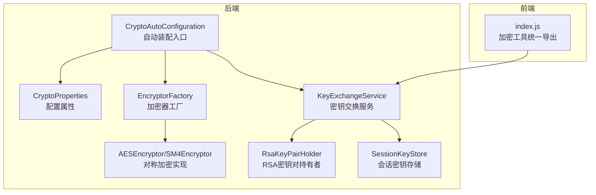
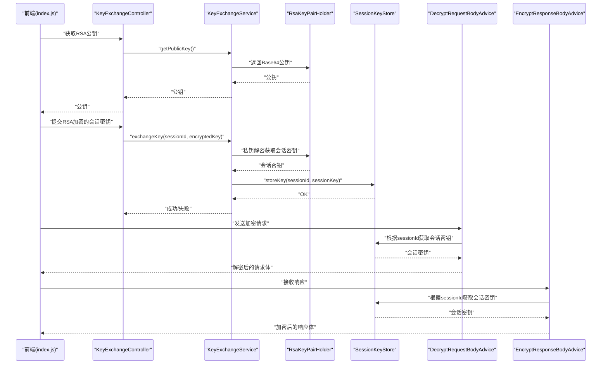
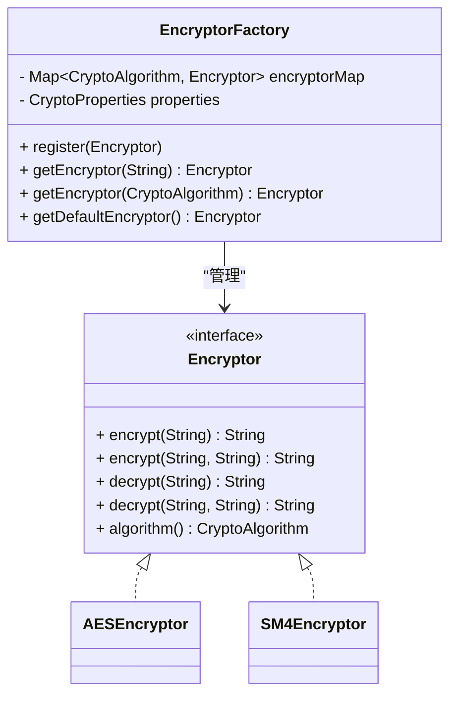
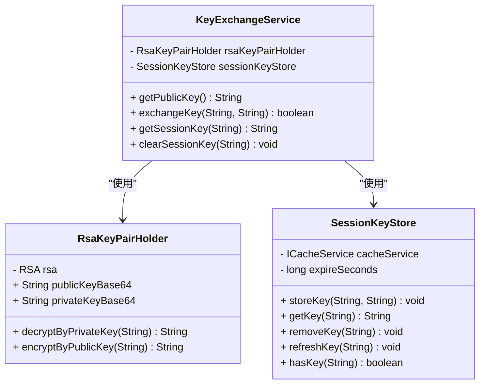
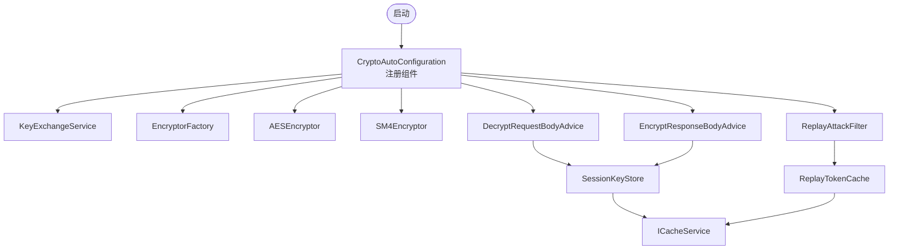
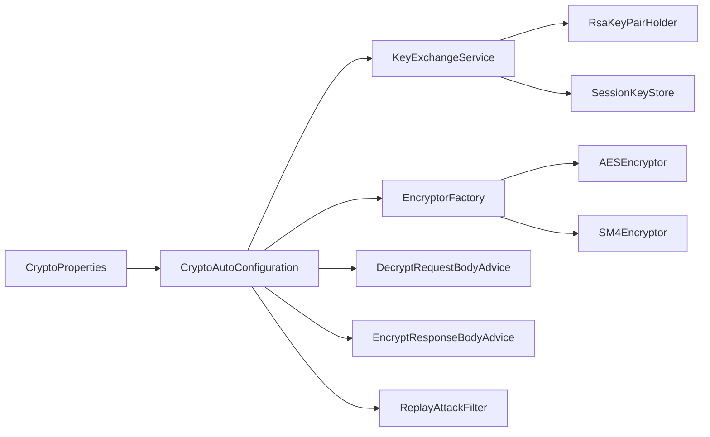

# 加密解密模块

<cite>
**本文引用的文件**
- [CryptoAutoConfiguration.java](file://forge/forge-framework/forge-starter-parent/forge-starter-crypto/src/main/java/com/mdframe/forge/starter/crypto/config/CryptoAutoConfiguration.java)
- [CryptoProperties.java](file://forge/forge-framework/forge-starter-parent/forge-starter-core/src/main/java/com/mdframe/forge/starter/core/context/CryptoProperties.java)
- [EncryptorFactory.java](file://forge/forge-framework/forge-starter-parent/forge-starter-crypto/src/main/java/com/mdframe/forge/starter/crypto/crypto/EncryptorFactory.java)
- [AESEncryptor.java](file://forge/forge-framework/forge-starter-parent/forge-starter-crypto/src/main/java/com/mdframe/forge/starter/crypto/crypto/impl/AESEncryptor.java)
- [SM4Encryptor.java](file://forge/forge-framework/forge-starter-parent/forge-starter-crypto/src/main/java/com/mdframe/forge/starter/crypto/crypto/impl/SM4Encryptor.java)
- [KeyExchangeService.java](file://forge/forge-framework/forge-starter-parent/forge-starter-crypto/src/main/java/com/mdframe/forge/starter/crypto/keyexchange/KeyExchangeService.java)
- [RsaKeyPairHolder.java](file://forge/forge-framework/forge-starter-parent/forge-starter-crypto/src/main/java/com/mdframe/forge/starter/crypto/keyexchange/RsaKeyPairHolder.java)
- [SessionKeyStore.java](file://forge/forge-framework/forge-starter-parent/forge-starter-crypto/src/main/java/com/mdframe/forge/starter/crypto/keyexchange/SessionKeyStore.java)
- [index.js](file://forge-admin-ui/src/utils/crypto/index.js)
</cite>

## 目录
1. [简介](#简介)
2. [项目结构](#项目结构)
3. [核心组件](#核心组件)
4. [架构总览](#架构总览)
5. [组件详解](#组件详解)
6. [依赖关系分析](#依赖关系分析)
7. [性能考量](#性能考量)
8. [故障排查指南](#故障排查指南)
9. [结论](#结论)
10. [附录](#附录)

## 简介
本技术文档面向Forge加密解密模块，系统性解析AES、SM4等对称加密算法的实现与使用；阐述请求体解密、响应体加密的自动装配机制；说明防重放攻击的实现策略；并讲解密钥交换协议的安全机制，包括RSA公私钥对生成、会话密钥管理与加密字段注解的使用方法。文档同时提供完整配置示例、性能优化建议与安全最佳实践。

## 项目结构
加密解密模块由后端Spring Boot自动装配与前端工具库两部分组成：
- 后端：通过自动配置类装配密钥交换、加密器工厂、请求/响应加解密切面、防重放过滤器等核心组件。
- 前端：提供统一的加密工具导出，便于在浏览器侧进行请求加密、响应解密与密钥交换流程调用。

图表来源
- [CryptoAutoConfiguration.java](file://forge/forge-framework/forge-starter-parent/forge-starter-crypto/src/main/java/com/mdframe/forge/starter/crypto/config/CryptoAutoConfiguration.java#L1-L135)
- [CryptoProperties.java](file://forge/forge-framework/forge-starter-parent/forge-starter-core/src/main/java/com/mdframe/forge/starter/core/context/CryptoProperties.java#L1-L91)
- [EncryptorFactory.java](file://forge/forge-framework/forge-starter-parent/forge-starter-crypto/src/main/java/com/mdframe/forge/starter/crypto/crypto/EncryptorFactory.java#L1-L61)
- [AESEncryptor.java](file://forge/forge-framework/forge-starter-parent/forge-starter-crypto/src/main/java/com/mdframe/forge/starter/crypto/crypto/impl/AESEncryptor.java#L1-L108)
- [SM4Encryptor.java](file://forge/forge-framework/forge-starter-parent/forge-starter-crypto/src/main/java/com/mdframe/forge/starter/crypto/crypto/impl/SM4Encryptor.java#L1-L108)
- [KeyExchangeService.java](file://forge/forge-framework/forge-starter-parent/forge-starter-crypto/src/main/java/com/mdframe/forge/starter/crypto/keyexchange/KeyExchangeService.java#L1-L64)
- [RsaKeyPairHolder.java](file://forge/forge-framework/forge-starter-parent/forge-starter-crypto/src/main/java/com/mdframe/forge/starter/crypto/keyexchange/RsaKeyPairHolder.java#L1-L64)
- [SessionKeyStore.java](file://forge/forge-framework/forge-starter-parent/forge-starter-crypto/src/main/java/com/mdframe/forge/starter/crypto/keyexchange/SessionKeyStore.java#L1-L78)
- [index.js](file://forge-admin-ui/src/utils/crypto/index.js#L1-L16)

章节来源
- [CryptoAutoConfiguration.java](file://forge/forge-framework/forge-starter-parent/forge-starter-crypto/src/main/java/com/mdframe/forge/starter/crypto/config/CryptoAutoConfiguration.java#L1-L135)
- [index.js](file://forge-admin-ui/src/utils/crypto/index.js#L1-L16)

## 核心组件
- 配置属性：集中定义加密开关、默认算法、密钥、RSA密钥对、动态密钥、API/字段级加解密开关、防重放策略等。
- 加密器工厂：按算法代码选择具体实现，支持SM4与AES。
- 对称加密实现：AESEncryptor与SM4Encryptor，均支持默认密钥与传入密钥两种模式。
- 密钥交换：RSA公私钥对生成与持有、会话密钥存储与获取、密钥交换接口。
- 自动装配：注册控制器、加密器、请求/响应加解密切面、防重放过滤器。
- 前端工具：统一导出加密/解密函数与密钥交换能力。

章节来源
- [CryptoProperties.java](file://forge/forge-framework/forge-starter-parent/forge-starter-core/src/main/java/com/mdframe/forge/starter/core/context/CryptoProperties.java#L1-L91)
- [EncryptorFactory.java](file://forge/forge-framework/forge-starter-parent/forge-starter-crypto/src/main/java/com/mdframe/forge/starter/crypto/crypto/EncryptorFactory.java#L1-L61)
- [AESEncryptor.java](file://forge/forge-framework/forge-starter-parent/forge-starter-crypto/src/main/java/com/mdframe/forge/starter/crypto/crypto/impl/AESEncryptor.java#L1-L108)
- [SM4Encryptor.java](file://forge/forge-framework/forge-starter-parent/forge-starter-crypto/src/main/java/com/mdframe/forge/starter/crypto/crypto/impl/SM4Encryptor.java#L1-L108)
- [KeyExchangeService.java](file://forge/forge-framework/forge-starter-parent/forge-starter-crypto/src/main/java/com/mdframe/forge/starter/crypto/keyexchange/KeyExchangeService.java#L1-L64)
- [RsaKeyPairHolder.java](file://forge/forge-framework/forge-starter-parent/forge-starter-crypto/src/main/java/com/mdframe/forge/starter/crypto/keyexchange/RsaKeyPairHolder.java#L1-L64)
- [SessionKeyStore.java](file://forge/forge-framework/forge-starter-parent/forge-starter-crypto/src/main/java/com/mdframe/forge/starter/crypto/keyexchange/SessionKeyStore.java#L1-L78)
- [CryptoAutoConfiguration.java](file://forge/forge-framework/forge-starter-parent/forge-starter-crypto/src/main/java/com/mdframe/forge/starter/crypto/config/CryptoAutoConfiguration.java#L1-L135)
- [index.js](file://forge-admin-ui/src/utils/crypto/index.js#L1-L16)

## 架构总览
下图展示加密解密模块在运行时的关键交互：自动装配创建各组件，前端通过密钥交换获取会话密钥，随后请求/响应分别经由请求解密与响应加密切面处理。

图表来源
- [CryptoAutoConfiguration.java](file://forge/forge-framework/forge-starter-parent/forge-starter-crypto/src/main/java/com/mdframe/forge/starter/crypto/config/CryptoAutoConfiguration.java#L37-L109)
- [KeyExchangeService.java](file://forge/forge-framework/forge-starter-parent/forge-starter-crypto/src/main/java/com/mdframe/forge/starter/crypto/keyexchange/KeyExchangeService.java#L17-L54)
- [RsaKeyPairHolder.java](file://forge/forge-framework/forge-starter-parent/forge-starter-crypto/src/main/java/com/mdframe/forge/starter/crypto/keyexchange/RsaKeyPairHolder.java#L39-L62)
- [SessionKeyStore.java](file://forge/forge-framework/forge-starter-parent/forge-starter-crypto/src/main/java/com/mdframe/forge/starter/crypto/keyexchange/SessionKeyStore.java#L26-L67)
- [index.js](file://forge-admin-ui/src/utils/crypto/index.js#L9-L16)

## 组件详解

### 配置属性（CryptoProperties）
- 关键项
  - 开关：是否启用加密、API级加解密、字段级加解密、动态密钥、防重放。
  - 默认算法：SM4或AES。
  - 密钥：默认对称密钥（Base64编码），长度要求因算法而异。
  - RSA密钥对：可配置或自动生成。
  - 会话密钥过期时间：默认2小时。
  - 路径白/黑名单：API加解密与防重放的包含/排除路径。
- 作用：驱动自动装配与运行时行为选择。

章节来源
- [CryptoProperties.java](file://forge/forge-framework/forge-starter-parent/forge-starter-core/src/main/java/com/mdframe/forge/starter/core/context/CryptoProperties.java#L14-L90)

### 加密器工厂（EncryptorFactory）
- 职责：注册并按算法代码获取对应加密器实例。
- 行为：若未显式指定算法，使用配置中的默认算法；未注册对应算法将抛出异常。

图表来源
- [EncryptorFactory.java](file://forge/forge-framework/forge-starter-parent/forge-starter-crypto/src/main/java/com/mdframe/forge/starter/crypto/crypto/EncryptorFactory.java#L10-L61)
- [AESEncryptor.java](file://forge/forge-framework/forge-starter-parent/forge-starter-crypto/src/main/java/com/mdframe/forge/starter/crypto/crypto/impl/AESEncryptor.java#L13-L108)
- [SM4Encryptor.java](file://forge/forge-framework/forge-starter-parent/forge-starter-crypto/src/main/java/com/mdframe/forge/starter/crypto/crypto/impl/SM4Encryptor.java#L13-L108)

章节来源
- [EncryptorFactory.java](file://forge/forge-framework/forge-starter-parent/forge-starter-crypto/src/main/java/com/mdframe/forge/starter/crypto/crypto/EncryptorFactory.java#L1-L61)

### 对称加密实现（AESEncryptor、SM4Encryptor）
- AESEncryptor
  - 支持16/24/32字节密钥长度。
  - 提供默认密钥与传入密钥两种加密/解密方式。
- SM4Encryptor
  - 国密算法，要求16字节密钥。
  - 提供默认密钥与传入密钥两种加密/解密方式。
- 共同点：均以Base64编码的密钥输入，内部转换为字节数组；异常时记录错误并抛出运行时异常。

章节来源
- [AESEncryptor.java](file://forge/forge-framework/forge-starter-parent/forge-starter-crypto/src/main/java/com/mdframe/forge/starter/crypto/crypto/impl/AESEncryptor.java#L1-L108)
- [SM4Encryptor.java](file://forge/forge-framework/forge-starter-parent/forge-starter-crypto/src/main/java/com/mdframe/forge/starter/crypto/crypto/impl/SM4Encryptor.java#L1-L108)

### 密钥交换与会话密钥管理
- RSA密钥对持有者（RsaKeyPairHolder）
  - 自动生成或从配置加载RSA公私钥对。
  - 提供使用私钥解密与使用公钥加密的能力。
- 会话密钥存储（SessionKeyStore）
  - 使用缓存服务存储会话密钥，带过期时间。
  - 提供存储、获取、删除、刷新与存在性检查。
- 密钥交换服务（KeyExchangeService）
  - 对外暴露获取公钥、执行密钥交换、获取/清除会话密钥。

图表来源
- [RsaKeyPairHolder.java](file://forge/forge-framework/forge-starter-parent/forge-starter-crypto/src/main/java/com/mdframe/forge/starter/crypto/keyexchange/RsaKeyPairHolder.java#L10-L64)
- [SessionKeyStore.java](file://forge/forge-framework/forge-starter-parent/forge-starter-crypto/src/main/java/com/mdframe/forge/starter/crypto/keyexchange/SessionKeyStore.java#L9-L78)
- [KeyExchangeService.java](file://forge/forge-framework/forge-starter-parent/forge-starter-crypto/src/main/java/com/mdframe/forge/starter/crypto/keyexchange/KeyExchangeService.java#L6-L64)

章节来源
- [RsaKeyPairHolder.java](file://forge/forge-framework/forge-starter-parent/forge-starter-crypto/src/main/java/com/mdframe/forge/starter/crypto/keyexchange/RsaKeyPairHolder.java#L1-L64)
- [SessionKeyStore.java](file://forge/forge-framework/forge-starter-parent/forge-starter-crypto/src/main/java/com/mdframe/forge/starter/crypto/keyexchange/SessionKeyStore.java#L1-L78)
- [KeyExchangeService.java](file://forge/forge-framework/forge-starter-parent/forge-starter-crypto/src/main/java/com/mdframe/forge/starter/crypto/keyexchange/KeyExchangeService.java#L1-L64)

### 请求解密与响应加密自动装配
- 自动装配入口（CryptoAutoConfiguration）
  - 注册密钥交换控制器与服务。
  - 注册RSA密钥对持有者（可从配置加载）。
  - 条件注册会话密钥存储（需具备缓存服务）。
  - 注册加密器工厂与AESEncryptor、SM4Encryptor。
  - 注册请求解密与响应加密切面（可选动态密钥支持）。
  - 条件注册防重放令牌缓存与过滤器（需具备缓存服务）。
- 运行时行为
  - 请求解密：在进入控制器前，基于会话ID获取会话密钥，解密请求体。
  - 响应加密：在返回响应前，基于会话ID获取会话密钥，加密响应体。

图表来源
- [CryptoAutoConfiguration.java](file://forge/forge-framework/forge-starter-parent/forge-starter-crypto/src/main/java/com/mdframe/forge/starter/crypto/config/CryptoAutoConfiguration.java#L37-L133)

章节来源
- [CryptoAutoConfiguration.java](file://forge/forge-framework/forge-starter-parent/forge-starter-crypto/src/main/java/com/mdframe/forge/starter/crypto/config/CryptoAutoConfiguration.java#L1-L135)

### 防重放攻击实现策略
- 组件
  - ReplayTokenCache：基于缓存的令牌存储。
  - ReplayAttackFilter：全局过滤器，基于时间窗口与路径规则校验请求重复性。
- 规则
  - 可配置包含/排除路径、时间窗口大小。
  - 通过缓存记录已出现的请求标识，在时间窗口内重复即判定为重放。

章节来源
- [CryptoAutoConfiguration.java](file://forge/forge-framework/forge-starter-parent/forge-starter-crypto/src/main/java/com/mdframe/forge/starter/crypto/config/CryptoAutoConfiguration.java#L113-L133)
- [CryptoProperties.java](file://forge/forge-framework/forge-starter-parent/forge-starter-core/src/main/java/com/mdframe/forge/starter/core/context/CryptoProperties.java#L66-L89)

### 前端加密工具与密钥交换
- 统一导出
  - 配置与匹配：cryptoConfig、updateCryptoConfig、shouldEncrypt、matchPath。
  - 对称加密：sm4Encrypt/sm4Decrypt、aesEncrypt/aesDecrypt。
  - 密钥交换：fetchPublicKey、exchangeKey、getSessionKey、isKeyExchanged、resetKeyExchange、initKeyExchange。
- 使用建议
  - 在发起业务请求前完成密钥交换，确保会话密钥可用。
  - 对敏感字段采用字段级加解密（结合后端注解与序列化器）。

章节来源
- [index.js](file://forge-admin-ui/src/utils/crypto/index.js#L1-L16)

## 依赖关系分析
- 组件耦合
  - CryptoAutoConfiguration是装配中枢，依赖配置属性、缓存服务、API配置管理器等。
  - KeyExchangeService依赖RSA密钥对持有者与会话密钥存储。
  - EncryptorFactory依赖配置属性与具体加密器实现。
- 外部依赖
  - 缓存服务（ICacheService）：用于会话密钥与防重放令牌持久化。
  - Jackson/ObjectMapper：用于JSON序列化/反序列化场景下的字段级加解密。
- 循环依赖风险
  - 当前设计通过条件装配与分层职责避免循环依赖。

图表来源
- [CryptoAutoConfiguration.java](file://forge/forge-framework/forge-starter-parent/forge-starter-crypto/src/main/java/com/mdframe/forge/starter/crypto/config/CryptoAutoConfiguration.java#L1-L135)
- [CryptoProperties.java](file://forge/forge-framework/forge-starter-parent/forge-starter-core/src/main/java/com/mdframe/forge/starter/core/context/CryptoProperties.java#L1-L91)

章节来源
- [CryptoAutoConfiguration.java](file://forge/forge-framework/forge-starter-parent/forge-starter-crypto/src/main/java/com/mdframe/forge/starter/crypto/config/CryptoAutoConfiguration.java#L1-L135)

## 性能考量
- 算法选择
  - SM4：国密算法，适合国内合规场景；AES：通用性强，生态成熟。
- 密钥管理
  - 优先使用动态密钥（会话密钥）降低静态密钥泄露风险；默认密钥仅作为降级方案。
- 缓存策略
  - 会话密钥与防重放令牌均依赖缓存，建议使用高性能缓存并合理设置过期时间。
- 序列化开销
  - 字段级加解密涉及JSON序列化/反序列化，建议在高频接口中谨慎使用或进行批量处理。
- 并发与线程安全
  - 加密器实现为无状态对象，工厂与存储组件需保证并发安全。

## 故障排查指南
- 默认密钥未配置
  - 现象：对称加密器在未配置默认密钥时抛出异常。
  - 处理：在配置中提供Base64编码的默认密钥，并满足长度要求。
- 密钥长度不合法
  - 现象：AES密钥长度必须为16/24/32字节；SM4密钥长度必须为16字节。
  - 处理：检查密钥生成与编码流程，确保长度正确。
- 密钥交换失败
  - 现象：密钥交换返回失败。
  - 处理：确认RSA私钥正确、前端使用正确的公钥加密、会话ID一致且缓存可用。
- 会话密钥缺失
  - 现象：请求/响应加解密无法获取会话密钥。
  - 处理：检查密钥交换流程是否已完成、缓存键前缀与过期时间配置。
- 防重放误判
  - 现象：正常请求被判定为重放。
  - 处理：调整时间窗口、检查路径包含/排除规则、核对请求标识生成逻辑。

章节来源
- [AESEncryptor.java](file://forge/forge-framework/forge-starter-parent/forge-starter-crypto/src/main/java/com/mdframe/forge/starter/crypto/crypto/impl/AESEncryptor.java#L27-L34)
- [SM4Encryptor.java](file://forge/forge-framework/forge-starter-parent/forge-starter-crypto/src/main/java/com/mdframe/forge/starter/crypto/crypto/impl/SM4Encryptor.java#L27-L34)
- [KeyExchangeService.java](file://forge/forge-framework/forge-starter-parent/forge-starter-crypto/src/main/java/com/mdframe/forge/starter/crypto/keyexchange/KeyExchangeService.java#L31-L45)
- [SessionKeyStore.java](file://forge/forge-framework/forge-starter-parent/forge-starter-crypto/src/main/java/com/mdframe/forge/starter/crypto/keyexchange/SessionKeyStore.java#L31-L46)
- [CryptoAutoConfiguration.java](file://forge/forge-framework/forge-starter-parent/forge-starter-crypto/src/main/java/com/mdframe/forge/starter/crypto/config/CryptoAutoConfiguration.java#L113-L133)

## 结论
Forge加密解密模块通过自动装配将RSA密钥交换、对称加密器、请求/响应加解密与防重放策略有机整合。后端提供灵活的配置与动态密钥管理，前端提供便捷的工具导出，共同构建起安全、可扩展的传输加密体系。建议在生产环境启用动态密钥与防重放，并结合缓存性能与合规要求选择合适的算法与密钥长度。

## 附录

### 配置示例（YAML）
- 基础开关与算法
  - forge.crypto.enabled=true
  - forge.crypto.algorithm=SM4
- 默认密钥（Base64编码）
  - forge.crypto.secretKey=<你的密钥>
- 动态密钥与会话
  - forge.crypto.enableDynamicKey=true
  - forge.crypto.sessionKeyExpire=7200
- RSA密钥对（可选，不配置则自动生成）
  - forge.crypto.rsaPublicKey=<Base64公钥>
  - forge.crypto.rsaPrivateKey=<Base64私钥>
- API/字段级加解密
  - forge.crypto.enableApiCrypto=true
  - forge.crypto.enableFieldCrypto=true
- 防重放
  - forge.crypto.enableReplayProtection=false
  - forge.crypto.replayTimeWindow=300
  - forge.crypto.replayIncludePaths=[]
  - forge.crypto.replayExcludePaths=[]
  - forge.crypto.excludePaths=[]

章节来源
- [CryptoProperties.java](file://forge/forge-framework/forge-starter-parent/forge-starter-core/src/main/java/com/mdframe/forge/starter/core/context/CryptoProperties.java#L14-L90)

### 安全最佳实践
- 密钥管理
  - 使用动态密钥，定期轮换；默认密钥仅作降级使用。
  - RSA密钥对妥善保管，避免泄露私钥。
- 算法选择
  - 国际场景优先AES；国内合规场景可选用SM4。
- 缓存与超时
  - 设置合理的会话密钥过期时间；开启缓存清理策略。
- 路径与字段控制
  - 仅对敏感接口与字段启用加解密；避免过度加密导致性能下降。
- 防重放
  - 明确包含/排除路径；合理设置时间窗口；确保请求标识唯一性。