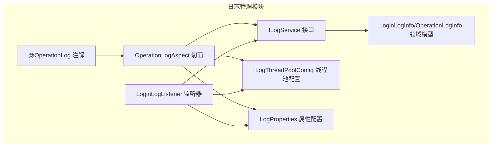
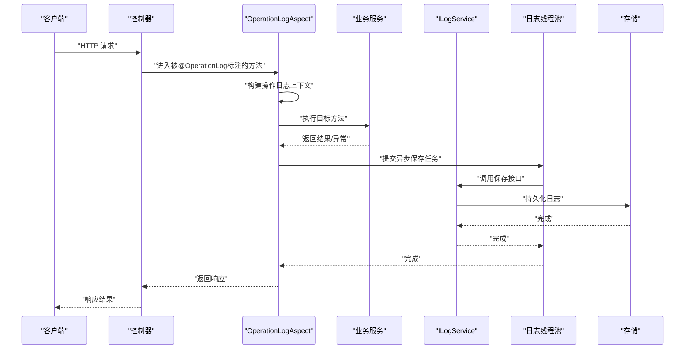
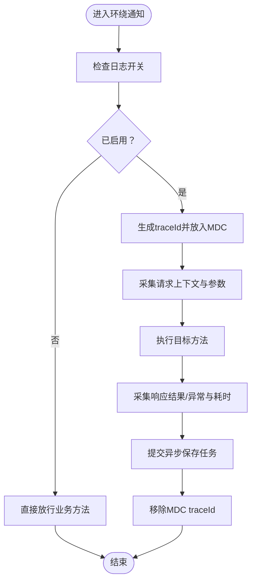
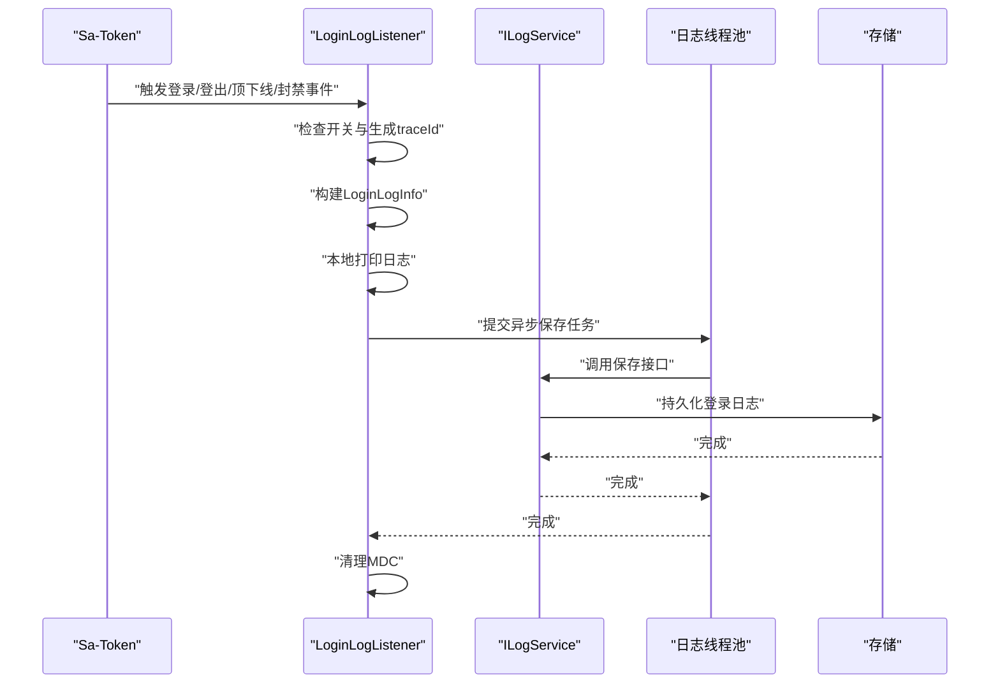
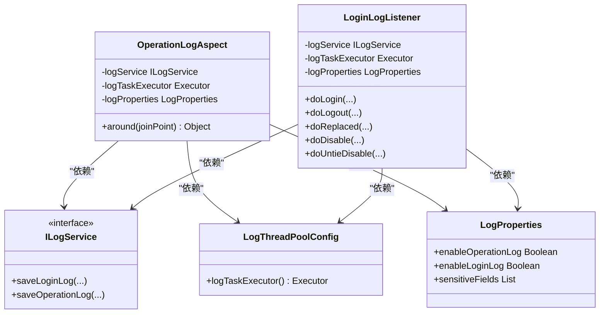

# 日志管理模块

<cite>
**本文档引用的文件**
- [OperationLogAspect.java](file://forge/forge-framework/forge-starter-parent/forge-starter-log/src/main/java/com/mdframe/forge/starter/log/aspect/OperationLogAspect.java)
- [LoginLogListener.java](file://forge/forge-framework/forge-starter-parent/forge-starter-log/src/main/java/com/mdframe/forge/starter/log/listener/LoginLogListener.java)
- [ILogService.java](file://forge/forge-framework/forge-starter-parent/forge-starter-log/src/main/java/com/mdframe/forge/starter/log/service/ILogService.java)
- [LogThreadPoolConfig.java](file://forge/forge-framework/forge-starter-parent/forge-starter-log/src/main/java/com/mdframe/forge/starter/log/config/LogThreadPoolConfig.java)
- [LoginLogInfo.java](file://forge/forge-framework/forge-starter-parent/forge-starter-log/src/main/java/com/mdframe/forge/starter/log/domain/LoginLogInfo.java)
- [OperationLogInfo.java](file://forge/forge-framework/forge-starter-parent/forge-starter-log/src/main/java/com/mdframe/forge/starter/log/domain/OperationLogInfo.java)
- [LogProperties.java](file://forge/forge-framework/forge-starter-parent/forge-starter-log/src/main/java/com/mdframe/forge/starter/log/config/LogProperties.java)
- [ILogService.java](file://forge/forge-framework/forge-starter-parent/forge-starter-core/src/main/java/com/mdframe/forge/starter/core/service/ILogService.java)
- [OperationLog.java](file://forge/forge-framework/forge-starter-parent/forge-starter-core/src/main/java/com/mdframe/forge/starter/core/annotation/log/OperationLog.java)
</cite>

## 目录
1. [简介](#简介)
2. [项目结构](#项目结构)
3. [核心组件](#核心组件)
4. [架构总览](#架构总览)
5. [详细组件分析](#详细组件分析)
6. [依赖关系分析](#依赖关系分析)
7. [性能考虑](#性能考虑)
8. [故障排查指南](#故障排查指南)
9. [结论](#结论)
10. [附录](#附录)

## 简介
本文件为Forge日志管理模块的技术文档，聚焦于操作日志与登录日志的自动记录机制，系统性阐述@OperationLog注解的使用方式与日志切面实现原理；同时说明日志异步处理、线程池配置与日志存储策略，并提供日志查询、统计分析与审计追踪的实现方案，涵盖日志过滤、敏感信息脱敏与性能优化建议。

## 项目结构
日志管理模块位于forge-starter-log子模块中，采用分层设计：
- 注解层：定义@OperationLog注解，用于标记需要记录操作日志的方法或类
- 切面层：通过AOP拦截标注@OperationLog的控制器方法，生成并异步保存操作日志
- 监听器层：基于Sa-Token事件监听登录、登出、顶下线、封禁等生命周期事件，异步落库
- 领域模型层：封装登录日志与操作日志的数据结构
- 配置层：提供日志开关、异步线程池配置与属性配置
- 服务接口层：统一的日志持久化接口，便于扩展不同存储后端

图表来源
- [OperationLogAspect.java](file://forge/forge-framework/forge-starter-parent/forge-starter-log/src/main/java/com/mdframe/forge/starter/log/aspect/OperationLogAspect.java#L34-L70)
- [LoginLogListener.java](file://forge/forge-framework/forge-starter-parent/forge-starter-log/src/main/java/com/mdframe/forge/starter/log/listener/LoginLogListener.java#L40-L211)
- [ILogService.java](file://forge/forge-framework/forge-starter-parent/forge-starter-log/src/main/java/com/mdframe/forge/starter/log/service/ILogService.java)
- [LogThreadPoolConfig.java](file://forge/forge-framework/forge-starter-parent/forge-starter-log/src/main/java/com/mdframe/forge/starter/log/config/LogThreadPoolConfig.java)
- [LoginLogInfo.java](file://forge/forge-framework/forge-starter-parent/forge-starter-log/src/main/java/com/mdframe/forge/starter/log/domain/LoginLogInfo.java)
- [OperationLogInfo.java](file://forge/forge-framework/forge-starter-parent/forge-starter-log/src/main/java/com/mdframe/forge/starter/log/domain/OperationLogInfo.java)
- [LogProperties.java](file://forge/forge-framework/forge-starter-parent/forge-starter-log/src/main/java/com/mdframe/forge/starter/log/config/LogProperties.java)

章节来源
- [OperationLogAspect.java](file://forge/forge-framework/forge-starter-parent/forge-starter-log/src/main/java/com/mdframe/forge/starter/log/aspect/OperationLogAspect.java#L34-L70)
- [LoginLogListener.java](file://forge/forge-framework/forge-starter-parent/forge-starter-log/src/main/java/com/mdframe/forge/starter/log/listener/LoginLogListener.java#L40-L211)

## 核心组件
- @OperationLog注解：用于标记需要记录操作日志的方法或类，结合切面进行拦截与记录
- OperationLogAspect切面：环绕通知拦截标注@OperationLog的控制器方法，收集请求上下文、参数、响应结果与耗时，异步写入日志
- LoginLogListener监听器：基于Sa-Token事件回调，记录登录、登出、顶下线、封禁/解封等关键事件
- ILogService接口：抽象日志持久化能力，支持扩展至数据库、消息队列、文件等多种存储
- LogThreadPoolConfig线程池：为日志异步处理提供专用线程池，避免阻塞业务线程
- 领域模型：LoginLogInfo与OperationLogInfo分别承载登录日志与操作日志的结构化数据
- LogProperties：集中式日志配置项（如开关、字段脱敏规则、存储策略等）

章节来源
- [OperationLog.java](file://forge/forge-framework/forge-starter-parent/forge-starter-core/src/main/java/com/mdframe/forge/starter/core/annotation/log/OperationLog.java)
- [OperationLogAspect.java](file://forge/forge-framework/forge-starter-parent/forge-starter-log/src/main/java/com/mdframe/forge/starter/log/aspect/OperationLogAspect.java#L34-L70)
- [LoginLogListener.java](file://forge/forge-framework/forge-starter-parent/forge-starter-log/src/main/java/com/mdframe/forge/starter/log/listener/LoginLogListener.java#L40-L211)
- [ILogService.java](file://forge/forge-framework/forge-starter-parent/forge-starter-log/src/main/java/com/mdframe/forge/starter/log/service/ILogService.java)
- [LogThreadPoolConfig.java](file://forge/forge-framework/forge-starter-parent/forge-starter-log/src/main/java/com/mdframe/forge/starter/log/config/LogThreadPoolConfig.java)
- [LoginLogInfo.java](file://forge/forge-framework/forge-starter-parent/forge-starter-log/src/main/java/com/mdframe/forge/starter/log/domain/LoginLogInfo.java)
- [OperationLogInfo.java](file://forge/forge-framework/forge-starter-parent/forge-starter-log/src/main/java/com/mdframe/forge/starter/log/domain/OperationLogInfo.java)
- [LogProperties.java](file://forge/forge-framework/forge-starter-parent/forge-starter-log/src/main/java/com/mdframe/forge/starter/log/config/LogProperties.java)

## 架构总览
日志管理模块通过“注解+切面”实现操作日志自动化采集，通过“事件监听”实现登录日志自动化采集，二者均采用异步落库策略，降低对主业务的影响。

图表来源
- [OperationLogAspect.java](file://forge/forge-framework/forge-starter-parent/forge-starter-log/src/main/java/com/mdframe/forge/starter/log/aspect/OperationLogAspect.java#L34-L70)
- [ILogService.java](file://forge/forge-framework/forge-starter-parent/forge-starter-log/src/main/java/com/mdframe/forge/starter/log/service/ILogService.java)
- [LogThreadPoolConfig.java](file://forge/forge-framework/forge-starter-parent/forge-starter-log/src/main/java/com/mdframe/forge/starter/log/config/LogThreadPoolConfig.java)

## 详细组件分析

### @OperationLog注解与使用方法
- 作用域：可标注在类或方法上，表示该类或方法产生的操作行为需要被记录
- 使用建议：
  - 对涉及数据变更（新增、修改、删除）的接口建议标注
  - 对高风险操作（权限变更、敏感配置修改）必须标注
  - 对批量操作或高频接口谨慎标注，避免日志风暴
- 与切面配合：切面会根据注解的存在决定是否拦截与记录

章节来源
- [OperationLog.java](file://forge/forge-framework/forge-starter-parent/forge-starter-core/src/main/java/com/mdframe/forge/starter/core/annotation/log/OperationLog.java)

### OperationLogAspect切面实现原理
- 切点定义：当前实现采用拦截所有控制器类或接口，后续可按需调整为仅拦截@OperationLog标注的方法
- 环绕通知流程：
  - 启用检查：若全局开关关闭，则直接放行
  - 上下文准备：生成traceId并放入MDC，便于跨模块关联
  - 参数采集：获取请求参数、用户信息、IP、UA等
  - 执行目标：调用业务方法
  - 结果采集：记录响应状态、异常信息、耗时
  - 异步保存：提交到专用线程池，调用ILogService保存
  - 清理收尾：移除MDC中的traceId
- 关键点：
  - 异步化：避免阻塞主线程，提升接口吞吐
  - 脱敏策略：对敏感字段（如密码、密钥）在入库前进行脱敏
  - 过滤策略：对非关键接口或低价值请求可选择跳过记录

图表来源
- [OperationLogAspect.java](file://forge/forge-framework/forge-starter-parent/forge-starter-log/src/main/java/com/mdframe/forge/starter/log/aspect/OperationLogAspect.java#L34-L70)

章节来源
- [OperationLogAspect.java](file://forge/forge-framework/forge-starter-parent/forge-starter-log/src/main/java/com/mdframe/forge/starter/log/aspect/OperationLogAspect.java#L34-L70)

### LoginLogListener登录日志监听机制
- 触发场景：
  - 登录成功：记录登录类型、用户标识、登录结果与描述
  - 登出：记录登出事件
  - 被顶下线：记录顶替下线事件
  - 账号封禁/解封：记录封禁与解封事件
- 处理流程：
  - 开关检查：若全局开关关闭则直接返回
  - traceId生成：为每条登录日志生成唯一标识并放入MDC
  - 构建日志：填充登录日志信息
  - 打印与异步保存：先本地打印，再提交异步任务持久化
  - 异常兜底：捕获异常并记录错误日志，确保不中断登录流程
  - 清理：移除MDC中的traceId

图表来源
- [LoginLogListener.java](file://forge/forge-framework/forge-starter-parent/forge-starter-log/src/main/java/com/mdframe/forge/starter/log/listener/LoginLogListener.java#L40-L211)
- [ILogService.java](file://forge/forge-framework/forge-starter-parent/forge-starter-log/src/main/java/com/mdframe/forge/starter/log/service/ILogService.java)
- [LogThreadPoolConfig.java](file://forge/forge-framework/forge-starter-parent/forge-starter-log/src/main/java/com/mdframe/forge/starter/log/config/LogThreadPoolConfig.java)

章节来源
- [LoginLogListener.java](file://forge/forge-framework/forge-starter-parent/forge-starter-log/src/main/java/com/mdframe/forge/starter/log/listener/LoginLogListener.java#L40-L211)

### ILogService接口与存储策略
- 职责：抽象日志持久化能力，支持多种实现（内存、数据库、消息队列、文件）
- 建议实现：
  - 数据库存储：适合审计与合规要求高的场景
  - 消息队列：适合高并发与削峰填谷
  - 文件存储：适合离线分析与归档
- 扩展点：通过替换实现类即可切换存储后端，不影响上层使用

章节来源
- [ILogService.java](file://forge/forge-framework/forge-starter-parent/forge-starter-log/src/main/java/com/mdframe/forge/starter/log/service/ILogService.java)

### LogThreadPoolConfig线程池配置
- 目标：为日志异步处理提供独立线程池，避免与业务线程争抢资源
- 关键配置项（示例维度）：
  - 核心线程数：根据峰值QPS与单条日志处理耗时估算
  - 最大线程数：防止突发流量导致线程暴涨
  - 队列长度：平衡内存占用与背压能力
  - 拒绝策略：记录拒绝日志并报警
  - 线程名称前缀：便于问题定位
- 建议：结合压测结果动态调优，监控队列积压与线程利用率

章节来源
- [LogThreadPoolConfig.java](file://forge/forge-framework/forge-starter-parent/forge-starter-log/src/main/java/com/mdframe/forge/starter/log/config/LogThreadPoolConfig.java)

### 领域模型：LoginLogInfo与OperationLogInfo
- LoginLogInfo：包含登录类型、用户标识、登录结果、描述、时间戳、traceId等
- OperationLogInfo：包含操作模块、操作类型、请求参数摘要、响应状态、异常信息、耗时、traceId等
- 设计要点：
  - 字段精简：仅保留必要字段，避免冗余
  - 可检索性：为常用查询条件建立索引
  - 版本兼容：预留扩展字段以适配未来需求

章节来源
- [LoginLogInfo.java](file://forge/forge-framework/forge-starter-parent/forge-starter-log/src/main/java/com/mdframe/forge/starter/log/domain/LoginLogInfo.java)
- [OperationLogInfo.java](file://forge/forge-framework/forge-starter-parent/forge-starter-log/src/main/java/com/mdframe/forge/starter/log/domain/OperationLogInfo.java)

### 日志配置：LogProperties
- 主要配置项（示例维度）：
  - enableOperationLog：是否启用操作日志
  - enableLoginLog：是否启用登录日志
  - sensitiveFields：敏感字段白名单（用于脱敏）
  - retentionDays：日志保留天数
  - asyncThresholdMs：超过阈值才异步记录（可选）
- 建议：通过环境变量或配置中心动态调整，避免重启

章节来源
- [LogProperties.java](file://forge/forge-framework/forge-starter-parent/forge-starter-log/src/main/java/com/mdframe/forge/starter/log/config/LogProperties.java)

## 依赖关系分析
- 组件耦合：
  - 切面依赖ILogService与线程池，耦合度适中
  - 监听器同样依赖ILogService与线程池，彼此独立
  - 注解与切面存在编译期依赖，运行时通过Spring AOP生效
- 外部依赖：
  - Sa-Token事件机制用于登录日志
  - Spring AOP用于操作日志
  - 日志框架（如Logback）用于本地打印与MDC

图表来源
- [OperationLogAspect.java](file://forge/forge-framework/forge-starter-parent/forge-starter-log/src/main/java/com/mdframe/forge/starter/log/aspect/OperationLogAspect.java#L34-L70)
- [LoginLogListener.java](file://forge/forge-framework/forge-starter-parent/forge-starter-log/src/main/java/com/mdframe/forge/starter/log/listener/LoginLogListener.java#L40-L211)
- [ILogService.java](file://forge/forge-framework/forge-starter-parent/forge-starter-log/src/main/java/com/mdframe/forge/starter/log/service/ILogService.java)
- [LogThreadPoolConfig.java](file://forge/forge-framework/forge-starter-parent/forge-starter-log/src/main/java/com/mdframe/forge/starter/log/config/LogThreadPoolConfig.java)
- [LogProperties.java](file://forge/forge-framework/forge-starter-parent/forge-starter-log/src/main/java/com/mdframe/forge/starter/log/config/LogProperties.java)

## 性能考虑
- 异步化优先：所有日志写入均通过线程池异步执行，避免阻塞业务线程
- 采样与阈值：对高频接口可设置采样率或耗时阈值，仅记录慢请求
- 脱敏与裁剪：对超长参数与敏感字段进行脱敏与截断，减少IO与存储压力
- 批量写入：在满足时效性的前提下合并写入，降低数据库压力
- 缓存与降级：极端情况下可降级为文件或标准输出，保证系统可用性
- 监控告警：监控线程池队列长度、拒绝次数、写入延迟等指标

## 故障排查指南
- 症状：登录日志未记录
  - 检查LogProperties中enableLoginLog开关
  - 确认LoginLogListener已注册并生效
  - 查看异步线程池是否正常工作
- 症状：操作日志未记录
  - 检查@OperationLog注解是否正确标注
  - 确认切面扫描范围与AOP代理生效
  - 检查LogProperties中enableOperationLog开关
- 症状：日志丢失或乱序
  - 检查MDC traceId生成与清理逻辑
  - 核对线程池配置与拒绝策略
- 症状：性能抖动
  - 分析线程池队列积压与线程利用率
  - 评估脱敏与裁剪策略是否合理
  - 调整采样率或阈值

章节来源
- [LoginLogListener.java](file://forge/forge-framework/forge-starter-parent/forge-starter-log/src/main/java/com/mdframe/forge/starter/log/listener/LoginLogListener.java#L40-L211)
- [OperationLogAspect.java](file://forge/forge-framework/forge-starter-parent/forge-starter-log/src/main/java/com/mdframe/forge/starter/log/aspect/OperationLogAspect.java#L34-L70)
- [LogThreadPoolConfig.java](file://forge/forge-framework/forge-starter-parent/forge-starter-log/src/main/java/com/mdframe/forge/starter/log/config/LogThreadPoolConfig.java)

## 结论
Forge日志管理模块通过注解驱动与事件监听相结合的方式，实现了操作日志与登录日志的自动化采集与异步落库。其模块化设计与接口抽象便于扩展与演进，配合完善的配置与监控体系，能够满足生产环境对审计、分析与合规的需求。

## 附录
- 日志查询建议：
  - 基于traceId进行跨模块关联查询
  - 基于用户、模块、时间、操作类型、结果状态等多维过滤
- 统计分析建议：
  - 按日/周/月统计操作量与失败率
  - 分析热点接口与慢操作TopN
  - 识别异常登录模式与高危操作
- 审计追踪建议：
  - 保留完整链路日志与回溯证据
  - 对敏感操作增加二次确认与审批流
  - 定期归档与清理，遵守数据生命周期管理