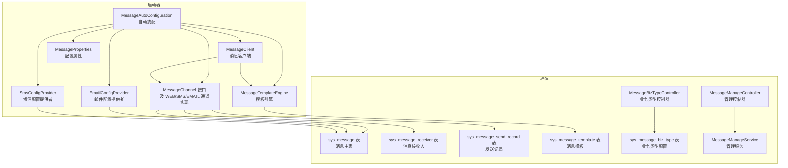
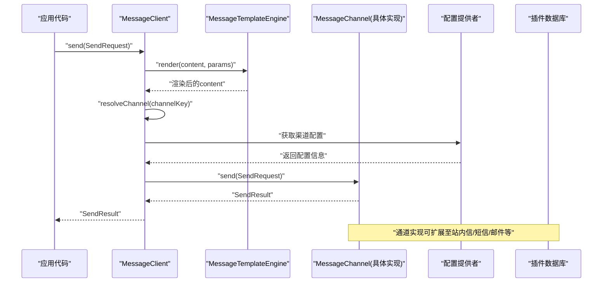
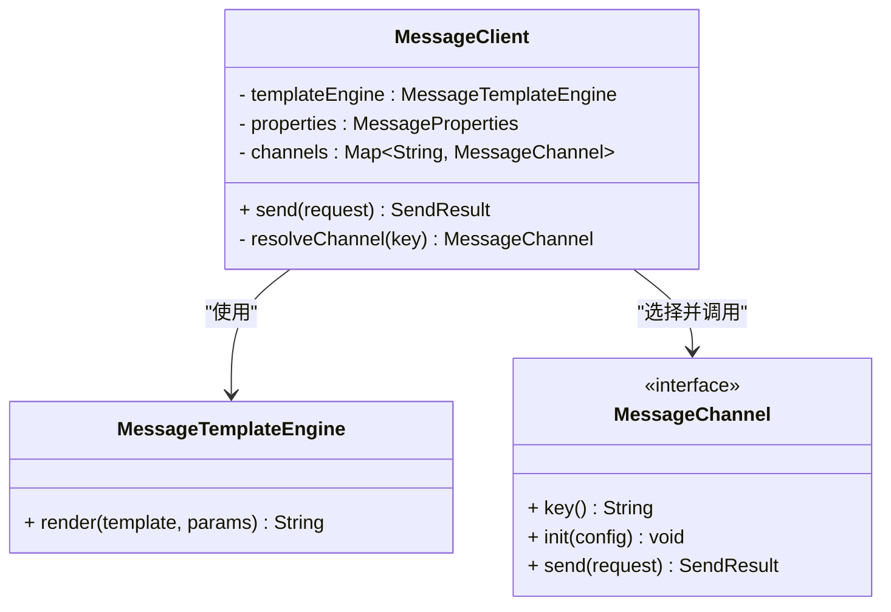
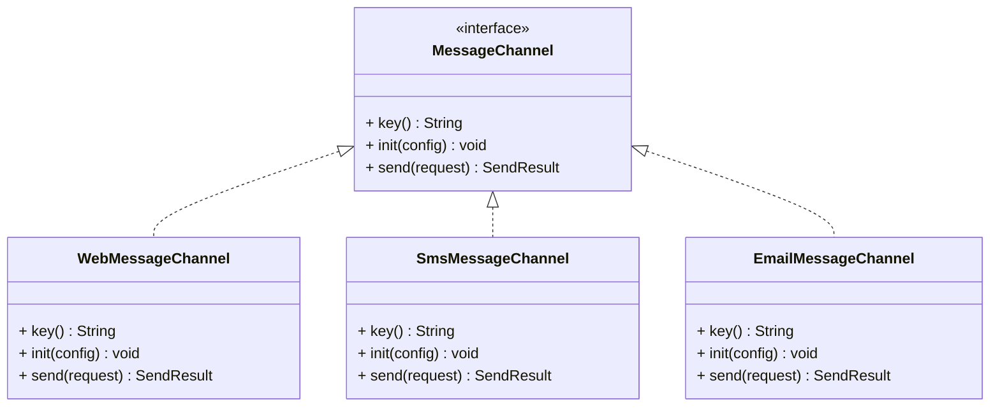
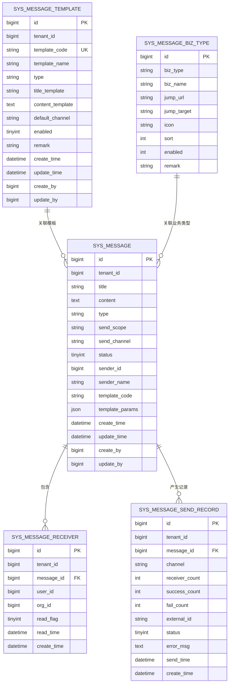
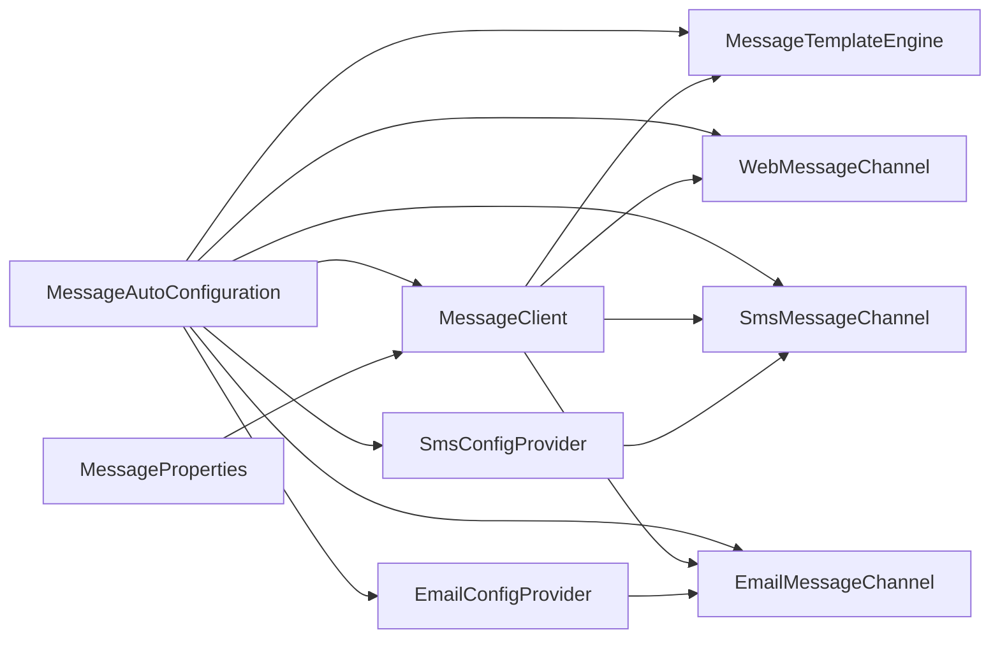

# 消息通知模块

<cite>
**本文引用的文件**
- [MessageAutoConfiguration.java](file://forge/forge-framework/forge-starter-parent/forge-starter-message/src/main/java/com/mdframe/forge/starter/message/config/MessageAutoConfiguration.java)
- [MessageProperties.java](file://forge/forge-framework/forge-starter-parent/forge-starter-message/src/main/java/com/mdframe/forge/starter/message/config/MessageProperties.java)
- [MessageClient.java](file://forge/forge-framework/forge-starter-parent/forge-starter-message/src/main/java/com/mdframe/forge/starter/message/sdk/MessageClient.java)
- [MessageTemplateEngine.java](file://forge/forge-framework/forge-starter-parent/forge-starter-message/src/main/java/com/mdframe/forge/starter/message/service/MessageTemplateEngine.java)
- [MessageChannel.java（接口）](file://forge/forge-framework/forge-starter-parent/forge-starter-message/src/main/java/com/mdframe/forge/starter/message/channel/MessageChannel.java)
- [WebMessageChannel.java](file://forge/forge-framework/forge-starter-parent/forge-starter-message/src/main/java/com/mdframe/forge/starter/message/channel/WebMessageChannel.java)
- [SmsMessageChannel.java](file://forge/forge-framework/forge-starter-parent/forge-starter-message/src/main/java/com/mdframe/forge/starter/message/channel/SmsMessageChannel.java)
- [EmailMessageChannel.java](file://forge/forge-framework/forge-starter-parent/forge-starter-message/src/main/java/com/mdframe/forge/starter/message/channel/EmailMessageChannel.java)
- [EmailConfigProvider.java](file://forge/forge-framework/forge-starter-parent/forge-starter-message/src/main/java/com/mdframe/forge/starter/message/config/EmailConfigProvider.java)
- [SmsConfigProvider.java](file://forge/forge-framework/forge-starter-parent/forge-starter-message/src/main/java/com/mdframe/forge/starter/message/config/SmsConfigProvider.java)
- [ChannelType.java](file://forge/forge-framework/forge-starter-parent/forge-starter-message/src/main/java/com/mdframe/forge/starter/message/channel/ChannelType.java)
- [MessageManageController.java](file://forge/forge-framework/forge-plugin-parent/forge-plugin-message/src/main/java/com/mdframe/forge/plugin/message/controller/MessageManageController.java)
- [MessageManageService.java](file://forge/forge-framework/forge-plugin-parent/forge-plugin-message/src/main/java/com/mdframe/forge/plugin/message/service/MessageManageService.java)
- [MessageManageServiceImpl.java](file://forge/forge-framework/forge-plugin-parent/forge-plugin-message/src/main/java/com/mdframe/forge/plugin/message/service/impl/MessageManageServiceImpl.java)
- [SysMessageBizType.java](file://forge/forge-framework/forge-plugin-parent/forge-plugin-message/src/main/java/com/mdframe/forge/plugin/message/domain/entity/SysMessageBizType.java)
- [SysMessageTemplate.java](file://forge/forge-framework/forge-plugin-parent/forge-plugin-message/src/main/java/com/mdframe/forge/plugin/message/domain/entity/SysMessageTemplate.java)
- [MessageBizTypeController.java](file://forge/forge-framework/forge-plugin-parent/forge-plugin-message/src/main/java/com/mdframe/forge/plugin/message/controller/MessageBizTypeController.java)
- [message_tables.sql](file://forge/forge-framework/forge-plugin-parent/forge-plugin-message/src/main/resources/sql/message_tables.sql)
- [message_biz_extension.sql](file://forge/forge-framework/forge-plugin-parent/forge-plugin-message/src/main/resources/sql/message_biz_extension.sql)
- [application.yml](file://forge/forge-admin/src/main/resources/application.yml)
- [org.springframework.boot.autoconfigure.AutoConfiguration.imports](file://forge/forge-framework/forge-starter-parent/forge-starter-message/src/main/resources/META-INF/spring/org.springframework.boot.autoconfigure.AutoConfiguration.imports)
</cite>

## 更新摘要
**所做更改**
- 新增邮件通道支持，扩展多渠道消息发送能力
- 新增业务类型管理系统，支持消息分类和跳转配置
- 新增消息模板管理系统，支持模板配置和管理
- 新增消息管理后台功能，支持管理员消息监控和测试
- 完善接收者管理功能，支持用户和组织维度的消息接收
- 扩展配置提供者接口，支持邮件和短信配置管理

## 目录
1. [简介](#简介)
2. [项目结构](#项目结构)
3. [核心组件](#核心组件)
4. [架构总览](#架构总览)
5. [组件详细分析](#组件详细分析)
6. [业务类型管理](#业务类型管理)
7. [模板配置管理](#模板配置管理)
8. [消息管理后台](#消息管理后台)
9. [接收者管理](#接收者管理)
10. [配置提供者](#配置提供者)
11. [依赖关系分析](#依赖关系分析)
12. [性能考量](#性能考量)
13. [故障排查指南](#故障排查指南)
14. [结论](#结论)
15. [附录](#附录)

## 简介
本技术文档面向Forge消息通知模块，系统性阐述多渠道消息发送机制、模板引擎工作流程、消息发送记录与状态跟踪、失败重试策略以及完整配置与集成指南。模块以Spring Boot自动装配为核心，提供"站内信"、"短信"和"邮件"三大默认通道，并通过统一的MessageClient对外暴露简洁的发送API。本次更新重点增强了业务类型管理、模板配置、接收者管理等完整消息管理体系。

## 项目结构
消息通知模块由"启动器(starter)"与"插件(plugin)"两部分组成，现已扩展为完整的消息管理体系：
- 启动器：提供自动装配、消息客户端、模板引擎、通道接口与默认实现、配置属性等基础设施
- 插件：提供数据库表结构、业务服务与持久化能力，支撑消息的创建、模板管理、发送记录与接收人管理

**图表来源**
- [MessageAutoConfiguration.java:17-46](file://forge/forge-framework/forge-starter-parent/forge-starter-message/src/main/java/com/mdframe/forge/starter/message/config/MessageAutoConfiguration.java#L17-L46)
- [MessageClient.java:10-56](file://forge/forge-framework/forge-starter-parent/forge-starter-message/src/main/java/com/mdframe/forge/starter/message/sdk/MessageClient.java#L10-L56)
- [MessageTemplateEngine.java:5-23](file://forge/forge-framework/forge-starter-parent/forge-starter-message/src/main/java/com/mdframe/forge/starter/message/service/MessageTemplateEngine.java#L5-L23)
- [EmailMessageChannel.java:1-127](file://forge/forge-framework/forge-starter-parent/forge-starter-message/src/main/java/com/mdframe/forge/starter/message/channel/EmailMessageChannel.java#L1-L127)
- [message_tables.sql:3-90](file://forge/forge-framework/forge-plugin-parent/forge-plugin-message/src/main/resources/sql/message_tables.sql#L3-L90)
- [message_biz_extension.sql:1-50](file://forge/forge-framework/forge-plugin-parent/forge-plugin-message/src/main/resources/sql/message_biz_extension.sql#L1-L50)

**章节来源**
- [MessageAutoConfiguration.java:17-46](file://forge/forge-framework/forge-starter-parent/forge-starter-message/src/main/java/com/mdframe/forge/starter/message/config/MessageAutoConfiguration.java#L17-L46)
- [message_tables.sql:3-90](file://forge/forge-framework/forge-plugin-parent/forge-plugin-message/src/main/resources/sql/message_tables.sql#L3-L90)
- [message_biz_extension.sql:1-50](file://forge/forge-framework/forge-plugin-parent/forge-plugin-message/src/main/resources/sql/message_biz_extension.sql#L1-L50)

## 核心组件
- 自动装配与Bean注册
  - 自动装配类负责注册模板引擎、默认通道、消息客户端等
  - 通过条件注解按配置启用或禁用通道
- 消息客户端
  - 统一入口，负责模板渲染、渠道解析与调用
- 模板引擎
  - 提供简单占位符替换能力，支持空值安全
- 通道接口与实现
  - 通道接口定义key、初始化与发送；默认提供Web、Sms和Email通道实现
- 配置提供者
  - 邮件配置提供者支持SMTP服务器配置、认证参数等
  - 短信配置提供者支持供应商配置、签名、模板等

**章节来源**
- [MessageAutoConfiguration.java:21-45](file://forge/forge-framework/forge-starter-parent/forge-starter-message/src/main/java/com/mdframe/forge/starter/message/config/MessageAutoConfiguration.java#L21-L45)
- [MessageClient.java:10-56](file://forge/forge-framework/forge-starter-parent/forge-starter-message/src/main/java/com/mdframe/forge/starter/message/sdk/MessageClient.java#L10-L56)
- [MessageTemplateEngine.java:5-23](file://forge/forge-framework/forge-starter-parent/forge-starter-message/src/main/java/com/mdframe/forge/starter/message/service/MessageTemplateEngine.java#L5-L23)
- [MessageProperties.java:7-33](file://forge/forge-framework/forge-starter-parent/forge-starter-message/src/main/java/com/mdframe/forge/starter/message/config/MessageProperties.java#L7-L33)
- [EmailConfigProvider.java:1-46](file://forge/forge-framework/forge-starter-parent/forge-starter-message/src/main/java/com/mdframe/forge/starter/message/config/EmailConfigProvider.java#L1-L46)
- [SmsConfigProvider.java:1-52](file://forge/forge-framework/forge-starter-parent/forge-starter-message/src/main/java/com/mdframe/forge/starter/message/config/SmsConfigProvider.java#L1-L52)

## 架构总览
消息发送从应用层到通道层的调用链路现已扩展为支持多渠道：

**图表来源**
- [MessageClient.java:34-45](file://forge/forge-framework/forge-starter-parent/forge-starter-message/src/main/java/com/mdframe/forge/starter/message/sdk/MessageClient.java#L34-L45)
- [MessageTemplateEngine.java:10-21](file://forge/forge-framework/forge-starter-parent/forge-starter-message/src/main/java/com/mdframe/forge/starter/message/service/MessageTemplateEngine.java#L10-L21)
- [MessageChannel.java（接口）:4-39](file://forge/forge-framework/forge-starter-parent/forge-starter-message/src/main/java/com/mdframe/forge/starter/message/channel/MessageChannel.java#L4-L39)
- [EmailMessageChannel.java:32-69](file://forge/forge-framework/forge-starter-parent/forge-starter-message/src/main/java/com/mdframe/forge/starter/message/channel/EmailMessageChannel.java#L32-L69)
- [SmsMessageChannel.java:24-71](file://forge/forge-framework/forge-starter-parent/forge-starter-message/src/main/java/com/mdframe/forge/starter/message/channel/SmsMessageChannel.java#L24-L71)

## 组件详细分析

### 模板引擎（MessageTemplateEngine）
- 功能
  - 将模板字符串中的占位符按参数字典进行替换
  - 对空值进行安全处理，避免异常
- 复杂度
  - 时间复杂度：O(N×M)，N为模板长度，M为参数项数
  - 空间复杂度：O(N)
- 扩展建议
  - 可引入更强大的模板引擎（如Velocity/FreeMarker），支持条件、循环与国际化

**图表来源**
- [MessageTemplateEngine.java:10-21](file://forge/forge-framework/forge-starter-parent/forge-starter-message/src/main/java/com/mdframe/forge/starter/message/service/MessageTemplateEngine.java#L10-L21)

**章节来源**
- [MessageTemplateEngine.java:5-23](file://forge/forge-framework/forge-starter-parent/forge-starter-message/src/main/java/com/mdframe/forge/starter/message/service/MessageTemplateEngine.java#L5-L23)

### 消息客户端（MessageClient）
- 功能
  - 负责模板渲染、渠道解析与调用
  - 通过Bean名称约定解析通道实例
- 关键点
  - 若未显式指定渠道，则使用默认渠道
  - 若通道不可用，返回失败结果
- 复杂度
  - O(M)（M为参数数量）用于模板渲染；通道解析为常量时间

**图表来源**
- [MessageClient.java:10-56](file://forge/forge-framework/forge-starter-parent/forge-starter-message/src/main/java/com/mdframe/forge/starter/message/sdk/MessageClient.java#L10-L56)
- [MessageTemplateEngine.java:5-23](file://forge/forge-framework/forge-starter-parent/forge-starter-message/src/main/java/com/mdframe/forge/starter/message/service/MessageTemplateEngine.java#L5-L23)
- [MessageChannel.java（接口）:4-39](file://forge/forge-framework/forge-starter-parent/forge-starter-message/src/main/java/com/mdframe/forge/starter/message/channel/MessageChannel.java#L4-L39)

**章节来源**
- [MessageClient.java:10-56](file://forge/forge-framework/forge-starter-parent/forge-starter-message/src/main/java/com/mdframe/forge/starter/message/sdk/MessageClient.java#L10-L56)

### 通道接口与默认实现
- 通道接口
  - key：通道标识（如web、sms、email）
  - init：注入渠道配置（如接入密钥、网关地址等）
  - send：执行发送逻辑，返回发送结果
- 默认实现
  - WebMessageChannel：站内信通道，占位返回成功
  - SmsMessageChannel：短信通道，支持单发和群发
  - EmailMessageChannel：邮件通道，支持SMTP配置和附件

**图表来源**
- [MessageChannel.java（接口）:4-39](file://forge/forge-framework/forge-starter-parent/forge-starter-message/src/main/java/com/mdframe/forge/starter/message/channel/MessageChannel.java#L4-L39)
- [WebMessageChannel.java:5-15](file://forge/forge-framework/forge-starter-parent/forge-starter-message/src/main/java/com/mdframe/forge/starter/message/channel/WebMessageChannel.java#L5-L15)
- [SmsMessageChannel.java:5-15](file://forge/forge-framework/forge-starter-parent/forge-starter-message/src/main/java/com/mdframe/forge/starter/message/channel/SmsMessageChannel.java#L5-L15)
- [EmailMessageChannel.java:16-29](file://forge/forge-framework/forge-starter-parent/forge-starter-message/src/main/java/com/mdframe/forge/starter/message/channel/EmailMessageChannel.java#L16-L29)

**章节来源**
- [MessageChannel.java（接口）:4-39](file://forge/forge-framework/forge-starter-parent/forge-starter-message/src/main/java/com/mdframe/forge/starter/message/channel/MessageChannel.java#L4-L39)
- [WebMessageChannel.java:5-15](file://forge/forge-framework/forge-starter-parent/forge-starter-message/src/main/java/com/mdframe/forge/starter/message/channel/WebMessageChannel.java#L5-L15)
- [SmsMessageChannel.java:5-15](file://forge/forge-framework/forge-starter-parent/forge-starter-message/src/main/java/com/mdframe/forge/starter/message/channel/SmsMessageChannel.java#L5-L15)
- [EmailMessageChannel.java:16-29](file://forge/forge-framework/forge-starter-parent/forge-starter-message/src/main/java/com/mdframe/forge/starter/message/channel/EmailMessageChannel.java#L16-L29)

### 数据模型与表结构
- sys_message：消息主表，记录标题、内容、类型、发送范围、渠道、状态等
- sys_message_receiver：消息接收人表，记录接收人、组织、已读标记与阅读时间
- sys_message_send_record：消息发送记录表，记录发送渠道、成功/失败计数、第三方ID与错误信息
- sys_message_template：消息模板表，记录模板编码、名称、类型、标题/内容模板、默认渠道与启用状态
- sys_message_biz_type：业务类型配置表，记录业务类型编码、名称、跳转URL模板等

**图表来源**
- [message_tables.sql:3-90](file://forge/forge-framework/forge-plugin-parent/forge-plugin-message/src/main/resources/sql/message_tables.sql#L3-L90)
- [message_biz_extension.sql:1-50](file://forge/forge-framework/forge-plugin-parent/forge-plugin-message/src/main/resources/sql/message_biz_extension.sql#L1-L50)

**章节来源**
- [message_tables.sql:3-90](file://forge/forge-framework/forge-plugin-parent/forge-plugin-message/src/main/resources/sql/message_tables.sql#L3-L90)
- [message_biz_extension.sql:1-50](file://forge/forge-framework/forge-plugin-parent/forge-plugin-message/src/main/resources/sql/message_biz_extension.sql#L1-L50)

## 业务类型管理
业务类型管理系统提供消息分类和跳转配置功能：

### 业务类型实体（SysMessageBizType）
- 字段说明
  - bizType：业务类型编码
  - bizName：业务类型名称
  - jumpUrl：跳转URL模板
  - jumpTarget：跳转方式（_self/_blank）
  - icon：图标
  - sort：排序
  - enabled：是否启用
  - remark：备注说明

### 业务类型控制器（MessageBizTypeController）
- 功能
  - 分页查询业务类型
  - 查询启用的业务类型列表
  - CRUD操作
- 接口
  - GET /api/message/bizType/page：分页查询
  - GET /api/message/bizType/list/enabled：获取启用列表
  - GET/POST/PUT/DELETE：标准CRUD接口

**章节来源**
- [SysMessageBizType.java:1-65](file://forge/forge-framework/forge-plugin-parent/forge-plugin-message/src/main/java/com/mdframe/forge/plugin/message/domain/entity/SysMessageBizType.java#L1-L65)
- [MessageBizTypeController.java:1-90](file://forge/forge-framework/forge-plugin-parent/forge-plugin-message/src/main/java/com/mdframe/forge/plugin/message/controller/MessageBizTypeController.java#L1-L90)

## 模板配置管理
模板配置管理系统支持消息模板的创建、编辑和管理：

### 模板实体（SysMessageTemplate）
- 字段说明
  - templateCode：模板编码（唯一）
  - templateName：模板名称
  - type：消息类型（SYSTEM/SMS/EMAIL/CUSTOM）
  - titleTemplate：标题模板
  - contentTemplate：内容模板
  - defaultChannel：默认发送渠道
  - enabled：是否启用
  - remark：备注说明

### 模板管理特性
- 支持多种消息类型的模板
- 支持模板参数化配置
- 支持默认渠道设置
- 支持启用/禁用管理

**章节来源**
- [SysMessageTemplate.java:1-71](file://forge/forge-framework/forge-plugin-parent/forge-plugin-message/src/main/java/com/mdframe/forge/plugin/message/domain/entity/SysMessageTemplate.java#L1-L71)

## 消息管理后台
新增管理员专用的消息管理功能：

### 管理控制器（MessageManageController）
- 接口
  - POST /api/message/manage/page：分页查询消息列表
  - GET /api/message/manage/{messageId}/detail：获取消息详情

### 管理服务（MessageManageService）
- 功能
  - 分页查询所有消息（支持多条件筛选）
  - 获取消息详细信息（包含发送记录和接收人列表）

### 查询条件
- 消息类型（SYSTEM/SMS/EMAIL/CUSTOM）
- 发送渠道（WEB/SMS/EMAIL/PUSH）
- 发送状态（成功/失败）
- 时间范围
- 关键词搜索

### 详情展示
- 基础信息：标题、内容、类型、渠道
- 发送记录：发送时间、状态、成功数、失败数、错误信息
- 接收人列表：用户名、组织名、阅读状态、阅读时间

**章节来源**
- [MessageManageController.java:1-32](file://forge/forge-framework/forge-plugin-parent/forge-plugin-message/src/main/java/com/mdframe/forge/plugin/message/controller/MessageManageController.java#L1-L32)
- [MessageManageService.java:1-13](file://forge/forge-framework/forge-plugin-parent/forge-plugin-message/src/main/java/com/mdframe/forge/plugin/message/service/MessageManageService.java#L1-L13)
- [MessageManageServiceImpl.java:1-130](file://forge/forge-framework/forge-plugin-parent/forge-plugin-message/src/main/java/com/mdframe/forge/plugin/message/service/impl/MessageManageServiceImpl.java#L1-L130)

## 接收者管理
接收者管理系统支持用户和组织维度的消息接收：

### 接收者实体（SysMessageReceiver）
- 字段说明
  - userId：用户ID
  - orgId：组织ID
  - readFlag：阅读状态（0-未读，1-已读）
  - readTime：阅读时间

### 接收者解析器
- 支持用户选择器（搜索和选择多个用户）
- 支持发送范围选择（全员/指定组织/指定人员）
- 自动生成接收人记录

### 统计功能
- 统计已读/未读数量
- 支持接收人列表分页查询

**章节来源**
- [MessageManageServiceImpl.java:91-128](file://forge/forge-framework/forge-plugin-parent/forge-plugin-message/src/main/java/com/mdframe/forge/plugin/message/service/impl/MessageManageServiceImpl.java#L91-L128)

## 配置提供者
配置提供者接口支持邮件和短信的动态配置：

### 邮件配置提供者（EmailConfigProvider）
- 配置项
  - smtpServer：SMTP服务器地址
  - port：端口号
  - username：用户名
  - password：密码
  - fromAddress：发件人地址
  - fromName：发件人名称
  - isSsl：是否SSL
  - isAuth：是否认证
  - retryInterval：重试间隔
  - maxRetries：最大重试次数
  - status：状态

### 短信配置提供者（SmsConfigProvider）
- 配置项
  - supplier：供应商
  - accessKeyId：访问密钥ID
  - accessKeySecret：访问密钥
  - signature：短信签名
  - templateId：模板ID
  - weight：权重
  - retryInterval：重试间隔
  - maxRetries：最大重试次数
  - maximum：最大并发数
  - extraConfig：额外配置
  - dailyLimit：日限额
  - minuteLimit：分钟限额
  - status：状态

**章节来源**
- [EmailConfigProvider.java:1-46](file://forge/forge-framework/forge-starter-parent/forge-starter-message/src/main/java/com/mdframe/forge/starter/message/config/EmailConfigProvider.java#L1-L46)
- [SmsConfigProvider.java:1-52](file://forge/forge-framework/forge-starter-parent/forge-starter-message/src/main/java/com/mdframe/forge/starter/message/config/SmsConfigProvider.java#L1-L52)

## 依赖关系分析
- 自动装配导入
  - 启动器通过Spring Boot自动导入机制注册自动装配类
- Bean依赖
  - MessageClient依赖MessageTemplateEngine、MessageProperties与MessageChannel集合
  - MessageAutoConfiguration按配置条件注册通道Bean与MessageClient
  - 配置提供者作为通道的依赖注入
- 配置驱动
  - 通过前缀forge.message的配置项控制默认渠道与各通道开关与配置

**图表来源**
- [MessageAutoConfiguration.java:17-46](file://forge/forge-framework/forge-starter-parent/forge-starter-message/src/main/java/com/mdframe/forge/starter/message/config/MessageAutoConfiguration.java#L17-L46)
- [org.springframework.boot.autoconfigure.AutoConfiguration.imports:1-1](file://forge/forge-framework/forge-starter-parent/forge-starter-message/src/main/resources/META-INF/spring/org.springframework.boot.autoconfigure.AutoConfiguration.imports#L1-L1)

**章节来源**
- [MessageAutoConfiguration.java:17-46](file://forge/forge-framework/forge-starter-parent/forge-starter-message/src/main/java/com/mdframe/forge/starter/message/config/MessageAutoConfiguration.java#L17-L46)
- [org.springframework.boot.autoconfigure.AutoConfiguration.imports:1-1](file://forge/forge-framework/forge-starter-parent/forge-starter-message/src/main/resources/META-INF/spring/org.springframework.boot.autoconfigure.AutoConfiguration.imports#L1-L1)

## 性能考量
- 模板渲染
  - 当前实现为线性替换，适合中小规模参数集；若模板复杂度高，建议引入高性能模板引擎
- 并发与异步
  - 建议在通道实现中引入异步发送与批量发送，降低阻塞
- 缓存与限流
  - 对于短信等外部通道，建议结合缓存与限流策略，避免触发第三方限频
- 数据库
  - 发送记录与接收人表建立合适索引，保障查询与统计效率
- 管理后台性能
  - 接收人列表分页查询，避免大量数据一次性加载

## 故障排查指南
- 通道不可用
  - 现象：返回"channel not available"
  - 排查：确认通道Bean名称与key一致，且配置中已启用该通道
- 模板渲染异常
  - 现象：内容未按预期替换
  - 排查：确认模板占位符与传入参数键一致，避免空值导致的替换问题
- 邮件发送失败
  - 现象：邮件通道未初始化或发送异常
  - 排查：确认邮件配置提供者正常工作，SMTP服务器连接正常
- 短信发送失败
  - 现象：短信通道未初始化或发送异常
  - 排查：确认短信配置提供者正常工作，供应商API调用正常
- 国际化资源
  - 现象：国际化消息未生效
  - 排查：确认Spring国际化解析资源路径与文件命名符合约定

**章节来源**
- [MessageClient.java:41-43](file://forge/forge-framework/forge-starter-parent/forge-starter-message/src/main/java/com/mdframe/forge/starter/message/sdk/MessageClient.java#L41-L43)
- [MessageTemplateEngine.java:10-21](file://forge/forge-framework/forge-starter-parent/forge-starter-message/src/main/java/com/mdframe/forge/starter/message/service/MessageTemplateEngine.java#L10-L21)
- [EmailMessageChannel.java:72-125](file://forge/forge-framework/forge-starter-parent/forge-starter-message/src/main/java/com/mdframe/forge/starter/message/channel/EmailMessageChannel.java#L72-L125)
- [SmsMessageChannel.java:28-71](file://forge/forge-framework/forge-starter-parent/forge-starter-message/src/main/java/com/mdframe/forge/starter/message/channel/SmsMessageChannel.java#L28-L71)
- [application.yml:36-38](file://forge/forge-admin/src/main/resources/application.yml#L36-L38)

## 结论
Forge消息通知模块经过本次更新，已发展为完整的消息管理体系。通过新增邮件通道、业务类型管理、模板配置管理、消息管理后台等功能，模块不仅支持站内信、短信、邮件等多种渠道，还提供了完善的业务分类、模板管理和管理员监控能力。这些增强功能为后续扩展更多消息渠道和功能奠定了坚实基础。

## 附录

### 多渠道实现原理与配置方法
- 站内信通道（web）
  - 默认启用；实现中占位返回成功，实际业务由插件模块完成
- 短信通道（sms）
  - 通过配置开关启用；实现中支持单发和群发，预留第三方接入点
- 邮件通道（email）
  - 通过EmailConfigProvider动态加载配置；支持SMTP服务器、认证、SSL等配置
- 配置示例（基于前缀forge.message）
  - 默认渠道：设置默认发送渠道键
  - 通道开关：分别控制web、sms、email通道是否启用
  - 通道配置：注入各通道所需的接入参数（如密钥、网关地址等）

**章节来源**
- [MessageAutoConfiguration.java:27-37](file://forge/forge-framework/forge-starter-parent/forge-starter-message/src/main/java/com/mdframe/forge/starter/message/config/MessageAutoConfiguration.java#L27-L37)
- [MessageProperties.java:7-33](file://forge/forge-framework/forge-starter-parent/forge-starter-message/src/main/java/com/mdframe/forge/starter/message/config/MessageProperties.java#L7-L33)
- [WebMessageChannel.java:5-15](file://forge/forge-framework/forge-starter-parent/forge-starter-message/src/main/java/com/mdframe/forge/starter/message/channel/WebMessageChannel.java#L5-L15)
- [SmsMessageChannel.java:5-15](file://forge/forge-framework/forge-starter-parent/forge-starter-message/src/main/java/com/mdframe/forge/starter/message/channel/SmsMessageChannel.java#L5-L15)
- [EmailMessageChannel.java:16-29](file://forge/forge-framework/forge-starter-parent/forge-starter-message/src/main/java/com/mdframe/forge/starter/message/channel/EmailMessageChannel.java#L16-L29)

### 消息模板引擎工作流程
- 输入：模板字符串与参数映射
- 处理：遍历参数，逐项替换占位符
- 输出：渲染后的文本内容

**章节来源**
- [MessageTemplateEngine.java:10-21](file://forge/forge-framework/forge-starter-parent/forge-starter-message/src/main/java/com/mdframe/forge/starter/message/service/MessageTemplateEngine.java#L10-L21)

### 消息发送记录管理与状态跟踪
- 记录表字段要点
  - 发送渠道、接收人数、成功/失败计数、第三方ID、状态与错误信息
- 状态流转
  - 发送中 → 成功/失败；失败后可触发重试
- 建议
  - 引入定时任务或异步队列进行失败重试与状态回写

**章节来源**
- [message_tables.sql:43-60](file://forge/forge-framework/forge-plugin-parent/forge-plugin-message/src/main/resources/sql/message_tables.sql#L43-L60)

### 失败重试机制实现方案
- 触发条件
  - 发送记录状态为失败或第三方返回错误
- 执行策略
  - 固定间隔或指数退避重试，限制最大重试次数
- 监控与告警
  - 记录重试次数与最后一次错误信息，达到阈值后告警

### API接口文档
- 统一入口
  - send(SendRequest)：支持指定渠道、类型、模板与参数
- 管理后台接口
  - POST /api/message/manage/page：分页查询消息列表
  - GET /api/message/manage/{messageId}/detail：获取消息详情
- 业务类型接口
  - GET /api/message/bizType/page：分页查询业务类型
  - GET /api/message/bizType/list/enabled：获取启用的业务类型列表
- 请求对象关键字段
  - 标题、内容、模板编码、参数、接收人集合、组织集合、租户集合、指定渠道、消息类型
- 返回对象关键字段
  - 成功标志、消息、第三方ID

**章节来源**
- [MessageChannel.java（接口）:21-39](file://forge/forge-framework/forge-starter-parent/forge-starter-message/src/main/java/com/mdframe/forge/starter/message/channel/MessageChannel.java#L21-L39)
- [MessageClient.java:34-45](file://forge/forge-framework/forge-starter-parent/forge-starter-message/src/main/java/com/mdframe/forge/starter/message/sdk/MessageClient.java#L34-L45)
- [MessageManageController.java:20-31](file://forge/forge-framework/forge-plugin-parent/forge-plugin-message/src/main/java/com/mdframe/forge/plugin/message/controller/MessageManageController.java#L20-L31)
- [MessageBizTypeController.java:28-88](file://forge/forge-framework/forge-plugin-parent/forge-plugin-message/src/main/java/com/mdframe/forge/plugin/message/controller/MessageBizTypeController.java#L28-L88)

### 集成指南
- 引入依赖
  - 在应用中引入消息启动器与插件模块依赖
- 自动装配
  - 启动器通过自动导入机制注册Bean
- 配置
  - 在配置文件中设置默认渠道与通道开关、配置项
- 使用
  - 注入MessageClient，构造SendRequest并调用send方法
- 管理后台
  - 管理员可通过消息管理页面进行消息监控和测试

**章节来源**
- [org.springframework.boot.autoconfigure.AutoConfiguration.imports:1-1](file://forge/forge-framework/forge-starter-parent/forge-starter-message/src/main/resources/META-INF/spring/org.springframework.boot.autoconfigure.AutoConfiguration.imports#L1-L1)
- [MessageAutoConfiguration.java:17-46](file://forge/forge-framework/forge-starter-parent/forge-starter-message/src/main/java/com/mdframe/forge/starter/message/config/MessageAutoConfiguration.java#L17-L46)
- [MessageProperties.java:7-33](file://forge/forge-framework/forge-starter-parent/forge-starter-message/src/main/java/com/mdframe/forge/starter/message/config/MessageProperties.java#L7-L33)
- [application.yml:36-38](file://forge/forge-admin/src/main/resources/application.yml#L36-L38)