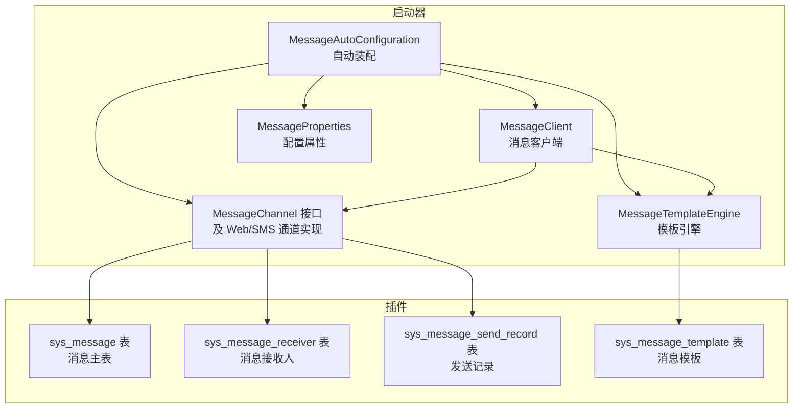
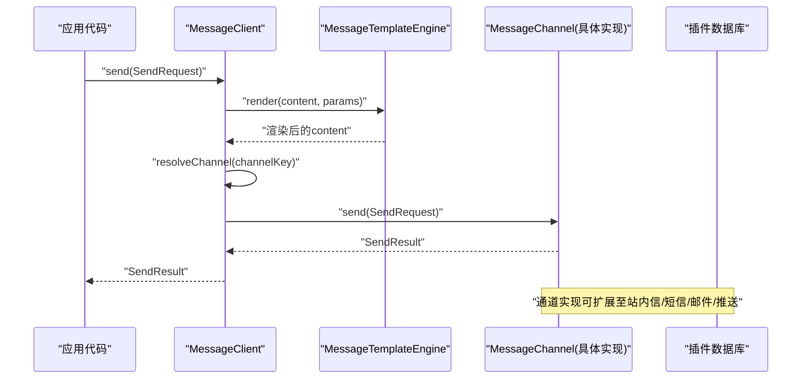
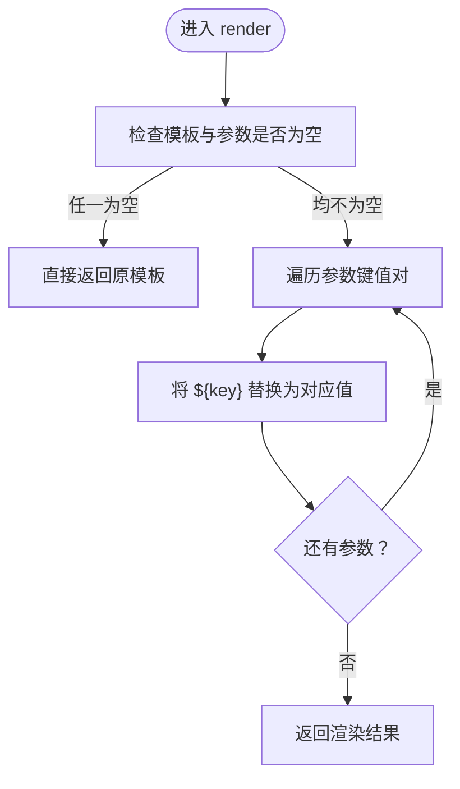
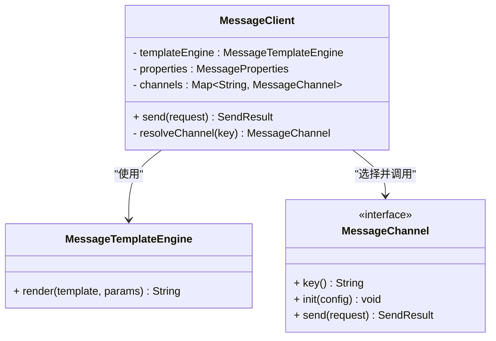
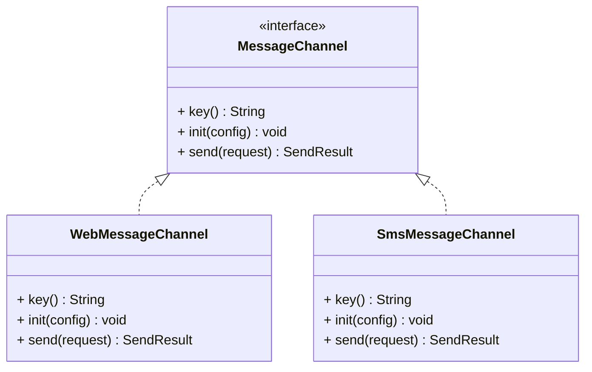
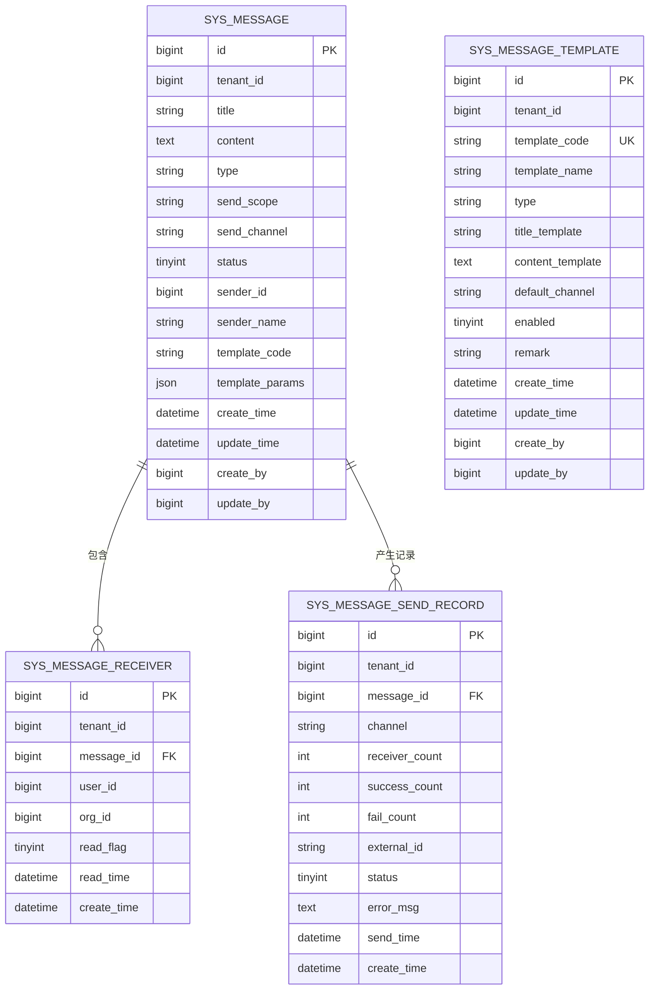
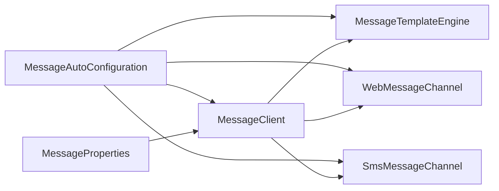

# 消息通知模块

<cite>
**本文引用的文件**
- [MessageAutoConfiguration.java](file://forge/forge-framework/forge-starter-parent/forge-starter-message/src/main/java/com/mdframe/forge/starter/message/config/MessageAutoConfiguration.java)
- [MessageProperties.java](file://forge/forge-framework/forge-starter-parent/forge-starter-message/src/main/java/com/mdframe/forge/starter/message/config/MessageProperties.java)
- [MessageClient.java](file://forge/forge-framework/forge-starter-parent/forge-starter-message/src/main/java/com/mdframe/forge/starter/message/sdk/MessageClient.java)
- [MessageTemplateEngine.java](file://forge/forge-framework/forge-starter-parent/forge-starter-message/src/main/java/com/mdframe/forge/starter/message/service/MessageTemplateEngine.java)
- [MessageChannel.java（接口）](file://forge/forge-framework/forge-starter-parent/forge-starter-message/src/main/java/com/mdframe/forge/starter/message/channel/MessageChannel.java)
- [WebMessageChannel.java](file://forge/forge-framework/forge-starter-parent/forge-starter-message/src/main/java/com/mdframe/forge/starter/message/channel/WebMessageChannel.java)
- [SmsMessageChannel.java](file://forge/forge-framework/forge-starter-parent/forge-starter-message/src/main/java/com/mdframe/forge/starter/message/channel/SmsMessageChannel.java)
- [message_tables.sql](file://forge/forge-framework/forge-plugin-parent/forge-plugin-message/src/main/resources/sql/message_tables.sql)
- [application.yml](file://forge/forge-admin/src/main/resources/application.yml)
- [org.springframework.boot.autoconfigure.AutoConfiguration.imports](file://forge/forge-framework/forge-starter-parent/forge-starter-message/src/main/resources/META-INF/spring/org.springframework.boot.autoconfigure.AutoConfiguration.imports)
</cite>

## 目录
1. [简介](#简介)
2. [项目结构](#项目结构)
3. [核心组件](#核心组件)
4. [架构总览](#架构总览)
5. [组件详细分析](#组件详细分析)
6. [依赖关系分析](#依赖关系分析)
7. [性能考量](#性能考量)
8. [故障排查指南](#故障排查指南)
9. [结论](#结论)
10. [附录](#附录)

## 简介
本技术文档面向Forge消息通知模块，系统性阐述多渠道消息发送机制、模板引擎工作流程、消息发送记录与状态跟踪、失败重试策略以及完整配置与集成指南。模块以Spring Boot自动装配为核心，提供“站内信”和“短信”两大默认通道，并通过统一的MessageClient对外暴露简洁的发送API。

## 项目结构
消息通知模块由“启动器(starter)”与“插件(plugin)”两部分组成：
- 启动器：提供自动装配、消息客户端、模板引擎、通道接口与默认实现、配置属性等基础设施。
- 插件：提供数据库表结构、业务服务与持久化能力，支撑消息的创建、模板管理、发送记录与接收人管理。

图表来源
- [MessageAutoConfiguration.java](file://forge/forge-framework/forge-starter-parent/forge-starter-message/src/main/java/com/mdframe/forge/starter/message/config/MessageAutoConfiguration.java#L17-L46)
- [MessageClient.java](file://forge/forge-framework/forge-starter-parent/forge-starter-message/src/main/java/com/mdframe/forge/starter/message/sdk/MessageClient.java#L10-L56)
- [MessageTemplateEngine.java](file://forge/forge-framework/forge-starter-parent/forge-starter-message/src/main/java/com/mdframe/forge/starter/message/service/MessageTemplateEngine.java#L5-L23)
- [message_tables.sql](file://forge/forge-framework/forge-plugin-parent/forge-plugin-message/src/main/resources/sql/message_tables.sql#L3-L90)

章节来源
- [MessageAutoConfiguration.java](file://forge/forge-framework/forge-starter-parent/forge-starter-message/src/main/java/com/mdframe/forge/starter/message/config/MessageAutoConfiguration.java#L17-L46)
- [message_tables.sql](file://forge/forge-framework/forge-plugin-parent/forge-plugin-message/src/main/resources/sql/message_tables.sql#L3-L90)

## 核心组件
- 自动装配与Bean注册
  - 自动装配类负责注册模板引擎、默认通道、消息客户端等。
  - 通过条件注解按配置启用或禁用通道。
- 消息客户端
  - 统一入口，负责模板渲染、渠道解析与调用。
- 模板引擎
  - 提供简单占位符替换能力，支持空值安全。
- 通道接口与实现
  - 通道接口定义key、初始化与发送；默认提供Web与Sms通道实现。
- 配置属性
  - 支持默认渠道与各渠道开关与配置注入。

章节来源
- [MessageAutoConfiguration.java](file://forge/forge-framework/forge-starter-parent/forge-starter-message/src/main/java/com/mdframe/forge/starter/message/config/MessageAutoConfiguration.java#L21-L45)
- [MessageClient.java](file://forge/forge-framework/forge-starter-parent/forge-starter-message/src/main/java/com/mdframe/forge/starter/message/sdk/MessageClient.java#L10-L56)
- [MessageTemplateEngine.java](file://forge/forge-framework/forge-starter-parent/forge-starter-message/src/main/java/com/mdframe/forge/starter/message/service/MessageTemplateEngine.java#L5-L23)
- [MessageProperties.java](file://forge/forge-framework/forge-starter-parent/forge-starter-message/src/main/java/com/mdframe/forge/starter/message/config/MessageProperties.java#L7-L33)

## 架构总览
消息发送从应用层到通道层的调用链路如下：

图表来源
- [MessageClient.java](file://forge/forge-framework/forge-starter-parent/forge-starter-message/src/main/java/com/mdframe/forge/starter/message/sdk/MessageClient.java#L34-L45)
- [MessageTemplateEngine.java](file://forge/forge-framework/forge-starter-parent/forge-starter-message/src/main/java/com/mdframe/forge/starter/message/service/MessageTemplateEngine.java#L10-L21)
- [MessageChannel.java（接口）](file://forge/forge-framework/forge-starter-parent/forge-starter-message/src/main/java/com/mdframe/forge/starter/message/channel/MessageChannel.java#L4-L39)
- [WebMessageChannel.java](file://forge/forge-framework/forge-starter-parent/forge-starter-message/src/main/java/com/mdframe/forge/starter/message/channel/WebMessageChannel.java#L5-L15)
- [SmsMessageChannel.java](file://forge/forge-framework/forge-starter-parent/forge-starter-message/src/main/java/com/mdframe/forge/starter/message/channel/SmsMessageChannel.java#L5-L15)

## 组件详细分析

### 模板引擎（MessageTemplateEngine）
- 功能
  - 将模板字符串中的占位符按参数字典进行替换。
  - 对空值进行安全处理，避免异常。
- 复杂度
  - 时间复杂度：O(N×M)，N为模板长度，M为参数项数。
  - 空间复杂度：O(N)。
- 扩展建议
  - 可引入更强大的模板引擎（如Velocity/FreeMarker），支持条件、循环与国际化。

图表来源
- [MessageTemplateEngine.java](file://forge/forge-framework/forge-starter-parent/forge-starter-message/src/main/java/com/mdframe/forge/starter/message/service/MessageTemplateEngine.java#L10-L21)

章节来源
- [MessageTemplateEngine.java](file://forge/forge-framework/forge-starter-parent/forge-starter-message/src/main/java/com/mdframe/forge/starter/message/service/MessageTemplateEngine.java#L5-L23)

### 消息客户端（MessageClient）
- 功能
  - 负责模板渲染、渠道解析与调用。
  - 通过Bean名称约定解析通道实例。
- 关键点
  - 若未显式指定渠道，则使用默认渠道。
  - 若通道不可用，返回失败结果。
- 复杂度
  - O(M)（M为参数数量）用于模板渲染；通道解析为常量时间。

图表来源
- [MessageClient.java](file://forge/forge-framework/forge-starter-parent/forge-starter-message/src/main/java/com/mdframe/forge/starter/message/sdk/MessageClient.java#L10-L56)
- [MessageTemplateEngine.java](file://forge/forge-framework/forge-starter-parent/forge-starter-message/src/main/java/com/mdframe/forge/starter/message/service/MessageTemplateEngine.java#L5-L23)
- [MessageChannel.java（接口）](file://forge/forge-framework/forge-starter-parent/forge-starter-message/src/main/java/com/mdframe/forge/starter/message/channel/MessageChannel.java#L4-L39)

章节来源
- [MessageClient.java](file://forge/forge-framework/forge-starter-parent/forge-starter-message/src/main/java/com/mdframe/forge/starter/message/sdk/MessageClient.java#L10-L56)

### 通道接口与默认实现
- 通道接口
  - key：通道标识（如web、sms）。
  - init：注入渠道配置（如接入密钥、网关地址等）。
  - send：执行发送逻辑，返回发送结果。
- 默认实现
  - WebMessageChannel：站内信通道，占位返回成功。
  - SmsMessageChannel：短信通道，占位返回成功，预留第三方接入点。

图表来源
- [MessageChannel.java（接口）](file://forge/forge-framework/forge-starter-parent/forge-starter-message/src/main/java/com/mdframe/forge/starter/message/channel/MessageChannel.java#L4-L39)
- [WebMessageChannel.java](file://forge/forge-framework/forge-starter-parent/forge-starter-message/src/main/java/com/mdframe/forge/starter/message/channel/WebMessageChannel.java#L5-L15)
- [SmsMessageChannel.java](file://forge/forge-framework/forge-starter-parent/forge-starter-message/src/main/java/com/mdframe/forge/starter/message/channel/SmsMessageChannel.java#L5-L15)

章节来源
- [MessageChannel.java（接口）](file://forge/forge-framework/forge-starter-parent/forge-starter-message/src/main/java/com/mdframe/forge/starter/message/channel/MessageChannel.java#L4-L39)
- [WebMessageChannel.java](file://forge/forge-framework/forge-starter-parent/forge-starter-message/src/main/java/com/mdframe/forge/starter/message/channel/WebMessageChannel.java#L5-L15)
- [SmsMessageChannel.java](file://forge/forge-framework/forge-starter-parent/forge-starter-message/src/main/java/com/mdframe/forge/starter/message/channel/SmsMessageChannel.java#L5-L15)

### 数据模型与表结构
- sys_message：消息主表，记录标题、内容、类型、发送范围、渠道、状态等。
- sys_message_receiver：消息接收人表，记录接收人、组织、已读标记与阅读时间。
- sys_message_send_record：消息发送记录表，记录发送渠道、成功/失败计数、第三方ID与错误信息。
- sys_message_template：消息模板表，记录模板编码、名称、类型、标题/内容模板、默认渠道与启用状态。

图表来源
- [message_tables.sql](file://forge/forge-framework/forge-plugin-parent/forge-plugin-message/src/main/resources/sql/message_tables.sql#L3-L90)

章节来源
- [message_tables.sql](file://forge/forge-framework/forge-plugin-parent/forge-plugin-message/src/main/resources/sql/message_tables.sql#L3-L90)

## 依赖关系分析
- 自动装配导入
  - 启动器通过Spring Boot自动导入机制注册自动装配类。
- Bean依赖
  - MessageClient依赖MessageTemplateEngine、MessageProperties与MessageChannel集合。
  - MessageAutoConfiguration按配置条件注册通道Bean与MessageClient。
- 配置驱动
  - 通过前缀forge.message的配置项控制默认渠道与各通道开关与配置。

图表来源
- [MessageAutoConfiguration.java](file://forge/forge-framework/forge-starter-parent/forge-starter-message/src/main/java/com/mdframe/forge/starter/message/config/MessageAutoConfiguration.java#L17-L46)
- [org.springframework.boot.autoconfigure.AutoConfiguration.imports](file://forge/forge-framework/forge-starter-parent/forge-starter-message/src/main/resources/META-INF/spring/org.springframework.boot.autoconfigure.AutoConfiguration.imports#L1-L1)

章节来源
- [MessageAutoConfiguration.java](file://forge/forge-framework/forge-starter-parent/forge-starter-message/src/main/java/com/mdframe/forge/starter/message/config/MessageAutoConfiguration.java#L17-L46)
- [org.springframework.boot.autoconfigure.AutoConfiguration.imports](file://forge/forge-framework/forge-starter-parent/forge-starter-message/src/main/resources/META-INF/spring/org.springframework.boot.autoconfigure.AutoConfiguration.imports#L1-L1)

## 性能考量
- 模板渲染
  - 当前实现为线性替换，适合中小规模参数集；若模板复杂度高，建议引入高性能模板引擎。
- 并发与异步
  - 建议在通道实现中引入异步发送与批量发送，降低阻塞。
- 缓存与限流
  - 对于短信等外部通道，建议结合缓存与限流策略，避免触发第三方限频。
- 数据库
  - 发送记录与接收人表建立合适索引，保障查询与统计效率。

## 故障排查指南
- 通道不可用
  - 现象：返回“channel not available”。
  - 排查：确认通道Bean名称与key一致，且配置中已启用该通道。
- 模板渲染异常
  - 现象：内容未按预期替换。
  - 排查：确认模板占位符与传入参数键一致，避免空值导致的替换问题。
- 国际化资源
  - 现象：国际化消息未生效。
  - 排查：确认Spring国际化解析资源路径与文件命名符合约定。

章节来源
- [MessageClient.java](file://forge/forge-framework/forge-starter-parent/forge-starter-message/src/main/java/com/mdframe/forge/starter/message/sdk/MessageClient.java#L41-L43)
- [MessageTemplateEngine.java](file://forge/forge-framework/forge-starter-parent/forge-starter-message/src/main/java/com/mdframe/forge/starter/message/service/MessageTemplateEngine.java#L10-L21)
- [application.yml](file://forge/forge-admin/src/main/resources/application.yml#L36-L38)

## 结论
Forge消息通知模块以清晰的职责分离与可扩展的通道设计，提供了统一的模板渲染与发送入口。通过数据库表结构与插件服务，能够满足站内信与短信等常见场景，并为后续扩展邮件、推送等通道提供良好基础。

## 附录

### 多渠道实现原理与配置方法
- 站内信通道（web）
  - 默认启用；实现中占位返回成功，实际业务由插件模块完成。
- 短信通道（sms）
  - 通过配置开关启用；实现中占位返回成功，预留第三方接入点。
- 配置示例（基于前缀forge.message）
  - 默认渠道：设置默认发送渠道键。
  - 通道开关：分别控制web与sms通道是否启用。
  - 通道配置：注入各通道所需的接入参数（如密钥、网关地址等）。

章节来源
- [MessageAutoConfiguration.java](file://forge/forge-framework/forge-starter-parent/forge-starter-message/src/main/java/com/mdframe/forge/starter/message/config/MessageAutoConfiguration.java#L27-L37)
- [MessageProperties.java](file://forge/forge-framework/forge-starter-parent/forge-starter-message/src/main/java/com/mdframe/forge/starter/message/config/MessageProperties.java#L7-L33)
- [WebMessageChannel.java](file://forge/forge-framework/forge-starter-parent/forge-starter-message/src/main/java/com/mdframe/forge/starter/message/channel/WebMessageChannel.java#L5-L15)
- [SmsMessageChannel.java](file://forge/forge-framework/forge-starter-parent/forge-starter-message/src/main/java/com/mdframe/forge/starter/message/channel/SmsMessageChannel.java#L5-L15)

### 消息模板引擎工作流程
- 输入：模板字符串与参数映射。
- 处理：遍历参数，逐项替换占位符。
- 输出：渲染后的文本内容。

章节来源
- [MessageTemplateEngine.java](file://forge/forge-framework/forge-starter-parent/forge-starter-message/src/main/java/com/mdframe/forge/starter/message/service/MessageTemplateEngine.java#L10-L21)

### 消息发送记录管理与状态跟踪
- 记录表字段要点
  - 发送渠道、接收人数、成功/失败计数、第三方ID、状态与错误信息。
- 状态流转
  - 发送中 → 成功/失败；失败后可触发重试。
- 建议
  - 引入定时任务或异步队列进行失败重试与状态回写。

章节来源
- [message_tables.sql](file://forge/forge-framework/forge-plugin-parent/forge-plugin-message/src/main/resources/sql/message_tables.sql#L43-L60)

### 失败重试机制实现方案
- 触发条件
  - 发送记录状态为失败或第三方返回错误。
- 执行策略
  - 固定间隔或指数退避重试，限制最大重试次数。
- 监控与告警
  - 记录重试次数与最后一次错误信息，达到阈值后告警。

[本节为通用实现建议，无需特定文件引用]

### API接口文档（概念性说明）
- 统一入口
  - send(SendRequest)：支持指定渠道、类型、模板与参数。
- 请求对象关键字段
  - 标题、内容、模板编码、参数、接收人集合、组织集合、租户集合、指定渠道、消息类型。
- 返回对象关键字段
  - 成功标志、消息、第三方ID。

章节来源
- [MessageChannel.java（接口）](file://forge/forge-framework/forge-starter-parent/forge-starter-message/src/main/java/com/mdframe/forge/starter/message/channel/MessageChannel.java#L21-L39)
- [MessageClient.java](file://forge/forge-framework/forge-starter-parent/forge-starter-message/src/main/java/com/mdframe/forge/starter/message/sdk/MessageClient.java#L34-L45)

### 集成指南
- 引入依赖
  - 在应用中引入消息启动器与插件模块依赖。
- 自动装配
  - 启动器通过自动导入机制注册Bean。
- 配置
  - 在配置文件中设置默认渠道与通道开关、配置项。
- 使用
  - 注入MessageClient，构造SendRequest并调用send方法。

章节来源
- [org.springframework.boot.autoconfigure.AutoConfiguration.imports](file://forge/forge-framework/forge-starter-parent/forge-starter-message/src/main/resources/META-INF/spring/org.springframework.boot.autoconfigure.AutoConfiguration.imports#L1-L1)
- [MessageAutoConfiguration.java](file://forge/forge-framework/forge-starter-parent/forge-starter-message/src/main/java/com/mdframe/forge/starter/message/config/MessageAutoConfiguration.java#L17-L46)
- [MessageProperties.java](file://forge/forge-framework/forge-starter-parent/forge-starter-message/src/main/java/com/mdframe/forge/starter/message/config/MessageProperties.java#L7-L33)
- [application.yml](file://forge/forge-admin/src/main/resources/application.yml#L36-L38)