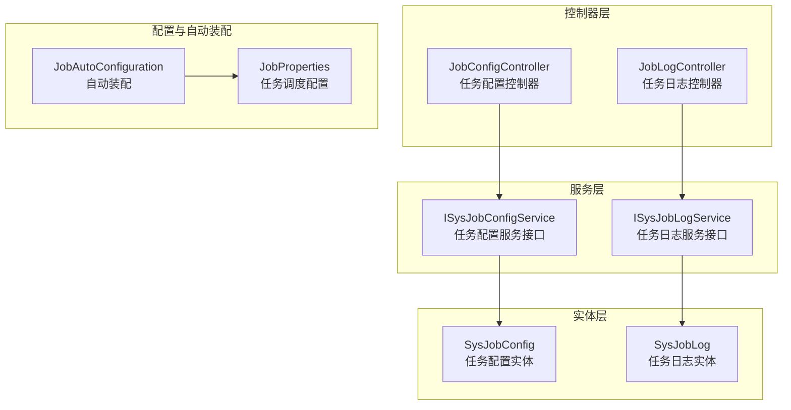
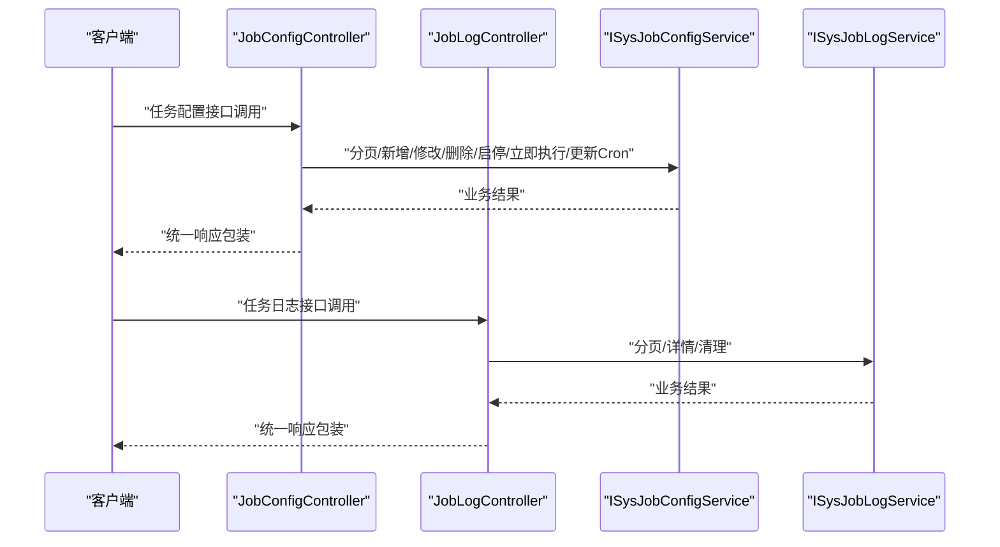
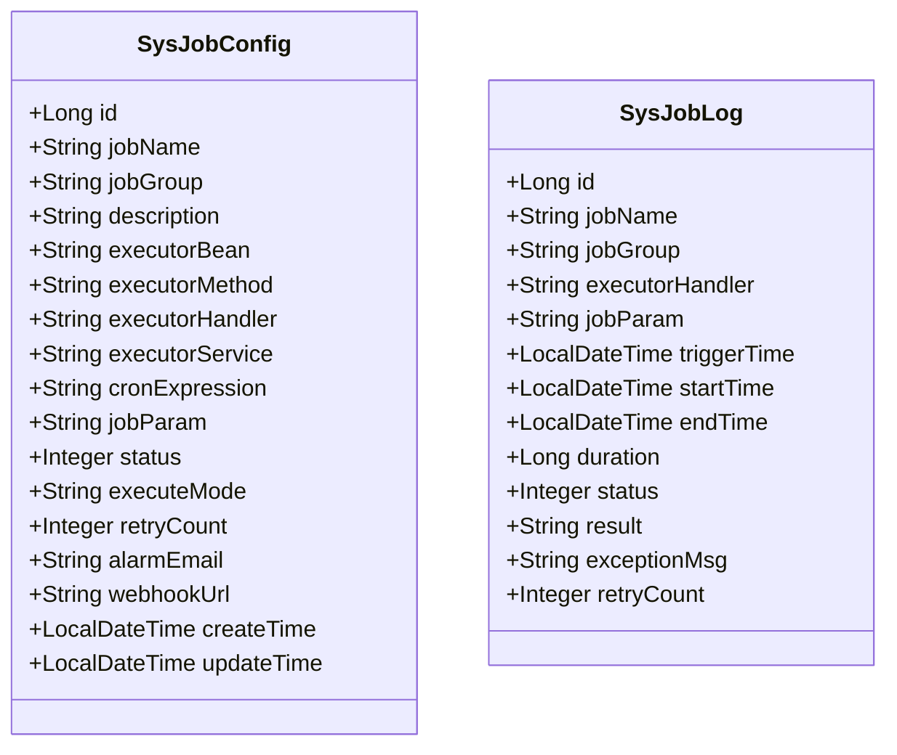
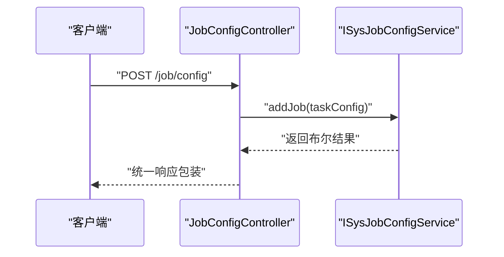
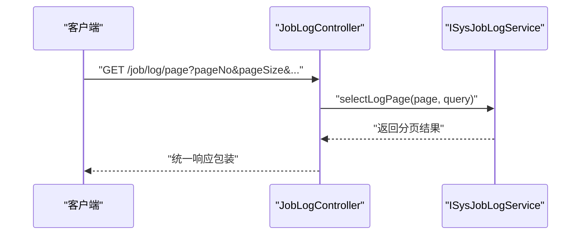
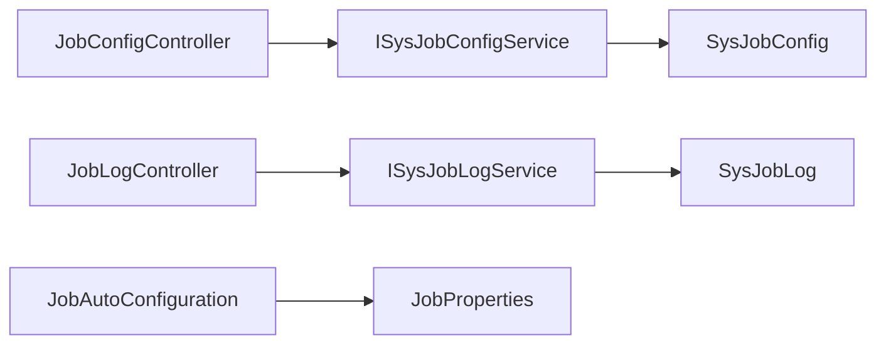

# API接口参考

<cite>
**本文引用的文件**
- [API.md](file://forge/forge-framework/forge-starter-parent/forge-starter-job/API.md)
- [JobConfigController.java](file://forge/forge-framework/forge-plugin-parent/forge-plugin-job/src/main/java/com/mdframe/forge/plugin/job/controller/JobConfigController.java)
- [JobLogController.java](file://forge/forge-framework/forge-plugin-parent/forge-plugin-job/src/main/java/com/mdframe/forge/plugin/job/controller/JobLogController.java)
- [ISysJobConfigService.java](file://forge/forge-framework/forge-plugin-parent/forge-plugin-job/src/main/java/com/mdframe/forge/plugin/job/service/ISysJobConfigService.java)
- [ISysJobLogService.java](file://forge/forge-framework/forge-plugin-parent/forge-plugin-job/src/main/java/com/mdframe/forge/plugin/job/service/ISysJobLogService.java)
- [SysJobConfig.java](file://forge/forge-framework/forge-plugin-parent/forge-plugin-job/src/main/java/com/mdframe/forge/plugin/job/entity/SysJobConfig.java)
- [SysJobLog.java](file://forge/forge-framework/forge-plugin-parent/forge-plugin-job/src/main/java/com/mdframe/forge/plugin/job/entity/SysJobLog.java)
- [JobProperties.java](file://forge/forge-framework/forge-plugin-parent/forge-plugin-job/src/main/java/com/mdframe/forge/plugin/job/config/JobProperties.java)
- [JobAutoConfiguration.java](file://forge/forge-framework/forge-plugin-parent/forge-plugin-job/src/main/java/com/mdframe/forge/plugin/job/config/JobAutoConfiguration.java)
- [job-config.vue](file://forge-admin-ui/src/views/system/job-config.vue)
- [job-log-list.vue](file://forge-admin-ui/src/views/system/job-log-list.vue)
</cite>

## 目录
1. [简介](#简介)
2. [项目结构](#项目结构)
3. [核心组件](#核心组件)
4. [架构总览](#架构总览)
5. [详细组件分析](#详细组件分析)
6. [依赖关系分析](#依赖关系分析)
7. [性能与可用性](#性能与可用性)
8. [故障排查指南](#故障排查指南)
9. [结论](#结论)
10. [附录](#附录)

## 简介
本文件为Forge任务调度模块的完整REST API接口参考，覆盖任务配置管理和任务日志管理两大功能域。内容包括：
- 接口的HTTP方法、URL路径、请求参数与响应格式
- 权限要求、参数校验与业务约束
- 请求与响应示例、错误码说明
- Cron表达式示例与常见使用场景

## 项目结构
任务调度模块由“控制器层”“服务层”“实体层”“配置与自动装配”组成，并通过统一的响应包装返回结果。

图表来源
- [JobConfigController.java](file://forge/forge-framework/forge-plugin-parent/forge-plugin-job/src/main/java/com/mdframe/forge/plugin/job/controller/JobConfigController.java#L15-L110)
- [JobLogController.java](file://forge/forge-framework/forge-plugin-parent/forge-plugin-job/src/main/java/com/mdframe/forge/plugin/job/controller/JobLogController.java#L15-L56)
- [ISysJobConfigService.java](file://forge/forge-framework/forge-plugin-parent/forge-plugin-job/src/main/java/com/mdframe/forge/plugin/job/service/ISysJobConfigService.java#L10-L52)
- [ISysJobLogService.java](file://forge/forge-framework/forge-plugin-parent/forge-plugin-job/src/main/java/com/mdframe/forge/plugin/job/service/ISysJobLogService.java#L10-L23)
- [SysJobConfig.java](file://forge/forge-framework/forge-plugin-parent/forge-plugin-job/src/main/java/com/mdframe/forge/plugin/job/entity/SysJobConfig.java#L10-L97)
- [SysJobLog.java](file://forge/forge-framework/forge-plugin-parent/forge-plugin-job/src/main/java/com/mdframe/forge/plugin/job/entity/SysJobLog.java#L10-L80)
- [JobProperties.java](file://forge/forge-framework/forge-plugin-parent/forge-plugin-job/src/main/java/com/mdframe/forge/plugin/job/config/JobProperties.java#L9-L66)
- [JobAutoConfiguration.java](file://forge/forge-framework/forge-plugin-parent/forge-plugin-job/src/main/java/com/mdframe/forge/plugin/job/config/JobAutoConfiguration.java#L11-L27)

章节来源
- [JobConfigController.java](file://forge/forge-framework/forge-plugin-parent/forge-plugin-job/src/main/java/com/mdframe/forge/plugin/job/controller/JobConfigController.java#L15-L110)
- [JobLogController.java](file://forge/forge-framework/forge-plugin-parent/forge-plugin-job/src/main/java/com/mdframe/forge/plugin/job/controller/JobLogController.java#L15-L56)
- [ISysJobConfigService.java](file://forge/forge-framework/forge-plugin-parent/forge-plugin-job/src/main/java/com/mdframe/forge/plugin/job/service/ISysJobConfigService.java#L10-L52)
- [ISysJobLogService.java](file://forge/forge-framework/forge-plugin-parent/forge-plugin-job/src/main/java/com/mdframe/forge/plugin/job/service/ISysJobLogService.java#L10-L23)
- [SysJobConfig.java](file://forge/forge-framework/forge-plugin-parent/forge-plugin-job/src/main/java/com/mdframe/forge/plugin/job/entity/SysJobConfig.java#L10-L97)
- [SysJobLog.java](file://forge/forge-framework/forge-plugin-parent/forge-plugin-job/src/main/java/com/mdframe/forge/plugin/job/entity/SysJobLog.java#L10-L80)
- [JobProperties.java](file://forge/forge-framework/forge-plugin-parent/forge-plugin-job/src/main/java/com/mdframe/forge/plugin/job/config/JobProperties.java#L9-L66)
- [JobAutoConfiguration.java](file://forge/forge-framework/forge-plugin-parent/forge-plugin-job/src/main/java/com/mdframe/forge/plugin/job/config/JobAutoConfiguration.java#L11-L27)

## 核心组件
- 控制器层：提供REST接口，负责路由与参数解析，调用服务层并返回统一响应包装。
- 服务层：定义任务配置与日志的业务操作契约，如分页查询、新增、修改、启停、立即执行、清理等。
- 实体层：映射数据库表结构，承载任务配置与日志的数据模型。
- 配置与自动装配：暴露任务调度相关配置项，启用API开关与部署模式。

章节来源
- [JobConfigController.java](file://forge/forge-framework/forge-plugin-parent/forge-plugin-job/src/main/java/com/mdframe/forge/plugin/job/controller/JobConfigController.java#L15-L110)
- [JobLogController.java](file://forge/forge-framework/forge-plugin-parent/forge-plugin-job/src/main/java/com/mdframe/forge/plugin/job/controller/JobLogController.java#L15-L56)
- [ISysJobConfigService.java](file://forge/forge-framework/forge-plugin-parent/forge-plugin-job/src/main/java/com/mdframe/forge/plugin/job/service/ISysJobConfigService.java#L10-L52)
- [ISysJobLogService.java](file://forge/forge-framework/forge-plugin-parent/forge-plugin-job/src/main/java/com/mdframe/forge/plugin/job/service/ISysJobLogService.java#L10-L23)
- [SysJobConfig.java](file://forge/forge-framework/forge-plugin-parent/forge-plugin-job/src/main/java/com/mdframe/forge/plugin/job/entity/SysJobConfig.java#L10-L97)
- [SysJobLog.java](file://forge/forge-framework/forge-plugin-parent/forge-plugin-job/src/main/java/com/mdframe/forge/plugin/job/entity/SysJobLog.java#L10-L80)
- [JobProperties.java](file://forge/forge-framework/forge-plugin-parent/forge-plugin-job/src/main/java/com/mdframe/forge/plugin/job/config/JobProperties.java#L9-L66)
- [JobAutoConfiguration.java](file://forge/forge-framework/forge-plugin-parent/forge-plugin-job/src/main/java/com/mdframe/forge/plugin/job/config/JobAutoConfiguration.java#L11-L27)

## 架构总览
下图展示任务配置与日志接口的总体交互流程与职责边界。

图表来源
- [JobConfigController.java](file://forge/forge-framework/forge-plugin-parent/forge-plugin-job/src/main/java/com/mdframe/forge/plugin/job/controller/JobConfigController.java#L32-L108)
- [JobLogController.java](file://forge/forge-framework/forge-plugin-parent/forge-plugin-job/src/main/java/com/mdframe/forge/plugin/job/controller/JobLogController.java#L32-L54)
- [ISysJobConfigService.java](file://forge/forge-framework/forge-plugin-parent/forge-plugin-job/src/main/java/com/mdframe/forge/plugin/job/service/ISysJobConfigService.java#L14-L50)
- [ISysJobLogService.java](file://forge/forge-framework/forge-plugin-parent/forge-plugin-job/src/main/java/com/mdframe/forge/plugin/job/service/ISysJobLogService.java#L14-L21)

## 详细组件分析

### 任务配置管理接口
- 接口概览
  - 基础路径：/job/config
  - 支持分页查询、详情查询、新增、修改、删除、启动、停止、立即执行、更新Cron
  - 统一响应包装：成功时返回统一响应对象，失败时返回错误信息

- 接口清单与规范
  - 分页查询任务列表
    - 方法与路径：GET /job/config/page
    - 查询参数：
      - pageNo：页码（默认1）
      - pageSize：每页大小（默认10）
      - jobName：任务名称（模糊查询，可选）
      - jobGroup：任务分组（可选）
      - executeMode：执行模式（BEAN/HANDLER，可选）
      - status：状态（0-停止 1-运行，可选）
    - 响应：分页数据，包含记录集、总数、当前页、页大小
    - 示例：见API文档中的分页查询示例
  - 查询任务详情
    - 方法与路径：GET /job/config/{id}
    - 路径参数：id（任务ID）
    - 响应：单个任务配置对象
  - 新增任务
    - 方法与路径：POST /job/config
    - 请求体：任务配置对象（JSON）
    - 响应：统一响应包装
    - 示例：见API文档中的新增任务示例
  - 更新任务
    - 方法与路径：PUT /job/config
    - 请求体：任务配置对象（JSON）
    - 响应：统一响应包装
    - 示例：见API文档中的更新任务示例
  - 删除任务
    - 方法与路径：DELETE /job/config/{id}
    - 路径参数：id（任务ID）
    - 响应：统一响应包装
  - 启动任务
    - 方法与路径：POST /job/config/{id}/start
    - 路径参数：id（任务ID）
    - 响应：统一响应包装
  - 停止任务
    - 方法与路径：POST /job/config/{id}/stop
    - 路径参数：id（任务ID）
    - 响应：统一响应包装
  - 立即执行一次
    - 方法与路径：POST /job/config/{id}/trigger
    - 路径参数：id（任务ID）
    - 响应：统一响应包装
  - 更新Cron表达式
    - 方法与路径：POST /job/config/{id}/cron?cronExpression=...
    - 路径参数：id（任务ID）
    - 查询参数：cronExpression（Cron表达式）
    - 响应：统一响应包装

- 请求与响应示例
  - 参考API文档中的示例请求与响应格式
  - 示例路径：
    - [API.md](file://forge/forge-framework/forge-starter-parent/forge-starter-job/API.md#L5-L42)
    - [API.md](file://forge/forge-framework/forge-starter-parent/forge-starter-job/API.md#L49-L84)
    - [API.md](file://forge/forge-framework/forge-starter-parent/forge-starter-job/API.md#L86-L109)

- 权限与安全
  - 控制器注解：忽略权限校验、启用请求/响应加解密
  - API开关：受配置属性forge.job.enable-api控制，默认启用
  - 参考：
    - [JobConfigController.java](file://forge/forge-framework/forge-plugin-parent/forge-plugin-job/src/main/java/com/mdframe/forge/plugin/job/controller/JobConfigController.java#L21-L24)
    - [API.md](file://forge/forge-framework/forge-starter-parent/forge-starter-job/API.md#L1-L10)

- 参数校验与业务约束
  - 任务配置对象字段详见实体定义；执行模式与执行器字段互斥（BEAN与HANDLER模式需清理冗余字段）
  - 参考前端清理逻辑以确保请求体符合约束
  - 参考：
    - [SysJobConfig.java](file://forge/forge-framework/forge-plugin-parent/forge-plugin-job/src/main/java/com/mdframe/forge/plugin/job/entity/SysJobConfig.java#L20-L80)
    - [job-config.vue](file://forge-admin-ui/src/views/system/job-config.vue#L401-L415)

- Cron表达式示例
  - 参考：
    - [API.md](file://forge/forge-framework/forge-starter-parent/forge-starter-job/API.md#L174-L184)

章节来源
- [JobConfigController.java](file://forge/forge-framework/forge-plugin-parent/forge-plugin-job/src/main/java/com/mdframe/forge/plugin/job/controller/JobConfigController.java#L32-L108)
- [ISysJobConfigService.java](file://forge/forge-framework/forge-plugin-parent/forge-plugin-job/src/main/java/com/mdframe/forge/plugin/job/service/ISysJobConfigService.java#L14-L50)
- [SysJobConfig.java](file://forge/forge-framework/forge-plugin-parent/forge-plugin-job/src/main/java/com/mdframe/forge/plugin/job/entity/SysJobConfig.java#L20-L80)
- [API.md](file://forge/forge-framework/forge-starter-parent/forge-starter-job/API.md#L5-L109)
- [job-config.vue](file://forge-admin-ui/src/views/system/job-config.vue#L401-L415)

### 任务日志管理接口
- 接口概览
  - 基础路径：/job/log
  - 支持分页查询、详情查询、清理日志
  - 统一响应包装：成功时返回统一响应对象，失败时返回错误信息

- 接口清单与规范
  - 分页查询日志
    - 方法与路径：GET /job/log/page
    - 查询参数：
      - pageNo：页码（默认1）
      - pageSize：每页大小（默认10）
      - jobName：任务名称（模糊查询，可选）
      - jobGroup：任务分组（可选）
      - status：状态（0-失败 1-成功，可选）
    - 响应：分页数据，包含记录集、总数、当前页、页大小
    - 示例：见API文档中的分页查询示例
  - 查询日志详情
    - 方法与路径：GET /job/log/{id}
    - 路径参数：id（日志ID）
    - 响应：单个日志对象
  - 清理日志
    - 方法与路径：DELETE /job/log/clean?days=30
    - 查询参数：days（保留最近N天的日志，默认30天）
    - 响应：清理数量（整数）

- 请求与响应示例
  - 参考API文档中的示例请求与响应格式
  - 示例路径：
    - [API.md](file://forge/forge-framework/forge-starter-parent/forge-starter-job/API.md#L113-L150)
    - [API.md](file://forge/forge-framework/forge-starter-parent/forge-starter-job/API.md#L157-L172)

- 权限与安全
  - 控制器注解：忽略权限校验、启用请求/响应加解密
  - API开关：受配置属性forge.job.enable-api控制，默认启用
  - 参考：
    - [JobLogController.java](file://forge/forge-framework/forge-plugin-parent/forge-plugin-job/src/main/java/com/mdframe/forge/plugin/job/controller/JobLogController.java#L21-L24)

- 参数校验与业务约束
  - days参数默认值为30天；清理逻辑按指定天数保留最新日志
  - 参考：
    - [ISysJobLogService.java](file://forge/forge-framework/forge-plugin-parent/forge-plugin-job/src/main/java/com/mdframe/forge/plugin/job/service/ISysJobLogService.java#L18-L21)
    - [API.md](file://forge/forge-framework/forge-starter-parent/forge-starter-job/API.md#L157-L164)

章节来源
- [JobLogController.java](file://forge/forge-framework/forge-plugin-parent/forge-plugin-job/src/main/java/com/mdframe/forge/plugin/job/controller/JobLogController.java#L32-L54)
- [ISysJobLogService.java](file://forge/forge-framework/forge-plugin-parent/forge-plugin-job/src/main/java/com/mdframe/forge/plugin/job/service/ISysJobLogService.java#L14-L21)
- [SysJobLog.java](file://forge/forge-framework/forge-plugin-parent/forge-plugin-job/src/main/java/com/mdframe/forge/plugin/job/entity/SysJobLog.java#L20-L79)
- [API.md](file://forge/forge-framework/forge-starter-parent/forge-starter-job/API.md#L113-L172)

### 数据模型
- 任务配置实体（SysJobConfig）
  - 关键字段：任务名称、分组、描述、执行器（Bean/Handler/Service）、Cron表达式、任务参数、状态、执行模式、重试次数、告警与WebHook、创建/更新时间
  - 业务约束：执行模式与执行器字段互斥，需根据模式清理冗余字段
  - 参考：
    - [SysJobConfig.java](file://forge/forge-framework/forge-plugin-parent/forge-plugin-job/src/main/java/com/mdframe/forge/plugin/job/entity/SysJobConfig.java#L20-L80)
    - [job-config.vue](file://forge-admin-ui/src/views/system/job-config.vue#L406-L412)

- 任务日志实体（SysJobLog）
  - 关键字段：任务名称、分组、执行器Handler、任务参数、触发/开始/结束时间、耗时、状态、结果、异常信息、重试次数
  - 参考：
    - [SysJobLog.java](file://forge/forge-framework/forge-plugin-parent/forge-plugin-job/src/main/java/com/mdframe/forge/plugin/job/entity/SysJobLog.java#L20-L79)

图表来源
- [SysJobConfig.java](file://forge/forge-framework/forge-plugin-parent/forge-plugin-job/src/main/java/com/mdframe/forge/plugin/job/entity/SysJobConfig.java#L13-L96)
- [SysJobLog.java](file://forge/forge-framework/forge-plugin-parent/forge-plugin-job/src/main/java/com/mdframe/forge/plugin/job/entity/SysJobLog.java#L13-L80)

章节来源
- [SysJobConfig.java](file://forge/forge-framework/forge-plugin-parent/forge-plugin-job/src/main/java/com/mdframe/forge/plugin/job/entity/SysJobConfig.java#L13-L96)
- [SysJobLog.java](file://forge/forge-framework/forge-plugin-parent/forge-plugin-job/src/main/java/com/mdframe/forge/plugin/job/entity/SysJobLog.java#L13-L80)
- [job-config.vue](file://forge-admin-ui/src/views/system/job-config.vue#L406-L412)

### API调用流程示例
- 新增任务流程

图表来源
- [JobConfigController.java](file://forge/forge-framework/forge-plugin-parent/forge-plugin-job/src/main/java/com/mdframe/forge/plugin/job/controller/JobConfigController.java#L50-L54)
- [ISysJobConfigService.java](file://forge/forge-framework/forge-plugin-parent/forge-plugin-job/src/main/java/com/mdframe/forge/plugin/job/service/ISysJobConfigService.java#L18-L20)

- 分页查询日志流程

图表来源
- [JobLogController.java](file://forge/forge-framework/forge-plugin-parent/forge-plugin-job/src/main/java/com/mdframe/forge/plugin/job/controller/JobLogController.java#L32-L36)
- [ISysJobLogService.java](file://forge/forge-framework/forge-plugin-parent/forge-plugin-job/src/main/java/com/mdframe/forge/plugin/job/service/ISysJobLogService.java#L12-L16)

## 依赖关系分析
- 控制器依赖服务接口，服务接口依赖实体模型
- 自动装配启用组件扫描与配置属性绑定
- API开关控制控制器是否暴露

图表来源
- [JobConfigController.java](file://forge/forge-framework/forge-plugin-parent/forge-plugin-job/src/main/java/com/mdframe/forge/plugin/job/controller/JobConfigController.java#L27)
- [JobLogController.java](file://forge/forge-framework/forge-plugin-parent/forge-plugin-job/src/main/java/com/mdframe/forge/plugin/job/controller/JobLogController.java#L27)
- [ISysJobConfigService.java](file://forge/forge-framework/forge-plugin-parent/forge-plugin-job/src/main/java/com/mdframe/forge/plugin/job/service/ISysJobConfigService.java#L10)
- [ISysJobLogService.java](file://forge/forge-framework/forge-plugin-parent/forge-plugin-job/src/main/java/com/mdframe/forge/plugin/job/service/ISysJobLogService.java#L10)
- [SysJobConfig.java](file://forge/forge-framework/forge-plugin-parent/forge-plugin-job/src/main/java/com/mdframe/forge/plugin/job/entity/SysJobConfig.java#L14)
- [SysJobLog.java](file://forge/forge-framework/forge-plugin-parent/forge-plugin-job/src/main/java/com/mdframe/forge/plugin/job/entity/SysJobLog.java#L14)
- [JobAutoConfiguration.java](file://forge/forge-framework/forge-plugin-parent/forge-plugin-job/src/main/java/com/mdframe/forge/plugin/job/config/JobAutoConfiguration.java#L13)
- [JobProperties.java](file://forge/forge-framework/forge-plugin-parent/forge-plugin-job/src/main/java/com/mdframe/forge/plugin/job/config/JobProperties.java#L10)

章节来源
- [JobConfigController.java](file://forge/forge-framework/forge-plugin-parent/forge-plugin-job/src/main/java/com/mdframe/forge/plugin/job/controller/JobConfigController.java#L27)
- [JobLogController.java](file://forge/forge-framework/forge-plugin-parent/forge-plugin-job/src/main/java/com/mdframe/forge/plugin/job/controller/JobLogController.java#L27)
- [ISysJobConfigService.java](file://forge/forge-framework/forge-plugin-parent/forge-plugin-job/src/main/java/com/mdframe/forge/plugin/job/service/ISysJobConfigService.java#L10)
- [ISysJobLogService.java](file://forge/forge-framework/forge-plugin-parent/forge-plugin-job/src/main/java/com/mdframe/forge/plugin/job/service/ISysJobLogService.java#L10)
- [SysJobConfig.java](file://forge/forge-framework/forge-plugin-parent/forge-plugin-job/src/main/java/com/mdframe/forge/plugin/job/entity/SysJobConfig.java#L14)
- [SysJobLog.java](file://forge/forge-framework/forge-plugin-parent/forge-plugin-job/src/main/java/com/mdframe/forge/plugin/job/entity/SysJobLog.java#L14)
- [JobAutoConfiguration.java](file://forge/forge-framework/forge-plugin-parent/forge-plugin-job/src/main/java/com/mdframe/forge/plugin/job/config/JobAutoConfiguration.java#L13)
- [JobProperties.java](file://forge/forge-framework/forge-plugin-parent/forge-plugin-job/src/main/java/com/mdframe/forge/plugin/job/config/JobProperties.java#L10)

## 性能与可用性
- 分页查询：建议合理设置pageSize，避免一次性返回过多数据
- Cron表达式：尽量使用稳定的表达式，避免过于频繁的执行导致资源压力
- 日志清理：定期清理历史日志，控制存储占用
- API开关：可通过配置属性控制是否启用API，便于灰度发布与运维

## 故障排查指南
- 常见错误码
  - 0：成功
  - -1：系统错误
  - 400：参数错误
  - 404：任务不存在
  - 500：服务器内部错误
  - 参考：
    - [API.md](file://forge/forge-framework/forge-starter-parent/forge-starter-job/API.md#L186-L195)

- 常见问题定位
  - 接口未生效：检查配置属性forge.job.enable-api是否为true
  - 参数不合法：核对请求体字段与执行模式的互斥关系
  - 日志清理无效：确认days参数是否正确传入
  - 参考：
    - [JobConfigController.java](file://forge/forge-framework/forge-plugin-parent/forge-plugin-job/src/main/java/com/mdframe/forge/plugin/job/controller/JobConfigController.java#L21)
    - [JobLogController.java](file://forge/forge-framework/forge-plugin-parent/forge-plugin-job/src/main/java/com/mdframe/forge/plugin/job/controller/JobLogController.java#L21)
    - [job-config.vue](file://forge-admin-ui/src/views/system/job-config.vue#L406-L412)

章节来源
- [API.md](file://forge/forge-framework/forge-starter-parent/forge-starter-job/API.md#L186-L195)
- [JobConfigController.java](file://forge/forge-framework/forge-plugin-parent/forge-plugin-job/src/main/java/com/mdframe/forge/plugin/job/controller/JobConfigController.java#L21)
- [JobLogController.java](file://forge/forge-framework/forge-plugin-parent/forge-plugin-job/src/main/java/com/mdframe/forge/plugin/job/controller/JobLogController.java#L21)
- [job-config.vue](file://forge-admin-ui/src/views/system/job-config.vue#L406-L412)

## 结论
本API参考文档基于实际源码梳理了任务配置与日志管理的完整接口规范，明确了请求与响应格式、参数校验、业务约束及错误码说明。结合前端示例与配置说明，可快速完成对接与集成。

## 附录
- Cron表达式示例
  - 每5秒执行一次：*/5 * * * * ?
  - 每分钟执行一次：0 * * * * ?
  - 每5分钟执行一次：0 0/5 * * * ?
  - 每小时执行一次：0 0 * * * ?
  - 每天凌晨2点执行：0 0 2 * * ?
  - 每周一凌晨2点执行：0 0 2 ? * MON
  - 每月1号凌晨2点执行：0 0 2 1 * ?
  - 参考：
    - [API.md](file://forge/forge-framework/forge-starter-parent/forge-starter-job/API.md#L174-L184)

- 前端调用参考
  - 任务配置页面：包含新增、编辑、删除、启停等操作
  - 任务日志页面：支持分页查询、状态筛选、时间范围筛选
  - 参考：
    - [job-config.vue](file://forge-admin-ui/src/views/system/job-config.vue#L418-L450)
    - [job-log-list.vue](file://forge-admin-ui/src/views/system/job-log-list.vue#L220-L253)