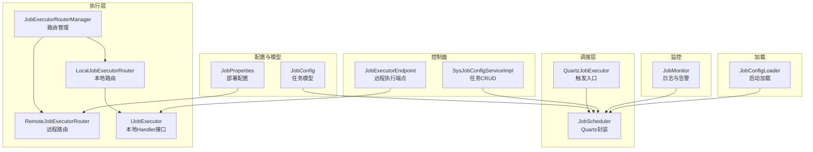
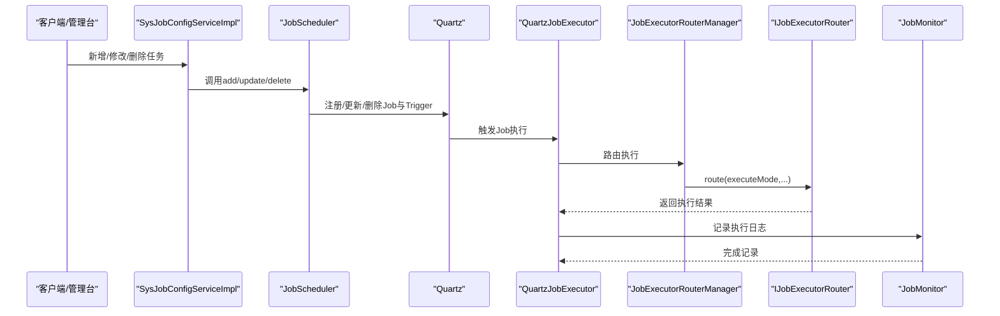
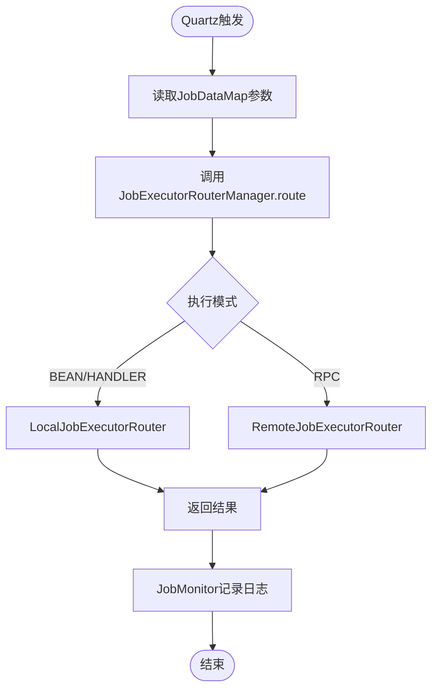
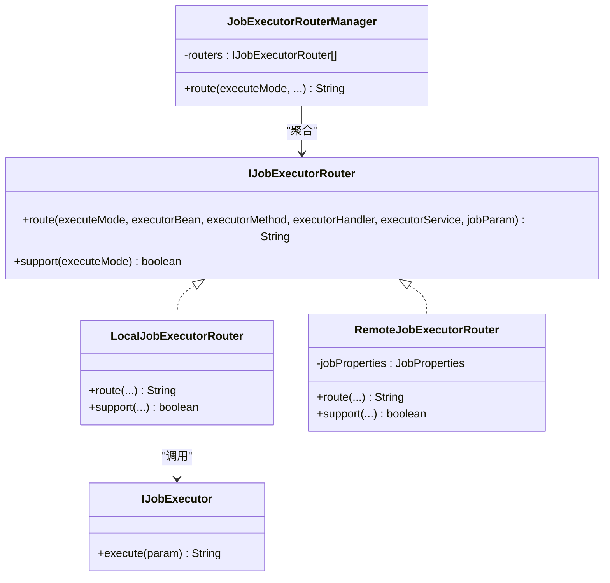
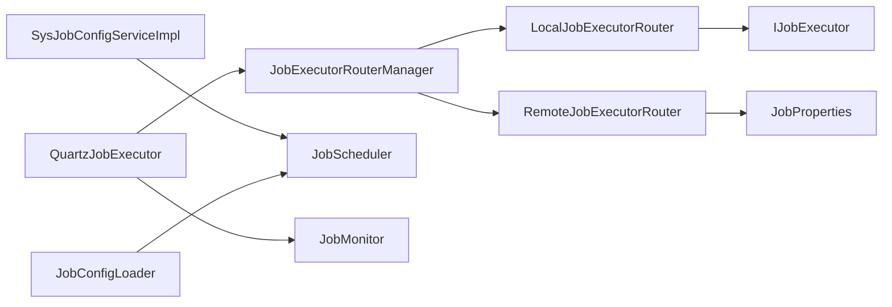

# 任务执行机制

<cite>
**本文引用的文件**   
- [JobScheduler.java](file://forge/forge-framework/forge-plugin-parent/forge-plugin-job/src/main/java/com/mdframe/forge/plugin/job/scheduler/JobScheduler.java)
- [QuartzJobExecutor.java](file://forge/forge-framework/forge-plugin-parent/forge-plugin-job/src/main/java/com/mdframe/forge/plugin/job/scheduler/QuartzJobExecutor.java)
- [JobExecutorRouterManager.java](file://forge/forge-framework/forge-plugin-parent/forge-plugin-job/src/main/java/com/mdframe/forge/plugin/job/executor/JobExecutorRouterManager.java)
- [IJobExecutorRouter.java](file://forge/forge-framework/forge-plugin-parent/forge-plugin-job/src/main/java/com/mdframe/forge/plugin/job/executor/IJobExecutorRouter.java)
- [LocalJobExecutorRouter.java](file://forge/forge-framework/forge-plugin-parent/forge-plugin-job/src/main/java/com/mdframe/forge/plugin/job/executor/impl/LocalJobExecutorRouter.java)
- [RemoteJobExecutorRouter.java](file://forge/forge-framework/forge-plugin-parent/forge-plugin-job/src/main/java/com/mdframe/forge/plugin/job/executor/impl/RemoteJobExecutorRouter.java)
- [IJobExecutor.java](file://forge/forge-framework/forge-plugin-parent/forge-plugin-job/src/main/java/com/mdframe/forge/plugin/job/executor/IJobExecutor.java)
- [JobProperties.java](file://forge/forge-framework/forge-plugin-parent/forge-plugin-job/src/main/java/com/mdframe/forge/plugin/job/config/JobProperties.java)
- [JobConfig.java](file://forge/forge-framework/forge-plugin-parent/forge-plugin-job/src/main/java/com/mdframe/forge/plugin/job/model/JobConfig.java)
- [SysJobConfigServiceImpl.java](file://forge/forge-framework/forge-plugin-parent/forge-plugin-job/src/main/java/com/mdframe/forge/plugin/job/service/impl/SysJobConfigServiceImpl.java)
- [JobMonitor.java](file://forge/forge-framework/forge-plugin-parent/forge-plugin-job/src/main/java/com/mdframe/forge/plugin/job/monitor/JobMonitor.java)
- [JobExecutorEndpoint.java](file://forge/forge-framework/forge-plugin-parent/forge-plugin-job/src/main/java/com/mdframe/forge/plugin/job/controller/JobExecutorEndpoint.java)
- [JobExamples.java](file://forge/forge-framework/forge-plugin-parent/forge-plugin-job/src/main/java/com/mdframe/forge/plugin/job/example/JobExamples.java)
- [application-job-example.yml](file://forge/forge-framework/forge-plugin-parent/forge-plugin-job/src/main/resources/application-job-example.yml)
- [JobConfigLoader.java](file://forge/forge-framework/forge-plugin-parent/forge-plugin-job/src/main/java/com/mdframe/forge/plugin/job/loader/JobConfigLoader.java)
</cite>

## 目录
1. [引言](#引言)
2. [项目结构](#项目结构)
3. [核心组件](#核心组件)
4. [架构总览](#架构总览)
5. [组件详解](#组件详解)
6. [依赖关系分析](#依赖关系分析)
7. [性能考量](#性能考量)
8. [故障排查指南](#故障排查指南)
9. [结论](#结论)
10. [附录](#附录)

## 引言
本文系统性解析Forge任务执行机制，围绕Quartz调度、执行器路由、本地/远程执行路径、生命周期与异常处理、重试策略、参数序列化与上下文传递、结果返回以及监控与优化实践展开。目标是帮助读者快速理解并高效运维基于Forge的任务执行子系统。

## 项目结构
任务执行相关代码集中在forge-plugin-job模块，采用“插件化+starter”的分层设计：
- 调度层：QuartzJobExecutor作为触发入口，JobScheduler封装Quartz任务的CRUD与控制
- 执行层：IJobExecutorRouter定义路由接口，LocalJobExecutorRouter与RemoteJobExecutorRouter分别实现本地与远程执行
- 配置与模型：JobConfig承载任务元数据；JobProperties提供部署模式与分布式配置
- 监控与告警：JobMonitor负责日志落库与失败告警
- 控制面：SysJobConfigServiceImpl提供任务的增删改查与状态切换；JobExecutorEndpoint提供远程执行器端点
- 示例与加载：JobExamples展示三种执行模式；JobConfigLoader在启动时自动加载数据库任务

图表来源
- [QuartzJobExecutor.java](file://forge/forge-framework/forge-plugin-parent/forge-plugin-job/src/main/java/com/mdframe/forge/plugin/job/scheduler/QuartzJobExecutor.java#L1-L61)
- [JobScheduler.java](file://forge/forge-framework/forge-plugin-parent/forge-plugin-job/src/main/java/com/mdframe/forge/plugin/job/scheduler/JobScheduler.java#L1-L220)
- [JobExecutorRouterManager.java](file://forge/forge-framework/forge-plugin-parent/forge-plugin-job/src/main/java/com/mdframe/forge/plugin/job/executor/JobExecutorRouterManager.java#L1-L42)
- [LocalJobExecutorRouter.java](file://forge/forge-framework/forge-plugin-parent/forge-plugin-job/src/main/java/com/mdframe/forge/plugin/job/executor/impl/LocalJobExecutorRouter.java#L1-L102)
- [RemoteJobExecutorRouter.java](file://forge/forge-framework/forge-plugin-parent/forge-plugin-job/src/main/java/com/mdframe/forge/plugin/job/executor/impl/RemoteJobExecutorRouter.java#L1-L107)
- [IJobExecutor.java](file://forge/forge-framework/forge-plugin-parent/forge-plugin-job/src/main/java/com/mdframe/forge/plugin/job/executor/IJobExecutor.java#L1-L16)
- [JobProperties.java](file://forge/forge-framework/forge-plugin-parent/forge-plugin-job/src/main/java/com/mdframe/forge/plugin/job/config/JobProperties.java#L1-L66)
- [JobConfig.java](file://forge/forge-framework/forge-plugin-parent/forge-plugin-job/src/main/java/com/mdframe/forge/plugin/job/model/JobConfig.java#L1-L98)
- [SysJobConfigServiceImpl.java](file://forge/forge-framework/forge-plugin-parent/forge-plugin-job/src/main/java/com/mdframe/forge/plugin/job/service/impl/SysJobConfigServiceImpl.java#L1-L155)
- [JobExecutorEndpoint.java](file://forge/forge-framework/forge-plugin-parent/forge-plugin-job/src/main/java/com/mdframe/forge/plugin/job/controller/JobExecutorEndpoint.java#L1-L58)
- [JobMonitor.java](file://forge/forge-framework/forge-plugin-parent/forge-plugin-job/src/main/java/com/mdframe/forge/plugin/job/monitor/JobMonitor.java#L1-L106)
- [JobConfigLoader.java](file://forge/forge-framework/forge-plugin-parent/forge-plugin-job/src/main/java/com/mdframe/forge/plugin/job/loader/JobConfigLoader.java#L1-L83)

章节来源
- [application-job-example.yml](file://forge/forge-framework/forge-plugin-parent/forge-plugin-job/src/main/resources/application-job-example.yml#L1-L67)

## 核心组件
- QuartzJobExecutor：Quartz Job实现，负责从JobDataMap读取执行参数，调用路由管理器执行，并记录执行日志
- JobScheduler：对Quartz的封装，提供任务新增、更新、删除、暂停/恢复、立即触发、热更新Cron等能力
- JobExecutorRouterManager：路由管理器，按执行模式选择具体路由器
- IJobExecutorRouter：路由接口，定义route与support
- LocalJobExecutorRouter：本地路由，支持BEAN与HANDLER两种模式
- RemoteJobExecutorRouter：远程路由，支持RPC模式，内置重试与超时
- IJobExecutor：业务Handler接口，实现具体任务逻辑
- JobProperties：任务调度配置，含部署模式、分布式超时与重试等
- JobConfig：任务配置模型，包含执行器信息、Cron、参数、状态与重试次数
- SysJobConfigServiceImpl：任务配置服务，提供CRUD与状态切换
- JobExecutorEndpoint：远程执行端点，供调度中心调用执行本地Handler
- JobMonitor：日志与告警，记录执行耗时、结果、异常并触发告警
- JobConfigLoader：应用启动时从数据库批量加载任务配置

章节来源
- [QuartzJobExecutor.java](file://forge/forge-framework/forge-plugin-parent/forge-plugin-job/src/main/java/com/mdframe/forge/plugin/job/scheduler/QuartzJobExecutor.java#L1-L61)
- [JobScheduler.java](file://forge/forge-framework/forge-plugin-parent/forge-plugin-job/src/main/java/com/mdframe/forge/plugin/job/scheduler/JobScheduler.java#L1-L220)
- [JobExecutorRouterManager.java](file://forge/forge-framework/forge-plugin-parent/forge-plugin-job/src/main/java/com/mdframe/forge/plugin/job/executor/JobExecutorRouterManager.java#L1-L42)
- [IJobExecutorRouter.java](file://forge/forge-framework/forge-plugin-parent/forge-plugin-job/src/main/java/com/mdframe/forge/plugin/job/executor/IJobExecutorRouter.java#L1-L33)
- [LocalJobExecutorRouter.java](file://forge/forge-framework/forge-plugin-parent/forge-plugin-job/src/main/java/com/mdframe/forge/plugin/job/executor/impl/LocalJobExecutorRouter.java#L1-L102)
- [RemoteJobExecutorRouter.java](file://forge/forge-framework/forge-plugin-parent/forge-plugin-job/src/main/java/com/mdframe/forge/plugin/job/executor/impl/RemoteJobExecutorRouter.java#L1-L107)
- [IJobExecutor.java](file://forge/forge-framework/forge-plugin-parent/forge-plugin-job/src/main/java/com/mdframe/forge/plugin/job/executor/IJobExecutor.java#L1-L16)
- [JobProperties.java](file://forge/forge-framework/forge-plugin-parent/forge-plugin-job/src/main/java/com/mdframe/forge/plugin/job/config/JobProperties.java#L1-L66)
- [JobConfig.java](file://forge/forge-framework/forge-plugin-parent/forge-plugin-job/src/main/java/com/mdframe/forge/plugin/job/model/JobConfig.java#L1-L98)
- [SysJobConfigServiceImpl.java](file://forge/forge-framework/forge-plugin-parent/forge-plugin-job/src/main/java/com/mdframe/forge/plugin/job/service/impl/SysJobConfigServiceImpl.java#L1-L155)
- [JobExecutorEndpoint.java](file://forge/forge-framework/forge-plugin-parent/forge-plugin-job/src/main/java/com/mdframe/forge/plugin/job/controller/JobExecutorEndpoint.java#L1-L58)
- [JobMonitor.java](file://forge/forge-framework/forge-plugin-parent/forge-plugin-job/src/main/java/com/mdframe/forge/plugin/job/monitor/JobMonitor.java#L1-L106)
- [JobConfigLoader.java](file://forge/forge-framework/forge-plugin-parent/forge-plugin-job/src/main/java/com/mdframe/forge/plugin/job/loader/JobConfigLoader.java#L1-L83)

## 架构总览
Forge任务执行采用“调度中心+执行器”双角色设计：
- 单体模式（STANDALONE）：Quartz在本地触发，本地路由直接调用Bean或Handler
- 分布式模式（DISTRIBUTED）：Quartz在调度中心触发，远程路由通过HTTP调用执行器服务的端点

图表来源
- [SysJobConfigServiceImpl.java](file://forge/forge-framework/forge-plugin-parent/forge-plugin-job/src/main/java/com/mdframe/forge/plugin/job/service/impl/SysJobConfigServiceImpl.java#L1-L155)
- [JobScheduler.java](file://forge/forge-framework/forge-plugin-parent/forge-plugin-job/src/main/java/com/mdframe/forge/plugin/job/scheduler/JobScheduler.java#L1-L220)
- [QuartzJobExecutor.java](file://forge/forge-framework/forge-plugin-parent/forge-plugin-job/src/main/java/com/mdframe/forge/plugin/job/scheduler/QuartzJobExecutor.java#L1-L61)
- [JobExecutorRouterManager.java](file://forge/forge-framework/forge-plugin-parent/forge-plugin-job/src/main/java/com/mdframe/forge/plugin/job/executor/JobExecutorRouterManager.java#L1-L42)
- [JobMonitor.java](file://forge/forge-framework/forge-plugin-parent/forge-plugin-job/src/main/java/com/mdframe/forge/plugin/job/monitor/JobMonitor.java#L1-L106)

## 组件详解

### 调度器与Quartz集成
- JobScheduler封装Quartz的JobDetail与Trigger创建、更新、暂停/恢复、删除、立即触发与Cron热更新
- QuartzJobExecutor作为Job实现，从JobDataMap读取执行参数（执行器Handler/Bean、执行模式、参数等），调用路由管理器执行，并在finally中记录执行日志

图表来源
- [QuartzJobExecutor.java](file://forge/forge-framework/forge-plugin-parent/forge-plugin-job/src/main/java/com/mdframe/forge/plugin/job/scheduler/QuartzJobExecutor.java#L1-L61)
- [JobScheduler.java](file://forge/forge-framework/forge-plugin-parent/forge-plugin-job/src/main/java/com/mdframe/forge/plugin/job/scheduler/JobScheduler.java#L1-L220)
- [JobExecutorRouterManager.java](file://forge/forge-framework/forge-plugin-parent/forge-plugin-job/src/main/java/com/mdframe/forge/plugin/job/executor/JobExecutorRouterManager.java#L1-L42)
- [LocalJobExecutorRouter.java](file://forge/forge-framework/forge-plugin-parent/forge-plugin-job/src/main/java/com/mdframe/forge/plugin/job/executor/impl/LocalJobExecutorRouter.java#L1-L102)
- [RemoteJobExecutorRouter.java](file://forge/forge-framework/forge-plugin-parent/forge-plugin-job/src/main/java/com/mdframe/forge/plugin/job/executor/impl/RemoteJobExecutorRouter.java#L1-L107)
- [JobMonitor.java](file://forge/forge-framework/forge-plugin-parent/forge-plugin-job/src/main/java/com/mdframe/forge/plugin/job/monitor/JobMonitor.java#L1-L106)

章节来源
- [JobScheduler.java](file://forge/forge-framework/forge-plugin-parent/forge-plugin-job/src/main/java/com/mdframe/forge/plugin/job/scheduler/JobScheduler.java#L1-L220)
- [QuartzJobExecutor.java](file://forge/forge-framework/forge-plugin-parent/forge-plugin-job/src/main/java/com/mdframe/forge/plugin/job/scheduler/QuartzJobExecutor.java#L1-L61)

### 执行器路由器与路由策略
- JobExecutorRouterManager聚合多个IJobExecutorRouter，按support匹配执行模式
- LocalJobExecutorRouter支持BEAN与HANDLER模式：
  - BEAN：通过SpringUtil获取Bean并反射调用方法（无参或String参数）
  - HANDLER：通过SpringUtil按名称获取IJobExecutor并执行
- RemoteJobExecutorRouter支持RPC模式：
  - 构造请求体（handlerName, param），向目标服务端点发起POST请求
  - 支持配置重试次数与超时，递增延迟重试

图表来源
- [JobExecutorRouterManager.java](file://forge/forge-framework/forge-plugin-parent/forge-plugin-job/src/main/java/com/mdframe/forge/plugin/job/executor/JobExecutorRouterManager.java#L1-L42)
- [IJobExecutorRouter.java](file://forge/forge-framework/forge-plugin-parent/forge-plugin-job/src/main/java/com/mdframe/forge/plugin/job/executor/IJobExecutorRouter.java#L1-L33)
- [LocalJobExecutorRouter.java](file://forge/forge-framework/forge-plugin-parent/forge-plugin-job/src/main/java/com/mdframe/forge/plugin/job/executor/impl/LocalJobExecutorRouter.java#L1-L102)
- [RemoteJobExecutorRouter.java](file://forge/forge-framework/forge-plugin-parent/forge-plugin-job/src/main/java/com/mdframe/forge/plugin/job/executor/impl/RemoteJobExecutorRouter.java#L1-L107)
- [IJobExecutor.java](file://forge/forge-framework/forge-plugin-parent/forge-plugin-job/src/main/java/com/mdframe/forge/plugin/job/executor/IJobExecutor.java#L1-L16)

章节来源
- [JobExecutorRouterManager.java](file://forge/forge-framework/forge-plugin-parent/forge-plugin-job/src/main/java/com/mdframe/forge/plugin/job/executor/JobExecutorRouterManager.java#L1-L42)
- [IJobExecutorRouter.java](file://forge/forge-framework/forge-plugin-parent/forge-plugin-job/src/main/java/com/mdframe/forge/plugin/job/executor/IJobExecutorRouter.java#L1-L33)
- [LocalJobExecutorRouter.java](file://forge/forge-framework/forge-plugin-parent/forge-plugin-job/src/main/java/com/mdframe/forge/plugin/job/executor/impl/LocalJobExecutorRouter.java#L1-L102)
- [RemoteJobExecutorRouter.java](file://forge/forge-framework/forge-plugin-parent/forge-plugin-job/src/main/java/com/mdframe/forge/plugin/job/executor/impl/RemoteJobExecutorRouter.java#L1-L107)

### 任务参数序列化与上下文传递
- 参数传递链路：SysJobConfigServiceImpl将实体转换为JobConfig写入Quartz JobDataMap；QuartzJobExecutor从JobDataMap读取executorHandler/Bean/Method/Service、jobParam、executeMode
- 序列化策略：以字符串形式传递（如jobParam为JSON字符串），便于跨进程传输
- 上下文信息：包含任务名、分组、触发时间、开始/结束时间、执行耗时、状态与异常信息

章节来源
- [SysJobConfigServiceImpl.java](file://forge/forge-framework/forge-plugin-parent/forge-plugin-job/src/main/java/com/mdframe/forge/plugin/job/service/impl/SysJobConfigServiceImpl.java#L149-L153)
- [JobConfig.java](file://forge/forge-framework/forge-plugin-parent/forge-plugin-job/src/main/java/com/mdframe/forge/plugin/job/model/JobConfig.java#L1-L98)
- [QuartzJobExecutor.java](file://forge/forge-framework/forge-plugin-parent/forge-plugin-job/src/main/java/com/mdframe/forge/plugin/job/scheduler/QuartzJobExecutor.java#L25-L31)
- [JobMonitor.java](file://forge/forge-framework/forge-plugin-parent/forge-plugin-job/src/main/java/com/mdframe/forge/plugin/job/monitor/JobMonitor.java#L35-L75)

### 生命周期管理与状态控制
- 生命周期阶段：创建（新增任务）、注册（加入Quartz）、运行（按Cron触发）、暂停（停止触发）、恢复（允许触发）、删除（移除Quartz与DB）
- 状态字段：JobConfig.status（0-停止，1-运行），SysJobConfigServiceImpl在start/stop时同步更新
- 热更新：updateCron支持在线调整Cron表达式并同步到Quartz

章节来源
- [SysJobConfigServiceImpl.java](file://forge/forge-framework/forge-plugin-parent/forge-plugin-job/src/main/java/com/mdframe/forge/plugin/job/service/impl/SysJobConfigServiceImpl.java#L82-L144)
- [JobScheduler.java](file://forge/forge-framework/forge-plugin-parent/forge-plugin-job/src/main/java/com/mdframe/forge/plugin/job/scheduler/JobScheduler.java#L178-L206)
- [JobConfig.java](file://forge/forge-framework/forge-plugin-parent/forge-plugin-job/src/main/java/com/mdframe/forge/plugin/job/model/JobConfig.java#L64-L66)

### 异常处理与重试策略
- 异常捕获：QuartzJobExecutor在执行过程中捕获异常，记录失败原因并标记状态
- 重试策略：RemoteJobExecutorRouter内置重试（可配置次数与超时），递增延迟
- 告警机制：JobMonitor在失败时触发告警通知（可扩展多种通知器）

章节来源
- [QuartzJobExecutor.java](file://forge/forge-framework/forge-plugin-parent/forge-plugin-job/src/main/java/com/mdframe/forge/plugin/job/scheduler/QuartzJobExecutor.java#L47-L58)
- [RemoteJobExecutorRouter.java](file://forge/forge-framework/forge-plugin-parent/forge-plugin-job/src/main/java/com/mdframe/forge/plugin/job/executor/impl/RemoteJobExecutorRouter.java#L66-L93)
- [JobMonitor.java](file://forge/forge-framework/forge-plugin-parent/forge-plugin-job/src/main/java/com/mdframe/forge/plugin/job/monitor/JobMonitor.java#L62-L74)

### 结果返回机制
- 本地执行：LocalJobExecutorRouter返回Bean/Handler执行结果字符串
- 远程执行：RemoteJobExecutorRouter返回远端服务响应字符串
- 控制端点：JobExecutorEndpoint接收远程请求，执行本地Handler并返回统一响应包装

章节来源
- [LocalJobExecutorRouter.java](file://forge/forge-framework/forge-plugin-parent/forge-plugin-job/src/main/java/com/mdframe/forge/plugin/job/executor/impl/LocalJobExecutorRouter.java#L44-L72)
- [RemoteJobExecutorRouter.java](file://forge/forge-framework/forge-plugin-parent/forge-plugin-job/src/main/java/com/mdframe/forge/plugin/job/executor/impl/RemoteJobExecutorRouter.java#L55-L93)
- [JobExecutorEndpoint.java](file://forge/forge-framework/forge-plugin-parent/forge-plugin-job/src/main/java/com/mdframe/forge/plugin/job/controller/JobExecutorEndpoint.java#L32-L50)

### 部署模式与负载均衡
- 部署模式：JobProperties.deployMode支持STANDALONE与DISTRIBUTED
- 负载均衡：RemoteJobExecutorRouter当前URL构造为简化实现，预留集成服务发现（Nacos/Eureka/Consul）的扩展点
- 远程调用：通过HTTP POST调用执行器端点，支持超时与重试

章节来源
- [JobProperties.java](file://forge/forge-framework/forge-plugin-parent/forge-plugin-job/src/main/java/com/mdframe/forge/plugin/job/config/JobProperties.java#L19-L64)
- [RemoteJobExecutorRouter.java](file://forge/forge-framework/forge-plugin-parent/forge-plugin-job/src/main/java/com/mdframe/forge/plugin/job/executor/impl/RemoteJobExecutorRouter.java#L99-L105)

### 示例与最佳实践
- 三种执行模式示例：@ScheduledJob（Bean直连）、@JobHandler（Handler模式）、RPC（分布式）
- 配置参考：application-job-example.yml提供Quartz与Forge任务调度的完整配置项

章节来源
- [JobExamples.java](file://forge/forge-framework/forge-plugin-parent/forge-plugin-job/src/main/java/com/mdframe/forge/plugin/job/example/JobExamples.java#L1-L97)
- [application-job-example.yml](file://forge/forge-framework/forge-plugin-parent/forge-plugin-job/src/main/resources/application-job-example.yml#L1-L67)

## 依赖关系分析
- QuartzJobExecutor依赖JobExecutorRouterManager与JobMonitor
- JobExecutorRouterManager聚合多个IJobExecutorRouter实现
- LocalJobExecutorRouter依赖SpringUtil与IJobExecutor
- RemoteJobExecutorRouter依赖JobProperties与HTTP工具
- SysJobConfigServiceImpl依赖JobScheduler与Mapper
- JobConfigLoader依赖Mapper与JobScheduler

图表来源
- [QuartzJobExecutor.java](file://forge/forge-framework/forge-plugin-parent/forge-plugin-job/src/main/java/com/mdframe/forge/plugin/job/scheduler/QuartzJobExecutor.java#L1-L61)
- [JobExecutorRouterManager.java](file://forge/forge-framework/forge-plugin-parent/forge-plugin-job/src/main/java/com/mdframe/forge/plugin/job/executor/JobExecutorRouterManager.java#L1-L42)
- [LocalJobExecutorRouter.java](file://forge/forge-framework/forge-plugin-parent/forge-plugin-job/src/main/java/com/mdframe/forge/plugin/job/executor/impl/LocalJobExecutorRouter.java#L1-L102)
- [RemoteJobExecutorRouter.java](file://forge/forge-framework/forge-plugin-parent/forge-plugin-job/src/main/java/com/mdframe/forge/plugin/job/executor/impl/RemoteJobExecutorRouter.java#L1-L107)
- [IJobExecutor.java](file://forge/forge-framework/forge-plugin-parent/forge-plugin-job/src/main/java/com/mdframe/forge/plugin/job/executor/IJobExecutor.java#L1-L16)
- [JobProperties.java](file://forge/forge-framework/forge-plugin-parent/forge-plugin-job/src/main/java/com/mdframe/forge/plugin/job/config/JobProperties.java#L1-L66)
- [SysJobConfigServiceImpl.java](file://forge/forge-framework/forge-plugin-parent/forge-plugin-job/src/main/java/com/mdframe/forge/plugin/job/service/impl/SysJobConfigServiceImpl.java#L1-L155)
- [JobConfigLoader.java](file://forge/forge-framework/forge-plugin-parent/forge-plugin-job/src/main/java/com/mdframe/forge/plugin/job/loader/JobConfigLoader.java#L1-L83)
- [JobMonitor.java](file://forge/forge-framework/forge-plugin-parent/forge-plugin-job/src/main/java/com/mdframe/forge/plugin/job/monitor/JobMonitor.java#L1-L106)

章节来源
- [SysJobConfigServiceImpl.java](file://forge/forge-framework/forge-plugin-parent/forge-plugin-job/src/main/java/com/mdframe/forge/plugin/job/service/impl/SysJobConfigServiceImpl.java#L1-L155)
- [JobConfigLoader.java](file://forge/forge-framework/forge-plugin-parent/forge-plugin-job/src/main/java/com/mdframe/forge/plugin/job/loader/JobConfigLoader.java#L1-L83)

## 性能考量
- 线程池与集群：Quartz线程池大小与集群配置在application-job-example.yml中提供参考
- 远程调用优化：合理设置超时与重试次数，避免阻塞调度线程
- 日志与告警：JobMonitor异步化落库与告警，减少执行路径开销
- 反射调用：LocalJobExecutorRouter的反射调用建议在高频场景下考虑缓存方法签名或使用接口直连

章节来源
- [application-job-example.yml](file://forge/forge-framework/forge-plugin-parent/forge-plugin-job/src/main/resources/application-job-example.yml#L28-L34)
- [RemoteJobExecutorRouter.java](file://forge/forge-framework/forge-plugin-parent/forge-plugin-job/src/main/java/com/mdframe/forge/plugin/job/executor/impl/RemoteJobExecutorRouter.java#L66-L93)
- [JobMonitor.java](file://forge/forge-framework/forge-plugin-parent/forge-plugin-job/src/main/java/com/mdframe/forge/plugin/job/monitor/JobMonitor.java#L56-L75)

## 故障排查指南
- 任务未触发：检查JobConfig.status与Quartz状态；确认Cron表达式正确
- 本地执行失败：检查Bean名称与方法签名；确认IJobExecutor实现
- 远程执行失败：核对executorService与端点URL；查看重试日志与超时配置
- 日志与告警：通过JobMonitor确认执行耗时、异常堆栈与告警通知是否正常

章节来源
- [SysJobConfigServiceImpl.java](file://forge/forge-framework/forge-plugin-parent/forge-plugin-job/src/main/java/com/mdframe/forge/plugin/job/service/impl/SysJobConfigServiceImpl.java#L82-L144)
- [JobMonitor.java](file://forge/forge-framework/forge-plugin-parent/forge-plugin-job/src/main/java/com/mdframe/forge/plugin/job/monitor/JobMonitor.java#L35-L75)
- [RemoteJobExecutorRouter.java](file://forge/forge-framework/forge-plugin-parent/forge-plugin-job/src/main/java/com/mdframe/forge/plugin/job/executor/impl/RemoteJobExecutorRouter.java#L66-L93)

## 结论
Forge任务执行机制以Quartz为核心，结合本地与远程执行器路由，形成灵活的单体与分布式执行方案。通过清晰的生命周期管理、完善的异常与重试策略、可扩展的监控与告警，以及简洁的参数传递与端点设计，满足多场景下的任务编排需求。建议在生产环境合理配置线程池、超时与重试，并结合服务发现实现远程执行的高可用与弹性。

## 附录
- 配置参考：application-job-example.yml
- 示例：JobExamples展示三种执行模式
- 启动加载：JobConfigLoader在应用启动时自动加载数据库任务

章节来源
- [application-job-example.yml](file://forge/forge-framework/forge-plugin-parent/forge-plugin-job/src/main/resources/application-job-example.yml#L1-L67)
- [JobExamples.java](file://forge/forge-framework/forge-plugin-parent/forge-plugin-job/src/main/java/com/mdframe/forge/plugin/job/example/JobExamples.java#L1-L97)
- [JobConfigLoader.java](file://forge/forge-framework/forge-plugin-parent/forge-plugin-job/src/main/java/com/mdframe/forge/plugin/job/loader/JobConfigLoader.java#L1-L83)