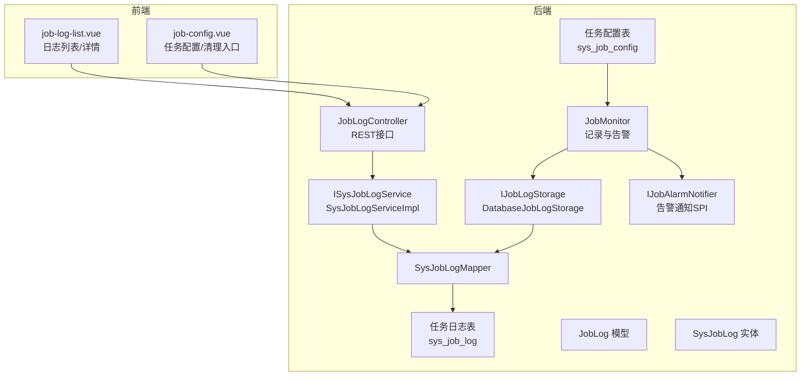
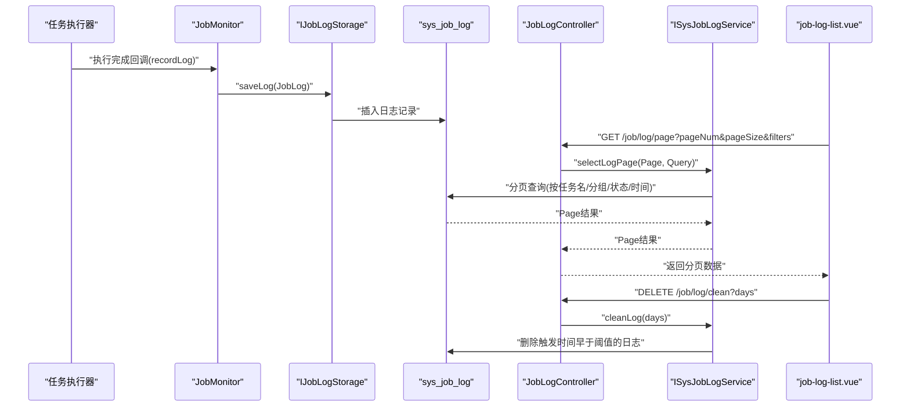
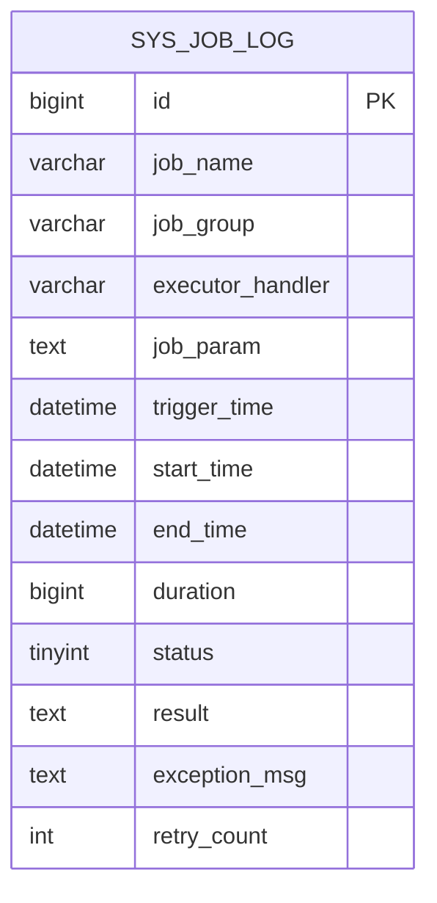
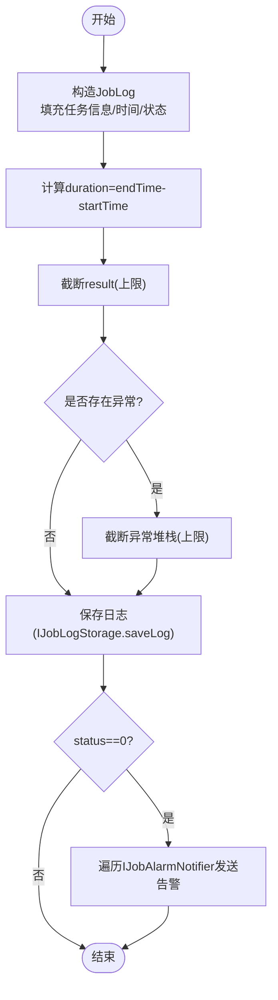
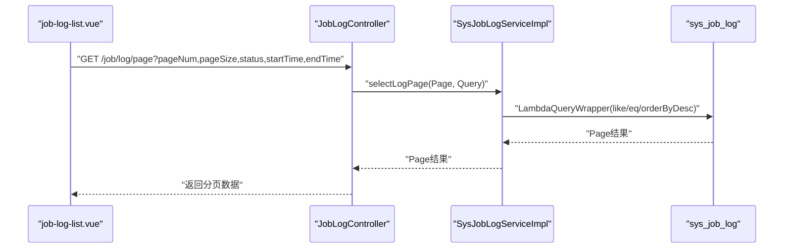
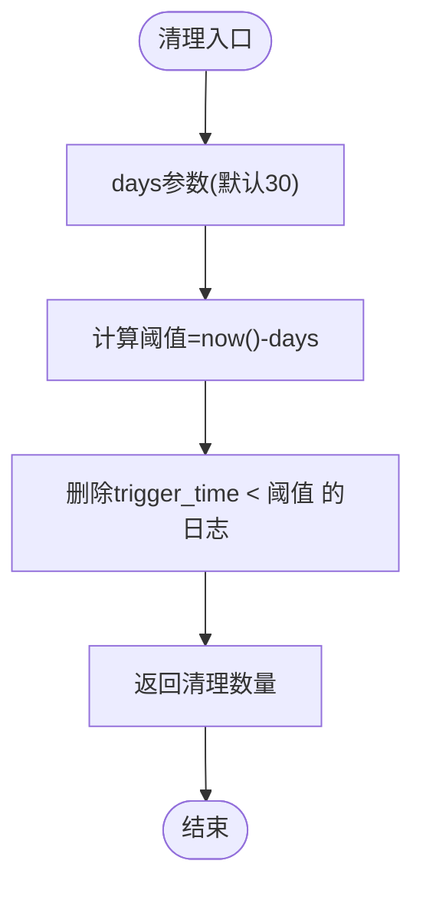
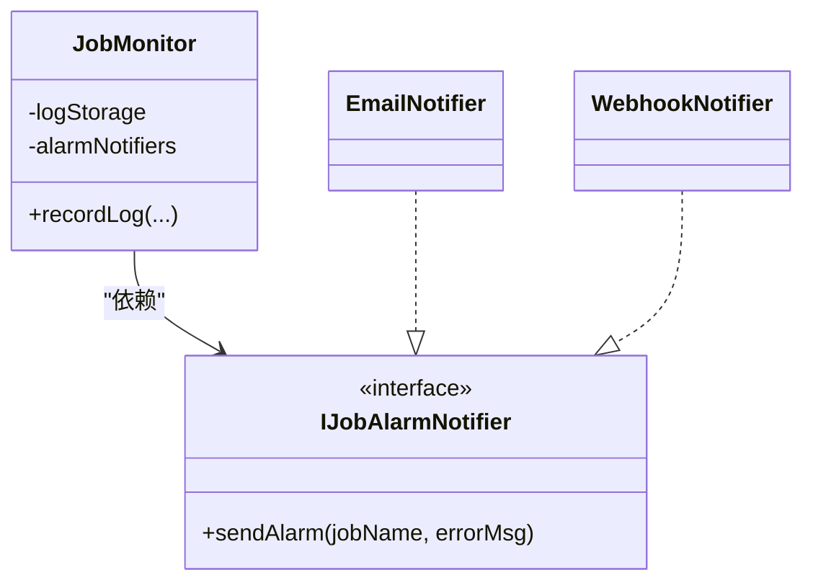
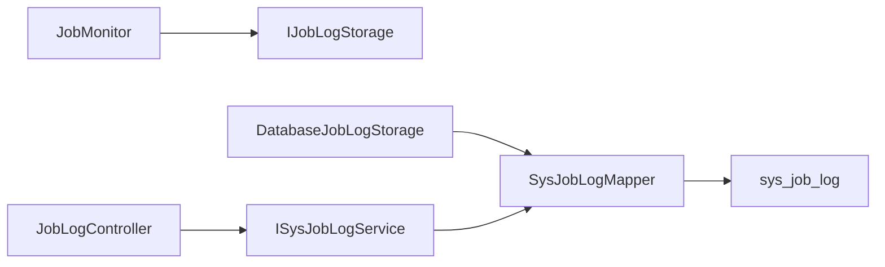

# 任务监控管理

<cite>
**本文引用的文件**
- [job_tables.sql](file://forge/forge-framework/forge-starter-parent/forge-starter-job/sql/job_tables.sql)
- [SysJobLog.java](file://forge/forge-framework/forge-plugin-parent/forge-plugin-job/src/main/java/com/mdframe/forge/plugin/job/entity/SysJobLog.java)
- [JobLog.java](file://forge/forge-framework/forge-plugin-parent/forge-plugin-job/src/main/java/com/mdframe/forge/plugin/job/model/JobLog.java)
- [JobMonitor.java](file://forge/forge-framework/forge-plugin-parent/forge-plugin-job/src/main/java/com/mdframe/forge/plugin/job/monitor/JobMonitor.java)
- [IJobLogStorage.java](file://forge/forge-framework/forge-plugin-parent/forge-plugin-job/src/main/java/com/mdframe/forge/plugin/job/spi/IJobLogStorage.java)
- [DatabaseJobLogStorage.java](file://forge/forge-framework/forge-plugin-parent/forge-plugin-job/src/main/java/com/mdframe/forge/plugin/job/service/impl/DatabaseJobLogStorage.java)
- [ISysJobLogService.java](file://forge/forge-framework/forge-plugin-parent/forge-plugin-job/src/main/java/com/mdframe/forge/plugin/job/service/ISysJobLogService.java)
- [SysJobLogServiceImpl.java](file://forge/forge-framework/forge-plugin-parent/forge-plugin-job/src/main/java/com/mdframe/forge/plugin/job/service/impl/SysJobLogServiceImpl.java)
- [SysJobLogMapper.java](file://forge/forge-framework/forge-plugin-parent/forge-plugin-job/src/main/java/com/mdframe/forge/plugin/job/mapper/SysJobLogMapper.java)
- [JobLogController.java](file://forge/forge-framework/forge-plugin-parent/forge-plugin-job/src/main/java/com/mdframe/forge/plugin/job/controller/JobLogController.java)
- [IJobAlarmNotifier.java](file://forge/forge-framework/forge-plugin-parent/forge-plugin-job/src/main/java/com/mdframe/forge/plugin/job/spi/IJobAlarmNotifier.java)
- [job-log-list.vue](file://forge-admin-ui/src/views/system/job-log-list.vue)
- [job-config.vue](file://forge-admin-ui/src/views/system/job-config.vue)
</cite>

## 目录
1. [简介](#简介)
2. [项目结构](#项目结构)
3. [核心组件](#核心组件)
4. [架构总览](#架构总览)
5. [组件详解](#组件详解)
6. [依赖关系分析](#依赖关系分析)
7. [性能考量](#性能考量)
8. [故障排查指南](#故障排查指南)
9. [结论](#结论)
10. [附录](#附录)

## 简介
本文件面向Forge任务监控管理功能，系统性阐述任务日志的数据结构、字段含义与存储策略；深入解析任务执行状态监控、执行时间统计与性能指标采集机制；说明任务日志的查询接口、分页查询与过滤条件；解释任务执行结果记录、异常信息捕获与错误日志管理；并给出日志清理策略、保留周期配置与存储优化建议。最后提供任务监控仪表板设计思路、告警机制配置与故障诊断指南。

## 项目结构
任务监控管理涉及后端数据模型、监控器、存储实现、服务层、控制器以及前端UI。整体采用“配置-执行-记录-查询-清理”的闭环设计，前后端通过REST接口交互。

图表来源
- [job_tables.sql](file://forge/forge-framework/forge-starter-parent/forge-starter-job/sql/job_tables.sql#L1-L48)
- [JobLogController.java](file://forge/forge-framework/forge-plugin-parent/forge-plugin-job/src/main/java/com/mdframe/forge/plugin/job/controller/JobLogController.java#L15-L55)
- [SysJobLogServiceImpl.java](file://forge/forge-framework/forge-plugin-parent/forge-plugin-job/src/main/java/com/mdframe/forge/plugin/job/service/impl/SysJobLogServiceImpl.java#L19-L42)
- [DatabaseJobLogStorage.java](file://forge/forge-framework/forge-plugin-parent/forge-plugin-job/src/main/java/com/mdframe/forge/plugin/job/service/impl/DatabaseJobLogStorage.java#L15-L40)
- [JobMonitor.java](file://forge/forge-framework/forge-plugin-parent/forge-plugin-job/src/main/java/com/mdframe/forge/plugin/job/monitor/JobMonitor.java#L18-L106)
- [IJobAlarmNotifier.java](file://forge/forge-framework/forge-plugin-parent/forge-plugin-job/src/main/java/com/mdframe/forge/plugin/job/spi/IJobAlarmNotifier.java#L1-L16)
- [job-log-list.vue](file://forge-admin-ui/src/views/system/job-log-list.vue#L1-L423)
- [job-config.vue](file://forge-admin-ui/src/views/system/job-config.vue#L1-L599)

章节来源
- [job_tables.sql](file://forge/forge-framework/forge-starter-parent/forge-starter-job/sql/job_tables.sql#L1-L48)
- [JobLogController.java](file://forge/forge-framework/forge-plugin-parent/forge-plugin-job/src/main/java/com/mdframe/forge/plugin/job/controller/JobLogController.java#L15-L55)
- [SysJobLogServiceImpl.java](file://forge/forge-framework/forge-plugin-parent/forge-plugin-job/src/main/java/com/mdframe/forge/plugin/job/service/impl/SysJobLogServiceImpl.java#L19-L42)
- [DatabaseJobLogStorage.java](file://forge/forge-framework/forge-plugin-parent/forge-plugin-job/src/main/java/com/mdframe/forge/plugin/job/service/impl/DatabaseJobLogStorage.java#L15-L40)
- [JobMonitor.java](file://forge/forge-framework/forge-plugin-parent/forge-plugin-job/src/main/java/com/mdframe/forge/plugin/job/monitor/JobMonitor.java#L18-L106)
- [IJobAlarmNotifier.java](file://forge/forge-framework/forge-plugin-parent/forge-plugin-job/src/main/java/com/mdframe/forge/plugin/job/spi/IJobAlarmNotifier.java#L1-L16)
- [job-log-list.vue](file://forge-admin-ui/src/views/system/job-log-list.vue#L1-L423)
- [job-config.vue](file://forge-admin-ui/src/views/system/job-config.vue#L1-L599)

## 核心组件
- 任务日志数据模型
  - JobLog：监控器生成的内部日志模型，包含任务元信息、时间戳、耗时、状态、结果、异常与重试次数等。
  - SysJobLog：MyBatis实体，映射sys_job_log表，用于持久化存储。
- 存储与查询
  - IJobLogStorage：日志存储SPI，支持扩展至ES/MongoDB等。
  - DatabaseJobLogStorage：基于MyBatis的数据库存储实现。
  - ISysJobLogService/SysJobLogServiceImpl：提供分页查询与按保留天数清理日志。
  - SysJobLogMapper：MyBatis Mapper接口。
- 监控与告警
  - JobMonitor：负责记录日志、计算耗时、截断超长文本、失败时触发告警通知。
  - IJobAlarmNotifier：告警通知SPI，支持扩展到钉钉/企微/邮件等。
- 控制器与前端
  - JobLogController：提供分页查询、详情查询、日志清理REST接口。
  - job-log-list.vue：日志列表、筛选、分页、详情弹窗。
  - job-config.vue：任务配置页面，集成日志清理入口与日志弹窗。

章节来源
- [JobLog.java](file://forge/forge-framework/forge-plugin-parent/forge-plugin-job/src/main/java/com/mdframe/forge/plugin/job/model/JobLog.java#L1-L78)
- [SysJobLog.java](file://forge/forge-framework/forge-plugin-parent/forge-plugin-job/src/main/java/com/mdframe/forge/plugin/job/entity/SysJobLog.java#L1-L80)
- [IJobLogStorage.java](file://forge/forge-framework/forge-plugin-parent/forge-plugin-job/src/main/java/com/mdframe/forge/plugin/job/spi/IJobLogStorage.java#L1-L20)
- [DatabaseJobLogStorage.java](file://forge/forge-framework/forge-plugin-parent/forge-plugin-job/src/main/java/com/mdframe/forge/plugin/job/service/impl/DatabaseJobLogStorage.java#L15-L40)
- [ISysJobLogService.java](file://forge/forge-framework/forge-plugin-parent/forge-plugin-job/src/main/java/com/mdframe/forge/plugin/job/service/ISysJobLogService.java#L1-L23)
- [SysJobLogServiceImpl.java](file://forge/forge-framework/forge-plugin-parent/forge-plugin-job/src/main/java/com/mdframe/forge/plugin/job/service/impl/SysJobLogServiceImpl.java#L19-L42)
- [SysJobLogMapper.java](file://forge/forge-framework/forge-plugin-parent/forge-plugin-job/src/main/java/com/mdframe/forge/plugin/job/mapper/SysJobLogMapper.java#L1-L13)
- [JobMonitor.java](file://forge/forge-framework/forge-plugin-parent/forge-plugin-job/src/main/java/com/mdframe/forge/plugin/job/monitor/JobMonitor.java#L18-L106)
- [IJobAlarmNotifier.java](file://forge/forge-framework/forge-plugin-parent/forge-plugin-job/src/main/java/com/mdframe/forge/plugin/job/spi/IJobAlarmNotifier.java#L1-L16)
- [JobLogController.java](file://forge/forge-framework/forge-plugin-parent/forge-plugin-job/src/main/java/com/mdframe/forge/plugin/job/controller/JobLogController.java#L15-L55)
- [job-log-list.vue](file://forge-admin-ui/src/views/system/job-log-list.vue#L1-L423)
- [job-config.vue](file://forge-admin-ui/src/views/system/job-config.vue#L1-L599)

## 架构总览
下图展示从任务执行到日志记录、存储、查询与清理的完整流程，以及前端如何通过REST接口进行交互。

图表来源
- [JobMonitor.java](file://forge/forge-framework/forge-plugin-parent/forge-plugin-job/src/main/java/com/mdframe/forge/plugin/job/monitor/JobMonitor.java#L32-L75)
- [IJobLogStorage.java](file://forge/forge-framework/forge-plugin-parent/forge-plugin-job/src/main/java/com/mdframe/forge/plugin/job/spi/IJobLogStorage.java#L9-L20)
- [DatabaseJobLogStorage.java](file://forge/forge-framework/forge-plugin-parent/forge-plugin-job/src/main/java/com/mdframe/forge/plugin/job/service/impl/DatabaseJobLogStorage.java#L22-L28)
- [SysJobLogMapper.java](file://forge/forge-framework/forge-plugin-parent/forge-plugin-job/src/main/java/com/mdframe/forge/plugin/job/mapper/SysJobLogMapper.java#L10-L13)
- [ISysJobLogService.java](file://forge/forge-framework/forge-plugin-parent/forge-plugin-job/src/main/java/com/mdframe/forge/plugin/job/service/ISysJobLogService.java#L10-L23)
- [SysJobLogServiceImpl.java](file://forge/forge-framework/forge-plugin-parent/forge-plugin-job/src/main/java/com/mdframe/forge/plugin/job/service/impl/SysJobLogServiceImpl.java#L24-L40)
- [JobLogController.java](file://forge/forge-framework/forge-plugin-parent/forge-plugin-job/src/main/java/com/mdframe/forge/plugin/job/controller/JobLogController.java#L32-L54)
- [job-log-list.vue](file://forge-admin-ui/src/views/system/job-log-list.vue#L220-L253)

## 组件详解

### 任务日志数据结构与字段含义
- sys_job_log 表字段与对应模型字段
  - id：日志主键
  - job_name：任务名称
  - job_group：任务分组
  - executor_handler：执行器Handler
  - job_param：任务参数
  - trigger_time：触发时间
  - start_time：开始时间
  - end_time：结束时间
  - duration：执行耗时（毫秒）
  - status：执行状态（1-成功 0-失败）
  - result：执行结果（最大长度限制）
  - exception_msg：异常信息（最大长度限制）
  - retry_count：重试次数
- 字段约束与索引
  - 主键：id
  - 索引：idx_job_name、idx_trigger_time、idx_status，便于按任务名、触发时间、状态快速检索
- 模型映射
  - JobLog：监控器内部模型，包含上述字段
  - SysJobLog：MyBatis实体，映射到sys_job_log

图表来源
- [job_tables.sql](file://forge/forge-framework/forge-starter-parent/forge-starter-job/sql/job_tables.sql#L24-L43)
- [SysJobLog.java](file://forge/forge-framework/forge-plugin-parent/forge-plugin-job/src/main/java/com/mdframe/forge/plugin/job/entity/SysJobLog.java#L15-L80)
- [JobLog.java](file://forge/forge-framework/forge-plugin-parent/forge-plugin-job/src/main/java/com/mdframe/forge/plugin/job/model/JobLog.java#L11-L78)

章节来源
- [job_tables.sql](file://forge/forge-framework/forge-starter-parent/forge-starter-job/sql/job_tables.sql#L24-L43)
- [SysJobLog.java](file://forge/forge-framework/forge-plugin-parent/forge-plugin-job/src/main/java/com/mdframe/forge/plugin/job/entity/SysJobLog.java#L15-L80)
- [JobLog.java](file://forge/forge-framework/forge-plugin-parent/forge-plugin-job/src/main/java/com/mdframe/forge/plugin/job/model/JobLog.java#L11-L78)

### 任务执行状态监控与性能指标
- 执行状态
  - status=1：成功；status=0：失败
- 执行时间统计
  - duration=endTime-startTime（毫秒）
  - trigger_time=start_time（触发时间）
- 性能指标
  - 可基于duration构建平均耗时、P95/P99耗时、失败率等指标
  - 建议在前端或独立报表模块聚合统计

章节来源
- [JobMonitor.java](file://forge/forge-framework/forge-plugin-parent/forge-plugin-job/src/main/java/com/mdframe/forge/plugin/job/monitor/JobMonitor.java#L35-L47)
- [SysJobLog.java](file://forge/forge-framework/forge-plugin-parent/forge-plugin-job/src/main/java/com/mdframe/forge/plugin/job/entity/SysJobLog.java#L40-L58)

### 日志记录、异常捕获与错误管理
- 记录流程
  - JobMonitor根据执行结果构造JobLog，计算duration，截断result与exception_msg，调用IJobLogStorage保存
  - 失败时遍历IJobAlarmNotifier列表发送告警
- 异常信息
  - 使用异常堆栈字符串作为exception_msg，长度上限保护
- 结果记录
  - result字段记录执行结果文本，长度上限保护

图表来源
- [JobMonitor.java](file://forge/forge-framework/forge-plugin-parent/forge-plugin-job/src/main/java/com/mdframe/forge/plugin/job/monitor/JobMonitor.java#L35-L75)

章节来源
- [JobMonitor.java](file://forge/forge-framework/forge-plugin-parent/forge-plugin-job/src/main/java/com/mdframe/forge/plugin/job/monitor/JobMonitor.java#L35-L75)

### 查询接口、分页与过滤条件
- 接口定义
  - GET /job/log/page：分页查询日志
  - GET /job/log/{id}：查询日志详情
  - DELETE /job/log/clean?days：按保留天数清理日志
- 分页与过滤
  - 后端：按jobName、jobGroup、status进行过滤，按trigger_time降序排序
  - 前端：支持按状态、时间范围筛选，内置分页参数pageNum/pageSize
- 返回结构
  - 分页接口返回Page对象，包含records/list与total

图表来源
- [JobLogController.java](file://forge/forge-framework/forge-plugin-parent/forge-plugin-job/src/main/java/com/mdframe/forge/plugin/job/controller/JobLogController.java#L32-L36)
- [SysJobLogServiceImpl.java](file://forge/forge-framework/forge-plugin-parent/forge-plugin-job/src/main/java/com/mdframe/forge/plugin/job/service/impl/SysJobLogServiceImpl.java#L24-L32)
- [job-log-list.vue](file://forge-admin-ui/src/views/system/job-log-list.vue#L220-L253)

章节来源
- [JobLogController.java](file://forge/forge-framework/forge-plugin-parent/forge-plugin-job/src/main/java/com/mdframe/forge/plugin/job/controller/JobLogController.java#L32-L54)
- [SysJobLogServiceImpl.java](file://forge/forge-framework/forge-plugin-parent/forge-plugin-job/src/main/java/com/mdframe/forge/plugin/job/service/impl/SysJobLogServiceImpl.java#L24-L32)
- [job-log-list.vue](file://forge-admin-ui/src/views/system/job-log-list.vue#L67-L83)
- [job-log-list.vue](file://forge-admin-ui/src/views/system/job-log-list.vue#L220-L253)

### 日志清理策略、保留周期与存储优化
- 清理策略
  - 按触发时间trigger_time早于阈值的记录进行批量删除
  - 支持“清理N天前”与“清空所有”
- 保留周期配置
  - 前端提供7天清理入口，亦可通过days参数自定义
- 存储优化建议
  - 定期归档历史日志至冷存储
  - 对高频查询字段建立合适索引（已存在）
  - 控制result与exception_msg长度，避免大字段膨胀
  - 建议对sys_job_log进行分区或分表（按时间）

图表来源
- [JobLogController.java](file://forge/forge-framework/forge-plugin-parent/forge-plugin-job/src/main/java/com/mdframe/forge/plugin/job/controller/JobLogController.java#L50-L54)
- [SysJobLogServiceImpl.java](file://forge/forge-framework/forge-plugin-parent/forge-plugin-job/src/main/java/com/mdframe/forge/plugin/job/service/impl/SysJobLogServiceImpl.java#L34-L40)
- [job-config.vue](file://forge-admin-ui/src/views/system/job-config.vue#L494-L517)

章节来源
- [SysJobLogServiceImpl.java](file://forge/forge-framework/forge-plugin-parent/forge-plugin-job/src/main/java/com/mdframe/forge/plugin/job/service/impl/SysJobLogServiceImpl.java#L34-L40)
- [JobLogController.java](file://forge/forge-framework/forge-plugin-parent/forge-plugin-job/src/main/java/com/mdframe/forge/plugin/job/controller/JobLogController.java#L50-L54)
- [job-config.vue](file://forge-admin-ui/src/views/system/job-config.vue#L494-L517)

### 告警机制配置与扩展
- 告警触发
  - JobMonitor在status=0且存在告警通知器时，逐个发送告警
- 通知扩展
  - 实现IJobAlarmNotifier接口，注册为Spring Bean即可接入新渠道（如钉钉、企微、邮件、WebHook等）
- 配置位置
  - 任务配置表sys_job_config包含alarm_email与webhook_url字段，可用于任务级告警配置

图表来源
- [JobMonitor.java](file://forge/forge-framework/forge-plugin-parent/forge-plugin-job/src/main/java/com/mdframe/forge/plugin/job/monitor/JobMonitor.java#L26-L30)
- [IJobAlarmNotifier.java](file://forge/forge-framework/forge-plugin-parent/forge-plugin-job/src/main/java/com/mdframe/forge/plugin/job/spi/IJobAlarmNotifier.java#L7-L15)
- [job_tables.sql](file://forge/forge-framework/forge-starter-parent/forge-starter-job/sql/job_tables.sql#L16-L17)

章节来源
- [JobMonitor.java](file://forge/forge-framework/forge-plugin-parent/forge-plugin-job/src/main/java/com/mdframe/forge/plugin/job/monitor/JobMonitor.java#L62-L74)
- [IJobAlarmNotifier.java](file://forge/forge-framework/forge-plugin-parent/forge-plugin-job/src/main/java/com/mdframe/forge/plugin/job/spi/IJobAlarmNotifier.java#L7-L15)
- [job_tables.sql](file://forge/forge-framework/forge-starter-parent/forge-starter-job/sql/job_tables.sql#L16-L17)

### 任务监控仪表板设计与故障诊断
- 仪表板建议指标
  - 任务成功率、失败率、平均耗时、P95/P99耗时、吞吐量（每分钟任务数）
  - 按任务分组与Handler维度聚合
- 前端UI能力
  - job-log-list.vue：按状态、时间范围筛选，分页展示，详情弹窗查看结果与异常
  - job-config.vue：提供日志弹窗、刷新、清理入口
- 故障诊断步骤
  - 在job-log-list.vue中定位失败任务，查看异常信息
  - 检查sys_job_config中的alarm_email/webhook_url是否正确配置
  - 核对sys_job_log索引与表结构，必要时进行优化
  - 使用清理功能释放存储空间，观察后续趋势

章节来源
- [job-log-list.vue](file://forge-admin-ui/src/views/system/job-log-list.vue#L1-L423)
- [job-config.vue](file://forge-admin-ui/src/views/system/job-config.vue#L1-L599)

## 依赖关系分析
- 组件耦合
  - JobMonitor依赖IJobLogStorage与IJobAlarmNotifier，保持监控与存储/通知解耦
  - SysJobLogServiceImpl封装查询与清理逻辑，职责单一
  - DatabaseJobLogStorage通过Mapper访问数据库，遵循分层原则
- 关键依赖链
  - JobMonitor → IJobLogStorage → SysJobLogMapper → sys_job_log
  - JobLogController → ISysJobLogService → SysJobLogMapper
- 循环依赖
  - 未发现循环依赖，层次清晰

图表来源
- [JobMonitor.java](file://forge/forge-framework/forge-plugin-parent/forge-plugin-job/src/main/java/com/mdframe/forge/plugin/job/monitor/JobMonitor.java#L26-L28)
- [IJobLogStorage.java](file://forge/forge-framework/forge-plugin-parent/forge-plugin-job/src/main/java/com/mdframe/forge/plugin/job/spi/IJobLogStorage.java#L9-L20)
- [DatabaseJobLogStorage.java](file://forge/forge-framework/forge-plugin-parent/forge-plugin-job/src/main/java/com/mdframe/forge/plugin/job/service/impl/DatabaseJobLogStorage.java#L19-L21)
- [SysJobLogMapper.java](file://forge/forge-framework/forge-plugin-parent/forge-plugin-job/src/main/java/com/mdframe/forge/plugin/job/mapper/SysJobLogMapper.java#L10-L13)
- [JobLogController.java](file://forge/forge-framework/forge-plugin-parent/forge-plugin-job/src/main/java/com/mdframe/forge/plugin/job/controller/JobLogController.java#L27-L27)
- [ISysJobLogService.java](file://forge/forge-framework/forge-plugin-parent/forge-plugin-job/src/main/java/com/mdframe/forge/plugin/job/service/ISysJobLogService.java#L10-L10)

章节来源
- [JobMonitor.java](file://forge/forge-framework/forge-plugin-parent/forge-plugin-job/src/main/java/com/mdframe/forge/plugin/job/monitor/JobMonitor.java#L26-L28)
- [DatabaseJobLogStorage.java](file://forge/forge-framework/forge-plugin-parent/forge-plugin-job/src/main/java/com/mdframe/forge/plugin/job/service/impl/DatabaseJobLogStorage.java#L19-L21)
- [SysJobLogMapper.java](file://forge/forge-framework/forge-plugin-parent/forge-plugin-job/src/main/java/com/mdframe/forge/plugin/job/mapper/SysJobLogMapper.java#L10-L13)
- [JobLogController.java](file://forge/forge-framework/forge-plugin-parent/forge-plugin-job/src/main/java/com/mdframe/forge/plugin/job/controller/JobLogController.java#L27-L27)
- [ISysJobLogService.java](file://forge/forge-framework/forge-plugin-parent/forge-plugin-job/src/main/java/com/mdframe/forge/plugin/job/service/ISysJobLogService.java#L10-L10)

## 性能考量
- 查询性能
  - 已有索引idx_job_name、idx_trigger_time、idx_status，建议结合实际查询场景评估是否增加复合索引
- 写入性能
  - result与exception_msg长度限制有助于控制单条记录大小，降低写放大
  - 批量清理可减少碎片与锁竞争
- 存储成本
  - 建议定期归档历史日志，控制热数据规模
- 前端体验
  - job-log-list.vue支持横向滚动与分页，适合大数据量浏览

## 故障排查指南
- 无法查询日志
  - 检查请求参数pageNum/pageSize/status/时间范围是否正确
  - 确认后端分页与过滤逻辑是否匹配
- 日志未落库
  - 检查IJobLogStorage实现是否生效（默认DatabaseJobLogStorage）
  - 关注JobMonitor保存日志时的异常日志
- 告警未发送
  - 确认IJobAlarmNotifier实现已注册为Bean
  - 检查任务配置中的alarm_email/webhook_url
- 存储空间不足
  - 使用清理接口按天数清理历史日志
  - 考虑外部归档与分表策略

章节来源
- [JobMonitor.java](file://forge/forge-framework/forge-plugin-parent/forge-plugin-job/src/main/java/com/mdframe/forge/plugin/job/monitor/JobMonitor.java#L56-L60)
- [DatabaseJobLogStorage.java](file://forge/forge-framework/forge-plugin-parent/forge-plugin-job/src/main/java/com/mdframe/forge/plugin/job/service/impl/DatabaseJobLogStorage.java#L22-L28)
- [job-config.vue](file://forge-admin-ui/src/views/system/job-config.vue#L494-L517)

## 结论
Forge任务监控管理以清晰的分层设计实现了“执行-记录-查询-清理”的闭环：通过JobLog与SysJobLog统一数据模型，JobMonitor负责记录与告警，ISysJobLogService提供稳定的查询与清理能力，前端UI提供直观的筛选、分页与详情查看。配合合理的索引与长度限制，系统在保证可观测性的同时兼顾性能与成本。建议在生产环境中结合业务需求进一步完善归档、分表与指标聚合策略，并持续优化告警通道与可视化面板。

## 附录
- 数据库脚本位置：[job_tables.sql](file://forge/forge-framework/forge-starter-parent/forge-starter-job/sql/job_tables.sql#L1-L48)
- 前端页面位置：
  - [job-log-list.vue](file://forge-admin-ui/src/views/system/job-log-list.vue#L1-L423)
  - [job-config.vue](file://forge-admin-ui/src/views/system/job-config.vue#L1-L599)