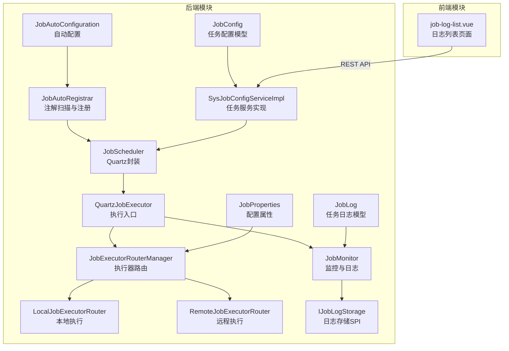
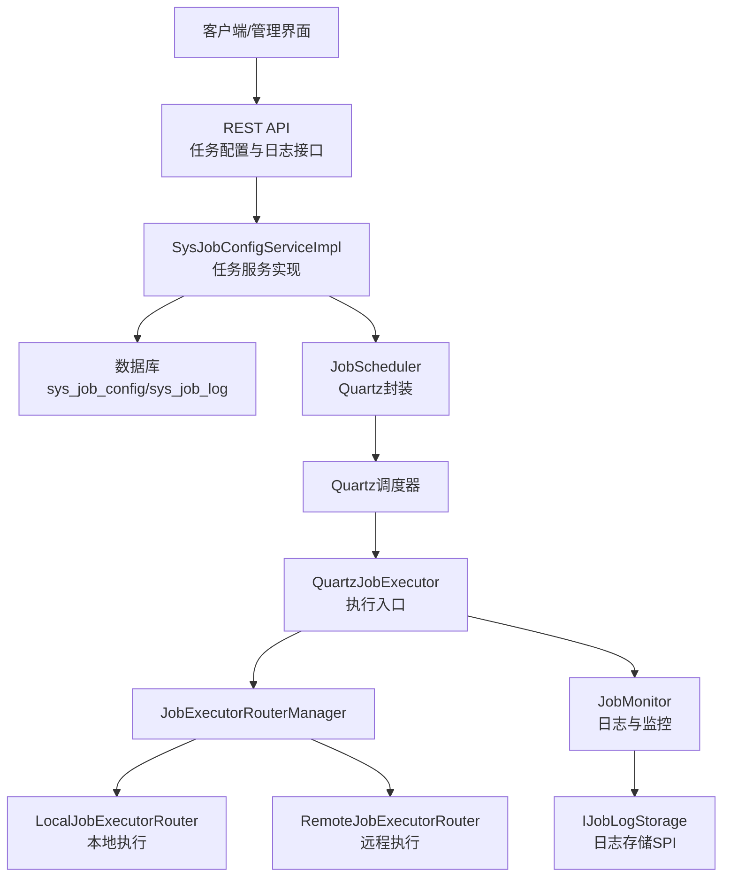
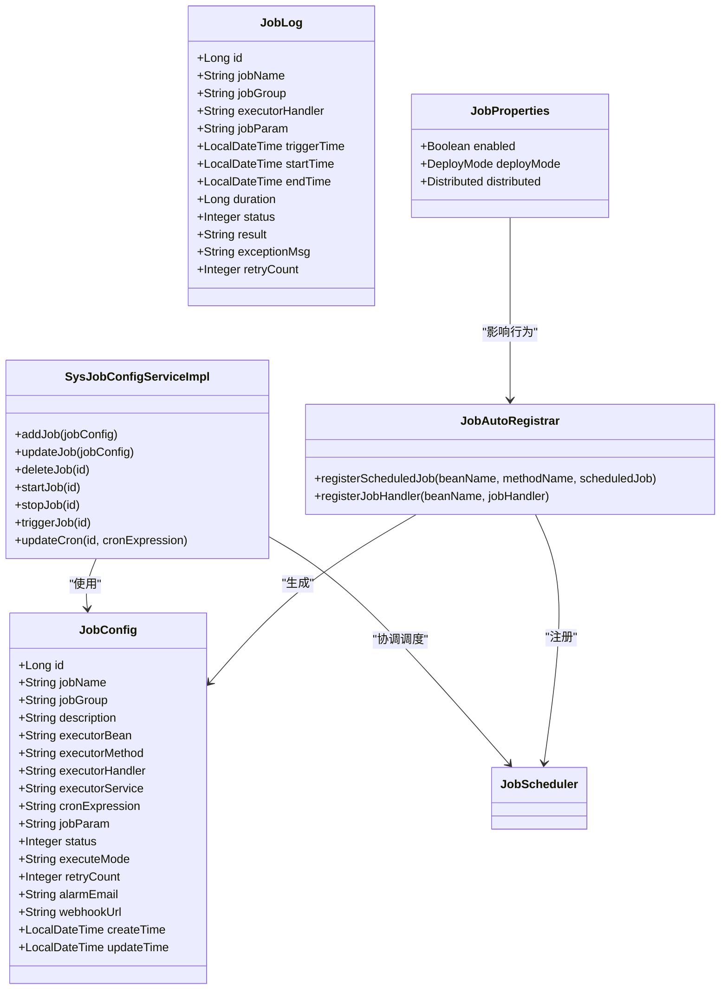
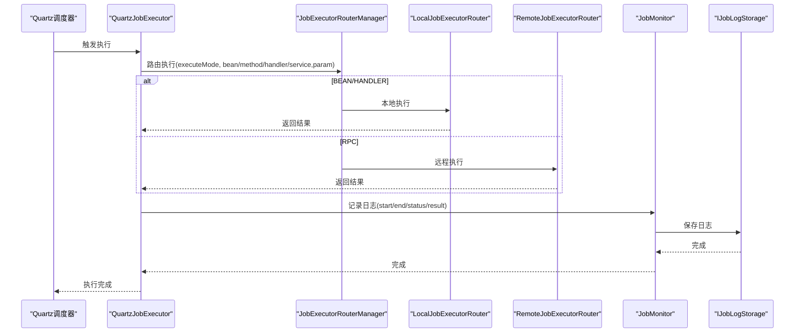
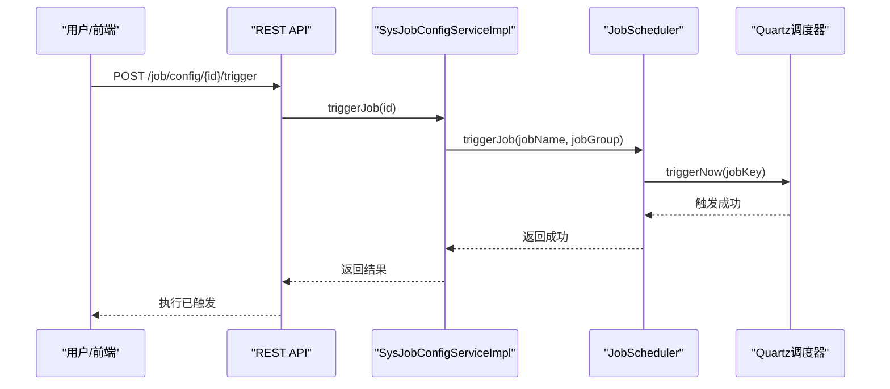
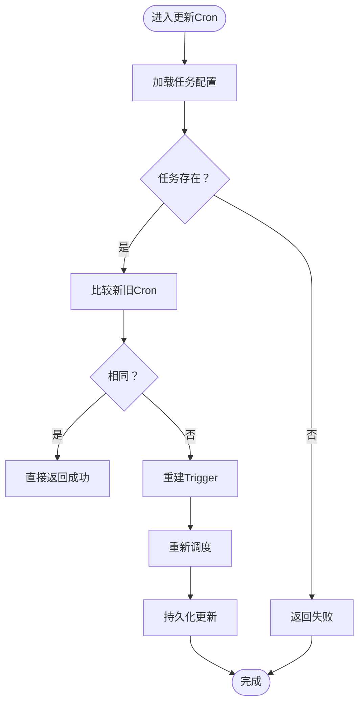
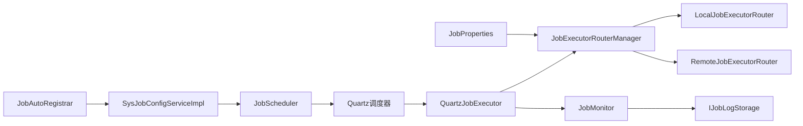

# 任务调度概述

<cite>
**本文引用的文件**
- [API.md](file://forge/forge-framework/forge-starter-parent/forge-starter-job/API.md)
- [JobScheduler.java](file://forge/forge-framework/forge-plugin-parent/forge-plugin-job/src/main/java/com/mdframe/forge/plugin/job/scheduler/JobScheduler.java)
- [QuartzJobExecutor.java](file://forge/forge-framework/forge-plugin-parent/forge-plugin-job/src/main/java/com/mdframe/forge/plugin/job/scheduler/QuartzJobExecutor.java)
- [JobConfig.java](file://forge/forge-framework/forge-plugin-parent/forge-plugin-job/src/main/java/com/mdframe/forge/plugin/job/model/JobConfig.java)
- [JobLog.java](file://forge/forge-framework/forge-plugin-parent/forge-plugin-job/src/main/java/com/mdframe/forge/plugin/job/model/JobLog.java)
- [SysJobConfigServiceImpl.java](file://forge/forge-framework/forge-plugin-parent/forge-plugin-job/src/main/java/com/mdframe/forge/plugin/job/service/impl/SysJobConfigServiceImpl.java)
- [JobAutoRegistrar.java](file://forge/forge-framework/forge-plugin-parent/forge-plugin-job/src/main/java/com/mdframe/forge/plugin/job/registry/JobAutoRegistrar.java)
- [JobAutoConfiguration.java](file://forge/forge-framework/forge-plugin-parent/forge-plugin-job/src/main/java/com/mdframe/forge/plugin/job/config/JobAutoConfiguration.java)
- [JobProperties.java](file://forge/forge-framework/forge-plugin-parent/forge-plugin-job/src/main/java/com/mdframe/forge/plugin/job/config/JobProperties.java)
- [IJobExecutorRouter.java](file://forge/forge-framework/forge-plugin-parent/forge-plugin-job/src/main/java/com/mdframe/forge/plugin/job/executor/IJobExecutorRouter.java)
- [LocalJobExecutorRouter.java](file://forge/forge-framework/forge-plugin-parent/forge-plugin-job/src/main/java/com/mdframe/forge/plugin/job/executor/impl/LocalJobExecutorRouter.java)
- [RemoteJobExecutorRouter.java](file://forge/forge-framework/forge-plugin-parent/forge-plugin-job/src/main/java/com/mdframe/forge/plugin/job/executor/impl/RemoteJobExecutorRouter.java)
- [JobExecutorRouterManager.java](file://forge/forge-framework/forge-plugin-parent/forge-plugin-job/src/main/java/com/mdframe/forge/plugin/job/executor/JobExecutorRouterManager.java)
- [JobMonitor.java](file://forge/forge-framework/forge-plugin-parent/forge-plugin-job/src/main/java/com/mdframe/forge/plugin/job/monitor/JobMonitor.java)
- [IJobLogStorage.java](file://forge/forge-framework/forge-plugin-parent/forge-plugin-job/src/main/java/com/mdframe/forge/plugin/job/spi/IJobLogStorage.java)
- [job_tables.sql](file://forge/forge-framework/forge-starter-parent/forge-starter-job/sql/job_tables.sql)
- [job-log-list.vue](file://forge-admin-ui/src/views/system/job-log-list.vue)
</cite>

## 目录
1. [引言](#引言)
2. [项目结构](#项目结构)
3. [核心组件](#核心组件)
4. [架构总览](#架构总览)
5. [详细组件分析](#详细组件分析)
6. [依赖关系分析](#依赖关系分析)
7. [性能考虑](#性能考虑)
8. [故障排查指南](#故障排查指南)
9. [结论](#结论)
10. [附录](#附录)

## 引言
本概述面向Forge任务调度模块，系统性介绍定时任务系统的核心概念与整体架构。内容涵盖任务调度基本原理、应用场景与设计目标，以及任务配置管理、任务执行监控、任务日志管理等核心功能模块。文档同时说明任务调度在企业级应用中的价值，包括批处理作业、数据同步、定时清理等典型场景，并提供系统整体视图与关键组件关系图，帮助读者快速理解与落地使用。

## 项目结构
Forge任务调度模块位于forge/forge-framework/forge-plugin-parent/forge-plugin-job下，采用插件化与自动装配结合的方式，通过Spring Boot自动配置机制完成初始化与扫描。前端管理界面位于forge-admin-ui，提供任务配置与日志查询的可视化能力。

图表来源
- [JobAutoConfiguration.java](file://forge/forge-framework/forge-plugin-parent/forge-plugin-job/src/main/java/com/mdframe/forge/plugin/job/config/JobAutoConfiguration.java#L11-L26)
- [JobAutoRegistrar.java](file://forge/forge-framework/forge-plugin-parent/forge-plugin-job/src/main/java/com/mdframe/forge/plugin/job/registry/JobAutoRegistrar.java#L25-L105)
- [JobScheduler.java](file://forge/forge-framework/forge-plugin-parent/forge-plugin-job/src/main/java/com/mdframe/forge/plugin/job/scheduler/JobScheduler.java#L13-L219)
- [QuartzJobExecutor.java](file://forge/forge-framework/forge-plugin-parent/forge-plugin-job/src/main/java/com/mdframe/forge/plugin/job/scheduler/QuartzJobExecutor.java#L13-L61)
- [JobExecutorRouterManager.java](file://forge/forge-framework/forge-plugin-parent/forge-plugin-job/src/main/java/com/mdframe/forge/plugin/job/executor/JobExecutorRouterManager.java#L14-L41)
- [LocalJobExecutorRouter.java](file://forge/forge-framework/forge-plugin-parent/forge-plugin-job/src/main/java/com/mdframe/forge/plugin/job/executor/impl/LocalJobExecutorRouter.java#L15-L49)
- [RemoteJobExecutorRouter.java](file://forge/forge-framework/forge-plugin-parent/forge-plugin-job/src/main/java/com/mdframe/forge/plugin/job/executor/impl/RemoteJobExecutorRouter.java#L20-L56)
- [JobMonitor.java](file://forge/forge-framework/forge-plugin-parent/forge-plugin-job/src/main/java/com/mdframe/forge/plugin/job/monitor/JobMonitor.java#L1-L16)
- [SysJobConfigServiceImpl.java](file://forge/forge-framework/forge-plugin-parent/forge-plugin-job/src/main/java/com/mdframe/forge/plugin/job/service/impl/SysJobConfigServiceImpl.java#L49-L137)
- [JobConfig.java](file://forge/forge-framework/forge-plugin-parent/forge-plugin-job/src/main/java/com/mdframe/forge/plugin/job/model/JobConfig.java#L10-L98)
- [JobLog.java](file://forge/forge-framework/forge-plugin-parent/forge-plugin-job/src/main/java/com/mdframe/forge/plugin/job/model/JobLog.java#L10-L78)
- [JobProperties.java](file://forge/forge-framework/forge-plugin-parent/forge-plugin-job/src/main/java/com/mdframe/forge/plugin/job/config/JobProperties.java#L9-L65)
- [job-log-list.vue](file://forge-admin-ui/src/views/system/job-log-list.vue#L1-L422)

章节来源
- [JobAutoConfiguration.java](file://forge/forge-framework/forge-plugin-parent/forge-plugin-job/src/main/java/com/mdframe/forge/plugin/job/config/JobAutoConfiguration.java#L11-L26)
- [job_tables.sql](file://forge/forge-framework/forge-starter-parent/forge-starter-job/sql/job_tables.sql#L1-L48)

## 核心组件
- 任务配置模型：定义任务名称、分组、执行器、Cron表达式、执行模式、状态等字段，支撑任务的持久化与调度控制。
- 任务调度管理器：封装Quartz核心操作，提供任务的新增、更新、暂停/恢复、立即触发、Cron更新等能力。
- 任务执行入口：QuartzJobExecutor作为Quartz Job实现，负责从JobDataMap读取执行参数，调用路由管理器执行任务，并记录执行日志。
- 执行器路由体系：JobExecutorRouterManager统一调度，LocalJobExecutorRouter支持Bean与Handler两种本地模式；RemoteJobExecutorRouter支持RPC远程模式，配合分布式部署。
- 任务监控与日志：JobMonitor负责记录每次执行的开始/结束时间、耗时、状态、结果与异常，并通过SPI接口IJobLogStorage进行存储扩展。
- 自动注册与配置：JobAutoRegistrar扫描@ScheduledJob与@JobHandler注解，自动注册任务至调度器；JobAutoConfiguration完成组件扫描与属性启用；JobProperties提供部署模式与分布式配置。
- 任务服务实现：SysJobConfigServiceImpl提供任务的增删改启停、立即触发、Cron更新等业务操作，协调数据库与调度器的一致性。

章节来源
- [JobConfig.java](file://forge/forge-framework/forge-plugin-parent/forge-plugin-job/src/main/java/com/mdframe/forge/plugin/job/model/JobConfig.java#L10-L98)
- [JobScheduler.java](file://forge/forge-framework/forge-plugin-parent/forge-plugin-job/src/main/java/com/mdframe/forge/plugin/job/scheduler/JobScheduler.java#L13-L219)
- [QuartzJobExecutor.java](file://forge/forge-framework/forge-plugin-parent/forge-plugin-job/src/main/java/com/mdframe/forge/plugin/job/scheduler/QuartzJobExecutor.java#L13-L61)
- [JobExecutorRouterManager.java](file://forge/forge-framework/forge-plugin-parent/forge-plugin-job/src/main/java/com/mdframe/forge/plugin/job/executor/JobExecutorRouterManager.java#L14-L41)
- [LocalJobExecutorRouter.java](file://forge/forge-framework/forge-plugin-parent/forge-plugin-job/src/main/java/com/mdframe/forge/plugin/job/executor/impl/LocalJobExecutorRouter.java#L15-L49)
- [RemoteJobExecutorRouter.java](file://forge/forge-framework/forge-plugin-parent/forge-plugin-job/src/main/java/com/mdframe/forge/plugin/job/executor/impl/RemoteJobExecutorRouter.java#L20-L56)
- [JobMonitor.java](file://forge/forge-framework/forge-plugin-parent/forge-plugin-job/src/main/java/com/mdframe/forge/plugin/job/monitor/JobMonitor.java#L1-L16)
- [SysJobConfigServiceImpl.java](file://forge/forge-framework/forge-plugin-parent/forge-plugin-job/src/main/java/com/mdframe/forge/plugin/job/service/impl/SysJobConfigServiceImpl.java#L49-L137)
- [JobAutoRegistrar.java](file://forge/forge-framework/forge-plugin-parent/forge-plugin-job/src/main/java/com/mdframe/forge/plugin/job/registry/JobAutoRegistrar.java#L25-L105)
- [JobAutoConfiguration.java](file://forge/forge-framework/forge-plugin-parent/forge-plugin-job/src/main/java/com/mdframe/forge/plugin/job/config/JobAutoConfiguration.java#L11-L26)
- [JobProperties.java](file://forge/forge-framework/forge-plugin-parent/forge-plugin-job/src/main/java/com/mdframe/forge/plugin/job/config/JobProperties.java#L9-L65)

## 架构总览
Forge任务调度采用“配置驱动 + Quartz内核 + 可插拔执行器”的架构设计。系统通过自动配置与注解扫描完成初始化，任务配置持久化于数据库，执行过程由Quartz触发，实际执行通过路由管理器选择本地或远程执行器，最终统一由监控器记录日志并支持告警扩展。

图表来源
- [API.md](file://forge/forge-framework/forge-starter-parent/forge-starter-job/API.md#L1-L195)
- [SysJobConfigServiceImpl.java](file://forge/forge-framework/forge-plugin-parent/forge-plugin-job/src/main/java/com/mdframe/forge/plugin/job/service/impl/SysJobConfigServiceImpl.java#L49-L137)
- [JobScheduler.java](file://forge/forge-framework/forge-plugin-parent/forge-plugin-job/src/main/java/com/mdframe/forge/plugin/job/scheduler/JobScheduler.java#L13-L219)
- [QuartzJobExecutor.java](file://forge/forge-framework/forge-plugin-parent/forge-plugin-job/src/main/java/com/mdframe/forge/plugin/job/scheduler/QuartzJobExecutor.java#L13-L61)
- [JobExecutorRouterManager.java](file://forge/forge-framework/forge-plugin-parent/forge-plugin-job/src/main/java/com/mdframe/forge/plugin/job/executor/JobExecutorRouterManager.java#L14-L41)
- [LocalJobExecutorRouter.java](file://forge/forge-framework/forge-plugin-parent/forge-plugin-job/src/main/java/com/mdframe/forge/plugin/job/executor/impl/LocalJobExecutorRouter.java#L15-L49)
- [RemoteJobExecutorRouter.java](file://forge/forge-framework/forge-plugin-parent/forge-plugin-job/src/main/java/com/mdframe/forge/plugin/job/executor/impl/RemoteJobExecutorRouter.java#L20-L56)
- [JobMonitor.java](file://forge/forge-framework/forge-plugin-parent/forge-plugin-job/src/main/java/com/mdframe/forge/plugin/job/monitor/JobMonitor.java#L1-L16)
- [IJobLogStorage.java](file://forge/forge-framework/forge-plugin-parent/forge-plugin-job/src/main/java/com/mdframe/forge/plugin/job/spi/IJobLogStorage.java#L1-L20)

## 详细组件分析

### 任务配置管理
- 数据模型：JobConfig包含任务标识、描述、执行器信息、Cron表达式、执行模式、状态、重试次数、告警配置等字段；JobLog记录执行结果与异常。
- 服务实现：SysJobConfigServiceImpl提供任务的新增、更新、删除、启动、停止、立即触发、Cron更新等操作，确保数据库与调度器状态一致。
- 自动注册：JobAutoRegistrar扫描@ScheduledJob与@JobHandler注解，自动创建任务配置并注册到调度器，减少手工配置成本。
- 配置属性：JobProperties提供启用开关、部署模式（单体/分布式）、分布式配置（注册中心、超时、重试）等。

图表来源
- [JobConfig.java](file://forge/forge-framework/forge-plugin-parent/forge-plugin-job/src/main/java/com/mdframe/forge/plugin/job/model/JobConfig.java#L10-L98)
- [JobLog.java](file://forge/forge-framework/forge-plugin-parent/forge-plugin-job/src/main/java/com/mdframe/forge/plugin/job/model/JobLog.java#L10-L78)
- [SysJobConfigServiceImpl.java](file://forge/forge-framework/forge-plugin-parent/forge-plugin-job/src/main/java/com/mdframe/forge/plugin/job/service/impl/SysJobConfigServiceImpl.java#L49-L137)
- [JobAutoRegistrar.java](file://forge/forge-framework/forge-plugin-parent/forge-plugin-job/src/main/java/com/mdframe/forge/plugin/job/registry/JobAutoRegistrar.java#L25-L105)
- [JobProperties.java](file://forge/forge-framework/forge-plugin-parent/forge-plugin-job/src/main/java/com/mdframe/forge/plugin/job/config/JobProperties.java#L9-L65)

章节来源
- [SysJobConfigServiceImpl.java](file://forge/forge-framework/forge-plugin-parent/forge-plugin-job/src/main/java/com/mdframe/forge/plugin/job/service/impl/SysJobConfigServiceImpl.java#L49-L137)
- [JobAutoRegistrar.java](file://forge/forge-framework/forge-plugin-parent/forge-plugin-job/src/main/java/com/mdframe/forge/plugin/job/registry/JobAutoRegistrar.java#L25-L105)
- [JobConfig.java](file://forge/forge-framework/forge-plugin-parent/forge-plugin-job/src/main/java/com/mdframe/forge/plugin/job/model/JobConfig.java#L10-L98)
- [JobLog.java](file://forge/forge-framework/forge-plugin-parent/forge-plugin-job/src/main/java/com/mdframe/forge/plugin/job/model/JobLog.java#L10-L78)
- [JobProperties.java](file://forge/forge-framework/forge-plugin-parent/forge-plugin-job/src/main/java/com/mdframe/forge/plugin/job/config/JobProperties.java#L9-L65)

### 任务执行监控与日志管理
- 执行入口：QuartzJobExecutor从JobDataMap读取执行参数，调用JobExecutorRouterManager进行路由执行，并在finally块中记录执行日志。
- 路由管理：JobExecutorRouterManager遍历可用路由器，按执行模式选择本地或远程执行器。
- 日志记录：JobMonitor计算耗时、捕获异常、记录状态与结果，并通过IJobLogStorage SPI进行存储扩展。
- 前端展示：job-log-list.vue提供日志分页查询、状态筛选、时间范围筛选等功能，调用REST API获取数据。

图表来源
- [QuartzJobExecutor.java](file://forge/forge-framework/forge-plugin-parent/forge-plugin-job/src/main/java/com/mdframe/forge/plugin/job/scheduler/QuartzJobExecutor.java#L13-L61)
- [JobExecutorRouterManager.java](file://forge/forge-framework/forge-plugin-parent/forge-plugin-job/src/main/java/com/mdframe/forge/plugin/job/executor/JobExecutorRouterManager.java#L14-L41)
- [LocalJobExecutorRouter.java](file://forge/forge-framework/forge-plugin-parent/forge-plugin-job/src/main/java/com/mdframe/forge/plugin/job/executor/impl/LocalJobExecutorRouter.java#L15-L49)
- [RemoteJobExecutorRouter.java](file://forge/forge-framework/forge-plugin-parent/forge-plugin-job/src/main/java/com/mdframe/forge/plugin/job/executor/impl/RemoteJobExecutorRouter.java#L20-L56)
- [JobMonitor.java](file://forge/forge-framework/forge-plugin-parent/forge-plugin-job/src/main/java/com/mdframe/forge/plugin/job/monitor/JobMonitor.java#L1-L16)
- [IJobLogStorage.java](file://forge/forge-framework/forge-plugin-parent/forge-plugin-job/src/main/java/com/mdframe/forge/plugin/job/spi/IJobLogStorage.java#L1-L20)

章节来源
- [QuartzJobExecutor.java](file://forge/forge-framework/forge-plugin-parent/forge-plugin-job/src/main/java/com/mdframe/forge/plugin/job/scheduler/QuartzJobExecutor.java#L13-L61)
- [JobExecutorRouterManager.java](file://forge/forge-framework/forge-plugin-parent/forge-plugin-job/src/main/java/com/mdframe/forge/plugin/job/executor/JobExecutorRouterManager.java#L14-L41)
- [LocalJobExecutorRouter.java](file://forge/forge-framework/forge-plugin-parent/forge-plugin-job/src/main/java/com/mdframe/forge/plugin/job/executor/impl/LocalJobExecutorRouter.java#L15-L49)
- [RemoteJobExecutorRouter.java](file://forge/forge-framework/forge-plugin-parent/forge-plugin-job/src/main/java/com/mdframe/forge/plugin/job/executor/impl/RemoteJobExecutorRouter.java#L20-L56)
- [JobMonitor.java](file://forge/forge-framework/forge-plugin-parent/forge-plugin-job/src/main/java/com/mdframe/forge/plugin/job/monitor/JobMonitor.java#L1-L16)
- [IJobLogStorage.java](file://forge/forge-framework/forge-plugin-parent/forge-plugin-job/src/main/java/com/mdframe/forge/plugin/job/spi/IJobLogStorage.java#L1-L20)
- [job-log-list.vue](file://forge-admin-ui/src/views/system/job-log-list.vue#L1-L422)

### 任务调度流程（立即执行）
以下序列图展示通过REST API触发任务立即执行的完整流程。

图表来源
- [API.md](file://forge/forge-framework/forge-starter-parent/forge-starter-job/API.md#L101-L104)
- [SysJobConfigServiceImpl.java](file://forge/forge-framework/forge-plugin-parent/forge-plugin-job/src/main/java/com/mdframe/forge/plugin/job/service/impl/SysJobConfigServiceImpl.java#L118-L126)
- [JobScheduler.java](file://forge/forge-framework/forge-plugin-parent/forge-plugin-job/src/main/java/com/mdframe/forge/plugin/job/scheduler/JobScheduler.java#L151-L168)

章节来源
- [API.md](file://forge/forge-framework/forge-starter-parent/forge-starter-job/API.md#L101-L104)
- [SysJobConfigServiceImpl.java](file://forge/forge-framework/forge-plugin-parent/forge-plugin-job/src/main/java/com/mdframe/forge/plugin/job/service/impl/SysJobConfigServiceImpl.java#L118-L126)
- [JobScheduler.java](file://forge/forge-framework/forge-plugin-parent/forge-plugin-job/src/main/java/com/mdframe/forge/plugin/job/scheduler/JobScheduler.java#L151-L168)

### Cron表达式更新流程
以下流程图展示更新任务Cron表达式的处理逻辑。

图表来源
- [SysJobConfigServiceImpl.java](file://forge/forge-framework/forge-plugin-parent/forge-plugin-job/src/main/java/com/mdframe/forge/plugin/job/service/impl/SysJobConfigServiceImpl.java#L128-L144)
- [JobScheduler.java](file://forge/forge-framework/forge-plugin-parent/forge-plugin-job/src/main/java/com/mdframe/forge/plugin/job/scheduler/JobScheduler.java#L171-L206)

章节来源
- [SysJobConfigServiceImpl.java](file://forge/forge-framework/forge-plugin-parent/forge-plugin-job/src/main/java/com/mdframe/forge/plugin/job/service/impl/SysJobConfigServiceImpl.java#L128-L144)
- [JobScheduler.java](file://forge/forge-framework/forge-plugin-parent/forge-plugin-job/src/main/java/com/mdframe/forge/plugin/job/scheduler/JobScheduler.java#L171-L206)

## 依赖关系分析
- 组件耦合：JobAutoRegistrar与SysJobConfigServiceImpl紧密协作，前者负责自动注册，后者负责业务操作；两者均依赖JobScheduler与数据库映射。
- 执行器路由：JobExecutorRouterManager聚合多种执行器路由器，通过接口隔离具体实现，降低耦合度。
- 存储扩展：IJobLogStorage提供日志存储的SPI接口，便于扩展到ES/MongoDB等外部存储。
- 配置驱动：JobProperties集中管理部署模式与分布式配置，影响执行器路由策略。

图表来源
- [JobAutoRegistrar.java](file://forge/forge-framework/forge-plugin-parent/forge-plugin-job/src/main/java/com/mdframe/forge/plugin/job/registry/JobAutoRegistrar.java#L25-L105)
- [SysJobConfigServiceImpl.java](file://forge/forge-framework/forge-plugin-parent/forge-plugin-job/src/main/java/com/mdframe/forge/plugin/job/service/impl/SysJobConfigServiceImpl.java#L49-L137)
- [JobScheduler.java](file://forge/forge-framework/forge-plugin-parent/forge-plugin-job/src/main/java/com/mdframe/forge/plugin/job/scheduler/JobScheduler.java#L13-L219)
- [QuartzJobExecutor.java](file://forge/forge-framework/forge-plugin-parent/forge-plugin-job/src/main/java/com/mdframe/forge/plugin/job/scheduler/QuartzJobExecutor.java#L13-L61)
- [JobExecutorRouterManager.java](file://forge/forge-framework/forge-plugin-parent/forge-plugin-job/src/main/java/com/mdframe/forge/plugin/job/executor/JobExecutorRouterManager.java#L14-L41)
- [LocalJobExecutorRouter.java](file://forge/forge-framework/forge-plugin-parent/forge-plugin-job/src/main/java/com/mdframe/forge/plugin/job/executor/impl/LocalJobExecutorRouter.java#L15-L49)
- [RemoteJobExecutorRouter.java](file://forge/forge-framework/forge-plugin-parent/forge-plugin-job/src/main/java/com/mdframe/forge/plugin/job/executor/impl/RemoteJobExecutorRouter.java#L20-L56)
- [JobMonitor.java](file://forge/forge-framework/forge-plugin-parent/forge-plugin-job/src/main/java/com/mdframe/forge/plugin/job/monitor/JobMonitor.java#L1-L16)
- [IJobLogStorage.java](file://forge/forge-framework/forge-plugin-parent/forge-plugin-job/src/main/java/com/mdframe/forge/plugin/job/spi/IJobLogStorage.java#L1-L20)
- [JobProperties.java](file://forge/forge-framework/forge-plugin-parent/forge-plugin-job/src/main/java/com/mdframe/forge/plugin/job/config/JobProperties.java#L9-L65)

章节来源
- [JobAutoRegistrar.java](file://forge/forge-framework/forge-plugin-parent/forge-plugin-job/src/main/java/com/mdframe/forge/plugin/job/registry/JobAutoRegistrar.java#L25-L105)
- [SysJobConfigServiceImpl.java](file://forge/forge-framework/forge-plugin-parent/forge-plugin-job/src/main/java/com/mdframe/forge/plugin/job/service/impl/SysJobConfigServiceImpl.java#L49-L137)
- [JobProperties.java](file://forge/forge-framework/forge-plugin-parent/forge-plugin-job/src/main/java/com/mdframe/forge/plugin/job/config/JobProperties.java#L9-L65)

## 性能考虑
- 任务并发与资源：Quartz负责任务触发与并发控制，建议合理设置Cron表达式与任务粒度，避免高并发冲突。
- 执行器选择：本地执行适合轻量任务，远程RPC适合跨服务或跨实例的任务执行，需关注网络延迟与超时配置。
- 日志存储：默认日志输出到应用日志，生产环境建议实现IJobLogStorage SPI，将日志落库或接入外部存储以提升查询与归档效率。
- 配置优化：通过JobProperties调整分布式模式下的超时与重试次数，平衡可靠性与性能。

## 故障排查指南
- 任务未执行：检查任务状态、Cron表达式、调度器是否正常运行；确认JobAutoRegistrar是否正确扫描到注解。
- 执行异常：查看JobMonitor记录的异常信息与堆栈，定位具体执行器或Handler问题；检查远程执行器服务是否可达。
- 日志查询：通过job-log-list.vue或REST API查询日志，按任务名称、状态、时间范围筛选；必要时清理历史日志释放空间。
- 配置校验：核对数据库表结构与字段，确保sys_job_config与sys_job_log表存在且字段匹配。

章节来源
- [job-log-list.vue](file://forge-admin-ui/src/views/system/job-log-list.vue#L1-L422)
- [job_tables.sql](file://forge/forge-framework/forge-starter-parent/forge-starter-job/sql/job_tables.sql#L1-L48)
- [JobMonitor.java](file://forge/forge-framework/forge-plugin-parent/forge-plugin-job/src/main/java/com/mdframe/forge/plugin/job/monitor/JobMonitor.java#L1-L16)

## 结论
Forge任务调度模块通过清晰的职责划分与可插拔设计，实现了从任务配置、调度执行到日志监控的全链路闭环。其基于Quartz的成熟内核与灵活的执行器路由，既满足单体应用的本地执行需求，也支持分布式场景下的远程执行与扩展。配合完善的REST API与前端管理界面，能够高效支撑企业级应用中的批处理、数据同步、定时清理等典型场景。

## 附录
- 常用Cron表达式示例可在API文档中查阅，便于快速配置周期性任务。
- 数据库表结构定义位于job_tables.sql，包含任务配置表与任务日志表的关键字段与索引设计。

章节来源
- [API.md](file://forge/forge-framework/forge-starter-parent/forge-starter-job/API.md#L174-L184)
- [job_tables.sql](file://forge/forge-framework/forge-starter-parent/forge-starter-job/sql/job_tables.sql#L1-L48)