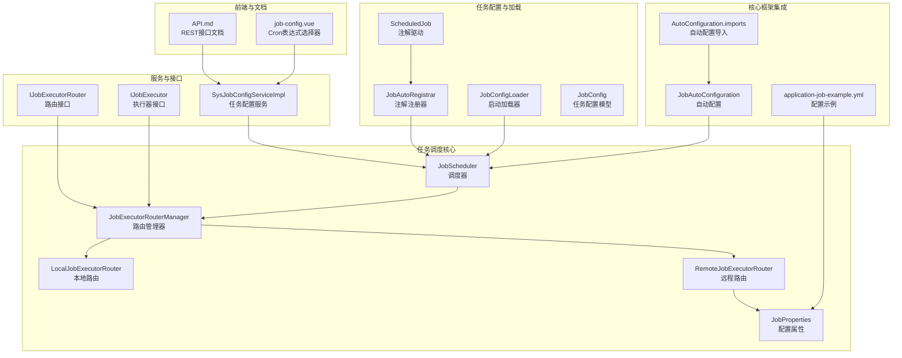
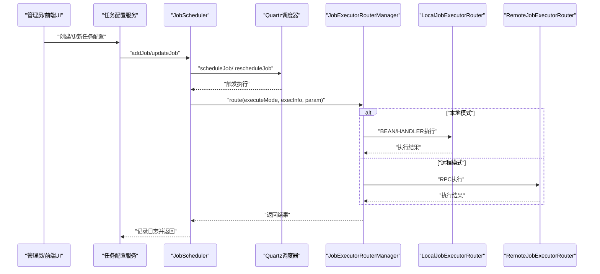
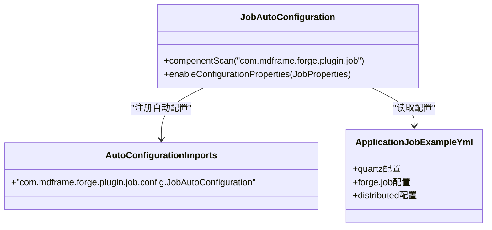
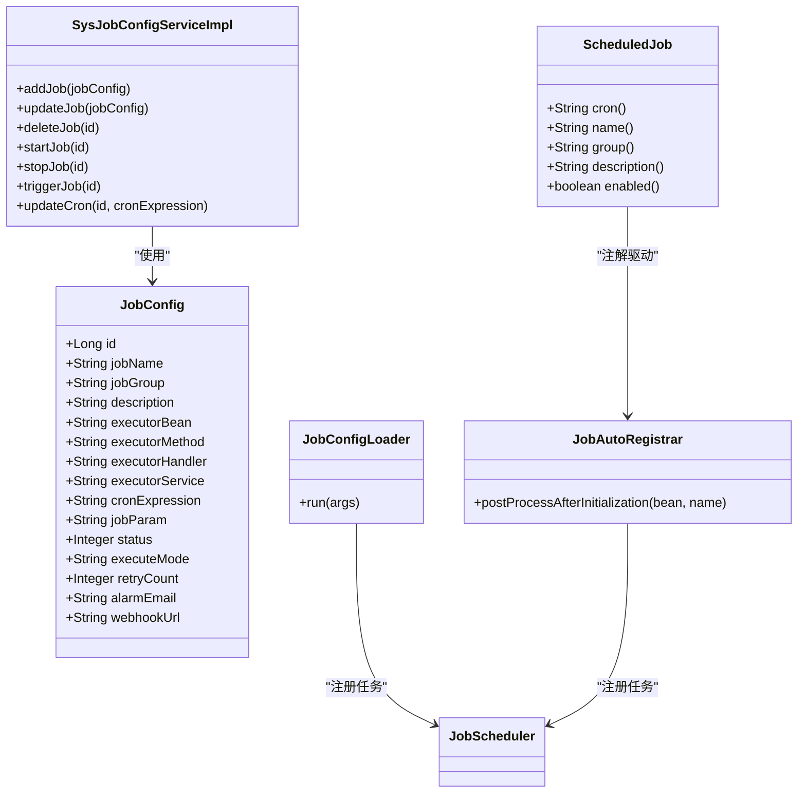
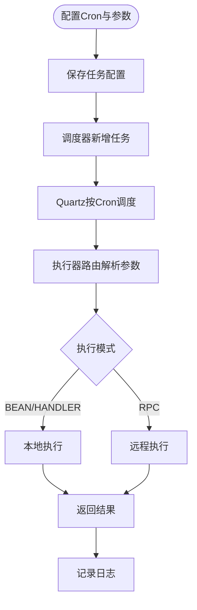
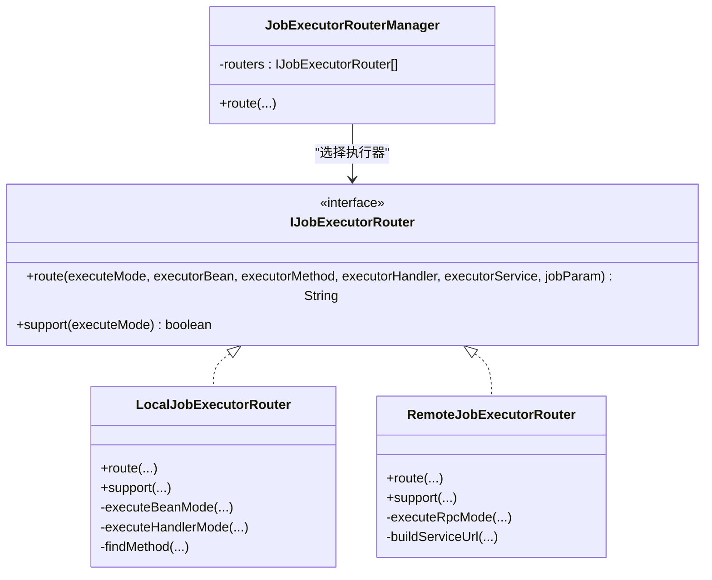
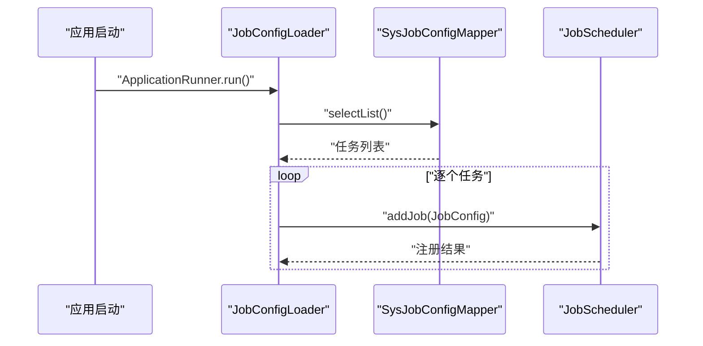
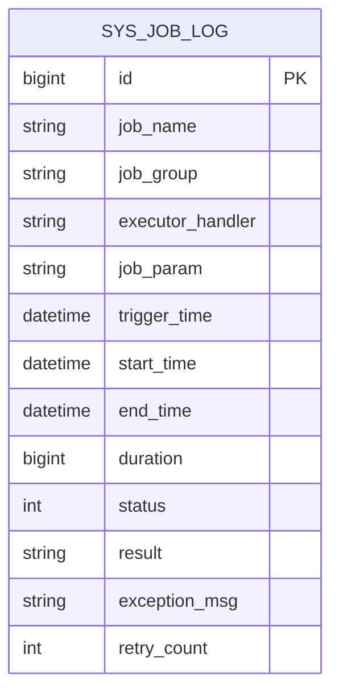
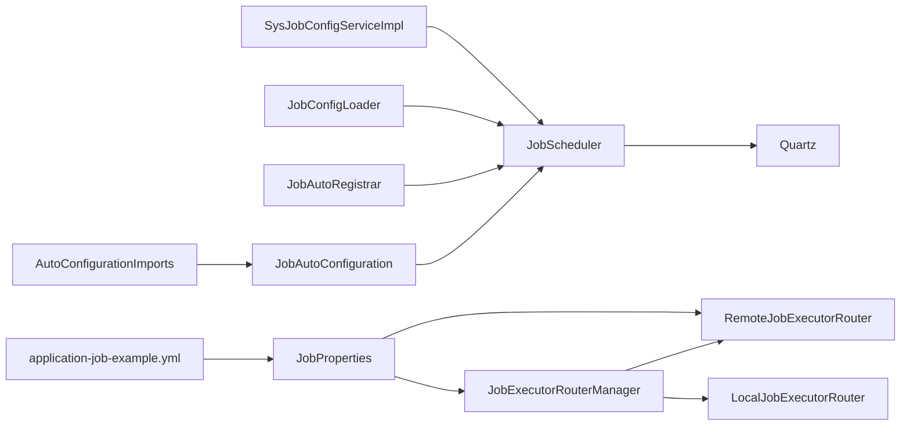

# 任务调度模块

<cite>
**本文引用的文件**
- [JobScheduler.java](file://forge/forge-framework/forge-plugin-parent/forge-plugin-job/src/main/java/com/mdframe/forge/plugin/job/scheduler/JobScheduler.java)
- [JobConfig.java](file://forge/forge-framework/forge-plugin-parent/forge-plugin-job/src/main/java/com/mdframe/forge/plugin/job/model/JobConfig.java)
- [IJobExecutor.java](file://forge/forge-framework/forge-plugin-parent/forge-plugin-job/src/main/java/com/mdframe/forge/plugin/job/executor/IJobExecutor.java)
- [IJobExecutorRouter.java](file://forge/forge-framework/forge-plugin-parent/forge-plugin-job/src/main/java/com/mdframe/forge/plugin/job/executor/IJobExecutorRouter.java)
- [LocalJobExecutorRouter.java](file://forge/forge-framework/forge-plugin-parent/forge-plugin-job/src/main/java/com/mdframe/forge/plugin/job/executor/impl/LocalJobExecutorRouter.java)
- [RemoteJobExecutorRouter.java](file://forge/forge-framework/forge-plugin-parent/forge-plugin-job/src/main/java/com/mdframe/forge/plugin/job/executor/impl/RemoteJobExecutorRouter.java)
- [JobExecutorRouterManager.java](file://forge/forge-framework/forge-plugin-parent/forge-plugin-job/src/main/java/com/mdframe/forge/plugin/job/executor/JobExecutorRouterManager.java)
- [JobConfigLoader.java](file://forge/forge-framework/forge-plugin-parent/forge-plugin-job/src/main/java/com/mdframe/forge/plugin/job/loader/JobConfigLoader.java)
- [JobAutoRegistrar.java](file://forge/forge-framework/forge-plugin-parent/forge-plugin-job/src/main/java/com/mdframe/forge/plugin/job/registry/JobAutoRegistrar.java)
- [JobProperties.java](file://forge/forge-framework/forge-plugin-parent/forge-plugin-job/src/main/java/com/mdframe/forge/plugin/job/config/JobProperties.java)
- [SysJobConfigServiceImpl.java](file://forge/forge-framework/forge-plugin-parent/forge-plugin-job/src/main/java/com/mdframe/forge/plugin/job/service/impl/SysJobConfigServiceImpl.java)
- [API.md](file://forge/forge-framework/forge-starter-parent/forge-starter-job/API.md)
- [job-config.vue](file://forge-admin-ui/src/views/system/job-config.vue)
- [JobLog.java](file://forge/forge-framework/forge-plugin-parent/forge-plugin-job/src/main/java/com/mdframe/forge/plugin/job/model/JobLog.java)
- [JobAutoConfiguration.java](file://forge/forge-framework/forge-plugin-parent/forge-plugin-job/src/main/java/com/mdframe/forge/plugin/job/config/JobAutoConfiguration.java)
- [application-job-example.yml](file://forge/forge-framework/forge-plugin-parent/forge-plugin-job/src/main/resources/application-job-example.yml)
- [org.springframework.boot.autoconfigure.AutoConfiguration.imports](file://forge/forge-framework/forge-plugin-parent/forge-plugin-job/src/main/resources/META-INF/spring/org.springframework.boot.autoconfigure.AutoConfiguration.imports)
- [ScheduledJob.java](file://forge/forge-framework/forge-starter-parent/forge-starter-job/src/main/java/com/mdframe/forge/starter/job/annotation/ScheduledJob.java)
</cite>

## 更新摘要
**所做更改**
- 更新架构概述以反映job starter模块被移除，任务调度功能整合到核心框架中
- 新增Spring Boot自动配置机制说明
- 更新项目结构图以体现新的架构布局
- 补充配置文件和注解驱动的实现细节
- 更新依赖关系分析以反映新的模块组织方式

## 目录
1. [简介](#简介)
2. [项目结构](#项目结构)
3. [核心组件](#核心组件)
4. [架构总览](#架构总览)
5. [组件详解](#组件详解)
6. [依赖关系分析](#依赖关系分析)
7. [性能与可靠性](#性能与可靠性)
8. [故障排查指南](#故障排查指南)
9. [结论](#结论)
10. [附录](#附录)

## 简介
本文件面向Forge任务调度模块，系统性解析定时任务系统的设计理念与实现机制，覆盖任务配置管理、Cron表达式、任务参数传递、执行器调度机制、远程执行路由、任务监控与日志存储等关键能力。经过架构简化后，任务调度功能已整合到核心框架中，移除了独立的job starter模块，采用Spring Boot自动配置机制实现无缝集成。

## 项目结构
任务调度模块现已整合到核心框架中，采用插件化的模块设计，围绕Quartz调度内核提供完整的任务生命周期管理能力。模块通过Spring Boot自动配置机制实现零配置启动，支持注解驱动的任务注册和REST API管理。

**图表来源**
- [JobAutoConfiguration.java:11-26](file://forge/forge-framework/forge-plugin-parent/forge-plugin-job/src/main/java/com/mdframe/forge/plugin/job/config/JobAutoConfiguration.java#L11-L26)
- [org.springframework.boot.autoconfigure.AutoConfiguration.imports:1-2](file://forge/forge-framework/forge-plugin-parent/forge-plugin-job/src/main/resources/META-INF/spring/org.springframework.boot.autoconfigure.AutoConfiguration.imports#L1-L2)
- [application-job-example.yml:1-67](file://forge/forge-framework/forge-plugin-parent/forge-plugin-job/src/main/resources/application-job-example.yml#L1-L67)
- [ScheduledJob.java:1-39](file://forge/forge-framework/forge-starter-parent/forge-starter-job/src/main/java/com/mdframe/forge/starter/job/annotation/ScheduledJob.java#L1-L39)

**章节来源**
- [JobAutoConfiguration.java:11-26](file://forge/forge-framework/forge-plugin-parent/forge-plugin-job/src/main/java/com/mdframe/forge/plugin/job/config/JobAutoConfiguration.java#L11-L26)
- [org.springframework.boot.autoconfigure.AutoConfiguration.imports:1-2](file://forge/forge-framework/forge-plugin-parent/forge-plugin-job/src/main/resources/META-INF/spring/org.springframework.boot.autoconfigure.AutoConfiguration.imports#L1-L2)
- [application-job-example.yml:36-67](file://forge/forge-framework/forge-plugin-parent/forge-plugin-job/src/main/resources/application-job-example.yml#L36-L67)

## 核心组件
- **自动配置机制**：通过JobAutoConfiguration和AutoConfiguration.imports实现Spring Boot自动配置，无需额外配置即可启用任务调度功能。
- **任务调度器**：封装Quartz核心操作，提供任务新增、更新、删除、暂停、恢复、立即触发、热更新Cron等能力。
- **执行器路由**：统一抽象本地与远程两种执行路径，按执行模式自动选择合适路由器。
- **配置模型与加载**：任务配置模型承载执行器信息、Cron表达式、参数与状态；支持启动时从数据库加载与注解自动注册。
- **任务日志**：记录每次任务执行的触发时间、开始/结束时间、耗时、状态、结果与异常信息。

**章节来源**
- [JobAutoConfiguration.java:11-26](file://forge/forge-framework/forge-plugin-parent/forge-plugin-job/src/main/java/com/mdframe/forge/plugin/job/config/JobAutoConfiguration.java#L11-L26)
- [JobScheduler.java:23-206](file://forge/forge-framework/forge-plugin-parent/forge-plugin-job/src/main/java/com/mdframe/forge/plugin/job/scheduler/JobScheduler.java#L23-L206)
- [JobConfig.java:10-98](file://forge/forge-framework/forge-plugin-parent/forge-plugin-job/src/main/java/com/mdframe/forge/plugin/job/model/JobConfig.java#L10-L98)
- [JobConfigLoader.java:28-81](file://forge/forge-framework/forge-plugin-parent/forge-plugin-job/src/main/java/com/mdframe/forge/plugin/job/loader/JobConfigLoader.java#L28-L81)
- [JobLog.java:1-77](file://forge/forge-framework/forge-plugin-parent/forge-plugin-job/src/main/java/com/mdframe/forge/plugin/job/model/JobLog.java#L1-L77)

## 架构总览
下图展示了从任务配置到执行与监控的关键交互流程，体现了架构简化的成果。

**图表来源**
- [SysJobConfigServiceImpl.java:49-104](file://forge/forge-framework/forge-plugin-parent/forge-plugin-job/src/main/java/com/mdframe/forge/plugin/job/service/impl/SysJobConfigServiceImpl.java#L49-L104)
- [JobScheduler.java:23-102](file://forge/forge-framework/forge-plugin-parent/forge-plugin-job/src/main/java/com/mdframe/forge/plugin/job/scheduler/JobScheduler.java#L23-L102)
- [JobExecutorRouterManager.java:24-40](file://forge/forge-framework/forge-plugin-parent/forge-plugin-job/src/main/java/com/mdframe/forge/plugin/job/executor/JobExecutorRouterManager.java#L24-L40)
- [LocalJobExecutorRouter.java:19-39](file://forge/forge-framework/forge-plugin-parent/forge-plugin-job/src/main/java/com/mdframe/forge/plugin/job/executor/impl/LocalJobExecutorRouter.java#L19-L39)
- [RemoteJobExecutorRouter.java:28-45](file://forge/forge-framework/forge-plugin-parent/forge-plugin-job/src/main/java/com/mdframe/forge/plugin/job/executor/impl/RemoteJobExecutorRouter.java#L28-L45)

## 组件详解

### Spring Boot自动配置机制
任务调度模块通过Spring Boot自动配置机制实现无缝集成，移除了独立的starter模块，直接在核心框架中提供配置能力。

- **自动配置类**：JobAutoConfiguration负责组件扫描和属性绑定
- **配置导入**：通过META-INF/spring/org.springframework.boot.autoconfigure.AutoConfiguration.imports声明自动配置
- **配置示例**：application-job-example.yml提供完整的配置参考

**图表来源**
- [JobAutoConfiguration.java:11-26](file://forge/forge-framework/forge-plugin-parent/forge-plugin-job/src/main/java/com/mdframe/forge/plugin/job/config/JobAutoConfiguration.java#L11-L26)
- [org.springframework.boot.autoconfigure.AutoConfiguration.imports:1-2](file://forge/forge-framework/forge-plugin-parent/forge-plugin-job/src/main/resources/META-INF/spring/org.springframework.boot.autoconfigure.AutoConfiguration.imports#L1-L2)
- [application-job-example.yml:36-67](file://forge/forge-framework/forge-plugin-parent/forge-plugin-job/src/main/resources/application-job-example.yml#L36-L67)

**章节来源**
- [JobAutoConfiguration.java:11-26](file://forge/forge-framework/forge-plugin-parent/forge-plugin-job/src/main/java/com/mdframe/forge/plugin/job/config/JobAutoConfiguration.java#L11-L26)
- [org.springframework.boot.autoconfigure.AutoConfiguration.imports:1-2](file://forge/forge-framework/forge-plugin-parent/forge-plugin-job/src/main/resources/META-INF/spring/org.springframework.boot.autoconfigure.AutoConfiguration.imports#L1-L2)
- [application-job-example.yml:36-67](file://forge/forge-framework/forge-plugin-parent/forge-plugin-job/src/main/resources/application-job-example.yml#L36-L67)

### 任务配置管理
- 配置模型包含任务标识、描述、执行器信息（Bean/HANDLER/RPC）、Cron表达式、参数、状态、执行模式、重试次数、告警与WebHook等字段。
- 服务层负责将持久化实体转换为调度模型，并委托调度器进行CRUD与状态变更。
- 支持启动时从数据库批量加载任务配置，也支持注解自动注册（扫描@ScheduledJob与@JobHandler）。

**图表来源**
- [JobConfig.java:10-98](file://forge/forge-framework/forge-plugin-parent/forge-plugin-job/src/main/java/com/mdframe/forge/plugin/job/model/JobConfig.java#L10-L98)
- [SysJobConfigServiceImpl.java:49-104](file://forge/forge-framework/forge-plugin-parent/forge-plugin-job/src/main/java/com/mdframe/forge/plugin/job/service/impl/SysJobConfigServiceImpl.java#L49-L104)
- [JobConfigLoader.java:28-81](file://forge/forge-framework/forge-plugin-parent/forge-plugin-job/src/main/java/com/mdframe/forge/plugin/job/loader/JobConfigLoader.java#L28-L81)
- [JobAutoRegistrar.java:34-103](file://forge/forge-framework/forge-plugin-parent/forge-plugin-job/src/main/java/com/mdframe/forge/plugin/job/registry/JobAutoRegistrar.java#L34-L103)
- [ScheduledJob.java:12-38](file://forge/forge-framework/forge-starter-parent/forge-starter-job/src/main/java/com/mdframe/forge/starter/job/annotation/ScheduledJob.java#L12-L38)

**章节来源**
- [JobConfig.java:10-98](file://forge/forge-framework/forge-plugin-parent/forge-plugin-job/src/main/java/com/mdframe/forge/plugin/job/model/JobConfig.java#L10-L98)
- [SysJobConfigServiceImpl.java:49-144](file://forge/forge-framework/forge-plugin-parent/forge-plugin-job/src/main/java/com/mdframe/forge/plugin/job/service/impl/SysJobConfigServiceImpl.java#L49-L144)
- [JobConfigLoader.java:28-81](file://forge/forge-framework/forge-plugin-parent/forge-plugin-job/src/main/java/com/mdframe/forge/plugin/job/loader/JobConfigLoader.java#L28-L81)
- [JobAutoRegistrar.java:34-103](file://forge/forge-framework/forge-plugin-parent/forge-plugin-job/src/main/java/com/mdframe/forge/plugin/job/registry/JobAutoRegistrar.java#L34-L103)
- [ScheduledJob.java:12-38](file://forge/forge-framework/forge-starter-parent/forge-starter-job/src/main/java/com/mdframe/forge/starter/job/annotation/ScheduledJob.java#L12-L38)

### Cron表达式与任务参数传递
- Cron表达式通过任务配置模型与调度器进行绑定，支持热更新而不需重启任务。
- 任务参数通过JobDataMap传递给Quartz作业，执行器路由在本地或远程模式下均可接收并处理。
- 前端提供常用Cron表达式选择器，便于快速配置。

**图表来源**
- [JobScheduler.java:47-51](file://forge/forge-framework/forge-plugin-parent/forge-plugin-job/src/main/java/com/mdframe/forge/plugin/job/scheduler/JobScheduler.java#L47-L51)
- [JobScheduler.java:178-206](file://forge/forge-framework/forge-plugin-parent/forge-plugin-job/src/main/java/com/mdframe/forge/plugin/job/scheduler/JobScheduler.java#L178-L206)
- [LocalJobExecutorRouter.java:44-72](file://forge/forge-framework/forge-plugin-parent/forge-plugin-job/src/main/java/com/mdframe/forge/plugin/job/executor/impl/LocalJobExecutorRouter.java#L44-L72)
- [RemoteJobExecutorRouter.java:55-93](file://forge/forge-framework/forge-plugin-parent/forge-plugin-job/src/main/java/com/mdframe/forge/plugin/job/executor/impl/RemoteJobExecutorRouter.java#L55-L93)
- [job-config.vue:46-79](file://forge-admin-ui/src/views/system/job-config.vue#L46-L79)

**章节来源**
- [JobScheduler.java:47-51](file://forge/forge-framework/forge-plugin-parent/forge-plugin-job/src/main/java/com/mdframe/forge/plugin/job/scheduler/JobScheduler.java#L47-L51)
- [JobScheduler.java:178-206](file://forge/forge-framework/forge-plugin-parent/forge-plugin-job/src/main/java/com/mdframe/forge/plugin/job/scheduler/JobScheduler.java#L178-L206)
- [job-config.vue:46-79](file://forge-admin-ui/src/views/system/job-config.vue#L46-L79)

### 执行器调度机制与远程路由
- 路由管理器根据执行模式自动选择本地或远程执行器。
- 本地路由支持Bean反射调用与Handler接口两种模式；远程路由基于RPC模式，支持超时与重试策略。
- 远程路由当前为简化实现，预留服务发现扩展点。

**图表来源**
- [IJobExecutorRouter.java:7-33](file://forge/forge-framework/forge-plugin-parent/forge-plugin-job/src/main/java/com/mdframe/forge/plugin/job/executor/IJobExecutorRouter.java#L7-L33)
- [JobExecutorRouterManager.java:16-42](file://forge/forge-framework/forge-plugin-parent/forge-plugin-job/src/main/java/com/mdframe/forge/plugin/job/executor/JobExecutorRouterManager.java#L16-L42)
- [LocalJobExecutorRouter.java:17-102](file://forge/forge-framework/forge-plugin-parent/forge-plugin-job/src/main/java/com/mdframe/forge/plugin/job/executor/impl/LocalJobExecutorRouter.java#L17-L102)
- [RemoteJobExecutorRouter.java:24-107](file://forge/forge-framework/forge-plugin-parent/forge-plugin-job/src/main/java/com/mdframe/forge/plugin/job/executor/impl/RemoteJobExecutorRouter.java#L24-L107)

**章节来源**
- [JobExecutorRouterManager.java:16-42](file://forge/forge-framework/forge-plugin-parent/forge-plugin-job/src/main/java/com/mdframe/forge/plugin/job/executor/JobExecutorRouterManager.java#L16-L42)
- [LocalJobExecutorRouter.java:19-100](file://forge/forge-framework/forge-plugin-parent/forge-plugin-job/src/main/java/com/mdframe/forge/plugin/job/executor/impl/LocalJobExecutorRouter.java#L19-L100)
- [RemoteJobExecutorRouter.java:28-105](file://forge/forge-framework/forge-plugin-parent/forge-plugin-job/src/main/java/com/mdframe/forge/plugin/job/executor/impl/RemoteJobExecutorRouter.java#L28-L105)

### 任务注册器与任务加载器
- 注解注册器扫描方法级注解，自动创建任务配置并入库与注册到调度器。
- 启动加载器在应用启动时从数据库批量加载任务配置并注册到Quartz。

**图表来源**
- [JobConfigLoader.java:28-81](file://forge/forge-framework/forge-plugin-parent/forge-plugin-job/src/main/java/com/mdframe/forge/plugin/job/loader/JobConfigLoader.java#L28-L81)
- [JobAutoRegistrar.java:68-103](file://forge/forge-framework/forge-plugin-parent/forge-plugin-job/src/main/java/com/mdframe/forge/plugin/job/registry/JobAutoRegistrar.java#L68-L103)

**章节来源**
- [JobConfigLoader.java:28-81](file://forge/forge-framework/forge-plugin-parent/forge-plugin-job/src/main/java/com/mdframe/forge/plugin/job/loader/JobConfigLoader.java#L28-L81)
- [JobAutoRegistrar.java:34-103](file://forge/forge-framework/forge-plugin-parent/forge-plugin-job/src/main/java/com/mdframe/forge/plugin/job/registry/JobAutoRegistrar.java#L34-L103)

### 任务监控与日志存储
- 日志模型包含任务标识、执行器Handler、参数、触发/开始/结束时间、耗时、状态、结果与异常信息。
- 提供REST接口用于分页查询任务日志、查看详情与清理历史日志。

**图表来源**
- [JobLog.java:1-77](file://forge/forge-framework/forge-plugin-parent/forge-plugin-job/src/main/java/com/mdframe/forge/plugin/job/model/JobLog.java#L1-L77)

**章节来源**
- [API.md:111-173](file://forge/forge-framework/forge-starter-parent/forge-starter-job/API.md#L111-L173)
- [JobLog.java:1-77](file://forge/forge-framework/forge-plugin-parent/forge-plugin-job/src/main/java/com/mdframe/forge/plugin/job/model/JobLog.java#L1-L77)

## 依赖关系分析
- 路由器实现通过条件装配受部署模式影响，远程路由仅在分布式模式下生效。
- 调度器依赖Quartz Scheduler，负责任务与触发器的生命周期管理。
- 服务层依赖调度器与持久化映射，实现任务配置的CRUD与状态控制。
- 自动配置机制通过Spring Boot实现零配置启动，简化了模块集成。

**图表来源**
- [JobProperties.java:21-49](file://forge/forge-framework/forge-plugin-parent/forge-plugin-job/src/main/java/com/mdframe/forge/plugin/job/config/JobProperties.java#L21-L49)
- [RemoteJobExecutorRouter.java:22-45](file://forge/forge-framework/forge-plugin-parent/forge-plugin-job/src/main/java/com/mdframe/forge/plugin/job/executor/impl/RemoteJobExecutorRouter.java#L22-L45)
- [JobExecutorRouterManager.java:16-42](file://forge/forge-framework/forge-plugin-parent/forge-plugin-job/src/main/java/com/mdframe/forge/plugin/job/executor/JobExecutorRouterManager.java#L16-L42)
- [JobScheduler.java:18-18](file://forge/forge-framework/forge-plugin-parent/forge-plugin-job/src/main/java/com/mdframe/forge/plugin/job/scheduler/JobScheduler.java#L18-L18)
- [SysJobConfigServiceImpl.java:49-104](file://forge/forge-framework/forge-plugin-parent/forge-plugin-job/src/main/java/com/mdframe/forge/plugin/job/service/impl/SysJobConfigServiceImpl.java#L49-L104)
- [JobConfigLoader.java:25-26](file://forge/forge-framework/forge-plugin-parent/forge-plugin-job/src/main/java/com/mdframe/forge/plugin/job/loader/JobConfigLoader.java#L25-L26)
- [JobAutoRegistrar.java:30-32](file://forge/forge-framework/forge-plugin-parent/forge-plugin-job/src/main/java/com/mdframe/forge/plugin/job/registry/JobAutoRegistrar.java#L30-L32)
- [JobAutoConfiguration.java:11-26](file://forge/forge-framework/forge-plugin-parent/forge-plugin-job/src/main/java/com/mdframe/forge/plugin/job/config/JobAutoConfiguration.java#L11-L26)
- [org.springframework.boot.autoconfigure.AutoConfiguration.imports:1-2](file://forge/forge-framework/forge-plugin-parent/forge-plugin-job/src/main/resources/META-INF/spring/org.springframework.boot.autoconfigure.AutoConfiguration.imports#L1-L2)
- [application-job-example.yml:36-67](file://forge/forge-framework/forge-plugin-parent/forge-plugin-job/src/main/resources/application-job-example.yml#L36-L67)

**章节来源**
- [JobProperties.java:11-66](file://forge/forge-framework/forge-plugin-parent/forge-plugin-job/src/main/java/com/mdframe/forge/plugin/job/config/JobProperties.java#L11-L66)
- [RemoteJobExecutorRouter.java:22-45](file://forge/forge-framework/forge-plugin-parent/forge-plugin-job/src/main/java/com/mdframe/forge/plugin/job/executor/impl/RemoteJobExecutorRouter.java#L22-L45)
- [JobExecutorRouterManager.java:16-42](file://forge/forge-framework/forge-plugin-parent/forge-plugin-job/src/main/java/com/mdframe/forge/plugin/job/executor/JobExecutorRouterManager.java#L16-L42)
- [JobScheduler.java:18-18](file://forge/forge-framework/forge-plugin-parent/forge-plugin-job/src/main/java/com/mdframe/forge/plugin/job/scheduler/JobScheduler.java#L18-L18)
- [SysJobConfigServiceImpl.java:49-104](file://forge/forge-framework/forge-plugin-parent/forge-plugin-job/src/main/java/com/mdframe/forge/plugin/job/service/impl/SysJobConfigServiceImpl.java#L49-L104)
- [JobConfigLoader.java:25-26](file://forge/forge-framework/forge-plugin-parent/forge-plugin-job/src/main/java/com/mdframe/forge/plugin/job/loader/JobConfigLoader.java#L25-L26)
- [JobAutoRegistrar.java:30-32](file://forge/forge-framework/forge-plugin-parent/forge-plugin-job/src/main/java/com/mdframe/forge/plugin/job/registry/JobAutoRegistrar.java#L30-L32)
- [JobAutoConfiguration.java:11-26](file://forge/forge-framework/forge-plugin-parent/forge-plugin-job/src/main/java/com/mdframe/forge/plugin/job/config/JobAutoConfiguration.java#L11-L26)
- [org.springframework.boot.autoconfigure.AutoConfiguration.imports:1-2](file://forge/forge-framework/forge-plugin-parent/forge-plugin-job/src/main/resources/META-INF/spring/org.springframework.boot.autoconfigure.AutoConfiguration.imports#L1-L2)
- [application-job-example.yml:36-67](file://forge/forge-framework/forge-plugin-parent/forge-plugin-job/src/main/resources/application-job-example.yml#L36-L67)

## 性能与可靠性
- 热更新Cron：无需重启任务即可调整调度频率，降低维护成本。
- 本地反射调用：支持无参与带参方法自动匹配，减少样板代码。
- 远程RPC：内置超时与重试策略，提升跨服务执行的稳定性。
- 启动加载：批量注册数据库任务，避免遗漏与重复。
- 日志记录：完整记录执行耗时与异常，便于问题定位与容量评估。
- 自动配置：通过Spring Boot实现零配置启动，提升开发体验。

**章节来源**
- [JobScheduler.java:178-206](file://forge/forge-framework/forge-plugin-parent/forge-plugin-job/src/main/java/com/mdframe/forge/plugin/job/scheduler/JobScheduler.java#L178-L206)
- [LocalJobExecutorRouter.java:77-100](file://forge/forge-framework/forge-plugin-parent/forge-plugin-job/src/main/java/com/mdframe/forge/plugin/job/executor/impl/LocalJobExecutorRouter.java#L77-L100)
- [RemoteJobExecutorRouter.java:66-93](file://forge/forge-framework/forge-plugin-parent/forge-plugin-job/src/main/java/com/mdframe/forge/plugin/job/executor/impl/RemoteJobExecutorRouter.java#L66-L93)
- [JobConfigLoader.java:42-77](file://forge/forge-framework/forge-plugin-parent/forge-plugin-job/src/main/java/com/mdframe/forge/plugin/job/loader/JobConfigLoader.java#L42-L77)
- [JobAutoConfiguration.java:11-26](file://forge/forge-framework/forge-plugin-parent/forge-plugin-job/src/main/java/com/mdframe/forge/plugin/job/config/JobAutoConfiguration.java#L11-L26)

## 故障排查指南
- 任务未触发
  - 检查任务状态与Cron表达式是否正确；可通过"立即触发"接口验证。
  - 确认调度器中任务是否存在且未被暂停。
- 执行异常
  - 查看任务日志详情，定位异常信息与耗时。
  - 对于远程执行，检查服务可用性与网络连通性。
- 配置不生效
  - 若为注解注册，确认注解启用与Bean可见性。
  - 若为手动配置，确认数据库中任务已入库并成功注册到调度器。
- 自动配置问题
  - 检查AutoConfiguration.imports文件是否正确声明。
  - 确认application-job-example.yml配置项是否正确。

**章节来源**
- [API.md:91-184](file://forge/forge-framework/forge-starter-parent/forge-starter-job/API.md#L91-L184)
- [SysJobConfigServiceImpl.java:82-144](file://forge/forge-framework/forge-plugin-parent/forge-plugin-job/src/main/java/com/mdframe/forge/plugin/job/service/impl/SysJobConfigServiceImpl.java#L82-L144)
- [JobLog.java:69-77](file://forge/forge-framework/forge-plugin-parent/forge-plugin-job/src/main/java/com/mdframe/forge/plugin/job/model/JobLog.java#L69-L77)
- [org.springframework.boot.autoconfigure.AutoConfiguration.imports:1-2](file://forge/forge-framework/forge-plugin-parent/forge-plugin-job/src/main/resources/META-INF/spring/org.springframework.boot.autoconfigure.AutoConfiguration.imports#L1-L2)
- [application-job-example.yml:36-67](file://forge/forge-framework/forge-plugin-parent/forge-plugin-job/src/main/resources/application-job-example.yml#L36-L67)

## 结论
Forge任务调度模块经过架构简化后，已完全整合到核心框架中，移除了独立的job starter模块，采用Spring Boot自动配置机制实现无缝集成。新架构以Quartz为核心，结合灵活的执行器路由与完善的任务生命周期管理，既支持单体模式下的本地执行，又为分布式场景预留了RPC与服务发现扩展点。通过注解自动注册与启动加载机制，显著降低了任务接入成本；配合日志与REST接口，实现了可观测与可运维的闭环。

## 附录

### 任务配置示例（字段说明）
- 任务标识：唯一名称与分组
- 执行器信息：Bean名称与方法名（BEAN模式），或Handler名称（HANDLER模式），或服务名（RPC模式）
- Cron表达式：支持热更新
- 参数：JSON字符串或任意文本
- 状态：0-停止 1-运行
- 执行模式：BEAN/HANDLER/RPC
- 重试次数：失败重试次数
- 告警与WebHook：可选的通知地址

**章节来源**
- [JobConfig.java:18-96](file://forge/forge-framework/forge-plugin-parent/forge-plugin-job/src/main/java/com/mdframe/forge/plugin/job/model/JobConfig.java#L18-L96)

### 执行监控方案
- 使用分页查询接口获取任务执行记录，结合状态筛选与时间范围过滤。
- 定期清理历史日志，保留必要周期以便审计与排障。

**章节来源**
- [API.md:111-173](file://forge/forge-framework/forge-starter-parent/forge-starter-job/API.md#L111-L173)

### 分布式任务调度最佳实践
- 明确部署模式：单体模式优先使用本地路由；分布式模式启用远程路由并配置超时与重试。
- 服务发现：在远程路由中集成注册中心，动态解析服务实例地址。
- 限流与降级：对高频任务设置合理的Cron与并发策略，避免对下游造成压力。
- 可观测性：完善日志与指标采集，结合告警与WebHook实现自动化通知。

**章节来源**
- [JobProperties.java:21-49](file://forge/forge-framework/forge-plugin-parent/forge-plugin-job/src/main/java/com/mdframe/forge/plugin/job/config/JobProperties.java#L21-L49)
- [RemoteJobExecutorRouter.java:99-105](file://forge/forge-framework/forge-plugin-parent/forge-plugin-job/src/main/java/com/mdframe/forge/plugin/job/executor/impl/RemoteJobExecutorRouter.java#L99-L105)
- [API.md:91-184](file://forge/forge-framework/forge-starter-parent/forge-starter-job/API.md#L91-L184)

### 架构简化后的优势
- **模块整合**：移除独立starter模块，减少模块间依赖复杂度
- **自动配置**：通过Spring Boot实现零配置启动，提升开发体验
- **配置统一**：所有配置集中在application-job-example.yml中管理
- **部署简化**：无需额外的starter依赖，直接在核心框架中启用
- **维护成本降低**：统一的模块结构和配置管理

**章节来源**
- [JobAutoConfiguration.java:11-26](file://forge/forge-framework/forge-plugin-parent/forge-plugin-job/src/main/java/com/mdframe/forge/plugin/job/config/JobAutoConfiguration.java#L11-L26)
- [org.springframework.boot.autoconfigure.AutoConfiguration.imports:1-2](file://forge/forge-framework/forge-plugin-parent/forge-plugin-job/src/main/resources/META-INF/spring/org.springframework.boot.autoconfigure.AutoConfiguration.imports#L1-L2)
- [application-job-example.yml:36-67](file://forge/forge-framework/forge-plugin-parent/forge-plugin-job/src/main/resources/application-job-example.yml#L36-L67)