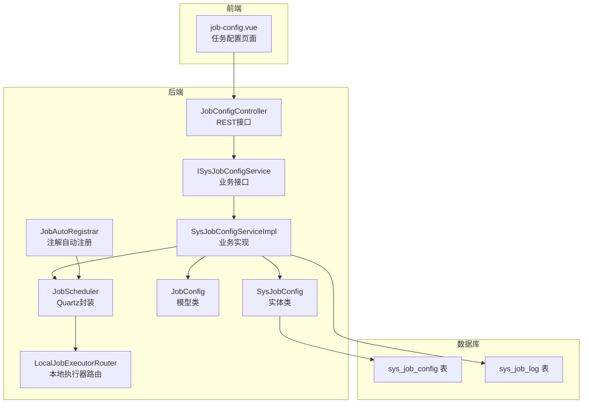
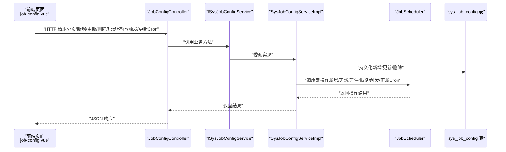
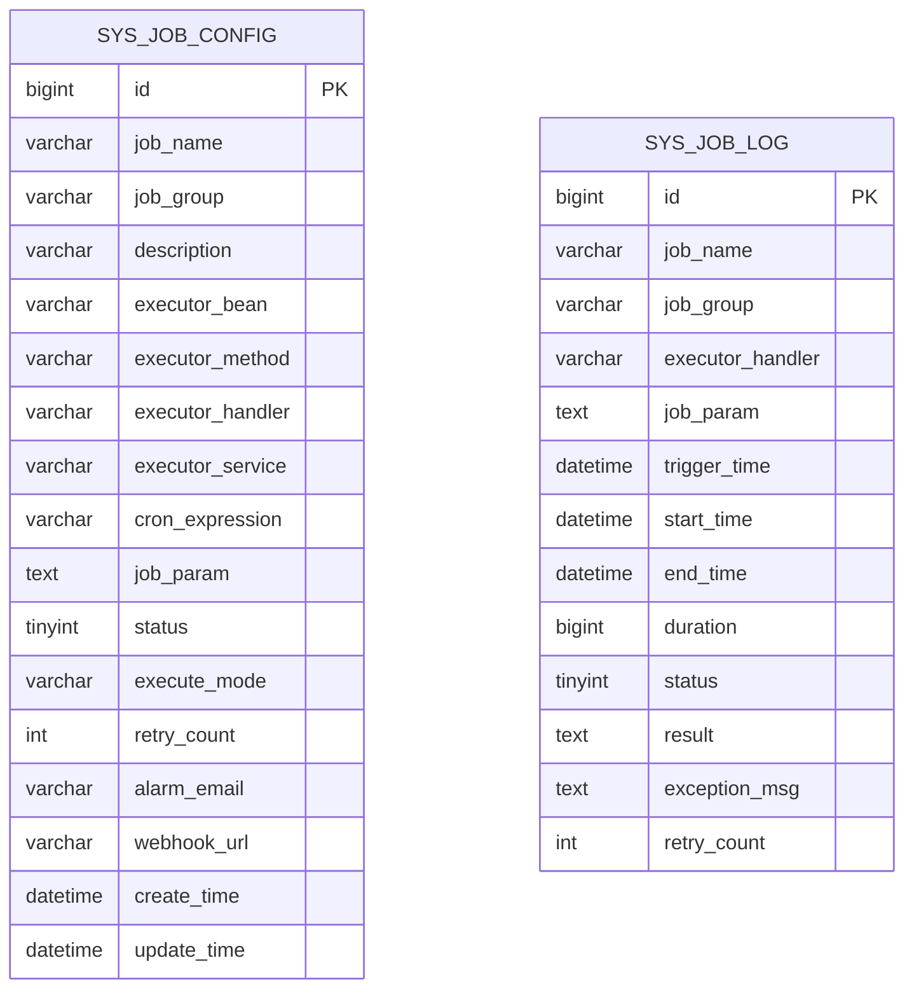
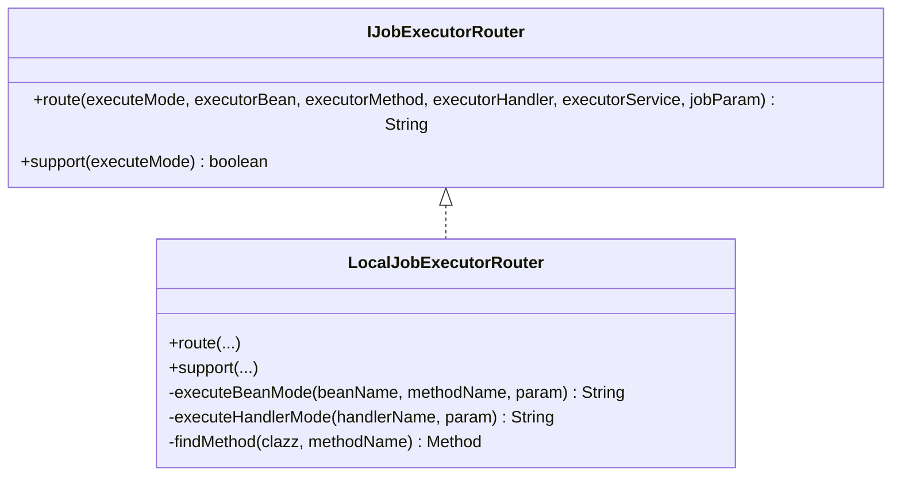
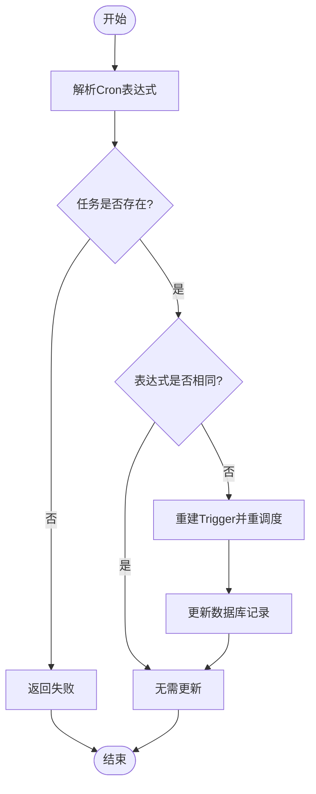
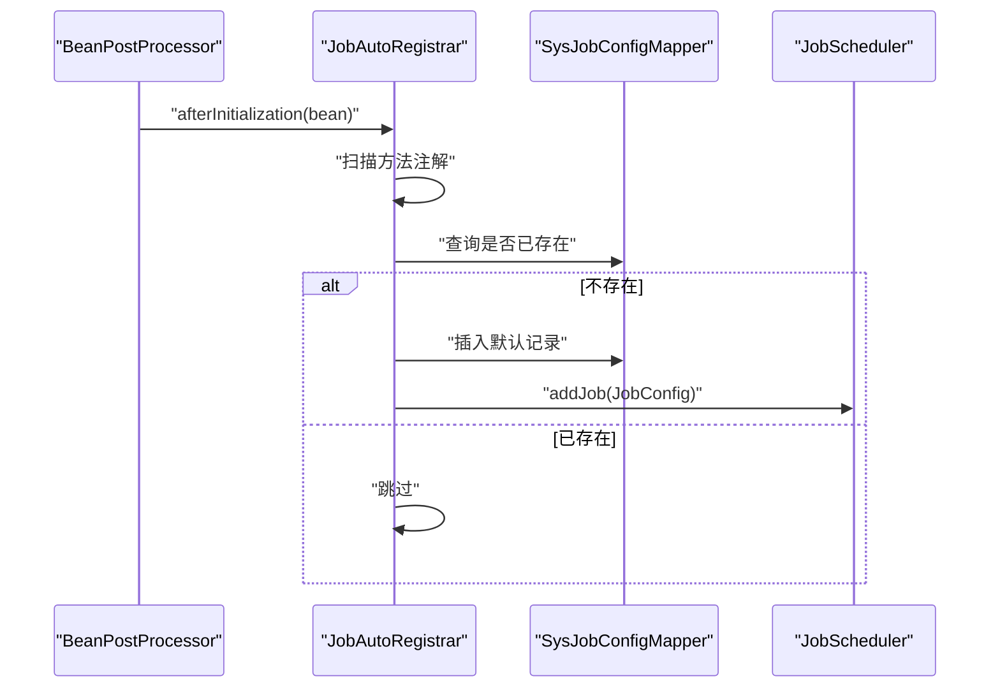
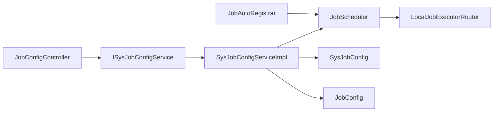

# 任务配置管理

<cite>
**本文引用的文件**
- [API.md](file://forge/forge-framework/forge-starter-parent/forge-starter-job/API.md)
- [JobConfigController.java](file://forge/forge-framework/forge-plugin-parent/forge-plugin-job/src/main/java/com/mdframe/forge/plugin/job/controller/JobConfigController.java)
- [ISysJobConfigService.java](file://forge/forge-framework/forge-plugin-parent/forge-plugin-job/src/main/java/com/mdframe/forge/plugin/job/service/ISysJobConfigService.java)
- [SysJobConfigServiceImpl.java](file://forge/forge-framework/forge-plugin-parent/forge-plugin-job/src/main/java/com/mdframe/forge/plugin/job/service/impl/SysJobConfigServiceImpl.java)
- [SysJobConfig.java](file://forge/forge-framework/forge-plugin-parent/forge-plugin-job/src/main/java/com/mdframe/forge/plugin/job/entity/SysJobConfig.java)
- [JobScheduler.java](file://forge/forge-framework/forge-plugin-parent/forge-plugin-job/src/main/java/com/mdframe/forge/plugin/job/scheduler/JobScheduler.java)
- [JobConfig.java](file://forge/forge-framework/forge-plugin-parent/forge-plugin-job/src/main/java/com/mdframe/forge/plugin/job/model/JobConfig.java)
- [LocalJobExecutorRouter.java](file://forge/forge-framework/forge-plugin-parent/forge-plugin-job/src/main/java/com/mdframe/forge/plugin/job/executor/impl/LocalJobExecutorRouter.java)
- [IJobExecutorRouter.java](file://forge/forge-framework/forge-plugin-parent/forge-plugin-job/src/main/java/com/mdframe/forge/plugin/job/executor/IJobExecutorRouter.java)
- [JobAutoRegistrar.java](file://forge/forge-framework/forge-plugin-parent/forge-plugin-job/src/main/java/com/mdframe/forge/plugin/job/registry/JobAutoRegistrar.java)
- [job_tables.sql](file://forge/forge-framework/forge-starter-parent/forge-starter-job/sql/job_tables.sql)
- [job-config.vue](file://forge-admin-ui/src/views/system/job-config.vue)
</cite>

## 目录
1. [简介](#简介)
2. [项目结构](#项目结构)
3. [核心组件](#核心组件)
4. [架构总览](#架构总览)
5. [详细组件分析](#详细组件分析)
6. [依赖关系分析](#依赖关系分析)
7. [性能考虑](#性能考虑)
8. [故障排查指南](#故障排查指南)
9. [结论](#结论)
10. [附录](#附录)

## 简介
本技术文档围绕Forge任务配置管理功能进行系统化梳理，覆盖任务配置的数据模型、字段语义与约束、CRUD与运行控制接口、执行模式差异与选择建议、Cron表达式配置与最佳实践、参数传递机制、重试策略以及完整API接口说明与使用示例。目标是帮助开发者快速理解并正确使用任务配置管理能力。

## 项目结构
任务配置管理涉及后端控制器、服务层、调度器、执行器路由、实体模型与数据库表等模块；前端提供可视化界面用于任务配置与Cron表达式选择。

图表来源
- [JobConfigController.java](file://forge/forge-framework/forge-plugin-parent/forge-plugin-job/src/main/java/com/mdframe/forge/plugin/job/controller/JobConfigController.java#L18-L109)
- [ISysJobConfigService.java](file://forge/forge-framework/forge-plugin-parent/forge-plugin-job/src/main/java/com/mdframe/forge/plugin/job/service/ISysJobConfigService.java#L10-L51)
- [SysJobConfigServiceImpl.java](file://forge/forge-framework/forge-plugin-parent/forge-plugin-job/src/main/java/com/mdframe/forge/plugin/job/service/impl/SysJobConfigServiceImpl.java#L24-L154)
- [SysJobConfig.java](file://forge/forge-framework/forge-plugin-parent/forge-plugin-job/src/main/java/com/mdframe/forge/plugin/job/entity/SysJobConfig.java#L14-L96)
- [JobConfig.java](file://forge/forge-framework/forge-plugin-parent/forge-plugin-job/src/main/java/com/mdframe/forge/plugin/job/model/JobConfig.java#L11-L97)
- [JobScheduler.java](file://forge/forge-framework/forge-plugin-parent/forge-plugin-job/src/main/java/com/mdframe/forge/plugin/job/scheduler/JobScheduler.java#L16-L219)
- [LocalJobExecutorRouter.java](file://forge/forge-framework/forge-plugin-parent/forge-plugin-job/src/main/java/com/mdframe/forge/plugin/job/executor/impl/LocalJobExecutorRouter.java#L17-L101)
- [JobAutoRegistrar.java](file://forge/forge-framework/forge-plugin-parent/forge-plugin-job/src/main/java/com/mdframe/forge/plugin/job/registry/JobAutoRegistrar.java#L28-L104)
- [job-config.vue](file://forge-admin-ui/src/views/system/job-config.vue#L46-L78)

章节来源
- [JobConfigController.java](file://forge/forge-framework/forge-plugin-parent/forge-plugin-job/src/main/java/com/mdframe/forge/plugin/job/controller/JobConfigController.java#L18-L109)
- [SysJobConfigServiceImpl.java](file://forge/forge-framework/forge-plugin-parent/forge-plugin-job/src/main/java/com/mdframe/forge/plugin/job/service/impl/SysJobConfigServiceImpl.java#L24-L154)
- [job_tables.sql](file://forge/forge-framework/forge-starter-parent/forge-starter-job/sql/job_tables.sql#L1-L48)

## 核心组件
- 控制器层：提供任务配置的分页查询、详情、新增、更新、删除、启动、停止、立即触发、更新Cron等REST接口。
- 服务层：封装业务逻辑，协调数据库持久化与Quartz调度器。
- 调度器：对Quartz进行封装，负责任务的增删改查、暂停/恢复、立即触发、热更新Cron等。
- 执行器路由：根据执行模式（BEAN/HANDLER）选择本地执行路径。
- 实体与模型：映射数据库表结构与传输对象。
- 自动注册：扫描注解，自动将标注的任务注册到调度器并落库。

章节来源
- [JobConfigController.java](file://forge/forge-framework/forge-plugin-parent/forge-plugin-job/src/main/java/com/mdframe/forge/plugin/job/controller/JobConfigController.java#L27-L108)
- [ISysJobConfigService.java](file://forge/forge-framework/forge-plugin-parent/forge-plugin-job/src/main/java/com/mdframe/forge/plugin/job/service/ISysJobConfigService.java#L10-L51)
- [SysJobConfigServiceImpl.java](file://forge/forge-framework/forge-plugin-parent/forge-plugin-job/src/main/java/com/mdframe/forge/plugin/job/service/impl/SysJobConfigServiceImpl.java#L24-L154)
- [JobScheduler.java](file://forge/forge-framework/forge-plugin-parent/forge-plugin-job/src/main/java/com/mdframe/forge/plugin/job/scheduler/JobScheduler.java#L16-L219)
- [LocalJobExecutorRouter.java](file://forge/forge-framework/forge-plugin-parent/forge-plugin-job/src/main/java/com/mdframe/forge/plugin/job/executor/impl/LocalJobExecutorRouter.java#L17-L101)
- [SysJobConfig.java](file://forge/forge-framework/forge-plugin-parent/forge-plugin-job/src/main/java/com/mdframe/forge/plugin/job/entity/SysJobConfig.java#L14-L96)
- [JobConfig.java](file://forge/forge-framework/forge-plugin-parent/forge-plugin-job/src/main/java/com/mdframe/forge/plugin/job/model/JobConfig.java#L11-L97)
- [JobAutoRegistrar.java](file://forge/forge-framework/forge-plugin-parent/forge-plugin-job/src/main/java/com/mdframe/forge/plugin/job/registry/JobAutoRegistrar.java#L28-L104)

## 架构总览
下图展示从前端到后端的请求流程与关键交互点：

图表来源
- [JobConfigController.java](file://forge/forge-framework/forge-plugin-parent/forge-plugin-job/src/main/java/com/mdframe/forge/plugin/job/controller/JobConfigController.java#L32-L108)
- [SysJobConfigServiceImpl.java](file://forge/forge-framework/forge-plugin-parent/forge-plugin-job/src/main/java/com/mdframe/forge/plugin/job/service/impl/SysJobConfigServiceImpl.java#L29-L144)
- [JobScheduler.java](file://forge/forge-framework/forge-plugin-parent/forge-plugin-job/src/main/java/com/mdframe/forge/plugin/job/scheduler/JobScheduler.java#L23-L206)
- [job_tables.sql](file://forge/forge-framework/forge-starter-parent/forge-starter-job/sql/job_tables.sql#L2-L22)

## 详细组件分析

### 数据模型与字段说明
- 实体类SysJobConfig映射sys_job_config表，包含任务标识、分组、描述、执行器信息、Cron表达式、参数、状态、执行模式、重试次数、告警与WebHook、时间戳等字段。
- 模型类JobConfig用于服务层与调度器之间的数据传输，字段与实体基本一致。
- 数据库表结构定义了唯一索引（job_name, job_group）、默认值与注释，确保任务唯一性与可维护性。

图表来源
- [SysJobConfig.java](file://forge/forge-framework/forge-plugin-parent/forge-plugin-job/src/main/java/com/mdframe/forge/plugin/job/entity/SysJobConfig.java#L14-L96)
- [JobConfig.java](file://forge/forge-framework/forge-plugin-parent/forge-plugin-job/src/main/java/com/mdframe/forge/plugin/job/model/JobConfig.java#L11-L97)
- [job_tables.sql](file://forge/forge-framework/forge-starter-parent/forge-starter-job/sql/job_tables.sql#L2-L43)

章节来源
- [SysJobConfig.java](file://forge/forge-framework/forge-plugin-parent/forge-plugin-job/src/main/java/com/mdframe/forge/plugin/job/entity/SysJobConfig.java#L14-L96)
- [JobConfig.java](file://forge/forge-framework/forge-plugin-parent/forge-plugin-job/src/main/java/com/mdframe/forge/plugin/job/model/JobConfig.java#L11-L97)
- [job_tables.sql](file://forge/forge-framework/forge-starter-parent/forge-starter-job/sql/job_tables.sql#L2-L22)

### CRUD与运行控制接口
- 分页查询任务列表：支持按任务名（模糊）、分组、执行模式、状态过滤。
- 查询任务详情：按ID获取任务配置。
- 新增任务：提交任务配置，服务层保存并注册到调度器。
- 更新任务：更新数据库记录并同步到调度器。
- 删除任务：先从调度器移除，再删除数据库记录。
- 启动/停止任务：通过调度器暂停/恢复，并更新状态。
- 立即触发一次：手动触发指定任务执行。
- 更新Cron表达式：热更新Cron，无需重启任务。

章节来源
- [API.md](file://forge/forge-framework/forge-starter-parent/forge-starter-job/API.md#L5-L109)
- [JobConfigController.java](file://forge/forge-framework/forge-plugin-parent/forge-plugin-job/src/main/java/com/mdframe/forge/plugin/job/controller/JobConfigController.java#L32-L108)
- [SysJobConfigServiceImpl.java](file://forge/forge-framework/forge-plugin-parent/forge-plugin-job/src/main/java/com/mdframe/forge/plugin/job/service/impl/SysJobConfigServiceImpl.java#L29-L144)

### 执行模式：BEAN 与 HANDLER 的区别与适用场景
- BEAN模式：直接调用本地Spring Bean的方法，适合单体应用内任务。
- HANDLER模式：调用实现了IJobExecutor接口的Handler，便于任务逻辑与业务解耦，适合复杂任务或需要统一入口的场景。
- RPC模式：通过远程服务调用（当前路由不支持），适用于分布式场景。

图表来源
- [IJobExecutorRouter.java](file://forge/forge-framework/forge-plugin-parent/forge-plugin-job/src/main/java/com/mdframe/forge/plugin/job/executor/IJobExecutorRouter.java#L7-L32)
- [LocalJobExecutorRouter.java](file://forge/forge-framework/forge-plugin-parent/forge-plugin-job/src/main/java/com/mdframe/forge/plugin/job/executor/impl/LocalJobExecutorRouter.java#L17-L101)

章节来源
- [LocalJobExecutorRouter.java](file://forge/forge-framework/forge-plugin-parent/forge-plugin-job/src/main/java/com/mdframe/forge/plugin/job/executor/impl/LocalJobExecutorRouter.java#L19-L39)
- [IJobExecutorRouter.java](file://forge/forge-framework/forge-plugin-parent/forge-plugin-job/src/main/java/com/mdframe/forge/plugin/job/executor/IJobExecutorRouter.java#L9-L32)

### Cron表达式配置与最佳实践
- Cron表达式用于定义任务触发周期，支持热更新。
- 前端提供常用表达式选择器，便于快速配置。
- 常用表达式示例与说明见API文档。

图表来源
- [JobScheduler.java](file://forge/forge-framework/forge-plugin-parent/forge-plugin-job/src/main/java/com/mdframe/forge/plugin/job/scheduler/JobScheduler.java#L178-L206)
- [SysJobConfigServiceImpl.java](file://forge/forge-framework/forge-plugin-parent/forge-plugin-job/src/main/java/com/mdframe/forge/plugin/job/service/impl/SysJobConfigServiceImpl.java#L129-L144)

章节来源
- [API.md](file://forge/forge-framework/forge-starter-parent/forge-starter-job/API.md#L174-L184)
- [job-config.vue](file://forge-admin-ui/src/views/system/job-config.vue#L46-L78)
- [JobScheduler.java](file://forge/forge-framework/forge-plugin-parent/forge-plugin-job/src/main/java/com/mdframe/forge/plugin/job/scheduler/JobScheduler.java#L178-L206)

### 任务参数传递机制
- 任务参数通过jobParam字段传递，支持任意JSON字符串。
- BEAN模式下，若目标方法带String参数则传入jobParam；否则调用无参方法。
- HANDLER模式下，通过IJobExecutor.execute接收参数。

章节来源
- [SysJobConfig.java](file://forge/forge-framework/forge-plugin-parent/forge-plugin-job/src/main/java/com/mdframe/forge/plugin/job/entity/SysJobConfig.java#L59-L60)
- [LocalJobExecutorRouter.java](file://forge/forge-framework/forge-plugin-parent/forge-plugin-job/src/main/java/com/mdframe/forge/plugin/job/executor/impl/LocalJobExecutorRouter.java#L44-L72)

### 重试策略配置
- retryCount字段定义失败重试次数。
- 日志表包含retry_count字段，便于追踪重试情况。
- 可结合告警邮箱与WebHook进行异常通知。

章节来源
- [SysJobConfig.java](file://forge/forge-framework/forge-plugin-parent/forge-plugin-job/src/main/java/com/mdframe/forge/plugin/job/entity/SysJobConfig.java#L74-L75)
- [job_tables.sql](file://forge/forge-framework/forge-starter-parent/forge-starter-job/sql/job_tables.sql#L24-L43)

### 注解自动注册与生命周期
- JobAutoRegistrar扫描@ScheduledJob与@JobHandler注解，自动注册任务并写入数据库。
- 注册时生成JobConfig并调用调度器添加任务，同时设置初始状态为运行。

图表来源
- [JobAutoRegistrar.java](file://forge/forge-framework/forge-plugin-parent/forge-plugin-job/src/main/java/com/mdframe/forge/plugin/job/registry/JobAutoRegistrar.java#L34-L103)

章节来源
- [JobAutoRegistrar.java](file://forge/forge-framework/forge-plugin-parent/forge-plugin-job/src/main/java/com/mdframe/forge/plugin/job/registry/JobAutoRegistrar.java#L34-L103)

## 依赖关系分析
- 控制器依赖服务接口；服务实现依赖调度器与Mapper；调度器依赖Quartz；执行器路由依赖Spring上下文。
- 业务层通过事务保证数据库与调度器的一致性（部分方法使用事务）。

图表来源
- [JobConfigController.java](file://forge/forge-framework/forge-plugin-parent/forge-plugin-job/src/main/java/com/mdframe/forge/plugin/job/controller/JobConfigController.java#L27-L27)
- [SysJobConfigServiceImpl.java](file://forge/forge-framework/forge-plugin-parent/forge-plugin-job/src/main/java/com/mdframe/forge/plugin/job/service/impl/SysJobConfigServiceImpl.java#L26-L26)
- [JobScheduler.java](file://forge/forge-framework/forge-plugin-parent/forge-plugin-job/src/main/java/com/mdframe/forge/plugin/job/scheduler/JobScheduler.java#L18-L18)
- [LocalJobExecutorRouter.java](file://forge/forge-framework/forge-plugin-parent/forge-plugin-job/src/main/java/com/mdframe/forge/plugin/job/executor/impl/LocalJobExecutorRouter.java#L17-L17)
- [JobAutoRegistrar.java](file://forge/forge-framework/forge-plugin-parent/forge-plugin-job/src/main/java/com/mdframe/forge/plugin/job/registry/JobAutoRegistrar.java#L30-L30)

章节来源
- [ISysJobConfigService.java](file://forge/forge-framework/forge-plugin-parent/forge-plugin-job/src/main/java/com/mdframe/forge/plugin/job/service/ISysJobConfigService.java#L10-L51)
- [SysJobConfigServiceImpl.java](file://forge/forge-framework/forge-plugin-parent/forge-plugin-job/src/main/java/com/mdframe/forge/plugin/job/service/impl/SysJobConfigServiceImpl.java#L24-L154)

## 性能考虑
- 使用分页查询避免一次性加载大量任务配置。
- Cron热更新采用重建Trigger的方式，频繁变更需谨慎评估。
- 任务参数为文本存储，建议控制长度并进行必要校验。
- 建议为高频查询字段建立合适索引（如任务名、触发时间、状态）。

## 故障排查指南
- 接口返回失败：检查任务是否存在、Cron表达式是否合法、执行器Bean/Handler是否可用。
- 任务未执行：确认任务状态为运行、调度器正常、Quartz集群配置（如启用）。
- 参数传递异常：核对BEAN模式方法签名与HANDLER实现是否匹配jobParam格式。
- 日志清理：通过日志管理接口清理历史日志，避免表膨胀。

章节来源
- [API.md](file://forge/forge-framework/forge-starter-parent/forge-starter-job/API.md#L186-L195)
- [SysJobConfigServiceImpl.java](file://forge/forge-framework/forge-plugin-parent/forge-plugin-job/src/main/java/com/mdframe/forge/plugin/job/service/impl/SysJobConfigServiceImpl.java#L84-L116)
- [JobScheduler.java](file://forge/forge-framework/forge-plugin-parent/forge-plugin-job/src/main/java/com/mdframe/forge/plugin/job/scheduler/JobScheduler.java#L133-L158)

## 结论
Forge任务配置管理以Quartz为核心，结合Spring生态提供了完善的任务生命周期管理能力。通过清晰的执行器路由、灵活的参数传递与重试策略、直观的前端Cron选择器，能够满足从简单定时任务到复杂业务场景的需求。建议在生产环境中关注Cron表达式合法性、参数校验与日志监控，确保任务稳定运行。

## 附录

### API接口清单与示例
- 任务配置管理
  - GET /job/config/page：分页查询任务列表（支持按任务名、分组、执行模式、状态过滤）
  - GET /job/config/{id}：查询任务详情
  - POST /job/config：新增任务
  - PUT /job/config：更新任务
  - DELETE /job/config/{id}：删除任务
  - POST /job/config/{id}/start：启动任务
  - POST /job/config/{id}/stop：停止任务
  - POST /job/config/{id}/trigger：立即触发一次
  - POST /job/config/{id}/cron?cronExpression=...：更新Cron表达式
- 任务日志管理
  - GET /job/log/page：分页查询日志（支持按任务名、分组、状态过滤）
  - GET /job/log/{id}：查询日志详情
  - DELETE /job/log/clean?days=30：清理日志（默认保留最近30天）

章节来源
- [API.md](file://forge/forge-framework/forge-starter-parent/forge-starter-job/API.md#L5-L160)