# 后端框架详解

<cite>
**本文引用的文件**
- [forge/pom.xml](file://forge/pom.xml)
- [forge/forge-framework/pom.xml](file://forge/forge-framework/pom.xml)
- [forge/forge-framework/forge-starter-parent/pom.xml](file://forge/forge-framework/forge-starter-parent/pom.xml)
- [forge/forge-framework/forge-dependencies/pom.xml](file://forge/forge-framework/forge-dependencies/pom.xml)
- [forge/forge-framework/forge-starter-parent/forge-starter-core/pom.xml](file://forge/forge-framework/forge-starter-parent/forge-starter-core/pom.xml)
- [forge/forge-framework/forge-starter-parent/forge-starter-auth/pom.xml](file://forge/forge-framework/forge-starter-parent/forge-starter-auth/pom.xml)
- [forge/forge-framework/forge-starter-parent/forge-starter-orm/pom.xml](file://forge/forge-framework/forge-starter-parent/forge-starter-orm/pom.xml)
- [forge/forge-framework/forge-starter-parent/forge-starter-web/pom.xml](file://forge/forge-framework/forge-starter-parent/forge-starter-web/pom.xml)
- [forge/forge-admin/src/main/java/com/mdframe/forge/admin/ForgeAdminApplication.java](file://forge/forge-admin/src/main/java/com/mdframe/forge/admin/ForgeAdminApplication.java)
- [forge/forge-admin/src/main/resources/application.yml](file://forge/forge-admin/src/main/resources/application.yml)
- [forge/forge-framework/forge-starter-parent/forge-starter-core/src/main/resources/META-INF/spring/org.springframework.boot.autoconfigure.AutoConfiguration.imports](file://forge/forge-framework/forge-starter-parent/forge-starter-core/src/main/resources/META-INF/spring/org.springframework.boot.autoconfigure.AutoConfiguration.imports)
- [forge/forge-framework/forge-starter-parent/forge-starter-api-config/src/main/resources/META-INF/spring/org.springframework.boot.autoconfigure.AutoConfiguration.imports](file://forge/forge-framework/forge-starter-parent/forge-starter-api-config/src/main/resources/META-INF/spring/org.springframework.boot.autoconfigure.AutoConfiguration.imports)
- [forge/forge-framework/forge-starter-parent/forge-starter-cache/src/main/resources/META-INF/spring/org.springframework.boot.autoconfigure.AutoConfiguration.imports](file://forge/forge-framework/forge-starter-parent/forge-starter-cache/src/main/resources/META-INF/spring/org.springframework.boot.autoconfigure.AutoConfiguration.imports)
- [forge/forge-framework/forge-starter-parent/forge-starter-api-config/src/main/java/com/mdframe/forge/starter/apiconfig/config/ApiConfigAutoConfiguration.java](file://forge/forge-framework/forge-starter-parent/forge-starter-api-config/src/main/java/com/mdframe/forge/starter/apiconfig/config/ApiConfigAutoConfiguration.java)
- [forge/forge-framework/forge-starter-parent/forge-starter-cache/src/main/java/com/mdframe/forge/starter/cache/config/RedissonConfig.java](file://forge/forge-framework/forge-starter-parent/forge-starter-cache/src/main/java/com/mdframe/forge/starter/cache/config/RedissonConfig.java)
- [forge/forge-framework/forge-starter-parent/forge-starter-auth/src/main/java/com/mdframe/forge/starter/auth/config/SaTokenConfig.java](file://forge/forge-framework/forge-starter-parent/forge-starter-auth/src/main/java/com/mdframe/forge/starter/auth/config/SaTokenConfig.java)
- [forge/forge-framework/forge-starter-parent/forge-starter-orm/src/main/java/com/mdframe/forge/starter/orm/config/MyBatisPlusConfig.java](file://forge/forge-framework/forge-starter-parent/forge-starter-orm/src/main/java/com/mdframe/forge/starter/orm/config/MyBatisPlusConfig.java)
- [forge/forge-framework/forge-starter-parent/forge-starter-web/src/main/java/com/mdframe/forge/starter/web/config/WebMvcConfig.java](file://forge/forge-framework/forge-starter-parent/forge-starter-web/src/main/java/com/mdframe/forge/starter/web/config/WebMvcConfig.java)
- [forge/forge-framework/forge-starter-parent/forge-starter-trans/src/main/java/com/mdframe/forge/starter/trans/config/TransactionConfig.java](file://forge/forge-framework/forge-starter-parent/forge-starter-trans/src/main/java/com/mdframe/forge/starter/trans/config/TransactionConfig.java)
- [forge/forge-framework/forge-starter-parent/forge-starter-file/src/main/java/com/mdframe/forge/starter/file/config/FileStorageConfig.java](file://forge/forge-framework/forge-starter-parent/forge-starter-file/src/main/java/com/mdframe/forge/starter/file/config/FileStorageConfig.java)
- [forge/forge-framework/forge-starter-parent/forge-starter-excel/src/main/java/com/mdframe/forge/starter/excel/config/ExcelConfig.java](file://forge/forge-framework/forge-starter-parent/forge-starter-excel/src/main/java/com/mdframe/forge/starter/excel/config/ExcelConfig.java)
- [forge/forge-framework/forge-starter-parent/forge-starter-config/src/main/java/com/mdframe/forge/starter/config/config/ConfigAutoConfiguration.java](file://forge/forge-framework/forge-starter-parent/forge-starter-config/src/main/java/com/mdframe/forge/starter/config/config/ConfigAutoConfiguration.java)
- [forge/forge-framework/forge-starter-parent/forge-starter-job/src/main/java/com/mdframe/forge/starter/job/config/JobAutoConfiguration.java](file://forge/forge-framework/forge-starter-parent/forge-starter-job/src/main/java/com/mdframe/forge/starter/job/config/JobAutoConfiguration.java)
- [forge/forge-framework/forge-starter-parent/forge-starter-id/src/main/java/com/mdframe/forge/starter/id/config/IdGeneratorConfig.java](file://forge/forge-framework/forge-starter-parent/forge-starter-id/src/main/java/com/mdframe/forge/starter/id/config/IdGeneratorConfig.java)
- [forge/forge-framework/forge-starter-parent/forge-starter-datascope/src/main/java/com/mdframe/forge/starter/datascope/config/DataScopeConfig.java](file://forge/forge-framework/forge-starter-parent/forge-starter-datascope/src/main/java/com/mdframe/forge/starter/datascope/config/DataScopeConfig.java)
- [forge/forge-framework/forge-starter-parent/forge-starter-message/src/main/java/com/mdframe/forge/starter/message/config/MessageAutoConfiguration.java](file://forge/forge-framework/forge-starter-parent/forge-starter-message/src/main/java/com/mdframe/forge/starter/message/config/MessageAutoConfiguration.java)
- [forge/forge-framework/forge-starter-parent/forge-starter-tenant/src/main/java/com/mdframe/forge/starter/tenant/config/TenantConfig.java](file://forge/forge-framework/forge-starter-parent/forge-starter-tenant/src/main/java/com/mdframe/forge/starter/tenant/config/TenantConfig.java)
- [forge/forge-framework/forge-starter-parent/forge-starter-crypto/src/main/java/com/mdframe/forge/starter/crypto/config/CryptoConfig.java](file://forge/forge-framework/forge-starter-parent/forge-starter-crypto/src/main/java/com/mdframe/forge/starter/crypto/config/CryptoConfig.java)
- [forge/forge-framework/forge-starter-parent/forge-starter-websocket/src/main/java/com/mdframe/forge/starter/websocket/config/WebSocketConfig.java](file://forge/forge-framework/forge-starter-parent/forge-starter-websocket/src/main/java/com/mdframe/forge/starter/websocket/config/WebSocketConfig.java)
- [forge-docs/.vitepress/config.js](file://forge-docs/.vitepress/config.js)
- [forge-docs/backend/modules/overview.md](file://forge-docs/backend/modules/overview.md)
- [forge-docs/frontend/components/overview.md](file://forge-docs/frontend/components/overview.md)
- [forge-docs/README.md](file://forge-docs/README.md)
- [forge-docs/package.json](file://forge-docs/package.json)
</cite>

## 更新摘要
**所做更改**
- 新增VitePress文档系统现代化改造章节
- 更新模块组织标准化相关内容
- 完善Maven父子关系重构说明
- 增加文档导航与结构优化说明
- 补充前后端文档分离架构说明

## 目录
1. [简介](#简介)
2. [项目结构](#项目结构)
3. [核心组件](#核心组件)
4. [架构总览](#架构总览)
5. [详细组件分析](#详细组件分析)
6. [依赖分析](#依赖分析)
7. [性能考虑](#性能考虑)
8. [故障排查指南](#故障排查指南)
9. [结论](#结论)
10. [附录](#附录)

## 简介
Forge后端框架基于Spring Boot 3.2.9构建，采用多模块Maven聚合工程组织，提供一套可插拔的Starter模块体系，覆盖核心能力、安全认证、数据管理、文件存储、任务调度、分布式事务、消息系统、租户隔离、加密解密、WebSocket、API配置与缓存等关键领域。通过统一的依赖管理与自动装配机制，开发者可以按需组合使用各Starter模块，快速搭建企业级应用。

**现代化升级**：框架现已引入VitePress文档系统，实现前后端文档分离架构，提供更加现代化的文档体验和更好的维护性。

## 项目结构
整体采用三层结构：
- 顶层聚合模块：统一版本与插件管理，定义环境profile与仓库配置
- 框架模块：包含依赖管理、Starter父模块、插件父模块
- 应用模块：以admin为例的应用入口，扫描基础包并启用AOP代理

**文档系统现代化**：新增独立的forge-docs模块，采用VitePress构建，实现前后端文档分离，提供更好的开发体验。

```mermaid
graph TB
A["顶层聚合<br/>forge/pom.xml"] --> B["框架模块<br/>forge/forge-framework/pom.xml"]
B --> C["Starter父模块<br/>forge/forge-framework/forge-starter-parent/pom.xml"]
B --> D["依赖管理模块<br/>forge/forge-framework/forge-dependencies/pom.xml"]
A --> E["应用模块<br/>forge/forge-admin"]
A --> F["文档系统<br/>forge-docs/.vitepress"]
F --> G["VitePress配置<br/>config.js"]
F --> H["后端文档<br/>backend/modules"]
F --> I["前端文档<br/>frontend/components"]
C --> C1["核心Starter<br/>forge-starter-core"]
C --> C2["Web层Starter<br/>forge-starter-web"]
C --> C3["ORM层Starter<br/>forge-starter-orm"]
C --> C4["缓存Starter<br/>forge-starter-cache"]
C --> C5["认证Starter<br/>forge-starter-auth"]
C --> C6["日志Starter<br/>forge-starter-log"]
C --> C7["事务Starter<br/>forge-starter-trans"]
C --> C8["文件Starter<br/>forge-starter-file"]
C --> C9["Excel导出Starter<br/>forge-starter-excel"]
C --> C10["配置中心Starter<br/>forge-starter-config"]
C --> C11["定时任务Starter<br/>forge-starter-job"]
C --> C12["ID生成Starter<br/>forge-starter-id"]
C --> C13["数据域隔离Starter<br/>forge-starter-datascope"]
C --> C14["消息Starter<br/>forge-starter-message"]
C --> C15["租户Starter<br/>forge-starter-tenant"]
C --> C16["加密封装Starter<br/>forge-starter-crypto"]
C --> C17["WebSocketStarter<br/>forge-starter-websocket"]
C --> C18["API配置Starter<br/>forge-starter-api-config"]
```

**图表来源**
- [forge/pom.xml:114-118](file://forge/pom.xml#L114-L118)
- [forge/forge-framework/pom.xml:26-30](file://forge/forge-framework/pom.xml#L26-L30)
- [forge/forge-framework/forge-starter-parent/pom.xml:15-34](file://forge/forge-framework/forge-starter-parent/pom.xml#L15-L34)
- [forge-docs/.vitepress/config.js:1-69](file://forge-docs/.vitepress/config.js#L1-L69)

**章节来源**
- [forge/pom.xml:1-259](file://forge/pom.xml#L1-L259)
- [forge/forge-framework/pom.xml:1-117](file://forge/forge-framework/pom.xml#L1-L117)
- [forge/forge-framework/forge-starter-parent/pom.xml:1-37](file://forge/forge-framework/forge-starter-parent/pom.xml#L1-L37)
- [forge-docs/.vitepress/config.js:1-69](file://forge-docs/.vitepress/config.js#L1-L69)

## 核心组件
本节聚焦Starter模块的功能定位、依赖关系与使用场景，并给出自动装配入口与关键配置类的映射。

**模块组织标准化**：所有Starter模块均遵循统一的命名规范和目录结构，确保模块间的协调一致性和可维护性。

- 核心模块（forge-starter-core）
  - 功能：提供Spring上下文、Web MVC、校验、AOP、工具类、JSON处理、MapStruct、Sa-Token核心等基础能力
  - 自动装配入口：META-INF/spring/org.springframework.boot.autoconfigure.AutoConfiguration.imports
  - 关键配置：JacksonConfig、ExceptionAutoConfiguration
  - 适用场景：作为其他Starter的基础依赖，统一异常处理与JSON序列化策略

- Web层（forge-starter-web）
  - 功能：基于Undertow高性能Servlet容器，集成Actuator监控、验证码与加密工具
  - 适用场景：对外HTTP服务、微服务网关前置、高并发Web接口

- ORM层（forge-starter-orm）
  - 功能：MyBatis-Plus、动态数据源、SQL性能分析
  - 适用场景：单库/多数据源、复杂查询与分页、SQL审计

- 缓存（forge-starter-cache）
  - 功能：Redisson集成，提供分布式锁、限流、布隆过滤器等
  - 适用场景：高并发读写、分布式锁、热点数据缓存

- 认证（forge-starter-auth）
  - 功能：Sa-Token集成、JWT、在线用户、验证码、WebSocket支持、API白名单
  - 适用场景：RBAC权限、会话管理、多租户登录态

- 日志（forge-starter-log）
  - 功能：操作日志切面、异步监听、枚举与参数脱敏
  - 适用场景：合规审计、操作追踪、敏感信息保护

- 事务（forge-starter-trans）
  - 功能：分布式事务、本地事务传播
  - 适用场景：跨服务/跨库事务一致性

- 文件（forge-starter-file）
  - 功能：文件存储配置、OSS/本地存储抽象
  - 适用场景：附件上传下载、图片/文档归档

- Excel（forge-starter-excel）
  - 功能：导入导出配置、模板引擎
  - 适用场景：报表导出、批量数据导入

- 配置中心（forge-starter-config）
  - 功能：系统配置、水印、国际化、安全策略、刷新机制
  - 适用场景：运行期配置热更新、业务开关

- 任务调度（forge-starter-job）
  - 功能：定时任务自动装配、作业配置
  - 适用场景：周期性任务、异步批处理

- ID生成（forge-starter-id）
  - 功能：雪花ID生成器
  - 适用场景：全局唯一主键生成

- 数据域隔离（forge-starter-datascope）
  - 功能：数据范围控制、行级权限
  - 适用场景：多租户/部门/角色的数据隔离

- 消息（forge-starter-message）
  - 功能：消息插件自动装配
  - 适用场景：站内信、通知、消息队列

- 租户（forge-starter-tenant）
  - 功能：多租户配置
  - 适用场景：SaaS平台、多组织隔离

- 加密（forge-starter-crypto）
  - 功能：对称/非对称加密封装
  - 适用场景：敏感字段加密、通信加密

- WebSocket（forge-starter-websocket）
  - 功能：WebSocket配置
  - 适用场景：实时推送、聊天室、状态变更通知

- API配置（forge-starter-api-config）
  - 功能：接口白名单、权限控制配置
  - 适用场景：开放平台、第三方接入

**章节来源**
- [forge/forge-framework/forge-starter-parent/forge-starter-core/pom.xml:14-122](file://forge/forge-framework/forge-starter-parent/forge-starter-core/pom.xml#L14-L122)
- [forge/forge-framework/forge-starter-parent/forge-starter-web/pom.xml:14-59](file://forge/forge-framework/forge-starter-parent/forge-starter-web/pom.xml#L14-L59)
- [forge/forge-framework/forge-starter-parent/forge-starter-orm/pom.xml:14-37](file://forge/forge-framework/forge-starter-parent/forge-starter-orm/pom.xml#L14-L37)
- [forge/forge-framework/forge-starter-parent/forge-starter-cache/pom.xml:1-80](file://forge/forge-framework/forge-starter-parent/forge-starter-cache/pom.xml#L1-L80)
- [forge/forge-framework/forge-starter-parent/forge-starter-auth/pom.xml:14-79](file://forge/forge-framework/forge-starter-parent/forge-starter-auth/pom.xml#L14-L79)
- [forge/forge-framework/forge-starter-parent/forge-starter-core/src/main/resources/META-INF/spring/org.springframework.boot.autoconfigure.AutoConfiguration.imports:1-3](file://forge/forge-framework/forge-starter-parent/forge-starter-core/src/main/resources/META-INF/spring/org.springframework.boot.autoconfigure.AutoConfiguration.imports#L1-L3)
- [forge/forge-framework/forge-starter-parent/forge-starter-api-config/src/main/resources/META-INF/spring/org.springframework.boot.autoconfigure.AutoConfiguration.imports:1-2](file://forge/forge-framework/forge-starter-parent/forge-starter-api-config/src/main/resources/META-INF/spring/org.springframework.boot.autoconfigure.AutoConfiguration.imports#L1-L2)
- [forge/forge-framework/forge-starter-parent/forge-starter-cache/src/main/resources/META-INF/spring/org.springframework.boot.autoconfigure.AutoConfiguration.imports:1-2](file://forge/forge-framework/forge-starter-parent/forge-starter-cache/src/main/resources/META-INF/spring/org.springframework.boot.autoconfigure.AutoConfiguration.imports#L1-L2)

## 架构总览
Forge通过"Starter父模块"统一管理各功能模块，底层由"依赖管理模块"集中约束版本与BOM；应用通过引入所需Starter即可获得完整的自动装配能力。

**文档系统架构**：采用VitePress构建独立文档系统，实现前后端文档分离，提供现代化的文档浏览体验。

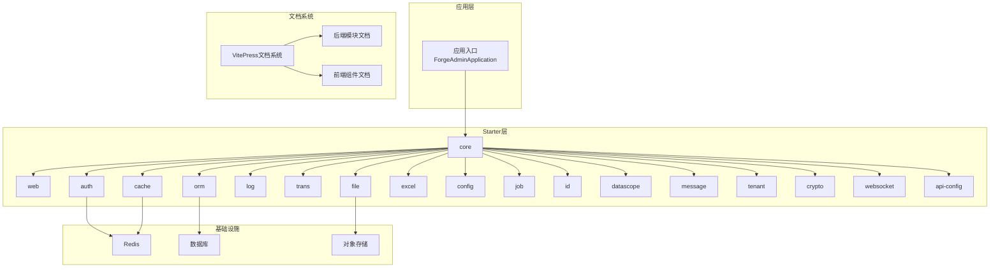

**图表来源**
- [forge/forge-admin/src/main/java/com/mdframe/forge/admin/ForgeAdminApplication.java:8-11](file://forge/forge-admin/src/main/java/com/mdframe/forge/admin/ForgeAdminApplication.java#L8-L11)
- [forge/forge-framework/forge-starter-parent/forge-starter-auth/src/main/java/com/mdframe/forge/starter/auth/config/SaTokenConfig.java:1-200](file://forge/forge-framework/forge-starter-parent/forge-starter-auth/src/main/java/com/mdframe/forge/starter/auth/config/SaTokenConfig.java#L1-L200)
- [forge/forge-framework/forge-starter-parent/forge-starter-cache/src/main/java/com/mdframe/forge/starter/cache/config/RedissonConfig.java:1-200](file://forge/forge-framework/forge-starter-parent/forge-starter-cache/src/main/java/com/mdframe/forge/starter/cache/config/RedissonConfig.java#L1-L200)
- [forge/forge-framework/forge-starter-parent/forge-starter-file/src/main/java/com/mdframe/forge/starter/file/config/FileStorageConfig.java:1-200](file://forge/forge-framework/forge-starter-parent/forge-starter-file/src/main/java/com/mdframe/forge/starter/file/config/FileStorageConfig.java#L1-L200)
- [forge-docs/.vitepress/config.js:1-69](file://forge-docs/.vitepress/config.js#L1-L69)

## 详细组件分析

### 核心模块（forge-starter-core）
- 设计理念：提供通用工具与基础能力，作为所有Starter的共同依赖，统一异常处理与JSON序列化策略
- 自动装配入口：通过META-INF自动注册配置类
- 关键点：JacksonConfig、ExceptionAutoConfiguration

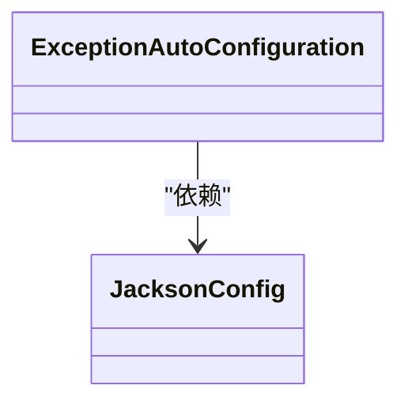

**图表来源**
- [forge/forge-framework/forge-starter-parent/forge-starter-core/src/main/resources/META-INF/spring/org.springframework.boot.autoconfigure.AutoConfiguration.imports:1-3](file://forge/forge-framework/forge-starter-parent/forge-starter-core/src/main/resources/META-INF/spring/org.springframework.boot.autoconfigure.AutoConfiguration.imports#L1-L3)

**章节来源**
- [forge/forge-framework/forge-starter-parent/forge-starter-core/pom.xml:14-122](file://forge/forge-framework/forge-starter-parent/forge-starter-core/pom.xml#L14-L122)
- [forge/forge-framework/forge-starter-parent/forge-starter-core/src/main/resources/META-INF/spring/org.springframework.boot.autoconfigure.AutoConfiguration.imports:1-3](file://forge/forge-framework/forge-starter-parent/forge-starter-core/src/main/resources/META-INF/spring/org.springframework.boot.autoconfigure.AutoConfiguration.imports#L1-L3)

### 安全认证（forge-starter-auth）
- 设计理念：基于Sa-Token实现会话、权限、在线用户、验证码、API白名单与WebSocket支持
- 依赖关系：依赖core、cache、tenant、config、api-config、websocket
- 关键点：SaTokenConfig、Caffeine本地缓存、JWT集成

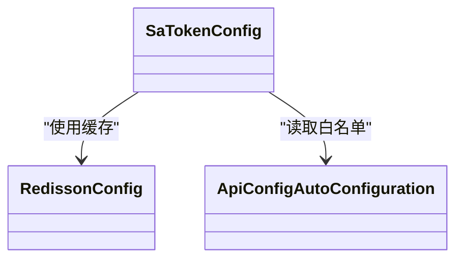

**图表来源**
- [forge/forge-framework/forge-starter-parent/forge-starter-auth/src/main/java/com/mdframe/forge/starter/auth/config/SaTokenConfig.java:1-200](file://forge/forge-framework/forge-starter-parent/forge-starter-auth/src/main/java/com/mdframe/forge/starter/auth/config/SaTokenConfig.java#L1-L200)
- [forge/forge-framework/forge-starter-parent/forge-starter-cache/src/main/java/com/mdframe/forge/starter/cache/config/RedissonConfig.java:1-200](file://forge/forge-framework/forge-starter-parent/forge-starter-cache/src/main/java/com/mdframe/forge/starter/cache/config/RedissonConfig.java#L1-L200)
- [forge/forge-framework/forge-starter-parent/forge-starter-api-config/src/main/java/com/mdframe/forge/starter/apiconfig/config/ApiConfigAutoConfiguration.java:1-200](file://forge/forge-framework/forge-starter-parent/forge-starter-api-config/src/main/java/com/mdframe/forge/starter/apiconfig/config/ApiConfigAutoConfiguration.java#L1-L200)

**章节来源**
- [forge/forge-framework/forge-starter-parent/forge-starter-auth/pom.xml:14-79](file://forge/forge-framework/forge-starter-parent/forge-starter-auth/pom.xml#L14-L79)

### 数据管理（forge-starter-orm）
- 设计理念：基于MyBatis-Plus与动态数据源，提供多数据源切换与SQL性能分析
- 适用场景：单库/多数据源、复杂查询、SQL审计
- 关键点：MyBatisPlusConfig、Dynamic-DS、P6Spy

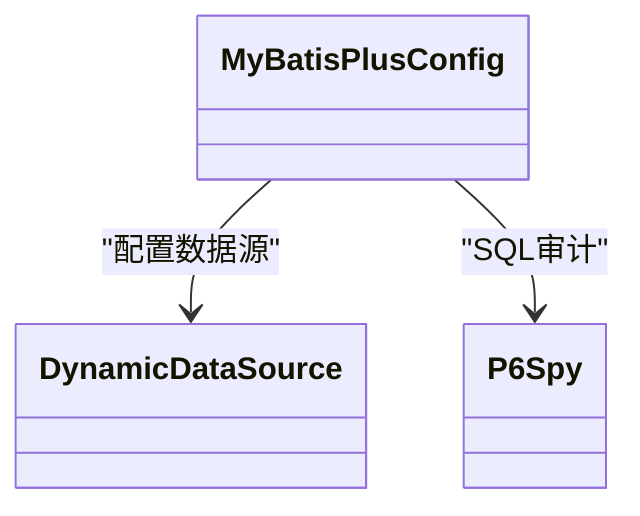

**图表来源**
- [forge/forge-framework/forge-starter-parent/forge-starter-orm/src/main/java/com/mdframe/forge/starter/orm/config/MyBatisPlusConfig.java:1-200](file://forge/forge-framework/forge-starter-parent/forge-starter-orm/src/main/java/com/mdframe/forge/starter/orm/config/MyBatisPlusConfig.java#L1-L200)

**章节来源**
- [forge/forge-framework/forge-starter-parent/forge-starter-orm/pom.xml:14-37](file://forge/forge-framework/forge-starter-parent/forge-starter-orm/pom.xml#L14-L37)

### 文件存储（forge-starter-file）
- 设计理念：统一文件存储抽象，支持本地与OSS
- 关键点：FileStorageConfig

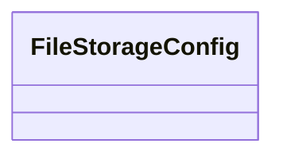

**图表来源**
- [forge/forge-framework/forge-starter-parent/forge-starter-file/src/main/java/com/mdframe/forge/starter/file/config/FileStorageConfig.java:1-200](file://forge/forge-framework/forge-starter-parent/forge-starter-file/src/main/java/com/mdframe/forge/starter/file/config/FileStorageConfig.java#L1-L200)

**章节来源**
- [forge/forge-framework/forge-starter-parent/forge-starter-file/src/main/java/com/mdframe/forge/starter/file/config/FileStorageConfig.java:1-200](file://forge/forge-framework/forge-starter-parent/forge-starter-file/src/main/java/com/mdframe/forge/starter/file/config/FileStorageConfig.java#L1-L200)

### 任务调度（forge-starter-job）
- 设计理念：提供定时任务自动装配与作业配置
- 关键点：JobAutoConfiguration

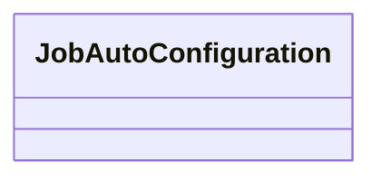

**图表来源**
- [forge/forge-framework/forge-starter-parent/forge-starter-job/src/main/java/com/mdframe/forge/starter/job/config/JobAutoConfiguration.java:1-200](file://forge/forge-framework/forge-starter-parent/forge-starter-job/src/main/java/com/mdframe/forge/starter/job/config/JobAutoConfiguration.java#L1-L200)

**章节来源**
- [forge/forge-framework/forge-starter-parent/forge-starter-job/src/main/java/com/mdframe/forge/starter/job/config/JobAutoConfiguration.java:1-200](file://forge/forge-framework/forge-starter-parent/forge-starter-job/src/main/java/com/mdframe/forge/starter/job/config/JobAutoConfiguration.java#L1-L200)

### 分布式事务（forge-starter-trans）
- 设计理念：提供分布式事务配置
- 关键点：TransactionConfig

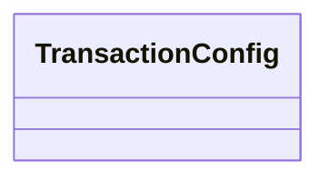

**图表来源**
- [forge/forge-framework/forge-starter-parent/forge-starter-trans/src/main/java/com/mdframe/forge/starter/trans/config/TransactionConfig.java:1-200](file://forge/forge-framework/forge-starter-parent/forge-starter-trans/src/main/java/com/mdframe/forge/starter/trans/config/TransactionConfig.java#L1-L200)

**章节来源**
- [forge/forge-framework/forge-starter-parent/forge-starter-trans/src/main/java/com/mdframe/forge/starter/trans/config/TransactionConfig.java:1-200](file://forge/forge-framework/forge-starter-parent/forge-starter-trans/src/main/java/com/mdframe/forge/starter/trans/config/TransactionConfig.java#L1-L200)

### 消息系统（forge-starter-message）
- 设计理念：消息插件自动装配
- 关键点：MessageAutoConfiguration

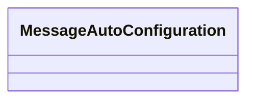

**图表来源**
- [forge/forge-framework/forge-starter-parent/forge-starter-message/src/main/java/com/mdframe/forge/starter/message/config/MessageAutoConfiguration.java:1-200](file://forge/forge-framework/forge-starter-parent/forge-starter-message/src/main/java/com/mdframe/forge/starter/message/config/MessageAutoConfiguration.java#L1-L200)

**章节来源**
- [forge/forge-framework/forge-starter-parent/forge-starter-message/src/main/java/com/mdframe/forge/starter/message/config/MessageAutoConfiguration.java:1-200](file://forge/forge-framework/forge-starter-parent/forge-starter-message/src/main/java/com/mdframe/forge/starter/message/config/MessageAutoConfiguration.java#L1-L200)

### 租户隔离（forge-starter-tenant）
- 设计理念：多租户配置
- 关键点：TenantConfig

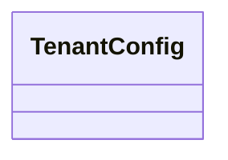

**图表来源**
- [forge/forge-framework/forge-starter-parent/forge-starter-tenant/src/main/java/com/mdframe/forge/starter/tenant/config/TenantConfig.java:1-200](file://forge/forge-framework/forge-starter-parent/forge-starter-tenant/src/main/java/com/mdframe/forge/starter/tenant/config/TenantConfig.java#L1-L200)

**章节来源**
- [forge/forge-framework/forge-starter-parent/forge-starter-tenant/src/main/java/com/mdframe/forge/starter/tenant/config/TenantConfig.java:1-200](file://forge/forge-framework/forge-starter-parent/forge-starter-tenant/src/main/java/com/mdframe/forge/starter/tenant/config/TenantConfig.java#L1-L200)

### 加密解密（forge-starter-crypto）
- 设计理念：提供加密封装
- 关键点：CryptoConfig

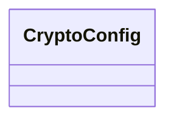

**图表来源**
- [forge/forge-framework/forge-starter-parent/forge-starter-crypto/src/main/java/com/mdframe/forge/starter/crypto/config/CryptoConfig.java:1-200](file://forge/forge-framework/forge-starter-parent/forge-starter-crypto/src/main/java/com/mdframe/forge/starter/crypto/config/CryptoConfig.java#L1-L200)

**章节来源**
- [forge/forge-framework/forge-starter-parent/forge-starter-crypto/src/main/java/com/mdframe/forge/starter/crypto/config/CryptoConfig.java:1-200](file://forge/forge-framework/forge-starter-parent/forge-starter-crypto/src/main/java/com/mdframe/forge/starter/crypto/config/CryptoConfig.java#L1-L200)

### WebSocket（forge-starter-websocket）
- 设计理念：提供WebSocket配置
- 关键点：WebSocketConfig


**图表来源**
- [forge/forge-framework/forge-starter-parent/forge-starter-websocket/src/main/java/com/mdframe/forge/starter/websocket/config/WebSocketConfig.java:1-200](file://forge/forge-framework/forge-starter-parent/forge-starter-websocket/src/main/java/com/mdframe/forge/starter/websocket/config/WebSocketConfig.java#L1-L200)

**章节来源**
- [forge/forge-framework/forge-starter-parent/forge-starter-websocket/src/main/java/com/mdframe/forge/starter/websocket/config/WebSocketConfig.java:1-200](file://forge/forge-framework/forge-starter-parent/forge-starter-websocket/src/main/java/com/mdframe/forge/starter/websocket/config/WebSocketConfig.java#L1-L200)

### API配置（forge-starter-api-config）
- 设计理念：接口白名单与权限控制配置
- 自动装配入口：META-INF自动注册

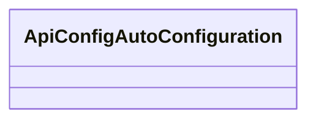

**图表来源**
- [forge/forge-framework/forge-starter-parent/forge-starter-api-config/src/main/resources/META-INF/spring/org.springframework.boot.autoconfigure.AutoConfiguration.imports:1-2](file://forge/forge-framework/forge-starter-parent/forge-starter-api-config/src/main/resources/META-INF/spring/org.springframework.boot.autoconfigure.AutoConfiguration.imports#L1-L2)
- [forge/forge-framework/forge-starter-parent/forge-starter-api-config/src/main/java/com/mdframe/forge/starter/apiconfig/config/ApiConfigAutoConfiguration.java:1-200](file://forge/forge-framework/forge-starter-parent/forge-starter-api-config/src/main/java/com/mdframe/forge/starter/apiconfig/config/ApiConfigAutoConfiguration.java#L1-L200)

**章节来源**
- [forge/forge-framework/forge-starter-parent/forge-starter-api-config/src/main/resources/META-INF/spring/org.springframework.boot.autoconfigure.AutoConfiguration.imports:1-2](file://forge/forge-framework/forge-starter-parent/forge-starter-api-config/src/main/resources/META-INF/spring/org.springframework.boot.autoconfigure.AutoConfiguration.imports#L1-L2)

### Web层（forge-starter-web）
- 设计理念：基于Undertow高性能容器，集成Actuator与验证码/加密工具
- 关键点：WebMvcConfig

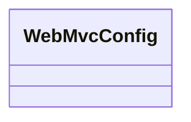

**图表来源**
- [forge/forge-framework/forge-starter-parent/forge-starter-web/src/main/java/com/mdframe/forge/starter/web/config/WebMvcConfig.java:1-200](file://forge/forge-framework/forge-starter-parent/forge-starter-web/src/main/java/com/mdframe/forge/starter/web/config/WebMvcConfig.java#L1-L200)

**章节来源**
- [forge/forge-framework/forge-starter-parent/forge-starter-web/pom.xml:14-59](file://forge/forge-framework/forge-starter-parent/forge-starter-web/pom.xml#L14-L59)

### 缓存（forge-starter-cache）
- 设计理念：Redisson集成，提供分布式能力
- 自动装配入口：META-INF自动注册


**图表来源**
- [forge/forge-framework/forge-starter-parent/forge-starter-cache/src/main/resources/META-INF/spring/org.springframework.boot.autoconfigure.AutoConfiguration.imports:1-2](file://forge/forge-framework/forge-starter-parent/forge-starter-cache/src/main/resources/META-INF/spring/org.springframework.boot.autoconfigure.AutoConfiguration.imports#L1-L2)
- [forge/forge-framework/forge-starter-parent/forge-starter-cache/src/main/java/com/mdframe/forge/starter/cache/config/RedissonConfig.java:1-200](file://forge/forge-framework/forge-starter-parent/forge-starter-cache/src/main/java/com/mdframe/forge/starter/cache/config/RedissonConfig.java#L1-L200)

**章节来源**
- [forge/forge-framework/forge-starter-parent/forge-starter-cache/src/main/resources/META-INF/spring/org.springframework.boot.autoconfigure.AutoConfiguration.imports:1-2](file://forge/forge-framework/forge-starter-parent/forge-starter-cache/src/main/resources/META-INF/spring/org.springframework.boot.autoconfigure.AutoConfiguration.imports#L1-L2)

### 配置中心（forge-starter-config）
- 设计理念：系统配置、水印、国际化、安全策略与刷新机制
- 关键点：ConfigAutoConfiguration

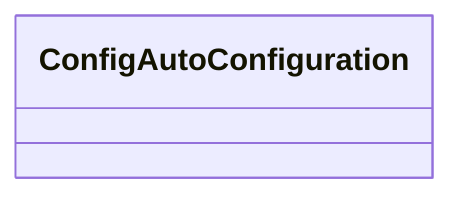

**图表来源**
- [forge/forge-framework/forge-starter-parent/forge-starter-config/src/main/java/com/mdframe/forge/starter/config/config/ConfigAutoConfiguration.java:1-200](file://forge/forge-framework/forge-starter-parent/forge-starter-config/src/main/java/com/mdframe/forge/starter/config/config/ConfigAutoConfiguration.java#L1-L200)

**章节来源**
- [forge/forge-framework/forge-starter-parent/forge-starter-config/src/main/java/com/mdframe/forge/starter/config/config/ConfigAutoConfiguration.java:1-200](file://forge/forge-framework/forge-starter-parent/forge-starter-config/src/main/java/com/mdframe/forge/starter/config/config/ConfigAutoConfiguration.java#L1-L200)

### 数据域隔离（forge-starter-datascope）
- 设计理念：数据范围控制与行级权限
- 关键点：DataScopeConfig

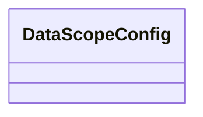

**图表来源**
- [forge/forge-framework/forge-starter-parent/forge-starter-datascope/src/main/java/com/mdframe/forge/starter/datascope/config/DataScopeConfig.java:1-200](file://forge/forge-framework/forge-starter-parent/forge-starter-datascope/src/main/java/com/mdframe/forge/starter/datascope/config/DataScopeConfig.java#L1-L200)

**章节来源**
- [forge/forge-framework/forge-starter-parent/forge-starter-datascope/src/main/java/com/mdframe/forge/starter/datascope/config/DataScopeConfig.java:1-200](file://forge/forge-framework/forge-starter-parent/forge-starter-datascope/src/main/java/com/mdframe/forge/starter/datascope/config/DataScopeConfig.java#L1-L200)

### ID生成（forge-starter-id）
- 设计理念：雪花ID生成器
- 关键点：IdGeneratorConfig

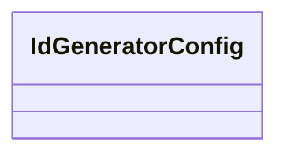

**图表来源**
- [forge/forge-framework/forge-starter-parent/forge-starter-id/src/main/java/com/mdframe/forge/starter/id/config/IdGeneratorConfig.java:1-200](file://forge/forge-framework/forge-starter-parent/forge-starter-id/src/main/java/com/mdframe/forge/starter/id/config/IdGeneratorConfig.java#L1-L200)

**章节来源**
- [forge/forge-framework/forge-starter-parent/forge-starter-id/src/main/java/com/mdframe/forge/starter/id/config/IdGeneratorConfig.java:1-200](file://forge/forge-framework/forge-starter-parent/forge-starter-id/src/main/java/com/mdframe/forge/starter/id/config/IdGeneratorConfig.java#L1-L200)

### Excel导出（forge-starter-excel）
- 设计理念：导入导出配置与模板引擎
- 关键点：ExcelConfig

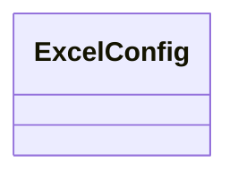

**图表来源**
- [forge/forge-framework/forge-starter-parent/forge-starter-excel/src/main/java/com/mdframe/forge/starter/excel/config/ExcelConfig.java:1-200](file://forge/forge-framework/forge-starter-parent/forge-starter-excel/src/main/java/com/mdframe/forge/starter/excel/config/ExcelConfig.java#L1-L200)

**章节来源**
- [forge/forge-framework/forge-starter-parent/forge-starter-excel/src/main/java/com/mdframe/forge/starter/excel/config/ExcelConfig.java:1-200](file://forge/forge-framework/forge-starter-parent/forge-starter-excel/src/main/java/com/mdframe/forge/starter/excel/config/ExcelConfig.java#L1-L200)

### VitePress文档系统现代化
**新增**：框架引入了现代化的VitePress文档系统，实现了前后端文档分离架构。

- **设计理念**：采用VitePress构建独立文档系统，提供更好的开发体验和维护性
- **文档结构**：分为后端模块文档和前端组件文档两大板块
- **导航系统**：支持前后端文档的统一导航和侧边栏结构
- **现代化特性**：支持Vue3生态、热更新、静态站点生成等功能

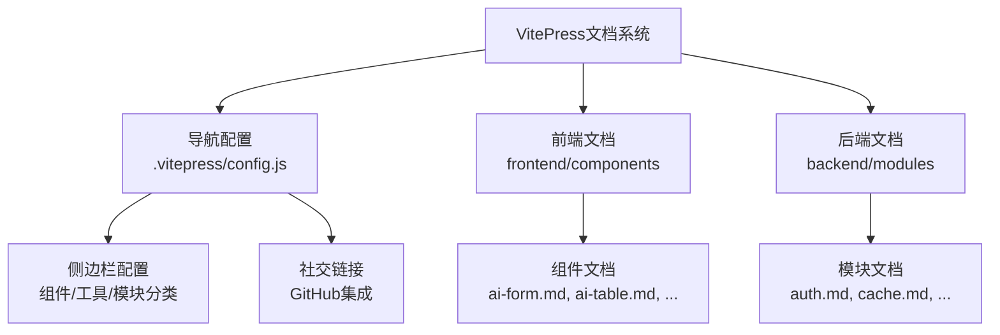

**图表来源**
- [forge-docs/.vitepress/config.js:1-69](file://forge-docs/.vitepress/config.js#L1-L69)
- [forge-docs/backend/modules/overview.md:1-30](file://forge-docs/backend/modules/overview.md#L1-L30)
- [forge-docs/frontend/components/overview.md:1-31](file://forge-docs/frontend/components/overview.md#L1-L31)

**章节来源**
- [forge-docs/.vitepress/config.js:1-69](file://forge-docs/.vitepress/config.js#L1-L69)
- [forge-docs/backend/modules/overview.md:1-30](file://forge-docs/backend/modules/overview.md#L1-L30)
- [forge-docs/frontend/components/overview.md:1-31](file://forge-docs/frontend/components/overview.md#L1-L31)
- [forge-docs/README.md:1-90](file://forge-docs/README.md#L1-L90)
- [forge-docs/package.json:1-25](file://forge-docs/package.json#L1-L25)

## 依赖分析
- 版本与依赖管理：通过forge-dependencies集中管理Spring Boot、MyBatis-Plus、Sa-Token、Redisson、Lock4j、动态数据源、EasyExcel、Hutool、Undertow、Fastjson2、BCProv、MapStruct等依赖
- 模块间耦合：Starter之间通过依赖传递形成清晰的层次关系，核心Starter为其他模块提供基础能力
- 外部依赖：Redis、数据库、对象存储（OSS）等基础设施通过对应Starter注入

**Maven父子关系重构**：采用标准化的父子模块结构，父POM统一管理版本和插件，子模块专注于功能实现。

```mermaid
graph LR
DEPS["依赖管理<br/>forge-dependencies/pom.xml"] --> CORE["core"]
DEPS --> WEB["web"]
DEPS --> ORM["orm"]
DEPS --> CACHE["cache"]
DEPS --> AUTH["auth"]
DEPS --> LOG["log"]
DEPS --> TRANS["trans"]
DEPS --> FILE["file"]
DEPS --> EXCEL["excel"]
DEPS --> CONF["config"]
DEPS --> JOB["job"]
DEPS --> ID["id"]
DEPS --> DATASCOPE["datascope"]
DEPS --> MSG["message"]
DEPS --> TENANT["tenant"]
DEPS --> CRYPTO["crypto"]
DEPS --> WS["websocket"]
DEPS --> APICONF["api-config"]
```

**图表来源**
- [forge/forge-framework/forge-dependencies/pom.xml:73-413](file://forge/forge-framework/forge-dependencies/pom.xml#L73-L413)

**章节来源**
- [forge/forge-framework/forge-dependencies/pom.xml:1-487](file://forge/forge-framework/forge-dependencies/pom.xml#L1-L487)

## 性能考虑
- Web容器：采用Undertow替代Tomcat，具备更高的并发与更低的内存占用
- 缓存：Redisson提供高性能分布式缓存与锁，结合Caffeine实现本地缓存加速
- ORM：MyBatis-Plus提升开发效率，配合动态数据源与SQL审计工具优化性能与可观测性
- 文件存储：OSS直传与CDN加速，降低带宽与延迟
- 并发模型：合理配置Undertow线程池与缓冲区大小，避免高并发下的内存抖动

**文档系统性能**：VitePress采用静态站点生成，提供快速的文档浏览体验，支持热更新和SEO优化。

## 故障排查指南
- 启动失败
  - 检查应用入口类是否正确扫描基础包
  - 确认配置文件profiles.active与环境一致
- 认证问题
  - 检查Redis连通性与Sa-Token配置
  - 核对API白名单与JWT签名配置
- 数据库问题
  - 检查动态数据源配置与SQL审计日志
  - 确认MyBatis-Plus实体扫描路径
- 缓存问题
  - 检查Redisson配置与序列化方式
  - 核对分布式锁与限流策略
- 文件存储问题
  - 检查OSS凭证与Bucket配置
  - 确认文件URL生成规则
- 任务调度问题
  - 检查定时任务表达式与执行日志
  - 核对作业配置与触发条件
- **文档系统问题**
  - 检查VitePress配置文件语法
  - 确认文档路由与侧边栏配置
  - 验证静态资源路径和构建脚本

**章节来源**
- [forge/forge-admin/src/main/java/com/mdframe/forge/admin/ForgeAdminApplication.java:8-11](file://forge/forge-admin/src/main/java/com/mdframe/forge/admin/ForgeAdminApplication.java#L8-L11)
- [forge/forge-admin/src/main/resources/application.yml:39-100](file://forge/forge-admin/src/main/resources/application.yml#L39-L100)
- [forge-docs/.vitepress/config.js:1-69](file://forge-docs/.vitepress/config.js#L1-L69)

## 结论
Forge后端框架通过模块化的Starter体系，将企业级应用所需的认证、数据、缓存、文件、任务、事务、消息、租户、加密、WebSocket、API配置等能力标准化、可插拔化。借助统一的依赖管理与自动装配机制，开发者可以快速组合所需模块，构建高性能、可扩展的企业应用。

**现代化成果**：通过引入VitePress文档系统和标准化模块组织，框架实现了更好的可维护性、开发体验和文档质量，为后续功能扩展和技术演进奠定了坚实基础。

## 附录
- 扩展开发指南
  - 新增Starter：在Starter父模块下创建新模块，声明必要依赖并在META-INF注册自动装配类
  - 配置管理：通过ConfigStarter提供的刷新机制实现运行期配置热更新
  - 安全加固：结合AuthStarter的白名单与JWT策略，完善API安全
  - 性能优化：根据业务场景调整Undertow线程池、Redisson参数与MyBatis-Plus分页策略
  - **文档维护**：遵循VitePress文档规范，维护前后端文档的一致性和完整性
  - **模块标准化**：按照统一的命名规范和目录结构组织新模块，确保团队协作效率

- **文档系统维护**
  - 使用VitePress的热更新功能进行实时预览
  - 遵循Markdown语法规范编写文档内容
  - 定期更新导航配置和侧边栏结构
  - 维护文档的SEO优化和静态资源管理