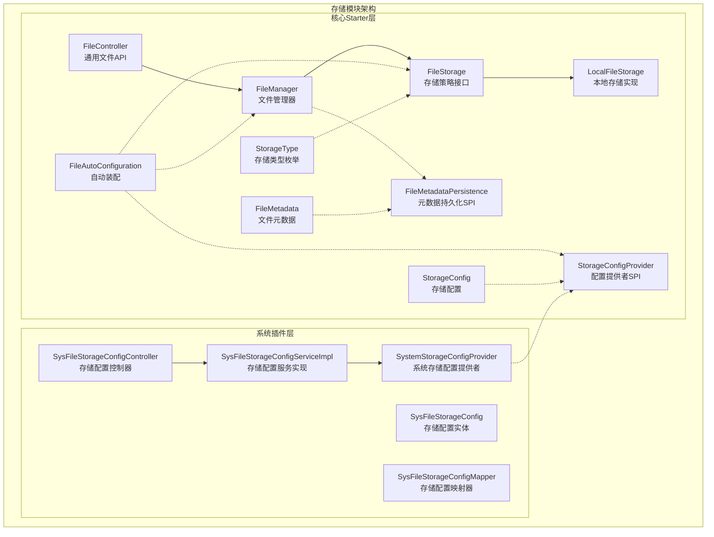
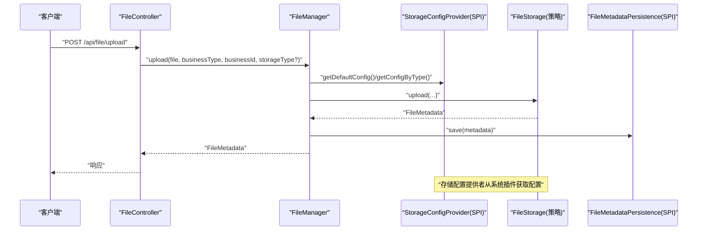
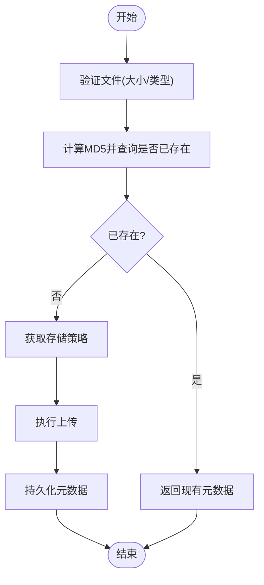
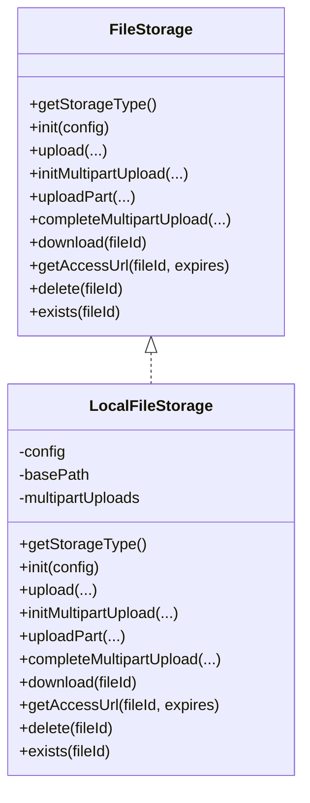
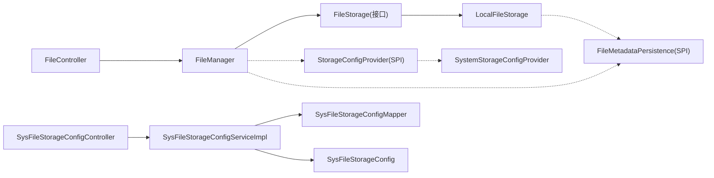
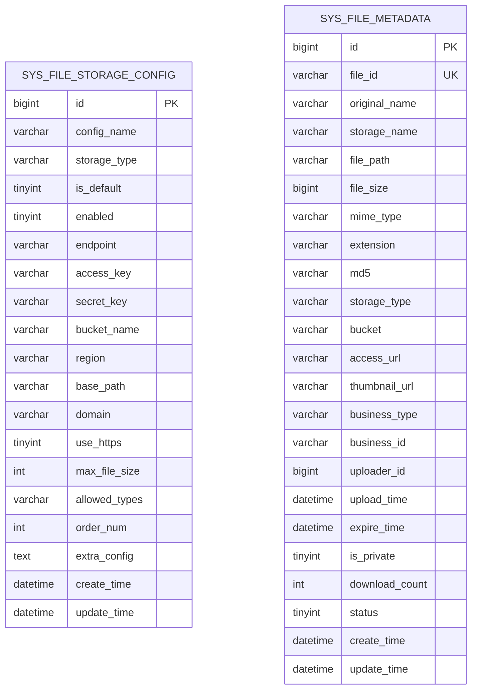
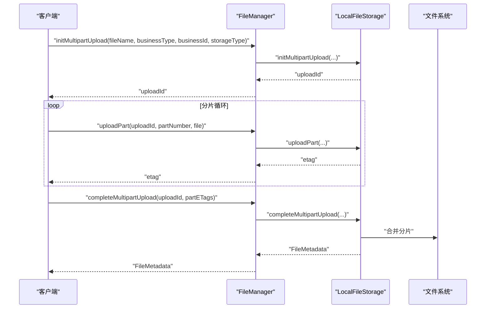

# 存储模块

<cite>
**本文引用的文件**
- [FileAutoConfiguration.java](file://forge/forge-framework/forge-starter-parent/forge-starter-file/src/main/java/com/mdframe/forge/starter/file/config/FileAutoConfiguration.java)
- [FileStorageProperties.java](file://forge/forge-framework/forge-starter-parent/forge-starter-file/src/main/java/com/mdframe/forge/starter/file/config/FileStorageProperties.java)
- [FileController.java](file://forge/forge-framework/forge-starter-parent/forge-starter-file/src/main/java/com/mdframe/forge/starter/file/controller/FileController.java)
- [FileManager.java](file://forge/forge-framework/forge-starter-parent/forge-starter-file/src/main/java/com/mdframe/forge/starter/file/core/FileManager.java)
- [StorageType.java](file://forge/forge-framework/forge-starter-parent/forge-starter-file/src/main/java/com/mdframe/forge/starter/file/enums/StorageType.java)
- [FileMetadata.java](file://forge/forge-framework/forge-starter-parent/forge-starter-file/src/main/java/com/mdframe/forge/starter/file/model/FileMetadata.java)
- [StorageConfig.java](file://forge/forge-framework/forge-starter-parent/forge-starter-file/src/main/java/com/mdframe/forge/starter/file/model/StorageConfig.java)
- [FileMetadataPersistence.java](file://forge/forge-framework/forge-starter-parent/forge-starter-file/src/main/java/com/mdframe/forge/starter/file/spi/FileMetadataPersistence.java)
- [StorageConfigProvider.java](file://forge/forge-framework/forge-starter-parent/forge-starter-file/src/main/java/com/mdframe/forge/starter/file/spi/StorageConfigProvider.java)
- [FileStorage.java](file://forge/forge-framework/forge-starter-parent/forge-starter-file/src/main/java/com/mdframe/forge/starter/file/storage/FileStorage.java)
- [LocalFileStorage.java](file://forge/forge-framework/forge-starter-parent/forge-starter-file/src/main/java/com/mdframe/forge/starter/file/storage/impl/LocalFileStorage.java)
- [SystemStorageConfigProvider.java](file://forge/forge-framework/forge-plugin-parent/forge-plugin-system/src/main/java/com/mdframe/forge/plugin/system/service/impl/SystemStorageConfigProvider.java)
- [SysFileStorageConfigController.java](file://forge/forge-framework/forge-plugin-parent/forge-plugin-system/src/main/java/com/mdframe/forge/plugin/system/controller/SysFileStorageConfigController.java)
- [SysFileStorageConfigServiceImpl.java](file://forge/forge-framework/forge-plugin-parent/forge-plugin-system/src/main/java/com/mdframe/forge/plugin/system/service/impl/SysFileStorageConfigServiceImpl.java)
- [SysFileStorageConfig.java](file://forge/forge-framework/forge-plugin-parent/forge-plugin-system/src/main/java/com/mdframe/forge/plugin/system/entity/SysFileStorageConfig.java)
- [SysFileStorageConfigMapper.java](file://forge/forge-framework/forge-plugin-parent/forge-plugin-system/src/main/java/com/mdframe/forge/plugin/system/mapper/SysFileStorageConfigMapper.java)
- [org.springframework.boot.autoconfigure.AutoConfiguration.imports](file://forge/forge-framework/forge-starter-parent/forge-starter-file/src/main/resources/META-INF/spring/org.springframework.boot.autoconfigure.AutoConfiguration.imports)
- [file_storage.sql](file://forge/forge-framework/forge-starter-parent/forge-starter-file/sql/file_storage.sql)
</cite>

## 更新摘要
**所做更改**
- 更新架构概述以反映存储配置从独立starter模块整合到系统插件
- 新增系统插件中的存储配置管理实现分析
- 更新存储配置提供者架构，展示从starter到system的迁移
- 补充系统存储配置控制器和实体的详细说明
- 更新依赖关系分析以体现新的模块组织结构

## 目录
1. [简介](#简介)
2. [项目结构](#项目结构)
3. [核心组件](#核心组件)
4. [架构总览](#架构总览)
5. [详细组件分析](#详细组件分析)
6. [依赖关系分析](#依赖关系分析)
7. [性能考虑](#性能考虑)
8. [故障排查指南](#故障排查指南)
9. [结论](#结论)
10. [附录](#附录)

## 简介
本文件为Forge存储模块的技术文档，系统性解析文件存储系统的架构设计与实现细节，涵盖本地存储实现、云存储集成接口、存储策略配置、文件管理器的上传/下载/删除/分片上传等操作机制，并阐述存储配置提供者、文件元数据持久化、存储类型枚举等关键技术点。随着架构简化，存储配置功能已从独立的starter模块整合到系统插件中，提供更统一的配置管理和维护体验。同时提供配置示例、分片上传实现流程与性能优化建议，帮助开发者快速理解与高效使用该模块。

## 项目结构
存储模块经过架构简化后，采用"核心starter + 系统插件"的双层设计：
- 核心starter层：提供文件存储的基础接口、SPI扩展、自动装配和核心功能
- 系统插件层：提供存储配置的管理界面、数据库持久化和业务逻辑实现
- 接口与SPI：定义统一的存储策略接口、元数据持久化SPI、配置提供者SPI
- 实现层：本地文件系统存储实现
- 控制层：通用文件API控制器和系统存储配置控制器
- 核心管理层：统一调度与策略选择
- 自动装配：基于Spring Boot条件装配与自动配置
- 数据模型：文件元数据与存储配置
- 数据库脚本：存储配置与元数据表结构

**图表来源**
- [FileAutoConfiguration.java:26-76](file://forge/forge-framework/forge-starter-parent/forge-starter-file/src/main/java/com/mdframe/forge/starter/file/config/FileAutoConfiguration.java#L26-L76)
- [FileManager.java:30-53](file://forge/forge-framework/forge-starter-parent/forge-starter-file/src/main/java/com/mdframe/forge/starter/file/core/FileManager.java#L30-L53)
- [FileController.java:24-43](file://forge/forge-framework/forge-starter-parent/forge-starter-file/src/main/java/com/mdframe/forge/starter/file/controller/FileController.java#L24-L43)
- [FileStorage.java:13-109](file://forge/forge-framework/forge-starter-parent/forge-starter-file/src/main/java/com/mdframe/forge/starter/file/storage/FileStorage.java#L13-L109)
- [LocalFileStorage.java:29-69](file://forge/forge-framework/forge-starter-parent/forge-starter-file/src/main/java/com/mdframe/forge/starter/file/storage/impl/LocalFileStorage.java#L29-L69)
- [SystemStorageConfigProvider.java:24-93](file://forge/forge-framework/forge-plugin-parent/forge-plugin-system/src/main/java/com/mdframe/forge/plugin/system/service/impl/SystemStorageConfigProvider.java#L24-L93)
- [SysFileStorageConfigController.java:23-97](file://forge/forge-framework/forge-plugin-parent/forge-plugin-system/src/main/java/com/mdframe/forge/plugin/system/controller/SysFileStorageConfigController.java#L23-L97)

**章节来源**
- [FileAutoConfiguration.java:24-76](file://forge/forge-framework/forge-starter-parent/forge-starter-file/src/main/java/com/mdframe/forge/starter/file/config/FileAutoConfiguration.java#L24-L76)
- [FileManager.java:30-53](file://forge/forge-framework/forge-starter-parent/forge-starter-file/src/main/java/com/mdframe/forge/starter/file/core/FileManager.java#L30-L53)
- [FileController.java:24-43](file://forge/forge-framework/forge-starter-parent/forge-starter-file/src/main/java/com/mdframe/forge/starter/file/controller/FileController.java#L24-L43)
- [SystemStorageConfigProvider.java:18-93](file://forge/forge-framework/forge-plugin-parent/forge-plugin-system/src/main/java/com/mdframe/forge/plugin/system/service/impl/SystemStorageConfigProvider.java#L18-L93)
- [SysFileStorageConfigController.java:14-97](file://forge/forge-framework/forge-plugin-parent/forge-plugin-system/src/main/java/com/mdframe/forge/plugin/system/controller/SysFileStorageConfigController.java#L14-L97)

## 核心组件
- 文件管理器：统一编排上传、下载、删除、URL获取、分片上传等流程，负责策略选择与元数据持久化协调
- 存储策略接口：抽象出统一的存储能力，便于扩展本地/云存储实现
- 本地存储实现：提供本地文件系统存储、分片上传合并、URL生成与删除等能力
- 通用文件API控制器：提供通用文件操作接口
- 系统存储配置控制器：提供存储配置的管理接口，包括CRUD操作、默认配置设置、启用状态切换、连接测试
- 系统存储配置服务：实现存储配置的业务逻辑，包括分页查询、默认配置管理、启用状态管理、连接测试
- 系统存储配置实体：定义存储配置的数据结构和数据库映射
- 系统存储配置映射器：提供存储配置的数据库操作接口
- 配置提供者SPI：从业务侧提供默认/按类型/全部启用的存储配置
- 元数据持久化SPI：负责文件元数据的保存、查询、秒传、下载计数与权限校验
- 存储类型枚举：定义受支持的存储类型及默认回退策略
- 数据模型：文件元数据与存储配置的数据结构

**章节来源**
- [FileManager.java:30-218](file://forge/forge-framework/forge-starter-parent/forge-starter-file/src/main/java/com/mdframe/forge/starter/file/core/FileManager.java#L30-L218)
- [FileStorage.java:13-109](file://forge/forge-framework/forge-starter-parent/forge-starter-file/src/main/java/com/mdframe/forge/starter/file/storage/FileStorage.java#L13-L109)
- [LocalFileStorage.java:29-328](file://forge/forge-framework/forge-starter-parent/forge-starter-file/src/main/java/com/mdframe/forge/starter/file/storage/impl/LocalFileStorage.java#L29-L328)
- [FileController.java:24-115](file://forge/forge-framework/forge-starter-parent/forge-starter-file/src/main/java/com/mdframe/forge/starter/file/controller/FileController.java#L24-L115)
- [SysFileStorageConfigController.java:14-97](file://forge/forge-framework/forge-plugin-parent/forge-plugin-system/src/main/java/com/mdframe/forge/plugin/system/controller/SysFileStorageConfigController.java#L14-L97)
- [SysFileStorageConfigServiceImpl.java:25-107](file://forge/forge-framework/forge-plugin-parent/forge-plugin-system/src/main/java/com/mdframe/forge/plugin/system/service/impl/SysFileStorageConfigServiceImpl.java#L25-L107)
- [SysFileStorageConfig.java:13-101](file://forge/forge-framework/forge-plugin-parent/forge-plugin-system/src/main/java/com/mdframe/forge/plugin/system/entity/SysFileStorageConfig.java#L13-L101)
- [StorageConfigProvider.java:11-32](file://forge/forge-framework/forge-starter-parent/forge-starter-file/src/main/java/com/mdframe/forge/starter/file/spi/StorageConfigProvider.java#L11-L32)
- [FileMetadataPersistence.java:9-40](file://forge/forge-framework/forge-starter-parent/forge-starter-file/src/main/java/com/mdframe/forge/starter/file/spi/FileMetadataPersistence.java#L9-L40)
- [StorageType.java:11-49](file://forge/forge-framework/forge-starter-parent/forge-starter-file/src/main/java/com/mdframe/forge/starter/file/enums/StorageType.java#L11-L49)
- [FileMetadata.java:13-109](file://forge/forge-framework/forge-starter-parent/forge-starter-file/src/main/java/com/mdframe/forge/starter/file/model/FileMetadata.java#L13-L109)
- [StorageConfig.java:12-108](file://forge/forge-framework/forge-starter-parent/forge-starter-file/src/main/java/com/mdframe/forge/starter/file/model/StorageConfig.java#L12-L108)

## 架构总览
存储模块通过自动配置加载存储策略与配置提供者，文件管理器作为中枢协调上传/下载/删除/分片上传等操作，并在必要时调用元数据持久化SPI进行数据落盘与查询。系统插件层提供存储配置的完整管理能力，包括数据库持久化、业务逻辑处理和用户界面。

**图表来源**
- [FileController.java:31-43](file://forge/forge-framework/forge-starter-parent/forge-starter-file/src/main/java/com/mdframe/forge/starter/file/controller/FileController.java#L31-L43)
- [FileManager.java:58-99](file://forge/forge-framework/forge-starter-parent/forge-starter-file/src/main/java/com/mdframe/forge/starter/file/core/FileManager.java#L58-L99)
- [SystemStorageConfigProvider.java:28-62](file://forge/forge-framework/forge-plugin-parent/forge-plugin-system/src/main/java/com/mdframe/forge/plugin/system/service/impl/SystemStorageConfigProvider.java#L28-L62)
- [FileStorage.java:33-46](file://forge/forge-framework/forge-starter-parent/forge-starter-file/src/main/java/com/mdframe/forge/starter/file/storage/FileStorage.java#L33-L46)
- [FileMetadataPersistence.java:14-24](file://forge/forge-framework/forge-starter-parent/forge-starter-file/src/main/java/com/mdframe/forge/starter/file/spi/FileMetadataPersistence.java#L14-L24)

## 详细组件分析

### 文件管理器（FileManager）
- 职责：注册/获取存储策略；统一上传/下载/删除/URL获取/分片上传；文件验证与秒传；与元数据持久化SPI协作
- 关键流程：
  - 上传：校验文件 → 秒传检查 → 选择存储策略 → 上传 → 持久化元数据
  - 下载：查询元数据 → 选择存储策略 → 下载 → 增加下载计数
  - URL：查询元数据 → 选择存储策略 → 生成可访问URL
  - 删除：查询元数据 → 调用存储策略删除 → 删除元数据
  - 分片上传：初始化 → 上传分片 → 完成分片合并 → 持久化元数据

**图表来源**
- [FileManager.java:70-99](file://forge/forge-framework/forge-starter-parent/forge-starter-file/src/main/java/com/mdframe/forge/starter/file/core/FileManager.java#L70-L99)
- [FileManager.java:223-253](file://forge/forge-framework/forge-starter-parent/forge-starter-file/src/main/java/com/mdframe/forge/starter/file/core/FileManager.java#L223-L253)

**章节来源**
- [FileManager.java:30-218](file://forge/forge-framework/forge-starter-parent/forge-starter-file/src/main/java/com/mdframe/forge/starter/file/core/FileManager.java#L30-L218)

### 本地文件存储实现（LocalFileStorage）
- 职责：本地文件系统存储、分片上传临时目录管理、分片合并、URL生成、删除与存在性检查
- 特性：
  - 自动生成存储文件名（UUID + 扩展名）
  - 按业务类型+日期组织相对路径
  - 分片上传：以uploadId为根目录存放分片，完成后顺序合并并清理临时目录
  - URL生成：结合配置域名或相对路径
  - 删除与存在性：基于文件系统路径

**图表来源**
- [FileStorage.java:13-109](file://forge/forge-framework/forge-starter-parent/forge-starter-file/src/main/java/com/mdframe/forge/starter/file/storage/FileStorage.java#L13-L109)
- [LocalFileStorage.java:29-328](file://forge/forge-framework/forge-starter-parent/forge-starter-file/src/main/java/com/mdframe/forge/starter/file/storage/impl/LocalFileStorage.java#L29-L328)

**章节来源**
- [LocalFileStorage.java:29-328](file://forge/forge-framework/forge-starter-parent/forge-starter-file/src/main/java/com/mdframe/forge/starter/file/storage/impl/LocalFileStorage.java#L29-L328)

### 存储策略接口（FileStorage）与SPI
- FileStorage：定义统一的存储策略接口，包括初始化、上传、分片上传、下载、URL生成、删除、存在性检查等方法
- SPI扩展：业务侧可实现该接口以接入MinIO、OSS、COS、七牛等云存储，FileManager将按配置动态选择具体实现

**章节来源**
- [FileStorage.java:13-109](file://forge/forge-framework/forge-starter-parent/forge-starter-file/src/main/java/com/mdframe/forge/starter/file/storage/FileStorage.java#L13-L109)

### 系统存储配置提供者（SystemStorageConfigProvider）
- 职责：实现StorageConfigProvider接口，从数据库读取存储配置，提供默认配置、按类型配置、全部启用配置
- 特性：
  - 使用MyBatis-Plus进行数据库操作
  - 支持缓存注解（@Cacheable/@CacheEvict）
  - 提供配置转换功能，将数据库实体转换为存储配置对象
  - 支持按存储类型、默认配置、启用状态查询

**章节来源**
- [SystemStorageConfigProvider.java:18-93](file://forge/forge-framework/forge-plugin-parent/forge-plugin-system/src/main/java/com/mdframe/forge/plugin/system/service/impl/SystemStorageConfigProvider.java#L18-L93)

### 系统存储配置控制器（SysFileStorageConfigController）
- 职责：提供存储配置的REST API接口，包括分页查询、详情查看、新增、修改、删除、设置默认配置、启用/禁用、连接测试
- 功能特性：
  - 支持加密/解密注解（@ApiDecrypt/@ApiEncrypt）
  - 支持权限忽略（@ApiPermissionIgnore）
  - 提供完整的CRUD操作
  - 支持批量操作和状态管理

**章节来源**
- [SysFileStorageConfigController.java:14-97](file://forge/forge-framework/forge-plugin-parent/forge-plugin-system/src/main/java/com/mdframe/forge/plugin/system/controller/SysFileStorageConfigController.java#L14-L97)

### 系统存储配置服务实现（SysFileStorageConfigServiceImpl）
- 职责：实现存储配置的业务逻辑，包括分页查询、默认配置管理、启用状态管理、连接测试
- 关键功能：
  - 分页查询支持多条件过滤
  - 默认配置设置时自动取消其他默认配置
  - 启用状态切换支持批量操作
  - 连接测试功能验证存储配置的有效性

**章节来源**
- [SysFileStorageConfigServiceImpl.java:25-107](file://forge/forge-framework/forge-plugin-parent/forge-plugin-system/src/main/java/com/mdframe/forge/plugin/system/service/impl/SysFileStorageConfigServiceImpl.java#L25-L107)

### 系统存储配置实体（SysFileStorageConfig）
- 职责：定义存储配置的数据结构，映射到sys_file_storage_config数据库表
- 字段说明：
  - 基本配置：配置名称、存储类型、默认策略标识、启用状态
  - 连接配置：端点、密钥、存储桶、区域
  - 访问配置：基础路径、域名、HTTPS设置
  - 限制配置：最大文件大小、允许类型、排序
  - 扩展配置：JSON格式的额外配置

**章节来源**
- [SysFileStorageConfig.java:13-101](file://forge/forge-framework/forge-plugin-parent/forge-plugin-system/src/main/java/com/mdframe/forge/plugin/system/entity/SysFileStorageConfig.java#L13-L101)

### 存储配置提供者（StorageConfigProvider）与配置模型
- StorageConfigProvider：提供默认配置、按类型配置、全部启用配置、刷新缓存等能力
- StorageConfig：封装存储类型、端点、密钥、桶、域名、HTTPS、最大文件大小、允许类型、排序、扩展配置等字段，并提供允许类型的解析

**章节来源**
- [StorageConfigProvider.java:11-32](file://forge/forge-framework/forge-starter-parent/forge-starter-file/src/main/java/com/mdframe/forge/starter/file/spi/StorageConfigProvider.java#L11-L32)
- [StorageConfig.java:12-108](file://forge/forge-framework/forge-starter-parent/forge-starter-file/src/main/java/com/mdframe/forge/starter/file/model/StorageConfig.java#L12-L108)

### 文件元数据持久化（FileMetadataPersistence）与模型
- FileMetadataPersistence：定义元数据的保存、查询、按MD5查询、下载计数递增、删除、权限校验等方法
- FileMetadata：封装文件ID、原始名、存储名、路径、大小、MIME、扩展名、MD5、存储类型、桶、访问URL、缩略图URL、业务信息、上传者、时间、私有标记、下载计数等字段

**章节来源**
- [FileMetadataPersistence.java:9-40](file://forge/forge-framework/forge-starter-parent/forge-starter-file/src/main/java/com/mdframe/forge/starter/file/spi/FileMetadataPersistence.java#L9-L40)
- [FileMetadata.java:13-109](file://forge/forge-framework/forge-starter-parent/forge-starter-file/src/main/java/com/mdframe/forge/starter/file/model/FileMetadata.java#L13-L109)

### 存储类型枚举（StorageType）
- 定义本地、MinIO、阿里云OSS、腾讯云COS、七牛云等存储类型，并提供从编码到枚举的转换，默认回退为本地存储

**章节来源**
- [StorageType.java:11-49](file://forge/forge-framework/forge-starter-parent/forge-starter-file/src/main/java/com/mdframe/forge/starter/file/enums/StorageType.java#L11-L49)

### 自动配置与启动流程
- FileAutoConfiguration：扫描组件、注册存储策略、初始化配置提供者提供的配置、记录日志
- AutoConfiguration.imports：声明自动配置类，交由Spring Boot加载

**章节来源**
- [FileAutoConfiguration.java:26-76](file://forge/forge-framework/forge-starter-parent/forge-starter-file/src/main/java/com/mdframe/forge/starter/file/config/FileAutoConfiguration.java#L26-L76)
- [org.springframework.boot.autoconfigure.AutoConfiguration.imports:1-2](file://forge/forge-framework/forge-starter-parent/forge-starter-file/src/main/resources/META-INF/spring/org.springframework.boot.autoconfigure.AutoConfiguration.imports#L1-L2)

### 通用文件API控制器（FileController）
- 提供上传、下载、获取URL、删除、分片上传初始化/上传/完成等REST接口
- 支持通过参数指定业务类型、业务ID、存储类型
- 受配置开关控制是否启用通用API

**章节来源**
- [FileController.java:24-115](file://forge/forge-framework/forge-starter-parent/forge-starter-file/src/main/java/com/mdframe/forge/starter/file/controller/FileController.java#L24-L115)

## 依赖关系分析
- 组件耦合：
  - FileManager对FileStorage、StorageConfigProvider、FileMetadataPersistence均为松耦合（通过接口与SPI）
  - FileController仅依赖FileManager
  - LocalFileStorage依赖FileMetadataPersistence（可选），用于元数据查询
  - 系统插件层通过StorageConfigProvider接口与核心starter层解耦
- 外部依赖：
  - Spring Boot自动装配与条件注解
  - MyBatis-Plus数据库框架
  - Hutool工具库（UUID、文件操作）

**图表来源**
- [FileController.java:24-43](file://forge/forge-framework/forge-starter-parent/forge-starter-file/src/main/java/com/mdframe/forge/starter/file/controller/FileController.java#L24-L43)
- [FileManager.java:30-53](file://forge/forge-framework/forge-starter-parent/forge-starter-file/src/main/java/com/mdframe/forge/starter/file/core/FileManager.java#L30-L53)
- [LocalFileStorage.java:29-69](file://forge/forge-framework/forge-starter-parent/forge-starter-file/src/main/java/com/mdframe/forge/starter/file/storage/impl/LocalFileStorage.java#L29-L69)
- [SystemStorageConfigProvider.java:24-93](file://forge/forge-framework/forge-plugin-parent/forge-plugin-system/src/main/java/com/mdframe/forge/plugin/system/service/impl/SystemStorageConfigProvider.java#L24-L93)
- [SysFileStorageConfigController.java:23-97](file://forge/forge-framework/forge-plugin-parent/forge-plugin-system/src/main/java/com/mdframe/forge/plugin/system/controller/SysFileStorageConfigController.java#L23-L97)

**章节来源**
- [FileController.java:24-115](file://forge/forge-framework/forge-starter-parent/forge-starter-file/src/main/java/com/mdframe/forge/starter/file/controller/FileController.java#L24-L115)
- [FileManager.java:30-218](file://forge/forge-framework/forge-starter-parent/forge-starter-file/src/main/java/com/mdframe/forge/starter/file/core/FileManager.java#L30-L218)
- [LocalFileStorage.java:29-328](file://forge/forge-framework/forge-starter-parent/forge-starter-file/src/main/java/com/mdframe/forge/starter/file/storage/impl/LocalFileStorage.java#L29-L328)
- [SystemStorageConfigProvider.java:24-93](file://forge/forge-framework/forge-plugin-parent/forge-plugin-system/src/main/java/com/mdframe/forge/plugin/system/service/impl/SystemStorageConfigProvider.java#L24-L93)
- [SysFileStorageConfigController.java:23-97](file://forge/forge-framework/forge-plugin-parent/forge-plugin-system/src/main/java/com/mdframe/forge/plugin/system/controller/SysFileStorageConfigController.java#L23-L97)

## 性能考虑
- 秒传优化：通过MD5去重避免重复上传与IO开销
- 分片上传：大文件分块传输，降低内存峰值与网络波动影响
- 本地存储路径组织：按业务类型与日期分目录，提升文件系统扫描效率
- 元数据持久化：建议在高并发场景下对元数据表建立合适索引（如file_id、md5、业务组合索引）
- I/O优化：本地存储使用NIO复制与缓冲区写入，减少系统调用次数
- CDN/域名：本地存储可通过配置域名拼接访问URL，结合后端下载接口实现安全访问
- 缓存优化：系统存储配置提供者支持缓存注解，减少数据库查询压力

## 故障排查指南
- 未配置StorageConfigProvider：上传时报错提示未配置配置提供者
- 不支持的存储类型：当请求的存储类型未注册或未实现时抛出异常
- 文件不存在：下载/删除/URL生成前先查询元数据，不存在则报错
- 文件大小/类型校验失败：超出限制或类型不被允许会抛出异常
- 本地存储目录创建失败：初始化时若基础路径不存在且无法创建会抛出异常
- 分片上传临时目录异常：分片合并失败或临时目录清理失败需检查磁盘权限与空间
- 系统存储配置异常：检查数据库连接、配置实体映射和缓存配置
- 存储连接测试失败：验证端点、密钥、存储桶等连接参数的正确性

**章节来源**
- [FileManager.java:59-98](file://forge/forge-framework/forge-starter-parent/forge-starter-file/src/main/java/com/mdframe/forge/starter/file/core/FileManager.java#L59-L98)
- [LocalFileStorage.java:50-69](file://forge/forge-framework/forge-starter-parent/forge-starter-file/src/main/java/com/mdframe/forge/starter/file/storage/impl/LocalFileStorage.java#L50-L69)
- [LocalFileStorage.java:137-163](file://forge/forge-framework/forge-starter-parent/forge-starter-file/src/main/java/com/mdframe/forge/starter/file/storage/impl/LocalFileStorage.java#L137-L163)
- [LocalFileStorage.java:187-254](file://forge/forge-framework/forge-starter-parent/forge-starter-file/src/main/java/com/mdframe/forge/starter/file/storage/impl/LocalFileStorage.java#L187-L254)
- [SysFileStorageConfigServiceImpl.java:85-106](file://forge/forge-framework/forge-plugin-parent/forge-plugin-system/src/main/java/com/mdframe/forge/plugin/system/service/impl/SysFileStorageConfigServiceImpl.java#L85-L106)

## 结论
Forge存储模块经过架构简化后，形成了更加清晰的分层设计：核心starter层提供基础的存储接口和功能，系统插件层提供完整的存储配置管理能力。这种设计既保持了核心功能的简洁性，又提供了强大的配置管理能力。系统存储配置提供者通过数据库持久化实现了配置的动态管理，支持缓存优化和连接测试等功能。文件管理器承担了策略选择与流程编排职责，配合元数据持久化与配置提供者，形成可配置、可扩展、可运维的文件存储体系。本地存储实现提供了完善的分片上传与URL生成能力，满足常见业务需求；通过合理配置与索引优化，可在高并发场景下获得稳定性能。

## 附录

### 数据模型与表结构
- 存储配置表：sys_file_storage_config
- 文件元数据表：sys_file_metadata
- 初始化默认配置：本地存储与MinIO示例

**图表来源**
- [file_storage.sql:4-60](file://forge/forge-framework/forge-starter-parent/forge-starter-file/sql/file_storage.sql#L4-L60)

**章节来源**
- [file_storage.sql:4-75](file://forge/forge-framework/forge-starter-parent/forge-starter-file/sql/file_storage.sql#L4-L75)

### 分片上传实现流程
- 初始化：生成uploadId，创建临时目录，记录上下文
- 上传分片：按分片编号保存到临时目录
- 完成：顺序合并分片至目标路径，删除临时目录，构建元数据并持久化

**图表来源**
- [FileController.java:77-115](file://forge/forge-framework/forge-starter-parent/forge-starter-file/src/main/java/com/mdframe/forge/starter/file/controller/FileController.java#L77-L115)
- [FileManager.java:183-218](file://forge/forge-framework/forge-starter-parent/forge-starter-file/src/main/java/com/mdframe/forge/starter/file/core/FileManager.java#L183-L218)
- [LocalFileStorage.java:137-254](file://forge/forge-framework/forge-starter-parent/forge-starter-file/src/main/java/com/mdframe/forge/starter/file/storage/impl/LocalFileStorage.java#L137-L254)

### 存储配置示例
- 本地存储：设置基础路径、最大文件大小、允许类型、排序
- MinIO存储：设置端点、密钥、桶名、HTTPS、最大文件大小、允许类型
- 默认策略：通过is_default与enabled控制启用与默认行为
- 系统配置：通过系统插件的存储配置管理界面进行可视化配置

**章节来源**
- [file_storage.sql:65-75](file://forge/forge-framework/forge-starter-parent/forge-starter-file/sql/file_storage.sql#L65-L75)
- [StorageConfig.java:12-108](file://forge/forge-framework/forge-starter-parent/forge-starter-file/src/main/java/com/mdframe/forge/starter/file/model/StorageConfig.java#L12-L108)
- [SysFileStorageConfig.java:24-100](file://forge/forge-framework/forge-plugin-parent/forge-plugin-system/src/main/java/com/mdframe/forge/plugin/system/entity/SysFileStorageConfig.java#L24-L100)