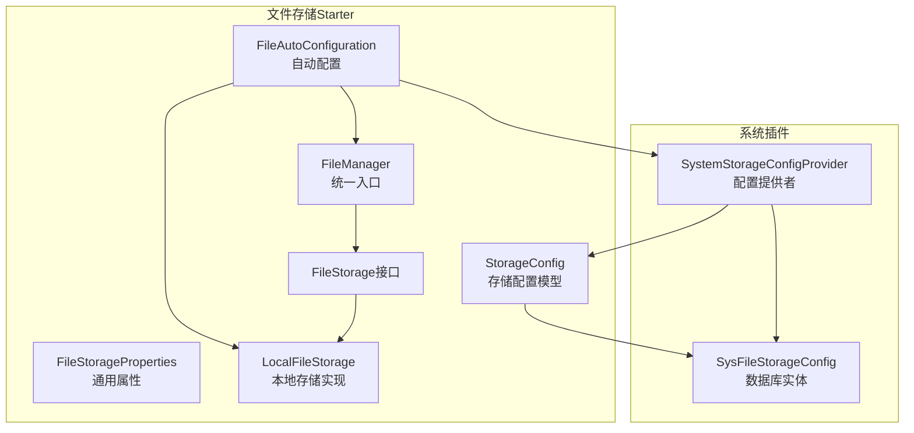
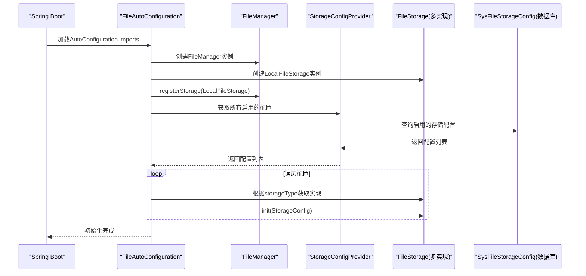
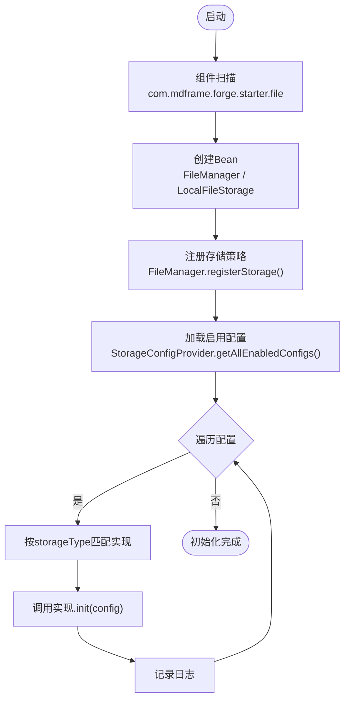
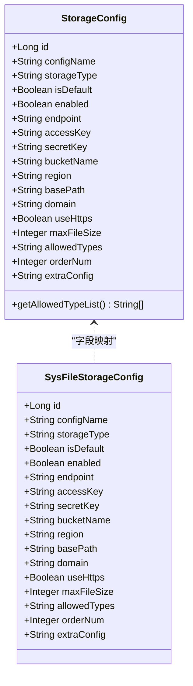
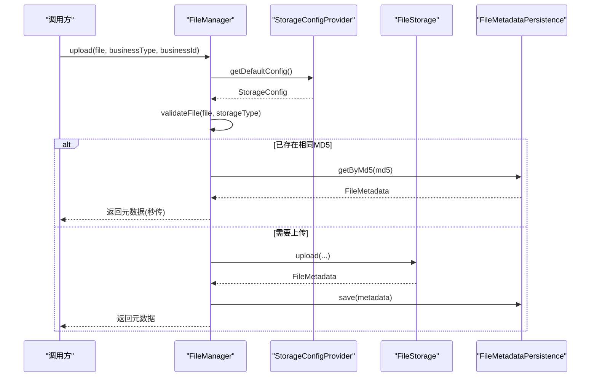
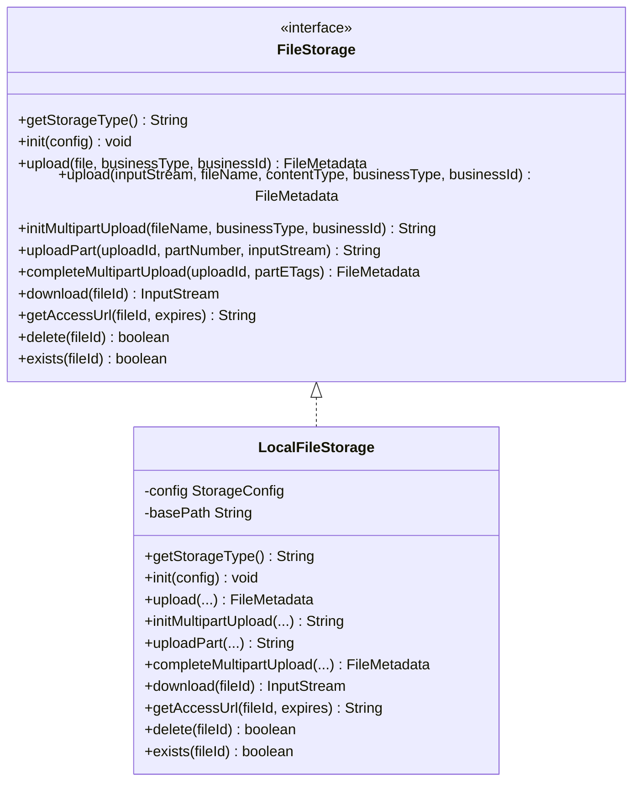
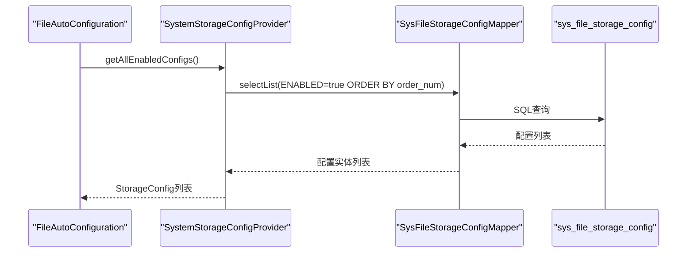
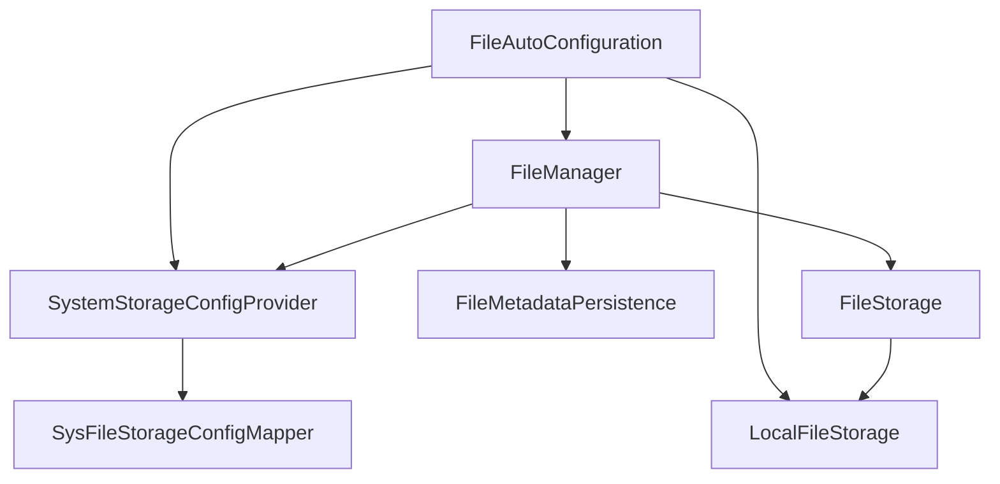

# 存储配置管理

<cite>
**本文档引用的文件**
- [FileAutoConfiguration.java](file://forge/forge-framework/forge-starter-parent/forge-starter-file/src/main/java/com/mdframe/forge/starter/file/config/FileAutoConfiguration.java)
- [FileStorageProperties.java](file://forge/forge-framework/forge-starter-parent/forge-starter-file/src/main/java/com/mdframe/forge/starter/file/config/FileStorageProperties.java)
- [StorageConfig.java](file://forge/forge-framework/forge-starter-parent/forge-starter-file/src/main/java/com/mdframe/forge/starter/file/model/StorageConfig.java)
- [FileStorage.java](file://forge/forge-framework/forge-starter-parent/forge-starter-file/src/main/java/com/mdframe/forge/starter/file/storage/FileStorage.java)
- [LocalFileStorage.java](file://forge/forge-framework/forge-starter-parent/forge-starter-file/src/main/java/com/mdframe/forge/starter/file/storage/impl/LocalFileStorage.java)
- [SystemStorageConfigProvider.java](file://forge/forge-framework/forge-plugin-parent/forge-plugin-system/src/main/java/com/mdframe/forge/plugin/system/service/impl/SystemStorageConfigProvider.java)
- [FileManager.java](file://forge/forge-framework/forge-starter-parent/forge-starter-file/src/main/java/com/mdframe/forge/starter/file/core/FileManager.java)
- [SysFileStorageConfig.java](file://forge/forge-framework/forge-plugin-parent/forge-plugin-system/src/main/java/com/mdframe/forge/plugin/system/entity/SysFileStorageConfig.java)
- [org.springframework.boot.autoconfigure.AutoConfiguration.imports](file://forge/forge-framework/forge-starter-parent/forge-starter-file/src/main/resources/META-INF/spring/org.springframework.boot.autoconfigure.AutoConfiguration.imports)
</cite>

## 目录
1. [简介](#简介)
2. [项目结构](#项目结构)
3. [核心组件](#核心组件)
4. [架构总览](#架构总览)
5. [详细组件分析](#详细组件分析)
6. [依赖关系分析](#依赖关系分析)
7. [性能考虑](#性能考虑)
8. [故障排除指南](#故障排除指南)
9. [结论](#结论)
10. [附录](#附录)

## 简介
本技术文档聚焦于Forge框架中的文件存储配置管理机制，系统性解析以下关键内容：
- 自动配置类FileAutoConfiguration的配置加载与初始化流程
- 存储属性配置FileStorageProperties的参数与使用方式
- 存储配置模型StorageConfig的数据结构与配置项说明
- 不同存储类型的配置示例、配置验证方法与故障排除指南

通过本文档，读者可以全面理解Forge文件存储模块如何在启动时自动装配、如何从数据库加载配置、如何根据配置进行文件上传/下载/删除等操作，并掌握常见问题的排查思路。

## 项目结构
Forge文件存储模块位于forge-starter-file中，采用“starter”模式提供自动配置能力；系统插件模块forge-plugin-system提供存储配置的持久化与提供者实现。Spring Boot通过META-INF下的AutoConfiguration.imports自动发现并加载FileAutoConfiguration。

**图表来源**
- [FileAutoConfiguration.java](file://forge/forge-framework/forge-starter-parent/forge-starter-file/src/main/java/com/mdframe/forge/starter/file/config/FileAutoConfiguration.java#L1-L77)
- [FileStorageProperties.java](file://forge/forge-framework/forge-starter-parent/forge-starter-file/src/main/java/com/mdframe/forge/starter/file/config/FileStorageProperties.java#L1-L25)
- [FileManager.java](file://forge/forge-framework/forge-starter-parent/forge-starter-file/src/main/java/com/mdframe/forge/starter/file/core/FileManager.java#L1-L255)
- [FileStorage.java](file://forge/forge-framework/forge-starter-parent/forge-starter-file/src/main/java/com/mdframe/forge/starter/file/storage/FileStorage.java#L1-L110)
- [LocalFileStorage.java](file://forge/forge-framework/forge-starter-parent/forge-starter-file/src/main/java/com/mdframe/forge/starter/file/storage/impl/LocalFileStorage.java#L1-L439)
- [StorageConfig.java](file://forge/forge-framework/forge-starter-parent/forge-starter-file/src/main/java/com/mdframe/forge/starter/file/model/StorageConfig.java#L1-L109)
- [SystemStorageConfigProvider.java](file://forge/forge-framework/forge-plugin-parent/forge-plugin-system/src/main/java/com/mdframe/forge/plugin/system/service/impl/SystemStorageConfigProvider.java#L1-L94)
- [SysFileStorageConfig.java](file://forge/forge-framework/forge-plugin-parent/forge-plugin-system/src/main/java/com/mdframe/forge/plugin/system/entity/SysFileStorageConfig.java#L1-L102)

**章节来源**
- [org.springframework.boot.autoconfigure.AutoConfiguration.imports](file://forge/forge-framework/forge-starter-parent/forge-starter-file/src/main/resources/META-INF/spring/org.springframework.boot.autoconfigure.AutoConfiguration.imports#L1-L2)
- [FileAutoConfiguration.java](file://forge/forge-framework/forge-starter-parent/forge-starter-file/src/main/java/com/mdframe/forge/starter/file/config/FileAutoConfiguration.java#L1-L77)

## 核心组件
- FileAutoConfiguration：负责自动装配FileManager、LocalFileStorage以及从StorageConfigProvider加载数据库配置并初始化各存储策略。
- FileStorageProperties：提供通用文件存储属性，如是否启用通用API、默认存储类型等。
- StorageConfig：存储策略配置的模型，包含访问端点、密钥、桶名、区域、基础路径、域名、HTTPS开关、最大文件大小、允许的文件类型、排序、扩展配置等字段。
- FileStorage接口：定义统一的文件存储能力，包括上传、分片上传、下载、删除、URL获取等。
- LocalFileStorage：本地文件系统存储的具体实现，负责本地目录创建、文件写入、分片合并、URL生成等。
- SystemStorageConfigProvider：系统插件提供的配置提供者，从数据库表sys_file_storage_config读取配置并转换为StorageConfig。
- FileManager：统一的文件管理入口，负责注册存储策略、执行上传/下载/删除、URL获取、分片上传等，并进行文件校验与元数据持久化。

**章节来源**
- [FileAutoConfiguration.java](file://forge/forge-framework/forge-starter-parent/forge-starter-file/src/main/java/com/mdframe/forge/starter/file/config/FileAutoConfiguration.java#L1-L77)
- [FileStorageProperties.java](file://forge/forge-framework/forge-starter-parent/forge-starter-file/src/main/java/com/mdframe/forge/starter/file/config/FileStorageProperties.java#L1-L25)
- [StorageConfig.java](file://forge/forge-framework/forge-starter-parent/forge-starter-file/src/main/java/com/mdframe/forge/starter/file/model/StorageConfig.java#L1-L109)
- [FileStorage.java](file://forge/forge-framework/forge-starter-parent/forge-starter-file/src/main/java/com/mdframe/forge/starter/file/storage/FileStorage.java#L1-L110)
- [LocalFileStorage.java](file://forge/forge-framework/forge-starter-parent/forge-starter-file/src/main/java/com/mdframe/forge/starter/file/storage/impl/LocalFileStorage.java#L1-L439)
- [SystemStorageConfigProvider.java](file://forge/forge-framework/forge-plugin-parent/forge-plugin-system/src/main/java/com/mdframe/forge/plugin/system/service/impl/SystemStorageConfigProvider.java#L1-L94)
- [FileManager.java](file://forge/forge-framework/forge-starter-parent/forge-starter-file/src/main/java/com/mdframe/forge/starter/file/core/FileManager.java#L1-L255)

## 架构总览
下图展示了启动阶段的配置加载与初始化流程，以及运行时的文件管理调用链路。

**图表来源**
- [org.springframework.boot.autoconfigure.AutoConfiguration.imports](file://forge/forge-framework/forge-starter-parent/forge-starter-file/src/main/resources/META-INF/spring/org.springframework.boot.autoconfigure.AutoConfiguration.imports#L1-L2)
- [FileAutoConfiguration.java](file://forge/forge-framework/forge-starter-parent/forge-starter-file/src/main/java/com/mdframe/forge/starter/file/config/FileAutoConfiguration.java#L48-L70)
- [SystemStorageConfigProvider.java](file://forge/forge-framework/forge-plugin-parent/forge-plugin-system/src/main/java/com/mdframe/forge/plugin/system/service/impl/SystemStorageConfigProvider.java#L66-L76)
- [SysFileStorageConfig.java](file://forge/forge-framework/forge-plugin-parent/forge-plugin-system/src/main/java/com/mdframe/forge/plugin/system/entity/SysFileStorageConfig.java#L1-L102)

## 详细组件分析

### FileAutoConfiguration自动配置类
- 组件扫描：对com.mdframe.forge.starter.file包进行组件扫描。
- 条件化Bean：
  - 当容器中不存在FileManager时，创建默认FileManager实例。
  - 当容器中不存在LocalFileStorage时，创建默认LocalFileStorage实例。
- 初始化逻辑：
  - 将扫描到的所有FileStorage实现注册到FileManager。
  - 若存在StorageConfigProvider，则从数据库加载所有启用的配置，按storageType匹配对应FileStorage并调用init进行初始化。
  - 初始化完成后输出完成日志。

**图表来源**
- [FileAutoConfiguration.java](file://forge/forge-framework/forge-starter-parent/forge-starter-file/src/main/java/com/mdframe/forge/starter/file/config/FileAutoConfiguration.java#L24-L70)

**章节来源**
- [FileAutoConfiguration.java](file://forge/forge-framework/forge-starter-parent/forge-starter-file/src/main/java/com/mdframe/forge/starter/file/config/FileAutoConfiguration.java#L1-L77)

### FileStorageProperties存储属性配置
- 前缀：forge.file
- 关键属性：
  - enableGenericApi：是否启用通用文件API，默认true
  - defaultStorageType：默认存储类型，默认local
- 使用场景：作为通用配置项，可影响文件管理器的默认行为或API开关。

**章节来源**
- [FileStorageProperties.java](file://forge/forge-framework/forge-starter-parent/forge-starter-file/src/main/java/com/mdframe/forge/starter/file/config/FileStorageProperties.java#L1-L25)

### StorageConfig存储配置模型
- 数据结构要点：
  - 基本信息：id、configName、storageType、isDefault、enabled、orderNum
  - 访问信息：endpoint、accessKey、secretKey、bucketName、region、domain、useHttps
  - 存储信息：basePath、maxFileSize、allowedTypes、extraConfig
- 关键方法：
  - getAllowedTypeList：将逗号分隔的字符串解析为小写的扩展名列表，用于文件类型校验。
- 与数据库映射：
  - 与SysFileStorageConfig实体字段一一对应，便于MyBatis Plus直接映射。

**图表来源**
- [StorageConfig.java](file://forge/forge-framework/forge-starter-parent/forge-starter-file/src/main/java/com/mdframe/forge/starter/file/model/StorageConfig.java#L1-L109)
- [SysFileStorageConfig.java](file://forge/forge-framework/forge-plugin-parent/forge-plugin-system/src/main/java/com/mdframe/forge/plugin/system/entity/SysFileStorageConfig.java#L1-L102)

**章节来源**
- [StorageConfig.java](file://forge/forge-framework/forge-starter-parent/forge-starter-file/src/main/java/com/mdframe/forge/starter/file/model/StorageConfig.java#L1-L109)
- [SysFileStorageConfig.java](file://forge/forge-framework/forge-plugin-parent/forge-plugin-system/src/main/java/com/mdframe/forge/plugin/system/entity/SysFileStorageConfig.java#L1-L102)

### FileManager文件管理器
- 职责：
  - 注册与获取存储策略
  - 统一上传、下载、删除、URL获取、分片上传等操作
  - 文件校验（大小、类型）与元数据持久化
- 关键流程：
  - 上传：先校验文件，尝试秒传（基于MD5），选择存储策略并上传，最后持久化元数据
  - 下载：根据文件ID获取元数据，定位存储策略并下载，更新下载计数
  - URL：根据文件元数据获取对应存储策略的访问URL
  - 分片：初始化、上传分片、完成合并，并持久化元数据

**图表来源**
- [FileManager.java](file://forge/forge-framework/forge-starter-parent/forge-starter-file/src/main/java/com/mdframe/forge/starter/file/core/FileManager.java#L58-L99)

**章节来源**
- [FileManager.java](file://forge/forge-framework/forge-starter-parent/forge-starter-file/src/main/java/com/mdframe/forge/starter/file/core/FileManager.java#L1-L255)

### FileStorage接口与LocalFileStorage实现
- FileStorage接口定义了统一的文件存储能力，包括：
  - 基本能力：init、upload、download、delete、exists、getAccessUrl
  - 分片能力：initMultipartUpload、uploadPart、completeMultipartUpload
- LocalFileStorage实现：
  - 初始化：读取StorageConfig的basePath，若为空则使用用户主目录下的默认路径，并确保目录存在
  - 上传：生成存储名与相对路径，写入文件，构建FileMetadata
  - 分片：创建临时目录，保存分片文件，合并后清理临时目录
  - 下载/删除/存在性：基于basePath与元数据filePath定位文件
  - URL：本地存储返回相对路径，结合服务端下载接口使用

**图表来源**
- [FileStorage.java](file://forge/forge-framework/forge-starter-parent/forge-starter-file/src/main/java/com/mdframe/forge/starter/file/storage/FileStorage.java#L1-L110)
- [LocalFileStorage.java](file://forge/forge-framework/forge-starter-parent/forge-starter-file/src/main/java/com/mdframe/forge/starter/file/storage/impl/LocalFileStorage.java#L1-L439)

**章节来源**
- [FileStorage.java](file://forge/forge-framework/forge-starter-parent/forge-starter-file/src/main/java/com/mdframe/forge/starter/file/storage/FileStorage.java#L1-L110)
- [LocalFileStorage.java](file://forge/forge-framework/forge-starter-parent/forge-starter-file/src/main/java/com/mdframe/forge/starter/file/storage/impl/LocalFileStorage.java#L1-L439)

### SystemStorageConfigProvider配置提供者
- 职责：从数据库表sys_file_storage_config读取配置，转换为StorageConfig对象
- 方法：
  - getDefaultConfig：查询启用且默认的配置
  - getConfigByType：按存储类型查询启用的配置
  - getAllEnabledConfigs：查询所有启用配置并按排序字段升序排列
  - refreshConfig：刷新配置缓存（预留）
- 映射：通过BeanUtil将SysFileStorageConfig复制到StorageConfig

**图表来源**
- [SystemStorageConfigProvider.java](file://forge/forge-framework/forge-plugin-parent/forge-plugin-system/src/main/java/com/mdframe/forge/plugin/system/service/impl/SystemStorageConfigProvider.java#L66-L76)
- [SysFileStorageConfig.java](file://forge/forge-framework/forge-plugin-parent/forge-plugin-system/src/main/java/com/mdframe/forge/plugin/system/entity/SysFileStorageConfig.java#L1-L102)

**章节来源**
- [SystemStorageConfigProvider.java](file://forge/forge-framework/forge-plugin-parent/forge-plugin-system/src/main/java/com/mdframe/forge/plugin/system/service/impl/SystemStorageConfigProvider.java#L1-L94)
- [SysFileStorageConfig.java](file://forge/forge-framework/forge-plugin-parent/forge-plugin-system/src/main/java/com/mdframe/forge/plugin/system/entity/SysFileStorageConfig.java#L1-L102)

## 依赖关系分析
- FileAutoConfiguration依赖：
  - FileManager：用于注册存储策略
  - StorageConfigProvider：用于从数据库加载配置
  - FileStorage：用于创建默认本地存储实现
- FileManager依赖：
  - StorageConfigProvider：用于获取默认/按类型配置
  - FileMetadataPersistence：用于元数据的查询与持久化
  - FileStorage：按storageType获取具体实现
- SystemStorageConfigProvider依赖：
  - SysFileStorageConfigMapper：数据库访问
  - StorageConfig：结果映射

**图表来源**
- [FileAutoConfiguration.java](file://forge/forge-framework/forge-starter-parent/forge-starter-file/src/main/java/com/mdframe/forge/starter/file/config/FileAutoConfiguration.java#L28-L34)
- [FileManager.java](file://forge/forge-framework/forge-starter-parent/forge-starter-file/src/main/java/com/mdframe/forge/starter/file/core/FileManager.java#L34-L38)
- [SystemStorageConfigProvider.java](file://forge/forge-framework/forge-plugin-parent/forge-plugin-system/src/main/java/com/mdframe/forge/plugin/system/service/impl/SystemStorageConfigProvider.java#L26-L26)

**章节来源**
- [FileAutoConfiguration.java](file://forge/forge-framework/forge-starter-parent/forge-starter-file/src/main/java/com/mdframe/forge/starter/file/config/FileAutoConfiguration.java#L1-L77)
- [FileManager.java](file://forge/forge-framework/forge-starter-parent/forge-starter-file/src/main/java/com/mdframe/forge/starter/file/core/FileManager.java#L1-L255)
- [SystemStorageConfigProvider.java](file://forge/forge-framework/forge-plugin-parent/forge-plugin-system/src/main/java/com/mdframe/forge/plugin/system/service/impl/SystemStorageConfigProvider.java#L1-L94)

## 性能考虑
- 分片上传：LocalFileStorage在本地磁盘上进行分片存储与合并，适合大文件上传，减少单次IO压力。
- 元数据持久化：FileManager在上传后持久化元数据，建议为元数据表建立合适的索引（如MD5、文件ID），以提升秒传与下载效率。
- 目录结构：本地存储按业务类型与日期分组生成相对路径，有助于文件组织与清理。
- 缓存策略：SystemStorageConfigProvider预留了缓存注解，可在高并发场景下引入缓存以降低数据库压力。

## 故障排除指南
- 启动阶段无存储策略注册
  - 检查AutoConfiguration是否被加载（AutoConfiguration.imports）
  - 确认存在FileStorage实现（如LocalFileStorage）
  - 确认FileManager已正确注入并注册
  - 参考：[FileAutoConfiguration.java](file://forge/forge-framework/forge-starter-parent/forge-starter-file/src/main/java/com/mdframe/forge/starter/file/config/FileAutoConfiguration.java#L48-L70)
- 数据库配置缺失或未启用
  - 确认sys_file_storage_config中存在enabled=true的配置
  - 确认storageType与实现一致
  - 参考：[SystemStorageConfigProvider.java](file://forge/forge-framework/forge-plugin-parent/forge-plugin-system/src/main/java/com/mdframe/forge/plugin/system/service/impl/SystemStorageConfigProvider.java#L66-L76)
- 本地存储目录不可写
  - 检查basePath配置或系统默认路径权限
  - 参考：[LocalFileStorage.java](file://forge/forge-framework/forge-starter-parent/forge-starter-file/src/main/java/com/mdframe/forge/starter/file/storage/impl/LocalFileStorage.java#L50-L69)
- 文件上传失败
  - 检查文件大小与类型限制（maxFileSize、allowedTypes）
  - 参考：[FileManager.java](file://forge/forge-framework/forge-starter-parent/forge-starter-file/src/main/java/com/mdframe/forge/starter/file/core/FileManager.java#L223-L253)
- 下载失败或找不到文件
  - 检查FileMetadataPersistence是否配置，确认文件ID有效
  - 参考：[FileManager.java](file://forge/forge-framework/forge-starter-parent/forge-starter-file/src/main/java/com/mdframe/forge/starter/file/core/FileManager.java#L104-L135)
- URL访问异常
  - 本地存储返回相对路径，需配合后端下载接口使用
  - 参考：[LocalFileStorage.java](file://forge/forge-framework/forge-starter-parent/forge-starter-file/src/main/java/com/mdframe/forge/starter/file/storage/impl/LocalFileStorage.java#L279-L292)

**章节来源**
- [FileAutoConfiguration.java](file://forge/forge-framework/forge-starter-parent/forge-starter-file/src/main/java/com/mdframe/forge/starter/file/config/FileAutoConfiguration.java#L48-L70)
- [SystemStorageConfigProvider.java](file://forge/forge-framework/forge-plugin-parent/forge-plugin-system/src/main/java/com/mdframe/forge/plugin/system/service/impl/SystemStorageConfigProvider.java#L66-L76)
- [LocalFileStorage.java](file://forge/forge-framework/forge-starter-parent/forge-starter-file/src/main/java/com/mdframe/forge/starter/file/storage/impl/LocalFileStorage.java#L50-L69)
- [FileManager.java](file://forge/forge-framework/forge-starter-parent/forge-starter-file/src/main/java/com/mdframe/forge/starter/file/core/FileManager.java#L104-L135)
- [FileManager.java](file://forge/forge-framework/forge-starter-parent/forge-starter-file/src/main/java/com/mdframe/forge/starter/file/core/FileManager.java#L223-L253)

## 结论
Forge文件存储配置管理通过自动配置类FileAutoConfiguration实现了“零样板代码”的装配，结合SystemStorageConfigProvider从数据库动态加载配置，使FileManager能够按需选择并初始化不同的存储策略。StorageConfig模型提供了丰富的配置项，覆盖了本地与云存储的关键参数；FileManager统一了上传、下载、分片等操作，并内置文件校验与元数据持久化能力。通过合理的配置与监控，可满足从开发到生产的多样化存储需求。

## 附录
- 配置验证方法
  - 启用/禁用切换：通过系统管理界面或接口将配置标记为enabled
  - 测试连接：提供测试连接接口验证存储连通性
  - 参考：[SysFileStorageConfigController.java](file://forge/forge-framework/forge-plugin-parent/forge-plugin-system/src/main/java/com/mdframe/forge/plugin/system/controller/SysFileStorageConfigController.java#L93-L96)
- 配置示例（概念性说明）
  - 本地存储：设置storageType为local，配置basePath为实际存储目录
  - MinIO：设置storageType为minio，配置endpoint、accessKey、secretKey、bucketName、region、domain等
  - 阿里云OSS/腾讯云COS/七牛云/AWS S3：分别设置对应云厂商的endpoint、密钥、桶名、区域等
  - 文件限制：设置maxFileSize与allowedTypes以控制上传大小与类型
  - 参考：[StorageConfig.java](file://forge/forge-framework/forge-starter-parent/forge-starter-file/src/main/java/com/mdframe/forge/starter/file/model/StorageConfig.java#L1-L109)