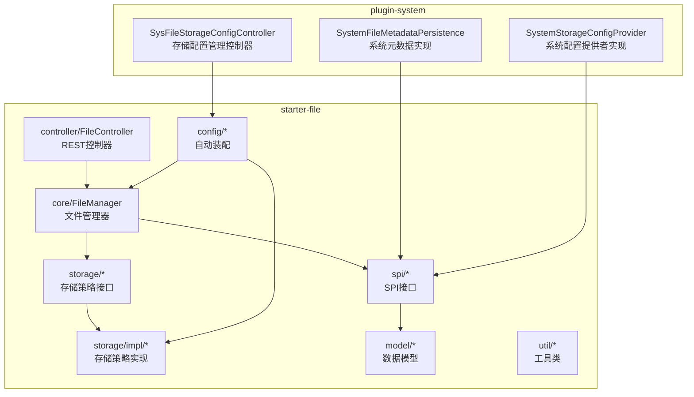
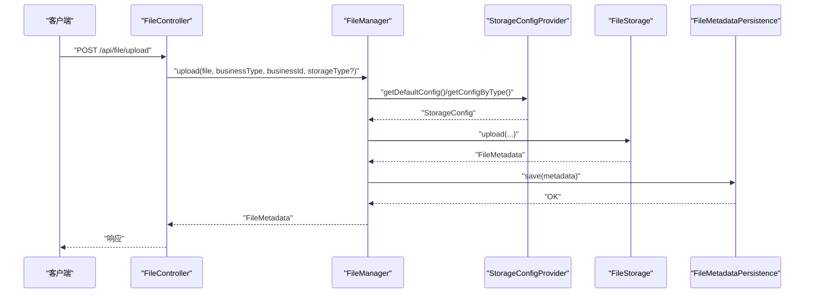
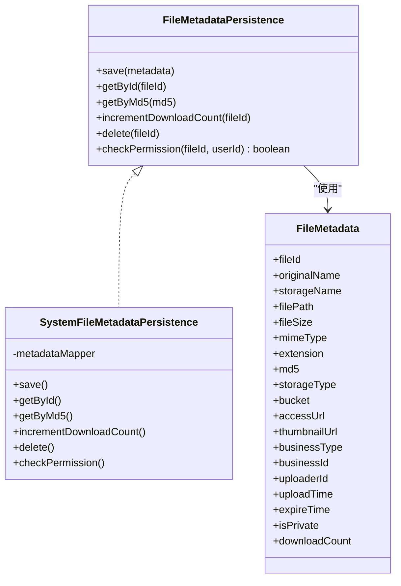
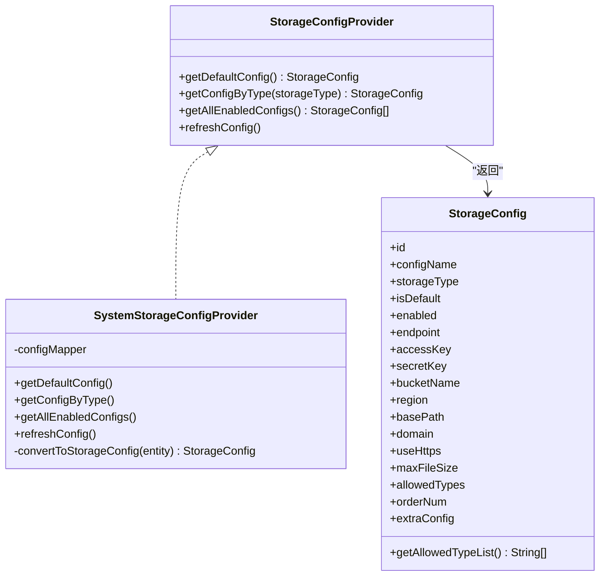
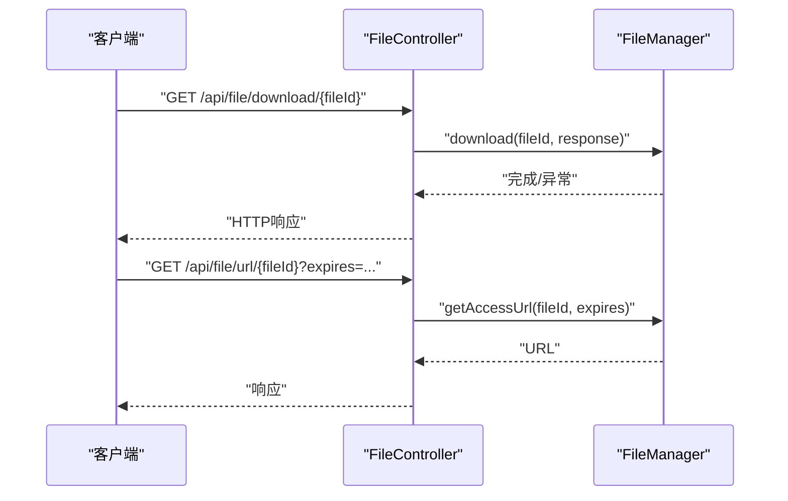
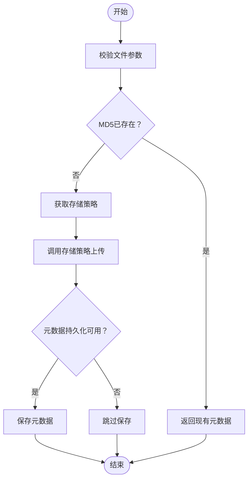
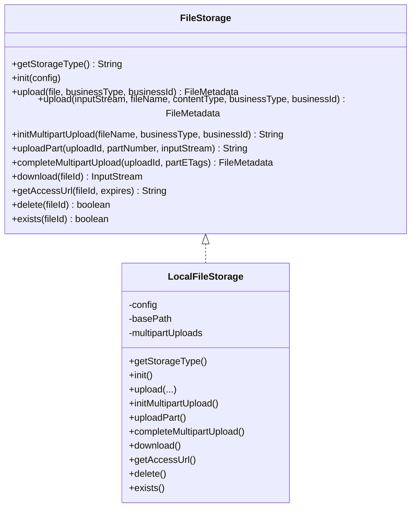
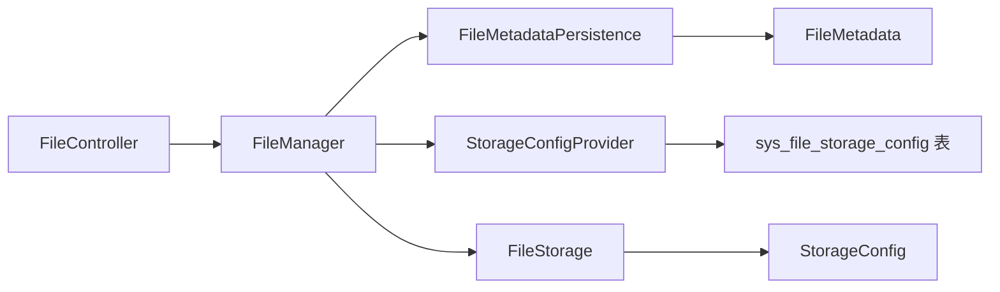

# 文件存储SPI架构

<cite>
**本文档引用的文件**
- [FileMetadataPersistence.java](file://forge/forge-framework/forge-starter-parent/forge-starter-file/src/main/java/com/mdframe/forge/starter/file/spi/FileMetadataPersistence.java)
- [StorageConfigProvider.java](file://forge/forge-framework/forge-starter-parent/forge-starter-file/src/main/java/com/mdframe/forge/starter/file/spi/StorageConfigProvider.java)
- [FileController.java](file://forge/forge-framework/forge-starter-parent/forge-starter-file/src/main/java/com/mdframe/forge/starter/file/controller/FileController.java)
- [FileManager.java](file://forge/forge-framework/forge-starter-parent/forge-starter-file/src/main/java/com/mdframe/forge/starter/file/core/FileManager.java)
- [FileMetadata.java](file://forge/forge-framework/forge-starter-parent/forge-starter-file/src/main/java/com/mdframe/forge/starter/file/model/FileMetadata.java)
- [StorageConfig.java](file://forge/forge-framework/forge-starter-parent/forge-starter-file/src/main/java/com/mdframe/forge/starter/file/model/StorageConfig.java)
- [FileStorage.java](file://forge/forge-framework/forge-starter-parent/forge-starter-file/src/main/java/com/mdframe/forge/starter/file/storage/FileStorage.java)
- [LocalFileStorage.java](file://forge/forge-framework/forge-starter-parent/forge-starter-file/src/main/java/com/mdframe/forge/starter/file/storage/impl/LocalFileStorage.java)
- [SystemFileMetadataPersistence.java](file://forge/forge-framework/forge-plugin-parent/forge-plugin-system/src/main/java/com/mdframe/forge/plugin/system/service/impl/SystemFileMetadataPersistence.java)
- [SystemStorageConfigProvider.java](file://forge/forge-framework/forge-plugin-parent/forge-plugin-system/src/main/java/com/mdframe/forge/plugin/system/service/impl/SystemStorageConfigProvider.java)
- [SysFileStorageConfigController.java](file://forge/forge-framework/forge-plugin-parent/forge-plugin-system/src/main/java/com/mdframe/forge/plugin/system/controller/SysFileStorageConfigController.java)
- [FileAutoConfiguration.java](file://forge/forge-framework/forge-starter-parent/forge-starter-file/src/main/java/com/mdframe/forge/starter/file/config/FileAutoConfiguration.java)
- [FileUtil.java](file://forge/forge-framework/forge-starter-parent/forge-starter-file/src/main/java/com/mdframe/forge/starter/file/util/FileUtil.java)
- [file_storage.sql](file://forge/forge-framework/forge-starter-parent/forge-starter-file/src/main/java/com/mdframe/forge/starter/file/sql/file_storage.sql)
</cite>

## 目录
1. [简介](#简介)
2. [项目结构](#项目结构)
3. [核心组件](#核心组件)
4. [架构总览](#架构总览)
5. [详细组件分析](#详细组件分析)
6. [依赖关系分析](#依赖关系分析)
7. [性能考虑](#性能考虑)
8. [故障排除指南](#故障排除指南)
9. [结论](#结论)
10. [附录](#附录)

## 简介
本文件存储SPI架构文档面向Forge框架的文件存储扩展能力，系统性阐述了基于SPI（服务提供接口）的插件化设计：包括文件元数据持久化接口、存储配置提供者SPI、文件控制器REST API以及本地存储策略实现。文档旨在帮助开发者理解如何通过实现SPI接口扩展自定义存储后端、如何在运行时动态加载与切换存储策略，并提供完整的扩展开发指南与最佳实践。

## 项目结构
Forge文件存储模块采用分层+插件化的组织方式：
- starter层：提供SPI接口、核心管理器、自动装配、模型与工具类
- plugin层：提供系统模块的SPI实现（系统文件元数据持久化、系统存储配置提供者）
- 控制器层：对外暴露统一的REST API，供上层业务调用

图表来源
- [FileController.java](file://forge/forge-framework/forge-starter-parent/forge-starter-file/src/main/java/com/mdframe/forge/starter/file/controller/FileController.java#L1-L58)
- [FileManager.java](file://forge/forge-framework/forge-starter-parent/forge-starter-file/src/main/java/com/mdframe/forge/starter/file/core/FileManager.java#L1-L213)
- [FileAutoConfiguration.java](file://forge/forge-framework/forge-starter-parent/forge-starter-file/src/main/java/com/mdframe/forge/starter/file/config/FileAutoConfiguration.java#L1-L77)

章节来源
- [FileController.java](file://forge/forge-framework/forge-starter-parent/forge-starter-file/src/main/java/com/mdframe/forge/starter/file/controller/FileController.java#L1-L58)
- [FileManager.java](file://forge/forge-framework/forge-starter-parent/forge-starter-file/src/main/java/com/mdframe/forge/starter/file/core/FileManager.java#L1-L213)
- [FileAutoConfiguration.java](file://forge/forge-framework/forge-starter-parent/forge-starter-file/src/main/java/com/mdframe/forge/starter/file/config/FileAutoConfiguration.java#L1-L77)

## 核心组件
- SPI接口层：定义可扩展的契约，包括文件元数据持久化接口与存储配置提供者SPI
- 存储策略接口：定义统一的文件上传、下载、分片上传、URL生成、删除等能力
- 核心管理器：聚合SPI与存储策略，协调上传、下载、删除、URL生成流程
- 自动装配：扫描并注册存储策略，按配置初始化各存储后端
- 系统实现：系统模块提供默认的SPI实现（系统元数据持久化、系统存储配置提供者）
- REST控制器：对外提供统一的文件上传、下载、URL获取等API

章节来源
- [FileMetadataPersistence.java](file://forge/forge-framework/forge-starter-parent/forge-starter-file/src/main/java/com/mdframe/forge/starter/file/spi/FileMetadataPersistence.java#L1-L40)
- [StorageConfigProvider.java](file://forge/forge-framework/forge-starter-parent/forge-starter-file/src/main/java/com/mdframe/forge/starter/file/spi/StorageConfigProvider.java#L1-L32)
- [FileStorage.java](file://forge/forge-framework/forge-starter-parent/forge-starter-file/src/main/java/com/mdframe/forge/starter/file/storage/FileStorage.java#L1-L110)
- [FileManager.java](file://forge/forge-framework/forge-starter-parent/forge-starter-file/src/main/java/com/mdframe/forge/starter/file/core/FileManager.java#L1-L213)
- [FileAutoConfiguration.java](file://forge/forge-framework/forge-starter-parent/forge-starter-file/src/main/java/com/mdframe/forge/starter/file/config/FileAutoConfiguration.java#L1-L77)

## 架构总览
下图展示了从REST请求到存储策略执行的完整链路，以及SPI扩展点的位置：

图表来源
- [FileController.java](file://forge/forge-framework/forge-starter-parent/forge-starter-file/src/main/java/com/mdframe/forge/starter/file/controller/FileController.java#L28-L43)
- [FileManager.java](file://forge/forge-framework/forge-starter-parent/forge-starter-file/src/main/java/com/mdframe/forge/starter/file/core/FileManager.java#L58-L99)
- [StorageConfigProvider.java](file://forge/forge-framework/forge-starter-parent/forge-starter-file/src/main/java/com/mdframe/forge/starter/file/spi/StorageConfigProvider.java#L11-L32)
- [FileStorage.java](file://forge/forge-framework/forge-starter-parent/forge-starter-file/src/main/java/com/mdframe/forge/starter/file/storage/FileStorage.java#L13-L110)
- [FileMetadataPersistence.java](file://forge/forge-framework/forge-starter-parent/forge-starter-file/src/main/java/com/mdframe/forge/starter/file/spi/FileMetadataPersistence.java#L9-L40)

## 详细组件分析

### 文件元数据持久化接口（SPI）
设计理念
- 将“文件元数据”的增删改查与权限校验抽象为SPI，业务模块可自由选择实现（如数据库、缓存或混合方案）
- 支持秒传（基于MD5去重）、下载计数统计、权限校验等核心能力

关键方法
- 保存元数据、按ID查询、按MD5查询、递增下载次数、删除、权限校验

实现要点
- 元数据模型包含文件ID、原始名、存储名、路径、大小、MIME、扩展名、MD5、存储类型、桶/命名空间、访问URL、缩略图URL、业务类型/ID、上传者、上传时间、过期时间、是否私有、下载次数等字段
- 秒传逻辑：上传前先计算MD5，若已存在则直接返回已有元数据，避免重复存储

图表来源
- [FileMetadataPersistence.java](file://forge/forge-framework/forge-starter-parent/forge-starter-file/src/main/java/com/mdframe/forge/starter/file/spi/FileMetadataPersistence.java#L9-L40)
- [FileMetadata.java](file://forge/forge-framework/forge-starter-parent/forge-starter-file/src/main/java/com/mdframe/forge/starter/file/model/FileMetadata.java#L11-L110)
- [SystemFileMetadataPersistence.java](file://forge/forge-framework/forge-plugin-parent/forge-plugin-system/src/main/java/com/mdframe/forge/plugin/system/service/impl/SystemFileMetadataPersistence.java#L18-L63)

章节来源
- [FileMetadataPersistence.java](file://forge/forge-framework/forge-starter-parent/forge-starter-file/src/main/java/com/mdframe/forge/starter/file/spi/FileMetadataPersistence.java#L1-L40)
- [FileMetadata.java](file://forge/forge-framework/forge-starter-parent/forge-starter-file/src/main/java/com/mdframe/forge/starter/file/model/FileMetadata.java#L1-L110)
- [SystemFileMetadataPersistence.java](file://forge/forge-framework/forge-plugin-parent/forge-plugin-system/src/main/java/com/mdframe/forge/plugin/system/service/impl/SystemFileMetadataPersistence.java#L15-L63)

### 存储配置提供者SPI
职责
- 从数据库或其他外部源读取存储配置，提供默认配置、按类型查询、全量启用配置、刷新缓存等能力

接口方法
- 获取默认配置、按存储类型获取配置、获取所有启用配置、刷新配置缓存

系统实现
- SystemStorageConfigProvider基于MyBatis-Plus查询sys_file_storage_config表，支持按默认标记与启用状态筛选，并提供转换为StorageConfig的能力

图表来源
- [StorageConfigProvider.java](file://forge/forge-framework/forge-starter-parent/forge-starter-file/src/main/java/com/mdframe/forge/starter/file/spi/StorageConfigProvider.java#L11-L32)
- [StorageConfig.java](file://forge/forge-framework/forge-starter-parent/forge-starter-file/src/main/java/com/mdframe/forge/starter/file/model/StorageConfig.java#L11-L108)
- [SystemStorageConfigProvider.java](file://forge/forge-framework/forge-plugin-parent/forge-plugin-system/src/main/java/com/mdframe/forge/plugin/system/service/impl/SystemStorageConfigProvider.java#L21-L93)

章节来源
- [StorageConfigProvider.java](file://forge/forge-framework/forge-starter-parent/forge-starter-file/src/main/java/com/mdframe/forge/starter/file/spi/StorageConfigProvider.java#L1-L32)
- [StorageConfig.java](file://forge/forge-framework/forge-starter-parent/forge-starter-file/src/main/java/com/mdframe/forge/starter/file/model/StorageConfig.java#L1-L109)
- [SystemStorageConfigProvider.java](file://forge/forge-framework/forge-plugin-parent/forge-plugin-system/src/main/java/com/mdframe/forge/plugin/system/service/impl/SystemStorageConfigProvider.java#L1-L93)

### 文件控制器REST API
职责
- 对外提供统一的文件上传、下载、获取访问URL等REST接口，隐藏底层存储细节

关键接口
- 上传：支持业务类型、业务ID、存储类型参数，支持默认存储或指定存储类型
- 下载：根据文件ID返回文件流
- 获取URL：根据文件ID与过期时间生成访问URL

条件启用
- 通过配置开关控制是否启用通用API，默认开启

图表来源
- [FileController.java](file://forge/forge-framework/forge-starter-parent/forge-starter-file/src/main/java/com/mdframe/forge/starter/file/controller/FileController.java#L47-L58)
- [FileManager.java](file://forge/forge-framework/forge-starter-parent/forge-starter-file/src/main/java/com/mdframe/forge/starter/file/core/FileManager.java#L104-L156)

章节来源
- [FileController.java](file://forge/forge-framework/forge-starter-parent/forge-starter-file/src/main/java/com/mdframe/forge/starter/file/controller/FileController.java#L1-L58)
- [FileManager.java](file://forge/forge-framework/forge-starter-parent/forge-starter-file/src/main/java/com/mdframe/forge/starter/file/core/FileManager.java#L104-L156)

### 文件管理器（FileManager）
职责
- 统一编排上传、下载、删除、URL生成等流程；维护存储策略注册表；协调SPI与存储策略

核心流程
- 上传：校验文件、MD5秒传、选择存储策略、上传、持久化元数据
- 下载：读取元数据、定位存储策略、下载并写入响应、更新下载次数
- URL：读取元数据、定位存储策略、生成访问URL
- 删除：删除物理文件、删除元数据

图表来源
- [FileManager.java](file://forge/forge-framework/forge-starter-parent/forge-starter-file/src/main/java/com/mdframe/forge/starter/file/core/FileManager.java#L58-L99)
- [FileUtil.java](file://forge/forge-framework/forge-starter-parent/forge-starter-file/src/main/java/com/mdframe/forge/starter/file/util/FileUtil.java#L62-L92)

章节来源
- [FileManager.java](file://forge/forge-framework/forge-starter-parent/forge-starter-file/src/main/java/com/mdframe/forge/starter/file/core/FileManager.java#L1-L213)
- [FileUtil.java](file://forge/forge-framework/forge-starter-parent/forge-starter-file/src/main/java/com/mdframe/forge/starter/file/util/FileUtil.java#L1-L130)

### 存储策略接口与本地实现
存储策略接口
- 定义统一的存储能力：初始化配置、上传（多重重载）、分片上传（初始化/上传/完成）、下载、生成URL、删除、存在性检查

本地存储实现
- LocalFileStorage基于本地文件系统实现，支持分片上传的临时目录管理、按日期与业务类型分组的存储路径、默认基础路径回退、相对路径URL生成等

图表来源
- [FileStorage.java](file://forge/forge-framework/forge-starter-parent/forge-starter-file/src/main/java/com/mdframe/forge/starter/file/storage/FileStorage.java#L13-L110)
- [LocalFileStorage.java](file://forge/forge-framework/forge-starter-parent/forge-starter-file/src/main/java/com/mdframe/forge/starter/file/storage/impl/LocalFileStorage.java#L27-L439)

章节来源
- [FileStorage.java](file://forge/forge-framework/forge-starter-parent/forge-starter-file/src/main/java/com/mdframe/forge/starter/file/storage/FileStorage.java#L1-L110)
- [LocalFileStorage.java](file://forge/forge-framework/forge-starter-parent/forge-starter-file/src/main/java/com/mdframe/forge/starter/file/storage/impl/LocalFileStorage.java#L1-L439)

### 自动装配与扩展点
- FileAutoConfiguration扫描并注册所有FileStorage实现，按StorageConfigProvider提供的配置逐个初始化存储策略
- 当未提供具体实现时，自动装配默认LocalFileStorage作为后备
- 通过Spring条件注解实现按需启用

章节来源
- [FileAutoConfiguration.java](file://forge/forge-framework/forge-starter-parent/forge-starter-file/src/main/java/com/mdframe/forge/starter/file/config/FileAutoConfiguration.java#L1-L77)

## 依赖关系分析
- 控制器依赖管理器；管理器依赖SPI与存储策略；存储策略依赖配置模型；系统实现依赖数据库表结构
- 系统存储配置控制器提供对存储配置的CRUD与测试连接能力，触发配置刷新

图表来源
- [FileController.java](file://forge/forge-framework/forge-starter-parent/forge-starter-file/src/main/java/com/mdframe/forge/starter/file/controller/FileController.java#L24-L26)
- [FileManager.java](file://forge/forge-framework/forge-starter-parent/forge-starter-file/src/main/java/com/mdframe/forge/starter/file/core/FileManager.java#L30-L53)
- [StorageConfigProvider.java](file://forge/forge-framework/forge-starter-parent/forge-starter-file/src/main/java/com/mdframe/forge/starter/file/spi/StorageConfigProvider.java#L11-L32)
- [StorageConfig.java](file://forge/forge-framework/forge-starter-parent/forge-starter-file/src/main/java/com/mdframe/forge/starter/file/model/StorageConfig.java#L11-L108)
- [file_storage.sql](file://forge/forge-framework/forge-starter-parent/forge-starter-file/src/main/java/com/mdframe/forge/starter/file/sql/file_storage.sql#L4-L26)

章节来源
- [SysFileStorageConfigController.java](file://forge/forge-framework/forge-plugin-parent/forge-plugin-system/src/main/java/com/mdframe/forge/plugin/system/controller/SysFileStorageConfigController.java#L1-L97)
- [file_storage.sql](file://forge/forge-framework/forge-starter-parent/forge-starter-file/src/main/java/com/mdframe/forge/starter/file/sql/file_storage.sql#L1-L26)

## 性能考虑
- 秒传优化：上传前计算MD5，命中即返回元数据，避免IO与存储开销
- 分片上传：本地实现支持分片上传，适合大文件与断点续传场景
- 下载计数：下载完成后更新计数，便于统计与审计
- 配置缓存：系统配置提供者预留缓存注解，建议结合实际场景启用以降低数据库压力
- 存储路径：按日期与业务类型分组，有助于提升文件系统性能与管理效率

## 故障排除指南
常见问题与排查步骤
- 未配置StorageConfigProvider：上传时报错提示未配置，需确保系统实现已启用并正确映射配置表
- 不支持的存储类型：当指定storageType无对应FileStorage实现时会抛出异常，检查注册流程与类型匹配
- 文件不存在：下载/删除/URL生成时若元数据缺失会报错，确认元数据持久化是否启用及数据一致性
- 本地存储路径不可写：初始化时会尝试创建目录，若失败需检查基础路径权限与磁盘空间
- MD5计算失败：上传前的MD5计算异常会导致流程中断，检查输入流与异常日志

章节来源
- [FileManager.java](file://forge/forge-framework/forge-starter-parent/forge-starter-file/src/main/java/com/mdframe/forge/starter/file/core/FileManager.java#L58-L135)
- [LocalFileStorage.java](file://forge/forge-framework/forge-starter-parent/forge-starter-file/src/main/java/com/mdframe/forge/starter/file/storage/impl/LocalFileStorage.java#L50-L69)

## 结论
Forge文件存储SPI架构通过清晰的接口分离与插件化设计，实现了存储策略的可替换性与扩展性。结合系统模块的默认实现与自动装配机制，开发者可以快速集成多种存储后端，并通过REST API统一对外提供文件服务能力。遵循本文档的扩展指南与最佳实践，可在保证性能与稳定性的前提下灵活扩展业务需求。

## 附录

### SPI扩展开发指南
- 实现FileStorage接口：提供具体的存储策略（如OSS、MinIO、FTP等），实现初始化、上传、下载、分片上传、URL生成、删除、存在性检查等方法
- 实现FileMetadataPersistence接口：提供元数据的保存、查询、更新下载次数、删除、权限校验等实现
- 实现StorageConfigProvider接口：从数据库或外部配置中心读取StorageConfig，提供默认配置、按类型查询、全量启用配置、刷新缓存
- 在Spring容器中注册：确保实现类被扫描并注册为Spring Bean，或通过自动装配机制注入
- 配置与测试：在sys_file_storage_config表中添加配置记录，使用系统提供的存储配置管理接口进行测试与启用

章节来源
- [FileStorage.java](file://forge/forge-framework/forge-starter-parent/forge-starter-file/src/main/java/com/mdframe/forge/starter/file/storage/FileStorage.java#L13-L110)
- [FileMetadataPersistence.java](file://forge/forge-framework/forge-starter-parent/forge-starter-file/src/main/java/com/mdframe/forge/starter/file/spi/FileMetadataPersistence.java#L9-L40)
- [StorageConfigProvider.java](file://forge/forge-framework/forge-starter-parent/forge-starter-file/src/main/java/com/mdframe/forge/starter/file/spi/StorageConfigProvider.java#L11-L32)
- [file_storage.sql](file://forge/forge-framework/forge-starter-parent/forge-starter-file/src/main/java/com/mdframe/forge/starter/file/sql/file_storage.sql#L4-L26)

### 自定义存储实现示例（步骤概述）
- 创建实现类：实现FileStorage接口，定义存储类型标识与初始化逻辑
- 处理上传：根据存储后端特性实现上传、分片上传与合并逻辑
- 处理下载：返回文件流或生成带签名的URL
- 处理URL：生成可访问的URL，支持过期时间参数
- 处理删除与存在性：提供删除与存在性检查能力
- 注册与配置：通过Spring容器注册实现类，并在配置表中添加对应配置

章节来源
- [LocalFileStorage.java](file://forge/forge-framework/forge-starter-parent/forge-starter-file/src/main/java/com/mdframe/forge/starter/file/storage/impl/LocalFileStorage.java#L27-L439)
- [FileAutoConfiguration.java](file://forge/forge-framework/forge-starter-parent/forge-starter-file/src/main/java/com/mdframe/forge/starter/file/config/FileAutoConfiguration.java#L48-L70)