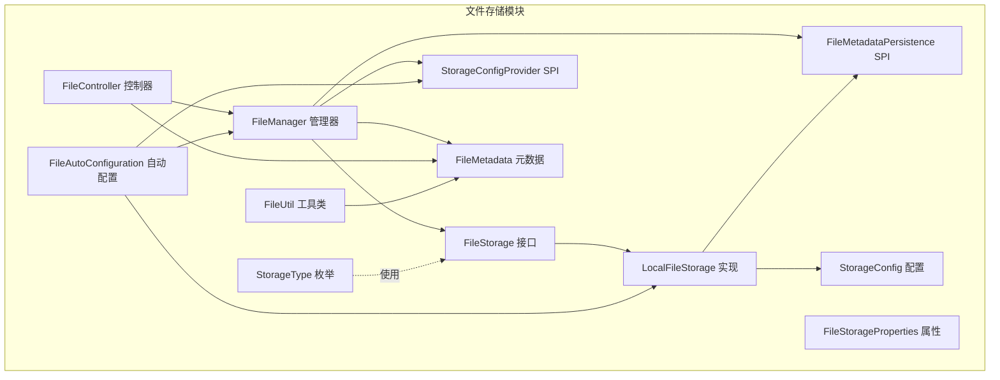
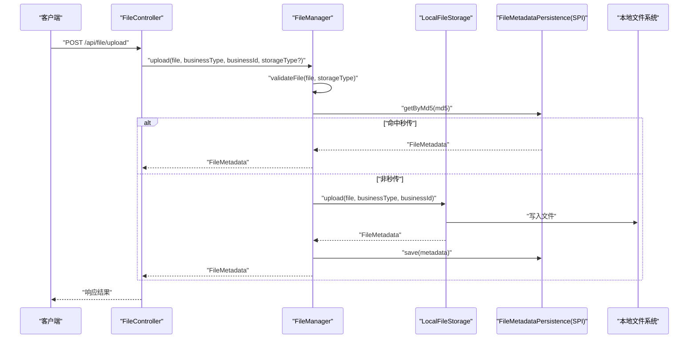
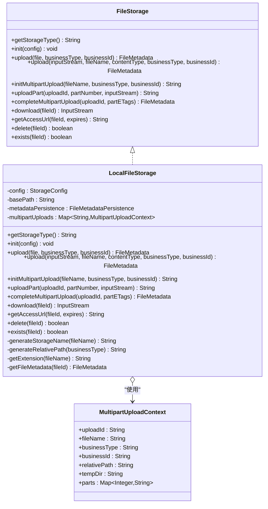
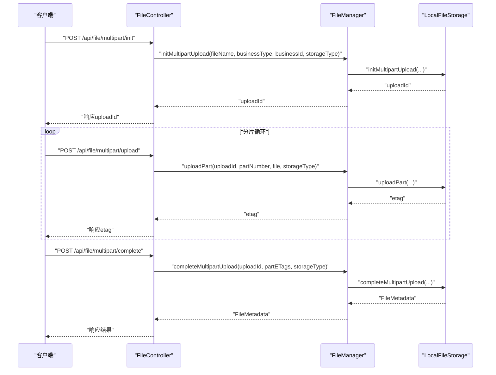
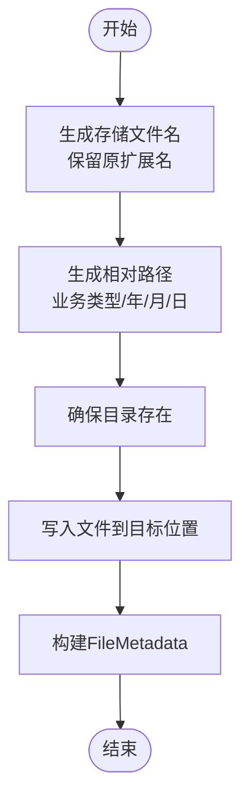
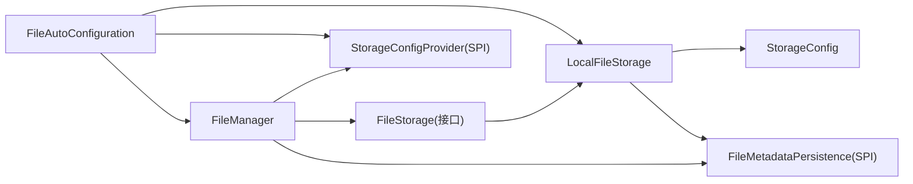

# 文件存储实现

<cite>
**本文引用的文件**
- [LocalFileStorage.java](file://forge/forge-framework/forge-starter-parent/forge-starter-file/src/main/java/com/mdframe/forge/starter/file/storage/impl/LocalFileStorage.java)
- [FileStorage.java](file://forge/forge-framework/forge-starter-parent/forge-starter-file/src/main/java/com/mdframe/forge/starter/file/storage/FileStorage.java)
- [StorageType.java](file://forge/forge-framework/forge-starter-parent/forge-starter-file/src/main/java/com/mdframe/forge/starter/file/enums/StorageType.java)
- [StorageConfig.java](file://forge/forge-framework/forge-starter-parent/forge-starter-file/src/main/java/com/mdframe/forge/starter/file/model/StorageConfig.java)
- [FileMetadata.java](file://forge/forge-framework/forge-starter-parent/forge-starter-file/src/main/java/com/mdframe/forge/starter/file/model/FileMetadata.java)
- [FileMetadataPersistence.java](file://forge/forge-framework/forge-starter-parent/forge-starter-file/src/main/java/com/mdframe/forge/starter/file/spi/FileMetadataPersistence.java)
- [StorageConfigProvider.java](file://forge/forge-framework/forge-starter-parent/forge-starter-file/src/main/java/com/mdframe/forge/starter/file/spi/StorageConfigProvider.java)
- [FileManager.java](file://forge/forge-framework/forge-starter-parent/forge-starter-file/src/main/java/com/mdframe/forge/starter/file/core/FileManager.java)
- [FileAutoConfiguration.java](file://forge/forge-framework/forge-starter-parent/forge-starter-file/src/main/java/com/mdframe/forge/starter/file/config/FileAutoConfiguration.java)
- [FileStorageProperties.java](file://forge/forge-framework/forge-starter-parent/forge-starter-file/src/main/java/com/mdframe/forge/starter/file/config/FileStorageProperties.java)
- [FileController.java](file://forge/forge-framework/forge-starter-parent/forge-starter-file/src/main/java/com/mdframe/forge/starter/file/controller/FileController.java)
- [FileUtil.java](file://forge/forge-framework/forge-starter-parent/forge-starter-file/src/main/java/com/mdframe/forge/starter/file/util/FileUtil.java)
</cite>

## 目录
1. [简介](#简介)
2. [项目结构](#项目结构)
3. [核心组件](#核心组件)
4. [架构总览](#架构总览)
5. [详细组件分析](#详细组件分析)
6. [依赖关系分析](#依赖关系分析)
7. [性能考量](#性能考量)
8. [故障排查指南](#故障排查指南)
9. [结论](#结论)
10. [附录](#附录)

## 简介
本文件聚焦于Forge框架中“本地文件存储”的实现，围绕LocalFileStorage类展开，系统性解析其文件存储逻辑、路径管理与文件操作方法，并阐明FileStorage接口的设计理念、StorageType枚举的定义与使用场景。同时提供本地存储配置要点、文件操作最佳实践以及性能优化建议，帮助开发者在不同规模与场景下正确、高效地使用文件存储能力。

## 项目结构
文件存储子系统位于forge-starter-file模块内，采用“接口抽象 + SPI扩展 + 自动装配”的设计，核心文件如下：
- 接口与抽象：FileStorage、StorageConfigProvider、FileMetadataPersistence
- 实现与模型：LocalFileStorage、StorageConfig、FileMetadata、StorageType
- 控制器与管理器：FileController、FileManager
- 自动配置与属性：FileAutoConfiguration、FileStorageProperties
- 工具类：FileUtil

图表来源
- [FileStorage.java](file://forge/forge-framework/forge-starter-parent/forge-starter-file/src/main/java/com/mdframe/forge/starter/file/storage/FileStorage.java#L1-L110)
- [LocalFileStorage.java](file://forge/forge-framework/forge-starter-parent/forge-starter-file/src/main/java/com/mdframe/forge/starter/file/storage/impl/LocalFileStorage.java#L1-L439)
- [FileMetadataPersistence.java](file://forge/forge-framework/forge-starter-parent/forge-starter-file/src/main/java/com/mdframe/forge/starter/file/spi/FileMetadataPersistence.java#L1-L41)
- [StorageConfigProvider.java](file://forge/forge-framework/forge-starter-parent/forge-starter-file/src/main/java/com/mdframe/forge/starter/file/spi/StorageConfigProvider.java#L1-L33)
- [FileManager.java](file://forge/forge-framework/forge-starter-parent/forge-starter-file/src/main/java/com/mdframe/forge/starter/file/core/FileManager.java#L1-L255)
- [FileController.java](file://forge/forge-framework/forge-starter-parent/forge-starter-file/src/main/java/com/mdframe/forge/starter/file/controller/FileController.java#L1-L117)
- [StorageConfig.java](file://forge/forge-framework/forge-starter-parent/forge-starter-file/src/main/java/com/mdframe/forge/starter/file/model/StorageConfig.java#L1-L109)
- [FileMetadata.java](file://forge/forge-framework/forge-starter-parent/forge-starter-file/src/main/java/com/mdframe/forge/starter/file/model/FileMetadata.java#L1-L110)
- [StorageType.java](file://forge/forge-framework/forge-starter-parent/forge-starter-file/src/main/java/com/mdframe/forge/starter/file/enums/StorageType.java#L1-L50)
- [FileAutoConfiguration.java](file://forge/forge-framework/forge-starter-parent/forge-starter-file/src/main/java/com/mdframe/forge/starter/file/config/FileAutoConfiguration.java#L1-L77)
- [FileStorageProperties.java](file://forge/forge-framework/forge-starter-parent/forge-starter-file/src/main/java/com/mdframe/forge/starter/file/config/FileStorageProperties.java#L1-L25)
- [FileUtil.java](file://forge/forge-framework/forge-starter-parent/forge-starter-file/src/main/java/com/mdframe/forge/starter/file/util/FileUtil.java#L1-L130)

章节来源
- [FileAutoConfiguration.java](file://forge/forge-framework/forge-starter-parent/forge-starter-file/src/main/java/com/mdframe/forge/starter/file/config/FileAutoConfiguration.java#L1-L77)
- [FileController.java](file://forge/forge-framework/forge-starter-parent/forge-starter-file/src/main/java/com/mdframe/forge/starter/file/controller/FileController.java#L1-L117)

## 核心组件
- FileStorage接口：定义统一的文件存储策略抽象，包括上传、下载、分片上传、URL生成、删除、存在性检查等方法，便于扩展多种存储后端。
- LocalFileStorage实现：基于本地文件系统的具体实现，负责将文件写入磁盘、维护分片上传上下文、生成访问URL等。
- FileManager管理器：面向上层的统一入口，负责注册存储策略、执行文件操作、调用SPI进行元数据持久化与配置校验。
- StorageConfig模型：封装存储配置（如基础路径、域名、最大文件大小、允许类型等），用于驱动LocalFileStorage的行为。
- FileMetadata模型：描述文件元数据（ID、原始名、存储名、路径、大小、MIME、扩展名、业务类型/ID、上传时间、是否私有、下载计数等）。
- StorageType枚举：定义可用的存储类型（本地、MinIO、阿里云OSS、腾讯云COS、七牛云），提供从编码到类型的转换。
- FileMetadataPersistence与StorageConfigProvider：SPI接口，分别负责元数据持久化与存储配置提供，使系统可插拔地接入数据库或外部配置中心。
- FileAutoConfiguration与FileStorageProperties：自动装配与属性绑定，负责注册存储策略、初始化配置并暴露默认存储类型与通用API开关。

章节来源
- [FileStorage.java](file://forge/forge-framework/forge-starter-parent/forge-starter-file/src/main/java/com/mdframe/forge/starter/file/storage/FileStorage.java#L1-L110)
- [LocalFileStorage.java](file://forge/forge-framework/forge-starter-parent/forge-starter-file/src/main/java/com/mdframe/forge/starter/file/storage/impl/LocalFileStorage.java#L1-L439)
- [FileManager.java](file://forge/forge-framework/forge-starter-parent/forge-starter-file/src/main/java/com/mdframe/forge/starter/file/core/FileManager.java#L1-L255)
- [StorageConfig.java](file://forge/forge-framework/forge-starter-parent/forge-starter-file/src/main/java/com/mdframe/forge/starter/file/model/StorageConfig.java#L1-L109)
- [FileMetadata.java](file://forge/forge-framework/forge-starter-parent/forge-starter-file/src/main/java/com/mdframe/forge/starter/file/model/FileMetadata.java#L1-L110)
- [StorageType.java](file://forge/forge-framework/forge-starter-parent/forge-starter-file/src/main/java/com/mdframe/forge/starter/file/enums/StorageType.java#L1-L50)
- [FileMetadataPersistence.java](file://forge/forge-framework/forge-starter-parent/forge-starter-file/src/main/java/com/mdframe/forge/starter/file/spi/FileMetadataPersistence.java#L1-L41)
- [StorageConfigProvider.java](file://forge/forge-framework/forge-starter-parent/forge-starter-file/src/main/java/com/mdframe/forge/starter/file/spi/StorageConfigProvider.java#L1-L33)
- [FileAutoConfiguration.java](file://forge/forge-framework/forge-starter-parent/forge-starter-file/src/main/java/com/mdframe/forge/starter/file/config/FileAutoConfiguration.java#L1-L77)
- [FileStorageProperties.java](file://forge/forge-framework/forge-starter-parent/forge-starter-file/src/main/java/com/mdframe/forge/starter/file/config/FileStorageProperties.java#L1-L25)

## 架构总览
本地文件存储通过FileStorage接口抽象，LocalFileStorage实现具体逻辑；FileManager作为门面协调上传、下载、删除、URL生成与分片上传流程；FileController对外提供REST API；FileAutoConfiguration负责自动装配与初始化；StorageConfig与FileMetadata等模型贯穿整个流程。

图表来源
- [FileController.java](file://forge/forge-framework/forge-starter-parent/forge-starter-file/src/main/java/com/mdframe/forge/starter/file/controller/FileController.java#L1-L117)
- [FileManager.java](file://forge/forge-framework/forge-starter-parent/forge-starter-file/src/main/java/com/mdframe/forge/starter/file/core/FileManager.java#L1-L255)
- [LocalFileStorage.java](file://forge/forge-framework/forge-starter-parent/forge-starter-file/src/main/java/com/mdframe/forge/starter/file/storage/impl/LocalFileStorage.java#L1-L439)
- [FileMetadataPersistence.java](file://forge/forge-framework/forge-starter-parent/forge-starter-file/src/main/java/com/mdframe/forge/starter/file/spi/FileMetadataPersistence.java#L1-L41)

## 详细组件分析

### LocalFileStorage 类分析
LocalFileStorage实现了FileStorage接口，提供本地文件系统存储的核心能力：
- 存储类型标识：常量STORAGE_TYPE为"local"，用于与FileManager注册/选择策略。
- 基础路径与初始化：优先使用配置中的basePath，若为空则回退到用户主目录下的默认路径；确保基础目录存在。
- 文件上传：
  - 支持MultipartFile与InputStream两种输入源；
  - 生成存储文件名（保留原扩展名）、按业务类型+日期生成相对路径；
  - 确保目标目录存在后写入文件，构建FileMetadata并返回。
- 分片上传：
  - initMultipartUpload：生成uploadId，创建临时目录，记录上下文；
  - uploadPart：保存分片文件，记录分片映射；
  - completeMultipartUpload：合并分片至最终文件，清理临时目录，构建FileMetadata。
- 下载与URL：
  - download：根据元数据定位文件并返回InputStream；
  - getAccessUrl：在配置了domain时返回完整URL，否则返回相对路径供控制器拼接。
- 删除与存在性检查：删除物理文件并返回结果；存在性检查基于文件系统。
- 元数据获取：通过FileMetadataPersistence SPI按fileId获取元数据。

图表来源
- [FileStorage.java](file://forge/forge-framework/forge-starter-parent/forge-starter-file/src/main/java/com/mdframe/forge/starter/file/storage/FileStorage.java#L1-L110)
- [LocalFileStorage.java](file://forge/forge-framework/forge-starter-parent/forge-starter-file/src/main/java/com/mdframe/forge/starter/file/storage/impl/LocalFileStorage.java#L1-L439)

章节来源
- [LocalFileStorage.java](file://forge/forge-framework/forge-starter-parent/forge-starter-file/src/main/java/com/mdframe/forge/starter/file/storage/impl/LocalFileStorage.java#L1-L439)

### FileStorage 接口与存储策略抽象
FileStorage接口定义了统一的文件存储策略契约，包括：
- 基础能力：初始化、上传、下载、删除、存在性检查；
- URL能力：生成访问URL（可带过期时间）；
- 分片能力：初始化、上传分片、完成合并；
- 适配多后端：通过getStorageType区分不同实现（如local/minio/oss/cos/qiniu）。

该抽象使得FileManager无需关心具体存储实现，只需按策略类型路由到对应FileStorage实例。

章节来源
- [FileStorage.java](file://forge/forge-framework/forge-starter-parent/forge-starter-file/src/main/java/com/mdframe/forge/starter/file/storage/FileStorage.java#L1-L110)

### StorageType 枚举与使用场景
StorageType枚举定义了系统支持的存储类型及其编码与描述：
- LOCAL("local", "本地存储")
- MINIO("minio", "MinIO存储")
- ALIYUN_OSS("aliyun_oss", "阿里云OSS")
- TENCENT_COS("tencent_cos", "腾讯云COS")
- QINIU("qiniu", "七牛云存储")

提供fromCode静态方法，便于根据配置中的编码解析到具体类型，默认回退到LOCAL。

章节来源
- [StorageType.java](file://forge/forge-framework/forge-starter-parent/forge-starter-file/src/main/java/com/mdframe/forge/starter/file/enums/StorageType.java#L1-L50)

### FileManager 统一管理器
FileManager是文件操作的统一入口，职责包括：
- 注册与选择存储策略；
- 上传：文件验证、秒传检查、调用具体存储实现、持久化元数据；
- 下载：根据元数据设置响应头并输出文件流，更新下载计数；
- URL生成：委托具体存储策略生成访问URL；
- 删除：先删除物理文件，再删除元数据；
- 分片上传：委派给具体存储策略并持久化最终元数据。

章节来源
- [FileManager.java](file://forge/forge-framework/forge-starter-parent/forge-starter-file/src/main/java/com/mdframe/forge/starter/file/core/FileManager.java#L1-L255)

### FileController 通用API
FileController提供通用REST接口：
- 上传、下载、获取URL、删除、分片上传初始化/上传/完成；
- 受属性开关控制，默认启用通用API；
- 参数支持业务类型、业务ID、存储类型等。

章节来源
- [FileController.java](file://forge/forge-framework/forge-starter-parent/forge-starter-file/src/main/java/com/mdframe/forge/starter/file/controller/FileController.java#L1-L117)

### 自动配置与属性
FileAutoConfiguration负责：
- 注册FileManager与LocalFileStorage Bean；
- 扫描并注册所有FileStorage实现；
- 从StorageConfigProvider加载启用的配置并逐个初始化存储策略。

FileStorageProperties提供：
- enableGenericApi：是否启用通用文件API；
- defaultStorageType：默认存储类型（默认local）。

章节来源
- [FileAutoConfiguration.java](file://forge/forge-framework/forge-starter-parent/forge-starter-file/src/main/java/com/mdframe/forge/starter/file/config/FileAutoConfiguration.java#L1-L77)
- [FileStorageProperties.java](file://forge/forge-framework/forge-starter-parent/forge-starter-file/src/main/java/com/mdframe/forge/starter/file/config/FileStorageProperties.java#L1-L25)

### 分片上传流程（序列图）

图表来源
- [FileController.java](file://forge/forge-framework/forge-starter-parent/forge-starter-file/src/main/java/com/mdframe/forge/starter/file/controller/FileController.java#L1-L117)
- [FileManager.java](file://forge/forge-framework/forge-starter-parent/forge-starter-file/src/main/java/com/mdframe/forge/starter/file/core/FileManager.java#L1-L255)
- [LocalFileStorage.java](file://forge/forge-framework/forge-starter-parent/forge-starter-file/src/main/java/com/mdframe/forge/starter/file/storage/impl/LocalFileStorage.java#L1-L439)

### 本地存储路径与文件名生成（流程图）

图表来源
- [LocalFileStorage.java](file://forge/forge-framework/forge-starter-parent/forge-starter-file/src/main/java/com/mdframe/forge/starter/file/storage/impl/LocalFileStorage.java#L1-L439)

## 依赖关系分析
- 组件耦合与内聚：
  - FileManager对FileStorage采用策略模式解耦，对SPI（FileMetadataPersistence、StorageConfigProvider）采用弱依赖，便于替换与扩展。
  - LocalFileStorage内部持有FileMetadataPersistence（可选），用于秒传与元数据持久化。
- 外部依赖：
  - 使用Hutool工具进行文件复制与目录删除；
  - Spring Web用于MultipartFile处理与HTTP响应；
  - Spring Boot自动装配与条件注解控制组件注册与启用。

图表来源
- [FileManager.java](file://forge/forge-framework/forge-starter-parent/forge-starter-file/src/main/java/com/mdframe/forge/starter/file/core/FileManager.java#L1-L255)
- [LocalFileStorage.java](file://forge/forge-framework/forge-starter-parent/forge-starter-file/src/main/java/com/mdframe/forge/starter/file/storage/impl/LocalFileStorage.java#L1-L439)
- [FileAutoConfiguration.java](file://forge/forge-framework/forge-starter-parent/forge-starter-file/src/main/java/com/mdframe/forge/starter/file/config/FileAutoConfiguration.java#L1-L77)

章节来源
- [FileManager.java](file://forge/forge-framework/forge-starter-parent/forge-starter-file/src/main/java/com/mdframe/forge/starter/file/core/FileManager.java#L1-L255)
- [LocalFileStorage.java](file://forge/forge-framework/forge-starter-parent/forge-starter-file/src/main/java/com/mdframe/forge/starter/file/storage/impl/LocalFileStorage.java#L1-L439)
- [FileAutoConfiguration.java](file://forge/forge-framework/forge-starter-parent/forge-starter-file/src/main/java/com/mdframe/forge/starter/file/config/FileAutoConfiguration.java#L1-L77)

## 性能考量
- IO与缓冲：
  - 合并分片时使用固定缓冲区（如8KB）顺序写出，避免一次性读取大文件导致内存压力。
- 目录与命名：
  - 按业务类型与日期分组存放，有助于后续清理与统计；建议定期归档或清理历史目录。
- 元数据与秒传：
  - 通过MD5命中重复文件，减少IO与网络传输；结合FileMetadataPersistence可显著降低重复上传成本。
- 并发与锁：
  - 分片上传上下文使用并发Map，注意在高并发场景下对同一uploadId的并发控制（例如在应用层加分布式锁）。
- 磁盘与容量：
  - 建议监控basePath所在分区的剩余空间，设置合理的最大文件大小与类型白名单，防止磁盘打满。
- URL与代理：
  - 本地存储返回相对URL，建议在网关或反向代理层提供静态资源加速与缓存策略。

## 故障排查指南
- 上传失败：
  - 检查basePath是否存在且具备写权限；确认目录创建逻辑与异常抛出点。
  - 若启用文件大小/类型校验，确认StorageConfig配置是否正确。
- 分片上传异常：
  - 核对uploadId有效性与临时目录状态；确认各分片文件是否成功落盘。
- 下载失败：
  - 确认FileMetadata是否存在且filePath有效；检查文件系统中文件是否被意外删除。
- URL不可用：
  - 若配置了domain，请确认网关/反向代理已正确转发至下载接口。
- 删除失败：
  - 检查文件是否存在与权限；日志中会记录删除结果。

章节来源
- [LocalFileStorage.java](file://forge/forge-framework/forge-starter-parent/forge-starter-file/src/main/java/com/mdframe/forge/starter/file/storage/impl/LocalFileStorage.java#L1-L439)
- [FileManager.java](file://forge/forge-framework/forge-starter-parent/forge-starter-file/src/main/java/com/mdframe/forge/starter/file/core/FileManager.java#L1-L255)

## 结论
LocalFileStorage通过清晰的接口抽象与完善的分片上传机制，提供了稳定可靠的本地文件存储能力。结合FileManager的统一调度、SPI的可插拔特性与自动配置的便捷装配，系统在开发与运维层面均具备良好体验。建议在生产环境中配合合适的磁盘策略、容量监控与代理缓存，以获得更优的性能与可靠性。

## 附录

### 本地存储配置示例（YAML风格）
- 基础路径：用于存放上传文件的根目录
- 域名：用于生成可访问URL（可选）
- 最大文件大小：单位MB
- 允许的文件类型：逗号分隔的扩展名列表
- 是否默认策略：是否作为默认存储类型
- 是否启用：是否生效

章节来源
- [StorageConfig.java](file://forge/forge-framework/forge-starter-parent/forge-starter-file/src/main/java/com/mdframe/forge/starter/file/model/StorageConfig.java#L1-L109)

### 文件操作最佳实践
- 上传前校验：利用FileManager.validateFile进行大小与类型校验，避免无效请求进入存储层。
- 秒传优化：开启FileMetadataPersistence后，系统自动进行MD5秒传，显著提升重复上传效率。
- 分片上传：大文件优先使用分片上传，合理设置分片大小与并发度。
- 下载与URL：下载接口自动设置Content-Disposition与MIME类型；URL生成需配合网关/反向代理。
- 删除策略：删除文件后同步删除元数据，保持一致性。

章节来源
- [FileManager.java](file://forge/forge-framework/forge-starter-parent/forge-starter-file/src/main/java/com/mdframe/forge/starter/file/core/FileManager.java#L1-L255)
- [FileController.java](file://forge/forge-framework/forge-starter-parent/forge-starter-file/src/main/java/com/mdframe/forge/starter/file/controller/FileController.java#L1-L117)