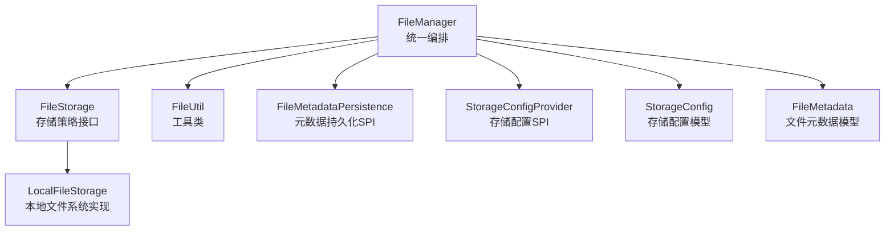
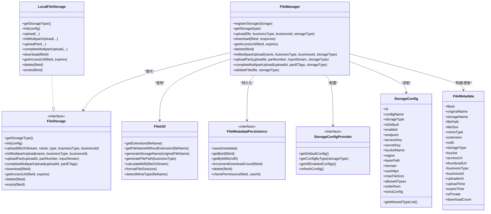
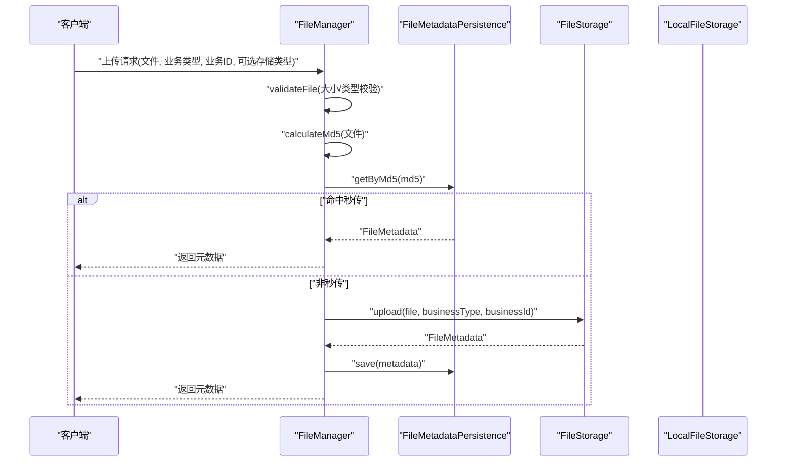
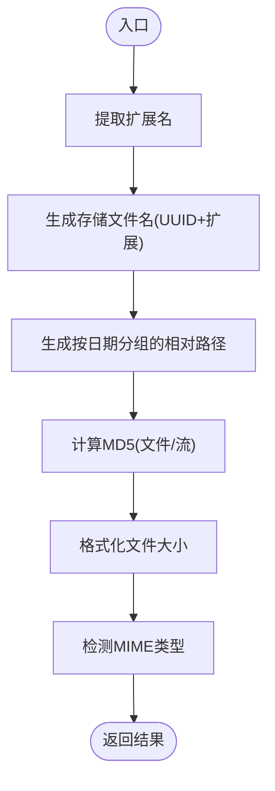
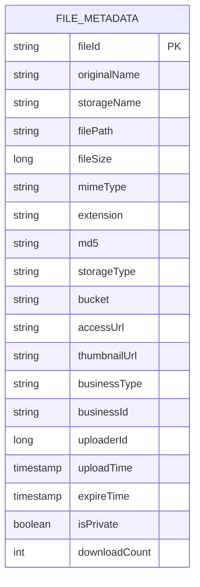
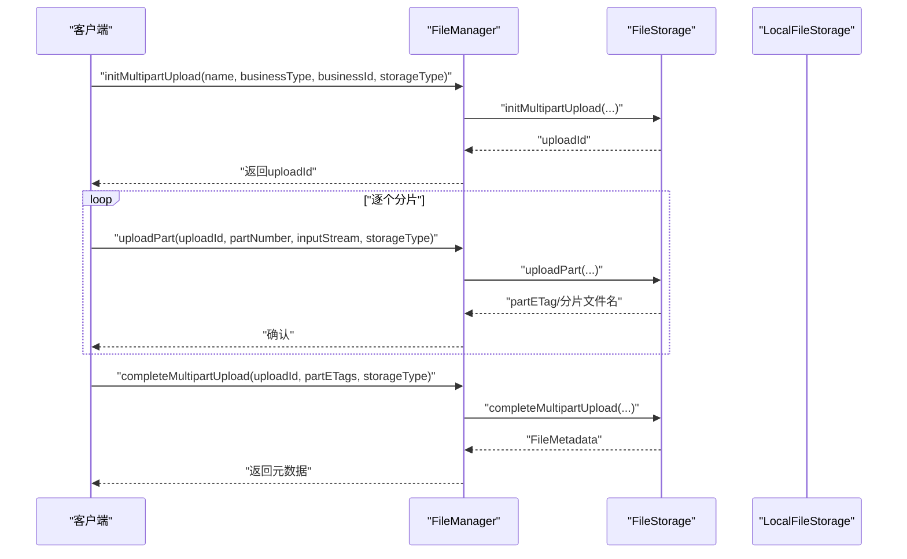
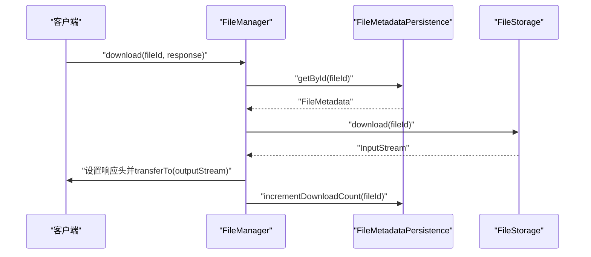
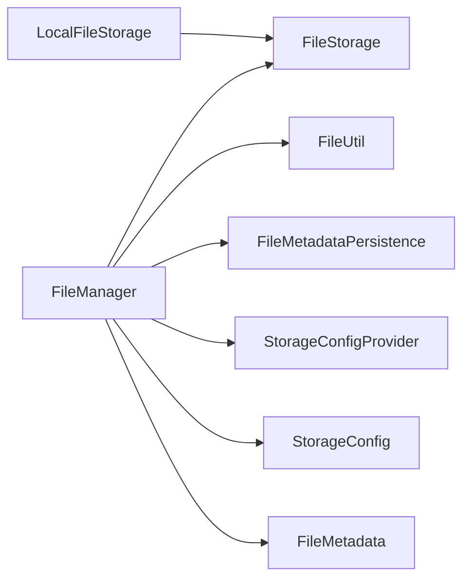

# 文件管理器核心

<cite>
**本文引用的文件**
- [FileManager.java](file://forge/forge-framework/forge-starter-parent/forge-starter-file/src/main/java/com/mdframe/forge/starter/file/core/FileManager.java)
- [FileUtil.java](file://forge/forge-framework/forge-starter-parent/forge-starter-file/src/main/java/com/mdframe/forge/starter/file/util/FileUtil.java)
- [FileMetadata.java](file://forge/forge-framework/forge-starter-parent/forge-starter-file/src/main/java/com/mdframe/forge/starter/file/model/FileMetadata.java)
- [FileStorage.java](file://forge/forge-framework/forge-starter-parent/forge-starter-file/src/main/java/com/mdframe/forge/starter/file/storage/FileStorage.java)
- [LocalFileStorage.java](file://forge/forge-framework/forge-starter-parent/forge-starter-file/src/main/java/com/mdframe/forge/starter/file/storage/impl/LocalFileStorage.java)
- [StorageConfig.java](file://forge/forge-framework/forge-starter-parent/forge-starter-file/src/main/java/com/mdframe/forge/starter/file/model/StorageConfig.java)
- [StorageConfigProvider.java](file://forge/forge-framework/forge-starter-parent/forge-starter-file/src/main/java/com/mdframe/forge/starter/file/spi/StorageConfigProvider.java)
- [FileMetadataPersistence.java](file://forge/forge-framework/forge-starter-parent/forge-starter-file/src/main/java/com/mdframe/forge/starter/file/spi/FileMetadataPersistence.java)
</cite>

## 目录
1. [简介](#简介)
2. [项目结构](#项目结构)
3. [核心组件](#核心组件)
4. [架构总览](#架构总览)
5. [详细组件分析](#详细组件分析)
6. [依赖关系分析](#依赖关系分析)
7. [性能考量](#性能考量)
8. [故障排查指南](#故障排查指南)
9. [结论](#结论)
10. [附录](#附录)

## 简介
本文件面向Forge文件管理器核心功能，围绕FileManager类的统一上传、下载、删除、分片上传与批量操作能力进行深入技术解析；同时阐述FileUtil工具类的实用方法、FileMetadata数据模型的字段语义，并给出使用示例、错误处理机制与性能优化策略，帮助开发者快速理解并高效集成文件管理能力。

## 项目结构
文件管理器位于“starter-file”模块中，采用“接口 + SPI + 默认实现”的分层设计：
- 核心编排：FileManager 负责统一调度、参数校验、元数据持久化与下载计数更新
- 存储策略：FileStorage 接口定义存储抽象，LocalFileStorage 提供本地文件系统实现
- 工具与模型：FileUtil 提供文件名、扩展名、MD5、MIME检测等工具；FileMetadata 描述文件元数据
- 配置与持久化：StorageConfigProvider 与 FileMetadataPersistence 通过SPI注入，分别提供存储配置与元数据持久化能力

图表来源
- [FileManager.java](file://forge/forge-framework/forge-starter-parent/forge-starter-file/src/main/java/com/mdframe/forge/starter/file/core/FileManager.java#L30-L99)
- [FileStorage.java](file://forge/forge-framework/forge-starter-parent/forge-starter-file/src/main/java/com/mdframe/forge/starter/file/storage/FileStorage.java#L13-L109)
- [LocalFileStorage.java](file://forge/forge-framework/forge-starter-parent/forge-starter-file/src/main/java/com/mdframe/forge/starter/file/storage/impl/LocalFileStorage.java#L27-L69)
- [FileUtil.java](file://forge/forge-framework/forge-starter-parent/forge-starter-file/src/main/java/com/mdframe/forge/starter/file/util/FileUtil.java#L16-L129)
- [FileMetadataPersistence.java](file://forge/forge-framework/forge-starter-parent/forge-starter-file/src/main/java/com/mdframe/forge/starter/file/spi/FileMetadataPersistence.java#L9-L40)
- [StorageConfigProvider.java](file://forge/forge-framework/forge-starter-parent/forge-starter-file/src/main/java/com/mdframe/forge/starter/file/spi/StorageConfigProvider.java#L11-L32)
- [StorageConfig.java](file://forge/forge-framework/forge-starter-parent/forge-starter-file/src/main/java/com/mdframe/forge/starter/file/model/StorageConfig.java#L12-L108)
- [FileMetadata.java](file://forge/forge-framework/forge-starter-parent/forge-starter-file/src/main/java/com/mdframe/forge/starter/file/model/FileMetadata.java#L13-L109)

章节来源
- [FileManager.java](file://forge/forge-framework/forge-starter-parent/forge-starter-file/src/main/java/com/mdframe/forge/starter/file/core/FileManager.java#L30-L99)
- [FileStorage.java](file://forge/forge-framework/forge-starter-parent/forge-starter-file/src/main/java/com/mdframe/forge/starter/file/storage/FileStorage.java#L13-L109)
- [LocalFileStorage.java](file://forge/forge-framework/forge-starter-parent/forge-starter-file/src/main/java/com/mdframe/forge/starter/file/storage/impl/LocalFileStorage.java#L27-L69)
- [FileUtil.java](file://forge/forge-framework/forge-starter-parent/forge-starter-file/src/main/java/com/mdframe/forge/starter/file/util/FileUtil.java#L16-L129)
- [FileMetadataPersistence.java](file://forge/forge-framework/forge-starter-parent/forge-starter-file/src/main/java/com/mdframe/forge/starter/file/spi/FileMetadataPersistence.java#L9-L40)
- [StorageConfigProvider.java](file://forge/forge-framework/forge-starter-parent/forge-starter-file/src/main/java/com/mdframe/forge/starter/file/spi/StorageConfigProvider.java#L11-L32)
- [StorageConfig.java](file://forge/forge-framework/forge-starter-parent/forge-starter-file/src/main/java/com/mdframe/forge/starter/file/model/StorageConfig.java#L12-L108)
- [FileMetadata.java](file://forge/forge-framework/forge-starter-parent/forge-starter-file/src/main/java/com/mdframe/forge/starter/file/model/FileMetadata.java#L13-L109)

## 核心组件
- FileManager：统一编排上传、下载、删除、分片上传、URL生成与权限校验；内置秒传逻辑（基于MD5）；对存储策略进行注册与选择；对下载次数进行原子性更新
- FileUtil：提供扩展名提取、无扩展名文件名、存储名生成、按日期分组的存储路径、MD5计算、文件大小格式化、MIME类型检测等工具方法
- FileMetadata：描述文件元数据，包含文件标识、原始名、存储名、路径、大小、MIME、扩展名、MD5、存储类型、桶/命名空间、访问URL、缩略图URL、业务类型/ID、上传者ID、上传时间、过期时间、是否私有、下载次数等
- FileStorage：存储策略接口，定义上传、下载、分片上传、URL生成、删除、存在性检查等标准能力
- LocalFileStorage：本地文件系统存储实现，负责将文件写入磁盘、生成存储名与相对路径、分片上传的临时目录管理、合并分片、删除文件、判断存在性
- StorageConfigProvider / StorageConfig：存储配置SPI与配置模型，用于提供默认或按类型获取的存储配置（如最大文件大小、允许类型、端点、桶、域名等）
- FileMetadataPersistence：元数据持久化SPI，负责保存、查询、按MD5秒传、增量下载计数、删除与权限校验

章节来源
- [FileManager.java](file://forge/forge-framework/forge-starter-parent/forge-starter-file/src/main/java/com/mdframe/forge/starter/file/core/FileManager.java#L30-L99)
- [FileUtil.java](file://forge/forge-framework/forge-starter-parent/forge-starter-file/src/main/java/com/mdframe/forge/starter/file/util/FileUtil.java#L16-L129)
- [FileMetadata.java](file://forge/forge-framework/forge-starter-parent/forge-starter-file/src/main/java/com/mdframe/forge/starter/file/model/FileMetadata.java#L13-L109)
- [FileStorage.java](file://forge/forge-framework/forge-starter-parent/forge-starter-file/src/main/java/com/mdframe/forge/starter/file/storage/FileStorage.java#L13-L109)
- [LocalFileStorage.java](file://forge/forge-framework/forge-starter-parent/forge-starter-file/src/main/java/com/mdframe/forge/starter/file/storage/impl/LocalFileStorage.java#L27-L69)
- [StorageConfigProvider.java](file://forge/forge-framework/forge-starter-parent/forge-starter-file/src/main/java/com/mdframe/forge/starter/file/spi/StorageConfigProvider.java#L11-L32)
- [StorageConfig.java](file://forge/forge-framework/forge-starter-parent/forge-starter-file/src/main/java/com/mdframe/forge/starter/file/model/StorageConfig.java#L12-L108)
- [FileMetadataPersistence.java](file://forge/forge-framework/forge-starter-parent/forge-starter-file/src/main/java/com/mdframe/forge/starter/file/spi/FileMetadataPersistence.java#L9-L40)

## 架构总览
文件管理器采用“策略 + SPI + 编排”的架构模式：
- FileManager 作为门面，负责输入校验、秒传判定、存储策略选择、元数据持久化与下载计数更新
- FileStorage 抽象不同存储后端（本地、对象存储等），LocalFileStorage 为默认实现
- FileUtil 提供通用文件处理工具
- StorageConfigProvider 与 FileMetadataPersistence 通过SPI注入，便于业务模块自定义配置与持久化

图表来源
- [FileManager.java](file://forge/forge-framework/forge-starter-parent/forge-starter-file/src/main/java/com/mdframe/forge/starter/file/core/FileManager.java#L30-L99)
- [FileStorage.java](file://forge/forge-framework/forge-starter-parent/forge-starter-file/src/main/java/com/mdframe/forge/starter/file/storage/FileStorage.java#L13-L109)
- [LocalFileStorage.java](file://forge/forge-framework/forge-starter-parent/forge-starter-file/src/main/java/com/mdframe/forge/starter/file/storage/impl/LocalFileStorage.java#L27-L69)
- [FileUtil.java](file://forge/forge-framework/forge-starter-parent/forge-starter-file/src/main/java/com/mdframe/forge/starter/file/util/FileUtil.java#L16-L129)
- [FileMetadataPersistence.java](file://forge/forge-framework/forge-starter-parent/forge-starter-file/src/main/java/com/mdframe/forge/starter/file/spi/FileMetadataPersistence.java#L9-L40)
- [StorageConfigProvider.java](file://forge/forge-framework/forge-starter-parent/forge-starter-file/src/main/java/com/mdframe/forge/starter/file/spi/StorageConfigProvider.java#L11-L32)
- [StorageConfig.java](file://forge/forge-framework/forge-starter-parent/forge-starter-file/src/main/java/com/mdframe/forge/starter/file/model/StorageConfig.java#L12-L108)
- [FileMetadata.java](file://forge/forge-framework/forge-starter-parent/forge-starter-file/src/main/java/com/mdframe/forge/starter/file/model/FileMetadata.java#L13-L109)

## 详细组件分析

### FileManager 类：统一编排与核心流程
- 存储策略注册与选择：通过并发映射注册多种存储策略，按类型获取并调用
- 上传流程（含秒传）：校验文件 → 计算MD5 → 若存在相同MD5则直接复用元数据 → 选择存储策略上传 → 回写MD5 → 可选持久化
- 下载流程：根据ID查询元数据 → 选择对应存储策略 → 设置响应头 → 流式传输 → 增量更新下载次数
- URL生成：根据元数据与存储策略生成可访问URL
- 删除流程：根据ID查询元数据 → 调用存储策略删除 → 删除元数据
- 分片上传：初始化上传ID → 上传各分片 → 完成分片合并 → 可选持久化
- 参数校验：依据存储配置限制文件大小与类型

图表来源
- [FileManager.java](file://forge/forge-framework/forge-starter-parent/forge-starter-file/src/main/java/com/mdframe/forge/starter/file/core/FileManager.java#L58-L99)
- [FileUtil.java](file://forge/forge-framework/forge-starter-parent/forge-starter-file/src/main/java/com/mdframe/forge/starter/file/util/FileUtil.java#L62-L92)
- [FileMetadataPersistence.java](file://forge/forge-framework/forge-starter-parent/forge-starter-file/src/main/java/com/mdframe/forge/starter/file/spi/FileMetadataPersistence.java#L23-L24)
- [LocalFileStorage.java](file://forge/forge-framework/forge-starter-parent/forge-starter-file/src/main/java/com/mdframe/forge/starter/file/storage/impl/LocalFileStorage.java#L72-L134)

章节来源
- [FileManager.java](file://forge/forge-framework/forge-starter-parent/forge-starter-file/src/main/java/com/mdframe/forge/starter/file/core/FileManager.java#L58-L99)
- [FileUtil.java](file://forge/forge-framework/forge-starter-parent/forge-starter-file/src/main/java/com/mdframe/forge/starter/file/util/FileUtil.java#L62-L92)
- [FileMetadataPersistence.java](file://forge/forge-framework/forge-starter-parent/forge-starter-file/src/main/java/com/mdframe/forge/starter/file/spi/FileMetadataPersistence.java#L23-L24)
- [LocalFileStorage.java](file://forge/forge-framework/forge-starter-parent/forge-starter-file/src/main/java/com/mdframe/forge/starter/file/storage/impl/LocalFileStorage.java#L72-L134)

### FileUtil 工具类：文件处理辅助
- 扩展名与文件名处理：提取扩展名、去除扩展名
- 存储命名：基于UUID生成安全的存储文件名，保留原扩展名
- 路径生成：按业务类型与日期生成分组路径
- MD5计算：支持MultipartFile与InputStream两种输入
- 文件大小格式化：自动换算B/KB/MB/GB
- MIME类型检测：针对常见扩展名返回标准MIME类型

图表来源
- [FileUtil.java](file://forge/forge-framework/forge-starter-parent/forge-starter-file/src/main/java/com/mdframe/forge/starter/file/util/FileUtil.java#L23-L128)

章节来源
- [FileUtil.java](file://forge/forge-framework/forge-starter-parent/forge-starter-file/src/main/java/com/mdframe/forge/starter/file/util/FileUtil.java#L23-L128)

### FileMetadata 数据模型：字段语义与用途
- 标识与命名：fileId、originalName、storageName、filePath
- 大小与类型：fileSize、mimeType、extension
- 唯一性与溯源：md5、businessType、businessId、uploaderId
- 存储与访问：storageType、bucket、accessUrl、thumbnailUrl
- 时间与生命周期：uploadTime、expireTime、isPrivate、downloadCount

图表来源
- [FileMetadata.java](file://forge/forge-framework/forge-starter-parent/forge-starter-file/src/main/java/com/mdframe/forge/starter/file/model/FileMetadata.java#L13-L109)

章节来源
- [FileMetadata.java](file://forge/forge-framework/forge-starter-parent/forge-starter-file/src/main/java/com/mdframe/forge/starter/file/model/FileMetadata.java#L13-L109)

### 分片上传流程：初始化、上传分片、合并
- 初始化：生成uploadId，准备业务类型与临时目录
- 上传分片：按分片序号保存到临时目录，记录分片文件名
- 完成：合并分片至最终目标文件，清理临时目录，构建元数据

图表来源
- [FileManager.java](file://forge/forge-framework/forge-starter-parent/forge-starter-file/src/main/java/com/mdframe/forge/starter/file/core/FileManager.java#L183-L218)
- [LocalFileStorage.java](file://forge/forge-framework/forge-starter-parent/forge-starter-file/src/main/java/com/mdframe/forge/starter/file/storage/impl/LocalFileStorage.java#L137-L255)

章节来源
- [FileManager.java](file://forge/forge-framework/forge-starter-parent/forge-starter-file/src/main/java/com/mdframe/forge/starter/file/core/FileManager.java#L183-L218)
- [LocalFileStorage.java](file://forge/forge-framework/forge-starter-parent/forge-starter-file/src/main/java/com/mdframe/forge/starter/file/storage/impl/LocalFileStorage.java#L137-L255)

### 下载流程：元数据查询、策略选择、响应输出
- 查询元数据 → 选择存储策略 → 设置响应头（MIME、文件名编码） → 流式传输 → 增量更新下载次数

图表来源
- [FileManager.java](file://forge/forge-framework/forge-starter-parent/forge-starter-file/src/main/java/com/mdframe/forge/starter/file/core/FileManager.java#L104-L135)
- [FileMetadataPersistence.java](file://forge/forge-framework/forge-starter-parent/forge-starter-file/src/main/java/com/mdframe/forge/starter/file/spi/FileMetadataPersistence.java#L29)

章节来源
- [FileManager.java](file://forge/forge-framework/forge-starter-parent/forge-starter-file/src/main/java/com/mdframe/forge/starter/file/core/FileManager.java#L104-L135)
- [FileMetadataPersistence.java](file://forge/forge-framework/forge-starter-parent/forge-starter-file/src/main/java/com/mdframe/forge/starter/file/spi/FileMetadataPersistence.java#L29)

## 依赖关系分析
- FileManager 对 FileStorage、FileUtil、FileMetadataPersistence、StorageConfigProvider、StorageConfig、FileMetadata 存在直接依赖
- LocalFileStorage 实现 FileStorage 接口，内部可依赖 FileMetadataPersistence（可选）
- FileUtil 为纯工具类，无外部依赖
- StorageConfigProvider 与 FileMetadataPersistence 通过SPI注入，降低耦合度

图表来源
- [FileManager.java](file://forge/forge-framework/forge-starter-parent/forge-starter-file/src/main/java/com/mdframe/forge/starter/file/core/FileManager.java#L30-L99)
- [FileStorage.java](file://forge/forge-framework/forge-starter-parent/forge-starter-file/src/main/java/com/mdframe/forge/starter/file/storage/FileStorage.java#L13-L109)
- [LocalFileStorage.java](file://forge/forge-framework/forge-starter-parent/forge-starter-file/src/main/java/com/mdframe/forge/starter/file/storage/impl/LocalFileStorage.java#L27-L69)
- [FileUtil.java](file://forge/forge-framework/forge-starter-parent/forge-starter-file/src/main/java/com/mdframe/forge/starter/file/util/FileUtil.java#L16-L129)
- [FileMetadataPersistence.java](file://forge/forge-framework/forge-starter-parent/forge-starter-file/src/main/java/com/mdframe/forge/starter/file/spi/FileMetadataPersistence.java#L9-L40)
- [StorageConfigProvider.java](file://forge/forge-framework/forge-starter-parent/forge-starter-file/src/main/java/com/mdframe/forge/starter/file/spi/StorageConfigProvider.java#L11-L32)
- [StorageConfig.java](file://forge/forge-framework/forge-starter-parent/forge-starter-file/src/main/java/com/mdframe/forge/starter/file/model/StorageConfig.java#L12-L108)
- [FileMetadata.java](file://forge/forge-framework/forge-starter-parent/forge-starter-file/src/main/java/com/mdframe/forge/starter/file/model/FileMetadata.java#L13-L109)

章节来源
- [FileManager.java](file://forge/forge-framework/forge-starter-parent/forge-starter-file/src/main/java/com/mdframe/forge/starter/file/core/FileManager.java#L30-L99)
- [FileStorage.java](file://forge/forge-framework/forge-starter-parent/forge-starter-file/src/main/java/com/mdframe/forge/starter/file/storage/FileStorage.java#L13-L109)
- [LocalFileStorage.java](file://forge/forge-framework/forge-starter-parent/forge-starter-file/src/main/java/com/mdframe/forge/starter/file/storage/impl/LocalFileStorage.java#L27-L69)
- [FileUtil.java](file://forge/forge-framework/forge-starter-parent/forge-starter-file/src/main/java/com/mdframe/forge/starter/file/util/FileUtil.java#L16-L129)
- [FileMetadataPersistence.java](file://forge/forge-framework/forge-starter-parent/forge-starter-file/src/main/java/com/mdframe/forge/starter/file/spi/FileMetadataPersistence.java#L9-L40)
- [StorageConfigProvider.java](file://forge/forge-framework/forge-starter-parent/forge-starter-file/src/main/java/com/mdframe/forge/starter/file/spi/StorageConfigProvider.java#L11-L32)
- [StorageConfig.java](file://forge/forge-framework/forge-starter-parent/forge-starter-file/src/main/java/com/mdframe/forge/starter/file/model/StorageConfig.java#L12-L108)
- [FileMetadata.java](file://forge/forge-framework/forge-starter-parent/forge-starter-file/src/main/java/com/mdframe/forge/starter/file/model/FileMetadata.java#L13-L109)

## 性能考量
- 秒传优化：通过MD5去重避免重复上传与IO开销
- 流式传输：下载时使用transferTo进行零拷贝式传输，降低内存占用
- 分片上传：支持断点续传与并发分片，提升大文件上传稳定性与速度
- 路径分组：按日期与业务类型分组存储，有利于后续清理与检索
- 配置校验：在上传前进行大小与类型校验，减少无效IO
- 并发安全：存储策略注册表使用并发映射，保证多线程环境下的安全访问

## 故障排查指南
- 未配置存储配置提供者或元数据持久化：在上传/下载/删除等流程中会抛出运行时异常，需确保SPI实现已注入
- 不支持的存储类型：当存储策略未注册或不可用时，会抛出异常；请检查注册流程与类型匹配
- 文件不存在：下载与删除前会查询元数据，若为空则抛出异常；请核对fileId与业务ID
- 文件大小/类型超限：根据StorageConfig中的限制进行校验，超出将抛出异常；请调整配置或文件
- 分片上传异常：无效uploadId或临时目录创建失败会导致异常；请检查初始化与权限
- 删除失败：本地文件不存在或权限不足会导致删除失败；请检查基础路径与权限

章节来源
- [FileManager.java](file://forge/forge-framework/forge-starter-parent/forge-starter-file/src/main/java/com/mdframe/forge/starter/file/core/FileManager.java#L59-L61)
- [FileManager.java](file://forge/forge-framework/forge-starter-parent/forge-starter-file/src/main/java/com/mdframe/forge/starter/file/core/FileManager.java#L86-L88)
- [FileManager.java](file://forge/forge-framework/forge-starter-parent/forge-starter-file/src/main/java/com/mdframe/forge/starter/file/core/FileManager.java#L105-L112)
- [FileManager.java](file://forge/forge-framework/forge-starter-parent/forge-starter-file/src/main/java/com/mdframe/forge/starter/file/core/FileManager.java#L161-L169)
- [FileManager.java](file://forge/forge-framework/forge-starter-parent/forge-starter-file/src/main/java/com/mdframe/forge/starter/file/core/FileManager.java#L185-L187)
- [LocalFileStorage.java](file://forge/forge-framework/forge-starter-parent/forge-starter-file/src/main/java/com/mdframe/forge/starter/file/storage/impl/LocalFileStorage.java#L149-L156)
- [LocalFileStorage.java](file://forge/forge-framework/forge-starter-parent/forge-starter-file/src/main/java/com/mdframe/forge/starter/file/storage/impl/LocalFileStorage.java#L295-L316)

## 结论
FileManager以清晰的职责划分与SPI解耦，实现了统一的文件管理能力；结合FileUtil的实用工具与FileMetadata的完整元数据模型，既满足日常上传下载需求，又具备秒传、分片上传、URL生成与权限校验等高级特性。通过合理的配置与持久化策略，可在保证性能的同时提升系统的可维护性与扩展性。

## 附录
- 使用示例（步骤说明）
  - 上传文件：调用FileManager.upload(file, businessType, businessId[, storageType])，若命中秒传则直接返回元数据
  - 下载文件：调用FileManager.download(fileId, response)，服务端自动设置响应头并流式输出
  - 获取访问URL：调用FileManager.getAccessUrl(fileId, expires)，返回可访问链接
  - 删除文件：调用FileManager.delete(fileId)，先删除存储再删除元数据
  - 分片上传：先initMultipartUpload获取uploadId，循环uploadPart上传各分片，最后completeMultipartUpload合并
- 错误处理建议
  - 在控制器层捕获运行时异常并返回标准化错误码
  - 对于文件大小/类型校验失败，返回明确的提示信息
  - 对于权限校验失败，返回403或相应状态码
- 性能优化建议
  - 启用秒传与分片上传，合理设置分片大小
  - 使用流式传输与合适的缓冲区大小
  - 将热点文件置于SSD或缓存层
  - 定期清理过期文件与临时分片目录