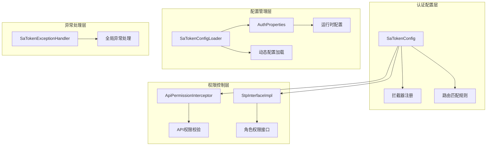
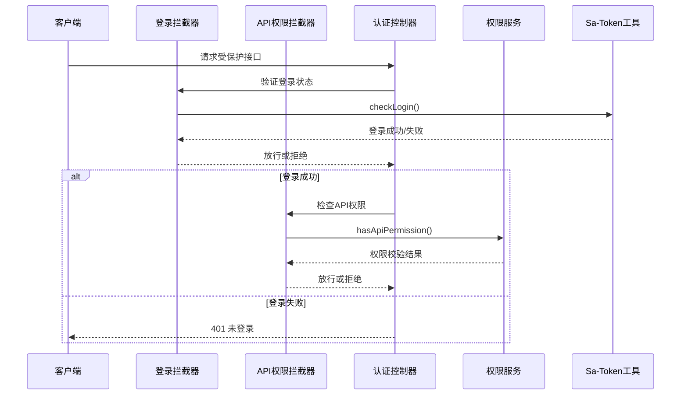
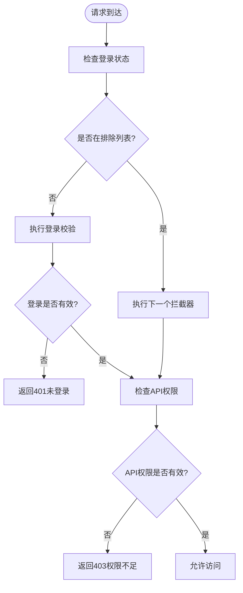
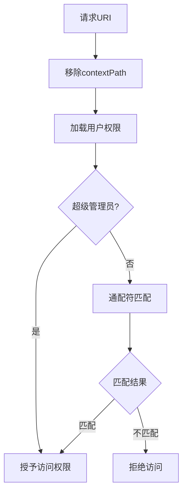
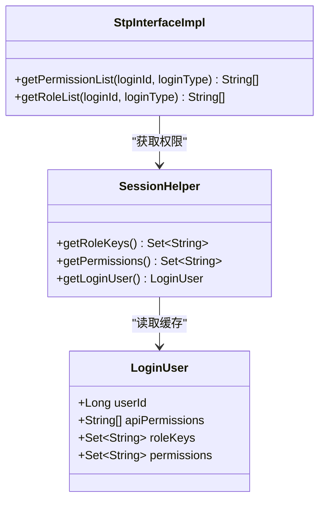
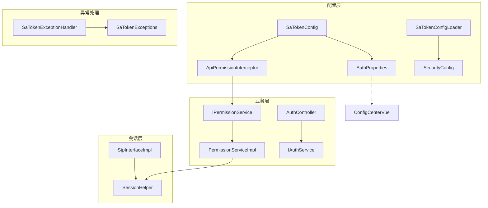

# Sa-Token集成配置

<cite>
**本文档引用的文件**
- [SaTokenConfig.java](file://forge/forge-framework/forge-starter-parent/forge-starter-auth/src/main/java/com/mdframe/forge/starter/auth/config/SaTokenConfig.java)
- [SaTokenConfigLoader.java](file://forge/forge-framework/forge-starter-parent/forge-starter-auth/src/main/java/com/mdframe/forge/starter/auth/config/SaTokenConfigLoader.java)
- [StpInterfaceImpl.java](file://forge/forge-framework/forge-starter-parent/forge-starter-auth/src/main/java/com/mdframe/forge/starter/auth/config/StpInterfaceImpl.java)
- [ApiPermissionInterceptor.java](file://forge/forge-framework/forge-starter-parent/forge-starter-auth/src/main/java/com/mdframe/forge/starter/auth/interceptor/ApiPermissionInterceptor.java)
- [AuthProperties.java](file://forge/forge-framework/forge-starter-parent/forge-starter-core/src/main/java/com/mdframe/forge/starter/core/context/AuthProperties.java)
- [IPermissionService.java](file://forge/forge-framework/forge-starter-parent/forge-starter-auth/src/main/java/com/mdframe/forge/starter/auth/service/IPermissionService.java)
- [PermissionServiceImpl.java](file://forge/forge-framework/forge-plugin-parent/forge-plugin-system/src/main/java/com/mdframe/forge/plugin/system/service/impl/PermissionServiceImpl.java)
- [SaTokenExceptionHandler.java](file://forge/forge-framework/forge-starter-parent/forge-starter-auth/src/main/java/com/mdframe/forge/starter/auth/exception/SaTokenExceptionHandler.java)
- [AuthController.java](file://forge/forge-framework/forge-starter-parent/forge-starter-auth/src/main/java/com/mdframe/forge/starter/auth/controller/AuthController.java)
- [SecurityConfig.java](file://forge/forge-framework/forge-starter-parent/forge-starter-config/src/main/java/com/mdframe/forge/starter/config/config/SecurityConfig.java)
- [config-center.vue](file://forge-admin-ui/src/views/system/config-center.vue)
</cite>

## 目录
1. [简介](#简介)
2. [项目结构](#项目结构)
3. [核心组件](#核心组件)
4. [架构概览](#架构概览)
5. [详细组件分析](#详细组件分析)
6. [依赖关系分析](#依赖关系分析)
7. [性能考虑](#性能考虑)
8. [故障排除指南](#故障排除指南)
9. [结论](#结论)
10. [附录](#附录)

## 简介
本文件为Sa-Token集成配置的详细技术文档，深入解析SaTokenConfig配置类的实现原理，包括拦截器注册机制、路由匹配规则、登录校验逻辑等。详细说明Sa-Token框架的核心配置选项、会话管理策略、权限验证机制。解释SAP接口实现、自定义权限接口的配置方法。提供完整的配置示例、性能优化建议和常见问题解决方案。涵盖静态资源排除、Swagger文档排除、健康检查接口等特殊路由的处理方式。

## 项目结构
Sa-Token集成配置位于Forge框架的认证启动器模块中，采用分层架构设计：



**图表来源**
- [SaTokenConfig.java](file://forge/forge-framework/forge-starter-parent/forge-starter-auth/src/main/java/com/mdframe/forge/starter/auth/config/SaTokenConfig.java#L14-L70)
- [ApiPermissionInterceptor.java](file://forge/forge-framework/forge-starter-parent/forge-starter-auth/src/main/java/com/mdframe/forge/starter/auth/interceptor/ApiPermissionInterceptor.java#L19-L89)

**章节来源**
- [SaTokenConfig.java](file://forge/forge-framework/forge-starter-parent/forge-starter-auth/src/main/java/com/mdframe/forge/starter/auth/config/SaTokenConfig.java#L1-L70)
- [AuthProperties.java](file://forge/forge-framework/forge-starter-parent/forge-starter-core/src/main/java/com/mdframe/forge/starter/core/context/AuthProperties.java#L1-L69)

## 核心组件
本系统包含以下核心组件：

### 1. SaTokenConfig - 主配置类
负责注册所有Sa-Token相关的拦截器和路由规则。

### 2. ApiPermissionInterceptor - API权限拦截器
基于数据库资源表配置的接口权限控制，支持通配符匹配。

### 3. StpInterfaceImpl - 角色权限接口
自定义权限验证接口扩展，实现角色和权限的动态获取。

### 4. AuthProperties - 运行时配置
提供认证授权相关的运行时配置属性。

### 5. SaTokenConfigLoader - 动态配置加载器
从数据库动态加载Sa-Token配置并应用到运行时。

**章节来源**
- [SaTokenConfig.java](file://forge/forge-framework/forge-starter-parent/forge-starter-auth/src/main/java/com/mdframe/forge/starter/auth/config/SaTokenConfig.java#L20-L70)
- [ApiPermissionInterceptor.java](file://forge/forge-framework/forge-starter-parent/forge-starter-auth/src/main/java/com/mdframe/forge/starter/auth/interceptor/ApiPermissionInterceptor.java#L23-L89)
- [StpInterfaceImpl.java](file://forge/forge-framework/forge-starter-parent/forge-starter-auth/src/main/java/com/mdframe/forge/starter/auth/config/StpInterfaceImpl.java#L11-L35)

## 架构概览
系统采用双层拦截器架构，确保安全性和灵活性：



**图表来源**
- [SaTokenConfig.java](file://forge/forge-framework/forge-starter-parent/forge-starter-auth/src/main/java/com/mdframe/forge/starter/auth/config/SaTokenConfig.java#L32-L53)
- [ApiPermissionInterceptor.java](file://forge/forge-framework/forge-starter-parent/forge-starter-auth/src/main/java/com/mdframe/forge/starter/auth/interceptor/ApiPermissionInterceptor.java#L32-L87)

## 详细组件分析

### SaTokenConfig - 拦截器注册机制
主配置类实现了WebMvcConfigurer接口，注册了两个关键拦截器：

#### 登录校验拦截器
- **优先级**: order(1)，最先执行
- **路由匹配**: SaRouter.match("/**")
- **排除规则**: 
  - 认证相关接口：/auth/login, /auth/register, /auth/resetPassword, /auth/captcha
  - 静态资源：/static/**, /css/**, /js/**, /images/**
  - 文档接口：/doc.html, /webjars/**
  - 健康检查：/actuator/**, /health
  - WebSocket：/ws/**
  - 自定义排除：authProperties.getApiPermissionExcludePaths()

#### API权限拦截器
- **优先级**: order(2)，在登录校验后执行
- **启用条件**: authProperties.getEnableApiPermission()为true
- **排除规则**: 与登录拦截器相同的排除路径



**图表来源**
- [SaTokenConfig.java](file://forge/forge-framework/forge-starter-parent/forge-starter-auth/src/main/java/com/mdframe/forge/starter/auth/config/SaTokenConfig.java#L32-L67)

**章节来源**
- [SaTokenConfig.java](file://forge/forge-framework/forge-starter-parent/forge-starter-auth/src/main/java/com/mdframe/forge/starter/auth/config/SaTokenConfig.java#L29-L68)

### ApiPermissionInterceptor - API权限校验
实现了HandlerInterceptor接口，提供细粒度的API权限控制：

#### 核心校验流程
1. **配置检查**: 验证authProperties.getEnableApiPermission()
2. **类型过滤**: 仅拦截Controller方法
3. **配置优先**: 检查ApiConfigInfo配置是否禁用认证
4. **注解检查**: 支持@SaIgnore和@ApiPermissionIgnore注解
5. **上下文处理**: 移除contextPath前缀
6. **权限匹配**: 调用IPermissionService.hasApiPermission()

#### 权限匹配算法


**图表来源**
- [ApiPermissionInterceptor.java](file://forge/forge-framework/forge-starter-parent/forge-starter-auth/src/main/java/com/mdframe/forge/starter/auth/interceptor/ApiPermissionInterceptor.java#L32-L87)
- [PermissionServiceImpl.java](file://forge/forge-framework/forge-plugin-parent/forge-plugin-system/src/main/java/com/mdframe/forge/plugin/system/service/impl/PermissionServiceImpl.java#L48-L77)

**章节来源**
- [ApiPermissionInterceptor.java](file://forge/forge-framework/forge-starter-parent/forge-starter-auth/src/main/java/com/mdframe/forge/starter/auth/interceptor/ApiPermissionInterceptor.java#L23-L89)
- [PermissionServiceImpl.java](file://forge/forge-framework/forge-plugin-parent/forge-plugin-system/src/main/java/com/mdframe/forge/plugin/system/service/impl/PermissionServiceImpl.java#L16-L79)

### StpInterfaceImpl - 自定义权限接口
实现StpInterface接口，提供动态权限获取能力：

#### 权限获取机制
- **角色列表**: 从SessionHelper.getRoleKeys()获取
- **权限列表**: 从SessionHelper.getPermissions()获取
- **数据来源**: 登录时加载到Redis缓存的LoginUser对象

#### 权限存储结构


**图表来源**
- [StpInterfaceImpl.java](file://forge/forge-framework/forge-starter-parent/forge-starter-auth/src/main/java/com/mdframe/forge/starter/auth/config/StpInterfaceImpl.java#L14-L34)
- [PermissionServiceImpl.java](file://forge/forge-framework/forge-plugin-parent/forge-plugin-system/src/main/java/com/mdframe/forge/plugin/system/service/impl/PermissionServiceImpl.java#L25-L46)

**章节来源**
- [StpInterfaceImpl.java](file://forge/forge-framework/forge-starter-parent/forge-starter-auth/src/main/java/com/mdframe/forge/starter/auth/config/StpInterfaceImpl.java#L11-L35)

### SaTokenConfigLoader - 动态配置管理
负责从数据库动态加载Sa-Token配置：

#### 配置加载流程
1. **应用启动**: 实现ApplicationRunner接口
2. **事件监听**: 监听ConfigRefreshEvent配置刷新事件
3. **配置获取**: 从ConfigManagerService.getSecurityConfig()获取
4. **参数映射**: 将SecurityConfig.SaTokenConfig映射到SaManager.getConfig()
5. **日志记录**: 输出应用的配置信息

#### 支持的配置项
- tokenName: Token名称，默认"Authorization"
- tokenPrefix: Token前缀，默认"Bearer"
- timeout: 令牌有效期（秒），默认2592000秒
- activeTimeout: 活跃超时时间（秒），默认-1表示不活跃超时
- isConcurrent: 是否允许并发登录，默认false
- isShare: 是否共享Token，默认false
- isReadBody: 是否从请求体读取Token，默认true
- isReadHeader: 是否从Header读取Token，默认true
- isReadCookie: 是否从Cookie读取Token，默认false

**章节来源**
- [SaTokenConfigLoader.java](file://forge/forge-framework/forge-starter-parent/forge-starter-auth/src/main/java/com/mdframe/forge/starter/auth/config/SaTokenConfigLoader.java#L20-L77)
- [SecurityConfig.java](file://forge/forge-framework/forge-starter-parent/forge-starter-config/src/main/java/com/mdframe/forge/starter/config/config/SecurityConfig.java#L24-L70)

### 异常处理机制
全局异常处理器提供统一的错误响应格式：

#### 异常类型及处理
- **NotLoginException**: 未登录异常，返回401状态码
- **NotPermissionException**: 权限不足异常，返回403状态码
- **NotRoleException**: 角色权限不足，返回403状态码
- **AccountLockedException**: 账号锁定异常，返回423状态码

#### 错误响应格式
```json
{
    "code": 401,
    "message": "未登录或登录已过期，请重新登录",
    "data": null,
    "timestamp": "2024-01-01T00:00:00Z"
}
```

**章节来源**
- [SaTokenExceptionHandler.java](file://forge/forge-framework/forge-starter-parent/forge-starter-auth/src/main/java/com/mdframe/forge/starter/auth/exception/SaTokenExceptionHandler.java#L16-L79)

## 依赖关系分析



**图表来源**
- [SaTokenConfig.java](file://forge/forge-framework/forge-starter-parent/forge-starter-auth/src/main/java/com/mdframe/forge/starter/auth/config/SaTokenConfig.java#L22-L24)
- [ApiPermissionInterceptor.java](file://forge/forge-framework/forge-starter-parent/forge-starter-auth/src/main/java/com/mdframe/forge/starter/auth/interceptor/ApiPermissionInterceptor.java#L28-L30)

### 关键依赖关系
1. **配置依赖**: SaTokenConfig依赖AuthProperties进行运行时配置
2. **权限依赖**: ApiPermissionInterceptor依赖IPermissionService进行权限校验
3. **会话依赖**: StpInterfaceImpl和PermissionServiceImpl都依赖SessionHelper
4. **异常依赖**: SaTokenExceptionHandler处理Sa-Token特定异常类型

**章节来源**
- [AuthProperties.java](file://forge/forge-framework/forge-starter-parent/forge-starter-core/src/main/java/com/mdframe/forge/starter/core/context/AuthProperties.java#L15-L69)
- [IPermissionService.java](file://forge/forge-framework/forge-starter-parent/forge-starter-auth/src/main/java/com/mdframe/forge/starter/auth/service/IPermissionService.java#L8-L26)

## 性能考虑

### 1. 缓存策略优化
- **权限缓存**: 登录时将API权限加载到Redis缓存，避免重复查询
- **会话缓存**: 使用SessionHelper减少数据库访问
- **配置缓存**: Sa-Token配置动态加载后缓存到运行时

### 2. 拦截器执行顺序
- **登录拦截器优先级**: order(1)，确保快速拒绝未登录请求
- **权限拦截器优先级**: order(2)，在登录验证后执行细粒度权限检查

### 3. 路由匹配优化
- **排除规则**: 通过.notMatch()方法提前排除不需要验证的路由
- **通配符匹配**: 使用PathMatcher进行高效的权限路径匹配

### 4. 并发处理
- **异步配置加载**: SaTokenConfigLoader使用@Async注解支持异步配置更新
- **共享Token**: 可配置isShare=true实现多设备共享登录

## 故障排除指南

### 常见问题及解决方案

#### 1. 登录后仍提示未登录
**症状**: 已登录但访问受保护接口返回401
**排查步骤**:
1. 检查Token是否正确传递
2. 验证tokenName和tokenPrefix配置
3. 确认isReadHeader/isReadCookie设置

#### 2. 权限校验失败
**症状**: 返回403权限不足
**排查步骤**:
1. 检查用户是否具有超级管理员权限（/**或*）
2. 验证API权限配置是否正确
3. 确认路径匹配规则是否符合预期

#### 3. 配置不生效
**症状**: 修改配置后未生效
**排查步骤**:
1. 检查ConfigRefreshEvent事件是否触发
2. 验证SaTokenConfigLoader的applyConfig()方法
3. 确认数据库配置是否正确

#### 4. 静态资源访问问题
**症状**: 静态资源返回401
**解决方案**: 
确认SaTokenConfig中的排除规则已正确配置：
```java
.notMatch("/static/**", "/css/**", "/js/**", "/images/**")
```

**章节来源**
- [SaTokenExceptionHandler.java](file://forge/forge-framework/forge-starter-parent/forge-starter-auth/src/main/java/com/mdframe/forge/starter/auth/exception/SaTokenExceptionHandler.java#L23-L77)

## 结论
Sa-Token集成配置提供了完整的企业级认证授权解决方案。通过双层拦截器架构、动态配置管理和完善的异常处理机制，系统实现了高安全性、高性能和易维护性的特点。关键特性包括：

1. **灵活的拦截器机制**: 支持登录状态验证和API权限双重保护
2. **动态配置管理**: 支持运行时配置热更新
3. **高效权限匹配**: 基于Redis缓存的权限数据结构
4. **全面的异常处理**: 统一的错误响应格式和详细的错误信息

## 附录

### 配置示例

#### 基础配置
```yaml
forge:
  auth:
    enable-api-permission: true
    api-permission-exclude-paths: ["/auth/**"]
    enable-login-lock: true
    max-login-attempts: 4
    lock-duration: 30
    same-account-login-strategy: "replace_old"
```

#### Sa-Token动态配置
```yaml
forge:
  security:
    sa-token:
      timeout: 2592000
      activity-timeout: -1
      is-concurrent: false
      is-share: false
      is-read-body: true
      is-read-header: true
      is-read-cookie: false
      token-prefix: "Bearer"
      token-name: "Authorization"
```

### 性能优化建议

1. **合理设置超时时间**: 根据业务需求调整timeout和activeTimeout
2. **启用并发控制**: 在高并发场景下考虑isConcurrent配置
3. **优化权限缓存**: 确保API权限数据及时更新
4. **监控拦截器性能**: 定期检查拦截器执行时间和错误率

### 特殊路由处理

#### Swagger文档排除
```java
.notMatch("/swagger-ui/**", "/v3/api-docs/**", "/doc.html", "/webjars/**")
```

#### 健康检查接口
```java
.notMatch("/actuator/**", "/health")
```

#### WebSocket支持
```java
.notMatch("/ws/**")
```