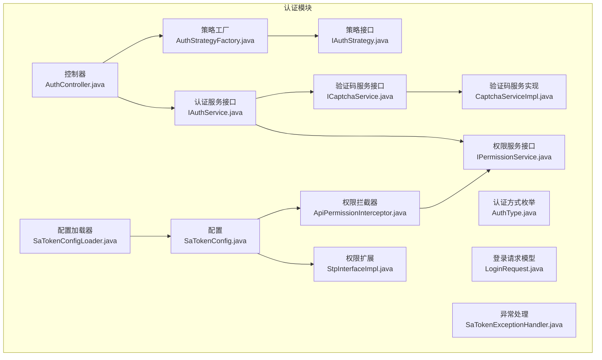
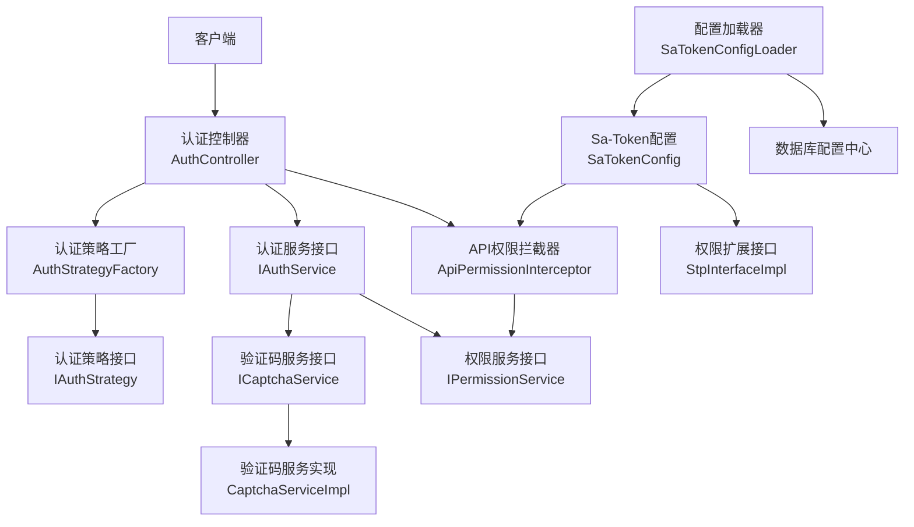
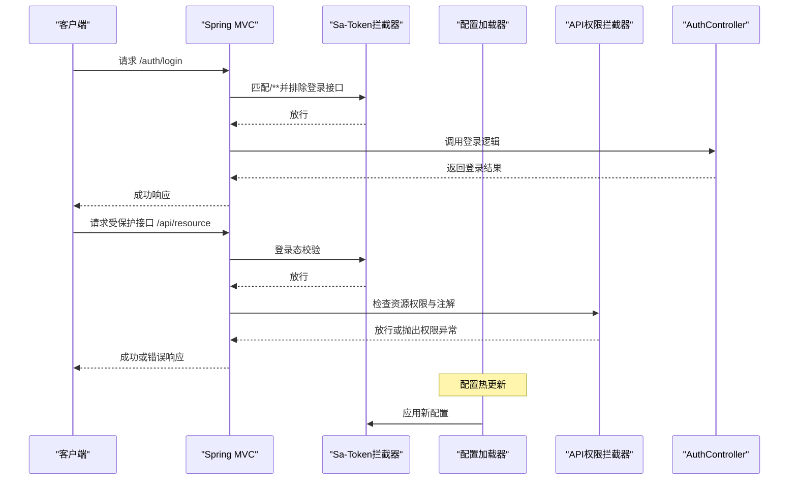
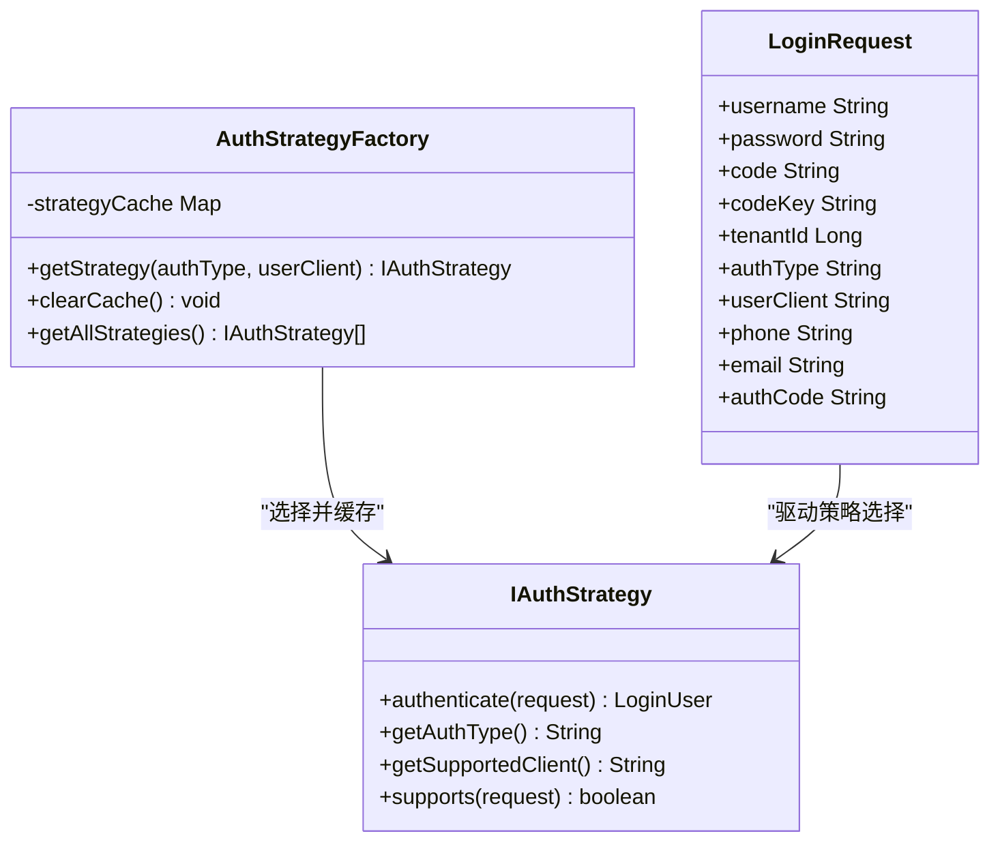
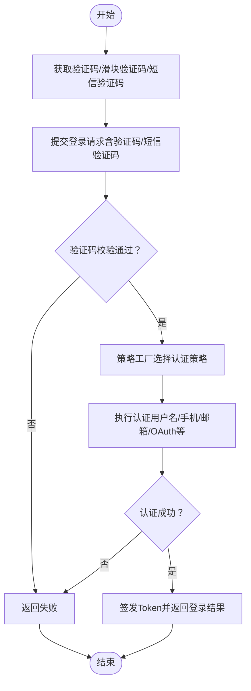
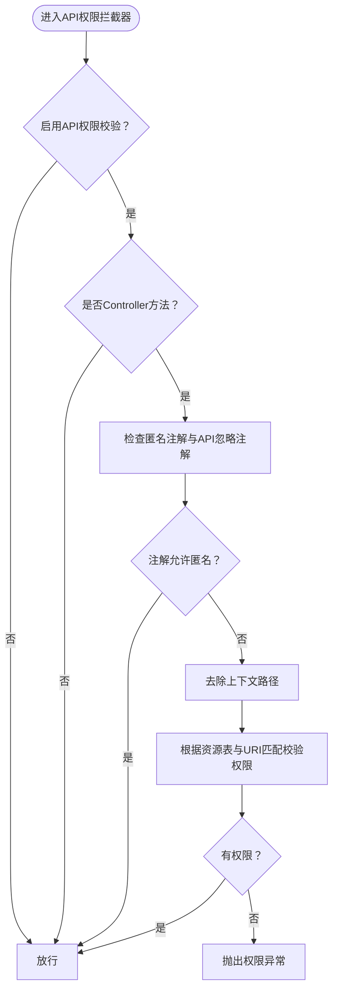
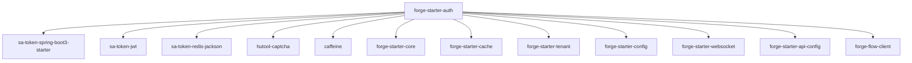

# 安全认证模块

<cite>
**本文引用的文件**
- [pom.xml](file://forge/forge-framework/forge-starter-parent/forge-starter-auth/pom.xml)
- [spring-configuration-metadata.json](file://forge/forge-framework/forge-starter-parent/forge-starter-auth/src/main/resources/META-INF/spring-configuration-metadata.json)
- [SaTokenConfig.java](file://forge/forge-framework/forge-starter-parent/forge-starter-auth/src/main/java/com/mdframe/forge/starter/auth/config/SaTokenConfig.java)
- [SaTokenConfigLoader.java](file://forge/forge-framework/forge-starter-parent/forge-starter-auth/src/main/java/com/mdframe/forge/starter/auth/config/SaTokenConfigLoader.java)
- [StpInterfaceImpl.java](file://forge/forge-framework/forge-starter-parent/forge-starter-auth/src/main/java/com/mdframe/forge/starter/auth/config/StpInterfaceImpl.java)
- [AuthController.java](file://forge/forge-framework/forge-starter-parent/forge-starter-auth/src/main/java/com/mdframe/forge/starter/auth/controller/AuthController.java)
- [ApiPermissionInterceptor.java](file://forge/forge-framework/forge-starter-parent/forge-starter-auth/src/main/java/com/mdframe/forge/starter/auth/interceptor/ApiPermissionInterceptor.java)
- [IAuthService.java](file://forge/forge-framework/forge-starter-parent/forge-starter-auth/src/main/java/com/mdframe/forge/starter/auth/service/IAuthService.java)
- [ICaptchaService.java](file://forge/forge-framework/forge-starter-parent/forge-starter-auth/src/main/java/com/mdframe/forge/starter/auth/service/ICaptchaService.java)
- [IPermissionService.java](file://forge/forge-framework/forge-starter-parent/forge-starter-auth/src/main/java/com/mdframe/forge/starter/auth/service/IPermissionService.java)
- [AuthStrategyFactory.java](file://forge/forge-framework/forge-starter-parent/forge-starter-auth/src/main/java/com/mdframe/forge/starter/auth/strategy/AuthStrategyFactory.java)
- [IAuthStrategy.java](file://forge/forge-framework/forge-starter-parent/forge-starter-auth/src/main/java/com/mdframe/forge/starter/auth/strategy/IAuthStrategy.java)
- [AuthType.java](file://forge/forge-framework/forge-starter-parent/forge-starter-auth/src/main/java/com/mdframe/forge/starter/auth/enums/AuthType.java)
- [LoginRequest.java](file://forge/forge-framework/forge-starter-parent/forge-starter-auth/src/main/java/com/mdframe/forge/starter/auth/domain/LoginRequest.java)
- [CaptchaServiceImpl.java](file://forge/forge-framework/forge-starter-parent/forge-starter-auth/src/main/java/com/mdframe/forge/starter/auth/service/impl/CaptchaServiceImpl.java)
- [SaTokenExceptionHandler.java](file://forge/forge-framework/forge-starter-parent/forge-starter-auth/src/main/java/com/mdframe/forge/starter/auth/exception/SaTokenExceptionHandler.java)
</cite>

## 更新摘要
**变更内容**
- 更新了架构简化后的认证模块依赖关系分析
- 新增了SaTokenConfigLoader配置加载机制说明
- 调整了依赖关系图以反映auth、cache、config等模块的整合现状
- 更新了配置参数说明以体现最新的模块结构

## 目录
1. [简介](#简介)
2. [项目结构](#项目结构)
3. [核心组件](#核心组件)
4. [架构总览](#架构总览)
5. [详细组件分析](#详细组件分析)
6. [依赖关系分析](#依赖关系分析)
7. [性能考量](#性能考量)
8. [故障排查指南](#故障排查指南)
9. [结论](#结论)
10. [附录](#附录)

## 简介
本文件面向Forge安全认证模块（forge-starter-auth），系统性解析其权限认证体系的设计与实现，重点覆盖以下方面：
- Sa-Token集成配置与JWT令牌管理
- 登录策略与认证策略工厂
- 多种登录方式（用户名密码、手机验证码、滑块验证码等）
- 权限拦截器与API权限忽略机制
- 登录用户上下文管理
- 完整认证流程示例、配置参数说明与安全最佳实践

**更新** 本版本反映了架构简化的最新状态，auth模块保持独立但与其他模块的耦合度有所调整。

## 项目结构
forge-starter-auth模块采用按职责分层的组织方式，主要目录与职责如下：
- config：Sa-Token全局配置、权限扩展接口实现、配置加载器
- controller：认证对外接口（登录、登出、验证码、刷新Token等）
- interceptor：API权限拦截器
- service：认证、验证码、权限、登录锁服务接口及实现
- strategy：认证策略接口与工厂
- domain/enums/exception：认证领域模型、枚举与异常处理
- util：工具类（密码加密、路径匹配）
- resources/META-INF：Spring配置元数据（配置项说明）

**图表来源**
- [SaTokenConfig.java:1-70](file://forge/forge-framework/forge-starter-parent/forge-starter-auth/src/main/java/com/mdframe/forge/starter/auth/config/SaTokenConfig.java#L1-L70)
- [SaTokenConfigLoader.java:1-77](file://forge/forge-framework/forge-starter-parent/forge-starter-auth/src/main/java/com/mdframe/forge/starter/auth/config/SaTokenConfigLoader.java#L1-L77)
- [StpInterfaceImpl.java](file://forge/forge-framework/forge-starter-parent/forge-starter-auth/src/main/java/com/mdframe/forge/starter/auth/config/StpInterfaceImpl.java)
- [AuthController.java:1-137](file://forge/forge-framework/forge-starter-parent/forge-starter-auth/src/main/java/com/mdframe/forge/starter/auth/controller/AuthController.java#L1-L137)
- [ApiPermissionInterceptor.java:1-89](file://forge/forge-framework/forge-starter-parent/forge-starter-auth/src/main/java/com/mdframe/forge/starter/auth/interceptor/ApiPermissionInterceptor.java#L1-L89)
- [AuthStrategyFactory.java:1-115](file://forge/forge-framework/forge-starter-parent/forge-starter-auth/src/main/java/com/mdframe/forge/starter/auth/strategy/AuthStrategyFactory.java#L1-L115)
- [IAuthStrategy.java](file://forge/forge-framework/forge-starter-parent/forge-starter-auth/src/main/java/com/mdframe/forge/starter/auth/strategy/IAuthStrategy.java)
- [IAuthService.java](file://forge/forge-framework/forge-starter-parent/forge-starter-auth/src/main/java/com/mdframe/forge/starter/auth/service/IAuthService.java)
- [ICaptchaService.java:1-174](file://forge/forge-framework/forge-starter-parent/forge-starter-auth/src/main/java/com/mdframe/forge/starter/auth/service/ICaptchaService.java#L1-L174)
- [IPermissionService.java:1-26](file://forge/forge-framework/forge-starter-parent/forge-starter-auth/src/main/java/com/mdframe/forge/starter/auth/service/IPermissionService.java#L1-L26)
- [CaptchaServiceImpl.java](file://forge/forge-framework/forge-starter-parent/forge-starter-auth/src/main/java/com/mdframe/forge/starter/auth/service/impl/CaptchaServiceImpl.java)
- [AuthType.java](file://forge/forge-framework/forge-starter-parent/forge-starter-auth/src/main/java/com/mdframe/forge/starter/auth/enums/AuthType.java)
- [LoginRequest.java](file://forge/forge-framework/forge-starter-parent/forge-starter-auth/src/main/java/com/mdframe/forge/starter/auth/domain/LoginRequest.java)
- [SaTokenExceptionHandler.java](file://forge/forge-framework/forge-starter-parent/forge-starter-auth/src/main/java/com/mdframe/forge/starter/auth/exception/SaTokenExceptionHandler.java)

**章节来源**
- [pom.xml:1-90](file://forge/forge-framework/forge-starter-parent/forge-starter-auth/pom.xml#L1-L90)

## 核心组件
- Sa-Token配置与拦截器链
  - SaTokenConfig注册两层拦截器：登录状态校验拦截器与API权限拦截器，分别负责基础登录态与基于资源表的细粒度权限控制。
  - SaTokenConfigLoader负责从数据库配置中心动态加载和应用Sa-Token配置，支持配置热更新。
  - StpInterfaceImpl将Sa-Token的角色与权限委托给应用的会话上下文，实现统一的权限判定来源。
- 认证控制器
  - 提供统一登录入口、登出、用户信息查询、注册、改密、重置密码、验证码获取、滑块验证码、短信验证码发送、登录配置查询、Token刷新等接口。
- 认证策略体系
  - IAuthStrategy定义认证策略契约；AuthStrategyFactory负责策略选择与缓存，支持按认证类型与客户端类型进行匹配。
- 验证码服务
  - ICaptchaService提供统一的验证码服务接口，CaptchaServiceImpl提供图形验证码、滑块验证码、短信验证码的生成、校验与缓存管理。
- 权限服务
  - IPermissionService提供基于API配置管理的权限查询和校验功能。
- 异常处理
  - SaTokenExceptionHandler集中处理未登录、权限不足、角色不足与账号锁定等异常，统一响应格式。

**章节来源**
- [SaTokenConfig.java:1-70](file://forge/forge-framework/forge-starter-parent/forge-starter-auth/src/main/java/com/mdframe/forge/starter/auth/config/SaTokenConfig.java#L1-L70)
- [SaTokenConfigLoader.java:1-77](file://forge/forge-framework/forge-starter-parent/forge-starter-auth/src/main/java/com/mdframe/forge/starter/auth/config/SaTokenConfigLoader.java#L1-L77)
- [StpInterfaceImpl.java](file://forge/forge-framework/forge-starter-parent/forge-starter-auth/src/main/java/com/mdframe/forge/starter/auth/config/StpInterfaceImpl.java)
- [AuthController.java:1-137](file://forge/forge-framework/forge-starter-parent/forge-starter-auth/src/main/java/com/mdframe/forge/starter/auth/controller/AuthController.java#L1-L137)
- [AuthStrategyFactory.java:1-115](file://forge/forge-framework/forge-starter-parent/forge-starter-auth/src/main/java/com/mdframe/forge/starter/auth/strategy/AuthStrategyFactory.java#L1-L115)
- [IAuthStrategy.java](file://forge/forge-framework/forge-starter-parent/forge-starter-auth/src/main/java/com/mdframe/forge/starter/auth/strategy/IAuthStrategy.java)
- [ICaptchaService.java:1-174](file://forge/forge-framework/forge-starter-parent/forge-starter-auth/src/main/java/com/mdframe/forge/starter/auth/service/ICaptchaService.java#L1-L174)
- [IPermissionService.java:1-26](file://forge/forge-framework/forge-starter-parent/forge-starter-auth/src/main/java/com/mdframe/forge/starter/auth/service/IPermissionService.java#L1-L26)
- [CaptchaServiceImpl.java](file://forge/forge-framework/forge-starter-parent/forge-starter-auth/src/main/java/com/mdframe/forge/starter/auth/service/impl/CaptchaServiceImpl.java)
- [SaTokenExceptionHandler.java](file://forge/forge-framework/forge-starter-parent/forge-starter-auth/src/main/java/com/mdframe/forge/starter/auth/exception/SaTokenExceptionHandler.java)

## 架构总览
认证模块整体采用"控制器-策略工厂-认证服务-验证码服务-权限服务-拦截器"的分层架构，结合Sa-Token完成登录态与权限控制，并通过配置元数据暴露可调优的运行参数。

**图表来源**
- [AuthController.java:1-137](file://forge/forge-framework/forge-starter-parent/forge-starter-auth/src/main/java/com/mdframe/forge/starter/auth/controller/AuthController.java#L1-L137)
- [AuthStrategyFactory.java:1-115](file://forge/forge-framework/forge-starter-parent/forge-starter-auth/src/main/java/com/mdframe/forge/starter/auth/strategy/AuthStrategyFactory.java#L1-L115)
- [IAuthStrategy.java](file://forge/forge-framework/forge-starter-parent/forge-starter-auth/src/main/java/com/mdframe/forge/starter/auth/strategy/IAuthStrategy.java)
- [IAuthService.java](file://forge/forge-framework/forge-starter-parent/forge-starter-auth/src/main/java/com/mdframe/forge/starter/auth/service/IAuthService.java)
- [ICaptchaService.java:1-174](file://forge/forge-framework/forge-starter-parent/forge-starter-auth/src/main/java/com/mdframe/forge/starter/auth/service/ICaptchaService.java#L1-L174)
- [IPermissionService.java:1-26](file://forge/forge-framework/forge-starter-parent/forge-starter-auth/src/main/java/com/mdframe/forge/starter/auth/service/IPermissionService.java#L1-L26)
- [CaptchaServiceImpl.java](file://forge/forge-framework/forge-starter-parent/forge-starter-auth/src/main/java/com/mdframe/forge/starter/auth/service/impl/CaptchaServiceImpl.java)
- [ApiPermissionInterceptor.java:1-89](file://forge/forge-framework/forge-starter-parent/forge-starter-auth/src/main/java/com/mdframe/forge/starter/auth/interceptor/ApiPermissionInterceptor.java#L1-L89)
- [SaTokenConfig.java:1-70](file://forge/forge-framework/forge-starter-parent/forge-starter-auth/src/main/java/com/mdframe/forge/starter/auth/config/SaTokenConfig.java#L1-L70)
- [SaTokenConfigLoader.java:1-77](file://forge/forge-framework/forge-starter-parent/forge-starter-auth/src/main/java/com/mdframe/forge/starter/auth/config/SaTokenConfigLoader.java#L1-L77)
- [StpInterfaceImpl.java](file://forge/forge-framework/forge-starter-parent/forge-starter-auth/src/main/java/com/mdframe/forge/starter/auth/config/StpInterfaceImpl.java)

## 详细组件分析

### Sa-Token集成与拦截器链
- 登录拦截器
  - 对/**路径生效，排除登录、注册、重置密码、验证码、静态资源、Swagger、健康检查、WebSocket以及配置中的额外排除路径，执行登录态校验。
- API权限拦截器
  - 在登录拦截器之后执行，基于数据库资源表配置与注解控制接口访问；支持匿名注解与API配置忽略注解。
- 权限扩展
  - StpInterfaceImpl从会话上下文中获取角色与权限列表，作为Sa-Token权限判定的数据源。
- 配置加载器
  - SaTokenConfigLoader实现ApplicationRunner和ConfigRefreshEvent监听器，支持从数据库配置中心动态加载和应用Sa-Token配置，包括token名称、超时时间、共享设置等。

**图表来源**
- [SaTokenConfig.java:29-68](file://forge/forge-framework/forge-starter-parent/forge-starter-auth/src/main/java/com/mdframe/forge/starter/auth/config/SaTokenConfig.java#L29-L68)
- [SaTokenConfigLoader.java:38-69](file://forge/forge-framework/forge-starter-parent/forge-starter-auth/src/main/java/com/mdframe/forge/starter/auth/config/SaTokenConfigLoader.java#L38-L69)
- [ApiPermissionInterceptor.java:32-87](file://forge/forge-framework/forge-starter-parent/forge-starter-auth/src/main/java/com/mdframe/forge/starter/auth/interceptor/ApiPermissionInterceptor.java#L32-L87)
- [AuthController.java:31-36](file://forge/forge-framework/forge-starter-parent/forge-starter-auth/src/main/java/com/mdframe/forge/starter/auth/controller/AuthController.java#L31-L36)

**章节来源**
- [SaTokenConfig.java:1-70](file://forge/forge-framework/forge-starter-parent/forge-starter-auth/src/main/java/com/mdframe/forge/starter/auth/config/SaTokenConfig.java#L1-L70)
- [SaTokenConfigLoader.java:1-77](file://forge/forge-framework/forge-starter-parent/forge-starter-auth/src/main/java/com/mdframe/forge/starter/auth/config/SaTokenConfigLoader.java#L1-L77)
- [StpInterfaceImpl.java](file://forge/forge-framework/forge-starter-parent/forge-starter-auth/src/main/java/com/mdframe/forge/starter/auth/config/StpInterfaceImpl.java)
- [ApiPermissionInterceptor.java:1-89](file://forge/forge-framework/forge-starter-parent/forge-starter-auth/src/main/java/com/mdframe/forge/starter/auth/interceptor/ApiPermissionInterceptor.java#L1-L89)

### 认证策略工厂与多种登录方式
- 认证策略接口
  - IAuthStrategy定义authenticate、getAuthType、getSupportedClient等方法，统一不同认证方式的行为。
- 策略工厂
  - AuthStrategyFactory按authType与userClient选择策略，优先精确匹配（类型+客户端），其次类型匹配（支持所有客户端），并缓存策略以提升性能。
- 登录请求模型
  - LoginRequest包含username/password/code/codeKey/tenantId/authType/userClient/phone/email/authCode等字段，支撑多方式登录。
- 认证方式枚举
  - AuthType涵盖password、password_captcha、phone_captcha、wechat、email_captcha、oauth2等常用认证方式。

**图表来源**
- [IAuthStrategy.java](file://forge/forge-framework/forge-starter-parent/forge-starter-auth/src/main/java/com/mdframe/forge/starter/auth/strategy/IAuthStrategy.java)
- [AuthStrategyFactory.java:1-115](file://forge/forge-framework/forge-starter-parent/forge-starter-auth/src/main/java/com/mdframe/forge/starter/auth/strategy/AuthStrategyFactory.java#L1-L115)
- [LoginRequest.java](file://forge/forge-framework/forge-starter-parent/forge-starter-auth/src/main/java/com/mdframe/forge/starter/auth/domain/LoginRequest.java)

**章节来源**
- [AuthStrategyFactory.java:1-115](file://forge/forge-framework/forge-starter-parent/forge-starter-auth/src/main/java/com/mdframe/forge/starter/auth/strategy/AuthStrategyFactory.java#L1-L115)
- [IAuthStrategy.java](file://forge/forge-framework/forge-starter-parent/forge-starter-auth/src/main/java/com/mdframe/forge/starter/auth/strategy/IAuthStrategy.java)
- [AuthType.java](file://forge/forge-framework/forge-starter-parent/forge-starter-auth/src/main/java/com/mdframe/forge/starter/auth/enums/AuthType.java)
- [LoginRequest.java](file://forge/forge-framework/forge-starter-parent/forge-starter-auth/src/main/java/com/mdframe/forge/starter/auth/domain/LoginRequest.java)

### 验证码机制与登录流程
- 图形验证码
  - 生成指定长度与过期时间的验证码，返回key与图片Base64；开发环境同时返回验证码文本；验证码存入缓存并绑定过期时间。
- 滑块验证码
  - 生成背景图与滑块图，计算缺口位置并存入缓存；前端拖动滑块时传入移动距离，后端在容差范围内校验。
- 短信验证码
  - 限制发送间隔，生成6位数字验证码并存入缓存；模拟发送成功（生产需接入短信网关）。
- 登录流程
  - 客户端调用统一登录接口，携带authType与必要凭据；控制器委派认证服务，认证服务通过策略工厂选择具体策略执行认证；成功后返回登录结果（含Token等）。

**图表来源**
- [ICaptchaService.java:87-173](file://forge/forge-framework/forge-starter-parent/forge-starter-auth/src/main/java/com/mdframe/forge/starter/auth/service/ICaptchaService.java#L87-L173)
- [CaptchaServiceImpl.java](file://forge/forge-framework/forge-starter-parent/forge-starter-auth/src/main/java/com/mdframe/forge/starter/auth/service/impl/CaptchaServiceImpl.java)
- [AuthController.java:31-36](file://forge/forge-framework/forge-starter-parent/forge-starter-auth/src/main/java/com/mdframe/forge/starter/auth/controller/AuthController.java#L31-L36)
- [AuthStrategyFactory.java:34-60](file://forge/forge-framework/forge-starter-parent/forge-starter-auth/src/main/java/com/mdframe/forge/starter/auth/strategy/AuthStrategyFactory.java#L34-L60)

**章节来源**
- [ICaptchaService.java:1-174](file://forge/forge-framework/forge-starter-parent/forge-starter-auth/src/main/java/com/mdframe/forge/starter/auth/service/ICaptchaService.java#L1-L174)
- [CaptchaServiceImpl.java](file://forge/forge-framework/forge-starter-parent/forge-starter-auth/src/main/java/com/mdframe/forge/starter/auth/service/impl/CaptchaServiceImpl.java)
- [AuthController.java:1-137](file://forge/forge-framework/forge-starter-parent/forge-starter-auth/src/main/java/com/mdframe/forge/starter/auth/controller/AuthController.java#L1-L137)

### 权限拦截器与API权限忽略
- API权限拦截器工作流
  - 若未启用API权限校验则直接放行；仅拦截Controller方法；优先判断匿名注解与API配置忽略注解；移除上下文路径后，基于资源表配置与URI匹配进行权限校验；失败抛出权限异常。
- 排除路径
  - Sa-Token拦截器与API拦截器均支持配置排除路径数组，便于将认证相关接口、静态资源、Swagger、健康检查、WebSocket等纳入白名单。

**图表来源**
- [ApiPermissionInterceptor.java:32-87](file://forge/forge-framework/forge-starter-parent/forge-starter-auth/src/main/java/com/mdframe/forge/starter/auth/interceptor/ApiPermissionInterceptor.java#L32-L87)
- [SaTokenConfig.java:29-68](file://forge/forge-framework/forge-starter-parent/forge-starter-auth/src/main/java/com/mdframe/forge/starter/auth/config/SaTokenConfig.java#L29-L68)

**章节来源**
- [ApiPermissionInterceptor.java:1-89](file://forge/forge-framework/forge-starter-parent/forge-starter-auth/src/main/java/com/mdframe/forge/starter/auth/interceptor/ApiPermissionInterceptor.java#L1-L89)
- [spring-configuration-metadata.json:1-53](file://forge/forge-framework/forge-starter-parent/forge-starter-auth/src/main/resources/META-INF/spring-configuration-metadata.json#L1-L53)

### 登录用户上下文管理
- 权限扩展接口
  - StpInterfaceImpl从会话上下文中获取权限集合与角色集合，作为Sa-Token判定依据，确保权限来源统一。
- 控制器接口
  - 提供获取当前登录用户信息接口，便于前端展示与权限判断。

**章节来源**
- [StpInterfaceImpl.java](file://forge/forge-framework/forge-starter-parent/forge-starter-auth/src/main/java/com/mdframe/forge/starter/auth/config/StpInterfaceImpl.java)
- [AuthController.java:48-55](file://forge/forge-framework/forge-starter-parent/forge-starter-auth/src/main/java/com/mdframe/forge/starter/auth/controller/AuthController.java#L48-L55)

### JWT令牌管理与登录策略
- 依赖引入
  - 模块引入Sa-Token Spring Boot Starter、Sa-Token-JWT与Sa-Token-Redis Jackson，具备JWT集成与Redis存储能力。
- 令牌生命周期
  - 通过Sa-Token统一管理登录态与会话，结合JWT可实现跨服务鉴权与无状态会话。
- Token刷新
  - 提供刷新Token接口，配合Sa-Token的会话续期机制保障用户体验。

**章节来源**
- [pom.xml:25-46](file://forge/forge-framework/forge-starter-parent/forge-starter-auth/pom.xml#L25-L46)
- [AuthController.java:128-135](file://forge/forge-framework/forge-starter-parent/forge-starter-auth/src/main/java/com/mdframe/forge/starter/auth/controller/AuthController.java#L128-L135)

## 依赖关系分析
认证模块对外部组件的依赖主要体现在：
- Sa-Token生态：提供登录态、权限注解、拦截器与JWT支持
- Hutool验证码：提供图形验证码与滑块验证码生成
- Caffeine：本地缓存（用于策略缓存等）
- Forge框架子模块：核心上下文、租户、配置、API配置管理、WebSocket、流程客户端等

**更新** 依赖关系反映了架构简化的现状，auth模块保持独立但仍依赖其他核心模块。

**图表来源**
- [pom.xml:14-86](file://forge/forge-framework/forge-starter-parent/forge-starter-auth/pom.xml#L14-L86)

**章节来源**
- [pom.xml:1-90](file://forge/forge-framework/forge-starter-parent/forge-starter-auth/pom.xml#L1-L90)

## 性能考量
- 策略缓存
  - 策略工厂对策略进行缓存，避免重复扫描与实例化，降低认证选择开销。
- 验证码缓存
  - 验证码与滑块验证码答案均存入缓存并设置过期时间，图形验证码在开发环境返回验证码文本便于调试。
- 拦截器顺序
  - 登录拦截器优先于API权限拦截器，减少不必要的权限校验成本。
- 并发登录策略
  - 配置项支持允许并发登录、替换旧会话或拒绝新会话，可根据业务需求调整。
- 配置热更新
  - SaTokenConfigLoader支持配置热更新，无需重启即可应用新的Sa-Token配置。

**章节来源**
- [AuthStrategyFactory.java:24-58](file://forge/forge-framework/forge-starter-parent/forge-starter-auth/src/main/java/com/mdframe/forge/starter/auth/strategy/AuthStrategyFactory.java#L24-L58)
- [CaptchaServiceImpl.java](file://forge/forge-framework/forge-starter-parent/forge-starter-auth/src/main/java/com/mdframe/forge/starter/auth/service/impl/CaptchaServiceImpl.java)
- [spring-configuration-metadata.json:40-44](file://forge/forge-framework/forge-starter-parent/forge-starter-auth/src/main/resources/META-INF/spring-configuration-metadata.json#L40-L44)
- [SaTokenConfigLoader.java:38-69](file://forge/forge-framework/forge-starter-parent/forge-starter-auth/src/main/java/com/mdframe/forge/starter/auth/config/SaTokenConfigLoader.java#L38-L69)

## 故障排查指南
- 未登录或登录过期
  - 触发NotLoginException，异常处理器返回401并细化提示（未提供凭证、无效凭证、已过期、被替换、被踢出）。
- 权限不足
  - 触发NotPermissionException或NotRoleException，异常处理器返回403。
- 账号锁定
  - 触发AccountLockedException，异常处理器返回423。
- 验证码问题
  - 验证码不存在或过期、滑块验证码容差过大、短信发送过于频繁等均有明确日志与返回信息。
- 配置加载失败
  - SaTokenConfigLoader在数据库配置加载失败时会回退到YAML配置，确保系统正常运行。

**章节来源**
- [SaTokenExceptionHandler.java](file://forge/forge-framework/forge-starter-parent/forge-starter-auth/src/main/java/com/mdframe/forge/starter/auth/exception/SaTokenExceptionHandler.java)
- [CaptchaServiceImpl.java](file://forge/forge-framework/forge-starter-parent/forge-starter-auth/src/main/java/com/mdframe/forge/starter/auth/service/impl/CaptchaServiceImpl.java)
- [CaptchaServiceImpl.java](file://forge/forge-framework/forge-starter-parent/forge-starter-auth/src/main/java/com/mdframe/forge/starter/auth/service/impl/CaptchaServiceImpl.java)
- [SaTokenConfigLoader.java:62-68](file://forge/forge-framework/forge-starter-parent/forge-starter-auth/src/main/java/com/mdframe/forge/starter/auth/config/SaTokenConfigLoader.java#L62-L68)

## 结论
forge-starter-auth模块通过Sa-Token实现了统一的登录态与权限控制，结合策略工厂与多种验证码机制，提供了灵活且可扩展的认证体系。模块在拦截器链、权限扩展、上下文管理与异常处理等方面均具备清晰的设计与实现，适合在多租户、多客户端场景下部署与演进。最新的架构简化使其更加轻量化，同时保持了强大的功能完整性。

## 附录

### 配置参数说明
- API接口权限校验开关
  - 名称：forge.auth.enable-api-permission
  - 类型：Boolean
  - 默认值：true
- API权限校验排除路径
  - 名称：forge.auth.api-permission-exclude-paths
  - 类型：String[]
  - 默认值：["/auth/**"]
- 登录失败锁定开关
  - 名称：forge.auth.enable-login-lock
  - 类型：Boolean
  - 默认值：true
- 最大登录失败尝试次数
  - 名称：forge.auth.max-login-attempts
  - 类型：Integer
  - 默认值：4
- 账号锁定时长（分钟）
  - 名称：forge.auth.lock-duration
  - 类型：Long
  - 默认值：30
- 登录失败记录保留时长（分钟）
  - 名称：forge.auth.fail-record-expire
  - 类型：Long
  - 默认值：15
- 同一账号登录策略
  - 名称：forge.auth.same-account-login-strategy
  - 类型：String
  - 默认值："replace_old"
  - 可选值："allow_concurrent"、"replace_old"、"reject_new"
- 在线用户管理开关
  - 名称：forge.auth.enable-online-user-management
  - 类型：Boolean
  - 默认值：true

**章节来源**
- [spring-configuration-metadata.json:1-53](file://forge/forge-framework/forge-starter-parent/forge-starter-auth/src/main/resources/META-INF/spring-configuration-metadata.json#L1-L53)