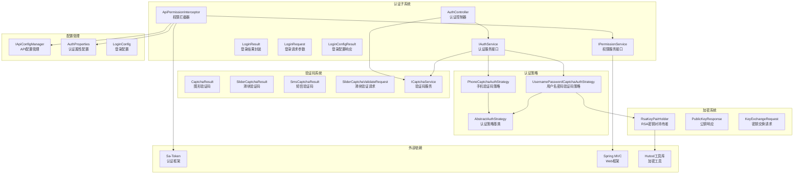
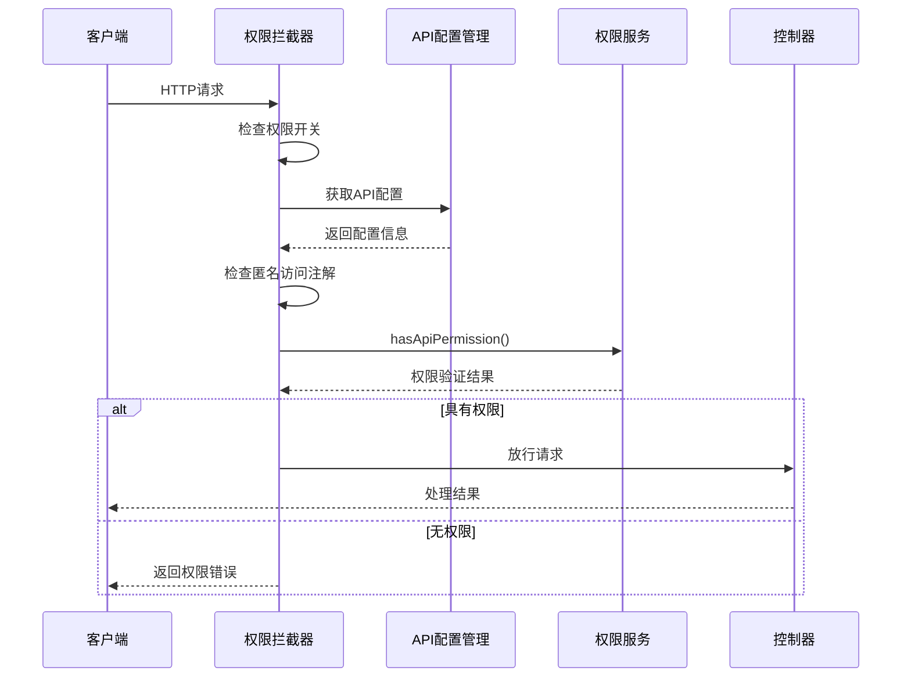
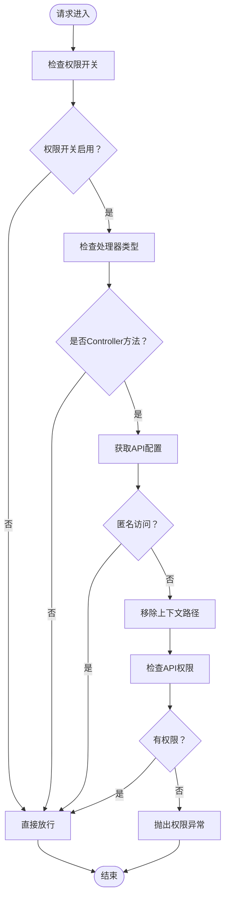
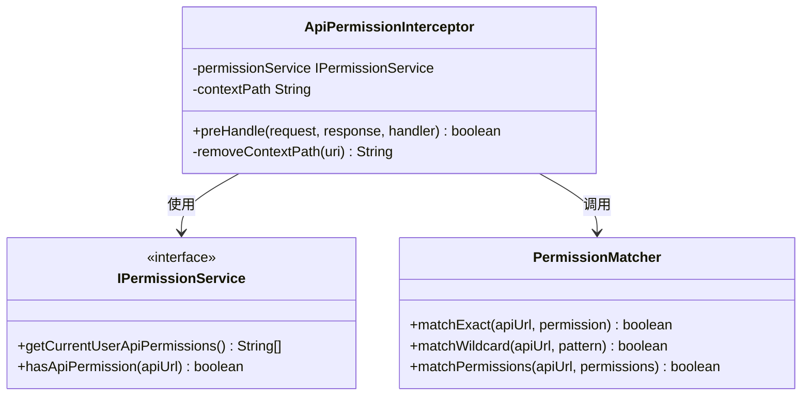
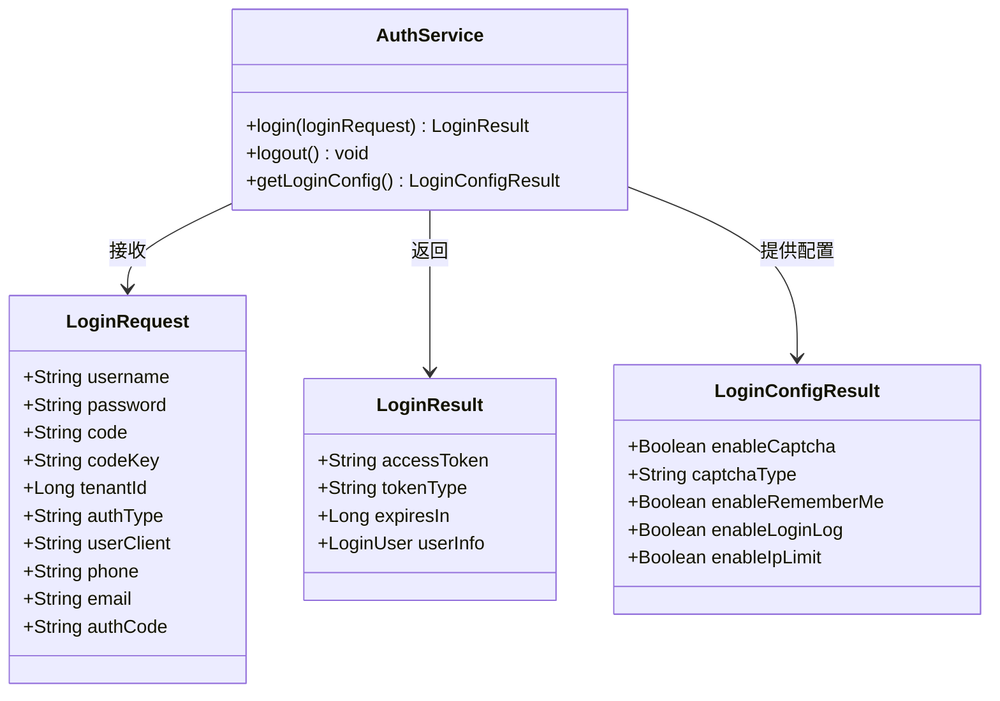
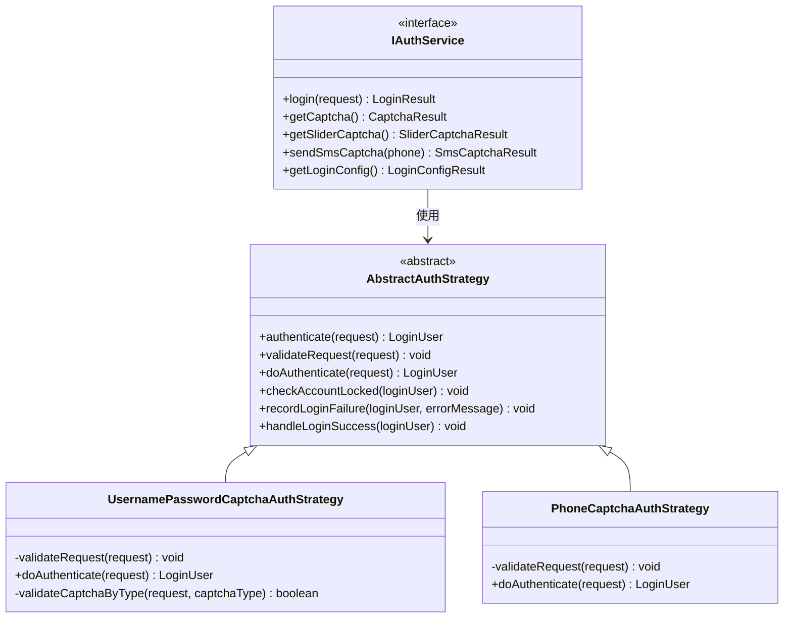
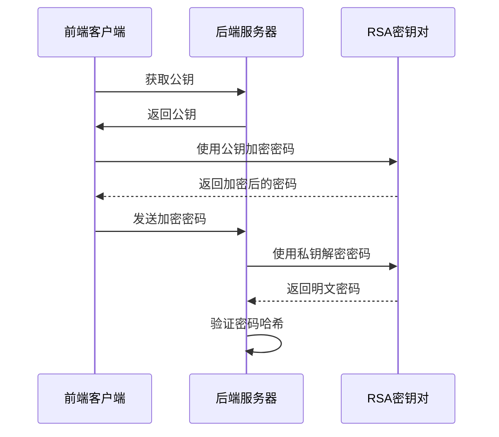
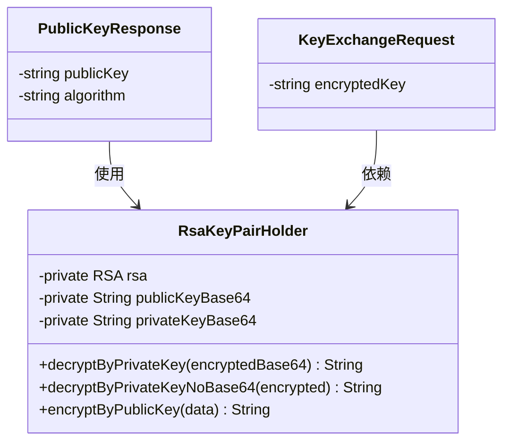
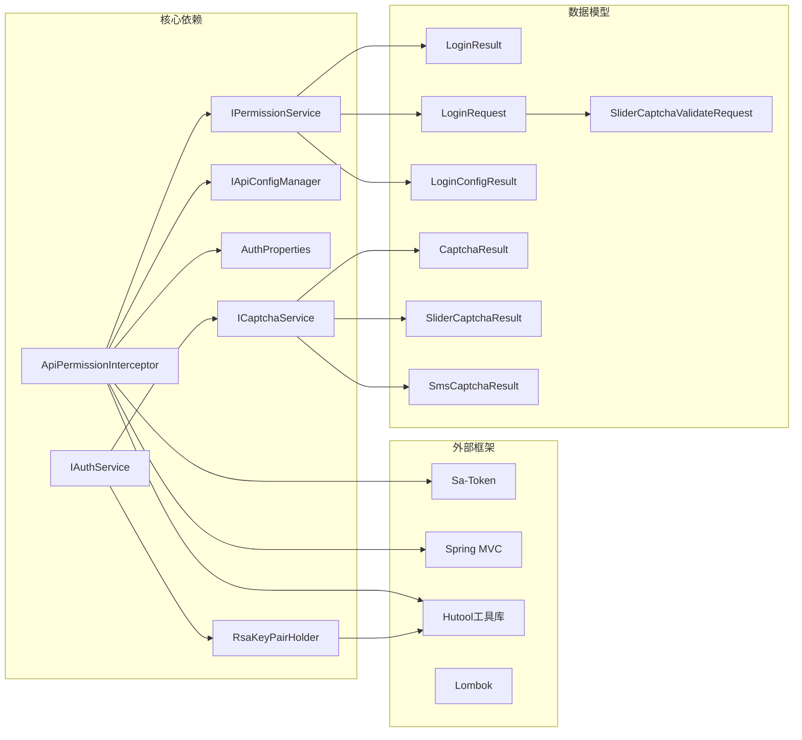

# 登录权限拦截器

<cite>
**本文档引用的文件**
- [ApiPermissionInterceptor.java](file://forge/forge-framework/forge-starter-parent/forge-starter-auth/src/main/java/com/mdframe/forge/starter/auth/interceptor/ApiPermissionInterceptor.java)
- [IPermissionService.java](file://forge/forge-framework/forge-starter-parent/forge-starter-auth/src/main/java/com/mdframe/forge/starter/auth/service/IPermissionService.java)
- [LoginResult.java](file://forge/forge-framework/forge-starter-parent/forge-starter-auth/src/main/java/com/mdframe/forge/starter/auth/domain/LoginResult.java)
- [LoginRequest.java](file://forge/forge-framework/forge-starter-parent/forge-starter-auth/src/main/java/com/mdframe/forge/starter/auth/domain/LoginRequest.java)
- [LoginConfigResult.java](file://forge/forge-framework/forge-starter-parent/forge-starter-auth/src/main/java/com/mdframe/forge/starter/auth/domain/LoginConfigResult.java)
- [CaptchaResult.java](file://forge/forge-framework/forge-starter-parent/forge-starter-auth/src/main/java/com/mdframe/forge/starter/auth/domain/CaptchaResult.java)
- [SliderCaptchaResult.java](file://forge/forge-framework/forge-starter-parent/forge-starter-auth/src/main/java/com/mdframe/forge/starter/auth/domain/SliderCaptchaResult.java)
- [SmsCaptchaResult.java](file://forge/forge-framework/forge-starter-parent/forge-starter-auth/src/main/java/com/mdframe/forge/starter/auth/domain/SmsCaptchaResult.java)
- [SliderCaptchaValidateRequest.java](file://forge/forge-framework/forge-starter-parent/forge-starter-auth/src/main/java/com/mdframe/forge/starter/auth/domain/SliderCaptchaValidateRequest.java)
- [IAuthService.java](file://forge/forge-framework/forge-starter-parent/forge-starter-auth/src/main/java/com/mdframe/forge/starter/auth/service/IAuthService.java)
- [AuthController.java](file://forge/forge-framework/forge-starter-parent/forge-starter-auth/src/main/java/com/mdframe/forge/starter/auth/controller/AuthController.java)
- [UsernamePasswordCaptchaAuthStrategy.java](file://forge/forge-framework/forge-plugin-parent/forge-plugin-system/src/main/java/com/mdframe/forge/plugin/system/strategy/UsernamePasswordCaptchaAuthStrategy.java)
- [AbstractAuthStrategy.java](file://forge/forge-framework/forge-plugin-parent/forge-plugin-system/src/main/java/com/mdframe/forge/plugin/system/strategy/AbstractAuthStrategy.java)
- [PhoneCaptchaAuthStrategy.java](file://forge/forge-framework/forge-plugin-parent/forge-plugin-system/src/main/java/com/mdframe/forge/plugin/system/strategy/PhoneCaptchaAuthStrategy.java)
- [RsaKeyPairHolder.java](file://forge/forge-framework/forge-starter-parent/forge-starter-crypto/src/main/java/com/mdframe/forge/starter/crypto/keyexchange/RsaKeyPairHolder.java)
- [PublicKeyResponse.java](file://forge/forge-framework/forge-starter-parent/forge-starter-crypto/src/main/java/com/mdframe/forge/starter/crypto/keyexchange/PublicKeyResponse.java)
- [KeyExchangeRequest.java](file://forge/forge-framework/forge-starter-parent/forge-starter-crypto/src/main/java/com/mdframe/forge/starter/crypto/keyexchange/KeyExchangeRequest.java)
</cite>

## 更新摘要
**所做更改**
- 新增图形验证码、滑块验证码、短信验证码的完整认证支持
- 添加密码加密和密钥交换协议的安全机制
- 扩展认证策略体系，支持多种认证方式
- 增强登录配置管理和验证码类型切换能力

## 目录
1. [简介](#简介)
2. [项目结构](#项目结构)
3. [核心组件](#核心组件)
4. [架构概览](#架构概览)
5. [详细组件分析](#详细组件分析)
6. [现代化认证功能](#现代化认证功能)
7. [密码加密与密钥交换](#密码加密与密钥交换)
8. [依赖关系分析](#依赖关系分析)
9. [性能考虑](#性能考虑)
10. [故障排除指南](#故障排除指南)
11. [结论](#结论)

## 简介

登录权限拦截器是Forge框架中用于控制API访问权限的核心组件。该拦截器基于数据库资源表配置实现接口权限控制，支持通配符匹配和多种认证方式。系统采用Spring MVC拦截器机制，在请求到达Controller之前进行权限验证，确保只有具备相应权限的用户才能访问受保护的API接口。

**更新** 系统现已集成现代化的多因素认证机制，包括图形验证码、滑块验证码、短信验证码等多种验证方式，并引入密码加密和动态密钥交换协议，显著提升了系统的安全性。

## 项目结构

Forge框架采用模块化设计，权限拦截器位于认证子系统中：

**图表来源**
- [ApiPermissionInterceptor.java:1-89](file://forge/forge-framework/forge-starter-parent/forge-starter-auth/src/main/java/com/mdframe/forge/starter/auth/interceptor/ApiPermissionInterceptor.java#L1-L89)
- [IAuthService.java:1-156](file://forge/forge-framework/forge-starter-parent/forge-starter-auth/src/main/java/com/mdframe/forge/starter/auth/service/IAuthService.java#L1-L156)
- [UsernamePasswordCaptchaAuthStrategy.java:1-130](file://forge/forge-framework/forge-plugin-parent/forge-plugin-system/src/main/java/com/mdframe/forge/plugin/system/strategy/UsernamePasswordCaptchaAuthStrategy.java#L1-L130)
- [RsaKeyPairHolder.java:1-64](file://forge/forge-framework/forge-starter-parent/forge-starter-crypto/src/main/java/com/mdframe/forge/starter/crypto/keyexchange/RsaKeyPairHolder.java#L1-L64)

**章节来源**
- [ApiPermissionInterceptor.java:1-89](file://forge/forge-framework/forge-starter-parent/forge-starter-auth/src/main/java/com/mdframe/forge/starter/auth/interceptor/ApiPermissionInterceptor.java#L1-L89)

## 核心组件

### ApiPermissionInterceptor 权限拦截器

ApiPermissionInterceptor是整个权限控制系统的核心，实现了Spring MVC的HandlerInterceptor接口。该拦截器具有以下关键特性：

- **多层权限检查**：支持数据库配置、注解标记、API配置等多种权限验证方式
- **通配符支持**：完全兼容通配符匹配模式，如"/system/user/**"
- **灵活的匿名访问控制**：通过多种注解和配置实现灵活的匿名访问策略
- **上下文路径处理**：自动处理应用部署在子路径下的URI匹配问题

### IPermissionService 权限服务接口

权限服务接口定义了权限验证的核心方法：

- **getCurrentUserApiPermissions()**：获取当前用户的API权限列表
- **hasApiPermission(String apiUrl)**：检查用户对特定API的访问权限

### 登录相关数据模型

系统提供了完整的登录数据封装：

- **LoginResult**：包含访问令牌、令牌类型、过期时间和用户信息
- **LoginRequest**：支持多种认证方式的登录请求参数
- **LoginConfigResult**：返回登录配置信息，如验证码启用状态

**更新** 新增多种验证码类型的数据模型：
- **CaptchaResult**：图形验证码响应，包含验证码key、图片和过期时间
- **SliderCaptchaResult**：滑块验证码响应，包含背景图、滑块图和验证配置
- **SmsCaptchaResult**：短信验证码响应，包含手机号、验证码和发送状态

**章节来源**
- [IPermissionService.java:1-26](file://forge/forge-framework/forge-starter-parent/forge-starter-auth/src/main/java/com/mdframe/forge/starter/auth/service/IPermissionService.java#L1-L26)
- [LoginResult.java:1-42](file://forge/forge-framework/forge-starter-parent/forge-starter-auth/src/main/java/com/mdframe/forge/starter/auth/domain/LoginResult.java#L1-L42)
- [LoginRequest.java:1-77](file://forge/forge-framework/forge-starter-parent/forge-starter-auth/src/main/java/com/mdframe/forge/starter/auth/domain/LoginRequest.java#L1-L77)
- [LoginConfigResult.java:1-46](file://forge/forge-framework/forge-starter-parent/forge-starter-auth/src/main/java/com/mdframe/forge/starter/auth/domain/LoginConfigResult.java#L1-L46)
- [CaptchaResult.java:1-41](file://forge/forge-framework/forge-starter-parent/forge-starter-auth/src/main/java/com/mdframe/forge/starter/auth/domain/CaptchaResult.java#L1-L41)
- [SliderCaptchaResult.java:1-71](file://forge/forge-framework/forge-starter-parent/forge-starter-auth/src/main/java/com/mdframe/forge/starter/auth/domain/SliderCaptchaResult.java#L1-L71)
- [SmsCaptchaResult.java:1-61](file://forge/forge-framework/forge-starter-parent/forge-starter-auth/src/main/java/com/mdframe/forge/starter/auth/domain/SmsCaptchaResult.java#L1-L61)

## 架构概览

系统采用分层架构设计，权限拦截器位于Web层和业务层之间：

**图表来源**
- [ApiPermissionInterceptor.java:32-87](file://forge/forge-framework/forge-starter-parent/forge-starter-auth/src/main/java/com/mdframe/forge/starter/auth/interceptor/ApiPermissionInterceptor.java#L32-L87)

## 详细组件分析

### 权限验证流程

权限拦截器的执行流程遵循严格的验证顺序：

**图表来源**
- [ApiPermissionInterceptor.java:32-87](file://forge/forge-framework/forge-starter-parent/forge-starter-auth/src/main/java/com/mdframe/forge/starter/auth/interceptor/ApiPermissionInterceptor.java#L32-L87)

### 匿名访问控制机制

系统提供了多层次的匿名访问控制：

1. **数据库配置匿名访问**：通过API配置表设置无需认证的接口
2. **注解匿名访问**：支持Sa-Token的@SaIgnore和自定义@ApiPermissionIgnore注解
3. **WebSocket特殊处理**：自动将/ws开头的路径视为匿名访问
4. **API配置优先级**：数据库配置优先于注解配置

### 权限匹配算法

权限匹配采用精确匹配与通配符匹配相结合的方式：

**图表来源**
- [ApiPermissionInterceptor.java:67-86](file://forge/forge-framework/forge-starter-parent/forge-starter-auth/src/main/java/com/mdframe/forge/starter/auth/interceptor/ApiPermissionInterceptor.java#L67-L86)
- [IPermissionService.java:8-25](file://forge/forge-framework/forge-starter-parent/forge-starter-auth/src/main/java/com/mdframe/forge/starter/auth/service/IPermissionService.java#L8-L25)

**章节来源**
- [ApiPermissionInterceptor.java:32-87](file://forge/forge-framework/forge-starter-parent/forge-starter-auth/src/main/java/com/mdframe/forge/starter/auth/interceptor/ApiPermissionInterceptor.java#L32-L87)

### 登录请求处理

系统支持多种认证方式的登录请求处理：

**图表来源**
- [LoginRequest.java:11-76](file://forge/forge-framework/forge-starter-parent/forge-starter-auth/src/main/java/com/mdframe/forge/starter/auth/domain/LoginRequest.java#L11-L76)
- [LoginResult.java:18-41](file://forge/forge-framework/forge-starter-parent/forge-starter-auth/src/main/java/com/mdframe/forge/starter/auth/domain/LoginResult.java#L18-L41)
- [LoginConfigResult.java:17-45](file://forge/forge-framework/forge-starter-parent/forge-starter-auth/src/main/java/com/mdframe/forge/starter/auth/domain/LoginConfigResult.java#L17-L45)

**章节来源**
- [LoginRequest.java:1-77](file://forge/forge-framework/forge-starter-parent/forge-starter-auth/src/main/java/com/mdframe/forge/starter/auth/domain/LoginRequest.java#L1-L77)
- [LoginResult.java:1-42](file://forge/forge-framework/forge-starter-parent/forge-starter-auth/src/main/java/com/mdframe/forge/starter/auth/domain/LoginResult.java#L1-L42)
- [LoginConfigResult.java:1-46](file://forge/forge-framework/forge-starter-parent/forge-starter-auth/src/main/java/com/mdframe/forge/starter/auth/domain/LoginConfigResult.java#L1-L46)

## 现代化认证功能

### 多种验证码认证方式

系统现已支持三种主要的验证码认证方式：

#### 图形验证码
- **CaptchaResult**：包含验证码key、Base64编码的图片和过期时间
- **生成流程**：后端生成随机验证码，前端展示图片进行验证
- **应用场景**：传统网页登录、基础防护场景

#### 滑块验证码
- **SliderCaptchaResult**：包含背景图片、滑块图片、缺口位置等完整验证信息
- **SliderCaptchaValidateRequest**：前端滑动验证后的请求参数
- **验证特点**：防机器人攻击，用户体验友好

#### 短信验证码
- **SmsCaptchaResult**：包含手机号、验证码、发送状态和过期时间
- **发送机制**：通过短信网关发送验证码到用户手机
- **应用场景**：移动端登录、重要操作确认

### 认证策略体系

系统采用策略模式实现灵活的认证方式切换：

**图表来源**
- [AbstractAuthStrategy.java:1-196](file://forge/forge-framework/forge-plugin-parent/forge-plugin-system/src/main/java/com/mdframe/forge/plugin/system/strategy/AbstractAuthStrategy.java#L1-L196)
- [UsernamePasswordCaptchaAuthStrategy.java:1-130](file://forge/forge-framework/forge-plugin-parent/forge-plugin-system/src/main/java/com/mdframe/forge/plugin/system/strategy/UsernamePasswordCaptchaAuthStrategy.java#L1-L130)
- [PhoneCaptchaAuthStrategy.java:1-48](file://forge/forge-framework/forge-plugin-parent/forge-plugin-system/src/main/java/com/mdframe/forge/plugin/system/strategy/PhoneCaptchaAuthStrategy.java#L1-L48)

**章节来源**
- [UsernamePasswordCaptchaAuthStrategy.java:1-130](file://forge/forge-framework/forge-plugin-parent/forge-plugin-system/src/main/java/com/mdframe/forge/plugin/system/strategy/UsernamePasswordCaptchaAuthStrategy.java#L1-L130)
- [PhoneCaptchaAuthStrategy.java:1-48](file://forge/forge-framework/forge-plugin-parent/forge-plugin-system/src/main/java/com/mdframe/forge/plugin/system/strategy/PhoneCaptchaAuthStrategy.java#L1-L48)

### 登录配置管理

系统提供灵活的登录配置管理：

- **enableCaptcha**：是否启用验证码验证
- **captchaType**：验证码类型（graphical/slider/sms）
- **enableRememberMe**：是否启用记住我功能
- **enableLoginLog**：是否记录登录日志
- **enableIpLimit**：是否启用IP访问限制

**章节来源**
- [LoginConfigResult.java:1-46](file://forge/forge-framework/forge-starter-parent/forge-starter-auth/src/main/java/com/mdframe/forge/starter/auth/domain/LoginConfigResult.java#L1-L46)

## 密码加密与密钥交换

### RSA密码加密

系统采用RSA非对称加密保护用户密码传输安全：

**图表来源**
- [RsaKeyPairHolder.java:1-64](file://forge/forge-framework/forge-starter-parent/forge-starter-crypto/src/main/java/com/mdframe/forge/starter/crypto/keyexchange/RsaKeyPairHolder.java#L1-L64)

### 动态密钥交换协议

系统支持动态密钥交换，增强通信安全性：

#### 密钥交换流程
1. **公钥获取**：客户端向服务器请求RSA公钥
2. **会话密钥生成**：客户端生成随机会话密钥
3. **密钥加密传输**：使用RSA公钥加密会话密钥
4. **密钥确认**：服务器验证并确认密钥交换
5. **加密通信**：使用会话密钥进行后续通信

#### 数据结构设计

**图表来源**
- [PublicKeyResponse.java:1-24](file://forge/forge-framework/forge-starter-parent/forge-starter-crypto/src/main/java/com/mdframe/forge/starter/crypto/keyexchange/PublicKeyResponse.java#L1-L24)
- [KeyExchangeRequest.java:1-15](file://forge/forge-framework/forge-starter-parent/forge-starter-crypto/src/main/java/com/mdframe/forge/starter/crypto/keyexchange/KeyExchangeRequest.java#L1-L15)
- [RsaKeyPairHolder.java:1-64](file://forge/forge-framework/forge-starter-parent/forge-starter-crypto/src/main/java/com/mdframe/forge/starter/crypto/keyexchange/RsaKeyPairHolder.java#L1-L64)

**章节来源**
- [RsaKeyPairHolder.java:1-64](file://forge/forge-framework/forge-starter-parent/forge-starter-crypto/src/main/java/com/mdframe/forge/starter/crypto/keyexchange/RsaKeyPairHolder.java#L1-L64)
- [PublicKeyResponse.java:1-24](file://forge/forge-framework/forge-starter-parent/forge-starter-crypto/src/main/java/com/mdframe/forge/starter/crypto/keyexchange/PublicKeyResponse.java#L1-L24)
- [KeyExchangeRequest.java:1-15](file://forge/forge-framework/forge-starter-parent/forge-starter-crypto/src/main/java/com/mdframe/forge/starter/crypto/keyexchange/KeyExchangeRequest.java#L1-L15)

### 前端密钥交换实现

前端JavaScript实现了完整的密钥交换流程：

- **密钥交换状态管理**：跟踪交换进度和状态
- **公钥获取**：通过HTTP请求获取服务器公钥
- **会话密钥生成**：使用安全的随机数生成器
- **加密通信**：使用新生成的会话密钥进行数据加密

**章节来源**
- [AuthController.java:88-136](file://forge/forge-framework/forge-starter-parent/forge-starter-auth/src/main/java/com/mdframe/forge/starter/auth/controller/AuthController.java#L88-L136)

## 依赖关系分析

权限拦截器与其他组件的依赖关系如下：

**图表来源**
- [ApiPermissionInterceptor.java:1-17](file://forge/forge-framework/forge-starter-parent/forge-starter-auth/src/main/java/com/mdframe/forge/starter/auth/interceptor/ApiPermissionInterceptor.java#L1-L17)
- [IAuthService.java:1-156](file://forge/forge-framework/forge-starter-parent/forge-starter-auth/src/main/java/com/mdframe/forge/starter/auth/service/IAuthService.java#L1-L156)

**章节来源**
- [ApiPermissionInterceptor.java:1-17](file://forge/forge-framework/forge-starter-parent/forge-starter-auth/src/main/java/com/mdframe/forge/starter/auth/interceptor/ApiPermissionInterceptor.java#L1-L17)

## 性能考虑

### 缓存策略

为了提高权限验证性能，建议实施以下缓存策略：

1. **权限列表缓存**：缓存用户的API权限列表，减少数据库查询
2. **URI映射缓存**：缓存URI到API配置的映射关系
3. **注解解析缓存**：缓存方法和类的注解信息，避免重复解析
4. **验证码缓存**：缓存验证码和滑块验证码的验证状态
5. **公钥缓存**：缓存RSA公钥，减少公钥获取开销

### 异步处理

对于高并发场景，可以考虑：
- 异步权限验证
- 连接池优化
- 数据库连接复用
- 验证码异步生成和发送

## 故障排除指南

### 常见问题及解决方案

1. **权限验证失败**
   - 检查API配置表中的资源配置
   - 验证用户角色是否包含相应权限
   - 确认URI格式是否正确

2. **匿名访问不生效**
   - 检查@SaIgnore注解是否正确添加
   - 验证API配置表中的匿名访问设置
   - 确认WebSocket路径前缀处理

3. **上下文路径问题**
   - 检查应用部署路径配置
   - 验证URI去除上下文路径的逻辑
   - 确认通配符匹配规则

4. **验证码验证失败**
   - 检查验证码是否过期
   - 验证验证码类型配置是否正确
   - 确认验证码缓存是否正常工作

5. **密码加密问题**
   - 检查RSA公钥是否正确获取
   - 验证密钥交换流程是否完成
   - 确认密码加密算法是否匹配

**章节来源**
- [ApiPermissionInterceptor.java:76-86](file://forge/forge-framework/forge-starter-parent/forge-starter-auth/src/main/java/com/mdframe/forge/starter/auth/interceptor/ApiPermissionInterceptor.java#L76-L86)

## 结论

登录权限拦截器作为Forge框架的核心安全组件，提供了灵活而强大的权限控制机制。通过多层验证、通配符支持和注解配置，系统能够满足各种复杂的权限管理需求。

**更新** 新的现代化认证功能显著增强了系统的安全性：
- **多因素认证**：支持图形验证码、滑块验证码、短信验证码等多种验证方式
- **密码保护**：采用RSA加密保护密码传输，防止中间人攻击
- **动态密钥交换**：实现安全的会话密钥管理，提升通信安全性
- **灵活配置**：支持运行时切换验证码类型和认证策略

配合Sa-Token认证框架和Spring MVC拦截器机制，形成了完整的Web应用安全防护体系。这些现代化功能的加入，使得Forge框架能够适应更加复杂和安全的业务场景需求，为构建安全可靠的Web应用提供了坚实的基础。