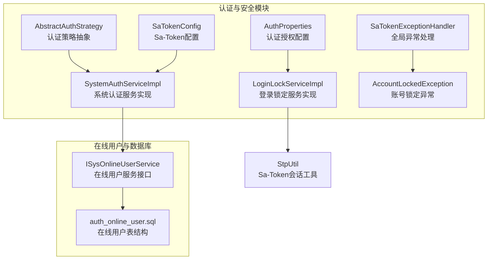
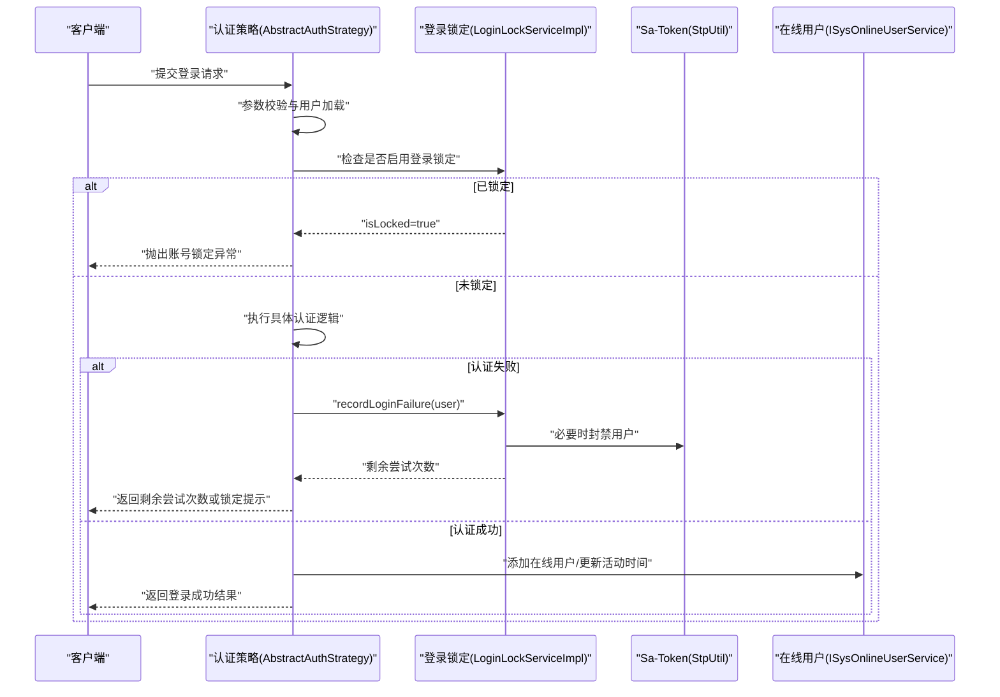
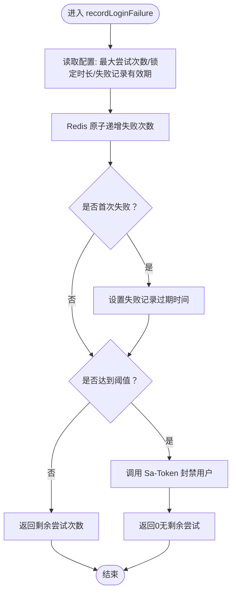
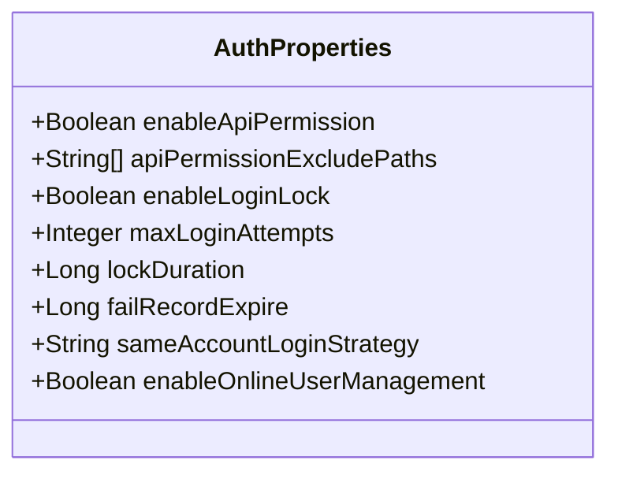
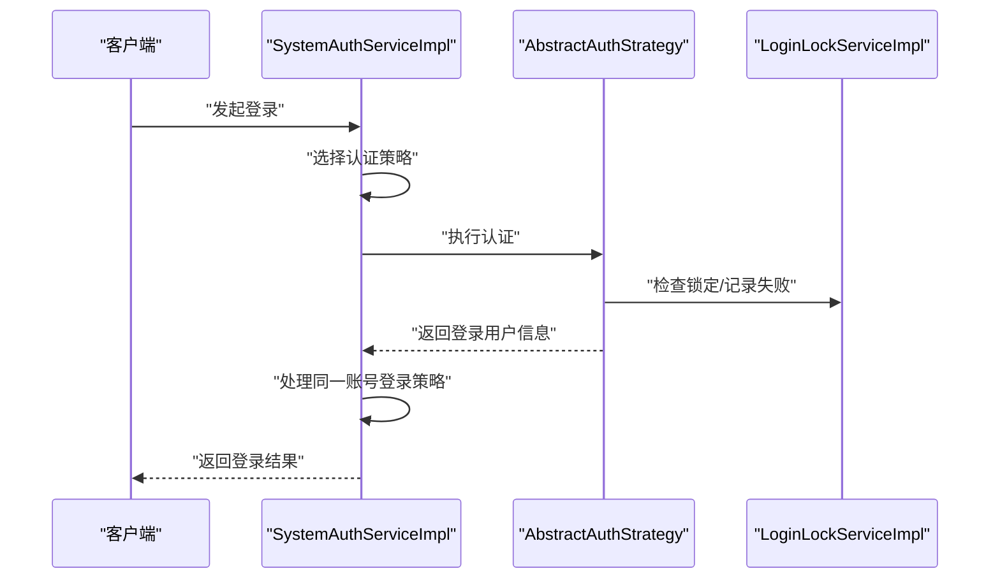
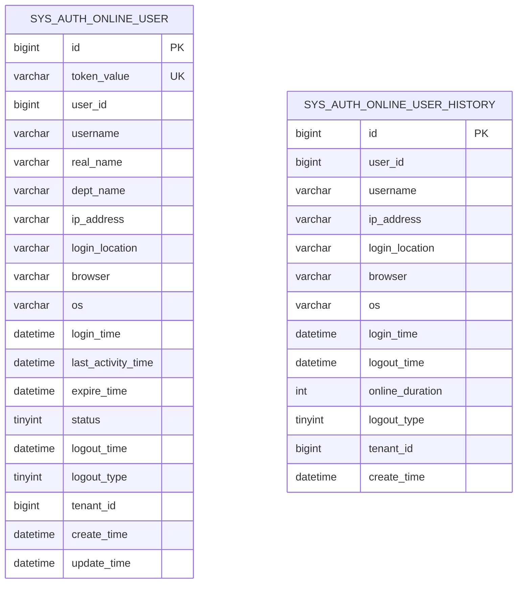
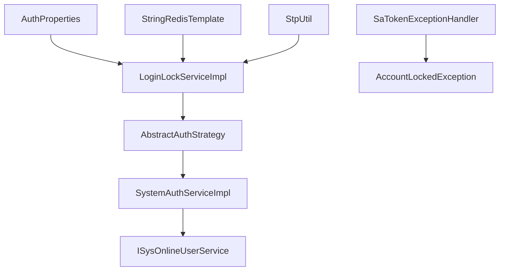

# 登录锁定与安全防护

<cite>
**本文档引用的文件**
- [LoginLockServiceImpl.java](file://forge/forge-framework/forge-starter-parent/forge-starter-auth/src/main/java/com/mdframe/forge/starter/auth/service/impl/LoginLockServiceImpl.java)
- [ILoginLockService.java](file://forge/forge-framework/forge-starter-parent/forge-starter-auth/src/main/java/com/mdframe/forge/starter/auth/service/ILoginLockService.java)
- [AuthProperties.java](file://forge/forge-framework/forge-starter-parent/forge-starter-core/src/main/java/com/mdframe/forge/starter/core/context/AuthProperties.java)
- [AbstractAuthStrategy.java](file://forge/forge-framework/forge-plugin-parent/forge-plugin-system/src/main/java/com/mdframe/forge/plugin/system/strategy/AbstractAuthStrategy.java)
- [SystemAuthServiceImpl.java](file://forge/forge-framework/forge-plugin-parent/forge-plugin-system/src/main/java/com/mdframe/forge/plugin/system/service/impl/SystemAuthServiceImpl.java)
- [SystemSaTokenListener.java](file://forge/forge-framework/forge-plugin-parent/forge-plugin-system/src/main/java/com/mdframe/forge/plugin/system/listener/SystemSaTokenListener.java)
- [SaTokenExceptionHandler.java](file://forge/forge-framework/forge-starter-parent/forge-starter-auth/src/main/java/com/mdframe/forge/starter/auth/exception/SaTokenExceptionHandler.java)
- [AccountLockedException.java](file://forge/forge-framework/forge-starter-parent/forge-starter-auth/src/main/java/com/mdframe/forge/starter/auth/exception/AccountLockedException.java)
- [auth_online_user.sql](file://forge/forge-framework/forge-starter-parent/forge-starter-auth/sql/auth_online_user.sql)
- [spring-configuration-metadata.json](file://forge/forge-framework/forge-starter-parent/forge-starter-auth/src/main/resources/META-INF/spring-configuration-metadata.json)
- [ConfigConverter.java](file://forge/forge-framework/forge-starter-parent/forge-starter-config/src/main/java/com/mdframe/forge/starter/config/converter/ConfigConverter.java)
- [config-center.vue](file://forge-admin-ui/src/views/system/config-center.vue)
- [SaTokenConfig.java](file://forge/forge-framework/forge-starter-parent/forge-starter-auth/src/main/java/com/mdframe/forge/starter/auth/config/SaTokenConfig.java)
</cite>

## 目录
1. [简介](#简介)
2. [项目结构](#项目结构)
3. [核心组件](#核心组件)
4. [架构总览](#架构总览)
5. [详细组件分析](#详细组件分析)
6. [依赖关系分析](#依赖关系分析)
7. [性能考虑](#性能考虑)
8. [故障排查指南](#故障排查指南)
9. [结论](#结论)
10. [附录](#附录)

## 简介
本技术文档聚焦于登录锁定与安全防护模块，深入解析 LoginLockServiceImpl 登录锁定服务的实现机制，涵盖失败次数统计、锁定阈值配置、自动解锁策略等核心功能；同时阐述登录锁定配置、在线用户管理、账户安全策略等安全防护措施，解释登录锁配置表结构、锁定规则定义、解锁条件判断等数据库设计，并提供完整的安全配置示例、锁定策略设置、异常处理机制，以及防暴力破解、会话管理、安全审计等高级安全特性与最佳实践。

## 项目结构
该模块位于 forge/forge-framework/forge-starter-parent/forge-starter-auth 与 forge/forge-framework/forge-plugin-parent/forge-plugin-system 中，围绕 Sa-Token 会话体系与 Redis 实现登录失败次数统计与账号锁定，结合系统认证策略与在线用户管理，形成完整的安全防护闭环。

**图表来源**
- [AuthProperties.java](file://forge/forge-framework/forge-starter-parent/forge-starter-core/src/main/java/com/mdframe/forge/starter/core/context/AuthProperties.java#L15-L68)
- [LoginLockServiceImpl.java](file://forge/forge-framework/forge-starter-parent/forge-starter-auth/src/main/java/com/mdframe/forge/starter/auth/service/impl/LoginLockServiceImpl.java#L21-L94)
- [AbstractAuthStrategy.java](file://forge/forge-framework/forge-plugin-parent/forge-plugin-system/src/main/java/com/mdframe/forge/plugin/system/strategy/AbstractAuthStrategy.java#L1-L123)
- [SystemAuthServiceImpl.java](file://forge/forge-framework/forge-plugin-parent/forge-plugin-system/src/main/java/com/mdframe/forge/plugin/system/service/impl/SystemAuthServiceImpl.java#L36-L101)
- [SaTokenExceptionHandler.java](file://forge/forge-framework/forge-starter-parent/forge-starter-auth/src/main/java/com/mdframe/forge/starter/auth/exception/SaTokenExceptionHandler.java#L1-L79)
- [AccountLockedException.java](file://forge/forge-framework/forge-starter-parent/forge-starter-auth/src/main/java/com/mdframe/forge/starter/auth/exception/AccountLockedException.java#L1-L26)
- [SaTokenConfig.java](file://forge/forge-framework/forge-starter-parent/forge-starter-auth/src/main/java/com/mdframe/forge/starter/auth/config/SaTokenConfig.java#L1-L70)
- [auth_online_user.sql](file://forge/forge-framework/forge-starter-parent/forge-starter-auth/sql/auth_online_user.sql#L1-L50)

**章节来源**
- [AuthProperties.java](file://forge/forge-framework/forge-starter-parent/forge-starter-core/src/main/java/com/mdframe/forge/starter/core/context/AuthProperties.java#L15-L68)
- [LoginLockServiceImpl.java](file://forge/forge-framework/forge-starter-parent/forge-starter-auth/src/main/java/com/mdframe/forge/starter/auth/service/impl/LoginLockServiceImpl.java#L21-L94)
- [AbstractAuthStrategy.java](file://forge/forge-framework/forge-plugin-parent/forge-plugin-system/src/main/java/com/mdframe/forge/plugin/system/strategy/AbstractAuthStrategy.java#L1-L123)
- [SystemAuthServiceImpl.java](file://forge/forge-framework/forge-plugin-parent/forge-plugin-system/src/main/java/com/mdframe/forge/plugin/system/service/impl/SystemAuthServiceImpl.java#L36-L101)
- [SaTokenExceptionHandler.java](file://forge/forge-framework/forge-starter-parent/forge-starter-auth/src/main/java/com/mdframe/forge/starter/auth/exception/SaTokenExceptionHandler.java#L1-L79)
- [AccountLockedException.java](file://forge/forge-framework/forge-starter-parent/forge-starter-auth/src/main/java/com/mdframe/forge/starter/auth/exception/AccountLockedException.java#L1-L26)
- [SaTokenConfig.java](file://forge/forge-framework/forge-starter-parent/forge-starter-auth/src/main/java/com/mdframe/forge/starter/auth/config/SaTokenConfig.java#L1-L70)
- [auth_online_user.sql](file://forge/forge-framework/forge-starter-parent/forge-starter-auth/sql/auth_online_user.sql#L1-L50)

## 核心组件
- 登录锁定服务接口与实现：定义并实现登录失败记录、锁定状态查询、自动解锁、剩余锁定时间查询与手动解锁等能力。
- 认证授权配置：集中管理登录锁定阈值、锁定时长、失败记录保留时长、同一账号登录策略、在线用户管理开关等。
- 认证策略与系统认证服务：在认证流程中集成登录锁定检查与用户状态校验，处理同一账号登录策略。
- 异常处理：对账号锁定等安全相关异常进行统一响应。
- 在线用户管理：维护在线用户表与历史表，支持会话审计与统计分析。
- Sa-Token 集成：通过 Sa-Token 进行会话管理、登录校验与封禁事件监听。

**章节来源**
- [ILoginLockService.java](file://forge/forge-framework/forge-starter-parent/forge-starter-auth/src/main/java/com/mdframe/forge/starter/auth/service/ILoginLockService.java#L9-L48)
- [LoginLockServiceImpl.java](file://forge/forge-framework/forge-starter-parent/forge-starter-auth/src/main/java/com/mdframe/forge/starter/auth/service/impl/LoginLockServiceImpl.java#L21-L94)
- [AuthProperties.java](file://forge/forge-framework/forge-starter-parent/forge-starter-core/src/main/java/com/mdframe/forge/starter/core/context/AuthProperties.java#L15-L68)
- [AbstractAuthStrategy.java](file://forge/forge-framework/forge-plugin-parent/forge-plugin-system/src/main/java/com/mdframe/forge/plugin/system/strategy/AbstractAuthStrategy.java#L90-L123)
- [SystemAuthServiceImpl.java](file://forge/forge-framework/forge-plugin-parent/forge-plugin-system/src/main/java/com/mdframe/forge/plugin/system/service/impl/SystemAuthServiceImpl.java#L48-L101)
- [SaTokenExceptionHandler.java](file://forge/forge-framework/forge-starter-parent/forge-starter-auth/src/main/java/com/mdframe/forge/starter/auth/exception/SaTokenExceptionHandler.java#L70-L77)
- [auth_online_user.sql](file://forge/forge-framework/forge-starter-parent/forge-starter-auth/sql/auth_online_user.sql#L1-L50)

## 架构总览
登录锁定与安全防护模块围绕以下关键点构建：
- 失败次数统计：使用 Redis 对每个用户的登录失败次数进行原子递增，并设置失败记录的有效期。
- 锁定阈值与自动解锁：当失败次数达到阈值时，通过 Sa-Token 将用户封禁指定时长，到期自动解封。
- 认证流程集成：在认证策略中检查锁定状态、记录失败、校验用户状态，并根据同一账号登录策略处理并发登录。
- 在线用户管理：维护在线用户表，记录登录、活动、登出等生命周期事件，支持审计与统计。
- 异常处理：对账号锁定异常进行统一响应，向客户端返回明确的错误码与提示。

**图表来源**
- [AbstractAuthStrategy.java](file://forge/forge-framework/forge-plugin-parent/forge-plugin-system/src/main/java/com/mdframe/forge/plugin/system/strategy/AbstractAuthStrategy.java#L90-L123)
- [LoginLockServiceImpl.java](file://forge/forge-framework/forge-starter-parent/forge-starter-auth/src/main/java/com/mdframe/forge/starter/auth/service/impl/LoginLockServiceImpl.java#L36-L87)
- [SystemAuthServiceImpl.java](file://forge/forge-framework/forge-plugin-parent/forge-plugin-system/src/main/java/com/mdframe/forge/plugin/system/service/impl/SystemAuthServiceImpl.java#L48-L101)

## 详细组件分析

### 登录锁定服务实现 LoginLockServiceImpl
- 失败次数统计：使用 Redis 的字符串计数器，按用户维度递增失败次数，并在首次失败时设置失败记录的过期时间。
- 锁定阈值与自动解锁：当失败次数达到配置阈值时，通过 Sa-Token 将用户封禁指定分钟数；封禁结束后自动解封。
- 状态查询与清理：提供锁定状态查询、剩余锁定时间查询、手动解锁与登录成功后的失败记录清理。
- 关键点：
  - Redis Key 前缀区分“失败记录”与“锁定状态”，避免冲突。
  - 失败记录有效期用于限制统计窗口，防止跨时间段的失败次数叠加。
  - 封禁时长来自配置，单位转换为秒传入 Sa-Token。

**图表来源**
- [LoginLockServiceImpl.java](file://forge/forge-framework/forge-starter-parent/forge-starter-auth/src/main/java/com/mdframe/forge/starter/auth/service/impl/LoginLockServiceImpl.java#L36-L66)

**章节来源**
- [LoginLockServiceImpl.java](file://forge/forge-framework/forge-starter-parent/forge-starter-auth/src/main/java/com/mdframe/forge/starter/auth/service/impl/LoginLockServiceImpl.java#L21-L94)

### 登录锁定服务接口 ILoginLockService
- 定义了记录登录失败、检查锁定状态、清除失败记录、获取剩余锁定时间、手动解锁等方法，便于替换实现与测试。

**章节来源**
- [ILoginLockService.java](file://forge/forge-framework/forge-starter-parent/forge-starter-auth/src/main/java/com/mdframe/forge/starter/auth/service/ILoginLockService.java#L9-L48)

### 认证授权配置 AuthProperties
- 配置项包括：是否启用登录锁定、最大登录失败尝试次数、账号锁定时长、登录失败记录保留时长、同一账号登录策略、是否启用在线用户管理等。
- 支持通过配置中心动态刷新，前端配置中心页面提供可视化编辑。

**图表来源**
- [AuthProperties.java](file://forge/forge-framework/forge-starter-parent/forge-starter-core/src/main/java/com/mdframe/forge/starter/core/context/AuthProperties.java#L15-L68)

**章节来源**
- [AuthProperties.java](file://forge/forge-framework/forge-starter-parent/forge-starter-core/src/main/java/com/mdframe/forge/starter/core/context/AuthProperties.java#L15-L68)
- [spring-configuration-metadata.json](file://forge/forge-framework/forge-starter-parent/forge-starter-auth/src/main/resources/META-INF/spring-configuration-metadata.json#L1-L52)
- [config-center.vue](file://forge-admin-ui/src/views/system/config-center.vue#L432-L462)

### 认证策略与系统认证服务
- 认证策略抽象：封装通用逻辑，包括账号锁定检查、登录失败记录、用户状态检查、登录成功处理等。
- 系统认证服务：在登录流程中选择认证策略、处理同一账号登录策略、执行 Sa-Token 登录、构建登录结果。

**图表来源**
- [SystemAuthServiceImpl.java](file://forge/forge-framework/forge-plugin-parent/forge-plugin-system/src/main/java/com/mdframe/forge/plugin/system/service/impl/SystemAuthServiceImpl.java#L48-L101)
- [AbstractAuthStrategy.java](file://forge/forge-framework/forge-plugin-parent/forge-plugin-system/src/main/java/com/mdframe/forge/plugin/system/strategy/AbstractAuthStrategy.java#L38-L108)

**章节来源**
- [AbstractAuthStrategy.java](file://forge/forge-framework/forge-plugin-parent/forge-plugin-system/src/main/java/com/mdframe/forge/plugin/system/strategy/AbstractAuthStrategy.java#L90-L123)
- [SystemAuthServiceImpl.java](file://forge/forge-framework/forge-plugin-parent/forge-plugin-system/src/main/java/com/mdframe/forge/plugin/system/service/impl/SystemAuthServiceImpl.java#L48-L101)

### 在线用户管理与数据库设计
- 在线用户表：记录 Token 值、用户 ID/名称、登录 IP/地点、浏览器/操作系统、登录时间、最后活动时间、Token 过期时间、状态、登出时间与类型、租户 ID 等。
- 历史表：用于统计分析，记录每次登录的完整生命周期。
- 索引设计：包含唯一索引与多列索引，支撑查询与统计。

**图表来源**
- [auth_online_user.sql](file://forge/forge-framework/forge-starter-parent/forge-starter-auth/sql/auth_online_user.sql#L1-L50)

**章节来源**
- [auth_online_user.sql](file://forge/forge-framework/forge-starter-parent/forge-starter-auth/sql/auth_online_user.sql#L1-L50)

### 异常处理与账号锁定异常
- 全局异常处理器：针对未登录、权限不足、角色不足等 Sa-Token 异常进行统一响应。
- 账号锁定异常：当用户被锁定时，抛出账号锁定异常，携带剩余锁定时间，前端可据此提示用户。

**章节来源**
- [SaTokenExceptionHandler.java](file://forge/forge-framework/forge-starter-parent/forge-starter-auth/src/main/java/com/mdframe/forge/starter/auth/exception/SaTokenExceptionHandler.java#L70-L77)
- [AccountLockedException.java](file://forge/forge-framework/forge-starter-parent/forge-starter-auth/src/main/java/com/mdframe/forge/starter/auth/exception/AccountLockedException.java#L1-L26)

### Sa-Token 集成与监听器
- Sa-Token 配置：注册登录校验拦截器与 API 权限拦截器，排除登录、注册、验证码、静态资源、健康检查等路径。
- 监听器：监听封禁与解封事件，同步更新用户状态与清理登录失败记录。

**章节来源**
- [SaTokenConfig.java](file://forge/forge-framework/forge-starter-parent/forge-starter-auth/src/main/java/com/mdframe/forge/starter/auth/config/SaTokenConfig.java#L26-L68)
- [SystemSaTokenListener.java](file://forge/forge-framework/forge-plugin-parent/forge-plugin-system/src/main/java/com/mdframe/forge/plugin/system/listener/SystemSaTokenListener.java#L87-L130)

## 依赖关系分析
- LoginLockServiceImpl 依赖 AuthProperties 提供配置，依赖 StringRedisTemplate 进行失败次数统计，依赖 StpUtil 进行封禁与状态查询。
- AbstractAuthStrategy 依赖 ILoginLockService 与 AuthProperties，负责在认证流程中集成登录锁定与用户状态检查。
- SystemAuthServiceImpl 依赖在线用户服务与配置管理，负责同一账号登录策略处理与登录结果构建。
- SaTokenExceptionHandler 依赖 AccountLockedException 进行统一响应。

**图表来源**
- [LoginLockServiceImpl.java](file://forge/forge-framework/forge-starter-parent/forge-starter-auth/src/main/java/com/mdframe/forge/starter/auth/service/impl/LoginLockServiceImpl.java#L21-L94)
- [AbstractAuthStrategy.java](file://forge/forge-framework/forge-plugin-parent/forge-plugin-system/src/main/java/com/mdframe/forge/plugin/system/strategy/AbstractAuthStrategy.java#L25-L32)
- [SystemAuthServiceImpl.java](file://forge/forge-framework/forge-plugin-parent/forge-plugin-system/src/main/java/com/mdframe/forge/plugin/system/service/impl/SystemAuthServiceImpl.java#L38-L44)
- [SaTokenExceptionHandler.java](file://forge/forge-framework/forge-starter-parent/forge-starter-auth/src/main/java/com/mdframe/forge/starter/auth/exception/SaTokenExceptionHandler.java#L70-L77)

**章节来源**
- [LoginLockServiceImpl.java](file://forge/forge-framework/forge-starter-parent/forge-starter-auth/src/main/java/com/mdframe/forge/starter/auth/service/impl/LoginLockServiceImpl.java#L21-L94)
- [AbstractAuthStrategy.java](file://forge/forge-framework/forge-plugin-parent/forge-plugin-system/src/main/java/com/mdframe/forge/plugin/system/strategy/AbstractAuthStrategy.java#L25-L32)
- [SystemAuthServiceImpl.java](file://forge/forge-framework/forge-plugin-parent/forge-plugin-system/src/main/java/com/mdframe/forge/plugin/system/service/impl/SystemAuthServiceImpl.java#L38-L44)
- [SaTokenExceptionHandler.java](file://forge/forge-framework/forge-starter-parent/forge-starter-auth/src/main/java/com/mdframe/forge/starter/auth/exception/SaTokenExceptionHandler.java#L70-L77)

## 性能考虑
- Redis 计数与过期：使用原子递增与过期时间控制统计窗口，降低内存占用与查询压力。
- 封禁与解封：通过 Sa-Token 的封禁机制实现，无需轮询，减少 CPU 开销。
- 拦截器顺序：登录校验优先于权限校验，减少不必要的权限检查开销。
- 在线用户表索引：合理索引提升查询与统计效率，建议结合实际业务量评估索引策略。

## 故障排查指南
- 登录失败次数未清零：确认登录成功后调用了清理方法，或等待失败记录过期。
- 账号仍被锁定：检查剩余锁定时间，确认 Sa-Token 封禁是否生效；如需手动解锁，调用手动解锁接口。
- 配置不生效：确认配置中心已正确下发配置，且应用启用了配置刷新；检查前端配置中心页面的配置项。
- 在线用户统计异常：核对在线用户表与历史表的数据一致性，检查索引与查询条件。

**章节来源**
- [LoginLockServiceImpl.java](file://forge/forge-framework/forge-starter-parent/forge-starter-auth/src/main/java/com/mdframe/forge/starter/auth/service/impl/LoginLockServiceImpl.java#L74-L93)
- [SystemSaTokenListener.java](file://forge/forge-framework/forge-plugin-parent/forge-plugin-system/src/main/java/com/mdframe/forge/plugin/system/listener/SystemSaTokenListener.java#L101-L108)
- [ConfigConverter.java](file://forge/forge-framework/forge-starter-parent/forge-starter-config/src/main/java/com/mdframe/forge/starter/config/converter/ConfigConverter.java#L116-L138)

## 结论
登录锁定与安全防护模块通过 Redis 与 Sa-Token 的组合实现了高效的登录失败统计与自动封禁，配合认证策略与在线用户管理，形成了完善的防暴力破解与会话安全体系。合理的配置项与可视化配置中心使得安全策略具备良好的可运维性与可扩展性。

## 附录

### 安全配置示例
- 登录锁定阈值：最大登录失败尝试次数
- 账号锁定时长：锁定时长（分钟）
- 失败记录保留时长：失败记录有效期（分钟）
- 同一账号登录策略：允许并发、新登录踢出旧登录、拒绝新登录
- 在线用户管理：是否启用在线用户管理

**章节来源**
- [AuthProperties.java](file://forge/forge-framework/forge-starter-parent/forge-starter-core/src/main/java/com/mdframe/forge/starter/core/context/AuthProperties.java#L36-L67)
- [config-center.vue](file://forge-admin-ui/src/views/system/config-center.vue#L432-L462)

### 锁定策略设置
- 自动锁定：达到失败阈值后自动封禁用户
- 自动解锁：封禁时长到期后自动解封
- 手动解锁：管理员手动解除锁定并清理失败记录

**章节来源**
- [LoginLockServiceImpl.java](file://forge/forge-framework/forge-starter-parent/forge-starter-auth/src/main/java/com/mdframe/forge/starter/auth/service/impl/LoginLockServiceImpl.java#L57-L93)
- [SystemSaTokenListener.java](file://forge/forge-framework/forge-plugin-parent/forge-plugin-system/src/main/java/com/mdframe/forge/plugin/system/listener/SystemSaTokenListener.java#L101-L108)

### 异常处理机制
- 未登录/登录过期：统一返回 401
- 权限不足/角色不足：统一返回 403
- 账号锁定：统一返回 423，包含剩余锁定时间

**章节来源**
- [SaTokenExceptionHandler.java](file://forge/forge-framework/forge-starter-parent/forge-starter-auth/src/main/java/com/mdframe/forge/starter/auth/exception/SaTokenExceptionHandler.java#L26-L77)