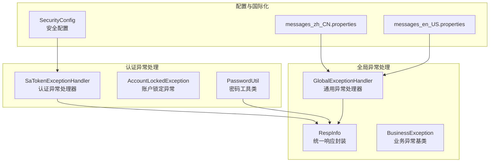
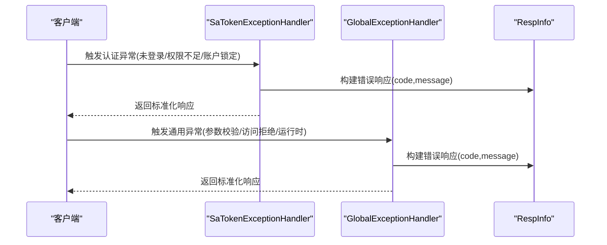
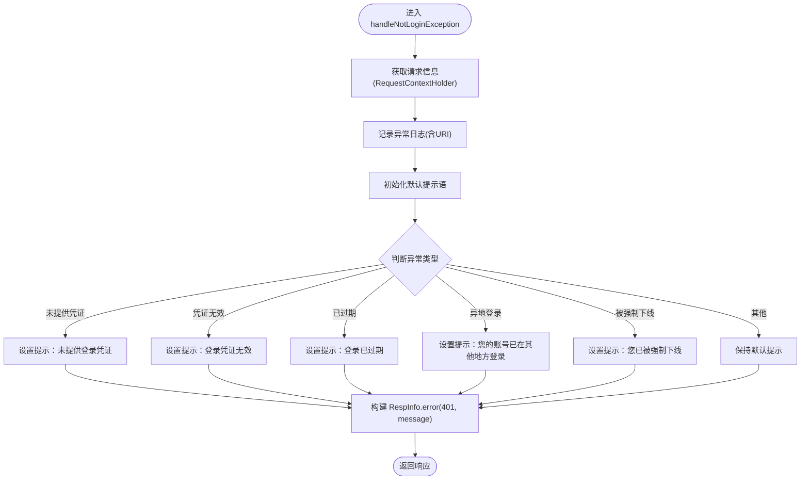
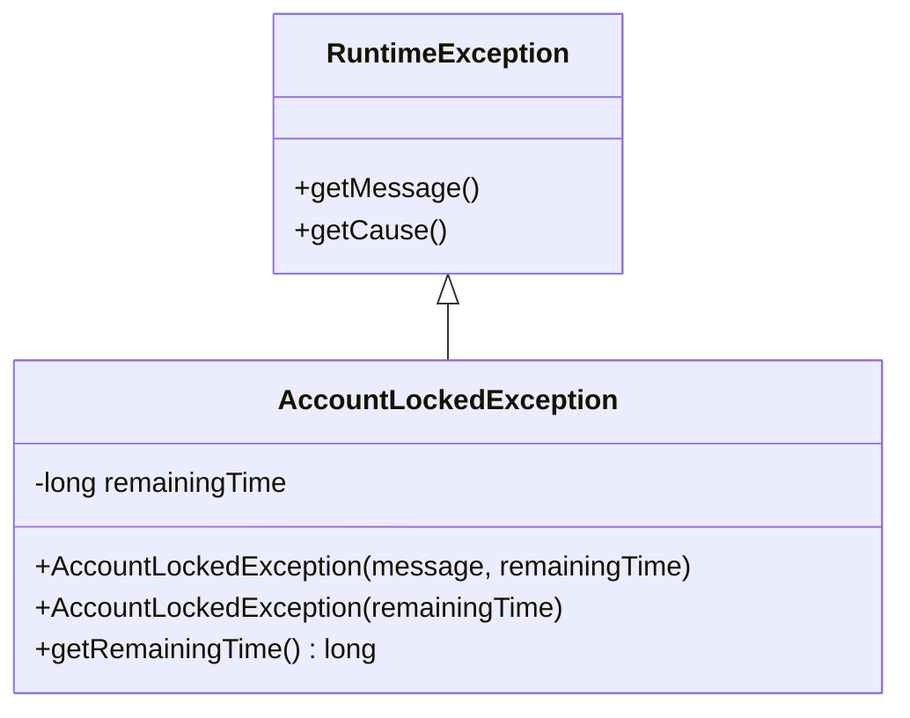
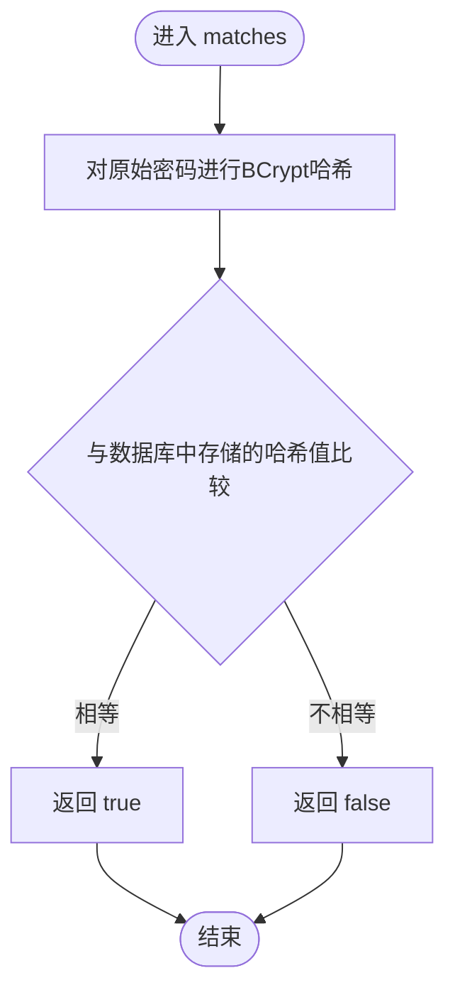
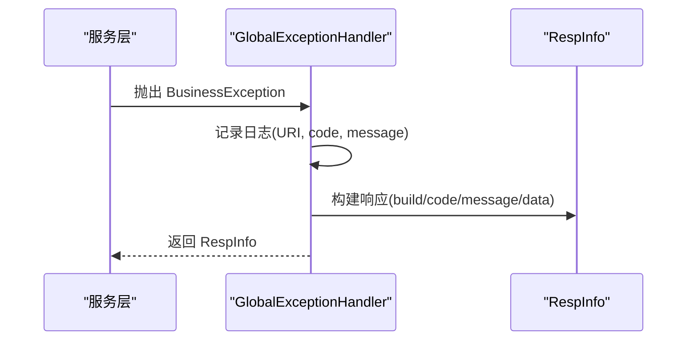
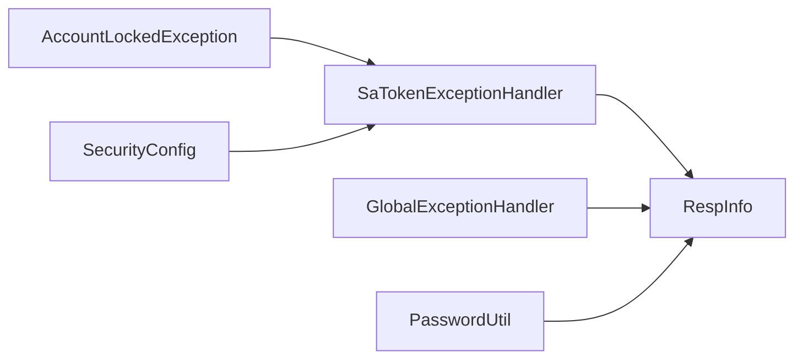

# 认证异常处理

<cite>
**本文引用的文件**
- [SaTokenExceptionHandler.java](file://forge/forge-framework/forge-starter-parent/forge-starter-auth/src/main/java/com/mdframe/forge/starter/auth/exception/SaTokenExceptionHandler.java)
- [AccountLockedException.java](file://forge/forge-framework/forge-starter-parent/forge-starter-auth/src/main/java/com/mdframe/forge/starter/auth/exception/AccountLockedException.java)
- [PasswordUtil.java](file://forge/forge-framework/forge-starter-parent/forge-starter-auth/src/main/java/com/mdframe/forge/starter/auth/util/PasswordUtil.java)
- [GlobalExceptionHandler.java](file://forge/forge-framework/forge-starter-parent/forge-starter-core/src/main/java/com/mdframe/forge/starter/core/exception/GlobalExceptionHandler.java)
- [BusinessException.java](file://forge/forge-framework/forge-starter-parent/forge-starter-core/src/main/java/com/mdframe/forge/starter/core/exception/BusinessException.java)
- [RespInfo.java](file://forge/forge-framework/forge-starter-parent/forge-starter-core/src/main/java/com/mdframe/forge/starter/core/domain/RespInfo.java)
- [SecurityConfig.java](file://forge/forge-framework/forge-starter-parent/forge-starter-config/src/main/java/com/mdframe/forge/starter/config/config/SecurityConfig.java)
- [messages_zh_CN.properties](file://forge/forge-admin/src/main/resources/i18n/messages_zh_CN.properties)
- [messages_en_US.properties](file://forge/forge-admin/src/main/resources/i18n/messages_en_US.properties)
</cite>

## 目录
1. [简介](#简介)
2. [项目结构](#项目结构)
3. [核心组件](#核心组件)
4. [架构总览](#架构总览)
5. [详细组件分析](#详细组件分析)
6. [依赖关系分析](#依赖关系分析)
7. [性能与安全考量](#性能与安全考量)
8. [故障排查指南](#故障排查指南)
9. [结论](#结论)
10. [附录](#附录)

## 简介
本技术文档聚焦于认证异常处理模块，系统性解析 Sa-Token 全局异常处理器的实现机制，覆盖认证异常分类、错误信息封装、响应格式标准化等核心能力；深入说明账户锁定、密码验证、令牌过期等认证相关异常的处理策略；解释密码加密工具类的实现原理、密码强度验证与安全存储机制；并提供完整的异常处理配置示例、自定义异常定义、国际化错误信息支持方案，以及异常日志记录、安全审计与用户体验优化的关键特性。

## 项目结构
认证异常处理相关代码主要分布在以下模块与包中：
- 认证异常处理器：forge-starter-auth 异常包
- 全局异常处理器：forge-starter-core 异常与响应包
- 密码工具与策略：forge-starter-auth util 与 config 安全配置
- 国际化资源：forge-admin i18n

图表来源
- [SaTokenExceptionHandler.java](file://forge/forge-framework/forge-starter-parent/forge-starter-auth/src/main/java/com/mdframe/forge/starter/auth/exception/SaTokenExceptionHandler.java#L1-L79)
- [GlobalExceptionHandler.java](file://forge/forge-framework/forge-starter-parent/forge-starter-core/src/main/java/com/mdframe/forge/starter/core/exception/GlobalExceptionHandler.java#L1-L175)
- [RespInfo.java](file://forge/forge-framework/forge-starter-parent/forge-starter-core/src/main/java/com/mdframe/forge/starter/core/domain/RespInfo.java#L1-L97)
- [BusinessException.java](file://forge/forge-framework/forge-starter-parent/forge-starter-core/src/main/java/com/mdframe/forge/starter/core/exception/BusinessException.java#L1-L86)
- [PasswordUtil.java](file://forge/forge-framework/forge-starter-parent/forge-starter-auth/src/main/java/com/mdframe/forge/starter/auth/util/PasswordUtil.java#L1-L30)
- [SecurityConfig.java](file://forge/forge-framework/forge-starter-parent/forge-starter-config/src/main/java/com/mdframe/forge/starter/config/config/SecurityConfig.java#L1-L113)
- [messages_zh_CN.properties](file://forge/forge-admin/src/main/resources/i18n/messages_zh_CN.properties)
- [messages_en_US.properties](file://forge/forge-admin/src/main/resources/i18n/messages_en_US.properties)

章节来源
- [SaTokenExceptionHandler.java](file://forge/forge-framework/forge-starter-parent/forge-starter-auth/src/main/java/com/mdframe/forge/starter/auth/exception/SaTokenExceptionHandler.java#L1-L79)
- [GlobalExceptionHandler.java](file://forge/forge-framework/forge-starter-parent/forge-starter-core/src/main/java/com/mdframe/forge/starter/core/exception/GlobalExceptionHandler.java#L1-L175)
- [RespInfo.java](file://forge/forge-framework/forge-starter-parent/forge-starter-core/src/main/java/com/mdframe/forge/starter/core/domain/RespInfo.java#L1-L97)
- [BusinessException.java](file://forge/forge-framework/forge-starter-parent/forge-starter-core/src/main/java/com/mdframe/forge/starter/core/exception/BusinessException.java#L1-L86)
- [PasswordUtil.java](file://forge/forge-framework/forge-starter-parent/forge-starter-auth/src/main/java/com/mdframe/forge/starter/auth/util/PasswordUtil.java#L1-L30)
- [SecurityConfig.java](file://forge/forge-framework/forge-starter-parent/forge-starter-config/src/main/java/com/mdframe/forge/starter/config/config/SecurityConfig.java#L1-L113)
- [messages_zh_CN.properties](file://forge/forge-admin/src/main/resources/i18n/messages_zh_CN.properties)
- [messages_en_US.properties](file://forge/forge-admin/src/main/resources/i18n/messages_en_US.properties)

## 核心组件
- Sa-Token 全局异常处理器：统一捕获未登录、权限不足、角色不足、账户锁定等认证相关异常，输出标准化响应。
- 全局异常处理器：统一处理业务异常、参数校验、访问拒绝、文件上传大小限制、运行时异常等，保证系统异常响应一致性。
- 统一响应封装 RespInfo：定义标准响应结构，包含状态码、消息、数据与时间戳，便于前端统一消费。
- 密码工具 PasswordUtil：基于 BCrypt 的密码加密与校验，保障密码安全存储与验证。
- 安全配置 SecurityConfig：集中管理 Sa-Token 令牌策略与密码策略，支持最小长度、字符要求、过期天数、历史记录等。
- 国际化资源：通过多语言属性文件支持错误信息本地化。

章节来源
- [SaTokenExceptionHandler.java](file://forge/forge-framework/forge-starter-parent/forge-starter-auth/src/main/java/com/mdframe/forge/starter/auth/exception/SaTokenExceptionHandler.java#L16-L79)
- [GlobalExceptionHandler.java](file://forge/forge-framework/forge-starter-parent/forge-starter-core/src/main/java/com/mdframe/forge/starter/core/exception/GlobalExceptionHandler.java#L24-L175)
- [RespInfo.java](file://forge/forge-framework/forge-starter-parent/forge-starter-core/src/main/java/com/mdframe/forge/starter/core/domain/RespInfo.java#L9-L97)
- [PasswordUtil.java](file://forge/forge-framework/forge-starter-parent/forge-starter-auth/src/main/java/com/mdframe/forge/starter/auth/util/PasswordUtil.java#L1-L30)
- [SecurityConfig.java](file://forge/forge-framework/forge-starter-parent/forge-starter-config/src/main/java/com/mdframe/forge/starter/config/config/SecurityConfig.java#L1-L113)
- [messages_zh_CN.properties](file://forge/forge-admin/src/main/resources/i18n/messages_zh_CN.properties)
- [messages_en_US.properties](file://forge/forge-admin/src/main/resources/i18n/messages_en_US.properties)

## 架构总览
认证异常处理采用“分层异常处理器 + 统一响应封装”的设计，认证层由 Sa-Token 全局异常处理器负责，通用层由全局异常处理器负责，两者协同输出一致的响应格式。

图表来源
- [SaTokenExceptionHandler.java](file://forge/forge-framework/forge-starter-parent/forge-starter-auth/src/main/java/com/mdframe/forge/starter/auth/exception/SaTokenExceptionHandler.java#L26-L79)
- [GlobalExceptionHandler.java](file://forge/forge-framework/forge-starter-parent/forge-starter-core/src/main/java/com/mdframe/forge/starter/core/exception/GlobalExceptionHandler.java#L35-L175)
- [RespInfo.java](file://forge/forge-framework/forge-starter-parent/forge-starter-core/src/main/java/com/mdframe/forge/starter/core/domain/RespInfo.java#L41-L96)

## 详细组件分析

### Sa-Token 全局异常处理器
- 功能职责
  - 捕获未登录异常：区分“未提供凭证”“凭证无效”“已过期”“异地登录”“被强制下线”等场景，输出不同提示语。
  - 捕获权限不足与角色不足异常：统一返回 403 及相应提示。
  - 捕获账户锁定异常：输出 423 状态码与剩余锁定时间信息。
  - 日志记录：记录异常详情与请求地址，便于审计与定位问题。
  - 响应格式：统一使用 RespInfo.error(code, message) 输出标准化响应。

- 关键流程图（未登录异常细化）

图表来源
- [SaTokenExceptionHandler.java](file://forge/forge-framework/forge-starter-parent/forge-starter-auth/src/main/java/com/mdframe/forge/starter/auth/exception/SaTokenExceptionHandler.java#L26-L50)

章节来源
- [SaTokenExceptionHandler.java](file://forge/forge-framework/forge-starter-parent/forge-starter-auth/src/main/java/com/mdframe/forge/starter/auth/exception/SaTokenExceptionHandler.java#L16-L79)

### 账户锁定异常 AccountLockedException
- 设计要点
  - 继承 RuntimeException，携带剩余锁定时间字段，便于前端展示倒计时。
  - 支持两种构造方式：传入剩余秒数自动格式化消息，或自定义消息。
  - 处理器捕获后返回 423 状态码与异常消息，体现“锁定”语义。

- 类关系图

图表来源
- [AccountLockedException.java](file://forge/forge-framework/forge-starter-parent/forge-starter-auth/src/main/java/com/mdframe/forge/starter/auth/exception/AccountLockedException.java#L1-L26)

章节来源
- [AccountLockedException.java](file://forge/forge-framework/forge-starter-parent/forge-starter-auth/src/main/java/com/mdframe/forge/starter/auth/exception/AccountLockedException.java#L1-L26)
- [SaTokenExceptionHandler.java](file://forge/forge-framework/forge-starter-parent/forge-starter-auth/src/main/java/com/mdframe/forge/starter/auth/exception/SaTokenExceptionHandler.java#L73-L77)

### 密码工具类 PasswordUtil
- 实现原理
  - 使用 BCrypt 进行密码哈希，生成带盐的哈希值，确保相同明文每次生成不同哈希。
  - 提供 encrypt(raw) 与 matches(raw, encoded) 两个核心方法，分别用于加密与校验。
- 安全存储机制
  - 明文仅在内存中短暂存在，持久化存储的是哈希值，破解成本极高。
  - 与 Sa-Token 令牌策略配合，避免明文密码泄露风险。

- 流程图（密码校验）

图表来源
- [PasswordUtil.java](file://forge/forge-framework/forge-starter-parent/forge-starter-auth/src/main/java/com/mdframe/forge/starter/auth/util/PasswordUtil.java#L16-L29)

章节来源
- [PasswordUtil.java](file://forge/forge-framework/forge-starter-parent/forge-starter-auth/src/main/java/com/mdframe/forge/starter/auth/util/PasswordUtil.java#L1-L30)

### 密码策略与安全配置
- 密码策略配置项
  - 最小长度、是否包含大/小写字母、数字、特殊字符、过期天数、历史记录数量。
- Sa-Token 令牌策略配置项
  - 令牌有效期、二次无操作过期、是否允许并发登录、是否共享令牌、读取来源（body/header/cookie）、令牌前缀与名称。
- 配置示例（说明性描述）
  - 在应用配置中引入 SecurityConfig，按需调整各策略参数，以满足不同业务的安全要求。
  - 前端可通过配置中心界面动态调整密码策略与认证策略，实时生效。

章节来源
- [SecurityConfig.java](file://forge/forge-framework/forge-starter-parent/forge-starter-config/src/main/java/com/mdframe/forge/starter/config/config/SecurityConfig.java#L24-L111)

### 全局异常处理器与统一响应
- 全局异常处理器
  - 统一处理业务异常、参数校验、访问拒绝、文件上传大小限制、运行时异常等，输出标准化响应。
  - 业务异常 BusinessException 支持自定义 code、message、data，便于精细化错误承载。
- 统一响应 RespInfo
  - 结构包含 code、message、data、timestamp，提供 success/error/build 多种静态工厂方法，简化响应构造。

- 序列图（业务异常处理）

图表来源
- [GlobalExceptionHandler.java](file://forge/forge-framework/forge-starter-parent/forge-starter-core/src/main/java/com/mdframe/forge/starter/core/exception/GlobalExceptionHandler.java#L35-L42)
- [BusinessException.java](file://forge/forge-framework/forge-starter-parent/forge-starter-core/src/main/java/com/mdframe/forge/starter/core/exception/BusinessException.java#L41-L52)
- [RespInfo.java](file://forge/forge-framework/forge-starter-parent/forge-starter-core/src/main/java/com/mdframe/forge/starter/core/domain/RespInfo.java#L93-L95)

章节来源
- [GlobalExceptionHandler.java](file://forge/forge-framework/forge-starter-parent/forge-starter-core/src/main/java/com/mdframe/forge/starter/core/exception/GlobalExceptionHandler.java#L24-L175)
- [BusinessException.java](file://forge/forge-framework/forge-starter-parent/forge-starter-core/src/main/java/com/mdframe/forge/starter/core/exception/BusinessException.java#L1-L86)
- [RespInfo.java](file://forge/forge-framework/forge-starter-parent/forge-starter-core/src/main/java/com/mdframe/forge/starter/core/domain/RespInfo.java#L1-L97)

### 国际化错误信息支持
- 资源文件
  - messages_zh_CN.properties：简体中文错误信息
  - messages_en_US.properties：英文错误信息
- 使用建议
  - 在异常处理器中结合 Spring MessageSource 获取本地化消息，提升多语言环境下的用户体验。
  - 建议将常用错误码与消息键对应，便于前端统一展示。

章节来源
- [messages_zh_CN.properties](file://forge/forge-admin/src/main/resources/i18n/messages_zh_CN.properties)
- [messages_en_US.properties](file://forge/forge-admin/src/main/resources/i18n/messages_en_US.properties)

## 依赖关系分析
- 组件耦合
  - SaTokenExceptionHandler 依赖 RespInfo 进行响应封装，依赖 Sa-Token 异常类型进行分类处理。
  - GlobalExceptionHandler 同样依赖 RespInfo，作为系统级异常兜底。
  - PasswordUtil 与 SecurityConfig 独立存在，但通过业务层与认证流程间接影响异常处理体验。
- 外部依赖
  - Sa-Token：提供 NotLoginException、NotPermissionException、NotRoleException 等认证异常类型。
  - Hutool BCrypt：提供密码哈希与校验能力。
  - Spring MVC：通过@RestControllerAdvice 统一拦截异常。

图表来源
- [SaTokenExceptionHandler.java](file://forge/forge-framework/forge-starter-parent/forge-starter-auth/src/main/java/com/mdframe/forge/starter/auth/exception/SaTokenExceptionHandler.java#L1-L79)
- [GlobalExceptionHandler.java](file://forge/forge-framework/forge-starter-parent/forge-starter-core/src/main/java/com/mdframe/forge/starter/core/exception/GlobalExceptionHandler.java#L1-L175)
- [RespInfo.java](file://forge/forge-framework/forge-starter-parent/forge-starter-core/src/main/java/com/mdframe/forge/starter/core/domain/RespInfo.java#L1-L97)
- [AccountLockedException.java](file://forge/forge-framework/forge-starter-parent/forge-starter-auth/src/main/java/com/mdframe/forge/starter/auth/exception/AccountLockedException.java#L1-L26)
- [PasswordUtil.java](file://forge/forge-framework/forge-starter-parent/forge-starter-auth/src/main/java/com/mdframe/forge/starter/auth/util/PasswordUtil.java#L1-L30)
- [SecurityConfig.java](file://forge/forge-framework/forge-starter-parent/forge-starter-config/src/main/java/com/mdframe/forge/starter/config/config/SecurityConfig.java#L1-L113)

## 性能与安全考量
- 性能
  - 异常处理器仅做轻量处理与日志记录，避免在异常路径上执行重型计算。
  - RespInfo 使用 JSON 序列化时忽略空字段，减少响应体积。
- 安全
  - 密码使用 BCrypt 哈希存储，防止明文泄露。
  - Sa-Token 令牌策略可配置并发登录与共享策略，降低会话滥用风险。
  - 异常日志记录包含请求 URI，便于追踪攻击行为，但需注意敏感信息脱敏。

[本节为通用指导，无需列出具体文件来源]

## 故障排查指南
- 常见问题
  - 未登录/登录过期：检查令牌是否正确携带、令牌前缀与名称配置是否一致、令牌有效期是否合理。
  - 权限不足/角色不足：核对用户权限与角色配置，确认 API 权限排除路径配置。
  - 账户锁定：查看账户锁定剩余时间，确认锁定策略与阈值配置。
  - 密码校验失败：确认密码加密策略与历史记录策略，避免重复使用旧密码。
- 排查步骤
  - 查看异常日志中的请求 URI 与异常类型，定位具体接口。
  - 核对 SecurityConfig 中的 Sa-Token 与密码策略配置。
  - 使用 RespInfo 的错误响应结构，确认前后端交互格式一致。

章节来源
- [SaTokenExceptionHandler.java](file://forge/forge-framework/forge-starter-parent/forge-starter-auth/src/main/java/com/mdframe/forge/starter/auth/exception/SaTokenExceptionHandler.java#L26-L79)
- [GlobalExceptionHandler.java](file://forge/forge-framework/forge-starter-parent/forge-starter-core/src/main/java/com/mdframe/forge/starter/core/exception/GlobalExceptionHandler.java#L35-L175)
- [SecurityConfig.java](file://forge/forge-framework/forge-starter-parent/forge-starter-config/src/main/java/com/mdframe/forge/starter/config/config/SecurityConfig.java#L24-L111)

## 结论
认证异常处理模块通过 Sa-Token 全局异常处理器与全局异常处理器形成双层保障，结合统一响应封装与密码安全工具，实现了认证异常的分类处理、标准化输出与安全存储。配合可配置的密码策略与令牌策略，能够灵活适配不同业务场景的安全需求。建议在生产环境中开启异常日志与审计记录，持续监控异常趋势，优化用户体验与系统安全性。

[本节为总结性内容，无需列出具体文件来源]

## 附录
- 自定义异常定义建议
  - 业务异常：继承 BusinessException，设置合理的 code 与 message，并在需要时附加 data。
  - 认证异常：可参考 AccountLockedException 的设计，携带与锁定/时效相关的上下文信息。
- 国际化集成建议
  - 将错误消息键与业务模块解耦，通过 MessageSource 获取本地化文本，提升多语言支持能力。
- 配置示例（说明性描述）
  - 在应用配置中引入 SecurityConfig，按需调整 Sa-Token 令牌有效期、并发策略、读取来源与密码策略参数。

[本节为通用指导，无需列出具体文件来源]