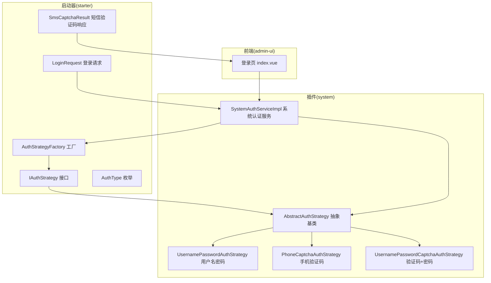
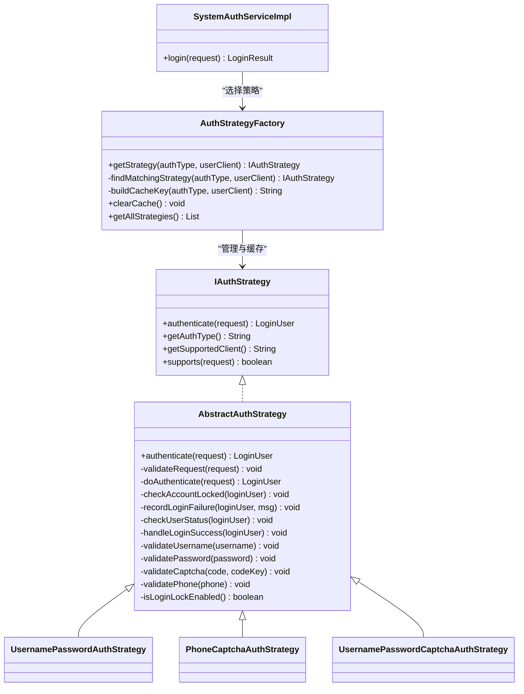
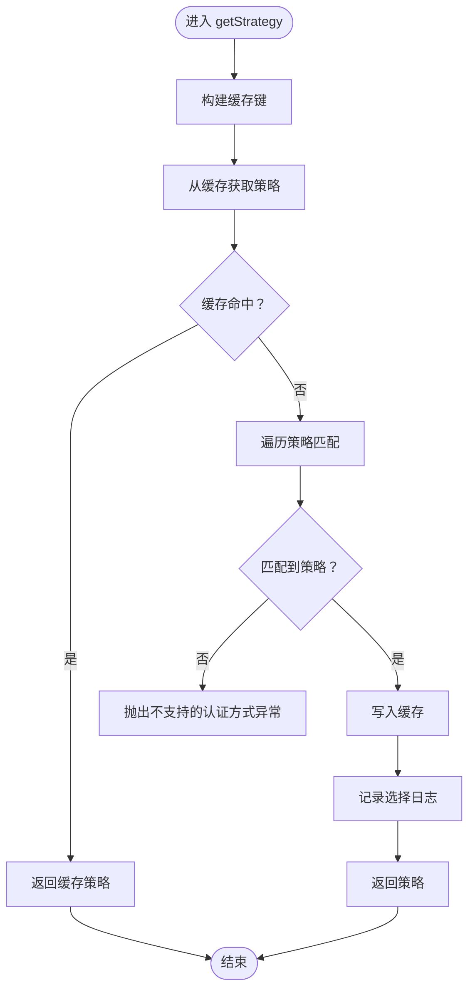
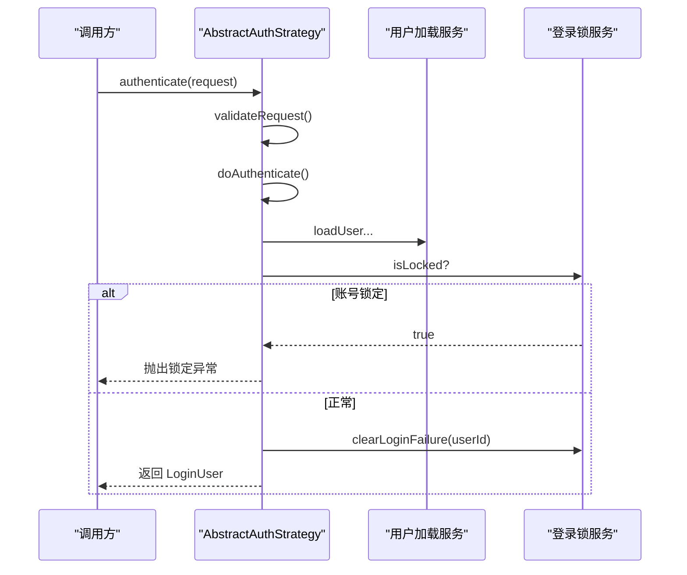
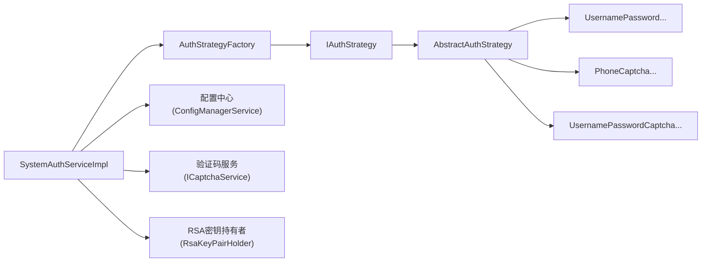

# 认证策略体系

<cite>
**本文引用的文件**
- [AuthStrategyFactory.java](file://forge/forge-framework/forge-starter-parent/forge-starter-auth/src/main/java/com/mdframe/forge/starter/auth/strategy/AuthStrategyFactory.java)
- [IAuthStrategy.java](file://forge/forge-framework/forge-starter-parent/forge-starter-auth/src/main/java/com/mdframe/forge/starter/auth/strategy/IAuthStrategy.java)
- [AbstractAuthStrategy.java](file://forge/forge-framework/forge-plugin-parent/forge-plugin-system/src/main/java/com/mdframe/forge/plugin/system/strategy/AbstractAuthStrategy.java)
- [UsernamePasswordAuthStrategy.java](file://forge/forge-framework/forge-plugin-parent/forge-plugin-system/src/main/java/com/mdframe/forge/plugin/system/strategy/UsernamePasswordAuthStrategy.java)
- [PhoneCaptchaAuthStrategy.java](file://forge/forge-framework/forge-plugin-parent/forge-plugin-system/src/main/java/com/mdframe/forge/plugin/system/strategy/PhoneCaptchaAuthStrategy.java)
- [UsernamePasswordCaptchaAuthStrategy.java](file://forge/forge-framework/forge-plugin-parent/forge-plugin-system/src/main/java/com/mdframe/forge/plugin/system/strategy/UsernamePasswordCaptchaAuthStrategy.java)
- [AuthType.java](file://forge/forge-framework/forge-starter-parent/forge-starter-auth/src/main/java/com/mdframe/forge/starter/auth/enums/AuthType.java)
- [SystemAuthServiceImpl.java](file://forge/forge-framework/forge-plugin-parent/forge-plugin-system/src/main/java/com/mdframe/forge/plugin/system/service/impl/SystemAuthServiceImpl.java)
- [LoginRequest.java](file://forge/forge-framework/forge-starter-parent/forge-starter-auth/src/main/java/com/mdframe/forge/starter/auth/domain/LoginRequest.java)
- [SmsCaptchaResult.java](file://forge/forge-framework/forge-starter-parent/forge-starter-auth/src/main/java/com/mdframe/forge/starter/auth/domain/SmsCaptchaResult.java)
- [index.vue](file://forge-admin-ui/src/views/login/index.vue)
</cite>

## 目录
1. [简介](#简介)
2. [项目结构](#项目结构)
3. [核心组件](#核心组件)
4. [架构总览](#架构总览)
5. [详细组件分析](#详细组件分析)
6. [依赖关系分析](#依赖关系分析)
7. [性能考量](#性能考量)
8. [故障排查指南](#故障排查指南)
9. [结论](#结论)
10. [附录](#附录)

## 简介
本技术文档围绕认证策略体系展开，系统性解析基于工厂模式的认证策略设计与实现，阐述统一接口 IAuthStrategy 的抽象能力以及多种认证策略的具体落地，包括用户名密码认证、手机验证码认证、验证码+密码认证等。文档同时覆盖认证策略的选择机制、参数验证规则、异常处理流程，并提供配置示例、调用方式与最佳实践，涵盖认证失败处理、重试机制与安全防护等关键特性。

## 项目结构
认证策略体系主要分布在以下模块与包中：
- 启动器层（starter）：定义认证策略接口、工厂、通用领域模型与枚举
- 插件层（plugin-system）：实现具体认证策略与系统认证服务
- 前端（admin-ui）：登录页面与验证码交互

图表来源
- [AuthStrategyFactory.java](file://forge/forge-framework/forge-starter-parent/forge-starter-auth/src/main/java/com/mdframe/forge/starter/auth/strategy/AuthStrategyFactory.java#L1-L114)
- [IAuthStrategy.java](file://forge/forge-framework/forge-starter-parent/forge-starter-auth/src/main/java/com/mdframe/forge/starter/auth/strategy/IAuthStrategy.java#L1-L55)
- [AbstractAuthStrategy.java](file://forge/forge-framework/forge-plugin-parent/forge-plugin-system/src/main/java/com/mdframe/forge/plugin/system/strategy/AbstractAuthStrategy.java#L1-L196)
- [UsernamePasswordAuthStrategy.java](file://forge/forge-framework/forge-plugin-parent/forge-plugin-system/src/main/java/com/mdframe/forge/plugin/system/strategy/UsernamePasswordAuthStrategy.java#L1-L51)
- [PhoneCaptchaAuthStrategy.java](file://forge/forge-framework/forge-plugin-parent/forge-plugin-system/src/main/java/com/mdframe/forge/plugin/system/strategy/PhoneCaptchaAuthStrategy.java#L1-L48)
- [UsernamePasswordCaptchaAuthStrategy.java](file://forge/forge-framework/forge-plugin-parent/forge-plugin-system/src/main/java/com/mdframe/forge/plugin/system/strategy/UsernamePasswordCaptchaAuthStrategy.java#L1-L130)
- [SystemAuthServiceImpl.java](file://forge/forge-framework/forge-plugin-parent/forge-plugin-system/src/main/java/com/mdframe/forge/plugin/system/service/impl/SystemAuthServiceImpl.java#L1-L120)
- [LoginRequest.java](file://forge/forge-framework/forge-starter-parent/forge-starter-auth/src/main/java/com/mdframe/forge/starter/auth/domain/LoginRequest.java)
- [SmsCaptchaResult.java](file://forge/forge-framework/forge-starter-parent/forge-starter-auth/src/main/java/com/mdframe/forge/starter/auth/domain/SmsCaptchaResult.java#L1-L60)
- [index.vue](file://forge-admin-ui/src/views/login/index.vue#L238-L252)

章节来源
- [AuthStrategyFactory.java](file://forge/forge-framework/forge-starter-parent/forge-starter-auth/src/main/java/com/mdframe/forge/starter/auth/strategy/AuthStrategyFactory.java#L1-L114)
- [IAuthStrategy.java](file://forge/forge-framework/forge-starter-parent/forge-starter-auth/src/main/java/com/mdframe/forge/starter/auth/strategy/IAuthStrategy.java#L1-L55)
- [AbstractAuthStrategy.java](file://forge/forge-framework/forge-plugin-parent/forge-plugin-system/src/main/java/com/mdframe/forge/plugin/system/strategy/AbstractAuthStrategy.java#L1-L196)
- [UsernamePasswordAuthStrategy.java](file://forge/forge-framework/forge-plugin-parent/forge-plugin-system/src/main/java/com/mdframe/forge/plugin/system/strategy/UsernamePasswordAuthStrategy.java#L1-L51)
- [PhoneCaptchaAuthStrategy.java](file://forge/forge-framework/forge-plugin-parent/forge-plugin-system/src/main/java/com/mdframe/forge/plugin/system/strategy/PhoneCaptchaAuthStrategy.java#L1-L48)
- [UsernamePasswordCaptchaAuthStrategy.java](file://forge/forge-framework/forge-plugin-parent/forge-plugin-system/src/main/java/com/mdframe/forge/plugin/system/strategy/UsernamePasswordCaptchaAuthStrategy.java#L1-L130)
- [SystemAuthServiceImpl.java](file://forge/forge-framework/forge-plugin-parent/forge-plugin-system/src/main/java/com/mdframe/forge/plugin/system/service/impl/SystemAuthServiceImpl.java#L1-L120)
- [AuthType.java](file://forge/forge-framework/forge-starter-parent/forge-starter-auth/src/main/java/com/mdframe/forge/starter/auth/enums/AuthType.java#L1-L72)
- [LoginRequest.java](file://forge/forge-framework/forge-starter-parent/forge-starter-auth/src/main/java/com/mdframe/forge/starter/auth/domain/LoginRequest.java)
- [SmsCaptchaResult.java](file://forge/forge-framework/forge-starter-parent/forge-starter-auth/src/main/java/com/mdframe/forge/starter/auth/domain/SmsCaptchaResult.java#L1-L60)
- [index.vue](file://forge-admin-ui/src/views/login/index.vue#L238-L252)

## 核心组件
- IAuthStrategy：统一认证策略接口，定义认证执行、类型标识、客户端支持与请求适配判断
- AbstractAuthStrategy：认证模板方法，封装通用流程（参数校验、账号锁定检查、用户状态校验、登录成功清理、失败记录与锁定）
- AuthStrategyFactory：认证策略工厂，负责按认证类型与客户端类型选择策略并提供缓存与动态刷新能力
- 具体策略实现：用户名密码、手机验证码、验证码+密码等
- 系统认证服务：SystemAuthServiceImpl 统一编排认证流程，接收 LoginRequest 并委派到对应策略
- 领域模型与枚举：LoginRequest、AuthType、SmsCaptchaResult

章节来源
- [IAuthStrategy.java](file://forge/forge-framework/forge-starter-parent/forge-starter-auth/src/main/java/com/mdframe/forge/starter/auth/strategy/IAuthStrategy.java#L10-L55)
- [AbstractAuthStrategy.java](file://forge/forge-framework/forge-plugin-parent/forge-plugin-system/src/main/java/com/mdframe/forge/plugin/system/strategy/AbstractAuthStrategy.java#L23-L196)
- [AuthStrategyFactory.java](file://forge/forge-framework/forge-starter-parent/forge-starter-auth/src/main/java/com/mdframe/forge/starter/auth/strategy/AuthStrategyFactory.java#L18-L114)
- [SystemAuthServiceImpl.java](file://forge/forge-framework/forge-plugin-parent/forge-plugin-system/src/main/java/com/mdframe/forge/plugin/system/service/impl/SystemAuthServiceImpl.java#L36-L120)
- [AuthType.java](file://forge/forge-framework/forge-starter-parent/forge-starter-auth/src/main/java/com/mdframe/forge/starter/auth/enums/AuthType.java#L11-L42)
- [LoginRequest.java](file://forge/forge-framework/forge-starter-parent/forge-starter-auth/src/main/java/com/mdframe/forge/starter/auth/domain/LoginRequest.java)
- [SmsCaptchaResult.java](file://forge/forge-framework/forge-starter-parent/forge-starter-auth/src/main/java/com/mdframe/forge/starter/auth/domain/SmsCaptchaResult.java#L1-L60)

## 架构总览
认证体系采用“接口抽象 + 工厂选择 + 模板方法 + 具体策略”的分层设计：
- 接口层：IAuthStrategy 定义统一契约
- 抽象层：AbstractAuthStrategy 实现模板方法与通用逻辑
- 工厂层：AuthStrategyFactory 负责策略选择与缓存
- 业务层：SystemAuthServiceImpl 统一入口，接收请求并委派策略
- 策略层：多种认证策略实现
- 前端层：登录页收集参数并发起认证请求

图表来源
- [IAuthStrategy.java](file://forge/forge-framework/forge-starter-parent/forge-starter-auth/src/main/java/com/mdframe/forge/starter/auth/strategy/IAuthStrategy.java#L10-L55)
- [AbstractAuthStrategy.java](file://forge/forge-framework/forge-plugin-parent/forge-plugin-system/src/main/java/com/mdframe/forge/plugin/system/strategy/AbstractAuthStrategy.java#L23-L196)
- [AuthStrategyFactory.java](file://forge/forge-framework/forge-starter-parent/forge-starter-auth/src/main/java/com/mdframe/forge/starter/auth/strategy/AuthStrategyFactory.java#L18-L114)
- [SystemAuthServiceImpl.java](file://forge/forge-framework/forge-plugin-parent/forge-plugin-system/src/main/java/com/mdframe/forge/plugin/system/service/impl/SystemAuthServiceImpl.java#L36-L120)
- [UsernamePasswordAuthStrategy.java](file://forge/forge-framework/forge-plugin-parent/forge-plugin-system/src/main/java/com/mdframe/forge/plugin/system/strategy/UsernamePasswordAuthStrategy.java#L14-L50)
- [PhoneCaptchaAuthStrategy.java](file://forge/forge-framework/forge-plugin-parent/forge-plugin-system/src/main/java/com/mdframe/forge/plugin/system/strategy/PhoneCaptchaAuthStrategy.java#L15-L47)
- [UsernamePasswordCaptchaAuthStrategy.java](file://forge/forge-framework/forge-plugin-parent/forge-plugin-system/src/main/java/com/mdframe/forge/plugin/system/strategy/UsernamePasswordCaptchaAuthStrategy.java#L23-L129)

## 详细组件分析

### 工厂模式：AuthStrategyFactory
- 设计要点
  - 策略集合注入与并发缓存：以“认证类型_客户端”为键缓存策略实例，避免重复扫描与实例化
  - 选择策略：优先精确匹配（类型+客户端），其次类型匹配（支持所有客户端的策略）
  - 异常处理：未匹配到策略时抛出运行时异常，便于上层捕获与提示
  - 动态刷新：提供清空缓存能力，用于动态注册新策略后的刷新
- 关键流程
  - 构建缓存键 → 从缓存命中 → 未命中则遍历策略匹配 → 缓存并返回 → 记录日志
- 性能特征
  - 缓存命中为 O(1)，未命中为 O(n) 策略扫描；n 通常较小，整体开销可控

图表来源
- [AuthStrategyFactory.java](file://forge/forge-framework/forge-starter-parent/forge-starter-auth/src/main/java/com/mdframe/forge/starter/auth/strategy/AuthStrategyFactory.java#L34-L98)

章节来源
- [AuthStrategyFactory.java](file://forge/forge-framework/forge-starter-parent/forge-starter-auth/src/main/java/com/mdframe/forge/starter/auth/strategy/AuthStrategyFactory.java#L18-L114)

### 统一接口：IAuthStrategy
- 职责边界
  - authenticate：执行认证并返回登录用户上下文
  - getAuthType：返回认证类型编码
  - getSupportedClient：返回支持的客户端类型（null 表示全支持）
  - supports：根据请求与支持范围判断是否适配当前策略
- 设计价值
  - 解耦具体认证实现与调用方，便于扩展与替换

章节来源
- [IAuthStrategy.java](file://forge/forge-framework/forge-starter-parent/forge-starter-auth/src/main/java/com/mdframe/forge/starter/auth/strategy/IAuthStrategy.java#L10-L55)

### 抽象基类：AbstractAuthStrategy
- 模板方法
  - authenticate：标准化流程（参数校验 → 具体认证 → 用户状态检查 → 成功处理）
  - 子类仅需实现 validateRequest 与 doAuthenticate
- 通用能力
  - 账号锁定检查：基于登录锁服务与剩余时间
  - 失败记录与锁定：按配置记录失败次数，超过阈值锁定
  - 用户状态校验：用户状态非正常直接拒绝
  - 成功处理：清除失败记录并输出日志
- 参数校验工具：用户名、密码、验证码、手机号等基础校验
- 开关控制：是否启用登录锁定由配置决定

图表来源
- [AbstractAuthStrategy.java](file://forge/forge-framework/forge-plugin-parent/forge-plugin-system/src/main/java/com/mdframe/forge/plugin/system/strategy/AbstractAuthStrategy.java#L38-L138)

章节来源
- [AbstractAuthStrategy.java](file://forge/forge-framework/forge-plugin-parent/forge-plugin-system/src/main/java/com/mdframe/forge/plugin/system/strategy/AbstractAuthStrategy.java#L23-L196)

### 系统认证服务：SystemAuthServiceImpl
- 职责
  - 统一入口：接收 LoginRequest，进行默认值处理与策略选择
  - 流程编排：参数校验 → 策略选择 → 策略执行 → 结果封装
- 关键点
  - 默认认证类型：若未指定则回退为用户名密码认证
  - 日志记录：记录所选策略与请求上下文
  - 与工厂协作：通过 AuthStrategyFactory 获取策略实例

章节来源
- [SystemAuthServiceImpl.java](file://forge/forge-framework/forge-plugin-parent/forge-plugin-system/src/main/java/com/mdframe/forge/plugin/system/service/impl/SystemAuthServiceImpl.java#L36-L120)

### 认证策略实现

#### 用户名密码认证：UsernamePasswordAuthStrategy
- 参数校验：用户名与密码必填
- 认证流程
  - 加载用户信息
  - 检查账号锁定
  - 校验用户存在性与密码正确性
  - 记录失败与成功处理由抽象基类完成
- 适用场景：标准 PC/Web 登录

章节来源
- [UsernamePasswordAuthStrategy.java](file://forge/forge-framework/forge-plugin-parent/forge-plugin-system/src/main/java/com/mdframe/forge/plugin/system/strategy/UsernamePasswordAuthStrategy.java#L14-L50)

#### 手机验证码认证：PhoneCaptchaAuthStrategy
- 参数校验：手机号与验证码必填
- 认证流程
  - 验证短信验证码有效性
  - 根据手机号加载用户并校验存在性
- 适用场景：移动端快速登录、弱密码场景下的二次验证

章节来源
- [PhoneCaptchaAuthStrategy.java](file://forge/forge-framework/forge-plugin-parent/forge-plugin-system/src/main/java/com/mdframe/forge/plugin/system/strategy/PhoneCaptchaAuthStrategy.java#L15-L47)

#### 验证码+密码认证：UsernamePasswordCaptchaAuthStrategy
- 参数校验：用户名、密码必填；验证码类型依据配置决定额外参数
  - 短信验证码：手机号与验证码
  - 滑块验证码：验证码标记
  - 图形验证码：codeKey 与 code
- 认证流程
  - 依据配置读取验证码类型并验证
  - 加载用户、检查锁定、校验用户存在性与密码（密码解密后比对）
- 适用场景：高安全要求登录，支持多类型验证码

章节来源
- [UsernamePasswordCaptchaAuthStrategy.java](file://forge/forge-framework/forge-plugin-parent/forge-plugin-system/src/main/java/com/mdframe/forge/plugin/system/strategy/UsernamePasswordCaptchaAuthStrategy.java#L23-L129)

### 认证类型枚举：AuthType
- 定义了系统支持的认证方式及其编码，便于策略识别与前端/配置联动
- 常见类型：用户名密码、验证码+密码、手机验证码、微信授权、邮箱验证码、OAuth2

章节来源
- [AuthType.java](file://forge/forge-framework/forge-starter-parent/forge-starter-auth/src/main/java/com/mdframe/forge/starter/auth/enums/AuthType.java#L11-L42)

### 领域模型与前端交互
- LoginRequest：承载登录请求参数（认证类型、客户端类型、用户名/密码/验证码/手机号等）
- SmsCaptchaResult：短信验证码发送结果（含验证码 key、手机号、过期时间、状态等）
- 前端登录页：收集用户名/密码、验证码、验证码 key、手机号等字段，提交至系统认证服务

章节来源
- [LoginRequest.java](file://forge/forge-framework/forge-starter-parent/forge-starter-auth/src/main/java/com/mdframe/forge/starter/auth/domain/LoginRequest.java)
- [SmsCaptchaResult.java](file://forge/forge-framework/forge-starter-parent/forge-starter-auth/src/main/java/com/mdframe/forge/starter/auth/domain/SmsCaptchaResult.java#L1-L60)
- [index.vue](file://forge-admin-ui/src/views/login/index.vue#L238-L252)

## 依赖关系分析
- 组件内聚与耦合
  - 策略实现仅依赖抽象接口与通用服务，内聚度高、耦合度低
  - 工厂集中管理策略生命周期与缓存，降低调用方复杂度
- 外部依赖
  - 用户加载服务：加载用户、校验密码、验证码校验
  - 登录锁服务：账号锁定判定与失败记录
  - 配置中心：读取验证码类型等运行时配置
- 可能的循环依赖
  - 策略与工厂通过接口解耦，无直接循环依赖风险

图表来源
- [SystemAuthServiceImpl.java](file://forge/forge-framework/forge-plugin-parent/forge-plugin-system/src/main/java/com/mdframe/forge/plugin/system/service/impl/SystemAuthServiceImpl.java#L36-L120)
- [AuthStrategyFactory.java](file://forge/forge-framework/forge-starter-parent/forge-starter-auth/src/main/java/com/mdframe/forge/starter/auth/strategy/AuthStrategyFactory.java#L18-L114)
- [AbstractAuthStrategy.java](file://forge/forge-framework/forge-plugin-parent/forge-plugin-system/src/main/java/com/mdframe/forge/plugin/system/strategy/AbstractAuthStrategy.java#L23-L196)
- [UsernamePasswordCaptchaAuthStrategy.java](file://forge/forge-framework/forge-plugin-parent/forge-plugin-system/src/main/java/com/mdframe/forge/plugin/system/strategy/UsernamePasswordCaptchaAuthStrategy.java#L23-L129)

章节来源
- [SystemAuthServiceImpl.java](file://forge/forge-framework/forge-plugin-parent/forge-plugin-system/src/main/java/com/mdframe/forge/plugin/system/service/impl/SystemAuthServiceImpl.java#L36-L120)
- [AuthStrategyFactory.java](file://forge/forge-framework/forge-starter-parent/forge-starter-auth/src/main/java/com/mdframe/forge/starter/auth/strategy/AuthStrategyFactory.java#L18-L114)
- [AbstractAuthStrategy.java](file://forge/forge-framework/forge-plugin-parent/forge-plugin-system/src/main/java/com/mdframe/forge/plugin/system/strategy/AbstractAuthStrategy.java#L23-L196)
- [UsernamePasswordCaptchaAuthStrategy.java](file://forge/forge-framework/forge-plugin-parent/forge-plugin-system/src/main/java/com/mdframe/forge/plugin/system/strategy/UsernamePasswordCaptchaAuthStrategy.java#L23-L129)

## 性能考量
- 策略缓存：工厂对策略实例进行缓存，避免每次选择时的扫描与实例化开销
- 选择算法：O(n) 策略遍历，n 通常很小，影响有限
- 参数校验前置：在抽象基类中统一校验，减少无效调用
- 锁定与失败记录：启用登录锁定会增加数据库/缓存访问，建议按需开启并合理设置阈值与锁定时长

## 故障排查指南
- 未找到匹配的认证策略
  - 现象：抛出不支持的认证方式异常
  - 排查：确认请求中的认证类型与客户端类型是否与策略一致；必要时清空工厂缓存并重新注册策略
  - 参考路径：[AuthStrategyFactory.java](file://forge/forge-framework/forge-starter-parent/forge-starter-auth/src/main/java/com/mdframe/forge/starter/auth/strategy/AuthStrategyFactory.java#L47-L51)
- 账号被锁定
  - 现象：抛出账号锁定异常，提示剩余分钟数
  - 排查：检查登录锁服务配置与剩余锁定时间；等待锁定结束或联系管理员
  - 参考路径：[AbstractAuthStrategy.java](file://forge/forge-framework/forge-plugin-parent/forge-plugin-system/src/main/java/com/mdframe/forge/plugin/system/strategy/AbstractAuthStrategy.java#L75-L88)
- 登录失败与重试
  - 现象：失败记录递增，剩余尝试次数提示或账号锁定
  - 排查：核对用户名/密码/验证码输入；检查验证码有效期与绑定关系
  - 参考路径：[AbstractAuthStrategy.java](file://forge/forge-framework/forge-plugin-parent/forge-plugin-system/src/main/java/com/mdframe/forge/plugin/system/strategy/AbstractAuthStrategy.java#L96-L108)
- 验证码错误或过期
  - 现象：验证码错误或已过期异常
  - 排查：确认验证码类型配置与前端传参；短信验证码需确保发送与验证流程一致
  - 参考路径：[UsernamePasswordCaptchaAuthStrategy.java](file://forge/forge-framework/forge-plugin-parent/forge-plugin-system/src/main/java/com/mdframe/forge/plugin/system/strategy/UsernamePasswordCaptchaAuthStrategy.java#L105-L123)

章节来源
- [AuthStrategyFactory.java](file://forge/forge-framework/forge-starter-parent/forge-starter-auth/src/main/java/com/mdframe/forge/starter/auth/strategy/AuthStrategyFactory.java#L47-L51)
- [AbstractAuthStrategy.java](file://forge/forge-framework/forge-plugin-parent/forge-plugin-system/src/main/java/com/mdframe/forge/plugin/system/strategy/AbstractAuthStrategy.java#L75-L108)
- [UsernamePasswordCaptchaAuthStrategy.java](file://forge/forge-framework/forge-plugin-parent/forge-plugin-system/src/main/java/com/mdframe/forge/plugin/system/strategy/UsernamePasswordCaptchaAuthStrategy.java#L105-L123)

## 结论
认证策略体系通过接口抽象、工厂选择与模板方法实现了高度可扩展与可维护的认证框架。工厂负责策略选择与缓存，抽象基类统一处理通用流程与安全控制，具体策略聚焦于差异化参数校验与认证逻辑。结合配置中心与验证码服务，系统能够灵活适配多种认证场景，并具备完善的失败处理与安全防护能力。

## 附录

### 认证策略选择机制与优先级
- 优先级：精确匹配（类型+客户端） > 类型匹配（仅类型）
- 客户端支持：策略可声明支持特定客户端；未声明表示支持全部
- 缓存策略：按“类型_客户端”键缓存，提升后续选择效率

章节来源
- [AuthStrategyFactory.java](file://forge/forge-framework/forge-starter-parent/forge-starter-auth/src/main/java/com/mdframe/forge/starter/auth/strategy/AuthStrategyFactory.java#L66-L91)

### 参数验证规则
- 用户名密码：用户名与密码均不能为空
- 验证码+密码：依据验证码类型校验附加参数
  - 短信验证码：手机号与验证码必填
  - 滑块验证码：验证码标记必填
  - 图形验证码：codeKey 与 code 必填
- 手机验证码：手机号与验证码必填

章节来源
- [AbstractAuthStrategy.java](file://forge/forge-framework/forge-plugin-parent/forge-plugin-system/src/main/java/com/mdframe/forge/plugin/system/strategy/AbstractAuthStrategy.java#L145-L183)
- [UsernamePasswordCaptchaAuthStrategy.java](file://forge/forge-framework/forge-plugin-parent/forge-plugin-system/src/main/java/com/mdframe/forge/plugin/system/strategy/UsernamePasswordCaptchaAuthStrategy.java#L35-L61)
- [PhoneCaptchaAuthStrategy.java](file://forge/forge-framework/forge-plugin-parent/forge-plugin-system/src/main/java/com/mdframe/forge/plugin/system/strategy/PhoneCaptchaAuthStrategy.java#L18-L23)

### 异常处理流程
- 未匹配策略：抛出不支持的认证方式异常
- 账号锁定：抛出锁定异常并提示剩余分钟数
- 登录失败：记录失败次数，剩余尝试或锁定账号
- 用户状态异常：用户不存在或状态异常直接拒绝

章节来源
- [AuthStrategyFactory.java](file://forge/forge-framework/forge-starter-parent/forge-starter-auth/src/main/java/com/mdframe/forge/starter/auth/strategy/AuthStrategyFactory.java#L47-L51)
- [AbstractAuthStrategy.java](file://forge/forge-framework/forge-plugin-parent/forge-plugin-system/src/main/java/com/mdframe/forge/plugin/system/strategy/AbstractAuthStrategy.java#L75-L123)

### 配置示例与调用方式
- 配置验证码类型
  - 在配置中心设置登录验证码类型（图形、滑块、短信）
  - 参考路径：[UsernamePasswordCaptchaAuthStrategy.java](file://forge/forge-framework/forge-plugin-parent/forge-plugin-system/src/main/java/com/mdframe/forge/plugin/system/strategy/UsernamePasswordCaptchaAuthStrategy.java#L40-L69)
- 前端调用
  - 登录页收集用户名/密码、验证码、验证码 key、手机号等字段
  - 参考路径：[index.vue](file://forge-admin-ui/src/views/login/index.vue#L245-L251)
- 系统认证服务调用
  - 接收 LoginRequest，自动选择策略并执行认证
  - 参考路径：[SystemAuthServiceImpl.java](file://forge/forge-framework/forge-plugin-parent/forge-plugin-system/src/main/java/com/mdframe/forge/plugin/system/service/impl/SystemAuthServiceImpl.java#L48-L64)

### 最佳实践
- 明确认证类型与客户端映射，避免策略误配
- 合理配置登录锁定阈值与时长，平衡安全与用户体验
- 对短信验证码与图形验证码分别进行有效期与绑定校验
- 在高并发场景下利用工厂缓存，减少策略选择开销
- 对密码传输进行加密处理，后端解密后再比对