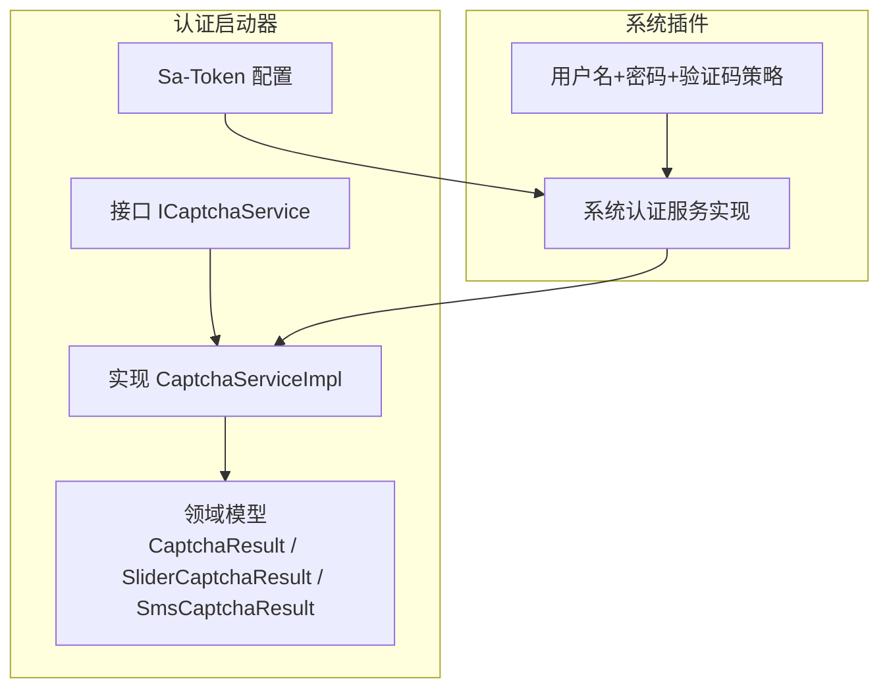
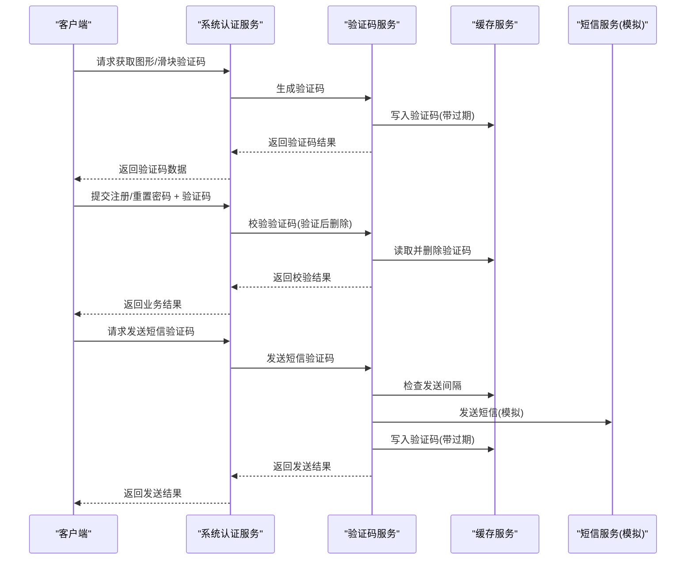
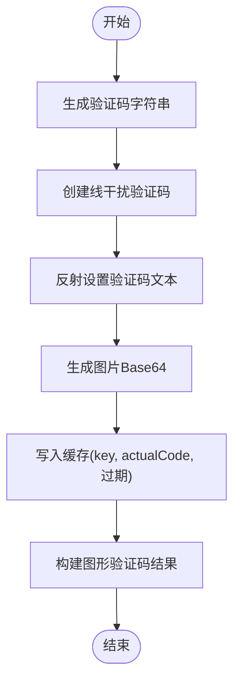
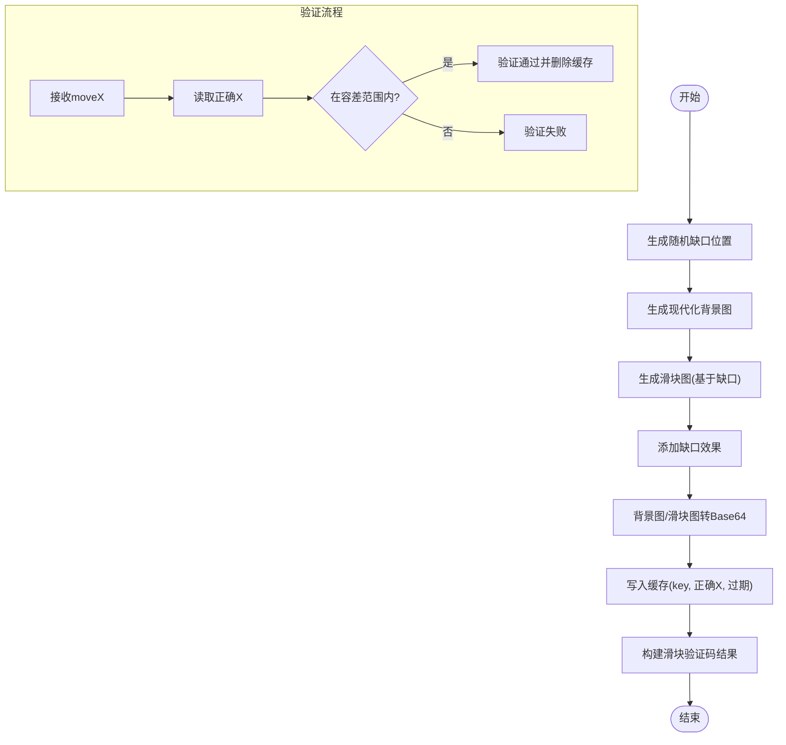
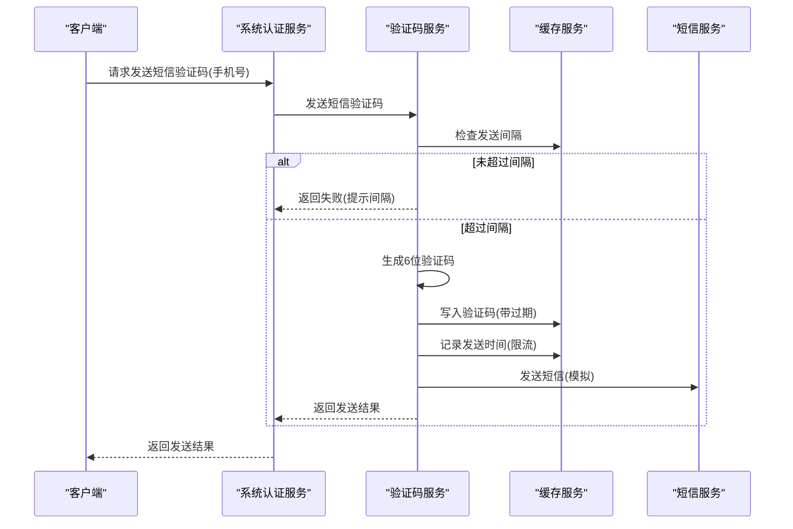
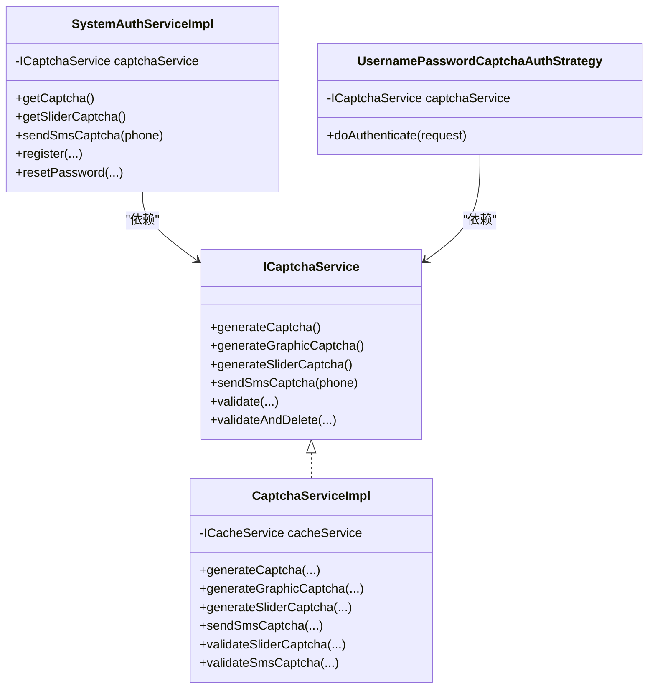

# 验证码与安全控制

<cite>
**本文引用的文件**
- [CaptchaServiceImpl.java](file://forge/forge-framework/forge-starter-parent/forge-starter-auth/src/main/java/com/mdframe/forge/starter/auth/service/impl/CaptchaServiceImpl.java)
- [ICaptchaService.java](file://forge/forge-framework/forge-starter-parent/forge-starter-auth/src/main/java/com/mdframe/forge/starter/auth/service/ICaptchaService.java)
- [CaptchaResult.java](file://forge/forge-framework/forge-starter-parent/forge-starter-auth/src/main/java/com/mdframe/forge/starter/auth/domain/CaptchaResult.java)
- [SliderCaptchaResult.java](file://forge/forge-framework/forge-starter-parent/forge-starter-auth/src/main/java/com/mdframe/forge/starter/auth/domain/SliderCaptchaResult.java)
- [SliderCaptchaValidateRequest.java](file://forge/forge-framework/forge-starter-parent/forge-starter-auth/src/main/java/com/mdframe/forge/starter/auth/domain/SliderCaptchaValidateRequest.java)
- [SmsCaptchaResult.java](file://forge/forge-framework/forge-starter-parent/forge-starter-auth/src/main/java/com/mdframe/forge/starter/auth/domain/SmsCaptchaResult.java)
- [SystemAuthServiceImpl.java](file://forge/forge-framework/forge-plugin-parent/forge-plugin-system/src/main/java/com/mdframe/forge/plugin/system/service/impl/SystemAuthServiceImpl.java)
- [UsernamePasswordCaptchaAuthStrategy.java](file://forge/forge-framework/forge-plugin-parent/forge-plugin-system/src/main/java/com/mdframe/forge/plugin/system/strategy/UsernamePasswordCaptchaAuthStrategy.java)
- [SaTokenConfig.java](file://forge/forge-framework/forge-starter-parent/forge-starter-auth/src/main/java/com/mdframe/forge/starter/auth/config/SaTokenConfig.java)
- [application.yml](file://forge/forge-admin/src/main/resources/application.yml)
</cite>

## 目录
1. [简介](#简介)
2. [项目结构](#项目结构)
3. [核心组件](#核心组件)
4. [架构总览](#架构总览)
5. [详细组件分析](#详细组件分析)
6. [依赖关系分析](#依赖关系分析)
7. [性能考量](#性能考量)
8. [故障排查指南](#故障排查指南)
9. [结论](#结论)
10. [附录](#附录)

## 简介
本文件面向验证码与安全控制模块，系统性解析 CaptchaServiceImpl 验证码服务的实现原理，覆盖图形验证码生成、滑块验证码验证、短信验证码发送三大能力；并深入说明验证码存储机制、有效期管理、防刷策略等安全控制措施。文档同时解释不同类型的验证码格式、验证算法、安全强度配置，并提供完整的配置示例、集成方案与安全最佳实践，涵盖缓存策略、并发控制、异常处理与性能优化建议。

## 项目结构
验证码与安全控制模块位于后端框架的认证子系统中，核心代码集中在认证启动器与系统插件中：
- 认证启动器（forge-starter-auth）：提供验证码服务接口与实现、领域模型、安全拦截器配置。
- 系统插件（forge-plugin-system）：提供认证策略、系统认证服务实现，调用验证码服务完成登录、注册、重置密码等流程中的验证码校验。

图表来源
- [ICaptchaService.java](file://forge/forge-framework/forge-starter-parent/forge-starter-auth/src/main/java/com/mdframe/forge/starter/auth/service/ICaptchaService.java#L1-L174)
- [CaptchaServiceImpl.java](file://forge/forge-framework/forge-starter-parent/forge-starter-auth/src/main/java/com/mdframe/forge/starter/auth/service/impl/CaptchaServiceImpl.java#L1-L602)
- [CaptchaResult.java](file://forge/forge-framework/forge-starter-parent/forge-starter-auth/src/main/java/com/mdframe/forge/starter/auth/domain/CaptchaResult.java#L1-L41)
- [SliderCaptchaResult.java](file://forge/forge-framework/forge-starter-parent/forge-starter-auth/src/main/java/com/mdframe/forge/starter/auth/domain/SliderCaptchaResult.java#L1-L71)
- [SmsCaptchaResult.java](file://forge/forge-framework/forge-starter-parent/forge-starter-auth/src/main/java/com/mdframe/forge/starter/auth/domain/SmsCaptchaResult.java#L1-L61)
- [SaTokenConfig.java](file://forge/forge-framework/forge-starter-parent/forge-starter-auth/src/main/java/com/mdframe/forge/starter/auth/config/SaTokenConfig.java#L1-L70)
- [SystemAuthServiceImpl.java](file://forge/forge-framework/forge-plugin-parent/forge-plugin-system/src/main/java/com/mdframe/forge/plugin/system/service/impl/SystemAuthServiceImpl.java#L1-L404)
- [UsernamePasswordCaptchaAuthStrategy.java](file://forge/forge-framework/forge-plugin-parent/forge-plugin-system/src/main/java/com/mdframe/forge/plugin/system/strategy/UsernamePasswordCaptchaAuthStrategy.java#L1-L130)

章节来源
- [ICaptchaService.java](file://forge/forge-framework/forge-starter-parent/forge-starter-auth/src/main/java/com/mdframe/forge/starter/auth/service/ICaptchaService.java#L1-L174)
- [CaptchaServiceImpl.java](file://forge/forge-framework/forge-starter-parent/forge-starter-auth/src/main/java/com/mdframe/forge/starter/auth/service/impl/CaptchaServiceImpl.java#L1-L602)
- [SystemAuthServiceImpl.java](file://forge/forge-framework/forge-plugin-parent/forge-plugin-system/src/main/java/com/mdframe/forge/plugin/system/service/impl/SystemAuthServiceImpl.java#L1-L404)

## 核心组件
- 验证码服务接口 ICaptchaService：定义通用验证码生成、查询、验证、删除以及图形、滑块、短信验证码的完整能力。
- 验证码服务实现 CaptchaServiceImpl：基于 Hutool 图形验证码库与自绘滑块验证码，结合缓存服务实现验证码生成、存储、验证与删除。
- 领域模型：
  - CaptchaResult：图形验证码响应，包含 key、验证码文本（开发环境）、Base64 图片与过期时间。
  - SliderCaptchaResult：滑块验证码响应，包含背景图、滑块图、尺寸、缺口 Y 坐标、过期时间与类型。
  - SmsCaptchaResult：短信验证码响应，包含手机号、状态、提示、验证码（开发环境）、过期时间、类型与发送间隔。
- 系统认证服务 SystemAuthServiceImpl：对外暴露验证码获取与短信发送接口，并在注册、重置密码等流程中调用验证码服务完成校验。
- 认证策略 UsernamePasswordCaptchaAuthStrategy：根据配置中心的验证码类型（图形/滑块/短信）对登录请求进行差异化校验。
- Sa-Token 配置 SaTokenConfig：统一排除验证码接口与登录/注册/重置密码等无需登录即可访问的接口，其余接口强制登录校验。

章节来源
- [ICaptchaService.java](file://forge/forge-framework/forge-starter-parent/forge-starter-auth/src/main/java/com/mdframe/forge/starter/auth/service/ICaptchaService.java#L1-L174)
- [CaptchaServiceImpl.java](file://forge/forge-framework/forge-starter-parent/forge-starter-auth/src/main/java/com/mdframe/forge/starter/auth/service/impl/CaptchaServiceImpl.java#L1-L602)
- [CaptchaResult.java](file://forge/forge-framework/forge-starter-parent/forge-starter-auth/src/main/java/com/mdframe/forge/starter/auth/domain/CaptchaResult.java#L1-L41)
- [SliderCaptchaResult.java](file://forge/forge-framework/forge-starter-parent/forge-starter-auth/src/main/java/com/mdframe/forge/starter/auth/domain/SliderCaptchaResult.java#L1-L71)
- [SmsCaptchaResult.java](file://forge/forge-framework/forge-starter-parent/forge-starter-auth/src/main/java/com/mdframe/forge/starter/auth/domain/SmsCaptchaResult.java#L1-L61)
- [SystemAuthServiceImpl.java](file://forge/forge-framework/forge-plugin-parent/forge-plugin-system/src/main/java/com/mdframe/forge/plugin/system/service/impl/SystemAuthServiceImpl.java#L1-L404)
- [UsernamePasswordCaptchaAuthStrategy.java](file://forge/forge-framework/forge-plugin-parent/forge-plugin-system/src/main/java/com/mdframe/forge/plugin/system/strategy/UsernamePasswordCaptchaAuthStrategy.java#L1-L130)
- [SaTokenConfig.java](file://forge/forge-framework/forge-starter-parent/forge-starter-auth/src/main/java/com/mdframe/forge/starter/auth/config/SaTokenConfig.java#L1-L70)

## 架构总览
验证码与安全控制的整体交互流程如下：

图表来源
- [SystemAuthServiceImpl.java](file://forge/forge-framework/forge-plugin-parent/forge-plugin-system/src/main/java/com/mdframe/forge/plugin/system/service/impl/SystemAuthServiceImpl.java#L260-L292)
- [CaptchaServiceImpl.java](file://forge/forge-framework/forge-starter-parent/forge-starter-auth/src/main/java/com/mdframe/forge/starter/auth/service/impl/CaptchaServiceImpl.java#L185-L235)
- [CaptchaServiceImpl.java](file://forge/forge-framework/forge-starter-parent/forge-starter-auth/src/main/java/com/mdframe/forge/starter/auth/service/impl/CaptchaServiceImpl.java#L481-L561)

## 详细组件分析

### 图形验证码生成与验证
- 生成逻辑
  - 生成指定长度的验证码字符串（字符集不含易混淆字符）。
  - 使用 Hutool 线干扰验证码生成器创建图形验证码。
  - 通过反射设置自定义验证码文本，确保与缓存中的值一致。
  - 将验证码图片转为 Base64 字符串，生成唯一 key 并写入缓存，设置过期时间。
  - 返回包含 key、验证码文本（开发环境）、图片 Base64 与过期时间的结果对象。
- 验证逻辑
  - 支持普通验证与“验证后删除”两种模式。
  - 验证时忽略大小写，若验证码不存在或已过期则返回失败。
- 关键参数
  - 默认长度与默认过期时间、图片尺寸、字符集等均在实现中集中定义，便于统一调整。

图表来源
- [CaptchaServiceImpl.java](file://forge/forge-framework/forge-starter-parent/forge-starter-auth/src/main/java/com/mdframe/forge/starter/auth/service/impl/CaptchaServiceImpl.java#L195-L235)

章节来源
- [CaptchaServiceImpl.java](file://forge/forge-framework/forge-starter-parent/forge-starter-auth/src/main/java/com/mdframe/forge/starter/auth/service/impl/CaptchaServiceImpl.java#L185-L235)
- [CaptchaResult.java](file://forge/forge-framework/forge-starter-parent/forge-starter-auth/src/main/java/com/mdframe/forge/starter/auth/domain/CaptchaResult.java#L1-L41)

### 滑块验证码生成与验证
- 生成逻辑
  - 随机生成缺口位置（考虑滑块尺寸与边距），生成现代化背景图与滑块图。
  - 将背景图与滑块图转换为 Base64，生成唯一 key 并将“正确 X 坐标”写入缓存。
  - 返回包含背景图、滑块图、尺寸、缺口 Y 坐标、过期时间与类型的滑块验证码结果。
- 验证逻辑
  - 校验时读取缓存中的正确 X 坐标，允许一定像素容差范围内的匹配。
  - 支持“验证后删除”，验证成功即清理缓存。
- 安全要点
  - 使用容差避免机械滑动导致的微小误差引发误判。
  - 前端仅传输移动距离，后端不依赖前端轨迹，降低伪造风险。

图表来源
- [CaptchaServiceImpl.java](file://forge/forge-framework/forge-starter-parent/forge-starter-auth/src/main/java/com/mdframe/forge/starter/auth/service/impl/CaptchaServiceImpl.java#L244-L297)
- [CaptchaServiceImpl.java](file://forge/forge-framework/forge-starter-parent/forge-starter-auth/src/main/java/com/mdframe/forge/starter/auth/service/impl/CaptchaServiceImpl.java#L299-L334)
- [SliderCaptchaResult.java](file://forge/forge-framework/forge-starter-parent/forge-starter-auth/src/main/java/com/mdframe/forge/starter/auth/domain/SliderCaptchaResult.java#L1-L71)
- [SliderCaptchaValidateRequest.java](file://forge/forge-framework/forge-starter-parent/forge-starter-auth/src/main/java/com/mdframe/forge/starter/auth/domain/SliderCaptchaValidateRequest.java#L1-L30)

章节来源
- [CaptchaServiceImpl.java](file://forge/forge-framework/forge-starter-parent/forge-starter-auth/src/main/java/com/mdframe/forge/starter/auth/service/impl/CaptchaServiceImpl.java#L244-L334)
- [SliderCaptchaResult.java](file://forge/forge-framework/forge-starter-parent/forge-starter-auth/src/main/java/com/mdframe/forge/starter/auth/domain/SliderCaptchaResult.java#L1-L71)
- [SliderCaptchaValidateRequest.java](file://forge/forge-framework/forge-starter-parent/forge-starter-auth/src/main/java/com/mdframe/forge/starter/auth/domain/SliderCaptchaValidateRequest.java#L1-L30)

### 短信验证码发送与验证
- 发送逻辑
  - 校验手机号格式，检查发送间隔缓存（防止刷屏）。
  - 生成 6 位数字验证码，生成唯一 key，将验证码写入缓存并设置过期时间。
  - 记录最近发送时间，用于控制发送间隔。
  - 调用短信服务发送（当前为模拟实现），返回发送结果。
- 验证逻辑
  - 校验手机号与验证码，支持“验证后删除”。
  - 若验证码不存在或已过期则返回失败。
- 防刷策略
  - 发送间隔控制：同一手机号在固定秒数内只能发送一次。
  - 验证码过期：默认过期时间较短，降低泄露风险。

图表来源
- [CaptchaServiceImpl.java](file://forge/forge-framework/forge-starter-parent/forge-starter-auth/src/main/java/com/mdframe/forge/starter/auth/service/impl/CaptchaServiceImpl.java#L486-L561)
- [SmsCaptchaResult.java](file://forge/forge-framework/forge-starter-parent/forge-starter-auth/src/main/java/com/mdframe/forge/starter/auth/domain/SmsCaptchaResult.java#L1-L61)

章节来源
- [CaptchaServiceImpl.java](file://forge/forge-framework/forge-starter-parent/forge-starter-auth/src/main/java/com/mdframe/forge/starter/auth/service/impl/CaptchaServiceImpl.java#L486-L561)
- [SmsCaptchaResult.java](file://forge/forge-framework/forge-starter-parent/forge-starter-auth/src/main/java/com/mdframe/forge/starter/auth/domain/SmsCaptchaResult.java#L1-L61)

### 验证码存储机制与有效期管理
- 存储键前缀
  - 普通验证码：captcha:
  - 滑块验证码：captcha:slider:
  - 短信验证码：captcha:sms:
- 过期时间
  - 默认过期时间为 5 分钟，可通过参数传入自定义时长。
- 删除策略
  - “验证后删除”模式在验证成功后立即清理缓存，避免重复使用。
  - 滑块验证码在验证成功后删除，确保一次性使用。
- 缓存一致性
  - 图形验证码通过反射设置验证码文本，保证缓存值与展示值一致。
  - 短信验证码与滑块验证码均以手机号或 key 作为缓存键，避免跨用户冲突。

章节来源
- [ICaptchaService.java](file://forge/forge-framework/forge-starter-parent/forge-starter-auth/src/main/java/com/mdframe/forge/starter/auth/service/ICaptchaService.java#L14-L27)
- [CaptchaServiceImpl.java](file://forge/forge-framework/forge-starter-parent/forge-starter-auth/src/main/java/com/mdframe/forge/starter/auth/service/impl/CaptchaServiceImpl.java#L55-L58)
- [CaptchaServiceImpl.java](file://forge/forge-framework/forge-starter-parent/forge-starter-auth/src/main/java/com/mdframe/forge/starter/auth/service/impl/CaptchaServiceImpl.java#L162-L179)
- [CaptchaServiceImpl.java](file://forge/forge-framework/forge-starter-parent/forge-starter-auth/src/main/java/com/mdframe/forge/starter/auth/service/impl/CaptchaServiceImpl.java#L326-L334)
- [CaptchaServiceImpl.java](file://forge/forge-framework/forge-starter-parent/forge-starter-auth/src/main/java/com/mdframe/forge/starter/auth/service/impl/CaptchaServiceImpl.java#L592-L600)

### 不同类型验证码格式与验证算法
- 图形验证码
  - 格式：Base64 PNG 图片 + 文本验证码（开发环境）。
  - 算法：忽略大小写比较，支持“验证后删除”。
- 滑块验证码
  - 格式：背景图 Base64 + 滑块图 Base64 + 尺寸 + 缺口 Y 坐标。
  - 算法：比较移动距离与正确 X 坐标的差值是否在容差范围内。
- 短信验证码
  - 格式：手机号 + 验证码（开发环境）+ 状态 + 提示。
  - 算法：严格相等比较，支持“验证后删除”。

章节来源
- [CaptchaResult.java](file://forge/forge-framework/forge-starter-parent/forge-starter-auth/src/main/java/com/mdframe/forge/starter/auth/domain/CaptchaResult.java#L1-L41)
- [SliderCaptchaResult.java](file://forge/forge-framework/forge-starter-parent/forge-starter-auth/src/main/java/com/mdframe/forge/starter/auth/domain/SliderCaptchaResult.java#L1-L71)
- [SmsCaptchaResult.java](file://forge/forge-framework/forge-starter-parent/forge-starter-auth/src/main/java/com/mdframe/forge/starter/auth/domain/SmsCaptchaResult.java#L1-L61)
- [CaptchaServiceImpl.java](file://forge/forge-framework/forge-starter-parent/forge-starter-auth/src/main/java/com/mdframe/forge/starter/auth/service/impl/CaptchaServiceImpl.java#L144-L160)
- [CaptchaServiceImpl.java](file://forge/forge-framework/forge-starter-parent/forge-starter-auth/src/main/java/com/mdframe/forge/starter/auth/service/impl/CaptchaServiceImpl.java#L300-L324)
- [CaptchaServiceImpl.java](file://forge/forge-framework/forge-starter-parent/forge-starter-auth/src/main/java/com/mdframe/forge/starter/auth/service/impl/CaptchaServiceImpl.java#L572-L590)

### 安全强度配置与最佳实践
- 字符集与长度
  - 图形验证码字符集剔除易混淆字符，长度默认 4，可按需调整。
- 图形验证码
  - 使用线干扰验证码生成器，增强识别难度。
- 滑块验证码
  - 容差范围像素级控制，避免机械滑动误差。
  - 现代化背景与滑块绘制，提升用户体验与安全性。
- 短信验证码
  - 6 位纯数字，发送间隔限制，过期时间短。
- 集成与配置
  - Sa-Token 拦截器排除验证码接口与登录/注册/重置密码接口，其余接口强制登录。
  - 配置文件启用 Redis 存储 Token，确保分布式场景下会话一致性。

章节来源
- [CaptchaServiceImpl.java](file://forge/forge-framework/forge-starter-parent/forge-starter-auth/src/main/java/com/mdframe/forge/starter/auth/service/impl/CaptchaServiceImpl.java#L63-L68)
- [CaptchaServiceImpl.java](file://forge/forge-framework/forge-starter-parent/forge-starter-auth/src/main/java/com/mdframe/forge/starter/auth/service/impl/CaptchaServiceImpl.java#L76-L78)
- [SaTokenConfig.java](file://forge/forge-framework/forge-starter-parent/forge-starter-auth/src/main/java/com/mdframe/forge/starter/auth/config/SaTokenConfig.java#L29-L68)
- [application.yml](file://forge/forge-admin/src/main/resources/application.yml#L86-L100)

## 依赖关系分析
验证码服务与系统认证、策略模式、拦截器之间的依赖关系如下：

图表来源
- [ICaptchaService.java](file://forge/forge-framework/forge-starter-parent/forge-starter-auth/src/main/java/com/mdframe/forge/starter/auth/service/ICaptchaService.java#L1-L174)
- [CaptchaServiceImpl.java](file://forge/forge-framework/forge-starter-parent/forge-starter-auth/src/main/java/com/mdframe/forge/starter/auth/service/impl/CaptchaServiceImpl.java#L1-L602)
- [SystemAuthServiceImpl.java](file://forge/forge-framework/forge-plugin-parent/forge-plugin-system/src/main/java/com/mdframe/forge/plugin/system/service/impl/SystemAuthServiceImpl.java#L1-L404)
- [UsernamePasswordCaptchaAuthStrategy.java](file://forge/forge-framework/forge-plugin-parent/forge-plugin-system/src/main/java/com/mdframe/forge/plugin/system/strategy/UsernamePasswordCaptchaAuthStrategy.java#L1-L130)

章节来源
- [SystemAuthServiceImpl.java](file://forge/forge-framework/forge-plugin-parent/forge-plugin-system/src/main/java/com/mdframe/forge/plugin/system/service/impl/SystemAuthServiceImpl.java#L38-L44)
- [UsernamePasswordCaptchaAuthStrategy.java](file://forge/forge-framework/forge-plugin-parent/forge-plugin-system/src/main/java/com/mdframe/forge/plugin/system/strategy/UsernamePasswordCaptchaAuthStrategy.java#L28-L32)

## 性能考量
- 缓存命中与过期
  - 验证码采用短过期时间，减少无效缓存占用；“验证后删除”避免重复使用带来的额外开销。
- 图片生成与序列化
  - 图形验证码与滑块验证码均生成 Base64 图片，注意网络传输与前端渲染开销；可在生产环境关闭开发环境返回的验证码文本。
- 发送间隔控制
  - 短信验证码的发送间隔限制有效降低短信通道压力与风控风险。
- 并发控制
  - 建议在高并发场景下配合分布式锁或 Redis 原子操作进一步限制发送频率与验证码生成速率。
- 日志与监控
  - 对验证码生成、验证、删除与短信发送进行关键日志记录，便于审计与问题定位。

## 故障排查指南
- 验证码不存在或已过期
  - 现象：图形/滑块/短信验证码校验失败。
  - 排查：确认验证码 key 是否正确、过期时间是否合理、是否被提前删除。
- 滑块验证码容差导致误判
  - 现象：滑块移动距离接近但未完全命中。
  - 排查：适当调整容差范围，确保前后端一致。
- 短信发送过于频繁
  - 现象：返回发送过于频繁的提示。
  - 排查：检查发送间隔缓存是否生效，确认手机号维度的 key 是否正确。
- 开发环境验证码泄露
  - 现象：响应中包含验证码文本。
  - 排查：生产环境应移除返回验证码文本的逻辑，仅保留过期时间与状态。

章节来源
- [CaptchaServiceImpl.java](file://forge/forge-framework/forge-starter-parent/forge-starter-auth/src/main/java/com/mdframe/forge/starter/auth/service/impl/CaptchaServiceImpl.java#L150-L159)
- [CaptchaServiceImpl.java](file://forge/forge-framework/forge-starter-parent/forge-starter-auth/src/main/java/com/mdframe/forge/starter/auth/service/impl/CaptchaServiceImpl.java#L308-L323)
- [CaptchaServiceImpl.java](file://forge/forge-framework/forge-starter-parent/forge-starter-auth/src/main/java/com/mdframe/forge/starter/auth/service/impl/CaptchaServiceImpl.java#L496-L506)
- [CaptchaServiceImpl.java](file://forge/forge-framework/forge-starter-parent/forge-starter-auth/src/main/java/com/mdframe/forge/starter/auth/service/impl/CaptchaServiceImpl.java#L581-L583)

## 结论
验证码与安全控制模块通过统一的验证码服务接口与实现，提供了图形、滑块、短信三种验证码能力，并结合缓存、拦截器与策略模式实现了灵活、安全、可扩展的认证流程。通过合理的字符集、容差、过期时间与发送间隔控制，有效提升了系统的抗攻击能力与用户体验。建议在生产环境中关闭开发环境返回验证码文本的行为，并结合分布式缓存与监控体系持续优化性能与安全性。

## 附录
- 集成步骤
  - 在系统认证服务中注入验证码服务，分别在获取验证码、注册、重置密码等流程中调用相应接口。
  - 在登录策略中根据配置中心的验证码类型选择对应的验证逻辑。
  - 在拦截器配置中确保验证码接口与登录/注册/重置密码接口无需登录即可访问。
- 配置示例
  - Sa-Token 使用 Redis 存储 Token，确保分布式登录态一致。
  - 应用配置文件中启用 Redis 相关参数，保证会话与验证码缓存正常工作。

章节来源
- [SystemAuthServiceImpl.java](file://forge/forge-framework/forge-plugin-parent/forge-plugin-system/src/main/java/com/mdframe/forge/plugin/system/service/impl/SystemAuthServiceImpl.java#L260-L292)
- [UsernamePasswordCaptchaAuthStrategy.java](file://forge/forge-framework/forge-plugin-parent/forge-plugin-system/src/main/java/com/mdframe/forge/plugin/system/strategy/UsernamePasswordCaptchaAuthStrategy.java#L105-L123)
- [SaTokenConfig.java](file://forge/forge-framework/forge-starter-parent/forge-starter-auth/src/main/java/com/mdframe/forge/starter/auth/config/SaTokenConfig.java#L29-L68)
- [application.yml](file://forge/forge-admin/src/main/resources/application.yml#L86-L100)