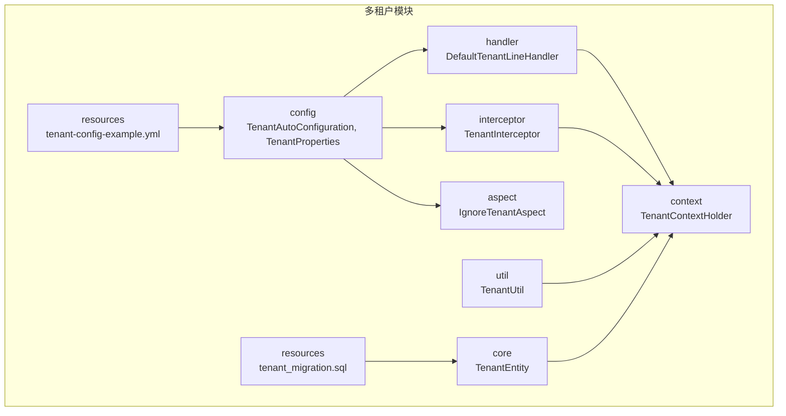
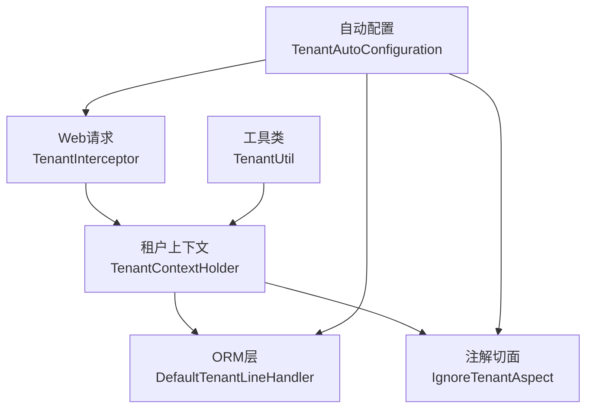
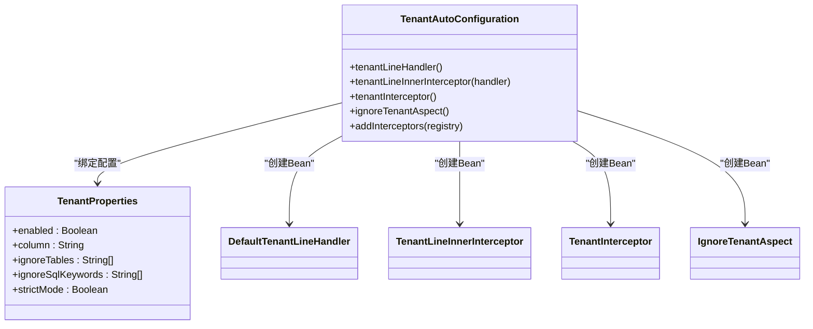
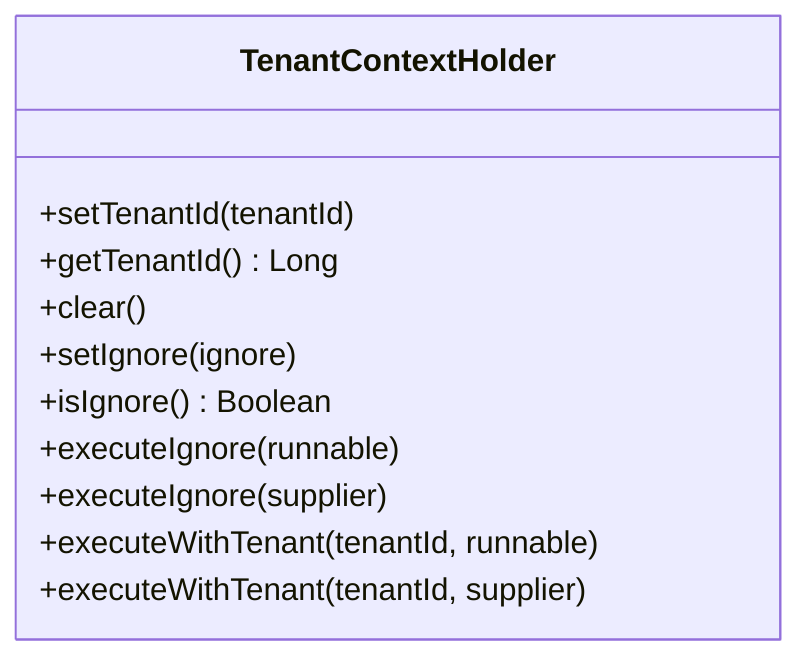
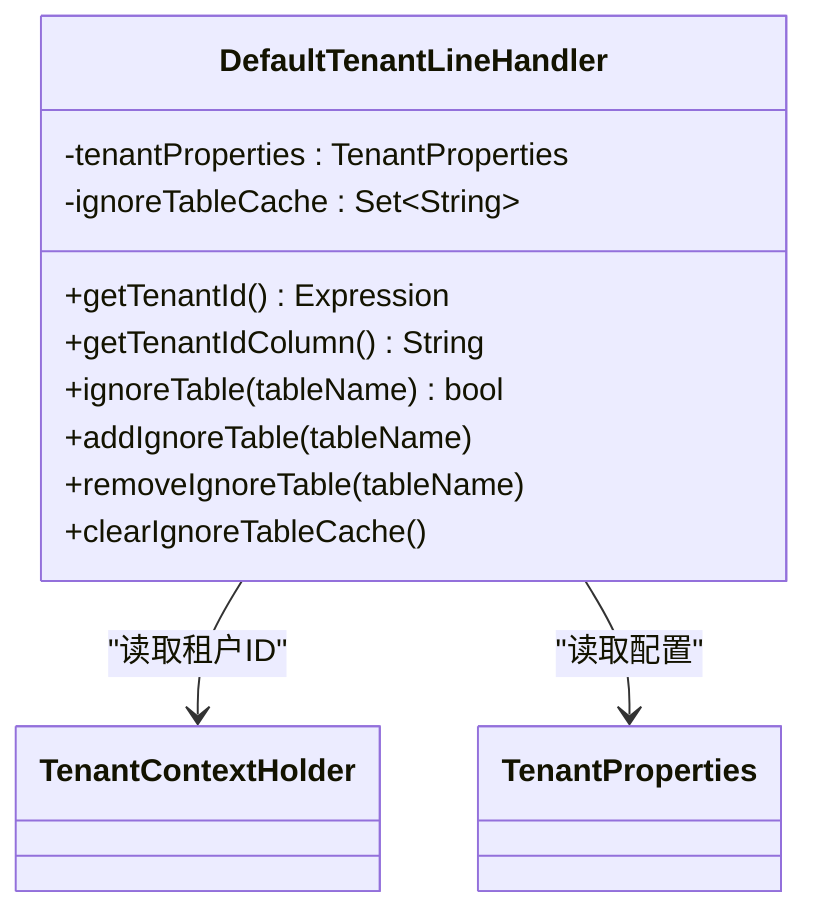
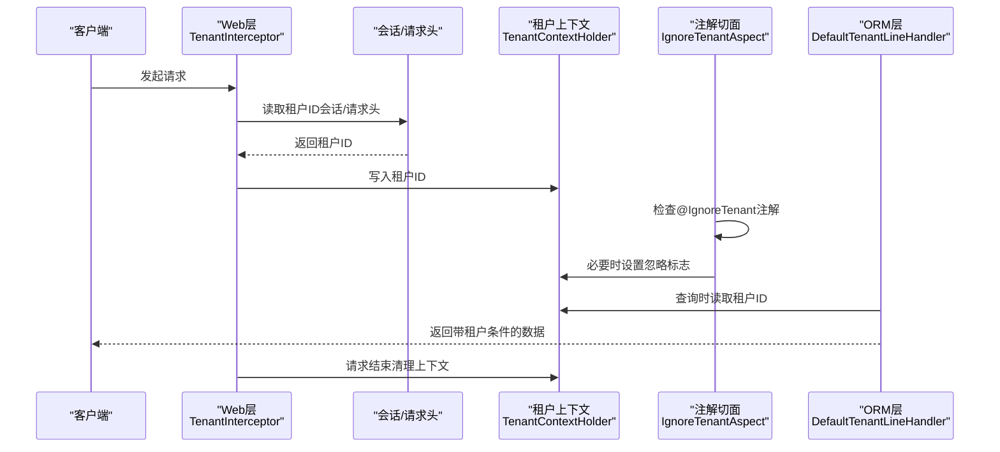
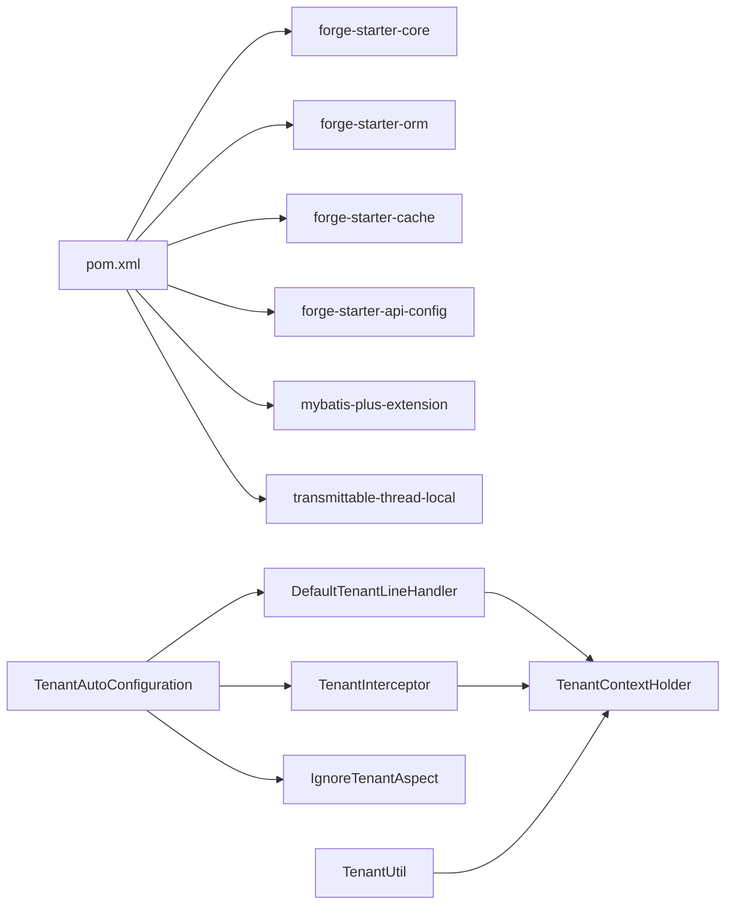

# 多租户管理

<cite>
**本文引用的文件**
- [TenantAutoConfiguration.java](file://forge/forge-framework/forge-starter-parent/forge-starter-tenant/src/main/java/com/mdframe/forge/starter/tenant/config/TenantAutoConfiguration.java)
- [TenantProperties.java](file://forge/forge-framework/forge-starter-parent/forge-starter-tenant/src/main/java/com/mdframe/forge/starter/tenant/config/TenantProperties.java)
- [TenantContextHolder.java](file://forge/forge-framework/forge-starter-parent/forge-starter-tenant/src/main/java/com/mdframe/forge/starter/tenant/context/TenantContextHolder.java)
- [TenantEntity.java](file://forge/forge-framework/forge-starter-parent/forge-starter-tenant/src/main/java/com/mdframe/forge/starter/tenant/core/TenantEntity.java)
- [DefaultTenantLineHandler.java](file://forge/forge-framework/forge-starter-parent/forge-starter-tenant/src/main/java/com/mdframe/forge/starter/tenant/handler/DefaultTenantLineHandler.java)
- [TenantUtil.java](file://forge/forge-framework/forge-starter-parent/forge-starter-tenant/src/main/java/com/mdframe/forge/starter/tenant/util/TenantUtil.java)
- [TenantInterceptor.java](file://forge/forge-framework/forge-starter-parent/forge-starter-tenant/src/main/java/com/mdframe/forge/starter/tenant/interceptor/TenantInterceptor.java)
- [IgnoreTenantAspect.java](file://forge/forge-framework/forge-starter-parent/forge-starter-tenant/src/main/java/com/mdframe/forge/starter/tenant/aspect/IgnoreTenantAspect.java)
- [tenant-config-example.yml](file://forge/forge-framework/forge-starter-parent/forge-starter-tenant/src/main/resources/tenant-config-example.yml)
- [tenant_migration.sql](file://forge/forge-framework/forge-starter-parent/forge-starter-tenant/src/main/resources/sql/tenant_migration.sql)
- [pom.xml](file://forge/forge-framework/forge-starter-parent/forge-starter-tenant/pom.xml)
</cite>

## 目录
1. [简介](#简介)
2. [项目结构](#项目结构)
3. [核心组件](#核心组件)
4. [架构总览](#架构总览)
5. [详细组件分析](#详细组件分析)
6. [依赖关系分析](#依赖关系分析)
7. [性能考虑](#性能考虑)
8. [故障排查指南](#故障排查指南)
9. [结论](#结论)
10. [附录](#附录)

## 简介
本文件面向Forge多租户管理系统，系统性梳理多租户隔离机制、租户上下文管理与数据隔离策略，深入解析TenantAutoConfiguration自动配置类、TenantProperties配置项、TenantContextHolder上下文管理器、TenantEntity实体标记、DefaultTenantLineHandler行级处理器、TenantUtil工具类以及多租户拦截器、线程传递机制、异步支持与数据库连接池配置等实现细节，并提供部署配置、租户切换机制与性能优化的最佳实践。

## 项目结构
多租户模块位于forge-starter-tenant，采用按职责分层的包结构：
- config：自动配置与属性定义
- context：租户上下文管理
- core：租户实体基类
- handler：MyBatis-Plus租户行处理器
- interceptor：Web层租户拦截器
- aspect：基于注解的租户忽略切面
- util：租户工具类
- resources：配置示例与迁移脚本

**图表来源**
- [TenantAutoConfiguration.java](file://forge/forge-framework/forge-starter-parent/forge-starter-tenant/src/main/java/com/mdframe/forge/starter/tenant/config/TenantAutoConfiguration.java#L1-L88)
- [TenantProperties.java](file://forge/forge-framework/forge-starter-parent/forge-starter-tenant/src/main/java/com/mdframe/forge/starter/tenant/config/TenantProperties.java#L1-L67)
- [TenantContextHolder.java](file://forge/forge-framework/forge-starter-parent/forge-starter-tenant/src/main/java/com/mdframe/forge/starter/tenant/context/TenantContextHolder.java#L1-L147)
- [TenantEntity.java](file://forge/forge-framework/forge-starter-parent/forge-starter-tenant/src/main/java/com/mdframe/forge/starter/tenant/core/TenantEntity.java#L1-L19)
- [DefaultTenantLineHandler.java](file://forge/forge-framework/forge-starter-parent/forge-starter-tenant/src/main/java/com/mdframe/forge/starter/tenant/handler/DefaultTenantLineHandler.java#L1-L88)
- [TenantInterceptor.java](file://forge/forge-framework/forge-starter-parent/forge-starter-tenant/src/main/java/com/mdframe/forge/starter/tenant/interceptor/TenantInterceptor.java#L1-L98)
- [IgnoreTenantAspect.java](file://forge/forge-framework/forge-starter-parent/forge-starter-tenant/src/main/java/com/mdframe/forge/starter/tenant/aspect/IgnoreTenantAspect.java#L1-L53)
- [TenantUtil.java](file://forge/forge-framework/forge-starter-parent/forge-starter-tenant/src/main/java/com/mdframe/forge/starter/tenant/util/TenantUtil.java#L1-L111)
- [tenant-config-example.yml](file://forge/forge-framework/forge-starter-parent/forge-starter-tenant/src/main/resources/tenant-config-example.yml#L1-L51)
- [tenant_migration.sql](file://forge/forge-framework/forge-starter-parent/forge-starter-tenant/src/main/resources/sql/tenant_migration.sql#L1-L107)

**章节来源**
- [pom.xml](file://forge/forge-framework/forge-starter-parent/forge-starter-tenant/pom.xml#L1-L59)

## 核心组件
- 自动配置与属性
  - TenantAutoConfiguration：负责注册租户处理器、SQL拦截器、Web拦截器与忽略注解切面；通过@EnableConfigurationProperties启用TenantProperties配置绑定。
  - TenantProperties：封装多租户开关、租户字段名、忽略表列表、忽略SQL关键字、严格模式等配置项。
- 上下文与工具
  - TenantContextHolder：基于TransmittableThreadLocal的租户上下文持有者，支持线程池场景的上下文传递；提供忽略租户与指定租户执行的辅助方法。
  - TenantUtil：对TenantContextHolder的便捷封装，提供静态方法访问租户上下文。
- 数据隔离与实体
  - DefaultTenantLineHandler：实现MyBatis-Plus租户行处理器接口，动态注入租户条件；支持忽略表缓存与上下文忽略标志。
  - TenantEntity：通用租户实体基类，统一包含tenantId字段。
- 拦截与切面
  - TenantInterceptor：Web层拦截器，从会话或请求头提取租户ID并写入上下文；支持API配置与注解控制忽略租户。
  - IgnoreTenantAspect：基于注解的环绕切面，拦截带有@IgnoreTenant的方法，临时忽略租户条件执行。
- 配置与迁移
  - tenant-config-example.yml：多租户配置示例，涵盖启用开关、字段名、严格模式、忽略表与SQL关键字。
  - tenant_migration.sql：为现有表添加tenant_id字段及索引、创建租户表、插入默认租户、迁移历史数据与索引优化建议。

**章节来源**
- [TenantAutoConfiguration.java](file://forge/forge-framework/forge-starter-parent/forge-starter-tenant/src/main/java/com/mdframe/forge/starter/tenant/config/TenantAutoConfiguration.java#L1-L88)
- [TenantProperties.java](file://forge/forge-framework/forge-starter-parent/forge-starter-tenant/src/main/java/com/mdframe/forge/starter/tenant/config/TenantProperties.java#L1-L67)
- [TenantContextHolder.java](file://forge/forge-framework/forge-starter-parent/forge-starter-tenant/src/main/java/com/mdframe/forge/starter/tenant/context/TenantContextHolder.java#L1-L147)
- [TenantEntity.java](file://forge/forge-framework/forge-starter-parent/forge-starter-tenant/src/main/java/com/mdframe/forge/starter/tenant/core/TenantEntity.java#L1-L19)
- [DefaultTenantLineHandler.java](file://forge/forge-framework/forge-starter-parent/forge-starter-tenant/src/main/java/com/mdframe/forge/starter/tenant/handler/DefaultTenantLineHandler.java#L1-L88)
- [TenantInterceptor.java](file://forge/forge-framework/forge-starter-parent/forge-starter-tenant/src/main/java/com/mdframe/forge/starter/tenant/interceptor/TenantInterceptor.java#L1-L98)
- [IgnoreTenantAspect.java](file://forge/forge-framework/forge-starter-parent/forge-starter-tenant/src/main/java/com/mdframe/forge/starter/tenant/aspect/IgnoreTenantAspect.java#L1-L53)
- [TenantUtil.java](file://forge/forge-framework/forge-starter-parent/forge-starter-tenant/src/main/java/com/mdframe/forge/starter/tenant/util/TenantUtil.java#L1-L111)
- [tenant-config-example.yml](file://forge/forge-framework/forge-starter-parent/forge-starter-tenant/src/main/resources/tenant-config-example.yml#L1-L51)
- [tenant_migration.sql](file://forge/forge-framework/forge-starter-parent/forge-starter-tenant/src/main/resources/sql/tenant_migration.sql#L1-L107)

## 架构总览
多租户架构围绕“上下文—处理器—拦截器—注解切面”协同工作，形成从Web层到ORM层的全链路隔离。

**图表来源**
- [TenantAutoConfiguration.java](file://forge/forge-framework/forge-starter-parent/forge-starter-tenant/src/main/java/com/mdframe/forge/starter/tenant/config/TenantAutoConfiguration.java#L1-L88)
- [TenantContextHolder.java](file://forge/forge-framework/forge-starter-parent/forge-starter-tenant/src/main/java/com/mdframe/forge/starter/tenant/context/TenantContextHolder.java#L1-L147)
- [DefaultTenantLineHandler.java](file://forge/forge-framework/forge-starter-parent/forge-starter-tenant/src/main/java/com/mdframe/forge/starter/tenant/handler/DefaultTenantLineHandler.java#L1-L88)
- [TenantInterceptor.java](file://forge/forge-framework/forge-starter-parent/forge-starter-tenant/src/main/java/com/mdframe/forge/starter/tenant/interceptor/TenantInterceptor.java#L1-L98)
- [IgnoreTenantAspect.java](file://forge/forge-framework/forge-starter-parent/forge-starter-tenant/src/main/java/com/mdframe/forge/starter/tenant/aspect/IgnoreTenantAspect.java#L1-L53)
- [TenantUtil.java](file://forge/forge-framework/forge-starter-parent/forge-starter-tenant/src/main/java/com/mdframe/forge/starter/tenant/util/TenantUtil.java#L1-L111)

## 详细组件分析

### TenantAutoConfiguration 自动配置类
- 职责
  - 注册租户处理器Bean（DefaultTenantLineHandler），绑定TenantProperties。
  - 注册TenantLineInnerInterceptor（交由MyBatis-Plus统一注册）。
  - 注册Web层租户拦截器（TenantInterceptor），并设置拦截路径与优先级。
  - 注册忽略租户注解切面（IgnoreTenantAspect）。
  - 基于条件注解启用：当配置开关开启时生效。
- 关键点
  - 仅暴露Bean，不直接注册到拦截器链，由上层ORM配置统一装配。
  - 优先级高于ORM配置，确保在ORM拦截器之前加载。
  - 通过@EnableConfigurationProperties绑定配置前缀。

**图表来源**
- [TenantAutoConfiguration.java](file://forge/forge-framework/forge-starter-parent/forge-starter-tenant/src/main/java/com/mdframe/forge/starter/tenant/config/TenantAutoConfiguration.java#L1-L88)
- [TenantProperties.java](file://forge/forge-framework/forge-starter-parent/forge-starter-tenant/src/main/java/com/mdframe/forge/starter/tenant/config/TenantProperties.java#L1-L67)

**章节来源**
- [TenantAutoConfiguration.java](file://forge/forge-framework/forge-starter-parent/forge-starter-tenant/src/main/java/com/mdframe/forge/starter/tenant/config/TenantAutoConfiguration.java#L1-L88)

### TenantProperties 租户属性配置
- 配置项
  - enabled：是否启用多租户，默认true。
  - column：租户字段名，默认tenant_id。
  - ignoreTables：忽略租户的表名列表，默认包含系统配置、字典、文件、Excel、作业、生成器、雪花ID等表。
  - ignoreSqlKeywords：忽略租户的SQL关键字列表（扩展能力）。
  - strictMode：严格模式，未获取到租户ID时的行为选择。
- 设计要点
  - 默认忽略表覆盖常见系统级表，避免误隔离。
  - 支持通过配置扩展忽略表与关键字。

**章节来源**
- [TenantProperties.java](file://forge/forge-framework/forge-starter-parent/forge-starter-tenant/src/main/java/com/mdframe/forge/starter/tenant/config/TenantProperties.java#L1-L67)
- [tenant-config-example.yml](file://forge/forge-framework/forge-starter-parent/forge-starter-tenant/src/main/resources/tenant-config-example.yml#L1-L51)

### TenantContextHolder 租户上下文管理器
- 线程本地存储
  - 使用TransmittableThreadLocal保存租户ID与忽略标志，支持线程池场景的上下文传递。
- 核心方法
  - setTenantId/getTenantId/clear：设置、获取与清理租户ID。
  - setIgnore/isIgnore：设置与判断忽略租户标志。
  - executeIgnore/executeWithTenant：在临时忽略或指定租户上下文下执行任务并恢复现场。
- 异步支持
  - 基于阿里TTL库，确保跨线程、线程池场景的上下文一致性。

**图表来源**
- [TenantContextHolder.java](file://forge/forge-framework/forge-starter-parent/forge-starter-tenant/src/main/java/com/mdframe/forge/starter/tenant/context/TenantContextHolder.java#L1-L147)

**章节来源**
- [TenantContextHolder.java](file://forge/forge-framework/forge-starter-parent/forge-starter-tenant/src/main/java/com/mdframe/forge/starter/tenant/context/TenantContextHolder.java#L1-L147)

### TenantEntity 租户实体标记
- 作用
  - 作为业务实体继承基类，统一携带tenantId字段，便于ORM映射与后续扩展。
- 设计
  - 继承通用BaseEntity，简化实体开发。

**章节来源**
- [TenantEntity.java](file://forge/forge-framework/forge-starter-parent/forge-starter-tenant/src/main/java/com/mdframe/forge/starter/tenant/core/TenantEntity.java#L1-L19)

### DefaultTenantLineHandler 默认租户行处理器
- 功能
  - 实现租户行处理器接口，向SQL注入租户条件。
  - 从TenantContextHolder读取租户ID，若为空则返回NULL值（可结合严格模式策略）。
  - 支持忽略表列表与缓存优化，提升性能。
- 缓存策略
  - ignoreTableCache：缓存忽略表，减少重复判断开销。
- 可维护性
  - 提供add/remove/clear接口以动态调整忽略表集合。

**图表来源**
- [DefaultTenantLineHandler.java](file://forge/forge-framework/forge-starter-parent/forge-starter-tenant/src/main/java/com/mdframe/forge/starter/tenant/handler/DefaultTenantLineHandler.java#L1-L88)

**章节来源**
- [DefaultTenantLineHandler.java](file://forge/forge-framework/forge-starter-parent/forge-starter-tenant/src/main/java/com/mdframe/forge/starter/tenant/handler/DefaultTenantLineHandler.java#L1-L88)

### TenantUtil 租户工具类
- 作用
  - 对TenantContextHolder进行静态封装，提供便捷的租户上下文操作方法。
- 方法族
  - getTenantId/setTenantId/clear/hasTenantId/isIgnore/setIgnore。
  - ignore/with：在忽略或指定租户上下文下执行任务。

**章节来源**
- [TenantUtil.java](file://forge/forge-framework/forge-starter-parent/forge-starter-tenant/src/main/java/com/mdframe/forge/starter/tenant/util/TenantUtil.java#L1-L111)

### 多租户拦截器与注解切面
- TenantInterceptor（Web层）
  - 在preHandle阶段从会话或请求头提取租户ID并写入上下文。
  - 支持API配置与@IgnoreTenant注解控制忽略租户。
  - afterCompletion阶段清理上下文，避免内存泄漏。
- IgnoreTenantAspect（方法级）
  - 基于注解的环绕切面，拦截带@IgnoreTenant的方法，临时忽略租户执行。
  - 保证在其他切面之前执行，优先级较高。

**图表来源**
- [TenantInterceptor.java](file://forge/forge-framework/forge-starter-parent/forge-starter-tenant/src/main/java/com/mdframe/forge/starter/tenant/interceptor/TenantInterceptor.java#L1-L98)
- [IgnoreTenantAspect.java](file://forge/forge-framework/forge-starter-parent/forge-starter-tenant/src/main/java/com/mdframe/forge/starter/tenant/aspect/IgnoreTenantAspect.java#L1-L53)
- [DefaultTenantLineHandler.java](file://forge/forge-framework/forge-starter-parent/forge-starter-tenant/src/main/java/com/mdframe/forge/starter/tenant/handler/DefaultTenantLineHandler.java#L1-L88)
- [TenantContextHolder.java](file://forge/forge-framework/forge-starter-parent/forge-starter-tenant/src/main/java/com/mdframe/forge/starter/tenant/context/TenantContextHolder.java#L1-L147)

**章节来源**
- [TenantInterceptor.java](file://forge/forge-framework/forge-starter-parent/forge-starter-tenant/src/main/java/com/mdframe/forge/starter/tenant/interceptor/TenantInterceptor.java#L1-L98)
- [IgnoreTenantAspect.java](file://forge/forge-framework/forge-starter-parent/forge-starter-tenant/src/main/java/com/mdframe/forge/starter/tenant/aspect/IgnoreTenantAspect.java#L1-L53)

### 数据库迁移与索引优化
- 迁移脚本要点
  - 为常用业务表（用户、角色、组织、岗位、资源、公告等）添加tenant_id字段与索引。
  - 创建sys_tenant租户表，包含基础元信息与唯一约束。
  - 插入默认租户示例，迁移历史数据至默认租户。
  - 提供联合索引示例，提升查询效率。
- 建议
  - 执行前备份数据库。
  - 根据实际表结构调整字段位置与索引策略。

**章节来源**
- [tenant_migration.sql](file://forge/forge-framework/forge-starter-parent/forge-starter-tenant/src/main/resources/sql/tenant_migration.sql#L1-L107)

## 依赖关系分析
- 模块依赖
  - 依赖forge-starter-core、forge-starter-orm、forge-starter-cache、forge-starter-api-config等模块。
  - 依赖MyBatis-Plus扩展与TransmittableThreadLocal以支持异步线程传递。
- 组件耦合
  - TenantAutoConfiguration与各组件通过Spring Bean装配耦合，保持低耦合高内聚。
  - DefaultTenantLineHandler与TenantContextHolder存在运行时依赖，但通过接口解耦。

**图表来源**
- [pom.xml](file://forge/forge-framework/forge-starter-parent/forge-starter-tenant/pom.xml#L1-L59)
- [TenantAutoConfiguration.java](file://forge/forge-framework/forge-starter-parent/forge-starter-tenant/src/main/java/com/mdframe/forge/starter/tenant/config/TenantAutoConfiguration.java#L1-L88)
- [DefaultTenantLineHandler.java](file://forge/forge-framework/forge-starter-parent/forge-starter-tenant/src/main/java/com/mdframe/forge/starter/tenant/handler/DefaultTenantLineHandler.java#L1-L88)
- [TenantInterceptor.java](file://forge/forge-framework/forge-starter-parent/forge-starter-tenant/src/main/java/com/mdframe/forge/starter/tenant/interceptor/TenantInterceptor.java#L1-L98)
- [IgnoreTenantAspect.java](file://forge/forge-framework/forge-starter-parent/forge-starter-tenant/src/main/java/com/mdframe/forge/starter/tenant/aspect/IgnoreTenantAspect.java#L1-L53)
- [TenantUtil.java](file://forge/forge-framework/forge-starter-parent/forge-starter-tenant/src/main/java/com/mdframe/forge/starter/tenant/util/TenantUtil.java#L1-L111)

**章节来源**
- [pom.xml](file://forge/forge-framework/forge-starter-parent/forge-starter-tenant/pom.xml#L1-L59)

## 性能考虑
- 忽略表缓存
  - DefaultTenantLineHandler内部维护ignoreTableCache，避免重复判断忽略表带来的性能损耗。
- 索引设计
  - 为tenant_id字段建立单列或联合索引，配合业务查询条件优化。
- SQL关键字忽略
  - 通过ignoreSqlKeywords避免对特定SQL（如聚合查询）添加租户条件，减少不必要的过滤。
- 线程传递
  - 使用TransmittableThreadLocal确保异步场景下上下文一致，避免重复设置带来的额外开销。
- 严格模式
  - 在严格模式下未获取到租户ID将抛出异常，有助于提前发现上下文缺失问题，降低运行时风险。

[本节为通用性能指导，无需具体文件分析]

## 故障排查指南
- 未设置租户ID
  - 现象：DefaultTenantLineHandler返回NULL值，导致查询无租户过滤。
  - 排查：确认Web层TenantInterceptor是否正确从会话或请求头读取租户ID；检查API配置与@IgnoreTenant注解是否误用。
- 忽略租户无效
  - 现象：期望忽略租户但未生效。
  - 排查：确认IgnoreTenantAspect是否启用且优先级足够高；检查TenantContextHolder的忽略标志是否被正确设置与清理。
- 索引缺失导致查询慢
  - 现象：大量数据查询变慢。
  - 排查：核对tenant_id索引是否存在；参考迁移脚本示例创建联合索引。
- 异步线程上下文丢失
  - 现象：线程池执行时租户ID丢失。
  - 排查：确认使用TenantUtil或TenantContextHolder提供的executeIgnore/executeWithTenant方法包裹异步任务；确保TTL库版本兼容。
- 配置不生效
  - 现象：修改配置后未生效。
  - 排查：确认配置前缀与开关项正确；检查自动配置类的条件注解是否满足。

**章节来源**
- [DefaultTenantLineHandler.java](file://forge/forge-framework/forge-starter-parent/forge-starter-tenant/src/main/java/com/mdframe/forge/starter/tenant/handler/DefaultTenantLineHandler.java#L1-L88)
- [TenantInterceptor.java](file://forge/forge-framework/forge-starter-parent/forge-starter-tenant/src/main/java/com/mdframe/forge/starter/tenant/interceptor/TenantInterceptor.java#L1-L98)
- [IgnoreTenantAspect.java](file://forge/forge-framework/forge-starter-parent/forge-starter-tenant/src/main/java/com/mdframe/forge/starter/tenant/aspect/IgnoreTenantAspect.java#L1-L53)
- [TenantContextHolder.java](file://forge/forge-framework/forge-starter-parent/forge-starter-tenant/src/main/java/com/mdframe/forge/starter/tenant/context/TenantContextHolder.java#L1-L147)
- [tenant-config-example.yml](file://forge/forge-framework/forge-starter-parent/forge-starter-tenant/src/main/resources/tenant-config-example.yml#L1-L51)

## 结论
Forge多租户管理通过“自动配置—上下文—处理器—拦截器—注解切面”的协同，实现了从Web到ORM的全链路租户隔离。TenantContextHolder提供可靠的线程传递机制，DefaultTenantLineHandler与TenantProperties共同保障数据隔离策略的灵活性与可维护性。结合迁移脚本与索引优化，可在保证性能的同时满足多租户业务需求。建议在生产环境遵循严格模式与最小化忽略表原则，确保租户边界清晰、安全可控。

[本节为总结性内容，无需具体文件分析]

## 附录

### 部署与配置最佳实践
- 启用与字段
  - 开启多租户开关，统一租户字段名，确保所有需要隔离的表均具备该字段。
- 忽略表清单
  - 将系统级表加入忽略列表，避免误隔离；定期审查与更新。
- 严格模式
  - 在关键业务模块启用严格模式，确保上下文完整性。
- 请求头透传
  - 在网关或代理层透传X-Tenant-Id，便于无会话场景下的租户识别。
- 索引与查询
  - 为tenant_id与常用查询字段建立索引，避免全表扫描。

**章节来源**
- [tenant-config-example.yml](file://forge/forge-framework/forge-starter-parent/forge-starter-tenant/src/main/resources/tenant-config-example.yml#L1-L51)
- [tenant_migration.sql](file://forge/forge-framework/forge-starter-parent/forge-starter-tenant/src/main/resources/sql/tenant_migration.sql#L1-L107)

### 租户切换机制
- 临时忽略
  - 使用TenantUtil.ignore或TenantContextHolder.executeIgnore在特定流程中忽略租户。
- 指定租户
  - 使用TenantUtil.with或TenantContextHolder.executeWithTenant在指定租户上下文下执行任务。
- 生命周期清理
  - Web层afterCompletion阶段统一清理上下文，防止内存泄漏。

**章节来源**
- [TenantUtil.java](file://forge/forge-framework/forge-starter-parent/forge-starter-tenant/src/main/java/com/mdframe/forge/starter/tenant/util/TenantUtil.java#L1-L111)
- [TenantContextHolder.java](file://forge/forge-framework/forge-starter-parent/forge-starter-tenant/src/main/java/com/mdframe/forge/starter/tenant/context/TenantContextHolder.java#L1-L147)
- [TenantInterceptor.java](file://forge/forge-framework/forge-starter-parent/forge-starter-tenant/src/main/java/com/mdframe/forge/starter/tenant/interceptor/TenantInterceptor.java#L1-L98)

### 异步支持与线程传递
- 使用TransmittableThreadLocal确保跨线程、线程池场景的上下文一致性。
- 推荐通过TenantUtil或TenantContextHolder提供的executeWithTenant/executeIgnore方法包裹异步任务。

**章节来源**
- [TenantContextHolder.java](file://forge/forge-framework/forge-starter-parent/forge-starter-tenant/src/main/java/com/mdframe/forge/starter/tenant/context/TenantContextHolder.java#L1-L147)

### 数据库连接池配置建议
- 连接池参数
  - 合理设置最大连接数、空闲超时与连接生命周期，避免长时间占用导致上下文滞留。
- 事务与隔离
  - 确保事务边界清晰，避免跨租户数据泄露；在异步任务中显式设置租户上下文。
- 监控与告警
  - 监控租户上下文缺失率与SQL执行计划变化，及时发现配置与索引问题。

[本节为通用配置建议，无需具体文件分析]