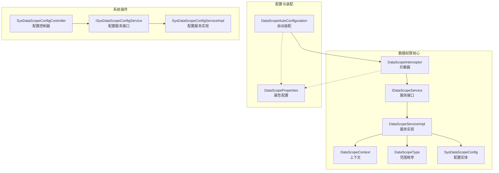
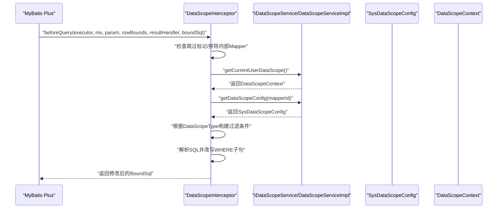
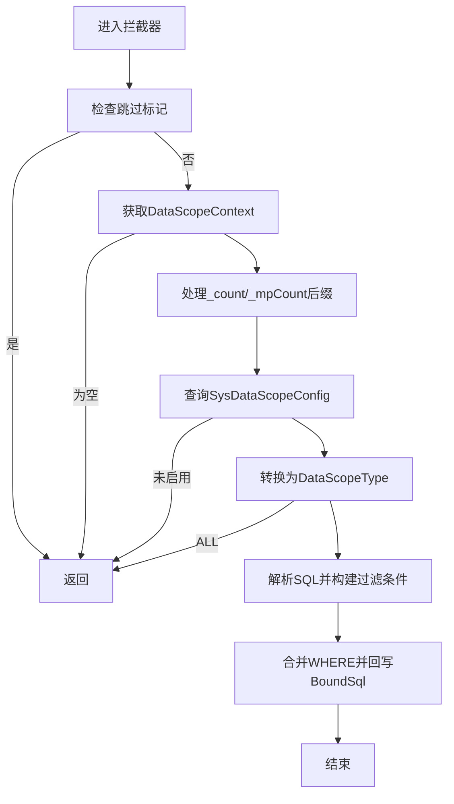
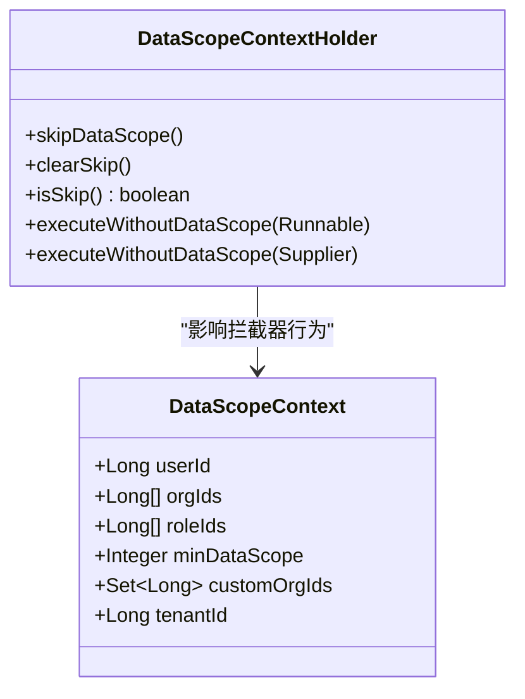
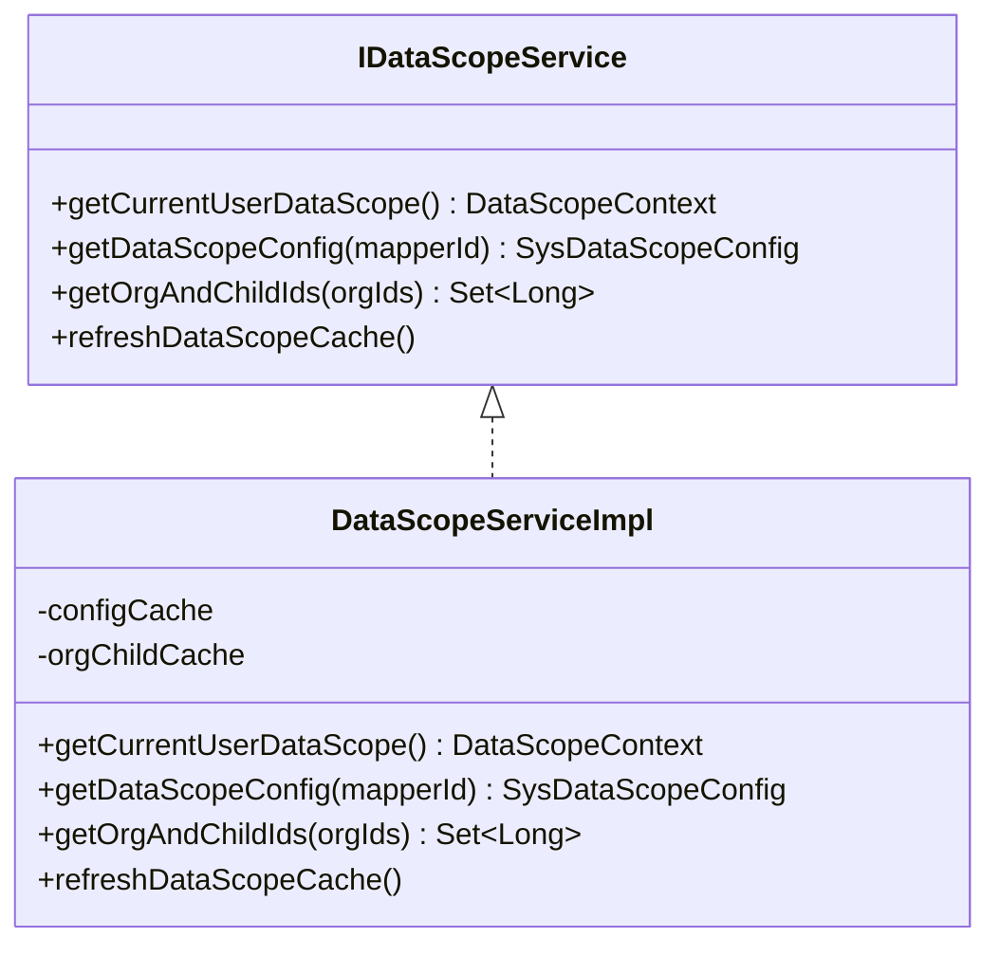
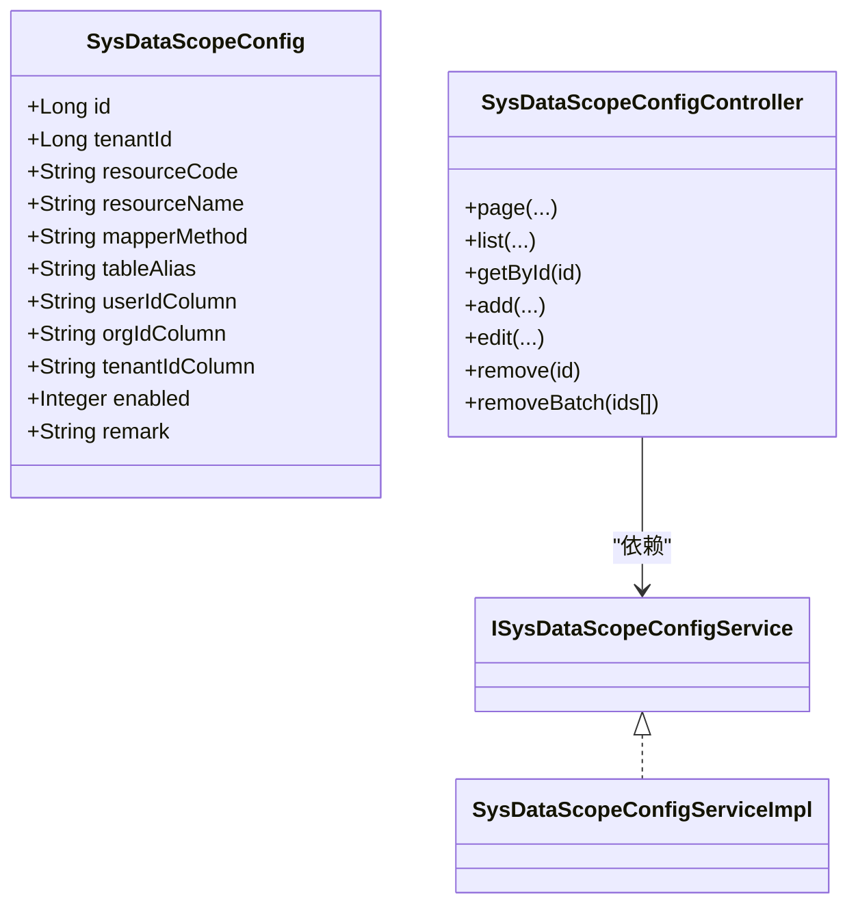
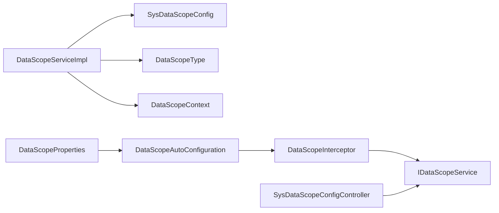

# 数据权限控制

<cite>
**本文引用的文件**
- [DataScopeInterceptor.java](file://forge/forge-framework/forge-starter-parent/forge-starter-datascope/src/main/java/com/mdframe/forge/starter/datascope/handler/DataScopeInterceptor.java)
- [DataScopeAutoConfiguration.java](file://forge/forge-framework/forge-starter-parent/forge-starter-datascope/src/main/java/com/mdframe/forge/starter/datascope/config/DataScopeAutoConfiguration.java)
- [DataScopeProperties.java](file://forge/forge-framework/forge-starter-parent/forge-starter-datascope/src/main/java/com/mdframe/forge/starter/datascope/config/DataScopeProperties.java)
- [DataScopeContext.java](file://forge/forge-framework/forge-starter-parent/forge-starter-datascope/src/main/java/com/mdframe/forge/starter/datascope/context/DataScopeContext.java)
- [DataScopeContextHolder.java](file://forge/forge-framework/forge-starter-parent/forge-starter-datascope/src/main/java/com/mdframe/forge/starter/datascope/context/DataScopeContextHolder.java)
- [IDataScopeService.java](file://forge/forge-framework/forge-starter-parent/forge-starter-datascope/src/main/java/com/mdframe/forge/starter/datascope/service/IDataScopeService.java)
- [DataScopeServiceImpl.java](file://forge/forge-framework/forge-starter-parent/forge-starter-datascope/src/main/java/com/mdframe/forge/starter/datascope/service/impl/DataScopeServiceImpl.java)
- [DataScopeType.java](file://forge/forge-framework/forge-starter-parent/forge-starter-datascope/src/main/java/com/mdframe/forge/starter/datascope/enums/DataScopeType.java)
- [SysDataScopeConfig.java](file://forge/forge-framework/forge-starter-parent/forge-starter-datascope/src/main/java/com/mdframe/forge/starter/datascope/entity/SysDataScopeConfig.java)
- [SysDataScopeConfigController.java](file://forge/forge-framework/forge-plugin-parent/forge-plugin-system/src/main/java/com/mdframe/forge/plugin/system/controller/SysDataScopeConfigController.java)
- [ISysDataScopeConfigService.java](file://forge/forge-framework/forge-plugin-parent/forge-plugin-system/src/main/java/com/mdframe/forge/plugin/system/service/ISysDataScopeConfigService.java)
- [SysDataScopeConfigServiceImpl.java](file://forge/forge-framework/forge-plugin-parent/forge-plugin-system/src/main/java/com/mdframe/forge/plugin/system/service/impl/SysDataScopeConfigServiceImpl.java)
</cite>

## 目录
1. [简介](#简介)
2. [项目结构](#项目结构)
3. [核心组件](#核心组件)
4. [架构总览](#架构总览)
5. [组件详解](#组件详解)
6. [依赖关系分析](#依赖关系分析)
7. [性能与扩展性](#性能与扩展性)
8. [故障排查指南](#故障排查指南)
9. [结论](#结论)
10. [附录](#附录)

## 简介
本技术文档围绕Forge数据权限控制系统展开，重点解析数据权限拦截器在MyBatis Plus执行前自动注入数据范围过滤条件的工作原理；阐述数据范围类型（全部数据、本人、本部门、本部门及以下、指定部门、租户全部）的实现逻辑与配置方法；说明DataScopeContext上下文管理、DataScopeProperties属性配置以及SysDataScopeConfig数据权限配置实体的设计思路；并提供配置示例、角色权限绑定与部门数据范围设置的实际应用场景。

## 项目结构
数据权限控制位于“forge-starter-datascope”模块，采用“starter”形式提供能力，并通过系统插件模块提供配置界面与持久化能力。关键文件分布如下：
- handler：拦截器与SQL改写逻辑
- config：自动装配与属性配置
- context：上下文与线程安全控制
- service：数据权限服务与缓存
- entity：数据权限配置实体
- enums：数据范围类型枚举
- controller/service（系统插件）：数据权限配置的CRUD与分页

图表来源
- [DataScopeInterceptor.java](file://forge/forge-framework/forge-starter-parent/forge-starter-datascope/src/main/java/com/mdframe/forge/starter/datascope/handler/DataScopeInterceptor.java#L35-L117)
- [DataScopeAutoConfiguration.java](file://forge/forge-framework/forge-starter-parent/forge-starter-datascope/src/main/java/com/mdframe/forge/starter/datascope/config/DataScopeAutoConfiguration.java#L15-L38)
- [DataScopeProperties.java](file://forge/forge-framework/forge-starter-parent/forge-starter-datascope/src/main/java/com/mdframe/forge/starter/datascope/config/DataScopeProperties.java#L1-L23)
- [DataScopeContext.java](file://forge/forge-framework/forge-starter-parent/forge-starter-datascope/src/main/java/com/mdframe/forge/starter/datascope/context/DataScopeContext.java#L10-L48)
- [IDataScopeService.java](file://forge/forge-framework/forge-starter-parent/forge-starter-datascope/src/main/java/com/mdframe/forge/starter/datascope/service/IDataScopeService.java#L12-L42)
- [DataScopeServiceImpl.java](file://forge/forge-framework/forge-starter-parent/forge-starter-datascope/src/main/java/com/mdframe/forge/starter/datascope/service/impl/DataScopeServiceImpl.java#L21-L177)
- [DataScopeType.java](file://forge/forge-framework/forge-starter-parent/forge-starter-datascope/src/main/java/com/mdframe/forge/starter/datascope/enums/DataScopeType.java#L6-L61)
- [SysDataScopeConfig.java](file://forge/forge-framework/forge-starter-parent/forge-starter-datascope/src/main/java/com/mdframe/forge/starter/datascope/entity/SysDataScopeConfig.java#L10-L85)
- [SysDataScopeConfigController.java](file://forge/forge-framework/forge-plugin-parent/forge-plugin-system/src/main/java/com/mdframe/forge/plugin/system/controller/SysDataScopeConfigController.java#L29-L58)
- [ISysDataScopeConfigService.java](file://forge/forge-framework/forge-plugin-parent/forge-plugin-system/src/main/java/com/mdframe/forge/plugin/system/service/ISysDataScopeConfigService.java)
- [SysDataScopeConfigServiceImpl.java](file://forge/forge-framework/forge-plugin-parent/forge-plugin-system/src/main/java/com/mdframe/forge/plugin/system/service/impl/SysDataScopeConfigServiceImpl.java)

章节来源
- [DataScopeAutoConfiguration.java](file://forge/forge-framework/forge-starter-parent/forge-starter-datascope/src/main/java/com/mdframe/forge/starter/datascope/config/DataScopeAutoConfiguration.java#L15-L38)
- [DataScopeProperties.java](file://forge/forge-framework/forge-starter-parent/forge-starter-datascope/src/main/java/com/mdframe/forge/starter/datascope/config/DataScopeProperties.java#L1-L23)

## 核心组件
- DataScopeInterceptor：基于MyBatis Plus InnerInterceptor，在SQL执行前解析并改写WHERE条件，注入数据权限过滤。
- IDataScopeService/DataScopeServiceImpl：负责构建DataScopeContext、查询数据权限配置、计算组织树、缓存管理。
- DataScopeContext：封装当前用户的权限上下文（用户ID、组织ID列表、角色ID列表、最小权限范围、自定义组织集合、租户ID）。
- DataScopeType：定义数据范围类型（全部、本人、本部门、本部门及以下、自定义、租户全部）。
- SysDataScopeConfig：数据权限配置实体，描述Mapper方法、表别名、字段映射、启用状态等。
- DataScopeContextHolder：线程级别的“跳过数据权限”标记工具，支持无权限场景的执行。
- DataScopeAutoConfiguration/DataScopeProperties：自动装配与开关、日志打印等属性配置。

章节来源
- [DataScopeInterceptor.java](file://forge/forge-framework/forge-starter-parent/forge-starter-datascope/src/main/java/com/mdframe/forge/starter/datascope/handler/DataScopeInterceptor.java#L35-L117)
- [IDataScopeService.java](file://forge/forge-framework/forge-starter-parent/forge-starter-datascope/src/main/java/com/mdframe/forge/starter/datascope/service/IDataScopeService.java#L12-L42)
- [DataScopeServiceImpl.java](file://forge/forge-framework/forge-starter-parent/forge-starter-datascope/src/main/java/com/mdframe/forge/starter/datascope/service/impl/DataScopeServiceImpl.java#L50-L115)
- [DataScopeContext.java](file://forge/forge-framework/forge-starter-parent/forge-starter-datascope/src/main/java/com/mdframe/forge/starter/datascope/context/DataScopeContext.java#L10-L48)
- [DataScopeType.java](file://forge/forge-framework/forge-starter-parent/forge-starter-datascope/src/main/java/com/mdframe/forge/starter/datascope/enums/DataScopeType.java#L6-L61)
- [SysDataScopeConfig.java](file://forge/forge-framework/forge-starter-parent/forge-starter-datascope/src/main/java/com/mdframe/forge/starter/datascope/entity/SysDataScopeConfig.java#L10-L85)
- [DataScopeContextHolder.java](file://forge/forge-framework/forge-starter-parent/forge-starter-datascope/src/main/java/com/mdframe/forge/starter/datascope/context/DataScopeContextHolder.java#L7-L62)

## 架构总览
下图展示数据权限拦截器在MyBatis Plus生命周期中的工作流，以及与服务层、配置层、上下文层的交互。

图表来源
- [DataScopeInterceptor.java](file://forge/forge-framework/forge-starter-parent/forge-starter-datascope/src/main/java/com/mdframe/forge/starter/datascope/handler/DataScopeInterceptor.java#L41-L117)
- [IDataScopeService.java](file://forge/forge-framework/forge-starter-parent/forge-starter-datascope/src/main/java/com/mdframe/forge/starter/datascope/service/IDataScopeService.java#L19-L27)
- [DataScopeServiceImpl.java](file://forge/forge-framework/forge-starter-parent/forge-starter-datascope/src/main/java/com/mdframe/forge/starter/datascope/service/impl/DataScopeServiceImpl.java#L117-L138)
- [SysDataScopeConfig.java](file://forge/forge-framework/forge-starter-parent/forge-starter-datascope/src/main/java/com/mdframe/forge/starter/datascope/entity/SysDataScopeConfig.java#L42-L78)
- [DataScopeContext.java](file://forge/forge-framework/forge-starter-parent/forge-starter-datascope/src/main/java/com/mdframe/forge/starter/datascope/context/DataScopeContext.java#L16-L46)

## 组件详解

### 数据权限拦截器：DataScopeInterceptor
- 触发时机：在MyBatis Plus执行前调用，解析并改写SQL。
- 关键流程：
  - 跳过标记检查：若开启跳过，则直接放行。
  - 排除内部Mapper：避免对框架自身Mapper进行改写。
  - 获取上下文：通过IDataScopeService获取DataScopeContext。
  - 分页count兼容：将_count/_mpCount后缀还原为原方法名再查询配置。
  - 配置查询与启用校验：按mapperId查询SysDataScopeConfig并检查enabled。
  - 权限类型判定：根据DataScopeContext.minDataScope转换为DataScopeType。
  - 全部数据放行：当类型为ALL时直接返回。
  - SQL改写：解析原SQL，构造过滤条件并合并到WHERE子句，最后回写BoundSql。
- 过滤条件构建：
  - 本人：userIdColumn = 当前用户ID
  - 本部门：orgIdColumn IN (orgIds)
  - 本部门及以下：orgIdColumn IN (orgIds + 子部门集合)
  - 自定义：orgIdColumn IN (自定义组织集合)
  - 租户全部：tenantIdColumn = 当前租户ID
  - 复杂字段：支持以“<sql>”开头的表达式，内置占位符#{userId}、#{tenantId}、#{orgIds}、#{customOrgIds}

图表来源
- [DataScopeInterceptor.java](file://forge/forge-framework/forge-starter-parent/forge-starter-datascope/src/main/java/com/mdframe/forge/starter/datascope/handler/DataScopeInterceptor.java#L41-L117)
- [DataScopeInterceptor.java](file://forge/forge-framework/forge-starter-parent/forge-starter-datascope/src/main/java/com/mdframe/forge/starter/datascope/handler/DataScopeInterceptor.java#L119-L156)
- [DataScopeInterceptor.java](file://forge/forge-framework/forge-starter-parent/forge-starter-datascope/src/main/java/com/mdframe/forge/starter/datascope/handler/DataScopeInterceptor.java#L158-L209)
- [DataScopeInterceptor.java](file://forge/forge-framework/forge-starter-parent/forge-starter-datascope/src/main/java/com/mdframe/forge/starter/datascope/handler/DataScopeInterceptor.java#L211-L260)
- [DataScopeInterceptor.java](file://forge/forge-framework/forge-starter-parent/forge-starter-datascope/src/main/java/com/mdframe/forge/starter/datascope/handler/DataScopeInterceptor.java#L262-L314)

章节来源
- [DataScopeInterceptor.java](file://forge/forge-framework/forge-starter-parent/forge-starter-datascope/src/main/java/com/mdframe/forge/starter/datascope/handler/DataScopeInterceptor.java#L35-L117)
- [DataScopeInterceptor.java](file://forge/forge-framework/forge-starter-parent/forge-starter-datascope/src/main/java/com/mdframe/forge/starter/datascope/handler/DataScopeInterceptor.java#L119-L209)
- [DataScopeInterceptor.java](file://forge/forge-framework/forge-starter-parent/forge-starter-datascope/src/main/java/com/mdframe/forge/starter/datascope/handler/DataScopeInterceptor.java#L211-L348)

### 上下文与线程控制：DataScopeContext 与 DataScopeContextHolder
- DataScopeContext：包含userId、orgIds、roleIds、minDataScope、customOrgIds、tenantId，用于承载一次请求的权限上下文。
- DataScopeContextHolder：提供线程本地的“跳过数据权限”标记，支持在特定业务（如后台任务）中临时关闭权限过滤，并提供执行器包装方法。

图表来源
- [DataScopeContext.java](file://forge/forge-framework/forge-starter-parent/forge-starter-datascope/src/main/java/com/mdframe/forge/starter/datascope/context/DataScopeContext.java#L16-L46)
- [DataScopeContextHolder.java](file://forge/forge-framework/forge-starter-parent/forge-starter-datascope/src/main/java/com/mdframe/forge/starter/datascope/context/DataScopeContextHolder.java#L7-L62)

章节来源
- [DataScopeContext.java](file://forge/forge-framework/forge-starter-parent/forge-starter-datascope/src/main/java/com/mdframe/forge/starter/datascope/context/DataScopeContext.java#L10-L48)
- [DataScopeContextHolder.java](file://forge/forge-framework/forge-starter-parent/forge-starter-datascope/src/main/java/com/mdframe/forge/starter/datascope/context/DataScopeContextHolder.java#L7-L62)

### 服务层：IDataScopeService 与 DataScopeServiceImpl
- 获取上下文：优先判断超级管理员与租户管理员，否则根据角色最小权限范围与组织/自定义组织集合组装上下文。
- 配置查询：按mapperId查询并启用的SysDataScopeConfig，带缓存。
- 组织树计算：按输入组织ID集合计算其所有子组织ID，带缓存。
- 缓存策略：配置缓存与组织树缓存，提升性能并降低数据库压力。

图表来源
- [IDataScopeService.java](file://forge/forge-framework/forge-starter-parent/forge-starter-datascope/src/main/java/com/mdframe/forge/starter/datascope/service/IDataScopeService.java#L12-L42)
- [DataScopeServiceImpl.java](file://forge/forge-framework/forge-starter-parent/forge-starter-datascope/src/main/java/com/mdframe/forge/starter/datascope/service/impl/DataScopeServiceImpl.java#L21-L177)

章节来源
- [IDataScopeService.java](file://forge/forge-framework/forge-starter-parent/forge-starter-datascope/src/main/java/com/mdframe/forge/starter/datascope/service/IDataScopeService.java#L12-L42)
- [DataScopeServiceImpl.java](file://forge/forge-framework/forge-starter-parent/forge-starter-datascope/src/main/java/com/mdframe/forge/starter/datascope/service/impl/DataScopeServiceImpl.java#L50-L115)
- [DataScopeServiceImpl.java](file://forge/forge-framework/forge-starter-parent/forge-starter-datascope/src/main/java/com/mdframe/forge/starter/datascope/service/impl/DataScopeServiceImpl.java#L117-L168)

### 配置实体与系统插件：SysDataScopeConfig 与配置控制器
- SysDataScopeConfig：描述Mapper方法、表别名、字段映射（userIdColumn/orgIdColumn/tenantIdColumn）、启用状态、备注等。
- 字段映射支持两种模式：
  - 简单模式：直接填写字段名
  - 复杂模式：以“<sql>”开头，支持占位符替换
- 系统插件提供配置的分页查询、列表查询、新增、编辑、删除等接口。

图表来源
- [SysDataScopeConfig.java](file://forge/forge-framework/forge-starter-parent/forge-starter-datascope/src/main/java/com/mdframe/forge/starter/datascope/entity/SysDataScopeConfig.java#L16-L84)
- [SysDataScopeConfigController.java](file://forge/forge-framework/forge-plugin-parent/forge-plugin-system/src/main/java/com/mdframe/forge/plugin/system/controller/SysDataScopeConfigController.java#L29-L58)
- [ISysDataScopeConfigService.java](file://forge/forge-framework/forge-plugin-parent/forge-plugin-system/src/main/java/com/mdframe/forge/plugin/system/service/ISysDataScopeConfigService.java)
- [SysDataScopeConfigServiceImpl.java](file://forge/forge-framework/forge-plugin-parent/forge-plugin-system/src/main/java/com/mdframe/forge/plugin/system/service/impl/SysDataScopeConfigServiceImpl.java)

章节来源
- [SysDataScopeConfig.java](file://forge/forge-framework/forge-starter-parent/forge-starter-datascope/src/main/java/com/mdframe/forge/starter/datascope/entity/SysDataScopeConfig.java#L42-L78)
- [SysDataScopeConfigController.java](file://forge/forge-framework/forge-plugin-parent/forge-plugin-system/src/main/java/com/mdframe/forge/plugin/system/controller/SysDataScopeConfigController.java#L29-L58)

### 属性配置与自动装配：DataScopeProperties 与 DataScopeAutoConfiguration
- DataScopeProperties：提供enabled（是否启用）与printSql（是否打印SQL改写日志）两个属性。
- DataScopeAutoConfiguration：在MyBatis Plus拦截器链中最高优先级注册DataScopeInterceptor，扫描mapper包，按配置开关启用。

章节来源
- [DataScopeProperties.java](file://forge/forge-framework/forge-starter-parent/forge-starter-datascope/src/main/java/com/mdframe/forge/starter/datascope/config/DataScopeProperties.java#L1-L23)
- [DataScopeAutoConfiguration.java](file://forge/forge-framework/forge-starter-parent/forge-starter-datascope/src/main/java/com/mdframe/forge/starter/datascope/config/DataScopeAutoConfiguration.java#L15-L38)

## 依赖关系分析
- 拦截器依赖服务层接口，服务层依赖配置实体与枚举，同时通过线程上下文与属性配置影响行为。
- 系统插件模块提供配置的CRUD能力，与核心模块通过实体与服务接口耦合。

图表来源
- [DataScopeInterceptor.java](file://forge/forge-framework/forge-starter-parent/forge-starter-datascope/src/main/java/com/mdframe/forge/starter/datascope/handler/DataScopeInterceptor.java#L39-L117)
- [DataScopeServiceImpl.java](file://forge/forge-framework/forge-starter-parent/forge-starter-datascope/src/main/java/com/mdframe/forge/starter/datascope/service/impl/DataScopeServiceImpl.java#L27-L115)
- [SysDataScopeConfig.java](file://forge/forge-framework/forge-starter-parent/forge-starter-datascope/src/main/java/com/mdframe/forge/starter/datascope/entity/SysDataScopeConfig.java#L16-L84)
- [DataScopeType.java](file://forge/forge-framework/forge-starter-parent/forge-starter-datascope/src/main/java/com/mdframe/forge/starter/datascope/enums/DataScopeType.java#L11-L41)
- [DataScopeContext.java](file://forge/forge-framework/forge-starter-parent/forge-starter-datascope/src/main/java/com/mdframe/forge/starter/datascope/context/DataScopeContext.java#L16-L46)
- [DataScopeAutoConfiguration.java](file://forge/forge-framework/forge-starter-parent/forge-starter-datascope/src/main/java/com/mdframe/forge/starter/datascope/config/DataScopeAutoConfiguration.java#L20-L37)
- [DataScopeProperties.java](file://forge/forge-framework/forge-starter-parent/forge-starter-datascope/src/main/java/com/mdframe/forge/starter/datascope/config/DataScopeProperties.java#L10-L22)
- [SysDataScopeConfigController.java](file://forge/forge-framework/forge-plugin-parent/forge-plugin-system/src/main/java/com/mdframe/forge/plugin/system/controller/SysDataScopeConfigController.java#L29-L58)

## 性能与扩展性
- 缓存策略：
  - 配置缓存：按mapperId缓存SysDataScopeConfig，减少数据库查询。
  - 组织树缓存：按排序后的orgIds字符串作为key缓存，避免重复计算。
- 优先级与顺序：自动装配设置最高优先级，确保在MyBatis Plus拦截器链最前端生效。
- 可扩展点：
  - 新增数据范围类型：扩展DataScopeType枚举与拦截器条件构建分支。
  - 自定义字段表达式：通过“<sql>”模式与占位符扩展复杂过滤逻辑。
  - 配置刷新：提供缓存刷新接口，便于动态变更后立即生效。

章节来源
- [DataScopeServiceImpl.java](file://forge/forge-framework/forge-starter-parent/forge-starter-datascope/src/main/java/com/mdframe/forge/starter/datascope/service/impl/DataScopeServiceImpl.java#L37-L48)
- [DataScopeServiceImpl.java](file://forge/forge-framework/forge-starter-parent/forge-starter-datascope/src/main/java/com/mdframe/forge/starter/datascope/service/impl/DataScopeServiceImpl.java#L140-L168)
- [DataScopeAutoConfiguration.java](file://forge/forge-framework/forge-starter-parent/forge-starter-datascope/src/main/java/com/mdframe/forge/starter/datascope/config/DataScopeAutoConfiguration.java#L21-L21)

## 故障排查指南
- 症状：SQL未被改写
  - 检查DataScopeProperties.enabled与自动装配是否生效
  - 检查Mapper方法是否正确配置SysDataScopeConfig且enabled=1
  - 检查是否存在_count/_mpCount后缀导致方法名不匹配
- 症状：权限范围异常
  - 检查DataScopeContext.minDataScope来源（角色最小权限）
  - 检查DataScopeType映射是否正确
  - 检查组织树计算与自定义组织集合是否为空
- 症状：复杂字段表达式报错
  - 检查“<sql>”表达式语法与占位符是否正确
  - 检查占位符替换逻辑与上下文字段是否为空
- 症状：后台任务仍受权限控制
  - 确认是否调用DataScopeContextHolder.skipDataScope()/executeWithoutDataScope()

章节来源
- [DataScopeInterceptor.java](file://forge/forge-framework/forge-starter-parent/forge-starter-datascope/src/main/java/com/mdframe/forge/starter/datascope/handler/DataScopeInterceptor.java#L45-L117)
- [DataScopeInterceptor.java](file://forge/forge-framework/forge-starter-parent/forge-starter-datascope/src/main/java/com/mdframe/forge/starter/datascope/handler/DataScopeInterceptor.java#L119-L156)
- [DataScopeContextHolder.java](file://forge/forge-framework/forge-starter-parent/forge-starter-datascope/src/main/java/com/mdframe/forge/starter/datascope/context/DataScopeContextHolder.java#L38-L60)
- [DataScopeServiceImpl.java](file://forge/forge-framework/forge-starter-parent/forge-starter-datascope/src/main/java/com/mdframe/forge/starter/datascope/service/impl/DataScopeServiceImpl.java#L50-L115)

## 结论
Forge数据权限控制系统通过拦截器在SQL执行前自动注入数据范围过滤条件，结合上下文与配置实体，实现了灵活而强大的权限控制能力。系统提供多种数据范围类型、复杂字段表达式与缓存优化，既满足常见业务场景，又具备良好的可扩展性与运维友好性。

## 附录

### 数据范围类型与实现要点
- 全部数据：直接放行
- 本人：按userIdColumn = userId
- 本部门：按orgIdColumn IN (orgIds)
- 本部门及以下：按orgIdColumn IN (orgIds + 子部门集合)
- 自定义：按orgIdColumn IN (自定义组织集合)
- 租户全部：按tenantIdColumn = tenantId

章节来源
- [DataScopeType.java](file://forge/forge-framework/forge-starter-parent/forge-starter-datascope/src/main/java/com/mdframe/forge/starter/datascope/enums/DataScopeType.java#L11-L41)
- [DataScopeInterceptor.java](file://forge/forge-framework/forge-starter-parent/forge-starter-datascope/src/main/java/com/mdframe/forge/starter/datascope/handler/DataScopeInterceptor.java#L170-L209)

### 配置示例与最佳实践
- Mapper方法绑定：在SysDataScopeConfig中配置mapperMethod为具体Mapper方法全限定名
- 字段映射：
  - 简单模式：直接填写字段名
  - 复杂模式：以“<sql>”开头，使用#{userId}、#{tenantId}、#{orgIds}、#{customOrgIds}占位符
- 启用控制：enabled=1表示启用，0表示禁用
- 缓存刷新：在配置变更后调用刷新接口使变更立即生效

章节来源
- [SysDataScopeConfig.java](file://forge/forge-framework/forge-starter-parent/forge-starter-datascope/src/main/java/com/mdframe/forge/starter/datascope/entity/SysDataScopeConfig.java#L42-L78)
- [SysDataScopeConfigController.java](file://forge/forge-framework/forge-plugin-parent/forge-plugin-system/src/main/java/com/mdframe/forge/plugin/system/controller/SysDataScopeConfigController.java#L29-L58)
- [DataScopeServiceImpl.java](file://forge/forge-framework/forge-starter-parent/forge-starter-datascope/src/main/java/com/mdframe/forge/starter/datascope/service/impl/DataScopeServiceImpl.java#L170-L175)