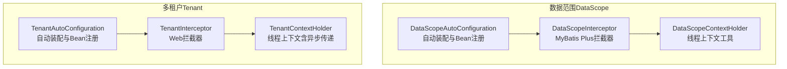
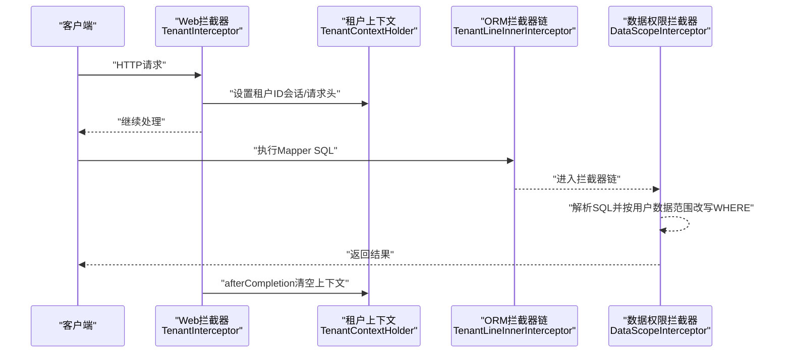
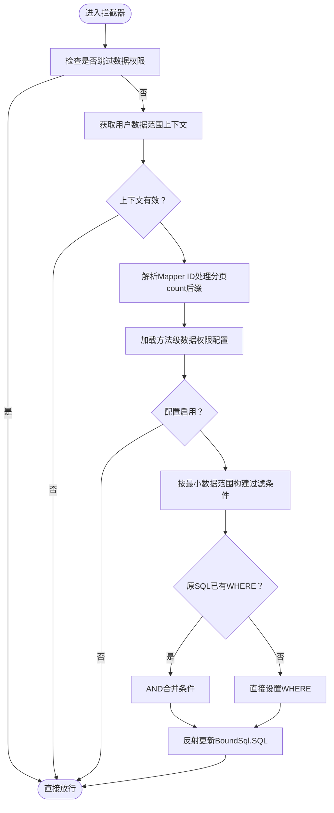
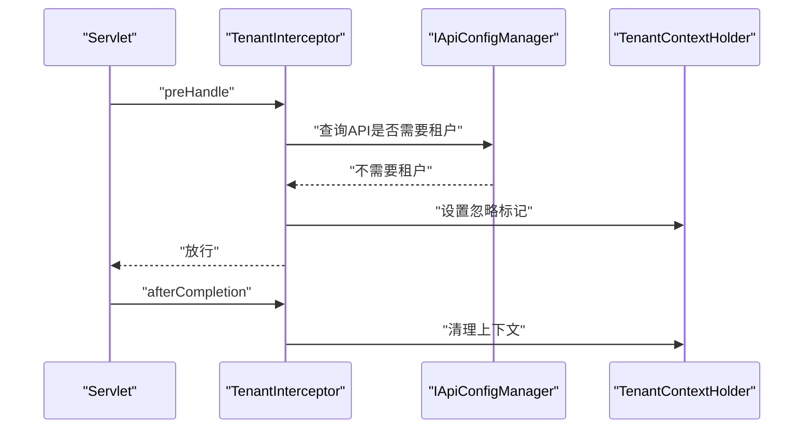
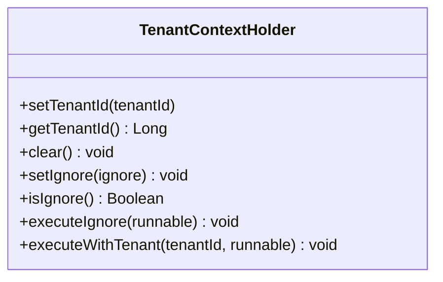
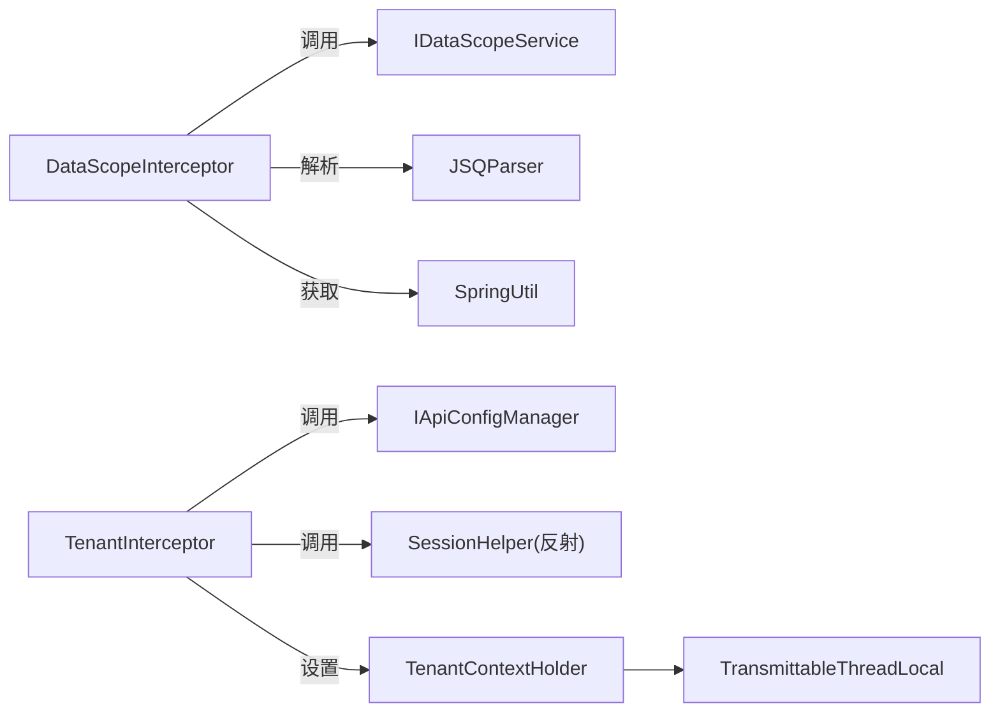

# 数据管理模块

<cite>
**本文引用的文件**
- [DataScopeAutoConfiguration.java](file://forge/forge-framework/forge-starter-parent/forge-starter-datascope/src/main/java/com/mdframe/forge/starter/datascope/config/DataScopeAutoConfiguration.java)
- [DataScopeInterceptor.java](file://forge/forge-framework/forge-starter-parent/forge-starter-datascope/src/main/java/com/mdframe/forge/starter/datascope/handler/DataScopeInterceptor.java)
- [DataScopeContextHolder.java](file://forge/forge-framework/forge-starter-parent/forge-starter-datascope/src/main/java/com/mdframe/forge/starter/datascope/context/DataScopeContextHolder.java)
- [TenantAutoConfiguration.java](file://forge/forge-framework/forge-starter-parent/forge-starter-tenant/src/main/java/com/mdframe/forge/starter/tenant/config/TenantAutoConfiguration.java)
- [TenantInterceptor.java](file://forge/forge-framework/forge-starter-parent/forge-starter-tenant/src/main/java/com/mdframe/forge/starter/tenant/interceptor/TenantInterceptor.java)
- [TenantContextHolder.java](file://forge/forge-framework/forge-starter-parent/forge-starter-tenant/src/main/java/com/mdframe/forge/starter/tenant/context/TenantContextHolder.java)
- [DATA_SCOPE_CONFIG_GUIDE.md](file://forge/forge-framework/forge-starter-parent/forge-starter-datascope/DATA_SCOPE_CONFIG_GUIDE.md)
- [TENANT_USAGE.md](file://forge/forge-framework/forge-starter-parent/forge-starter-tenant/TENANT_USAGE.md)
</cite>

## 目录
1. [引言](#引言)
2. [项目结构](#项目结构)
3. [核心组件](#核心组件)
4. [架构总览](#架构总览)
5. [详细组件分析](#详细组件分析)
6. [依赖关系分析](#依赖关系分析)
7. [性能考量](#性能考量)
8. [故障排查指南](#故障排查指南)
9. [结论](#结论)
10. [附录](#附录)

## 引言
本文件聚焦Forge数据管理模块中的“数据权限控制”与“多租户管理”，系统性解析以下主题：
- 数据范围配置、角色数据权限、组织数据范围等数据权限控制机制
- 多租户隔离策略、租户上下文管理、租户数据隔离等多租户核心功能
- 数据拦截器、租户线程传递、异步支持等技术实现细节
- 提供数据权限配置示例、多租户部署方案与性能优化建议

目标是帮助读者快速理解并正确使用数据权限与多租户能力，同时掌握最佳实践与常见问题定位方法。

## 项目结构
数据管理模块主要由两个子模块组成：
- 数据范围（DataScope）：负责基于用户数据范围的SQL拦截与改写，实现“本人/本组织/本组织及子组织/自定义/租户全部”等多维度数据权限控制。
- 多租户（Tenant）：负责在Web层与ORM层分别设置与传递租户上下文，实现租户级别的数据隔离与SQL自动拼接。

图表来源
- [DataScopeAutoConfiguration.java](file://forge/forge-framework/forge-starter-parent/forge-starter-datascope/src/main/java/com/mdframe/forge/starter/datascope/config/DataScopeAutoConfiguration.java#L1-L39)
- [DataScopeInterceptor.java](file://forge/forge-framework/forge-starter-parent/forge-starter-datascope/src/main/java/com/mdframe/forge/starter/datascope/handler/DataScopeInterceptor.java#L1-L350)
- [DataScopeContextHolder.java](file://forge/forge-framework/forge-starter-parent/forge-starter-datascope/src/main/java/com/mdframe/forge/starter/datascope/context/DataScopeContextHolder.java#L1-L62)
- [TenantAutoConfiguration.java](file://forge/forge-framework/forge-starter-parent/forge-starter-tenant/src/main/java/com/mdframe/forge/starter/tenant/config/TenantAutoConfiguration.java#L1-L88)
- [TenantInterceptor.java](file://forge/forge-framework/forge-starter-parent/forge-starter-tenant/src/main/java/com/mdframe/forge/starter/tenant/interceptor/TenantInterceptor.java#L1-L98)
- [TenantContextHolder.java](file://forge/forge-framework/forge-starter-parent/forge-starter-tenant/src/main/java/com/mdframe/forge/starter/tenant/context/TenantContextHolder.java#L1-L147)

章节来源
- [DataScopeAutoConfiguration.java](file://forge/forge-framework/forge-starter-parent/forge-starter-datascope/src/main/java/com/mdframe/forge/starter/datascope/config/DataScopeAutoConfiguration.java#L1-L39)
- [TenantAutoConfiguration.java](file://forge/forge-framework/forge-starter-parent/forge-starter-tenant/src/main/java/com/mdframe/forge/starter/tenant/config/TenantAutoConfiguration.java#L1-L88)

## 核心组件
- 数据范围拦截器（DataScopeInterceptor）
  - 基于MyBatis Plus的InnerInterceptor，在SQL执行前解析并改写WHERE条件，按用户最小数据范围动态追加过滤条件。
  - 支持“本人/本组织/本组织及子组织/自定义/租户全部”等范围类型，并可处理复杂SQL表达式与占位符。
- 数据范围上下文（DataScopeContextHolder）
  - 提供线程本地存储与“跳过数据权限”的开关，支持在特定场景（如后台任务）临时关闭权限控制。
- 多租户拦截器（TenantInterceptor）
  - 在Web层从会话或请求头提取租户ID，设置到租户上下文；支持API配置与注解控制是否忽略租户。
- 多租户上下文（TenantContextHolder）
  - 使用TransmittableThreadLocal实现跨线程传递，保障在异步/线程池场景下租户上下文可用。
- 自动配置（DataScopeAutoConfiguration / TenantAutoConfiguration）
  - 条件化装配，仅在配置开启时生效；统一注册拦截器与处理器，避免重复配置。

章节来源
- [DataScopeInterceptor.java](file://forge/forge-framework/forge-starter-parent/forge-starter-datascope/src/main/java/com/mdframe/forge/starter/datascope/handler/DataScopeInterceptor.java#L1-L350)
- [DataScopeContextHolder.java](file://forge/forge-framework/forge-starter-parent/forge-starter-datascope/src/main/java/com/mdframe/forge/starter/datascope/context/DataScopeContextHolder.java#L1-L62)
- [TenantInterceptor.java](file://forge/forge-framework/forge-starter-parent/forge-starter-tenant/src/main/java/com/mdframe/forge/starter/tenant/interceptor/TenantInterceptor.java#L1-L98)
- [TenantContextHolder.java](file://forge/forge-framework/forge-starter-parent/forge-starter-tenant/src/main/java/com/mdframe/forge/starter/tenant/context/TenantContextHolder.java#L1-L147)
- [DataScopeAutoConfiguration.java](file://forge/forge-framework/forge-starter-parent/forge-starter-datascope/src/main/java/com/mdframe/forge/starter/datascope/config/DataScopeAutoConfiguration.java#L1-L39)
- [TenantAutoConfiguration.java](file://forge/forge-framework/forge-starter-parent/forge-starter-tenant/src/main/java/com/mdframe/forge/starter/tenant/config/TenantAutoConfiguration.java#L1-L88)

## 架构总览
数据权限与多租户在不同层面协同工作：
- Web层：TenantInterceptor从会话/请求头提取租户ID，写入TenantContextHolder。
- ORM层：TenantAutoConfiguration注册TenantLineInnerInterceptor，将租户ID自动拼接到SQL中；DataScopeAutoConfiguration注册DataScopeInterceptor，按用户数据范围改写WHERE条件。
- 上下文传递：TenantContextHolder使用TransmittableThreadLocal，确保异步场景下租户上下文有效。

图表来源
- [TenantInterceptor.java](file://forge/forge-framework/forge-starter-parent/forge-starter-tenant/src/main/java/com/mdframe/forge/starter/tenant/interceptor/TenantInterceptor.java#L1-L98)
- [TenantContextHolder.java](file://forge/forge-framework/forge-starter-parent/forge-starter-tenant/src/main/java/com/mdframe/forge/starter/tenant/context/TenantContextHolder.java#L1-L147)
- [TenantAutoConfiguration.java](file://forge/forge-framework/forge-starter-parent/forge-starter-tenant/src/main/java/com/mdframe/forge/starter/tenant/config/TenantAutoConfiguration.java#L1-L88)
- [DataScopeInterceptor.java](file://forge/forge-framework/forge-starter-parent/forge-starter-datascope/src/main/java/com/mdframe/forge/starter/datascope/handler/DataScopeInterceptor.java#L1-L350)

## 详细组件分析

### 数据范围拦截器（DataScopeInterceptor）
- 触发时机：MyBatis Plus执行前（beforeQuery），对SELECT语句进行改写。
- 关键流程：
  1) 检查是否跳过数据权限（后台任务等场景）。
  2) 获取当前用户数据范围上下文（包含最小数据范围、用户ID、组织ID集合、自定义组织ID集合、租户ID等）。
  3) 解析Mapper ID，处理分页count查询的特殊命名规则。
  4) 查询方法级数据权限配置，若未配置或禁用则放行。
  5) 根据最小数据范围类型构建过滤条件（SELF/ORG/ORG_AND_CHILD/CUSTOM/TENANT_ALL）。
  6) 若为复杂SQL表达式（以<sql>开头），替换占位符后解析为表达式；否则按字段构建等值或IN条件。
  7) 将新WHERE条件与原条件合并（AND连接），并反射更新BoundSql中的SQL。
- 支持的范围类型与对应字段：
  - SELF：用户ID字段
  - ORG：组织ID字段（本组织）
  - ORG_AND_CHILD：组织ID字段（本组织及子组织）
  - CUSTOM：自定义组织ID集合
  - TENANT_ALL：租户ID字段
- 特殊场景：
  - 分页count查询：自动去除后缀并匹配原方法配置。
  - 跳过标记：通过DataScopeContextHolder在特定任务中临时关闭权限控制。

图表来源
- [DataScopeInterceptor.java](file://forge/forge-framework/forge-starter-parent/forge-starter-datascope/src/main/java/com/mdframe/forge/starter/datascope/handler/DataScopeInterceptor.java#L1-L350)

章节来源
- [DataScopeInterceptor.java](file://forge/forge-framework/forge-starter-parent/forge-starter-datascope/src/main/java/com/mdframe/forge/starter/datascope/handler/DataScopeInterceptor.java#L1-L350)
- [DataScopeContextHolder.java](file://forge/forge-framework/forge-starter-parent/forge-starter-datascope/src/main/java/com/mdframe/forge/starter/datascope/context/DataScopeContextHolder.java#L1-L62)

### 多租户拦截器（TenantInterceptor）
- 触发时机：Spring MVC拦截器链的preHandle阶段。
- 关键流程：
  1) 优先检查API配置是否要求不需租户（如某些公开接口）。
  2) 检查方法/类上是否标注@IgnoreTenant注解，若为true则设置忽略标记。
  3) 通过反射调用认证模块的SessionHelper获取租户ID；若未引入认证模块，则从请求头X-Tenant-Id读取。
  4) 将租户ID写入TenantContextHolder；请求完成后在afterCompletion清理上下文，防止内存泄漏。
- 适用场景：
  - 需要对部分接口跳过租户控制（如登录、公开查询）。
  - 无认证模块时，通过请求头传递租户ID。

图表来源
- [TenantInterceptor.java](file://forge/forge-framework/forge-starter-parent/forge-starter-tenant/src/main/java/com/mdframe/forge/starter/tenant/interceptor/TenantInterceptor.java#L1-L98)

章节来源
- [TenantInterceptor.java](file://forge/forge-framework/forge-starter-parent/forge-starter-tenant/src/main/java/com/mdframe/forge/starter/tenant/interceptor/TenantInterceptor.java#L1-L98)

### 多租户上下文与线程传递（TenantContextHolder）
- 设计要点：
  - 使用TransmittableThreadLocal替代ThreadLocal，支持在线程池/异步场景下自动传递租户上下文。
  - 提供setTenantId/getTenantId/clear等基础方法，以及executeIgnore/executeWithTenant等便捷执行上下文切换的方法。
- 与拦截器配合：
  - TenantInterceptor在请求开始时设置租户ID；在请求结束时清理。
  - TenantLineInnerInterceptor在生成SQL时读取TenantContextHolder中的租户ID，自动拼接租户过滤条件。

图表来源
- [TenantContextHolder.java](file://forge/forge-framework/forge-starter-parent/forge-starter-tenant/src/main/java/com/mdframe/forge/starter/tenant/context/TenantContextHolder.java#L1-L147)

章节来源
- [TenantContextHolder.java](file://forge/forge-framework/forge-starter-parent/forge-starter-tenant/src/main/java/com/mdframe/forge/starter/tenant/context/TenantContextHolder.java#L1-L147)

### 自动配置与Bean注册
- DataScopeAutoConfiguration
  - 条件化启用（默认开启），扫描mapper包，注册DataScopeInterceptor Bean（由ORM配置统一注入）。
- TenantAutoConfiguration
  - 条件化启用（默认开启），注册DefaultTenantLineHandler、TenantLineInnerInterceptor、TenantInterceptor与IgnoreTenantAspect。
  - 通过WebMvcConfigurer注册Web层租户拦截器，设置优先级。

章节来源
- [DataScopeAutoConfiguration.java](file://forge/forge-framework/forge-starter-parent/forge-starter-datascope/src/main/java/com/mdframe/forge/starter/datascope/config/DataScopeAutoConfiguration.java#L1-L39)
- [TenantAutoConfiguration.java](file://forge/forge-framework/forge-starter-parent/forge-starter-tenant/src/main/java/com/mdframe/forge/starter/tenant/config/TenantAutoConfiguration.java#L1-L88)

## 依赖关系分析
- 组件耦合
  - DataScopeInterceptor依赖IDataScopeService获取用户数据范围与配置，依赖JSQParser解析SQL，依赖SpringUtil获取Bean。
  - TenantInterceptor依赖IApiConfigManager与认证模块的SessionHelper，依赖TenantContextHolder设置租户上下文。
  - TenantContextHolder依赖TransmittableThreadLocal实现跨线程传递。
- 外部依赖
  - MyBatis Plus内核（InnerInterceptor、BoundSql反射工具）
  - JSQParser（SQL解析与表达式构建）
  - Hutool（SpringUtil、字符串工具）

图表来源
- [DataScopeInterceptor.java](file://forge/forge-framework/forge-starter-parent/forge-starter-datascope/src/main/java/com/mdframe/forge/starter/datascope/handler/DataScopeInterceptor.java#L1-L350)
- [TenantInterceptor.java](file://forge/forge-framework/forge-starter-parent/forge-starter-tenant/src/main/java/com/mdframe/forge/starter/tenant/interceptor/TenantInterceptor.java#L1-L98)
- [TenantContextHolder.java](file://forge/forge-framework/forge-starter-parent/forge-starter-tenant/src/main/java/com/mdframe/forge/starter/tenant/context/TenantContextHolder.java#L1-L147)

## 性能考量
- SQL改写成本
  - 仅对SELECT语句进行解析与改写，且在方法级配置启用时才生效，避免对写操作与未配置接口造成额外开销。
- 解析与反射
  - 使用JSQParser解析SQL，建议在配置中尽量采用简单字段而非复杂表达式，减少解析与占位符替换成本。
- 线程传递
  - 使用TransmittableThreadLocal避免上下文丢失导致的重复查询或错误过滤，提升异步场景稳定性。
- 缓存与配置
  - 建议缓存用户最小数据范围与组织树计算结果，降低每次请求的计算成本（可在业务侧结合缓存策略实现）。

## 故障排查指南
- 症状：数据权限拦截器未生效
  - 检查配置开关是否开启（forge.datascope.enabled）。
  - 确认方法是否配置了数据权限配置且启用。
  - 检查是否设置了跳过标记（DataScopeContextHolder.isSkip）。
- 症状：多租户拦截器未设置租户ID
  - 检查API配置是否标记为无需租户。
  - 检查是否标注@IgnoreTenant注解。
  - 若未引入认证模块，确认请求头X-Tenant-Id是否正确传递。
- 症状：异步任务中租户上下文丢失
  - 确认使用TenantContextHolder提供的executeIgnore/executeWithTenant等方法包裹逻辑。
  - 确保线程池使用TransmittableThreadLocal封装的线程池实现。
- 症状：复杂SQL表达式解析失败
  - 检查<sql>标签内的表达式语法与占位符是否正确（#{userId}、#{tenantId}、#{orgIds}、#{customOrgIds}）。

章节来源
- [DataScopeAutoConfiguration.java](file://forge/forge-framework/forge-starter-parent/forge-starter-datascope/src/main/java/com/mdframe/forge/starter/datascope/config/DataScopeAutoConfiguration.java#L1-L39)
- [TenantAutoConfiguration.java](file://forge/forge-framework/forge-starter-parent/forge-starter-tenant/src/main/java/com/mdframe/forge/starter/tenant/config/TenantAutoConfiguration.java#L1-L88)
- [DataScopeInterceptor.java](file://forge/forge-framework/forge-starter-parent/forge-starter-datascope/src/main/java/com/mdframe/forge/starter/datascope/handler/DataScopeInterceptor.java#L1-L350)
- [TenantInterceptor.java](file://forge/forge-framework/forge-starter-parent/forge-starter-tenant/src/main/java/com/mdframe/forge/starter/tenant/interceptor/TenantInterceptor.java#L1-L98)
- [TenantContextHolder.java](file://forge/forge-framework/forge-starter-parent/forge-starter-tenant/src/main/java/com/mdframe/forge/starter/tenant/context/TenantContextHolder.java#L1-L147)

## 结论
Forge数据管理模块通过“Web层租户拦截器 + ORM层租户SQL拼接 + 数据范围拦截器 + 上下文线程传递”的组合，实现了灵活而强大的数据权限与多租户隔离能力。其设计强调：
- 可配置性：通过API配置与注解控制是否忽略租户与数据权限。
- 可扩展性：支持复杂SQL表达式与多种数据范围类型。
- 可靠性：在异步场景下保证上下文传递，避免数据泄露与错误过滤。
建议在生产环境中结合缓存与最小权限原则，持续优化配置与性能。

## 附录
- 数据权限配置示例与指引
  - 参考：[DATA_SCOPE_CONFIG_GUIDE.md](file://forge/forge-framework/forge-starter-parent/forge-starter-datascope/DATA_SCOPE_CONFIG_GUIDE.md)
- 多租户部署与使用说明
  - 参考：[TENANT_USAGE.md](file://forge/forge-framework/forge-starter-parent/forge-starter-tenant/TENANT_USAGE.md)