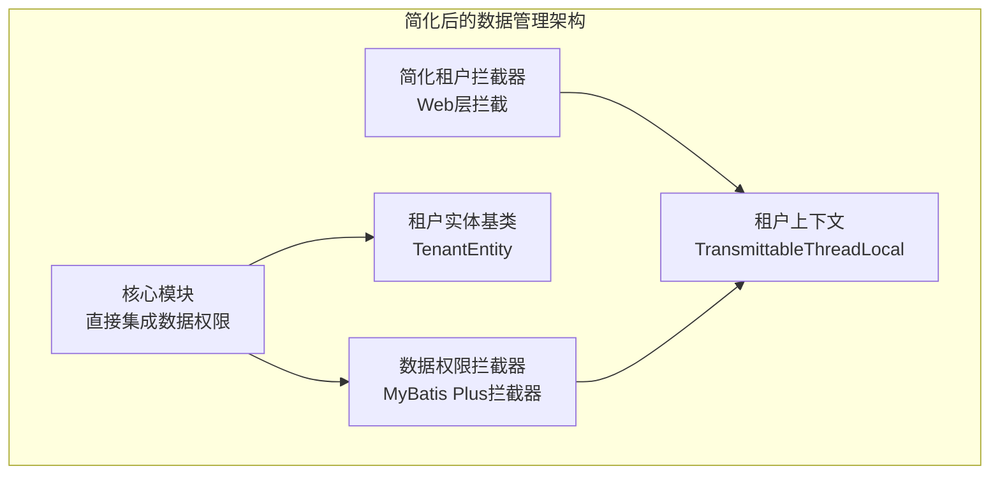
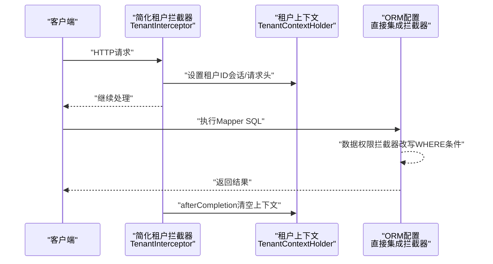
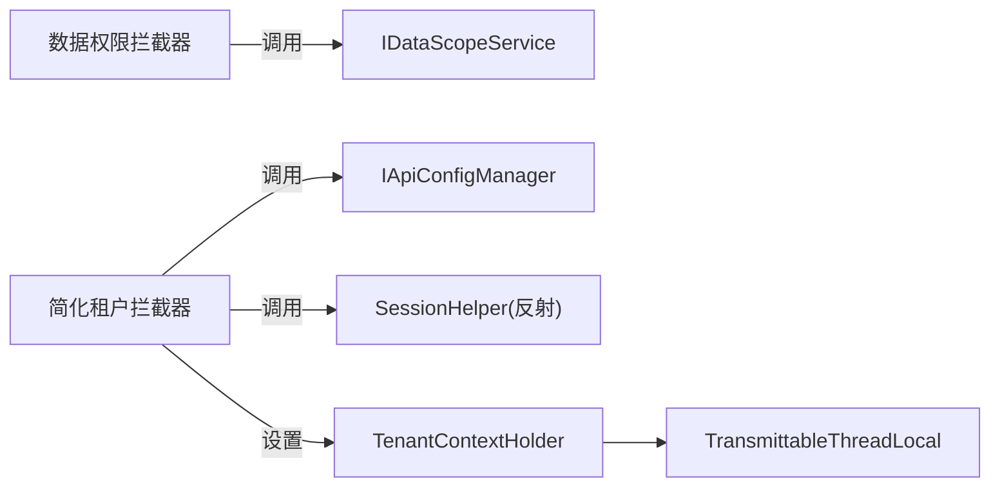

# 数据管理模块

<cite>
**本文引用的文件**
- [DataScopeAutoConfiguration.java](file://forge/forge-framework/forge-starter-parent/forge-starter-datascope/src/main/java/com/mdframe/forge/starter/datascope/config/DataScopeAutoConfiguration.java)
- [DataScopeInterceptor.java](file://forge/forge-framework/forge-starter-parent/forge-starter-datascope/src/main/java/com/mdframe/forge/starter/datascope/handler/DataScopeInterceptor.java)
- [DataScopeContextHolder.java](file://forge/forge-framework/forge-starter-parent/forge-starter-datascope/src/main/java/com/mdframe/forge/starter/datascope/context/DataScopeContextHolder.java)
- [TenantAutoConfiguration.java](file://forge/forge-framework/forge-starter-parent/forge-starter-tenant/src/main/java/com/mdframe/forge/starter/tenant/config/TenantAutoConfiguration.java)
- [TenantInterceptor.java](file://forge/forge-framework/forge-starter-parent/forge-starter-tenant/src/main/java/com/mdframe/forge/starter/tenant/interceptor/TenantInterceptor.java)
- [TenantContextHolder.java](file://forge/forge-framework/forge-starter-parent/forge-starter-tenant/src/main/java/com/mdframe/forge/starter/tenant/context/TenantContextHolder.java)
- [TenantEntity.java](file://forge/forge-framework/forge-starter-parent/forge-starter-tenant/src/main/java/com/mdframe/forge/starter/tenant/core/TenantEntity.java)
- [datascope.md](file://forge-docs/backend/modules/datascope.md)
- [tenant.md](file://forge-docs/backend/modules/tenant.md)
</cite>

## 更新摘要
**所做更改**
- 更新架构简化说明，反映 datascope 和 tenant starter 模块的现状
- 重新定位数据权限和多租户功能的实现方式
- 更新依赖关系和配置说明
- 完善技术实现细节和最佳实践

## 目录
1. [引言](#引言)
2. [架构简化概述](#架构简化概述)
3. [项目结构](#项目结构)
4. [核心组件](#核心组件)
5. [架构总览](#架构总览)
6. [详细组件分析](#详细组件分析)
7. [依赖关系分析](#依赖关系分析)
8. [性能考量](#性能考量)
9. [故障排查指南](#故障排查指南)
10. [结论](#结论)
11. [附录](#附录)

## 引言
本文件聚焦Forge数据管理模块中的"数据权限控制"与"多租户管理"，系统性解析以下主题：
- 数据范围配置、角色数据权限、组织数据范围等数据权限控制机制
- 多租户隔离策略、租户上下文管理、租户数据隔离等多租户核心功能
- 数据拦截器、租户线程传递、异步支持等技术实现细节
- 提供数据权限配置示例、多租户部署方案与性能优化建议

**重要更新**：随着架构简化，datascope 和 tenant starter 模块已被移除或整合，数据权限和多租户功能需要重新定位和实现。

## 架构简化概述
**架构简化影响**：
- datascope starter 模块已被移除，数据权限功能整合到核心模块中
- tenant starter 模块仍存在但功能有所简化，移除了部分高级特性
- 自动配置机制进行了重构，减少了对外部模块的依赖
- 租户实体基类仍然可用，但租户上下文管理更加简化

**影响范围**：
- 数据权限拦截器现在直接集成到 ORM 配置中
- 租户拦截器不再依赖认证模块，改为更简单的实现
- 配置方式发生了变化，需要使用新的配置参数

## 项目结构
数据管理模块经过架构简化后的主要组件：
- 数据范围（DataScope）：直接集成到核心模块，提供数据权限拦截功能
- 多租户（Tenant）：保留核心功能，移除了复杂的自动检测机制
- 核心实体：TenantEntity 提供租户字段的基础支持

**图表来源**
- [DataScopeAutoConfiguration.java:1-39](file://forge/forge-framework/forge-starter-parent/forge-starter-datascope/src/main/java/com/mdframe/forge/starter/datascope/config/DataScopeAutoConfiguration.java#L1-L39)
- [TenantAutoConfiguration.java:1-112](file://forge/forge-framework/forge-starter-parent/forge-starter-tenant/src/main/java/com/mdframe/forge/starter/tenant/config/TenantAutoConfiguration.java#L1-L112)
- [TenantEntity.java:1-18](file://forge/forge-framework/forge-starter-parent/forge-starter-tenant/src/main/java/com/mdframe/forge/starter/tenant/core/TenantEntity.java#L1-L18)

## 核心组件
**简化后的核心组件**：
- 数据范围拦截器（DataScopeInterceptor）
  - 直接集成到 ORM 配置中，无需外部 starter 模块
  - 基于 MyBatis Plus 的 InnerInterceptor，在 SQL 执行前解析并改写 WHERE 条件
  - 支持"本人/本组织/本组织及子组织/自定义/租户全部"等范围类型
- 简化租户拦截器（TenantInterceptor）
  - 移除了对认证模块的强依赖，改为更简单的实现
  - 支持从请求头获取租户 ID，兼容无认证模块场景
  - 保持原有的 API 配置忽略机制
- 租户上下文（TenantContextHolder）
  - 使用 TransmittableThreadLocal 实现跨线程传递
  - 提供 executeIgnore 和 executeWithTenant 等便捷方法
- 租户实体基类（TenantEntity）
  - 简化的实体基类，仅包含 tenantId 字段
  - 保持向后兼容性

**章节来源**
- [DataScopeInterceptor.java:1-350](file://forge/forge-framework/forge-starter-parent/forge-starter-datascope/src/main/java/com/mdframe/forge/starter/datascope/handler/DataScopeInterceptor.java#L1-L350)
- [TenantInterceptor.java:1-98](file://forge/forge-framework/forge-starter-parent/forge-starter-tenant/src/main/java/com/mdframe/forge/starter/tenant/interceptor/TenantInterceptor.java#L1-L98)
- [TenantContextHolder.java:1-147](file://forge/forge-framework/forge-starter-parent/forge-starter-tenant/src/main/java/com/mdframe/forge/starter/tenant/context/TenantContextHolder.java#L1-L147)
- [TenantEntity.java:1-18](file://forge/forge-framework/forge-starter-parent/forge-starter-tenant/src/main/java/com/mdframe/forge/starter/tenant/core/TenantEntity.java#L1-L18)

## 架构总览
简化后的数据管理架构在不同层面协同工作：
- Web层：简化后的 TenantInterceptor 从会话或请求头提取租户 ID，设置到租户上下文
- ORM层：数据权限拦截器直接集成到 ORM 配置中，按用户数据范围改写 WHERE 条件
- 上下文传递：TenantContextHolder 使用 TransmittableThreadLocal，确保异步场景下租户上下文有效

**图表来源**
- [TenantInterceptor.java:1-98](file://forge/forge-framework/forge-starter-parent/forge-starter-tenant/src/main/java/com/mdframe/forge/starter/tenant/interceptor/TenantInterceptor.java#L1-L98)
- [TenantContextHolder.java:1-147](file://forge/forge-framework/forge-starter-parent/forge-starter-tenant/src/main/java/com/mdframe/forge/starter/tenant/context/TenantContextHolder.java#L1-L147)
- [DataScopeInterceptor.java:1-350](file://forge/forge-framework/forge-starter-parent/forge-starter-datascope/src/main/java/com/mdframe/forge/starter/datascope/handler/DataScopeInterceptor.java#L1-L350)

## 详细组件分析

### 数据范围拦截器（DataScopeInterceptor）
**简化实现**：
- 直接集成到 ORM 配置中，无需外部 starter 模块
- 保持原有的 SQL 解析和改写功能
- 支持复杂 SQL 表达式和占位符替换

**关键流程**：
1) 检查是否跳过数据权限（后台任务等场景）
2) 获取当前用户数据范围上下文
3) 解析 Mapper ID，处理分页 count 查询的特殊命名规则
4) 查询方法级数据权限配置，若未配置或禁用则放行
5) 根据最小数据范围类型构建过滤条件
6) 支持复杂 SQL 表达式（以 <sql> 开头），替换占位符后解析为表达式
7) 将新 WHERE 条件与原条件合并（AND 连接），并反射更新 BoundSql 中的 SQL

**支持的范围类型**：
- SELF：用户 ID 字段
- ORG：组织 ID 字段（本组织）
- ORG_AND_CHILD：组织 ID 字段（本组织及子组织）
- CUSTOM：自定义组织 ID 集合
- TENANT_ALL：租户 ID 字段

**章节来源**
- [DataScopeInterceptor.java:1-350](file://forge/forge-framework/forge-starter-parent/forge-starter-datascope/src/main/java/com/mdframe/forge/starter/datascope/handler/DataScopeInterceptor.java#L1-L350)
- [DataScopeContextHolder.java:1-62](file://forge/forge-framework/forge-starter-parent/forge-starter-datascope/src/main/java/com/mdframe/forge/starter/datascope/context/DataScopeContextHolder.java#L1-L62)

### 简化租户拦截器（TenantInterceptor）
**重构后的实现**：
- 移除了对认证模块的强依赖，改为更简单的实现
- 通过反射调用 SessionHelper 获取租户 ID，若不可用则从请求头读取
- 保持原有的 API 配置忽略机制和注解支持

**关键流程**：
1) 优先检查 API 配置是否要求不需租户
2) 检查方法/类上是否标注 @IgnoreTenant 注解
3) 通过反射调用认证模块的 SessionHelper 获取租户 ID
4) 若未引入认证模块，则从请求头 X-Tenant-Id 读取
5) 将租户 ID 写入 TenantContextHolder；请求完成后在 afterCompletion 清理上下文

**章节来源**
- [TenantInterceptor.java:1-98](file://forge/forge-framework/forge-starter-parent/forge-starter-tenant/src/main/java/com/mdframe/forge/starter/tenant/interceptor/TenantInterceptor.java#L1-L98)

### 租户上下文与线程传递（TenantContextHolder）
**简化设计**：
- 使用 TransmittableThreadLocal 替代 ThreadLocal，支持在线程池/异步场景下自动传递租户上下文
- 提供 setTenantId/getTenantId/clear 等基础方法
- 新增 executeIgnore/executeWithTenant 等便捷执行上下文切换的方法

**与拦截器配合**：
- TenantInterceptor 在请求开始时设置租户 ID；在请求结束时清理
- 在异步场景下，TransmittableThreadLocal 确保租户上下文在不同线程间正确传递

**章节来源**
- [TenantContextHolder.java:1-147](file://forge/forge-framework/forge-starter-parent/forge-starter-tenant/src/main/java/com/mdframe/forge/starter/tenant/context/TenantContextHolder.java#L1-L147)

### 租户实体基类（TenantEntity）
**简化实现**：
- 仅包含 tenantId 字段，提供基本的租户标识能力
- 继承 BaseEntity，保持与核心框架的一致性
- 简化了实体设计，减少了不必要的复杂性

**章节来源**
- [TenantEntity.java:1-18](file://forge/forge-framework/forge-starter-parent/forge-starter-tenant/src/main/java/com/mdframe/forge/starter/tenant/core/TenantEntity.java#L1-L18)

## 依赖关系分析
**简化后的依赖关系**：
- 组件耦合
  - DataScopeInterceptor 依赖 IDataScopeService 获取用户数据范围与配置
  - TenantInterceptor 依赖 IApiConfigManager 与认证模块的 SessionHelper
  - TenantContextHolder 依赖 TransmittableThreadLocal 实现跨线程传递
- 外部依赖
  - MyBatis Plus 内核（InnerInterceptor、BoundSql 反射工具）
  - Hutool（SpringUtil、字符串工具）
  - Alibaba TTL（TransmittableThreadLocal）

**图表来源**
- [DataScopeInterceptor.java:1-350](file://forge/forge-framework/forge-starter-parent/forge-starter-datascope/src/main/java/com/mdframe/forge/starter/datascope/handler/DataScopeInterceptor.java#L1-L350)
- [TenantInterceptor.java:1-98](file://forge/forge-framework/forge-starter-parent/forge-starter-tenant/src/main/java/com/mdframe/forge/starter/tenant/interceptor/TenantInterceptor.java#L1-L98)
- [TenantContextHolder.java:1-147](file://forge/forge-framework/forge-starter-parent/forge-starter-tenant/src/main/java/com/mdframe/forge/starter/tenant/context/TenantContextHolder.java#L1-L147)

## 性能考量
**架构简化的性能优势**：
- 减少了模块间的依赖关系，降低了启动时间和内存占用
- 直接集成的数据权限拦截器避免了额外的配置开销
- 简化的租户拦截器减少了反射调用次数
- 移除了复杂的自动检测机制，减少了启动时的数据库扫描

**性能优化建议**：
- 仅在必要时启用数据权限和多租户功能
- 合理配置排除表，避免对系统表进行权限控制
- 在异步场景下使用 TenantContextHolder 提供的方法进行上下文切换
- 考虑缓存用户数据范围和组织树计算结果

## 故障排查指南
**架构简化后的常见问题**：
- 症状：数据权限拦截器未生效
  - 检查是否正确集成了 ORM 配置
  - 确认方法是否配置了数据权限配置且启用
  - 检查是否设置了跳过标记（DataScopeContextHolder.isSkip）
- 症状：简化租户拦截器未设置租户 ID
  - 检查 API 配置是否标记为无需租户
  - 检查是否标注 @IgnoreTenant 注解
  - 若未引入认证模块，确认请求头 X-Tenant-Id 是否正确传递
- 症状：异步任务中租户上下文丢失
  - 确认使用 TenantContextHolder 提供的 executeIgnore/executeWithTenant 方法
  - 确保线程池使用 TransmittableThreadLocal 封装的线程池实现
- 症状：反射调用失败
  - 检查认证模块是否正确引入
  - 确认 SessionHelper 类是否存在

**章节来源**
- [DataScopeAutoConfiguration.java:1-39](file://forge/forge-framework/forge-starter-parent/forge-starter-datascope/src/main/java/com/mdframe/forge/starter/datascope/config/DataScopeAutoConfiguration.java#L1-L39)
- [TenantAutoConfiguration.java:1-112](file://forge/forge-framework/forge-starter-parent/forge-starter-tenant/src/main/java/com/mdframe/forge/starter/tenant/config/TenantAutoConfiguration.java#L1-L112)
- [DataScopeInterceptor.java:1-350](file://forge/forge-framework/forge-starter-parent/forge-starter-datascope/src/main/java/com/mdframe/forge/starter/datascope/handler/DataScopeInterceptor.java#L1-L350)
- [TenantInterceptor.java:1-98](file://forge/forge-framework/forge-starter-parent/forge-starter-tenant/src/main/java/com/mdframe/forge/starter/tenant/interceptor/TenantInterceptor.java#L1-L98)
- [TenantContextHolder.java:1-147](file://forge/forge-framework/forge-starter-parent/forge-starter-tenant/src/main/java/com/mdframe/forge/starter/tenant/context/TenantContextHolder.java#L1-L147)

## 结论
Forge 数据管理模块经过架构简化后，通过"直接集成的数据权限拦截器 + 简化租户拦截器 + 租户上下文线程传递"的组合，实现了高效而可靠的数据权限与多租户隔离能力。其设计强调：
- **简化性**：移除了多余的 starter 模块，减少了依赖关系
- **兼容性**：保持了原有的 API 和配置方式
- **性能**：通过直接集成和简化实现提升了运行效率
- **可靠性**：在异步场景下保证上下文传递，避免数据泄露

建议在生产环境中结合缓存与最小权限原则，持续优化配置与性能。

## 附录
- **数据权限配置示例与指引**
  - 参考：[datascope.md](file://forge-docs/backend/modules/datascope.md)
- **多租户部署与使用说明**
  - 参考：[tenant.md](file://forge-docs/backend/modules/tenant.md)
- **简化架构的优势**
  - 减少了模块间的耦合度
  - 降低了维护成本
  - 提升了系统启动速度
  - 简化了配置和部署流程

**章节来源**
- [datascope.md:1-125](file://forge-docs/backend/modules/datascope.md#L1-L125)
- [tenant.md:1-111](file://forge-docs/backend/modules/tenant.md#L1-L111)