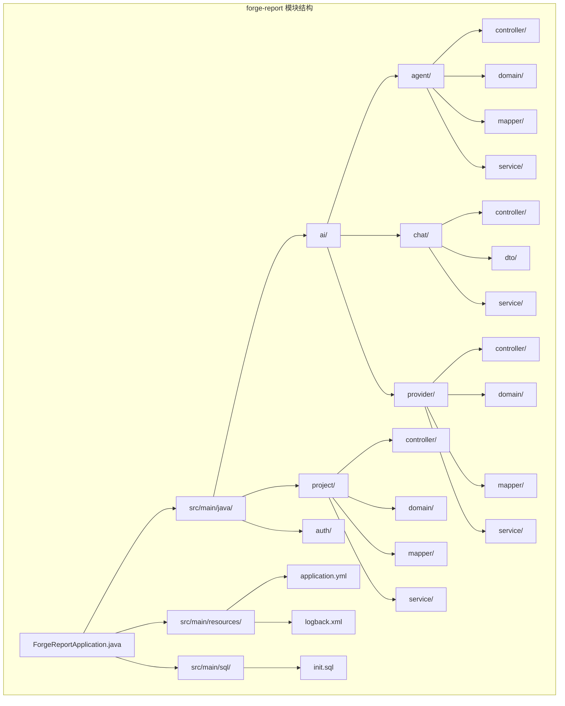
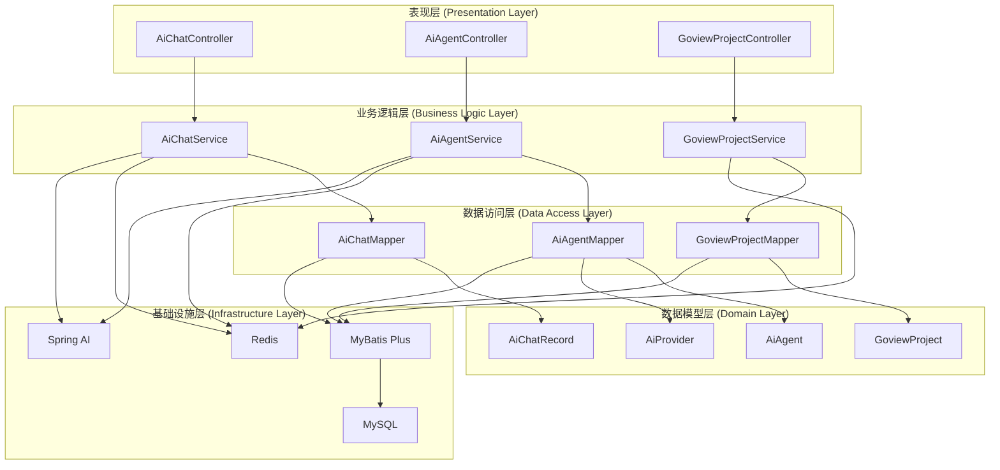
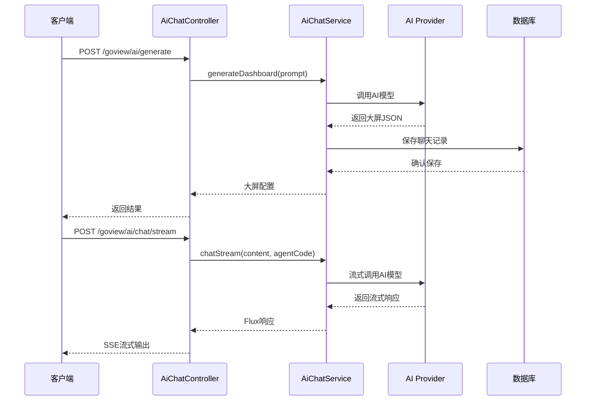
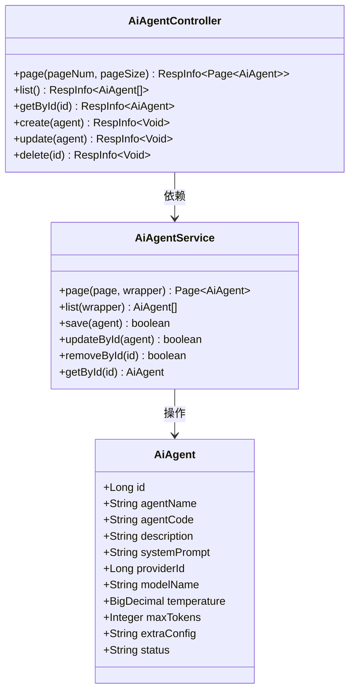
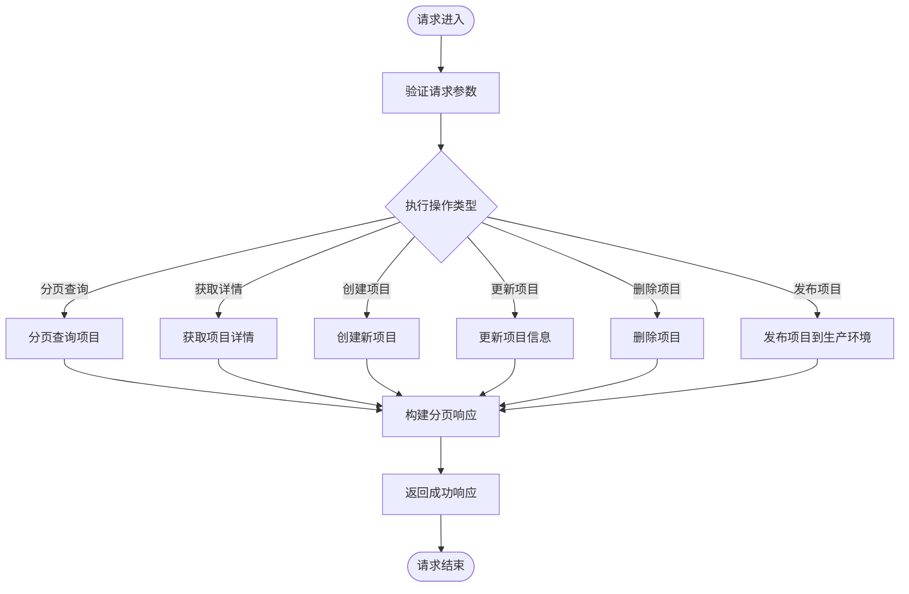
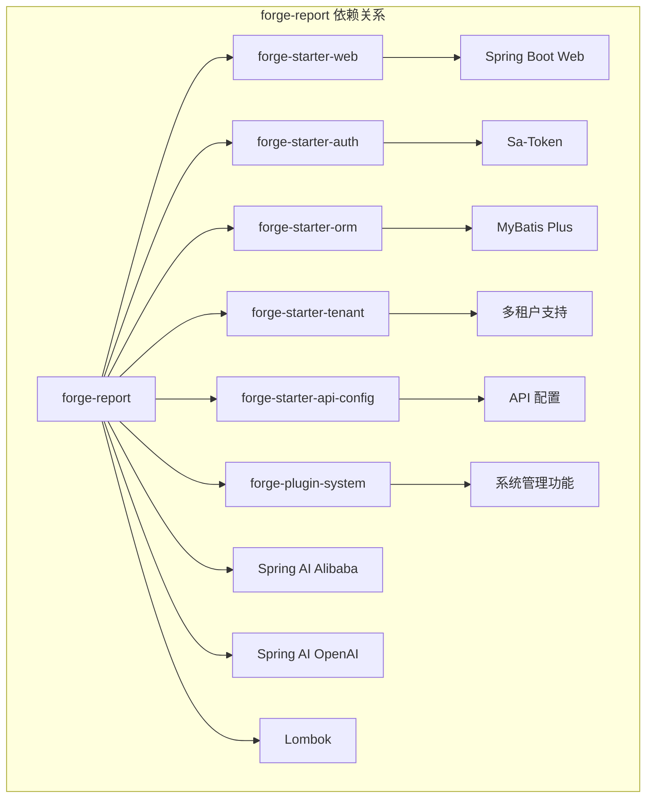
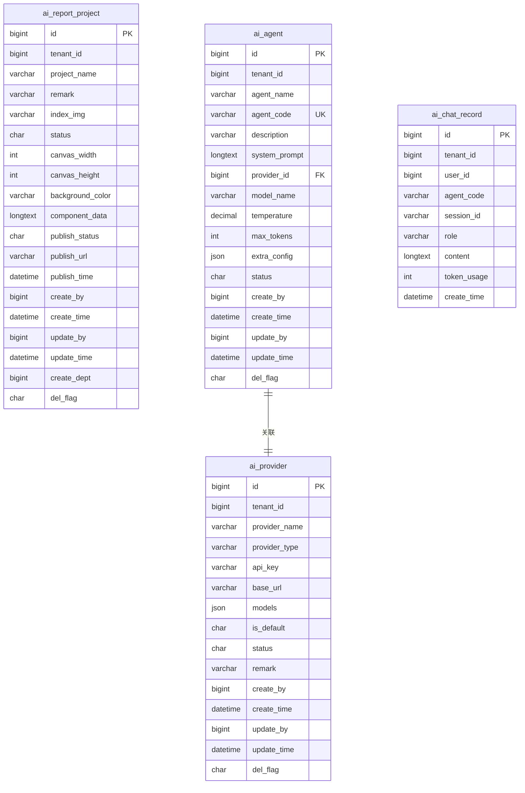

# forge-report 后端模块

<cite>
**本文档引用的文件**
- [ForgeReportApplication.java](file://forge/forge-report/src/main/java/com/mdframe/forge/report/ForgeReportApplication.java)
- [pom.xml](file://forge/forge-report/pom.xml)
- [application.yml](file://forge/forge-report/src/main/resources/application.yml)
- [AiAgentController.java](file://forge/forge-report/src/main/java/com/mdframe/forge/report/ai/agent/controller/AiAgentController.java)
- [AiChatController.java](file://forge/forge-report/src/main/java/com/mdframe/forge/report/ai/chat/controller/AiChatController.java)
- [GoviewProjectController.java](file://forge/forge-report/src/main/java/com/mdframe/forge/report/project/controller/GoviewProjectController.java)
- [AiAgent.java](file://forge/forge-report/src/main/java/com/mdframe/forge/report/ai/agent/domain/AiAgent.java)
- [AiProvider.java](file://forge/forge-report/src/main/java/com/mdframe/forge/report/ai/provider/domain/AiProvider.java)
- [GoviewProject.java](file://forge/forge-report/src/main/java/com/mdframe/forge/report/project/domain/GoviewProject.java)
- [AIGenerateRequest.java](file://forge/forge-report/src/main/java/com/mdframe/forge/report/ai/chat/dto/AIGenerateRequest.java)
- [ChatRequest.java](file://forge/forge-report/src/main/java/com/mdframe/forge/report/ai/chat/dto/ChatRequest.java)
- [init.sql](file://forge/forge-report/src/main/sql/init.sql)
- [logback.xml](file://forge/forge-report/src/main/resources/logback.xml)
</cite>

## 目录
1. [简介](#简介)
2. [项目结构](#项目结构)
3. [核心组件](#核心组件)
4. [架构概览](#架构概览)
5. [详细组件分析](#详细组件分析)
6. [依赖关系分析](#依赖关系分析)
7. [性能考虑](#性能考虑)
8. [故障排除指南](#故障排除指南)
9. [结论](#结论)

## 简介

forge-report 是一个基于 Forge 框架构建的数据可视化大屏后端服务模块。该模块提供了完整的 AI 驱动的大屏设计能力，包括智能对话、项目管理和 AI 代理配置等功能。系统采用 Spring Boot + MyBatis Plus 架构，支持多租户模式和分布式部署。

该模块的核心功能包括：
- AI 代理管理和配置
- 智能对话和大屏生成
- 项目生命周期管理
- 多供应商 AI 模型集成
- 租户隔离和权限控制

## 项目结构

forge-report 模块遵循标准的 Maven 项目结构，采用分层架构设计：

**图表来源**
- [ForgeReportApplication.java:1-26](file://forge/forge-report/src/main/java/com/mdframe/forge/report/ForgeReportApplication.java#L1-L26)
- [pom.xml:1-116](file://forge/forge-report/pom.xml#L1-L116)

**章节来源**
- [ForgeReportApplication.java:1-26](file://forge/forge-report/src/main/java/com/mdframe/forge/report/ForgeReportApplication.java#L1-L26)
- [pom.xml:1-116](file://forge/forge-report/pom.xml#L1-L116)

## 核心组件

### 应用启动类

应用启动类负责配置 Spring Boot 应用程序的基本设置，包括包扫描、MyBatis Mapper 扫描和 AOP 代理启用。

### 数据模型层

系统包含三个核心数据实体，均继承自 `TenantEntity` 实现多租户支持：

1. **GoviewProject** - 项目管理实体
2. **AiAgent** - AI 代理配置实体  
3. **AiProvider** - AI 供应商实体

### 控制器层

提供 RESTful API 接口，支持完整的 CRUD 操作和业务逻辑处理。

**章节来源**
- [AiAgentController.java:1-57](file://forge/forge-report/src/main/java/com/mdframe/forge/report/ai/agent/controller/AiAgentController.java#L1-L57)
- [AiChatController.java:1-59](file://forge/forge-report/src/main/java/com/mdframe/forge/report/ai/chat/controller/AiChatController.java#L1-L59)
- [GoviewProjectController.java:1-83](file://forge/forge-report/src/main/java/com/mdframe/forge/report/project/controller/GoviewProjectController.java#L1-L83)

## 架构概览

forge-report 采用分层架构设计，实现了清晰的关注点分离：

**图表来源**
- [AiChatController.java:1-59](file://forge/forge-report/src/main/java/com/mdframe/forge/report/ai/chat/controller/AiChatController.java#L1-L59)
- [AiAgentController.java:1-57](file://forge/forge-report/src/main/java/com/mdframe/forge/report/ai/agent/controller/AiAgentController.java#L1-L57)
- [GoviewProjectController.java:1-83](file://forge/forge-report/src/main/java/com/mdframe/forge/report/project/controller/GoviewProjectController.java#L1-L83)

### 技术栈特性

1. **Spring Boot 3.x** - 提供自动配置和开箱即用的功能
2. **MyBatis Plus** - 简化数据库操作和代码生成
3. **Sa-Token** - 轻量级 Java 权限认证框架
4. **Spring AI** - AI 应用开发框架
5. **Undertow** - 高性能 Web 服务器
6. **多租户支持** - 基于租户 ID 的数据隔离

## 详细组件分析

### AI 聊天控制器

AI 聊天控制器提供两种主要功能：大屏生成和实时对话流式输出。

**图表来源**
- [AiChatController.java:25-57](file://forge/forge-report/src/main/java/com/mdframe/forge/report/ai/chat/controller/AiChatController.java#L25-L57)
- [AIGenerateRequest.java:1-15](file://forge/forge-report/src/main/java/com/mdframe/forge/report/ai/chat/dto/AIGenerateRequest.java#L1-L15)
- [ChatRequest.java:1-14](file://forge/forge-report/src/main/java/com/mdframe/forge/report/ai/chat/dto/ChatRequest.java#L1-L14)

### AI 代理控制器

AI 代理控制器提供完整的代理管理功能，包括分页查询、列表获取、创建、更新和删除操作。

**图表来源**
- [AiAgentController.java:1-57](file://forge/forge-report/src/main/java/com/mdframe/forge/report/ai/agent/controller/AiAgentController.java#L1-L57)
- [AiAgent.java:1-34](file://forge/forge-report/src/main/java/com/mdframe/forge/report/ai/agent/domain/AiAgent.java#L1-L34)

### 项目管理控制器

项目管理控制器提供数据可视化大屏项目的完整生命周期管理。

**图表来源**
- [GoviewProjectController.java:24-81](file://forge/forge-report/src/main/java/com/mdframe/forge/report/project/controller/GoviewProjectController.java#L24-L81)

**章节来源**
- [AiChatController.java:1-59](file://forge/forge-report/src/main/java/com/mdframe/forge/report/ai/chat/controller/AiChatController.java#L1-L59)
- [AiAgentController.java:1-57](file://forge/forge-report/src/main/java/com/mdframe/forge/report/ai/agent/controller/AiAgentController.java#L1-L57)
- [GoviewProjectController.java:1-83](file://forge/forge-report/src/main/java/com/mdframe/forge/report/project/controller/GoviewProjectController.java#L1-L83)

## 依赖关系分析

### Maven 依赖结构

forge-report 模块依赖于 Forge 框架提供的各种 Starter 和插件：

**图表来源**
- [pom.xml:14-81](file://forge/forge-report/pom.xml#L14-L81)

### 数据库表结构

系统包含四个核心数据表，支持完整的 AI 大屏管理功能：

**图表来源**
- [init.sql:10-158](file://forge/forge-report/src/main/sql/init.sql#L10-L158)

**章节来源**
- [pom.xml:14-81](file://forge/forge-report/pom.xml#L14-L81)
- [init.sql:1-159](file://forge/forge-report/src/main/sql/init.sql#L1-L159)

## 性能考虑

### 配置优化

系统在配置层面进行了多项性能优化：

1. ** Undertow 服务器配置**
   - IO 线程数：8
   - 工作线程数：256
   - 直接缓冲区：启用
   - 最大 HTTP POST 大小：无限制

2. **数据库连接池优化**
   - MyBatis Plus 配置
   - 驼峰命名转换启用
   - 缓存机制启用
   - 生成键支持

3. **日志性能优化**
   - 异步文件日志
   - Trace ID 追踪
   - 按模块分级日志

### 缓存策略

系统集成了多种缓存机制：
- Redis 会话存储（Sa-Token）
- MyBatis 查询缓存
- 应用级缓存（可选）

### 并发处理

- Reactor 响应式编程支持
- SSE 流式输出
- 非阻塞 I/O 模型

## 故障排除指南

### 常见问题诊断

1. **启动失败**
   - 检查数据库连接配置
   - 验证 Redis 服务可用性
   - 确认端口未被占用

2. **AI 功能异常**
   - 验证 API Key 配置
   - 检查网络连通性
   - 确认模型可用性

3. **数据库连接问题**
   - 检查 MySQL 服务状态
   - 验证连接参数
   - 查看慢查询日志

### 日志分析

系统提供了详细的日志配置：
- 控制台输出（调试级别）
- 文件滚动日志（INFO 级别）
- SQL 语句日志（DEBUG 级别）
- Trace ID 追踪

**章节来源**
- [logback.xml:1-49](file://forge/forge-report/src/main/resources/logback.xml#L1-L49)

## 结论

forge-report 后端模块是一个功能完整、架构清晰的数据可视化大屏管理系统。通过集成 AI 能力和多租户支持，该模块为企业提供了强大的数据可视化解决方案。

### 主要优势

1. **完整的功能覆盖** - 从项目管理到 AI 驱动的设计
2. **优秀的架构设计** - 清晰的分层结构和依赖管理
3. **高性能实现** - 基于 Spring Boot 和 Undertow 的优化配置
4. **可扩展性强** - 插件化的模块设计支持功能扩展
5. **易于维护** - 标准化的代码结构和完善的日志体系

### 技术亮点

- **AI 集成** - 支持多种 AI 供应商和模型
- **多租户支持** - 完整的租户隔离机制
- **响应式编程** - 基于 Reactor 的流式处理
- **微服务友好** - 标准化的 API 设计和配置管理

该模块为构建企业级数据可视化平台奠定了坚实的技术基础，具有良好的扩展性和维护性。