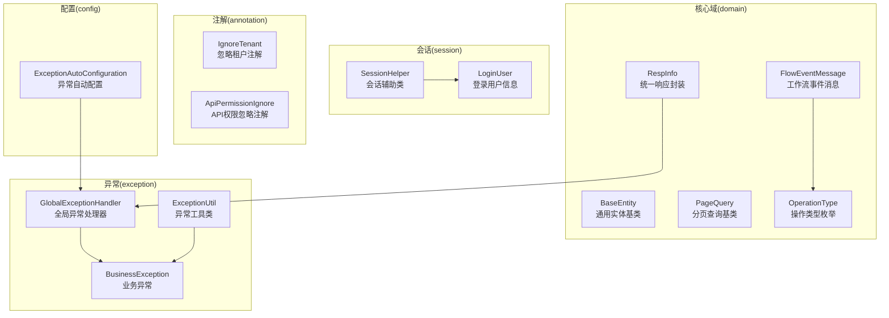
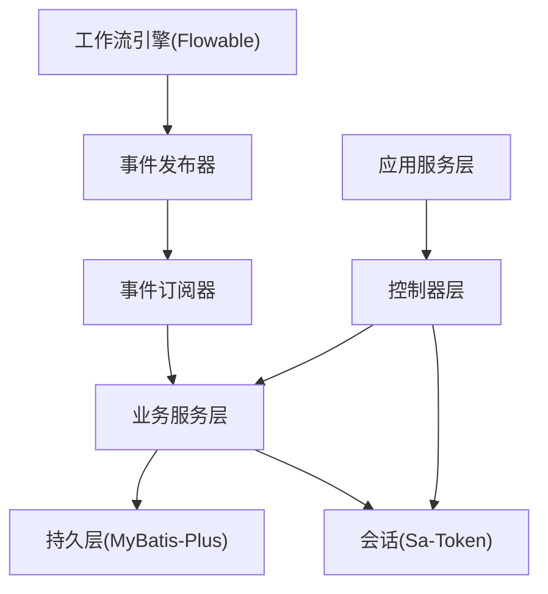
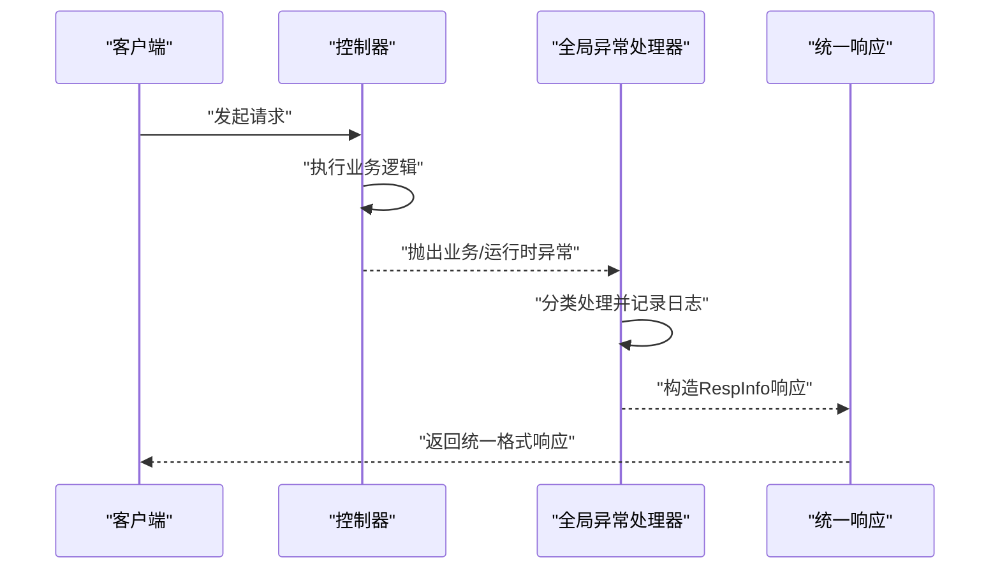
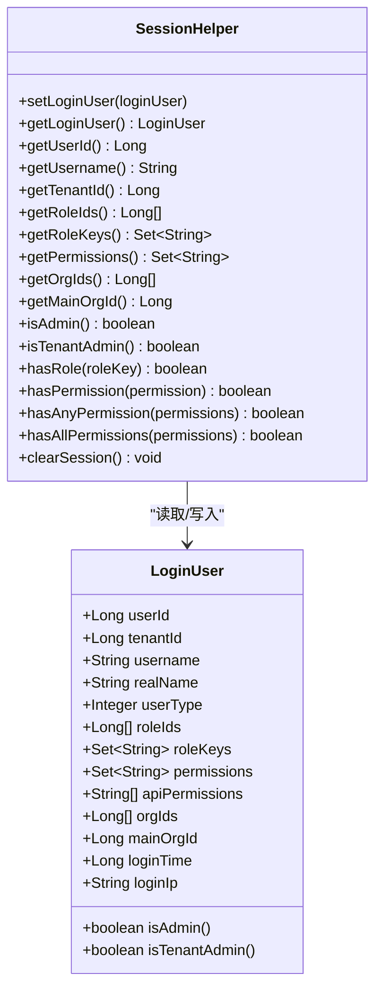
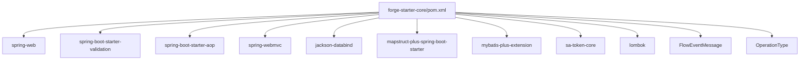

# forge-starter-core 核心框架

<cite>
**本文引用的文件**
- [BaseEntity.java](file://forge/forge-framework/forge-starter-parent/forge-starter-core/src/main/java/com/mdframe/forge/starter/core/domain/BaseEntity.java)
- [RespInfo.java](file://forge/forge-framework/forge-starter-parent/forge-starter-core/src/main/java/com/mdframe/forge/starter/core/domain/RespInfo.java)
- [PageQuery.java](file://forge/forge-framework/forge-starter-parent/forge-starter-core/src/main/java/com/mdframe/forge/starter/core/domain/PageQuery.java)
- [FlowEventMessage.java](file://forge/forge-framework/forge-starter-parent/forge-starter-core/src/main/java/com/mdframe/forge/starter/core/domain/FlowEventMessage.java)
- [OperationType.java](file://forge/forge-framework/forge-starter-parent/forge-starter-core/src/main/java/com/mdframe/forge/starter/core/domain/OperationType.java)
- [GlobalExceptionHandler.java](file://forge/forge-framework/forge-starter-parent/forge-starter-core/src/main/java/com/mdframe/forge/starter/core/exception/GlobalExceptionHandler.java)
- [BusinessException.java](file://forge/forge-framework/forge-starter-parent/forge-starter-core/src/main/java/com/mdframe/forge/starter/core/exception/BusinessException.java)
- [ExceptionUtil.java](file://forge/forge-framework/forge-starter-parent/forge-starter-core/src/main/java/com/mdframe/forge/starter/core/exception/ExceptionUtil.java)
- [LoginUser.java](file://forge/forge-framework/forge-starter-parent/forge-starter-core/src/main/java/com/mdframe/forge/starter/core/session/LoginUser.java)
- [SessionHelper.java](file://forge/forge-framework/forge-starter-parent/forge-starter-core/src/main/java/com/mdframe/forge/starter/core/session/SessionHelper.java)
- [IgnoreTenant.java](file://forge/forge-framework/forge-starter-parent/forge-starter-core/src/main/java/com/mdframe/forge/starter/core/annotation/tenant/IgnoreTenant.java)
- [ApiPermissionIgnore.java](file://forge/forge-framework/forge-starter-parent/forge-starter-core/src/main/java/com/mdframe/forge/starter/core/annotation/api/ApiPermissionIgnore.java)
- [ExceptionAutoConfiguration.java](file://forge/forge-framework/forge-starter-parent/forge-starter-core/src/main/java/com/mdframe/forge/starter/core/config/ExceptionAutoConfiguration.java)
- [org.springframework.boot.autoconfigure.AutoConfiguration.imports](file://forge/forge-framework/forge-starter-parent/forge-starter-core/src/main/resources/META-INF/spring/org.springframework.boot.autoconfigure.AutoConfiguration.imports)
- [pom.xml](file://forge/forge-framework/forge-starter-parent/forge-starter-core/pom.xml)
</cite>

## 更新摘要
**变更内容**
- 新增工作流事件消息实体 FlowEventMessage 的详细说明
- 添加操作类型枚举 OperationType 的介绍
- 更新核心组件架构图以包含工作流事件处理能力
- 增强注解系统章节以涵盖工作流相关的注解使用

## 目录
1. [简介](#简介)
2. [项目结构](#项目结构)
3. [核心组件](#核心组件)
4. [架构总览](#架构总览)
5. [详细组件分析](#详细组件分析)
6. [依赖关系分析](#依赖关系分析)
7. [性能考量](#性能考量)
8. [故障排查指南](#故障排查指南)
9. [结论](#结论)
10. [附录](#附录)

## 简介
本文件面向 forge-starter-core 核心框架模块，系统性阐述以下能力与设计：
- 全局异常处理机制与最佳实践
- 统一响应格式 RespInfo 的设计理念与使用方式
- 注解体系：租户隔离注解、API 权限注解与工作流事件注解
- 会话管理：LoginUser 与 SessionHelper 的协作
- 分页查询基类 PageQuery 的设计
- 基类 BaseEntity 的通用属性与自动填充策略
- **新增**：工作流事件消息实体 FlowEventMessage 的设计与应用场景
- **新增**：操作类型枚举 OperationType 的统一定义
- 在实际项目中的落地示例与建议

## 项目结构
forge-starter-core 作为核心启动器模块，提供统一的异常处理、响应封装、会话管理、注解与基础实体等基础设施，通过 Spring Boot 自动装配机制对外暴露。**新增**工作流事件处理能力，支持流程级和任务级事件的通知与处理。

**图表来源**
- [BaseEntity.java:12-51](file://forge/forge-framework/forge-starter-parent/forge-starter-core/src/main/java/com/mdframe/forge/starter/core/domain/BaseEntity.java#L12-L51)
- [RespInfo.java:9-96](file://forge/forge-framework/forge-starter-parent/forge-starter-core/src/main/java/com/mdframe/forge/starter/core/domain/RespInfo.java#L9-L96)
- [PageQuery.java:8-56](file://forge/forge-framework/forge-starter-parent/forge-starter-core/src/main/java/com/mdframe/forge/starter/core/domain/PageQuery.java#L8-L56)
- [FlowEventMessage.java:13-217](file://forge/forge-framework/forge-starter-parent/forge-starter-core/src/main/java/com/mdframe/forge/starter/core/domain/FlowEventMessage.java#L13-L217)
- [OperationType.java:3-42](file://forge/forge-framework/forge-starter-parent/forge-starter-core/src/main/java/com/mdframe/forge/starter/core/domain/OperationType.java#L3-L42)
- [GlobalExceptionHandler.java:24-174](file://forge/forge-framework/forge-starter-parent/forge-starter-core/src/main/java/com/mdframe/forge/starter/core/exception/GlobalExceptionHandler.java#L24-L174)
- [BusinessException.java:5-85](file://forge/forge-framework/forge-starter-parent/forge-starter-core/src/main/java/com/mdframe/forge/starter/core/exception/BusinessException.java#L5-L85)
- [ExceptionUtil.java:7-194](file://forge/forge-framework/forge-starter-parent/forge-starter-core/src/main/java/com/mdframe/forge/starter/core/exception/ExceptionUtil.java#L7-L194)
- [LoginUser.java:9-118](file://forge/forge-framework/forge-starter-parent/forge-starter-core/src/main/java/com/mdframe/forge/starter/core/session/LoginUser.java#L9-L118)
- [SessionHelper.java:8-173](file://forge/forge-framework/forge-starter-parent/forge-starter-core/src/main/java/com/mdframe/forge/starter/core/session/SessionHelper.java#L8-L173)
- [IgnoreTenant.java:5-18](file://forge/forge-framework/forge-starter-parent/forge-starter-core/src/main/java/com/mdframe/forge/starter/core/annotation/tenant/IgnoreTenant.java#L5-L18)
- [ApiPermissionIgnore.java:8-14](file://forge/forge-framework/forge-starter-parent/forge-starter-core/src/main/java/com/mdframe/forge/starter/core/annotation/api/ApiPermissionIgnore.java#L8-L14)
- [ExceptionAutoConfiguration.java:8-19](file://forge/forge-framework/forge-starter-parent/forge-starter-core/src/main/java/com/mdframe/forge/starter/core/config/ExceptionAutoConfiguration.java#L8-L19)

**章节来源**
- [pom.xml:14-122](file://forge/forge-framework/forge-starter-parent/forge-starter-core/pom.xml#L14-L122)
- [org.springframework.boot.autoconfigure.AutoConfiguration.imports:1-3](file://forge/forge-framework/forge-starter-parent/forge-starter-core/src/main/resources/META-INF/spring/org.springframework.boot.autoconfigure.AutoConfiguration.imports#L1-L3)

## 核心组件
- 统一响应封装 RespInfo：提供成功/失败/自定义响应构建方法，统一输出结构与时间戳。
- 异常处理 GlobalExceptionHandler：集中捕获各类异常，返回规范 RespInfo。
- 业务异常 BusinessException 与 ExceptionUtil：提供丰富的异常抛出与包装能力。
- 会话管理 LoginUser 与 SessionHelper：提供登录用户信息存取与权限判定。
- 注解 IgnoreTenant 与 ApiPermissionIgnore：用于租户隔离与 API 权限控制的注解开关。
- 基类 BaseEntity：统一实体的创建/更新字段与序列化格式。
- 分页查询 PageQuery：标准化分页参数与边界处理。
- **新增**：工作流事件消息 FlowEventMessage：统一工作流事件通知的数据结构，支持流程级和任务级事件。
- **新增**：操作类型枚举 OperationType：统一定义系统操作类型，便于日志记录和审计。

**章节来源**
- [RespInfo.java:9-96](file://forge/forge-framework/forge-starter-parent/forge-starter-core/src/main/java/com/mdframe/forge/starter/core/domain/RespInfo.java#L9-L96)
- [GlobalExceptionHandler.java:24-174](file://forge/forge-framework/forge-starter-parent/forge-starter-core/src/main/java/com/mdframe/forge/starter/core/exception/GlobalExceptionHandler.java#L24-L174)
- [BusinessException.java:5-85](file://forge/forge-framework/forge-starter-parent/forge-starter-core/src/main/java/com/mdframe/forge/starter/core/exception/BusinessException.java#L5-L85)
- [ExceptionUtil.java:7-194](file://forge/forge-framework/forge-starter-parent/forge-starter-core/src/main/java/com/mdframe/forge/starter/core/exception/ExceptionUtil.java#L7-L194)
- [LoginUser.java:9-118](file://forge/forge-framework/forge-starter-parent/forge-starter-core/src/main/java/com/mdframe/forge/starter/core/session/LoginUser.java#L9-L118)
- [SessionHelper.java:8-173](file://forge/forge-framework/forge-starter-parent/forge-starter-core/src/main/java/com/mdframe/forge/starter/core/session/SessionHelper.java#L8-L173)
- [IgnoreTenant.java:5-18](file://forge/forge-framework/forge-starter-parent/forge-starter-core/src/main/java/com/mdframe/forge/starter/core/annotation/tenant/IgnoreTenant.java#L5-L18)
- [ApiPermissionIgnore.java:8-14](file://forge/forge-framework/forge-starter-parent/forge-starter-core/src/main/java/com/mdframe/forge/starter/core/annotation/api/ApiPermissionIgnore.java#L8-L14)
- [BaseEntity.java:12-51](file://forge/forge-framework/forge-starter-parent/forge-starter-core/src/main/java/com/mdframe/forge/starter/core/domain/BaseEntity.java#L12-L51)
- [PageQuery.java:8-56](file://forge/forge-framework/forge-starter-parent/forge-starter-core/src/main/java/com/mdframe/forge/starter/core/domain/PageQuery.java#L8-L56)
- [FlowEventMessage.java:13-217](file://forge/forge-framework/forge-starter-parent/forge-starter-core/src/main/java/com/mdframe/forge/starter/core/domain/FlowEventMessage.java#L13-L217)
- [OperationType.java:3-42](file://forge/forge-framework/forge-starter-parent/forge-starter-core/src/main/java/com/mdframe/forge/starter/core/domain/OperationType.java#L3-L42)

## 架构总览
下图展示了核心模块在应用中的位置与交互关系，**新增**工作流事件处理的完整链路：

**图表来源**
- [SessionHelper.java:11-173](file://forge/forge-framework/forge-starter-parent/forge-starter-core/src/main/java/com/mdframe/forge/starter/core/session/SessionHelper.java#L11-L173)
- [FlowEventMessage.java:13-217](file://forge/forge-framework/forge-starter-parent/forge-starter-core/src/main/java/com/mdframe/forge/starter/core/domain/FlowEventMessage.java#L13-L217)
- [pom.xml:118-120](file://forge/forge-framework/forge-starter-parent/forge-starter-core/pom.xml#L118-L120)

## 详细组件分析

### 统一响应封装 RespInfo
- 设计理念：统一前后端交互的数据结构，包含状态码、消息、数据与时间戳；通过静态工厂方法简化调用。
- 关键点：
  - 成功/失败/自定义响应构建方法，便于在控制器中直接返回。
  - 默认时间戳字段，便于前端侧进行日志与调试。
  - 使用 Jackson 的非空序列化策略，避免空字段污染响应。
- 使用建议：
  - 控制器层优先使用 RespInfo.success()/error() 构建响应。
  - 业务异常通过 ExceptionUtil 抛出，由 GlobalExceptionHandler 统一封装。

**章节来源**
- [RespInfo.java:9-96](file://forge/forge-framework/forge-starter-parent/forge-starter-core/src/main/java/com/mdframe/forge/starter/core/domain/RespInfo.java#L9-L96)

### 全局异常处理 GlobalExceptionHandler
- 职责：集中捕获运行期异常，按类型映射到标准 RespInfo 响应。
- 覆盖范围：
  - 参数校验异常、绑定异常、约束违反异常、缺少参数、类型不匹配、请求方法不支持、404、403、文件大小超限、空指针、非法参数、运行时异常、未知异常。
- 日志记录：对每类异常记录请求 URI 与关键信息，便于问题追踪。
- 最佳实践：
  - 业务异常使用 BusinessException，确保状态码与消息可控。
  - 对外暴露的异常尽量友好，避免泄露内部细节。

**图表来源**
- [GlobalExceptionHandler.java:24-174](file://forge/forge-framework/forge-starter-parent/forge-starter-core/src/main/java/com/mdframe/forge/starter/core/exception/GlobalExceptionHandler.java#L24-L174)
- [RespInfo.java:9-96](file://forge/forge-framework/forge-starter-parent/forge-starter-core/src/main/java/com/mdframe/forge/starter/core/domain/RespInfo.java#L9-L96)

**章节来源**
- [GlobalExceptionHandler.java:24-174](file://forge/forge-framework/forge-starter-parent/forge-starter-core/src/main/java/com/mdframe/forge/starter/core/exception/GlobalExceptionHandler.java#L24-L174)

### 业务异常 BusinessException 与 ExceptionUtil
- BusinessException：可携带自定义状态码、消息与附加数据，便于前端差异化处理。
- ExceptionUtil：提供条件判断与包装能力，减少重复的异常抛出样板代码。
- 使用建议：
  - 在业务断言处使用 ExceptionUtil.throwIf/throwIfNull/throwIfBlank 等方法。
  - 对外部异常进行 wrap，统一转换为 BusinessException。

**章节来源**
- [BusinessException.java:5-85](file://forge/forge-framework/forge-starter-parent/forge-starter-core/src/main/java/com/mdframe/forge/starter/core/exception/BusinessException.java#L5-L85)
- [ExceptionUtil.java:7-194](file://forge/forge-framework/forge-starter-parent/forge-starter-core/src/main/java/com/mdframe/forge/starter/core/exception/ExceptionUtil.java#L7-L194)

### 会话管理 LoginUser 与 SessionHelper
- LoginUser：承载登录用户的核心信息，包括用户标识、角色、权限、组织、租户等，以及 isAdmin/isTenantAdmin 等便捷判定。
- SessionHelper：基于 Sa-Token 封装的会话读写与权限判定工具，提供：
  - 用户信息存取：setLoginUser/getLoginUser/getUserId/getUsername/getTenantId 等
  - 权限判定：hasRole/hasPermission/hasAnyPermission/hasAllPermissions
  - 清理会话：clearSession
- 使用建议：
  - 登录成功后通过 setLoginUser 写入会话。
  - 在控制器或服务层通过 SessionHelper 获取用户上下文，进行鉴权与数据隔离。

**图表来源**
- [LoginUser.java:9-118](file://forge/forge-framework/forge-starter-parent/forge-starter-core/src/main/java/com/mdframe/forge/starter/core/session/LoginUser.java#L9-L118)
- [SessionHelper.java:8-173](file://forge/forge-framework/forge-starter-parent/forge-starter-core/src/main/java/com/mdframe/forge/starter/core/session/SessionHelper.java#L8-L173)

**章节来源**
- [LoginUser.java:9-118](file://forge/forge-framework/forge-starter-parent/forge-starter-core/src/main/java/com/mdframe/forge/starter/core/session/LoginUser.java#L9-L118)
- [SessionHelper.java:8-173](file://forge/forge-framework/forge-starter-parent/forge-starter-core/src/main/java/com/mdframe/forge/starter/core/session/SessionHelper.java#L8-L173)

### 注解系统：租户隔离、API权限与工作流事件
- IgnoreTenant：用于标记不需要租户隔离的表或方法，默认忽略租户。
- ApiPermissionIgnore：用于标记不需要进行 API 权限校验的方法或类。
- **新增**：FlowBind：用于标记工作流事件绑定的业务组件，指定流程模型Key。
- **新增**：FlowCallback：用于标记工作流事件回调方法，指定监听的事件类型。
- 使用建议：
  - 在需要跨租户访问或特殊场景下使用 IgnoreTenant。
  - 在开放接口或测试接口上使用 ApiPermissionIgnore，但需谨慎评估安全风险。
  - 在工作流业务中使用 FlowBind 和 FlowCallback 进行事件驱动的业务处理。

**章节来源**
- [IgnoreTenant.java:5-18](file://forge/forge-framework/forge-starter-parent/forge-starter-core/src/main/java/com/mdframe/forge/starter/core/annotation/tenant/IgnoreTenant.java#L5-L18)
- [ApiPermissionIgnore.java:8-14](file://forge/forge-framework/forge-starter-parent/forge-starter-core/src/main/java/com/mdframe/forge/starter/core/annotation/api/ApiPermissionIgnore.java#L8-L14)

### 基类 BaseEntity
- 设计理念：统一实体的创建/更新字段，结合 MyBatis-Plus 的自动填充与 Jackson 的日期格式化，降低样板代码。
- 字段要点：
  - createBy/createTime/createDept：插入时自动填充
  - updateBy updateTime：插入与更新时自动填充
  - 使用 JsonFormat 统一时间格式
- 使用建议：
  - 所有持久化实体继承 BaseEntity，以获得一致的审计字段。

**章节来源**
- [BaseEntity.java:12-51](file://forge/forge-framework/forge-starter-parent/forge-starter-core/src/main/java/com/mdframe/forge/starter/core/domain/BaseEntity.java#L12-L51)

### 分页查询 PageQuery
- 设计理念：标准化分页参数，内置默认值与边界保护，提供 toPage() 直接转为 MyBatis-Plus Page。
- 关键点：
  - pageNum 默认 1，pageSize 默认 10，最大 100
  - 提供 toPage() 方法，便于直接传入分页插件
- 使用建议：
  - 控制器接收 PageQuery，服务层调用 toPage() 生成分页对象。

**章节来源**
- [PageQuery.java:8-56](file://forge/forge-framework/forge-starter-parent/forge-starter-core/src/main/java/com/mdframe/forge/starter/core/domain/PageQuery.java#L8-L56)

### 工作流事件消息 FlowEventMessage
- 设计理念：统一工作流事件通知的数据结构，支持流程级和任务级事件的标准化传输。
- 事件类型：
  - 流程级事件：PROCESS_STARTED、PROCESS_COMPLETED、PROCESS_REJECTED、PROCESS_CANCELED
  - 任务级事件：TASK_CREATED、TASK_COMPLETED、TASK_ASSIGNED
- 核心字段：
  - 基础信息：eventType、eventTime
  - 流程信息：processInstanceId、processDefKey、processDefId
  - 业务信息：businessKey、businessType、title、applyUserId、applyUserName、applyDeptId、applyDeptName
  - 任务信息：taskId、taskName、taskDefKey、assigneeId、assigneeName、comment
  - 扩展信息：variables、tenantId
- 工厂方法：
  - ofProcess()：快速构建流程级事件
  - ofTask()：快速构建任务级事件
- 使用场景：
  - 工作流完成后触发业务处理
  - 任务创建时通知相关人员
  - 流程取消时清理相关资源

**章节来源**
- [FlowEventMessage.java:13-217](file://forge/forge-framework/forge-starter-parent/forge-starter-core/src/main/java/com/mdframe/forge/starter/core/domain/FlowEventMessage.java#L13-L217)

### 操作类型枚举 OperationType
- 设计理念：统一定义系统操作类型，便于日志记录、审计和权限控制。
- 支持的操作类型：
  - QUERY：查询操作
  - ADD：新增操作
  - UPDATE：修改操作
  - DELETE：删除操作
  - EXPORT：导出操作
  - IMPORT：导入操作
  - OTHER：其他操作
- 使用建议：
  - 在日志记录时使用统一的操作类型标识
  - 在权限控制中区分不同操作类型的访问权限

**章节来源**
- [OperationType.java:3-42](file://forge/forge-framework/forge-starter-parent/forge-starter-core/src/main/java/com/mdframe/forge/starter/core/domain/OperationType.java#L3-L42)

### 异常处理自动配置
- ExceptionAutoConfiguration：通过 @AutoConfiguration 注册 GlobalExceptionHandler Bean，实现零配置启用。
- 与 Spring Boot 自动装配集成：通过 META-INF/spring/org.springframework.boot.autoconfigure.AutoConfiguration.imports 自动导入。

**章节来源**
- [ExceptionAutoConfiguration.java:8-19](file://forge/forge-framework/forge-starter-parent/forge-starter-core/src/main/java/com/mdframe/forge/starter/core/config/ExceptionAutoConfiguration.java#L8-L19)
- [org.springframework.boot.autoconfigure.AutoConfiguration.imports:1-3](file://forge/forge-framework/forge-starter-parent/forge-starter-core/src/main/resources/META-INF/spring/org.springframework.boot.autoconfigure.AutoConfiguration.imports#L1-L3)

## 依赖关系分析
- Spring 生态：Spring Web、Validation、AOP、WebMVC
- 工具库：Lombok、Hutool、MapStruct-Plus、Jackson、Fastjson2、MyBatis-Plus
- 安全与会话：Sa-Token Core
- IP 定位：ip2region
- **新增**：工作流相关依赖：Flowable、Redis（可选）

**图表来源**
- [pom.xml:14-122](file://forge/forge-framework/forge-starter-parent/forge-starter-core/pom.xml#L14-L122)

**章节来源**
- [pom.xml:14-122](file://forge/forge-framework/forge-starter-parent/forge-starter-core/pom.xml#L14-L122)

## 性能考量
- 响应序列化：RespInfo 使用 Jackson 非空序列化，减少无效字段传输，有利于网络与前端解析。
- 异常处理：集中处理避免重复日志与分支判断，提升控制器简洁度。
- 分页参数：PageQuery 对 pageSize 进行上限控制，防止高并发下的资源消耗。
- 会话读取：SessionHelper 基于 Sa-Token 的 Token Session，避免频繁数据库查询。
- **新增**：工作流事件处理：采用异步发布机制，通过 Redis Pub/Sub 或 Webhook 通知，避免阻塞主流程。

## 故障排查指南
- 统一响应未生效
  - 检查是否正确引入 forge-starter-core 并启用自动配置。
  - 确认控制器返回类型为 ResponseEntity 或直接返回对象（由 Spring MVC 自动封装）。
- 异常未被 GlobalExceptionHandler 捕获
  - 确认异常类型是否在处理器中覆盖；对于未知异常，处理器会兜底。
  - 检查是否手动抛出了非运行时异常且未被包装。
- 会话信息为空
  - 确认登录流程已调用 setLoginUser 写入会话。
  - 检查 Token 是否有效、是否跨域导致 Cookie/Token 丢失。
- 权限判定异常
  - 确认用户角色与权限集合是否正确注入。
  - 超级管理员拥有全部权限，注意该特例逻辑。
- **新增**：工作流事件处理问题
  - 确认 FlowEventMessage 序列化/反序列化正常。
  - 检查 Redis 连接配置（如使用 Redis Pub/Sub）。
  - 验证 FlowBind 注解的 modelKey 配置是否正确。
  - 确认 FlowCallback 注解的事件类型监听配置。

**章节来源**
- [GlobalExceptionHandler.java:24-174](file://forge/forge-framework/forge-starter-parent/forge-starter-core/src/main/java/com/mdframe/forge/starter/core/exception/GlobalExceptionHandler.java#L24-L174)
- [SessionHelper.java:8-173](file://forge/forge-framework/forge-starter-parent/forge-starter-core/src/main/java/com/mdframe/forge/starter/core/session/SessionHelper.java#L8-L173)

## 结论
forge-starter-core 通过统一响应、全局异常、会话管理、注解与基础实体等能力，为上层业务提供了稳定、一致且易用的基础设施。**新增**的工作流事件处理能力进一步增强了系统的事件驱动特性，支持流程级和任务级事件的标准化通知与处理。遵循本文的使用建议与最佳实践，可在保证开发效率的同时，提升系统的可观测性与安全性。

## 附录
- 实际项目使用建议
  - 控制器层：优先返回 RespInfo.success()/error()，避免直接抛出异常。
  - 业务层：使用 ExceptionUtil 进行断言与异常抛出，保持异常语义清晰。
  - 鉴权层：通过 SessionHelper.hasPermission/hasAnyPermission/hasAllPermissions 进行权限判定。
  - 数据层：实体继承 BaseEntity，利用自动填充与统一时间格式。
  - 分页：控制器接收 PageQuery，服务层调用 toPage() 生成分页对象。
  - 注解：仅在必要场景使用 IgnoreTenant 与 ApiPermissionIgnore，并做好安全评估。
  - **新增**：工作流事件：使用 FlowEventMessage 构建事件消息，通过 FlowBind 和 FlowCallback 实现事件驱动的业务处理。
  - **新增**：操作类型：使用 OperationType 统一标识系统操作，便于日志记录和权限控制。