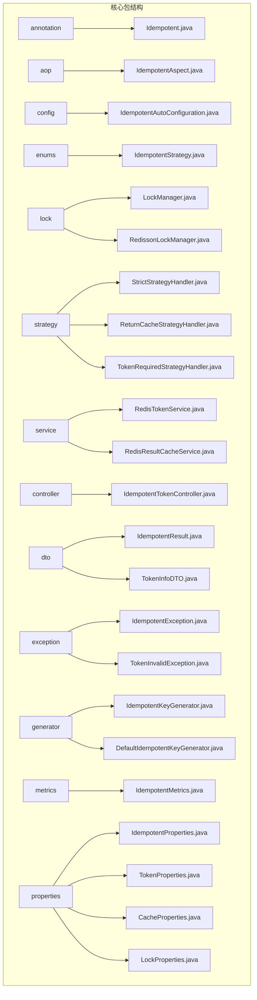
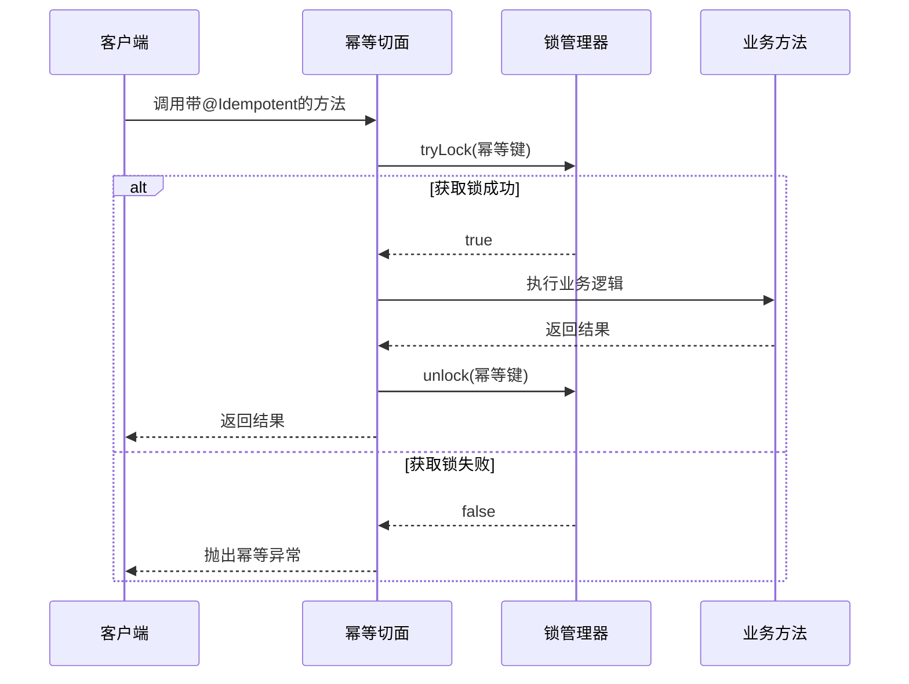
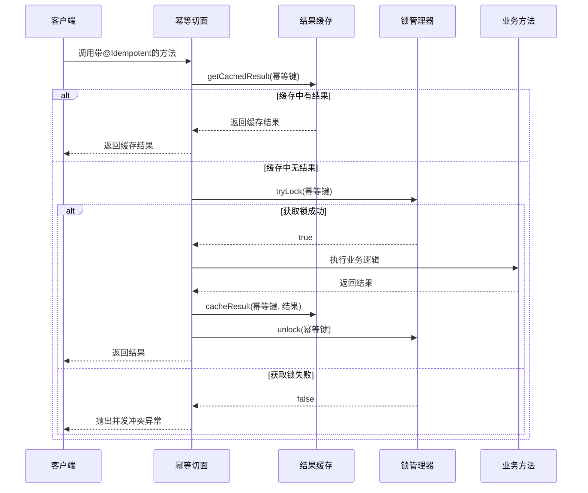
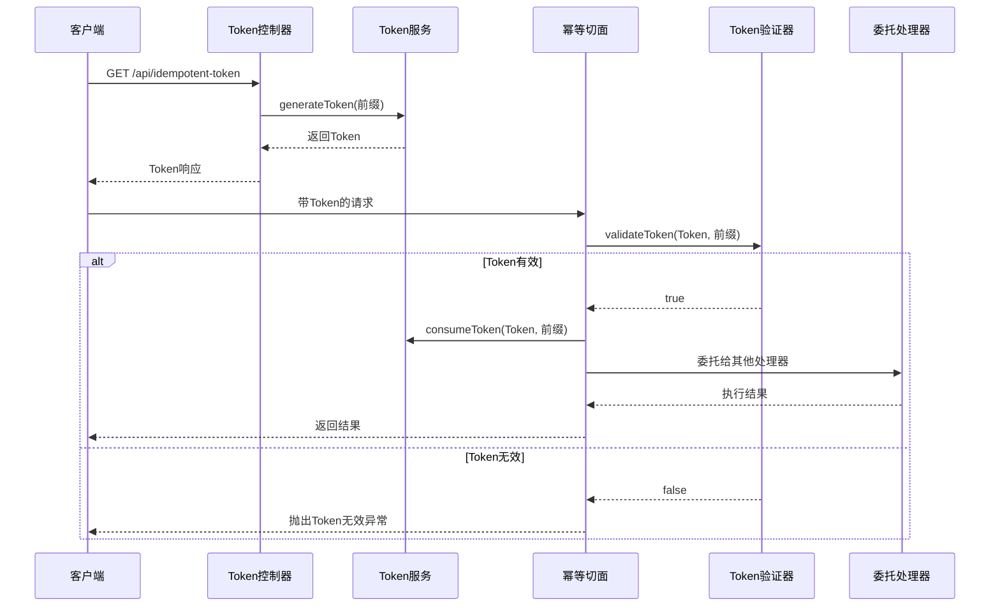
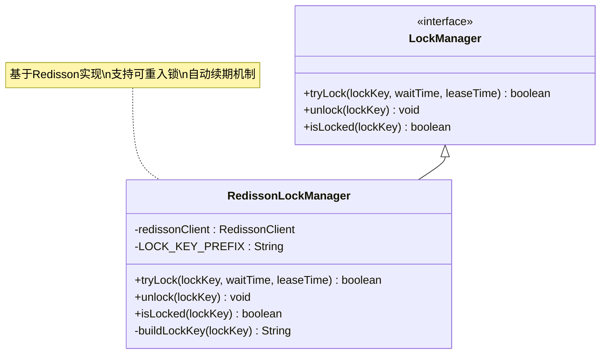
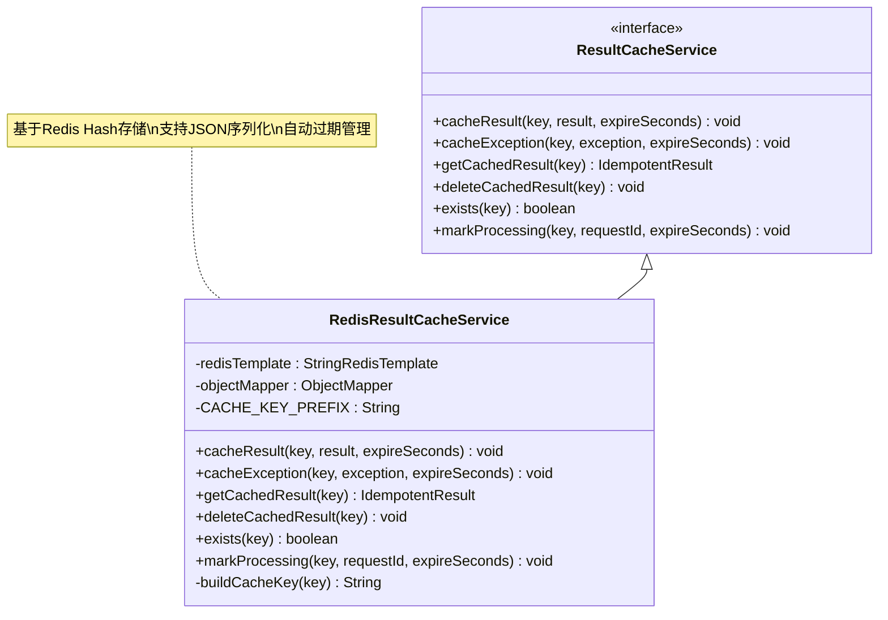
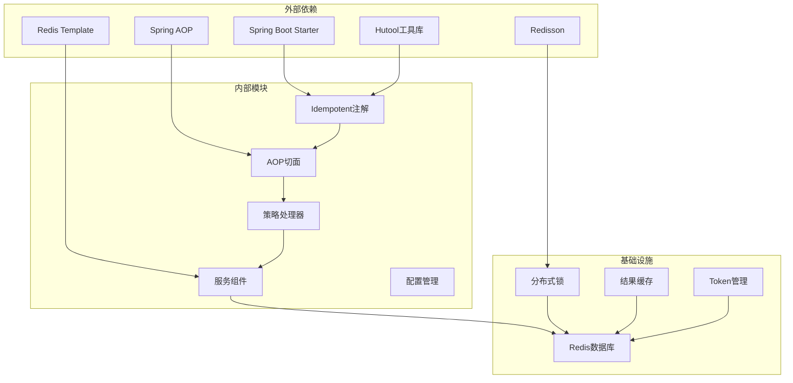

# 分布式幂等处理模块

<cite>
**本文档引用的文件**
- [Idempotent.java](file://forge/forge-framework/forge-starter-parent/forge-starter-idempotent/src/main/java/com/mdframe/forge/starter/idempotent/annotation/Idempotent.java)
- [IdempotentAspect.java](file://forge/forge-framework/forge-starter-parent/forge-starter-idempotent/src/main/java/com/mdframe/forge/starter/idempotent/aop/IdempotentAspect.java)
- [IdempotentAutoConfiguration.java](file://forge/forge-framework/forge-starter-parent/forge-starter-idempotent/src/main/java/com/mdframe/forge/starter/idempotent/config/IdempotentAutoConfiguration.java)
- [IdempotentStrategy.java](file://forge/forge-framework/forge-starter-parent/forge-starter-idempotent/src/main/java/com/mdframe/forge/starter/idempotent/enums/IdempotentStrategy.java)
- [LockManager.java](file://forge/forge-framework/forge-starter-parent/forge-starter-idempotent/src/main/java/com/mdframe/forge/starter/idempotent/lock/LockManager.java)
- [RedissonLockManager.java](file://forge/forge-framework/forge-starter-parent/forge-starter-idempotent/src/main/java/com/mdframe/forge/starter/idempotent/lock/RedissonLockManager.java)
- [StrictStrategyHandler.java](file://forge/forge-framework/forge-starter-parent/forge-starter-idempotent/src/main/java/com/mdframe/forge/starter/idempotent/strategy/StrictStrategyHandler.java)
- [ReturnCacheStrategyHandler.java](file://forge/forge-framework/forge-starter-parent/forge-starter-idempotent/src/main/java/com/mdframe/forge/starter/idempotent/strategy/ReturnCacheStrategyHandler.java)
- [TokenRequiredStrategyHandler.java](file://forge/forge-framework/forge-starter-parent/forge-starter-idempotent/src/main/java/com/mdframe/forge/starter/idempotent/strategy/TokenRequiredStrategyHandler.java)
- [RedisTokenService.java](file://forge/forge-framework/forge-starter-parent/forge-starter-idempotent/src/main/java/com/mdframe/forge/starter/idempotent/service/RedisTokenService.java)
- [RedisResultCacheService.java](file://forge/forge-framework/forge-starter-parent/forge-starter-idempotent/src/main/java/com/mdframe/forge/starter/idempotent/service/RedisResultCacheService.java)
</cite>

## 目录
1. [简介](#简介)
2. [项目结构](#项目结构)
3. [核心组件](#核心组件)
4. [架构概览](#架构概览)
5. [详细组件分析](#详细组件分析)
6. [依赖关系分析](#依赖关系分析)
7. [性能考虑](#性能考虑)
8. [故障排除指南](#故障排除指南)
9. [结论](#结论)

## 简介

分布式幂等处理模块是一个基于Spring Boot的高性能分布式系统幂等性解决方案。该模块通过注解驱动的方式，为应用程序提供多种幂等策略，包括严格拒绝、返回缓存结果和Token验证模式，确保在分布式环境下重复请求的安全处理。

该模块主要解决以下问题：
- 防止重复提交导致的数据不一致
- 处理网络重传和用户重复点击
- 支持高并发场景下的数据一致性
- 提供灵活的配置选项以适应不同业务场景

## 项目结构

分布式幂等处理模块采用标准的Maven多模块结构，主要包含以下核心包：



**图表来源**
- [Idempotent.java:1-118](file://forge/forge-framework/forge-starter-parent/forge-starter-idempotent/src/main/java/com/mdframe/forge/starter/idempotent/annotation/Idempotent.java#L1-L118)
- [IdempotentAutoConfiguration.java:1-114](file://forge/forge-framework/forge-starter-parent/forge-starter-idempotent/src/main/java/com/mdframe/forge/starter/idempotent/config/IdempotentAutoConfiguration.java#L1-L114)

**章节来源**
- [IdempotentAutoConfiguration.java:1-114](file://forge/forge-framework/forge-starter-parent/forge-starter-idempotent/src/main/java/com/mdframe/forge/starter/idempotent/config/IdempotentAutoConfiguration.java#L1-L114)

## 核心组件

### 注解驱动的幂等控制

幂等注解是整个模块的核心，提供了丰富的配置选项来满足不同的业务需求。

**主要特性：**
- **策略选择**：支持严格拒绝、返回缓存、Token验证三种模式
- **键生成**：支持自定义SpEL表达式生成幂等键
- **过期控制**：可配置幂等键和缓存的过期时间
- **结果缓存**：可选择是否缓存执行结果
- **监控指标**：可开启详细的监控统计

**章节来源**
- [Idempotent.java:1-118](file://forge/forge-framework/forge-starter-parent/forge-starter-idempotent/src/main/java/com/mdframe/forge/starter/idempotent/annotation/Idempotent.java#L1-L118)

### AOP切面拦截

基于AspectJ的AOP切面实现了对标注幂等注解的方法进行拦截和处理。

**核心功能：**
- 自动识别标注了@Idempotent注解的方法
- 动态生成幂等键并执行相应的策略处理
- 统一的异常处理和日志记录
- 性能监控和耗时统计

**章节来源**
- [IdempotentAspect.java:1-68](file://forge/forge-framework/forge-starter-parent/forge-starter-idempotent/src/main/java/com/mdframe/forge/starter/idempotent/aop/IdempotentAspect.java#L1-L68)

### 自动配置机制

Spring Boot自动配置提供了零代码集成的能力，通过条件注解实现智能装配。

**自动配置特性：**
- 条件加载：仅在相关依赖存在时启用
- 默认配置：提供合理的默认值和配置选项
- 可覆盖性：允许用户自定义配置覆盖默认设置
- 组件注册：自动注册所有必要的Bean

**章节来源**
- [IdempotentAutoConfiguration.java:1-114](file://forge/forge-framework/forge-starter-parent/forge-starter-idempotent/src/main/java/com/mdframe/forge/starter/idempotent/config/IdempotentAutoConfiguration.java#L1-L114)

## 架构概览

分布式幂等处理模块采用分层架构设计，各层职责清晰，耦合度低。

```mermaid
graph TB
subgraph "应用层"
A[业务方法] --> B[@Idempotent注解]
end
subgraph "控制层"
C[IdempotentAspect] --> D[策略处理器]
D --> E[StrictStrategyHandler]
D --> F[ReturnCacheStrategyHandler]
D --> G[TokenRequiredStrategyHandler]
end
subgraph "服务层"
H[LockManager] --> I[RedissonLockManager]
J[ResultCacheService] --> K[RedisResultCacheService]
L[TokenService] --> M[RedisTokenService]
end
subgraph "基础设施层"
N[Redis] --> O[StringRedisTemplate]
P[Redisson] --> Q[RedissonClient]
end
B --> C
E --> H
F --> J
G --> L
H --> P
J --> N
L --> N
```

**图表来源**
- [IdempotentAspect.java:1-68](file://forge/forge-framework/forge-starter-parent/forge-starter-idempotent/src/main/java/com/mdframe/forge/starter/idempotent/aop/IdempotentAspect.java#L1-L68)
- [StrictStrategyHandler.java:1-42](file://forge/forge-framework/forge-starter-parent/forge-starter-idempotent/src/main/java/com/mdframe/forge/starter/idempotent/strategy/StrictStrategyHandler.java#L1-L42)
- [ReturnCacheStrategyHandler.java:1-67](file://forge/forge-framework/forge-starter-parent/forge-starter-idempotent/src/main/java/com/mdframe/forge/starter/idempotent/strategy/ReturnCacheStrategyHandler.java#L1-L67)
- [TokenRequiredStrategyHandler.java:1-57](file://forge/forge-framework/forge-starter-parent/forge-starter-idempotent/src/main/java/com/mdframe/forge/starter/idempotent/strategy/TokenRequiredStrategyHandler.java#L1-L57)

## 详细组件分析

### 幂等策略处理机制

模块提供了三种核心的幂等处理策略，每种策略都有其特定的应用场景和实现方式。

#### 严格模式（STRICT）

严格模式是最保守的策略，对于重复请求直接拒绝执行。



**图表来源**
- [StrictStrategyHandler.java:18-41](file://forge/forge-framework/forge-starter-parent/forge-starter-idempotent/src/main/java/com/mdframe/forge/starter/idempotent/strategy/StrictStrategyHandler.java#L18-L41)
- [RedissonLockManager.java:18-36](file://forge/forge-framework/forge-starter-parent/forge-starter-idempotent/src/main/java/com/mdframe/forge/starter/idempotent/lock/RedissonLockManager.java#L18-L36)

#### 返回缓存模式（RETURN_CACHE）

返回缓存模式在检测到重复请求时，返回之前缓存的成功结果。



**图表来源**
- [ReturnCacheStrategyHandler.java:21-66](file://forge/forge-framework/forge-starter-parent/forge-starter-idempotent/src/main/java/com/mdframe/forge/starter/idempotent/strategy/ReturnCacheStrategyHandler.java#L21-L66)
- [RedisResultCacheService.java:66-101](file://forge/forge-framework/forge-starter-parent/forge-starter-idempotent/src/main/java/com/mdframe/forge/starter/idempotent/service/RedisResultCacheService.java#L66-L101)

#### Token验证模式（TOKEN_REQUIRED）

Token验证模式要求客户端必须携带有效的幂等Token才能执行。



**图表来源**
- [TokenRequiredStrategyHandler.java:22-36](file://forge/forge-framework/forge-starter-parent/forge-starter-idempotent/src/main/java/com/mdframe/forge/starter/idempotent/strategy/TokenRequiredStrategyHandler.java#L22-L36)
- [RedisTokenService.java:40-72](file://forge/forge-framework/forge-starter-parent/forge-starter-idempotent/src/main/java/com/mdframe/forge/starter/idempotent/service/RedisTokenService.java#L40-L72)

**章节来源**
- [IdempotentStrategy.java:1-82](file://forge/forge-framework/forge-starter-parent/forge-starter-idempotent/src/main/java/com/mdframe/forge/starter/idempotent/enums/IdempotentStrategy.java#L1-L82)
- [StrictStrategyHandler.java:1-42](file://forge/forge-framework/forge-starter-parent/forge-starter-idempotent/src/main/java/com/mdframe/forge/starter/idempotent/strategy/StrictStrategyHandler.java#L1-L42)
- [ReturnCacheStrategyHandler.java:1-67](file://forge/forge-framework/forge-starter-parent/forge-starter-idempotent/src/main/java/com/mdframe/forge/starter/idempotent/strategy/ReturnCacheStrategyHandler.java#L1-L67)
- [TokenRequiredStrategyHandler.java:1-57](file://forge/forge-framework/forge-starter-parent/forge-starter-idempotent/src/main/java/com/mdframe/forge/starter/idempotent/strategy/TokenRequiredStrategyHandler.java#L1-L57)

### 锁管理器设计

锁管理器是实现分布式锁的核心组件，基于Redisson提供高性能的分布式锁服务。



**图表来源**
- [LockManager.java:1-10](file://forge/forge-framework/forge-starter-parent/forge-starter-idempotent/src/main/java/com/mdframe/forge/starter/idempotent/lock/LockManager.java#L1-L10)
- [RedissonLockManager.java:1-65](file://forge/forge-framework/forge-starter-parent/forge-starter-idempotent/src/main/java/com/mdframe/forge/starter/idempotent/lock/RedissonLockManager.java#L1-L65)

**章节来源**
- [LockManager.java:1-10](file://forge/forge-framework/forge-starter-parent/forge-starter-idempotent/src/main/java/com/mdframe/forge/starter/idempotent/lock/LockManager.java#L1-L10)
- [RedissonLockManager.java:1-65](file://forge/forge-framework/forge-starter-parent/forge-starter-idempotent/src/main/java/com/mdframe/forge/starter/idempotent/lock/RedissonLockManager.java#L1-L65)

### 缓存服务实现

结果缓存服务提供了完整的缓存管理功能，支持成功结果和异常结果的缓存。



**图表来源**
- [RedisResultCacheService.java:1-148](file://forge/forge-framework/forge-starter-parent/forge-starter-idempotent/src/main/java/com/mdframe/forge/starter/idempotent/service/RedisResultCacheService.java#L1-L148)

**章节来源**
- [RedisResultCacheService.java:1-148](file://forge/forge-framework/forge-starter-parent/forge-starter-idempotent/src/main/java/com/mdframe/forge/starter/idempotent/service/RedisResultCacheService.java#L1-L148)

## 依赖关系分析

模块的依赖关系设计遵循了清晰的分层原则，各组件之间的耦合度较低，便于维护和扩展。



**图表来源**
- [IdempotentAutoConfiguration.java:20-28](file://forge/forge-framework/forge-starter-parent/forge-starter-idempotent/src/main/java/com/mdframe/forge/starter/idempotent/config/IdempotentAutoConfiguration.java#L20-L28)

**章节来源**
- [IdempotentAutoConfiguration.java:1-114](file://forge/forge-framework/forge-starter-parent/forge-starter-idempotent/src/main/java/com/mdframe/forge/starter/idempotent/config/IdempotentAutoConfiguration.java#L1-L114)

## 性能考虑

### 缓存策略优化

模块在设计时充分考虑了性能因素，采用了多种优化策略：

1. **异步处理**：在缓存模式下，未获取到锁的请求会短暂休眠后再次检查缓存，避免长时间阻塞
2. **连接池管理**：合理配置Redis连接池参数，提高连接复用率
3. **内存优化**：使用哈希结构存储缓存数据，减少内存占用
4. **批量操作**：支持批量缓存和批量查询操作

### 锁竞争处理

针对高并发场景下的锁竞争问题，模块提供了以下解决方案：

1. **超时机制**：可配置的等待时间和租约时间，避免死锁
2. **自动续期**：Redisson的看门狗机制自动延长锁的持有时间
3. **快速失败**：获取锁失败时立即返回，减少资源浪费
4. **重试策略**：在缓存模式下提供合理的重试机制

## 故障排除指南

### 常见问题及解决方案

#### 1. 幂等注解不生效

**可能原因：**
- Spring AOP代理未正确配置
- 方法不是public修饰符
- 注解未正确添加到目标方法上

**解决方案：**
- 确保使用@Component或@RestController注解的类
- 检查方法是否为public访问级别
- 验证注解导入路径正确

#### 2. Redis连接异常

**可能原因：**
- Redis服务器不可达
- 认证信息错误
- 网络连接不稳定

**解决方案：**
- 检查Redis服务器状态
- 验证连接配置参数
- 查看Redis连接池配置

#### 3. Token验证失败

**可能原因：**
- Token过期或不存在
- Token已被消费
- 请求头未正确设置

**解决方案：**
- 重新生成新的Token
- 检查Token的过期时间配置
- 确认请求头名称配置正确

**章节来源**
- [IdempotentException.java](file://forge/forge-framework/forge-starter-parent/forge-starter-idempotent/src/main/java/com/mdframe/forge/starter/idempotent/exception/IdempotentException.java)
- [TokenInvalidException.java](file://forge/forge-framework/forge-starter-parent/forge-starter-idempotent/src/main/java/com/mdframe/forge/starter/idempotent/exception/TokenInvalidException.java)

### 监控和调试

模块提供了完善的监控指标，帮助开发者诊断问题：

1. **日志级别**：支持DEBUG、INFO、WARN、ERROR四个级别的日志输出
2. **性能指标**：记录请求处理时间、锁获取成功率等关键指标
3. **异常统计**：统计各类异常的发生频率和类型
4. **缓存命中率**：监控缓存的使用效率

## 结论

分布式幂等处理模块是一个设计精良、功能完备的解决方案，具有以下特点：

**技术优势：**
- **高度可配置**：支持多种策略和丰富的配置选项
- **性能优异**：基于Redis和Redisson，提供高性能的分布式能力
- **易于集成**：通过Spring Boot自动配置，零代码即可使用
- **扩展性强**：清晰的接口设计，便于功能扩展和定制

**适用场景：**
- 支付系统中的订单创建
- 交易系统中的资金操作
- 订单系统的状态变更
- 任何需要防止重复提交的业务场景

**未来发展：**
- 支持更多缓存后端（如Memcached、本地缓存）
- 增加更多的幂等策略选项
- 提供更丰富的监控和告警功能
- 优化高并发场景下的性能表现

该模块为构建可靠的分布式系统提供了重要的基础能力，能够有效解决重复请求带来的各种问题，提升系统的整体稳定性和用户体验。