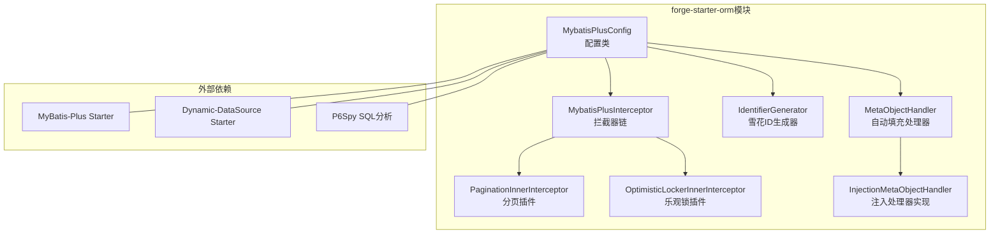
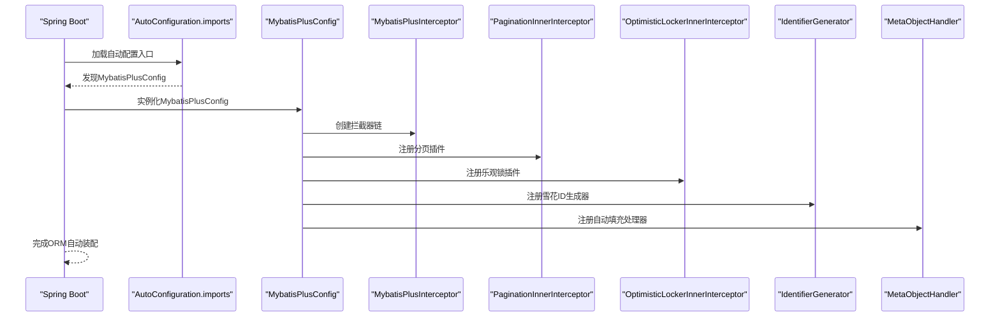
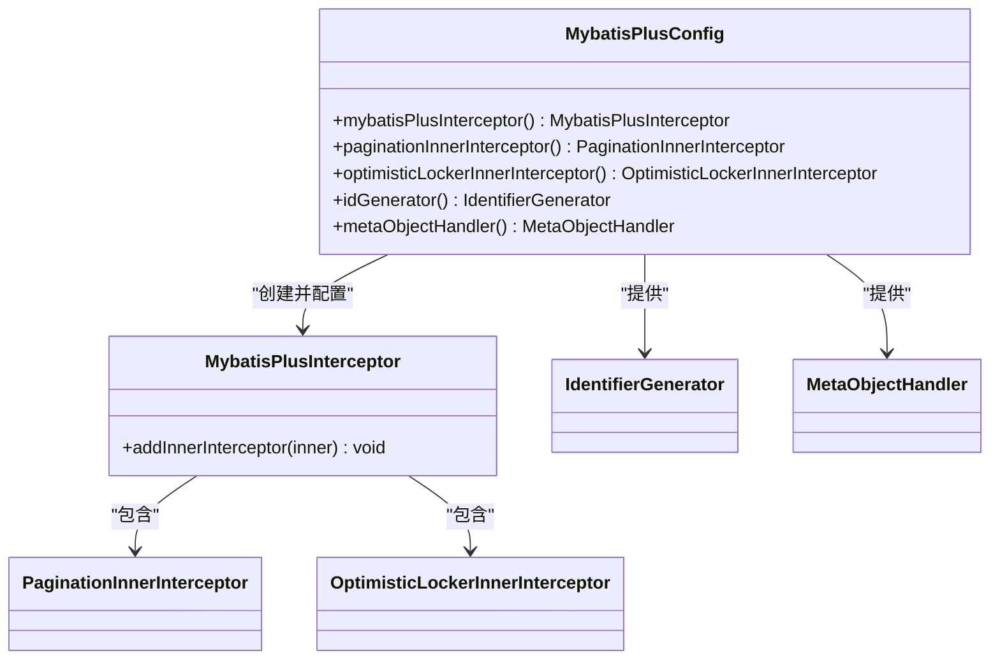
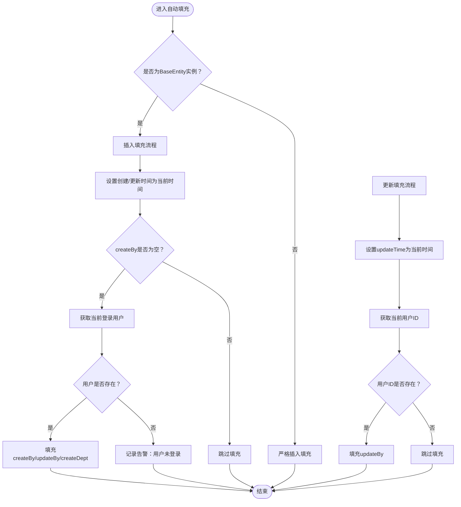
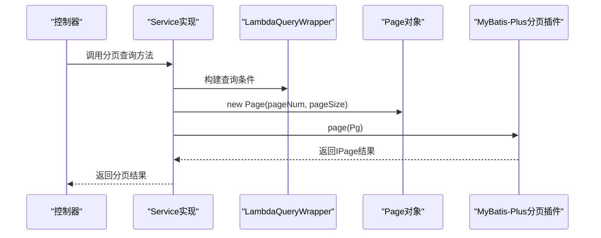
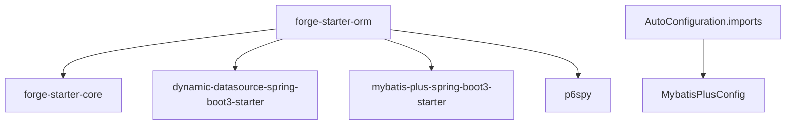

# forge-starter-orm ORM集成

<cite>
**本文档引用的文件**
- [MybatisPlusConfig.java](file://forge/forge-framework/forge-starter-parent/forge-starter-orm/src/main/java/com/mdframe/forge/starter/orm/config/MybatisPlusConfig.java)
- [InjectionMetaObjectHandler.java](file://forge/forge-framework/forge-starter-parent/forge-starter-orm/src/main/java/com/mdframe/forge/starter/orm/handler/InjectionMetaObjectHandler.java)
- [BaseEntity.java](file://forge/forge-framework/forge-starter-parent/forge-starter-core/src/main/java/com/mdframe/forge/starter/core/domain/BaseEntity.java)
- [PageQuery.java](file://forge/forge-framework/forge-starter-parent/forge-starter-core/src/main/java/com/mdframe/forge/starter/core/domain/PageQuery.java)
- [SessionHelper.java](file://forge/forge-framework/forge-starter-parent/forge-starter-core/src/main/java/com/mdframe/forge/starter/core/session/SessionHelper.java)
- [LoginUser.java](file://forge/forge-framework/forge-starter-parent/forge-starter-core/src/main/java/com/mdframe/forge/starter/core/session/LoginUser.java)
- [SysUserServiceImpl.java](file://forge/forge-framework/forge-plugin-parent/forge-plugin-system/src/main/java/com/mdframe/forge/plugin/system/service/impl/SysUserServiceImpl.java)
- [org.springframework.boot.autoconfigure.AutoConfiguration.imports](file://forge/forge-framework/forge-starter-parent/forge-starter-orm/src/main/resources/META-INF/spring/org.springframework.boot.autoconfigure.AutoConfiguration.imports)
- [pom.xml](file://forge/forge-framework/forge-starter-parent/forge-starter-orm/pom.xml)
</cite>

## 目录
1. [简介](#简介)
2. [项目结构](#项目结构)
3. [核心组件](#核心组件)
4. [架构总览](#架构总览)
5. [详细组件分析](#详细组件分析)
6. [依赖关系分析](#依赖关系分析)
7. [性能考虑](#性能考虑)
8. [故障排查指南](#故障排查指南)
9. [结论](#结论)
10. [附录](#附录)

## 简介
本文件面向forge-starter-orm ORM集成模块，系统性阐述MyBatis Plus在Forge框架中的集成配置、自动填充机制、分页查询等核心能力。文档将从架构视角解析MybatisPlusConfig配置类的作用与可扩展点，深入说明InjectionMetaObjectHandler自动填充处理器的实现原理与使用场景，并结合BaseEntity、PageQuery、SessionHelper等基础组件，给出ORM模块与数据库操作的最佳实践，包括分页查询使用方法、自动字段填充配置方式、性能优化建议等。同时提供实体类设计、Mapper接口编写、Service层实现的参考路径，帮助开发者在项目中正确使用ORM功能。

## 项目结构
forge-starter-orm位于forge-starter-parent工程下，主要包含以下关键目录与文件：
- config包：MybatisPlusConfig配置类，负责MyBatis-Plus拦截器链、分页插件、乐观锁插件、ID生成器、元对象处理器等的装配。
- handler包：InjectionMetaObjectHandler自动填充处理器，实现插入与更新时的统一字段填充逻辑。
- 资源目录resources/META-INF/spring：通过AutoConfiguration.imports声明自动装配入口，确保MybatisPlusConfig被Spring Boot自动发现。
- 依赖管理：pom.xml引入mybatis-plus-spring-boot3-starter、dynamic-datasource-spring-boot3-starter以及p6spy等组件。

图表来源
- [MybatisPlusConfig.java](file://forge/forge-framework/forge-starter-parent/forge-starter-orm/src/main/java/com/mdframe/forge/starter/orm/config/MybatisPlusConfig.java#L38-L90)
- [pom.xml](file://forge/forge-framework/forge-starter-parent/forge-starter-orm/pom.xml#L21-L36)

章节来源
- [MybatisPlusConfig.java](file://forge/forge-framework/forge-starter-parent/forge-starter-orm/src/main/java/com/mdframe/forge/starter/orm/config/MybatisPlusConfig.java#L1-L97)
- [org.springframework.boot.autoconfigure.AutoConfiguration.imports](file://forge/forge-framework/forge-starter-parent/forge-starter-orm/src/main/resources/META-INF/spring/org.springframework.boot.autoconfigure.AutoConfiguration.imports#L1-L2)
- [pom.xml](file://forge/forge-framework/forge-starter-parent/forge-starter-orm/pom.xml#L1-L41)

## 核心组件
- MybatisPlusConfig：MyBatis-Plus自动装配的核心配置类，负责：
  - 自动扫描Mapper接口（通过mapperPackage属性）
  - 注册MybatisPlusInterceptor拦截器链
  - 动态注入外部模块提供的InnerInterceptor
  - 提供分页插件与乐观锁插件的Bean定义
  - 提供雪花ID生成器与MetaObjectHandler自动填充处理器
- InjectionMetaObjectHandler：基于MyBatis-Plus MetaObjectHandler接口的自动填充实现，负责：
  - 插入时自动填充创建时间、更新时间、创建人、更新人、创建部门等字段
  - 更新时自动填充更新时间与更新人
  - 通过SessionHelper获取当前登录用户上下文，保证字段填充的准确性
- BaseEntity：所有业务实体的基类，统一声明createBy、createTime、createDept、updateBy、updateTime等字段，并标注FieldFill策略，配合自动填充处理器实现零样板代码。
- PageQuery：分页查询参数基类，提供默认页码、每页大小、排序字段与方向，并封装toPage()转换为MyBatis-Plus Page对象。
- SessionHelper：会话辅助工具，提供获取当前登录用户、用户ID、租户ID等能力，为自动填充提供上下文支撑。

章节来源
- [MybatisPlusConfig.java](file://forge/forge-framework/forge-starter-parent/forge-starter-orm/src/main/java/com/mdframe/forge/starter/orm/config/MybatisPlusConfig.java#L22-L97)
- [InjectionMetaObjectHandler.java](file://forge/forge-framework/forge-starter-parent/forge-starter-orm/src/main/java/com/mdframe/forge/starter/orm/handler/InjectionMetaObjectHandler.java#L15-L101)
- [BaseEntity.java](file://forge/forge-framework/forge-starter-parent/forge-starter-core/src/main/java/com/mdframe/forge/starter/core/domain/BaseEntity.java#L12-L51)
- [PageQuery.java](file://forge/forge-framework/forge-starter-parent/forge-starter-core/src/main/java/com/mdframe/forge/starter/core/domain/PageQuery.java#L8-L57)
- [SessionHelper.java](file://forge/forge-framework/forge-starter-parent/forge-starter-core/src/main/java/com/mdframe/forge/starter/core/session/SessionHelper.java#L8-L51)

## 架构总览
Forge框架通过AutoConfiguration.imports自动发现并加载MybatisPlusConfig，随后由该配置类统一装配MyBatis-Plus相关Bean。拦截器链由MybatisPlusInterceptor维护，内部包含分页插件与乐观锁插件；ID生成器采用基于网卡信息的雪花算法，避免集群环境下的ID冲突；MetaObjectHandler在实体插入与更新时自动填充通用字段，结合BaseEntity与SessionHelper实现“零样板代码”的数据治理。

图表来源
- [org.springframework.boot.autoconfigure.AutoConfiguration.imports](file://forge/forge-framework/forge-starter-parent/forge-starter-orm/src/main/resources/META-INF/spring/org.springframework.boot.autoconfigure.AutoConfiguration.imports#L1-L2)
- [MybatisPlusConfig.java](file://forge/forge-framework/forge-starter-parent/forge-starter-orm/src/main/java/com/mdframe/forge/starter/orm/config/MybatisPlusConfig.java#L38-L90)

## 详细组件分析

### MybatisPlusConfig配置类
- Mapper扫描：通过mapperPackage属性扫描Mapper接口，确保业务Mapper被纳入Spring容器。
- 拦截器链：优先注册外部模块注入的InnerInterceptor，再添加分页与乐观锁插件，保证扩展性与稳定性。
- 分页插件：自动识别数据库类型，默认启用分页合理化（可按需开启overflow策略）。
- 乐观锁插件：提供基于版本号或update_time的乐观锁保护，避免并发更新冲突。
- ID生成器：使用DefaultIdentifierGenerator并绑定本地主机地址，防止集群环境下雪花ID重复。
- 元对象处理器：注册InjectionMetaObjectHandler，实现统一字段填充。

图表来源
- [MybatisPlusConfig.java](file://forge/forge-framework/forge-starter-parent/forge-starter-orm/src/main/java/com/mdframe/forge/starter/orm/config/MybatisPlusConfig.java#L38-L90)

章节来源
- [MybatisPlusConfig.java](file://forge/forge-framework/forge-starter-parent/forge-starter-orm/src/main/java/com/mdframe/forge/starter/orm/config/MybatisPlusConfig.java#L22-L97)

### InjectionMetaObjectHandler自动填充处理器
- 插入填充：当实体为BaseEntity实例时，自动设置createTime、updateTime为当前时间；若createBy为空则从SessionHelper获取当前登录用户ID并填充；若createDept为空且用户orgIds非空，则填充首个组织ID。
- 更新填充：无论实体是否继承BaseEntity，均自动设置updateTime为当前时间；若能获取到用户ID，则填充updateBy。
- 异常处理：捕获填充过程中的异常并抛出业务异常，便于上层统一处理。
- 会话获取：通过SessionHelper安全获取登录用户信息，若无登录用户则记录告警并返回空。

图表来源
- [InjectionMetaObjectHandler.java](file://forge/forge-framework/forge-starter-parent/forge-starter-orm/src/main/java/com/mdframe/forge/starter/orm/handler/InjectionMetaObjectHandler.java#L26-L82)
- [BaseEntity.java](file://forge/forge-framework/forge-starter-parent/forge-starter-core/src/main/java/com/mdframe/forge/starter/core/domain/BaseEntity.java#L20-L51)
- [SessionHelper.java](file://forge/forge-framework/forge-starter-parent/forge-starter-core/src/main/java/com/mdframe/forge/starter/core/session/SessionHelper.java#L22-L35)

章节来源
- [InjectionMetaObjectHandler.java](file://forge/forge-framework/forge-starter-parent/forge-starter-orm/src/main/java/com/mdframe/forge/starter/orm/handler/InjectionMetaObjectHandler.java#L15-L101)
- [BaseEntity.java](file://forge/forge-framework/forge-starter-parent/forge-starter-core/src/main/java/com/mdframe/forge/starter/core/domain/BaseEntity.java#L12-L51)
- [SessionHelper.java](file://forge/forge-framework/forge-starter-parent/forge-starter-core/src/main/java/com/mdframe/forge/starter/core/session/SessionHelper.java#L8-L51)
- [LoginUser.java](file://forge/forge-framework/forge-starter-parent/forge-starter-core/src/main/java/com/mdframe/forge/starter/core/session/LoginUser.java#L9-L86)

### 分页查询最佳实践
- 参数封装：使用PageQuery封装pageNum、pageSize、orderByColumn、isAsc，提供默认值与边界校验。
- 转换为Page：通过toPage()方法转换为MyBatis-Plus Page对象，供分页插件识别。
- 查询实现：在Service层使用lambdaQuery()构建条件，结合orderByDesc/asc等排序，最后调用page()执行分页查询。
- 性能建议：合理设置pageSize上限，避免一次性返回过多数据；对高频查询建立必要索引；尽量使用覆盖索引减少回表。

图表来源
- [PageQuery.java](file://forge/forge-framework/forge-starter-parent/forge-starter-core/src/main/java/com/mdframe/forge/starter/core/domain/PageQuery.java#L53-L55)
- [SysUserServiceImpl.java](file://forge/forge-framework/forge-plugin-parent/forge-plugin-system/src/main/java/com/mdframe/forge/plugin/system/service/impl/SysUserServiceImpl.java#L42-L52)

章节来源
- [PageQuery.java](file://forge/forge-framework/forge-starter-parent/forge-starter-core/src/main/java/com/mdframe/forge/starter/core/domain/PageQuery.java#L8-L57)
- [SysUserServiceImpl.java](file://forge/forge-framework/forge-plugin-parent/forge-plugin-system/src/main/java/com/mdframe/forge/plugin/system/service/impl/SysUserServiceImpl.java#L42-L52)

### 实体类设计与Mapper/Service实现参考
- 实体类设计：继承BaseEntity，利用@TableField(fill=FieldFill.*)标注字段填充策略，确保自动填充生效。
- Mapper接口：遵循BaseMapper约定，无需手写SQL即可获得常用增删改查能力。
- Service实现：继承ServiceImpl<Mapper, Entity>，在查询中使用lambdaQuery()与Page对象，结合分页插件实现高性能分页。

章节来源
- [BaseEntity.java](file://forge/forge-framework/forge-starter-parent/forge-starter-core/src/main/java/com/mdframe/forge/starter/core/domain/BaseEntity.java#L12-L51)
- [SysUserServiceImpl.java](file://forge/forge-framework/forge-plugin-parent/forge-plugin-system/src/main/java/com/mdframe/forge/plugin/system/service/impl/SysUserServiceImpl.java#L34-L85)

## 依赖关系分析
- forge-starter-orm依赖：
  - forge-starter-core：提供BaseEntity、PageQuery、SessionHelper等基础能力
  - dynamic-datasource-spring-boot3-starter：支持多数据源切换
  - mybatis-plus-spring-boot3-starter：MyBatis-Plus核心依赖
  - p6spy：SQL性能分析与日志输出
- 自动装配：通过META-INF/spring/org.springframework.boot.autoconfigure.AutoConfiguration.imports声明MybatisPlusConfig，确保Spring Boot启动时自动加载。

图表来源
- [pom.xml](file://forge/forge-framework/forge-starter-parent/forge-starter-orm/pom.xml#L14-L36)
- [org.springframework.boot.autoconfigure.AutoConfiguration.imports](file://forge/forge-framework/forge-starter-parent/forge-starter-orm/src/main/resources/META-INF/spring/org.springframework.boot.autoconfigure.AutoConfiguration.imports#L1-L2)

章节来源
- [pom.xml](file://forge/forge-framework/forge-starter-parent/forge-starter-orm/pom.xml#L1-L41)
- [org.springframework.boot.autoconfigure.AutoConfiguration.imports](file://forge/forge-framework/forge-starter-parent/forge-starter-orm/src/main/resources/META-INF/spring/org.springframework.boot.autoconfigure.AutoConfiguration.imports#L1-L2)

## 性能考虑
- 分页插件：合理设置pageSize上限，避免超大分页导致数据库压力过大；对排序字段建立索引，避免全表排序。
- 乐观锁：对高并发更新场景启用乐观锁，减少锁竞争；注意版本字段的维护成本。
- ID生成：雪花ID已内置防重复策略，集群部署时无需额外配置；如需自定义，可通过扩展IdentifierGenerator实现。
- SQL分析：p6spy可用于开发与测试环境的SQL监控，生产环境建议谨慎开启以避免性能损耗。
- 自动填充：仅在实体继承BaseEntity时生效，避免对非业务实体产生不必要的填充开销。

## 故障排查指南
- 自动填充异常：检查SessionHelper是否正确设置LoginUser，确认用户登录状态；查看自动填充处理器的日志与异常信息，定位具体字段填充问题。
- 分页查询无效：确认PageQuery的pageNum与pageSize是否符合默认范围；检查分页插件是否正确注册；核对Mapper接口是否使用了正确的泛型与Page对象。
- 并发更新冲突：启用乐观锁后，若出现版本冲突，请检查业务是否正确处理并发更新场景。
- ID重复问题：检查集群节点的网卡信息是否一致，确保雪花ID生成器绑定的主机地址唯一。

章节来源
- [InjectionMetaObjectHandler.java](file://forge/forge-framework/forge-starter-parent/forge-starter-orm/src/main/java/com/mdframe/forge/starter/orm/handler/InjectionMetaObjectHandler.java#L54-L81)
- [MybatisPlusConfig.java](file://forge/forge-framework/forge-starter-parent/forge-starter-orm/src/main/java/com/mdframe/forge/starter/orm/config/MybatisPlusConfig.java#L82-L85)
- [SysUserServiceImpl.java](file://forge/forge-framework/forge-plugin-parent/forge-plugin-system/src/main/java/com/mdframe/forge/plugin/system/service/impl/SysUserServiceImpl.java#L42-L52)

## 结论
forge-starter-orm通过MybatisPlusConfig实现了对MyBatis-Plus的标准化集成，提供了分页、乐观锁、ID生成与自动填充等核心能力。结合BaseEntity、PageQuery与SessionHelper，开发者可以以最小的样板代码实现规范化的数据访问层。在实际项目中，建议遵循本文的最佳实践，合理配置分页与乐观锁，充分利用自动填充与雪花ID，确保系统的可维护性与性能表现。

## 附录
- 使用建议
  - 实体类统一继承BaseEntity，确保字段填充一致性
  - 分页查询使用PageQuery封装参数，避免硬编码
  - 在Service层使用lambdaQuery()与Page对象，结合分页插件
  - 对高并发更新场景启用乐观锁，提升数据一致性
  - 开发与测试阶段使用p6spy观察SQL执行情况，生产环境谨慎开启