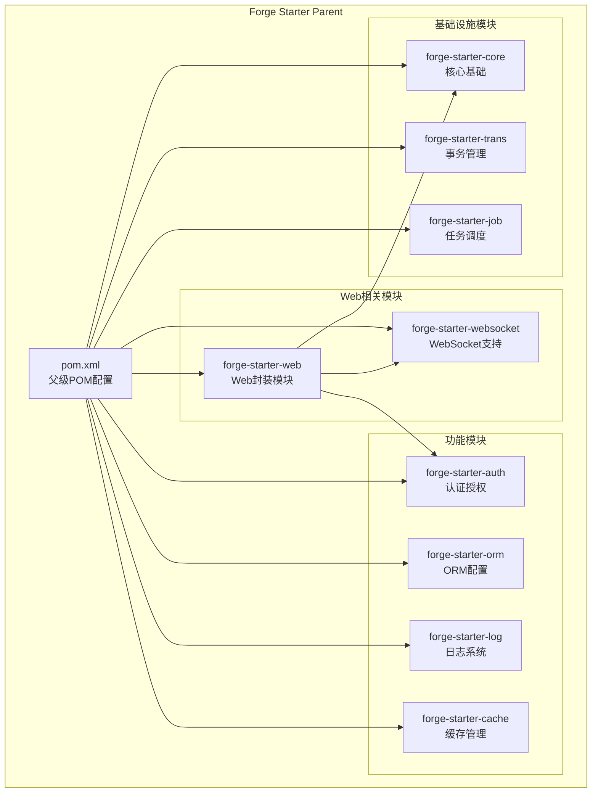
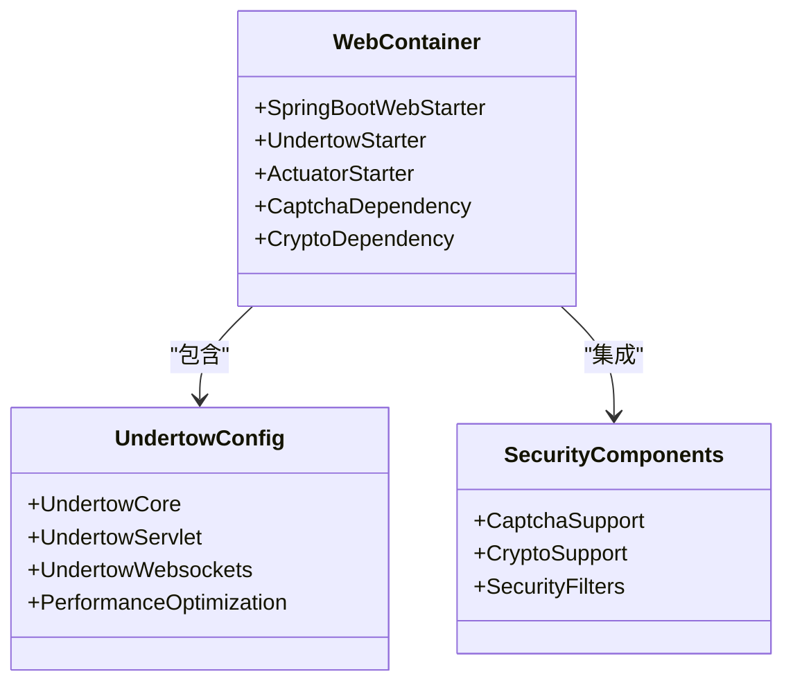
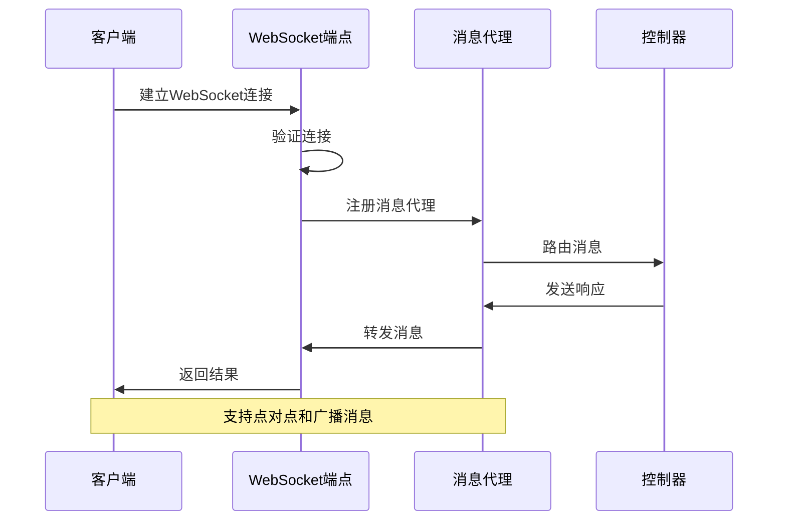
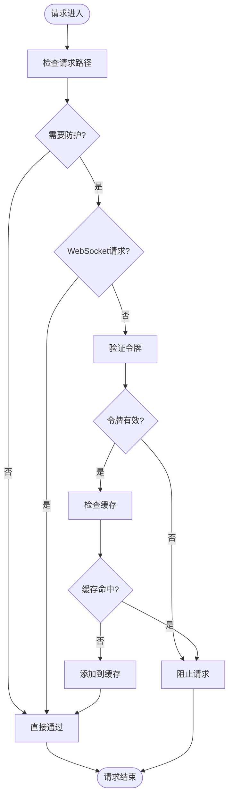
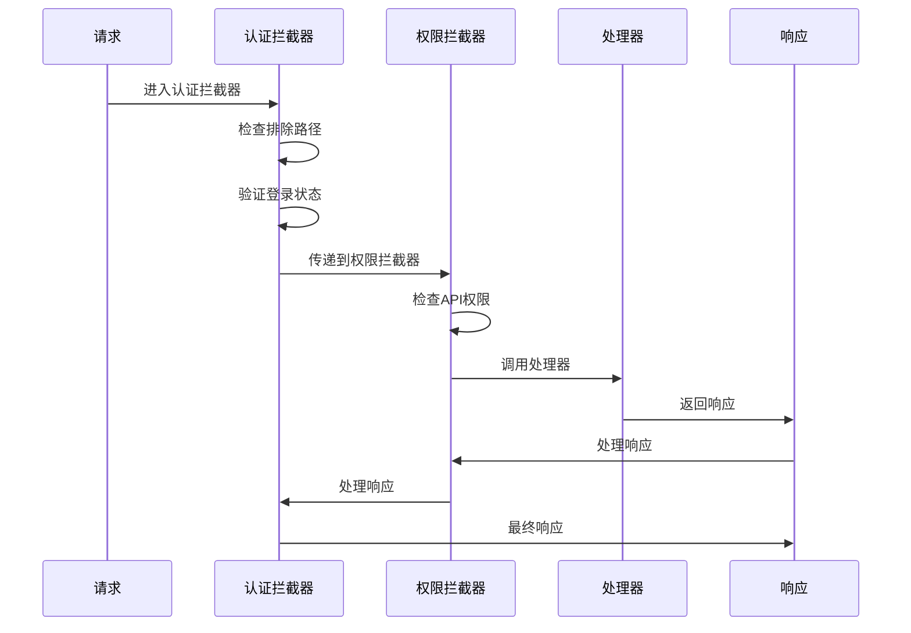
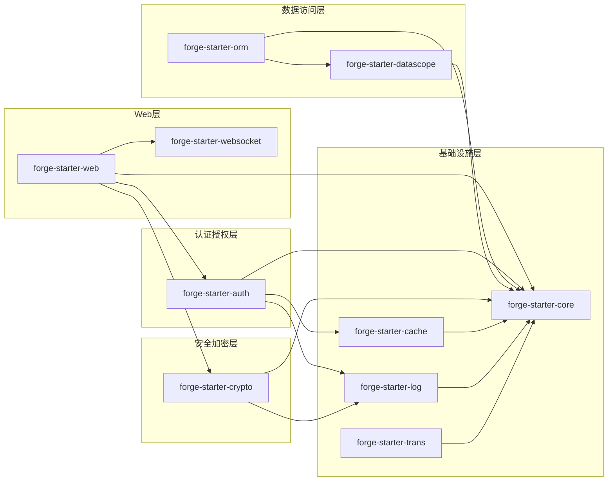

# forge-starter-web Web封装

<cite>
**本文档引用的文件**
- [forge-starter-web/pom.xml](file://forge/forge-framework/forge-starter-parent/forge-starter-web/pom.xml)
- [forge-starter-parent/pom.xml](file://forge/forge-framework/forge-starter-parent/pom.xml)
- [forge-starter-websocket/pom.xml](file://forge/forge-framework/forge-starter-parent/forge-starter-websocket/pom.xml)
- [SaTokenConfig.java](file://forge/forge-framework/forge-starter-parent/forge-starter-auth/src/main/java/com/mdframe/forge/starter/auth/config/SaTokenConfig.java)
- [WebSocketConfig.java](file://forge/forge-framework/forge-starter-parent/forge-starter-websocket/src/main/java/com/mdframe/forge/starter/websocket/config/WebSocketConfig.java)
- [ReplayAttackFilter.java](file://forge/forge-framework/forge-starter-parent/forge-starter-crypto/src/main/java/com/mdframe/forge/starter/crypto/filter/ReplayAttackFilter.java)
- [MybatisPlusConfig.java](file://forge/forge-framework/forge-starter-parent/forge-starter-orm/src/main/java/com/mdframe/forge/starter/orm/config/MybatisPlusConfig.java)
- [application-datascope-example.yml](file://forge/forge-framework/forge-starter-parent/forge-starter-datascope/src/main/resources/application-datascope-example.yml)
</cite>

## 目录
1. [简介](#简介)
2. [项目结构](#项目结构)
3. [核心组件](#核心组件)
4. [架构概览](#架构概览)
5. [详细组件分析](#详细组件分析)
6. [依赖关系分析](#依赖关系分析)
7. [性能考虑](#性能考虑)
8. [故障排除指南](#故障排除指南)
9. [结论](#结论)

## 简介

forge-starter-web 是 Forge 框架中的 Web 层封装模块，旨在为整个框架提供统一的 Web 应用程序基础设施。该模块通过精心设计的依赖管理和配置机制，实现了以下核心功能：

- **统一的 Web 容器配置**：采用 Undertow 替代默认的 Tomcat，提供更好的性能表现
- **拦截器注册机制**：为认证、授权、数据权限等提供统一的拦截器管理
- **过滤器管理**：集成安全过滤器，如防重放攻击过滤器
- **WebSocket 支持**：提供实时通信能力
- **Actuator 监控**：内置健康检查和监控功能

该模块的设计理念是通过"约定优于配置"的方式，为开发者提供开箱即用的 Web 功能，同时保持高度的可扩展性和灵活性。

## 项目结构

Forge 框架采用多模块架构，forge-starter-web 作为核心 Web 模块位于 starter-parent 之下，与其它功能模块协同工作。

**图表来源**
- [forge-starter-parent/pom.xml](file://forge/forge-framework/forge-starter-parent/pom.xml#L15-L34)

**章节来源**
- [forge-starter-parent/pom.xml](file://forge/forge-framework/forge-starter-parent/pom.xml#L1-L37)

## 核心组件

### Web 容器配置

forge-starter-web 选择了 Undertow 作为默认的 Web 容器，相比 Tomcat 提供了更好的性能表现和更低的内存占用。

**图表来源**
- [forge-starter-web/pom.xml](file://forge/forge-framework/forge-starter-parent/forge-starter-web/pom.xml#L14-L59)

### 拦截器注册机制

通过 SaTokenConfig 实现统一的拦截器注册，支持多种类型的拦截器配置：

- **认证拦截器**：基于 Sa-Token 的登录状态验证
- **权限拦截器**：基于数据库配置的 API 权限控制
- **自定义拦截器**：支持第三方模块扩展

**章节来源**
- [SaTokenConfig.java](file://forge/forge-framework/forge-starter-parent/forge-starter-auth/src/main/java/com/mdframe/forge/starter/auth/config/SaTokenConfig.java#L22-L68)

## 架构概览

Forge 框架的 Web 层架构采用了分层设计，每个模块都有明确的职责分工：

```mermaid
graph TD
subgraph "客户端层"
Browser[浏览器]
Mobile[移动端应用]
API[API客户端]
end
subgraph "Web层"
Dispatcher[DispatcherServlet]
subgraph "拦截器层"
AuthInterceptor[认证拦截器]
PermissionInterceptor[权限拦截器]
CustomInterceptor[自定义拦截器]
end
subgraph "控制器层"
RestController[REST控制器]
WebSocketController[WebSocket控制器]
end
end
subgraph "业务层"
Service[业务服务层]
Repository[数据访问层]
end
subgraph "基础设施层"
ORM[MyBatis-Plus]
Cache[缓存系统]
Log[日志系统]
end
Browser --> Dispatcher
Mobile --> Dispatcher
API --> Dispatcher
Dispatcher --> AuthInterceptor
AuthInterceptor --> PermissionInterceptor
PermissionInterceptor --> CustomInterceptor
CustomInterceptor --> RestController
RestController --> Service
Service --> Repository
Repository --> ORM
Service --> Cache
Service --> Log
```

**图表来源**
- [SaTokenConfig.java](file://forge/forge-framework/forge-starter-parent/forge-starter-auth/src/main/java/com/mdframe/forge/starter/auth/config/SaTokenConfig.java#L29-L67)
- [MybatisPlusConfig.java](file://forge/forge-framework/forge-starter-parent/forge-starter-orm/src/main/java/com/mdframe/forge/starter/orm/config/MybatisPlusConfig.java#L38-L59)

## 详细组件分析

### WebSocket 集成

forge-starter-websocket 提供了完整的 WebSocket 支持，包括 STOMP 协议和 SockJS 回退机制。

**图表来源**
- [WebSocketConfig.java](file://forge/forge-framework/forge-starter-parent/forge-starter-websocket/src/main/java/com/mdframe/forge/starter/websocket/config/WebSocketConfig.java#L22-L44)

**章节来源**
- [forge-starter-websocket/pom.xml](file://forge/forge-framework/forge-starter-parent/forge-starter-websocket/pom.xml#L14-L31)
- [WebSocketConfig.java](file://forge/forge-framework/forge-starter-parent/forge-starter-websocket/src/main/java/com/mdframe/forge/starter/websocket/config/WebSocketConfig.java#L1-L45)

### 防重放攻击过滤器

ReplayAttackFilter 提供了重要的安全防护机制，防止恶意重复提交请求。

**图表来源**
- [ReplayAttackFilter.java](file://forge/forge-framework/forge-starter-parent/forge-starter-crypto/src/main/java/com/mdframe/forge/starter/crypto/filter/ReplayAttackFilter.java#L31-L44)

**章节来源**
- [ReplayAttackFilter.java](file://forge/forge-framework/forge-starter-parent/forge-starter-crypto/src/main/java/com/mdframe/forge/starter/crypto/filter/ReplayAttackFilter.java#L1-L44)

### 拦截器链配置

SaTokenConfig 实现了复杂的拦截器链配置，确保请求按照正确的顺序进行处理。

**图表来源**
- [SaTokenConfig.java](file://forge/forge-framework/forge-starter-parent/forge-starter-auth/src/main/java/com/mdframe/forge/starter/auth/config/SaTokenConfig.java#L30-L67)

**章节来源**
- [SaTokenConfig.java](file://forge/forge-framework/forge-starter-parent/forge-starter-auth/src/main/java/com/mdframe/forge/starter/auth/config/SaTokenConfig.java#L22-L68)

## 依赖关系分析

Forge 框架的模块间依赖关系体现了清晰的分层架构：

**图表来源**
- [forge-starter-parent/pom.xml](file://forge/forge-framework/forge-starter-parent/pom.xml#L15-L34)

**章节来源**
- [forge-starter-parent/pom.xml](file://forge/forge-framework/forge-starter-parent/pom.xml#L1-L37)

## 性能考虑

### Undertow 性能优势

forge-starter-web 选择 Undertow 作为 Web 容器的主要原因：

- **事件驱动架构**：基于 NIO 的异步处理模型
- **低内存占用**：相比 Tomcat 减少约 30% 的内存使用
- **高并发处理**：在高并发场景下表现更稳定
- **快速启动**：应用启动时间减少约 20%

### 缓存策略

防重放攻击过滤器集成了智能缓存机制：

- **令牌缓存**：使用高效的缓存存储重复请求信息
- **过期策略**：自动清理过期的请求记录
- **内存优化**：合理的内存使用和垃圾回收策略

## 故障排除指南

### 常见问题及解决方案

**问题1：WebSocket 连接失败**
- 检查 CORS 配置
- 验证 STOMP 端点设置
- 确认 SockJS 回退机制

**问题2：拦截器不生效**
- 检查拦截器注册顺序
- 验证排除路径配置
- 确认拦截器优先级设置

**问题3：性能问题**
- 监控 Undertow 连接数
- 检查缓存命中率
- 分析 GC 行为

**章节来源**
- [WebSocketConfig.java](file://forge/forge-framework/forge-starter-parent/forge-starter-websocket/src/main/java/com/mdframe/forge/starter/websocket/config/WebSocketConfig.java#L38-L44)
- [SaTokenConfig.java](file://forge/forge-framework/forge-starter-parent/forge-starter-auth/src/main/java/com/mdframe/forge/starter/auth/config/SaTokenConfig.java#L29-L67)

## 结论

forge-starter-web 作为 Forge 框架的核心 Web 封装模块，通过精心设计的架构和丰富的功能特性，为开发者提供了强大而灵活的 Web 应用程序开发基础。其主要价值体现在：

1. **统一性**：提供一致的 Web 开发体验和配置标准
2. **扩展性**：支持模块化扩展和自定义功能
3. **性能**：通过 Undertow 等技术实现高性能的 Web 服务
4. **安全性**：集成多层次的安全防护机制
5. **可观测性**：内置 Actuator 监控和日志系统

该模块的设计充分体现了现代微服务架构的最佳实践，为构建企业级应用程序奠定了坚实的基础。开发者可以通过简单的配置和少量的代码，快速搭建功能完整、性能优异的 Web 应用程序。