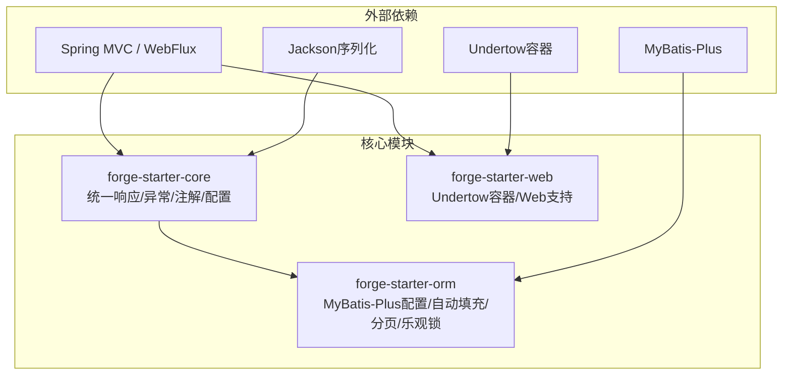
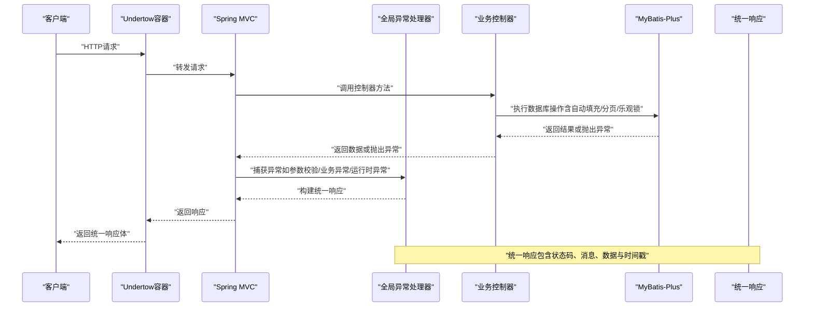
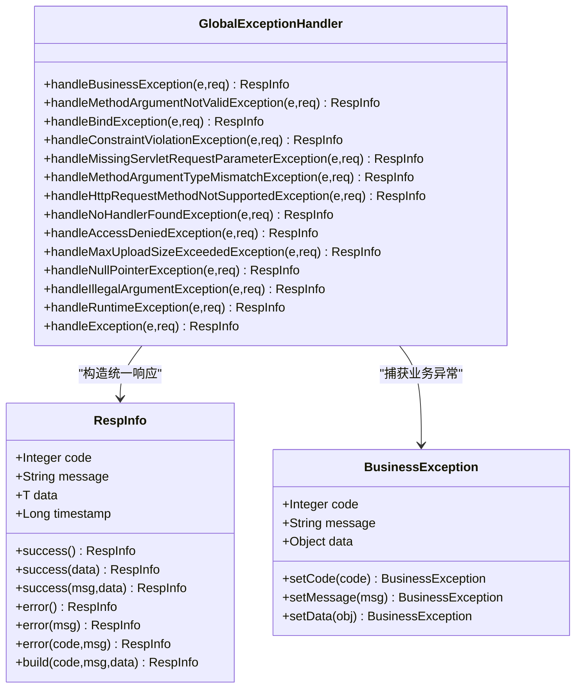
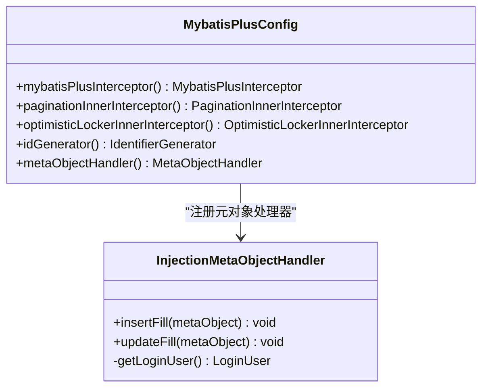
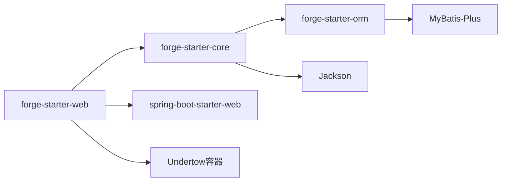

# 核心模块

<cite>
**本文引用的文件**
- [forge-starter-core 异常处理器](file://forge/forge-framework/forge-starter-parent/forge-starter-core/src/main/java/com/mdframe/forge/starter/core/exception/GlobalExceptionHandler.java)
- [forge-starter-core 统一响应封装](file://forge/forge-framework/forge-starter-parent/forge-starter-core/src/main/java/com/mdframe/forge/starter/core/domain/RespInfo.java)
- [forge-starter-core 业务异常类](file://forge/forge-framework/forge-starter-parent/forge-starter-core/src/main/java/com/mdframe/forge/starter/core/exception/BusinessException.java)
- [forge-starter-orm MyBatis-Plus 配置](file://forge/forge-framework/forge-starter-parent/forge-starter-orm/src/main/java/com/mdframe/forge/starter/orm/config/MybatisPlusConfig.java)
- [forge-starter-orm 注入式元对象处理器](file://forge/forge-framework/forge-starter-parent/forge-starter-orm/src/main/java/com/mdframe/forge/starter/orm/handler/InjectionMetaObjectHandler.java)
- [forge-starter-web Web容器配置](file://forge/forge-framework/forge-starter-parent/forge-starter-web/pom.xml)
- [forge-starter-core 核心模块依赖](file://forge/forge-framework/forge-starter-parent/forge-starter-core/pom.xml)
- [forge-starter-orm ORM模块依赖](file://forge/forge-framework/forge-starter-parent/forge-starter-orm/pom.xml)
</cite>

## 更新摘要
**所做更改**
- 更新了模块结构说明，反映架构重组后的实际模块组织
- 新增了核心模块依赖关系分析，展示模块间的依赖层次
- 更新了项目结构图，体现整合后的模块布局
- 补充了Web容器配置说明，反映Undertow替代Tomcat的架构决策

## 目录
1. [简介](#简介)
2. [架构重组后的模块结构](#架构重组后的模块结构)
3. [核心组件](#核心组件)
4. [架构总览](#架构总览)
5. [详细组件分析](#详细组件分析)
6. [模块依赖关系分析](#模块依赖关系分析)
7. [性能考量](#性能考量)
8. [故障排查指南](#故障排查指南)
9. [结论](#结论)
10. [附录](#附录)

## 简介
本文件聚焦于 Forge 核心模块，系统性解析经过架构重组后的基础模块设计与实现。经过整合优化，Forge 现已采用简化的模块结构，重点突出以下核心能力：
- **forge-starter-core**：统一异常处理、全局统一响应、注解体系与配置管理等基础设施
- **forge-starter-web**：Web 层支持，基于 Undertow 的高性能容器配置
- **forge-starter-orm**：MyBatis-Plus 集成、自动填充、分页查询、乐观锁等 ORM 能力

文档以"从上到下"的方式逐步展开：先给出整体架构与模块职责，再深入到关键组件与流程图示，最后提供性能与排障建议，帮助开发者快速理解框架基础架构与扩展点。

## 架构重组后的模块结构
经过架构重组，Forge 的核心模块位于 forge/forge-framework/forge-starter-parent 下，采用简化的"核心模块 + 功能模块"组织方式。重组后的模块结构更加清晰，减少了模块间的耦合度：

- **forge-starter-core**：提供统一响应、异常处理、注解与配置等基础设施
- **forge-starter-web**：提供基于 Undertow 的高性能 Web 容器支持
- **forge-starter-orm**：提供 ORM 能力（MyBatis-Plus 配置、自动填充、分页与乐观锁）

**图表来源**
- [forge-starter-core 异常处理器:28-175](file://forge/forge-framework/forge-starter-parent/forge-starter-core/src/main/java/com/mdframe/forge/starter/core/exception/GlobalExceptionHandler.java#L28-L175)
- [forge-starter-orm MyBatis-Plus 配置:27-97](file://forge/forge-framework/forge-starter-parent/forge-starter-orm/src/main/java/com/mdframe/forge/starter/orm/config/MybatisPlusConfig.java#L27-L97)
- [forge-starter-web Web容器配置:15-63](file://forge/forge-framework/forge-starter-parent/forge-starter-web/pom.xml#L15-L63)

## 核心组件
本节概述三大核心模块的关键职责与交互关系：

### 统一响应与异常处理（forge-starter-core）
- **统一响应封装**：提供成功/失败/自定义三类静态工厂方法，统一输出 code、message、data、timestamp 字段；通过 Jackson 配置避免空字段污染
- **全局异常处理**：覆盖参数校验、绑定、缺失参数、类型不匹配、请求方法不支持、404、403、文件大小超限、空指针、非法参数、运行时异常与未知异常，确保所有异常被规范化输出
- **业务异常**：提供带状态码、消息与附加数据的业务异常基类，便于业务层抛出可预期的错误

### ORM 能力（forge-starter-orm）
- **MyBatis-Plus 配置**：集中注册拦截器链（自定义 InnerInterceptor + 分页 + 乐观锁），扫描 Mapper 包，启用事务代理，使用网卡信息绑定雪花 ID 生成器，避免集群重复
- **注入式元对象处理器**：在插入/更新时自动填充创建时间、更新时间、创建人、更新人、创建部门等字段；当用户未登录时安全降级，避免强制依赖会话

### Web 层支持（forge-starter-web）
- **高性能容器**：基于 Undertow 替代传统 Tomcat，提供更好的性能表现和资源利用率
- **Web 支持**：提供 Actuator 监控、验证码、加密等 Web 层扩展能力

## 架构总览
下图展示了"请求进入 -> 控制器 -> 异常处理 -> ORM 操作 -> 统一响应"的端到端流程：

**图表来源**
- [forge-starter-core 异常处理器:35-173](file://forge/forge-framework/forge-starter-parent/forge-starter-core/src/main/java/com/mdframe/forge/starter/core/exception/GlobalExceptionHandler.java#L35-L173)
- [forge-starter-core 统一响应封装:41-95](file://forge/forge-framework/forge-starter-parent/forge-starter-core/src/main/java/com/mdframe/forge/starter/core/domain/RespInfo.java#L41-L95)
- [forge-starter-orm MyBatis-Plus 配置:38-76](file://forge/forge-framework/forge-starter-parent/forge-starter-orm/src/main/java/com/mdframe/forge/starter/orm/config/MybatisPlusConfig.java#L38-L76)

## 详细组件分析

### 统一响应与异常处理（forge-starter-core）
- **统一响应封装**：提供成功/失败/自定义三类静态工厂方法，统一输出 code、message、data、timestamp 字段；通过 Jackson 配置避免空字段污染
- **全局异常处理**：覆盖参数校验、绑定、缺失参数、类型不匹配、请求方法不支持、404、403、文件大小超限、空指针、非法参数、运行时异常与未知异常，确保所有异常被规范化输出
- **业务异常**：提供带状态码、消息与附加数据的业务异常基类，便于业务层抛出可预期的错误

**图表来源**
- [forge-starter-core 统一响应封装:14-95](file://forge/forge-framework/forge-starter-parent/forge-starter-core/src/main/java/com/mdframe/forge/starter/core/domain/RespInfo.java#L14-L95)
- [forge-starter-core 业务异常类:9-84](file://forge/forge-framework/forge-starter-parent/forge-starter-core/src/main/java/com/mdframe/forge/starter/core/exception/BusinessException.java#L9-L84)
- [forge-starter-core 异常处理器:35-173](file://forge/forge-framework/forge-starter-parent/forge-starter-core/src/main/java/com/mdframe/forge/starter/core/exception/GlobalExceptionHandler.java#L35-L173)

### ORM 模块（forge-starter-orm）
- **MyBatis-Plus 配置**：集中注册拦截器链（自定义 InnerInterceptor + 分页 + 乐观锁），扫描 Mapper 包，启用事务代理，使用网卡信息绑定雪花 ID 生成器，避免集群重复
- **注入式元对象处理器**：在插入/更新时自动填充创建时间、更新时间、创建人、更新人、创建部门等字段；当用户未登录时安全降级，避免强制依赖会话

**图表来源**
- [forge-starter-orm MyBatis-Plus 配置:27-97](file://forge/forge-framework/forge-starter-parent/forge-starter-orm/src/main/java/com/mdframe/forge/starter/orm/config/MybatisPlusConfig.java#L27-L97)
- [forge-starter-orm 注入式元对象处理器:18-100](file://forge/forge-framework/forge-starter-parent/forge-starter-orm/src/main/java/com/mdframe/forge/starter/orm/handler/InjectionMetaObjectHandler.java#L18-L100)

### Web 层封装（forge-starter-web）
- **高性能容器**：基于 Undertow 替代传统 Tomcat，提供更好的性能表现和资源利用率
- **Web 支持**：提供 Actuator 监控、验证码、加密等 Web 层扩展能力
- **容器配置**：排除 Tomcat，引入 Undertow 核心组件，包括核心、Servlet 支持和 WebSocket JSR 支持

**章节来源**
- [forge-starter-web Web容器配置:15-63](file://forge/forge-framework/forge-starter-parent/forge-starter-web/pom.xml#L15-L63)

## 模块依赖关系分析
经过架构重组，模块间的依赖关系更加清晰和简洁：

- **forge-starter-core** 作为基础模块，提供统一响应与异常处理能力
- **forge-starter-orm** 依赖 core 模块，提供 ORM 能力
- **forge-starter-web** 依赖 spring-boot-starter-web，提供 Web 容器支持
- **Undertow 容器** 替代 Tomcat，提供更好的性能表现

**图表来源**
- [forge-starter-core 核心模块依赖:14-122](file://forge/forge-framework/forge-starter-parent/forge-starter-core/pom.xml#L14-L122)
- [forge-starter-orm ORM模块依赖:14-37](file://forge/forge-framework/forge-starter-parent/forge-starter-orm/pom.xml#L14-L37)
- [forge-starter-web Web容器配置:15-63](file://forge/forge-framework/forge-starter-parent/forge-starter-web/pom.xml#L15-L63)

**章节来源**
- [forge-starter-core 核心模块依赖:14-122](file://forge/forge-framework/forge-starter-parent/forge-starter-core/pom.xml#L14-L122)
- [forge-starter-orm ORM模块依赖:14-37](file://forge/forge-framework/forge-starter-parent/forge-starter-orm/pom.xml#L14-L37)
- [forge-starter-web Web容器配置:15-63](file://forge/forge-framework/forge-starter-parent/forge-starter-web/pom.xml#L15-L63)

## 性能考量
- **统一异常处理**：减少分支判断与重复封装，降低控制器复杂度，提升可观测性
- **ORM 自动填充**：在插入/更新时批量填充公共字段，避免重复赋值，但需注意实体字段映射与空值判定
- **MyBatis-Plus 分页**：建议结合数据库方言与合理页大小，避免超大偏移导致慢查询
- **乐观锁**：对高并发写场景有效，但需注意冲突重试与业务补偿
- **ID 生成**：基于网卡信息的雪花算法可避免集群重复，部署时需确保网络适配器稳定
- **Undertow 性能**：相比 Tomcat 具有更好的并发处理能力和内存利用率

## 故障排查指南
- **参数校验失败**：检查请求体/路径/查询参数是否符合校验注解要求，查看统一响应中的错误消息
- **业务异常**：捕获 BusinessException 并核对 code/message/data，定位业务规则触发点
- **运行时异常**：查看全局异常处理器对未知异常的兜底响应，结合日志定位根因
- **文件上传超限**：调整最大上传大小配置，确认前端上传体积是否超过后端限制
- **自动填充异常**：检查实体是否继承基类、会话中是否存在登录用户、字段映射是否正确
- **Web 容器问题**：检查 Undertow 配置，确认容器启动日志和端口占用情况

**章节来源**
- [forge-starter-core 异常处理器:47-173](file://forge/forge-framework/forge-starter-parent/forge-starter-core/src/main/java/com/mdframe/forge/starter/core/exception/GlobalExceptionHandler.java#L47-L173)
- [forge-starter-core 业务异常类:29-84](file://forge/forge-framework/forge-starter-parent/forge-starter-core/src/main/java/com/mdframe/forge/starter/core/exception/BusinessException.java#L29-L84)
- [forge-starter-orm 注入式元对象处理器:26-81](file://forge/forge-framework/forge-starter-parent/forge-starter-orm/src/main/java/com/mdframe/forge/starter/orm/handler/InjectionMetaObjectHandler.java#L26-L81)

## 结论
经过架构重组，Forge 核心模块通过统一响应与异常处理、ORM 自动填充与分页、以及基于 Undertow 的高性能 Web 容器支持，构建了更加简洁高效的基础框架。开发者可在保持一致性的前提下，快速实现业务功能并按需扩展横切关注点。新的模块结构减少了不必要的复杂性，同时保持了强大的功能性和良好的性能表现。

## 附录
- **统一响应字段说明**
  - code：业务状态码
  - message：提示信息
  - data：业务数据
  - timestamp：响应时间戳
- **异常处理覆盖范围**
  - 参数校验、绑定、缺失参数、类型不匹配、请求方法不支持、404、403、文件大小超限、空指针、非法参数、运行时异常与未知异常
- **ORM 默认能力**
  - 分页插件、乐观锁插件、自动填充（创建/更新时间与用户信息）、雪花 ID 生成器
- **Web 容器特性**
  - Undertow 替代 Tomcat，提供更好的性能表现和资源利用率
  - Actuator 监控支持、验证码、加密等 Web 扩展能力

**章节来源**
- [forge-starter-core 统一响应封装:21-46](file://forge/forge-framework/forge-starter-parent/forge-starter-core/src/main/java/com/mdframe/forge/starter/core/domain/RespInfo.java#L21-L46)
- [forge-starter-core 异常处理器:35-173](file://forge/forge-framework/forge-starter-parent/forge-starter-core/src/main/java/com/mdframe/forge/starter/core/exception/GlobalExceptionHandler.java#L35-L173)
- [forge-starter-orm MyBatis-Plus 配置:38-76](file://forge/forge-framework/forge-starter-parent/forge-starter-orm/src/main/java/com/mdframe/forge/starter/orm/config/MybatisPlusConfig.java#L38-L76)
- [forge-starter-web Web容器配置:15-63](file://forge/forge-framework/forge-starter-parent/forge-starter-web/pom.xml#L15-L63)